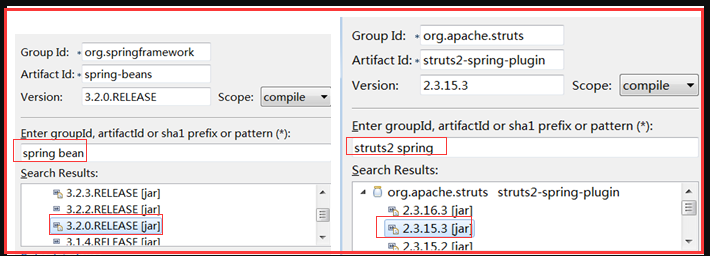

## 一、Maven 坐标

### 1.1、数学中的坐标

在平面上，使用 X 、Y 两个向量可以唯一的定位平面中的任何一个点

在空间中，使用 X、Y、Z 三个向量可以唯一的定位空间中的任意一个点

### 1.2、Maven 中的坐标

俗称 gav：使用下面三个向量子仓库中唯一定位一个 Maven 工程

在项目中的 pom.xml 文件中，我们可以看到下面 gav 的定义：

1）`groupid`:公司或组织域名倒序

`<groupid>`com.zyh.maven`</groupid>`

2）`artifactid`:模块名，也是实际项目的名称

`<artifactid>`Maven_ch01`</artifactid>`
　　　　 3）`version`:当前项目的版本
　　　　　　`<version>`0.0.1-SNAPSHOT`</version>`
　　　　

### 1.3、Maven 坐标和仓库，jar 包的关系

仓库是 Maven 用来**存放 jar 包的地方**。

那么依照上面定义的 gav，我们执行 mvn -install 命令，会出现什么情况呢？

首先进入到**我们 Maven 的安装配置 ，通过 settings.xml 文件配置的仓库目录**。

将我们上面配置的 gav 向量组合起来就是目录：

```
　　com\zyh\maven\Maven-ch01\1.0-SNAPSHOT　　
```


其次，我们观察打出来的 jar 包：Maven-ch01-1.0-SNAPSHOT.jar

也就是 artifactid-version.jar

## 二、依赖

什么是 依赖？相信有过一定开发经验的人知道，每当我们需要使用某个框架时，比如 SpringMVC，那么我们需要导入相应的 jar 包，但是手动导入包的时候，往往会漏掉几个 jar 包，

那么在使用该框架的时候系统就会报错。那么我们就说导入的包与未导入的包存在依赖关系。而使用 Maven,我们只需要在 pom.xml 文件中进行相应的配置，它就会帮助我们自动管理 jar 包之间的依赖关系。

### 2.1、依赖的详细配置

为了避免不知道说的哪些配置属性，看下面图就明白了，就是 dependency 下的属性配置，全部有 9 个，讲其中的 7 个。


以 Junit 为例，在 pom.xml 文件中进行详细而完整的配置

```
<project>
    <dependencies>
        <dependency>
            <groupId>junit</groupId>
            <artifactId>junit</artifactId>
            <version>3.8.1</version>
            <type>...</type>
            <scope>...</scope>
            <optional>...</optional>
            <exclusions>
                <exclusion>
                  <groupId>...</groupId>
                  <artifactId>...</artifactId>
                </exclusion>
          </exclusions>
        </dependency>
      </dependencies>
</project>
```

1）`groupId、artifactId、version`是依赖的基本坐标，缺一不可，这三个可以不用将，都知道，重要的是除了这三个之外的配置属性需要我们理解

2）**type：依赖的类型，比如是 jar 包还是 war 包等**

默认为 jar，表示依赖的 jar 包

注意：`<type>`pom.lastUpdated`</type>` 这个我们在上面添加 servlet-jar 的时候就遇到过，看到 lastUpdated 的意思是表示使用更新描述信息，占位符作用，通俗点讲，选择该类型，

jar 包不会被加载进来，只是将该 jar 包的一些描述信息加载进来，使别的 jar 包在引用他时，能够看到一些相关的提示信息，仅此而已，所以说他是个占位符，只要记住他的 jar 包不会被加载进来。

3）**optional：标记依赖是否可选。默认值 false**

比如 struts2 中内置了 log4j 这个记录日志的功能，就是将 log4j 内嵌入 struts2 的 jar 包中，而 struts2 有没有 log4j 这个东西都没关系，有它，提示的信息更多，没它，也能够运行，

只是提示的信息就相对而言少一些，所以这个时候，就可以对它进行可选操作，想要它就要，不想要，就设置为 false。

4）**exclusions：排除传递依赖，解决 jar 冲突问题**

依赖传递的意思就是，A 项目 依赖 B 项目，B 项目 依赖 C 项目，当使用 A 项目时，就会把 B 也给加载进来，这是传递依赖，依次类推，C 也会因此给加载进来。

这个有依赖传递有好处，也有坏处，坏处就是 jar 包的冲突问题，比如，A 依赖 B(B 的版本为 1)，C 依赖 B(B 的版本为 2)，如果一个项目同时需要 A 和 C，那么 A,C 都会传递依赖将 B 给加载进来，

问题就在这里，两个 B 的版本不一样，将两个都加载进去就会引起冲突，这时候就需要使用 exclusions 这个属性配置了。maven 也会有一个机制避免两个都加载进去，

**maven 默认配置在前面的优先使用**，但是我们还是需要使用 exclusions 来配置更合理，这里使用 spring bean 和 struts2 spring plugin 来举例子说明这个问题并使用 exclusions 解决这个问题。

（spring bean 和 struts2 spring plugin 都需要依赖 spring-core，但版本不一样）

从本地仓库中找到这两个 jar 包



maven 自己的解决方案如下：

maven 默认配置在前面的优先使用，下面是证明

先将 spring-beans 加载进去的，所以会将 spring-beans 依赖的 spring-core 的版本加载进来。


先将 struts2-spring-plugin 加载进来，那么就会将其依赖的 spring-core 的版本加载进来


**使用 exclusions 来配置**

即使 struts2-spring-plugin 配置在前面，也需要使用 3.2.0 版本。则需要为 struts2-spring-plugin 排除依赖（不使用 3.0.5 依赖)


**注意：这样，就将 struts2-spring-plugin 依赖的 spring-core 的版本排除依赖了，也就是该依赖的 spring-core 不会在加载进来，查看代码，看是否符合要求，如果不符合要求，需要手动的修改**　　　　

### 2.2、依赖的范围 scope

scope：依赖范围，意思就是通过 pom.xml 加载进来的 jar 包，来什么范围内使用生效，范围包括编译时，运行时，测试时


一般情况下，我们对前面三个依赖用的比较多。下面的主程序表示 maven 目录结构 src/main/java.测试程序目录结构为：src/test/java

1）**compile 范围依赖**
　　对主程序是否有效：有效
　　对测试程序是否有效：有效
　　是否参与打包：参与
　　是否参与部署：参与
　　典型例子：log4j

默认值，如果选择此值，**表示编译、测试和运行都使用当前 jar**
2）**test 范围依赖**
　　对主程序是否有效：无效
　　对测试程序是否有效：有效
　　是否参与打包：不参与
　　是否参与部署：不参与
　　典型例子：Junit

表示只在**测试时当前 jar 生效，在别的范围内就不能使用该 jar 包。**例如：junit 。此处不写也不报错，因为默认是 compile，compile 包扩了测试
3）**provided 范围依赖**
　　对主程序是否有效：有效
　　对测试程序是否有效：有效
　　是否参与打包：不参与
　　是否参与部署：不参与
　　典型例子：servlet-api.jar，一般在发布到 服务器中，比如 tomcat，服务器会自带 servlet-api.jar 包，所以 provided 范围依赖只在编译测试有效。

**表示编译和测试时使用当前 jar，运行时不在使用该 jar 了。**例如：servlet-api、jsp-api 等。

分析：

什么意思呢？ 在我们以前创建 web 工程，编写`servlet`或者`jsp`时，就没导入过 jar 包把，因为 myeclipse 或者别的 ide 帮我们提供了这两个 jar 包，内置了，

所以我们在编译期测试期使用 servlet 都不会报缺少 jar 包的错误，而在运行时期，离开了 myeclipse 或别的 ide，就相当于缺失了这两个 jar 包，但此时 tomcat 又会帮我们提供这两个 jar，以便我们不会报错，所以，这两个很特殊。看图

1）开发阶段(MyEclipse 提供)，看下图以此证明我们说的

java web 5.0 项目：

java web 6.0 项目：

2）运行阶段(tomcat 提供)


所以，根据这个特点，如果使用 maven 开发项目，就不是 web 项目了，那么 myeclipse 就不会在给我们提供这两个 jar 包，我们就必须自己手动通过坐标从仓库中获取，

但是针对上面的分析，当运行的时候，tomcat 会帮我们提供这两个 jar 包，所以我们自己从仓库中获取的 jar 包就不能和 tomcat 中的冲突，

那么就正好可以通过 provided 这个属性，来设置这两个 jar 的作用范围，就是在变异时期和测试时期生效即可。这个例子就可以解释上面创建 maven web 时产生的错误和解决方案了。

4）**runtime 范围依赖**
　　在**测试、运行的时候依赖，在编译的时候不依赖。**例如：JDBC 驱动，项目代码只需要 jdk 提供的 jdbc 接口，只有在执行测试和运行项目的时候才需要实现 jdbc 的功能。

表示测试和运行时使用当前 jar，编译时不用该 jar 包。例如：JDBC 驱动。JDBC 驱动，在编译时(也就是我们写代码的时候都是采用接口编程，压根就没使用到 JDBC 驱动包内任何东西，

只有在运行时才用的到，所以这个是典型的使用 runtime 这个值的例子)，此处不写也不报错，理由同上。

5）表示我们自己手动加入的 jar 包，不属于 maven 仓库(本地，第三方等)，属于别得类库的这样的 jar 包，只在编译和测试期生效，运行时无效。一般不用

## 三、依赖传递

比如我们创建三个 Maven 工程，maven-first,maven-second 以及 maven-third,而 third 依赖于 second，second 又依赖于 first，

那么我们说 second 是 third 的第一直接依赖，first 是 second 的第二直接依赖。而 first 是 third 的间接依赖。


依赖之间的传递如下图：第一列表示第一直接依赖，第一行表示第二直接依赖


总结如下:

当第二依赖的范围是 compile 的时候，传递性依赖的范围与第一直接依赖的范围一致。
　　　　当第二直接依赖的范围是 test 的时候，依赖不会得以传递。
　　　　当第二依赖的范围是 provided 的时候，只传递第一直接依赖范围也为 provided 的依赖，且传递性依赖的范围同样为 provided；
　　　　当第二直接依赖的范围是 runtime 的时候，传递性依赖的范围与第一直接依赖的范围一致，但 compile 例外，此时传递的依赖范围为 runtime；

## 四、调节原则

这个就是 maven 解决传递依赖时 jar 包冲突问题的方法，按照两种原则，上面已经介绍了一种了，就是下面的第二原则

1）第一原则：路径近者优先原则

A-->B-->C-->D-->X(1.6)

E-->D-->X(2.0)

使用 X(2.0)，因为其路径更近

2）第二原则：第一声明者优先原则。就是如果路径相同，maven 默认配置在前面的优先使用

A-->B --> X(1.6)

C-->D--> X(2.0)

这样就是路径相同，那么如果 A 在前面，C 在后面，则使用 X(1.6)

maven 会先根据第一原则进行选择，第一原则不成，则按第二原则处理。
