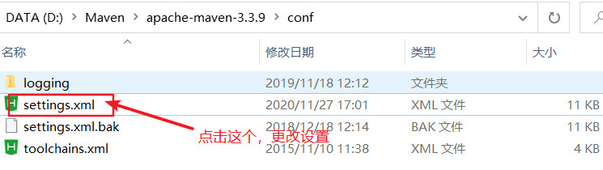
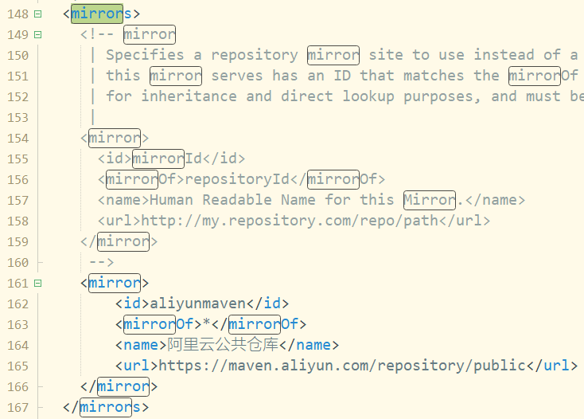

Maven 是一个基于 Java 的工具，所以要做的第一件事情就是安装 JDK。

### 系统要求

| 项目     | 要求                                                                                                                                    |
| :------- | :-------------------------------------------------------------------------------------------------------------------------------------- |
| JDK      | Maven 3.3 要求 JDK 1.7 或以上 Maven 3.2 要求 JDK 1.6 或以上 Maven 3.0/3.1 要求 JDK 1.5 或以上                                           |
| 内存     | 没有最低要求                                                                                                                            |
| 磁盘     | Maven 自身安装需要大约 10 MB 空间。除此之外，额外的磁盘空间将用于你的本地 Maven 仓库。你本地仓库的大小取决于使用情况，但预期至少 500 MB |
| 操作系统 | 没有最低                                                                                                                                |

### 检查 Java 安装

| 操作系统 | 任务           | 命令                 |
| :------- | :------------- | :------------------- |
| Windows  | 打开命令控制台 | `c:\> java -version` |
| Linux    | 打开命令终端   | `# java -version`    |
| Mac      | 打开终端       | `$ java -version`    |

### 设置 Maven 环境变量

windows 添加环境变量 MAVEN_HOME：

右键 "计算机"，选择 "属性"，之后点击 "高级系统设置"，点击"环境变量"，来设置环境变量，有以下系统变量需要配置：新建系统变量 **MAVEN_HOME**，变量值：**E:\Maven\apache-maven-3.3.9**编辑系统变量 **Path**，添加变量值：**;%MAVEN_HOME%\bin****注意：**注意多个值之间需要有分号隔开，然后点击确定。

linux 添加 Maven 环境变量

下载解压：`# wget http://mirrors.hust.edu.cn/apache/maven/maven-3/3.3.9/binaries/apache-maven-3.3.9-bin.tar.gz`

`# tar -xvf apache-maven-3.3.9-bin.tar.gz`

`# sudo mv -f apache-maven-3.3.9 /usr/local/`编辑 **/etc/profile** 文件 **sudo vim /etc/profile**，在文件末尾添加如下代码：`export MAVEN_HOME=/usr/local/apache-maven-3.3.9 export PATH=${PATH}:${MAVEN_HOME}/bin`保存文件，并运行如下命令使环境变量生效：

`# source /etc/profile`

在控制台输入如下命令，如果能看到 Maven 相关版本信息，则说明 Maven 已经安装成功：`# mvn -v`

## 更改 Maven 仓库位置

```
maven/conf/settings.xml
```



查找关键字 mirrors,更改仓库换成阿里仓库

```
<mirror>
	    <id>aliyunmaven</id>
	    <mirrorOf>*</mirrorOf>
	    <name>阿里云公共仓库</name>
	    <url>https://maven.aliyun.com/repository/public</url>
	</mirror>
  </mirrors>
```


