## Mybatis 入门

### 1. 什么是 MyBatis

MyBatis 本是 apache 的一个开源项目 iBatis, 2010 年这个项目由 apache software foundation 迁移到了 google code，并且改名为 MyBatis。是一个基于 Java 的持久层框架

### 2. 为什么我们要用 Mybatis？

无论是 Mybatis、Hibernate 都是 ORM 的一种实现框架，都是对 JDBC 的一种封装！

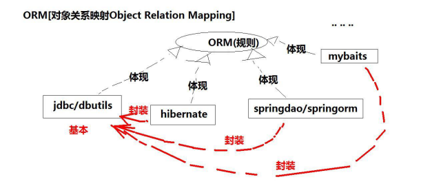

到目前为止，我们已经在持久层中学了几种技术了...

- Hibernate
- jdbc
- SpringDAO
  那我们为啥还要学 Mybatis 呢？？？现在 Mybatis 在业内大行其道，那为啥他能那么火呢？？
  Hibernate 是一个比较老旧的框架，用过他的同学都知道，只要你会用，用起来十分舒服...啥 sql 代码都不用写...但是呢，它也是有的缺点：：**处理复杂业务时，灵活度差, 复杂的 HQL 难写难理解，例如多表查询的 HQL 语句**
  而 JDBC 很容易理解，就那么几个固定的步骤，就是开发起来太麻烦了，因为什么都要我们自己干..

我们可以认为，**Mybatis 就是 jdbc 和 Hibernate 之间的一个平衡点**...毕竟现在业界都是用这个框架，我们也不能不学呀！

### 3. Mybatis 快速入门

其实我们已经学过了 Hibernate 了，对于 Mybatis 入门其实就非常类似的。因此就很简单就能掌握基本的开发了...

#### 3.1 导入开发包

更新：如果用 Maven 的同学，这里引入 maven 依赖就好了
导入 Mybatis 开发包

- mybatis-3.1.1.jar
- commons-logging-1.1.1.jar
- log4j-1.2.16.jar
- cglib-2.2.2.jar
- asm-3.3.1.jar
  导入 mysql/oracle 开发包
- mysql-connector-java-5.1.7-bin.jar
- Oracle 11g 11.2.0.1.0 JDBC_ojdbc6.jar

#### 3.2 准备测试工作

创建一张表

```sql
     create table students(
     id int(5) primary key,
     name varchar(10),
     sal double(8,2)
     );
```

创建实体：

```java
/**
 * Created by ozc on 2017/7/21.
 */
public class Student {
private Integer id;
private String name;
private Double sal;

    public Student() {
    }

    public Integer getId() {
        return id;
    }

    public void setId(Integer id) {
        this.id = id;
    }

    public String getName() {
        return name;
    }

    public void setName(String name) {
        this.name = name;
    }

    public Double getSal() {
        return sal;
    }

    public void setSal(Double sal) {
        this.sal = sal;
    }

}
```

#### 3.3 创建 mybatis 配置文件

创建 mybatis 的配置文件，配置数据库的信息....数据库我们可以配置多个，但是默认的只能用一个...

```xml
<?xml version="1.0" encoding="UTF-8"?>
<!DOCTYPE configuration PUBLIC "-//mybatis.org//DTD Config 3.0//EN"
"http://mybatis.org/dtd/mybatis-3-config.dtd">

<configuration>


	<!-- 加载类路径下的属性文件 -->
	<properties resource="db.properties"/>

	<!-- 设置一个默认的连接环境信息 -->
	<environments default="mysql_developer">
		<!-- 连接环境信息，取一个任意唯一的名字 -->
		<environment id="mysql_developer">
			<!-- mybatis使用jdbc事务管理方式 -->
			<transactionManager type="jdbc"/>
			<!-- mybatis使用连接池方式来获取连接 -->
			<dataSource type="pooled">
				<!-- 配置与数据库交互的4个必要属性 -->
				<property name="driver" value="${mysql.driver}"/>
				<property name="url" value="${mysql.url}"/>
				<property name="username" value="${mysql.username}"/>
				<property name="password" value="${mysql.password}"/>
			</dataSource>
		</environment>


<!-- 连接环境信息，取一个任意唯一的名字 -->
<environment id="oracle_developer">
<!-- mybatis使用jdbc事务管理方式 -->
<transactionManager type="jdbc"/>
<!-- mybatis使用连接池方式来获取连接 -->
<dataSource type="pooled">
<!-- 配置与数据库交互的4个必要属性 -->
<property name="driver" value="${oracle.driver}"/>
<property name="url" value="${oracle.url}"/>
<property name="username" value="${oracle.username}"/>
<property name="password" value="${oracle.password}"/>
</dataSource>
</environment>
</environments>


</configuration>
```

#### 3.4 编写工具类测试是否获取到连接

使用 Mybatis 的 API 来创建一个工具类，通过 mybatis 配置文件与数据库的信息，得到 Connection 对象

```java
package cn.itcast.javaee.mybatis.util;

import java.io.IOException;
import java.io.Reader;
import java.sql.Connection;
import org.apache.ibatis.io.Resources;
import org.apache.ibatis.session.SqlSession;
import org.apache.ibatis.session.SqlSessionFactory;
import org.apache.ibatis.session.SqlSessionFactoryBuilder;
/**
 * 工具类
 * @author AdminTC
 */
public class MybatisUtil {
	private static ThreadLocal<SqlSession> threadLocal = new ThreadLocal<SqlSession>();
	private static SqlSessionFactory sqlSessionFactory;
	/**
	 * 加载位于src/mybatis.xml配置文件
	 */
	static{
		try {
			Reader reader = Resources.getResourceAsReader("mybatis.xml");
			sqlSessionFactory = new SqlSessionFactoryBuilder().build(reader);
		} catch (IOException e) {
			e.printStackTrace();
			throw new RuntimeException(e);
		}
	}
	/**
	 * 禁止外界通过new方法创建
	 */
	private MybatisUtil(){}
	/**
	 * 获取SqlSession
	 */
	public static SqlSession getSqlSession(){
		//从当前线程中获取SqlSession对象
		SqlSession sqlSession = threadLocal.get();
		//如果SqlSession对象为空
		if(sqlSession == null){
			//在SqlSessionFactory非空的情况下，获取SqlSession对象
			sqlSession = sqlSessionFactory.openSession();
			//将SqlSession对象与当前线程绑定在一起
			threadLocal.set(sqlSession);
		}
		//返回SqlSession对象
		return sqlSession;
	}
	/**
	 * 关闭SqlSession与当前线程分开
	 */
	public static void closeSqlSession(){
		//从当前线程中获取SqlSession对象
		SqlSession sqlSession = threadLocal.get();
		//如果SqlSession对象非空
		if(sqlSession != null){
			//关闭SqlSession对象
			sqlSession.close();
			//分开当前线程与SqlSession对象的关系，目的是让GC尽早回收
			threadLocal.remove();
		}
	}
	/**
	 * 测试
	 */
	public static void main(String[] args) {
		Connection conn = MybatisUtil.getSqlSession().getConnection();
		System.out.println(conn!=null?"连接成功":"连接失败");
	}
}
```

#### 3.5 创建实体与映射关系文件

配置实体与表的映射关系

```xml
<?xml version="1.0" encoding="UTF-8" ?>
<!DOCTYPE mapper PUBLIC "-//mybatis.org//DTD Mapper 3.0//EN"
"http://mybatis.org/dtd/mybatis-3-mapper.dtd">
<!-- namespace属性是名称空间，必须唯一 -->
<mapper namespace="cn.javaee.mybatis.Student">


	<!-- resultMap标签:映射实体与表
		 type属性：表示实体全路径名
		 id属性：为实体与表的映射取一个任意的唯一的名字
	-->
	<resultMap type="student" id="studentMap">
		<!-- id标签:映射主键属性
			 result标签：映射非主键属性
		     property属性:实体的属性名
		     column属性：表的字段名
		-->
		<id property="id" column="id"/>
		<result property="name" column="name"/>
		<result property="sal" column="sal"/>
	</resultMap>

</mapper>
```

现在我们已经有了 Mybatis 的配置文件和表与实体之前的映射文件了，因此我们要将配置文件和映射文件关联起来

```xml
	<mappers>
		<mapper resource="StudentMapper.xml"/>
	</mappers>
```

在测试类上，我们是可以获取得到连接的

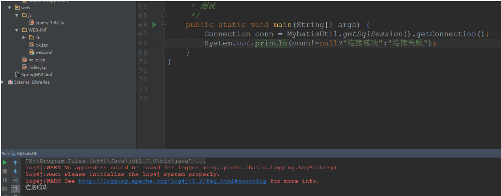

#### 3.6 编写 DAO

```java
public class StudentDao {

    public void add(Student student) throws Exception {
        //得到连接对象
        SqlSession sqlSession = MybatisUtil.getSqlSession();
        sqlSession.insert();
    }

    public static void main(String[] args) throws Exception {

        StudentDao studentDao = new StudentDao();

        Student student = new Student(1, "zhongfucheng", 10000D);
        studentDao.add(student);

    }

}
```

到现在为止，我们实体与表的映射文件仅仅映射了实体属性与表的字段的关系...
我们在 Hibernate 中如果想要插入数据什么的，只要调用 save()方法就行了。Hibernate 是自动化屏蔽掉了数据库的差异，而我们 **Mybatis 是需要自己手动编写 SQL 代码的...**
那么 SQL 代码是写在哪里的呢？？？明显地，我们作为一个框架，不可能在程序中写 SQL，我们是在实体与表的映射文件中写的！  
**Mybatis 实体与表的映射文件中提供了 insert 标签【SQL 代码片段】供我们使用**  
//在 JDBC 中我们通常使用?号作为占位符，而在 Mybatis 中，我们是使用#{}作为占位符  
//parameterType 我们指定了传入参数的类型  
//#{}实际上就是调用了 Student 属性的`get` 方法

```
    <insert id="add" parameterType="Student">

    	INSERT INTO ZHONGFUCHENG.STUDENTS (ID, NAME, SAL) VALUES (#{id},#{name},#{sal});
    </insert>
```

在程序中调用映射文件的 SQL 代码片段

```java
public void add(Student student) throws Exception {
//得到连接对象
SqlSession sqlSession = MybatisUtil.getSqlSession();
try{
//映射文件的命名空间.SQL 片段的 ID，就可以调用对应的映射文件中的 SQL
sqlSession.insert("StudentID.add", student);
sqlSession.commit();
}catch(Exception e){
e.printStackTrace();
sqlSession.rollback();
throw e;
}finally{
MybatisUtil.closeSqlSession();
}
}
```

值得注意的是：**Mybatis 中的事务是默认开启的，因此我们在完成操作以后，需要我们手动去提交事务！**

### 4. Mybatis 工作流程

- 通过 Reader 对象读取 Mybatis 映射文件
- 通过 SqlSessionFactoryBuilder 对象创建 SqlSessionFactory 对象
- 获取当前线程的 SQLSession
- 事务默认开启
- 通过 SQLSession 读取映射文件中的操作编号，从而读取 SQL 语句
- 提交事务
- 关闭资源

### 5. 完成 CRUD 操作

我们在上面中已经简单知道了 Mybatis 是怎么使用的以及工作流程了，这次我们使用 Mybatis 来完成 CRUD 的操作，再次巩固 Mybatis 的开发步骤以及一些细节
包与类之间的结构

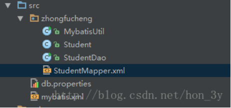

#### 5.1 增加学生

配置文件

```xml
<?xml version="1.0" encoding="UTF-8"?>
<!DOCTYPE configuration PUBLIC "-//mybatis.org//DTD Config 3.0//EN"
"http://mybatis.org/dtd/mybatis-3-config.dtd">

<configuration>
	<!-- 加载类路径下的属性文件 -->
	<properties resource="db.properties"/>

	<!-- 设置一个默认的连接环境信息 -->
	<environments default="mysql_developer">
		<!-- 连接环境信息，取一个任意唯一的名字 -->
		<environment id="mysql_developer">
			<!-- mybatis使用jdbc事务管理方式 -->
			<transactionManager type="jdbc"/>
			<!-- mybatis使用连接池方式来获取连接 -->
			<dataSource type="pooled">
				<!-- 配置与数据库交互的4个必要属性 -->
				<property name="driver" value="${mysql.driver}"/>
				<property name="url" value="${mysql.url}"/>
				<property name="username" value="${mysql.username}"/>
				<property name="password" value="${mysql.password}"/>
			</dataSource>
		</environment>


		<!-- 连接环境信息，取一个任意唯一的名字 -->
		<environment id="oracle_developer">
			<!-- mybatis使用jdbc事务管理方式 -->
			<transactionManager type="jdbc"/>
			<!-- mybatis使用连接池方式来获取连接 -->
			<dataSource type="pooled">
				<!-- 配置与数据库交互的4个必要属性 -->
				<property name="driver" value="${oracle.driver}"/>
				<property name="url" value="${oracle.url}"/>
				<property name="username" value="${oracle.username}"/>
				<property name="password" value="${oracle.password}"/>
			</dataSource>
		</environment>
	</environments>
	<mappers>
		<mapper resource="zhongfucheng/StudentMapper.xml"/>
	</mappers>
</configuration>
```

映射文件

```xml
<!-- namespace属性是名称空间，必须唯一 -->
<mapper namespace="StudentID">

	<!-- resultMap标签:映射实体与表
		 type属性：表示实体全路径名
		 id属性：为实体与表的映射取一个任意的唯一的名字
	-->
	<resultMap type="zhongfucheng.Student" id="studentMap">
		<!-- id标签:映射主键属性
			 result标签：映射非主键属性
		     property属性:实体的属性名
		     column属性：表的字段名
		-->
		<id property="id" column="id"/>
		<result property="name" column="name"/>
		<result property="sal" column="sal"/>
	</resultMap>

	<insert id="add" parameterType="zhongfucheng.Student">
		INSERT INTO ZHONGFUCHENG.STUDENTS (ID, NAME, SAL) VALUES (#{id},#{name},#{sal});
	</insert>

</mapper>
```

插入数据

```java
public class StudentDao {

    public void add(Student student) throws Exception {
        //得到连接对象
        SqlSession sqlSession = MybatisUtil.getSqlSession();
        try{
            //映射文件的命名空间.SQL片段的ID，就可以调用对应的映射文件中的SQL
            sqlSession.insert("StudentID.add", student);
            sqlSession.commit();
        }catch(Exception e){
            e.printStackTrace();
            sqlSession.rollback();
            throw e;
        }finally{
            MybatisUtil.closeSqlSession();
        }
    }
    public static void main(String[] args) throws Exception {
        StudentDao studentDao = new StudentDao();
        Student student = new Student(3, "zhong3", 10000D);
        studentDao.add(student);
    }
}
```

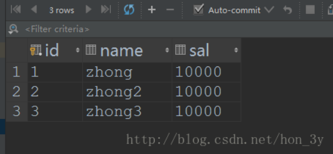

#### 5.2 根据 ID 查询数据

增加 select 标签

```
	<!--
		查询根据id
		resultMap这个属性代表是返回值类型，返回值的类型是Student，就是上面实体类型
	-->
	<select id="findById" parameterType="int" resultMap="studentMap">
		SELECT * FROM STUDENTS WHERE id = #{id};
	</select>
```

查询出来的结果是一个 Student 对象，我们调用 SelectOne 方法

```java
    public Student findById(int id) throws Exception {
        //得到连接对象
        SqlSession sqlSession = MybatisUtil.getSqlSession();
        try{
            //映射文件的命名空间.SQL片段的ID，就可以调用对应的映射文件中的SQL
            return sqlSession.selectOne("StudentID.findById",id);
        }catch(Exception e){
            e.printStackTrace();
            sqlSession.rollback();
            throw e;
        }finally{
            MybatisUtil.closeSqlSession();
        }
    }
    public static void main(String[] args) throws Exception {
        StudentDao studentDao = new StudentDao();
        Student student = studentDao.findById(1);
        System.out.println(student.getName());

    }
```

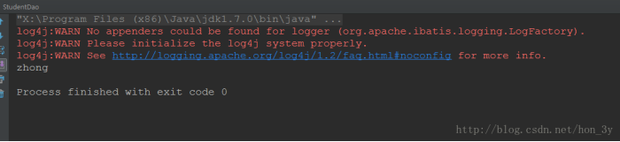

#### 5.3 查询所有数据

```
	<!--
		查询所有数据
		返回值类型讲道理是List<Student>的，但我们只要写集合中的类型就行了
	-->
	<select id="findAll" resultMap="studentMap">
		SELECT * FROM STUDENTS;
	</select>
```

我们查询出来的结果不单单只有一个对象了，因此我们使用的是 SelectList 这个方法

```java
  public List<Student> findAll() throws Exception {
        //得到连接对象
        SqlSession sqlSession = MybatisUtil.getSqlSession();
        try{
            //映射文件的命名空间.SQL片段的ID，就可以调用对应的映射文件中的SQL
            return sqlSession.selectList("StudentID.findAll");
        }catch(Exception e){
            e.printStackTrace();
            sqlSession.rollback();
            throw e;
        }finally{
            MybatisUtil.closeSqlSession();
        }
    }
    public static void main(String[] args) throws Exception {
        StudentDao studentDao = new StudentDao();
        List<Student> students = studentDao.findAll();
        System.out.println(students.size());

    }
```

#### 5.4 根据 id 删除

```sql
	<!--根据id删除-->
	<delete id="delete" parameterType="int">
		DELETE FROM STUDENTS WHERE id=#{id};

	</delete>
```

调用 delete 方法删除

```java
    public void delete(int id ) throws Exception {
        //得到连接对象
        SqlSession sqlSession = MybatisUtil.getSqlSession();
        try{
            //映射文件的命名空间.SQL片段的ID，就可以调用对应的映射文件中的SQL
            sqlSession.delete("StudentID.delete", id);
            sqlSession.commit();
        }catch(Exception e){
            e.printStackTrace();
            sqlSession.rollback();
            throw e;
        }finally{
            MybatisUtil.closeSqlSession();
        }
    }
    public static void main(String[] args) throws Exception {
        StudentDao studentDao = new StudentDao();
        studentDao.delete(1);

    }

```

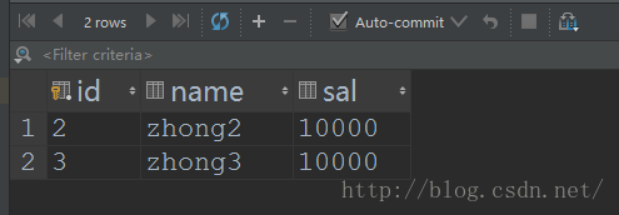

#### 5.5 修改

```sql
	<!--更新-->
	<update id="update" parameterType="zhongfucheng.Student">

		update students set name=#{name},sal=#{sal} where id=#{id};

	</update>
```

查询出对应的对象，对其进行修改

```java
    public void update(Student student ) throws Exception {
        //得到连接对象
        SqlSession sqlSession = MybatisUtil.getSqlSession();
        try{
            //映射文件的命名空间.SQL片段的ID，就可以调用对应的映射文件中的SQL
            sqlSession.update("StudentID.update", student);
            sqlSession.commit();
        }catch(Exception e){
            e.printStackTrace();
            sqlSession.rollback();
            throw e;
        }finally{
            MybatisUtil.closeSqlSession();
        }
    }
    public static void main(String[] args) throws Exception {
        StudentDao studentDao = new StudentDao();
        Student student = studentDao.findById(2);
        student.setName("fucheng");
        student.setSal(2000D);
        studentDao.update(student);

    }

```

#### 5.6 小细节

注意：这个 insert/update/delete 标签只是一个模板，在做操作时，其实是以 SQL 语句为核心的
即在做增/删/时，insert/update/delete 标签可通用，
但做查询时只能用 select 标签
我们提倡什么操作就用什么标签

#### 5.7Mybatis 分页

分页是一个非常实用的技术点，我们也来学习一下使用 Mybatis 是怎么分页的...  
我们的分页是需要多个参数的，并不是像我们之前的例子中只有一个参数。当需要接收多个参数的时候，我们使用 Map 集合来装载！

```java
    public List<Student>  pagination(int start ,int end) throws Exception {
        //得到连接对象
        SqlSession sqlSession = MybatisUtil.getSqlSession();
        try{
            //映射文件的命名空间.SQL片段的ID，就可以调用对应的映射文件中的SQL


            /**
             * 由于我们的参数超过了两个，而方法中只有一个Object参数收集
             * 因此我们使用Map集合来装载我们的参数
             */
            Map<String, Object> map = new HashMap();
            map.put("start", start);
            map.put("end", end);
            return sqlSession.selectList("StudentID.pagination", map);
        }catch(Exception e){
            e.printStackTrace();
            sqlSession.rollback();
            throw e;
        }finally{
            MybatisUtil.closeSqlSession();
        }
    }
    public static void main(String[] args) throws Exception {
        StudentDao studentDao = new StudentDao();
        List<Student> students = studentDao.pagination(0, 3);
        for (Student student : students) {

            System.out.println(student.getId());

        }

    }
```

那么在实体与表映射文件中，我们接收的参数就是 map 集合

```sql
	<!--分页查询-->
	<select id="pagination" parameterType="map" resultMap="studentMap">

		/*根据key自动找到对应Map集合的value*/
		select * from students limit #{start},#{end};

	</select>
```

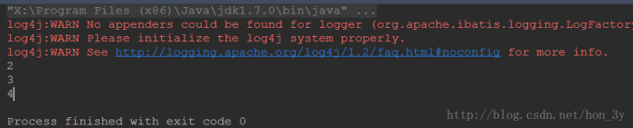

### 6. 动态 SQL

何为动态 SQL？？回顾一下我们之前写的 SSH 项目中，有多条件查询的情况，如下图

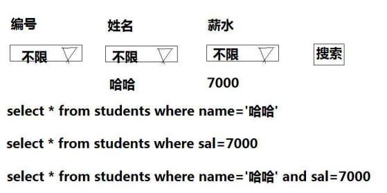

我们当时刚开始做的时候，是需要在 Controller 中判断 SQL 是否已经有条件了，因为 SQL 语句需要拼接起来....这样干的话，就非常容易出错的。
如下的代码，如果有多个条件的话，那么拼接起来很容易出错！

```java
  public String listUI() {

        //查询语句
        String hql = "FROM Info i ";
        List<Object> objectList  = new ArrayList<>();

        //根据info是否为null来判断是否是条件查询。如果info为空，那么是查询所有。
        if (info != null) {
            if (StringUtils.isNotBlank(info.getTitle())) {
                hql += "where i.title like ?";
                objectList.add("%" + info.getTitle() + "%");
            }
        }
        infoList = infoServiceImpl.findObjects(hql,objectList);
        ActionContext.getContext().getContextMap().put("infoTypeMap", Info.INFO_TYPE_MAP);
        return "listUI";
    }
```

后来，我们觉得这样不好，于是就专门写了一个查询助手类：

```java
package zhongfucheng.core.utils;

import java.util.ArrayList;
import java.util.List;

/**
 * Created by ozc on 2017/6/7.
 */
public class QueryHelper {

    private String fromClause = "";
    private String whereClause = "";
    private String orderbyClause = "";
    private List<Object> objectList;

    public static String ORDER_BY_ASC = "asc";
    public static String ORDER_BY_DESC = "desc";


    //FROM子句只出现一次
    /**
     * 构建FROM字句，并设置查询哪张表
     * @param aClass 用户想要操作的类型
     * @param alias  别名
     */
    public QueryHelper(Class aClass, String alias) {
        fromClause = "  FROM " + aClass.getSimpleName() + "  " + alias;
    }
    //WHERE字句可以添加多个条件，但WHERE关键字只出现一次
    /**
     * 构建WHERE字句
     * @param condition
     * @param objects
     * @return
     */
    public QueryHelper addCondition(String condition, Object... objects) {
        //如果已经有字符了，那么就说明已经有WHERE关键字了
        if (whereClause.length() > 0) {
            whereClause += " AND  " + condition;
        } else {
            whereClause += " WHERE" + condition;
        }
        //在添加查询条件的时候，?对应的查询条件值
        if (objects == null) {
            objectList = new ArrayList<>();
        }

        for (Object object : objects) {
            objectList.add(object);
        }

        return this;
    }
    /**
     *
     * @param property 要排序的属性
     * @param order 是升序还是降序
     * @return
     */
    public QueryHelper orderBy(String property, String order) {

        //如果已经有字符了，那么就说明已经有ORDER关键字了
        if (orderbyClause.length() > 0) {
            orderbyClause += " ,  " + property +"   " + order;
        } else {
            orderbyClause += "  ORDER BY " + property+"   " + order;
        }
        return this;
    }

    /**
     * 返回HQL语句
     */
    public String returnHQL() {
        return fromClause + whereClause + orderbyClause;
    }

    /**
     * 得到参数列表
     * @return
     */
    public List<Object> getObjectList() {
        return objectList;
    }
}
```

这样一来的话，我们就不用自己手动拼接了，给我们的查询助手类去拼接就好了。
而如果我们使用 Mybatis 的话，就可以免去查询助手类了。因为 Mybatis 内部就有动态 SQL 的功能【动态 SQL 就是自动拼接 SQL 语句】！

#### 6.1 动态查询

```sql
	<!--多条件查询【动态SQL】-->
	<!--会自动组合成一个正常的WHERE字句-->
	<!--name值会从map中寻找-->

	<select id="findByCondition" resultMap="studentMap" parameterType="map">

		select * from students

		<where>
			<if test="name!=null">
				and name=#{name}
			</if>
			<if test="sal!=null">
				and sal < #{sal}
			</if>
		</where>

	</select>
```

查询出来小于 9000 块的人

```java
   public List<Student> findByCondition(String name,Double sal) throws Exception {
        //得到连接对象
        SqlSession sqlSession = MybatisUtil.getSqlSession();
        try{
            //映射文件的命名空间.SQL片段的ID，就可以调用对应的映射文件中的SQL
            /**
             * 由于我们的参数超过了两个，而方法中只有一个Object参数收集
             * 因此我们可以使用Map集合来装载我们的参数
             */
            Map<String, Object> map = new HashMap();
            map.put("name", name);
            map.put("sal", sal);
            return sqlSession.selectList("StudentID.findByCondition", map);
        }catch(Exception e){
            e.printStackTrace();
            sqlSession.rollback();
            throw e;
        }finally{
            MybatisUtil.closeSqlSession();
        }
    }
    public static void main(String[] args) throws Exception {
        StudentDao studentDao = new StudentDao();
        List<Student> students = studentDao.findByCondition(null,9000D);
        for (Student student : students) {
            System.out.println(student.getId() + "---" + student.getName() + "----" + student.getSal());
        }
    }

```

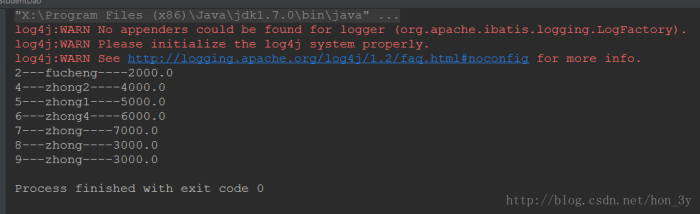

#### 6.2 动态更新

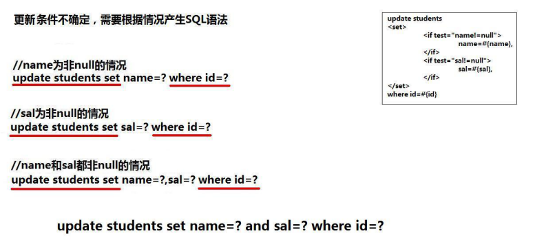

```sql
	<!--动态更新-->
	<!--不要忘了逗号-->
	<update id="updateByConditions" parameterType="map">

		update students
		<set>
			<if test="name!=null">
				 name = #{name},
			</if>
			<if test="sal!=null">
				 sal = #{sal},
			</if>
		</set>
		where id = #{id}
	</update>
```

给出三个更新的字段

```java
    public void updateByConditions(int id,String name,Double sal) throws Exception {
        //得到连接对象
        SqlSession sqlSession = MybatisUtil.getSqlSession();
        try{
            //映射文件的命名空间.SQL片段的ID，就可以调用对应的映射文件中的SQL
            /**
             * 由于我们的参数超过了两个，而方法中只有一个Object参数收集
             * 因此我们使用Map集合来装载我们的参数
             */
            Map<String, Object> map = new HashMap();
            map.put("id", id);
            map.put("name", name);
            map.put("sal", sal);
            sqlSession.update("StudentID.updateByConditions", map);
            sqlSession.commit();
        }catch(Exception e){
            e.printStackTrace();
            sqlSession.rollback();
            throw e;
        }finally{
            MybatisUtil.closeSqlSession();
        }
    }

    public static void main(String[] args) throws Exception {
        StudentDao studentDao = new StudentDao();
        studentDao.updateByConditions(2,"haha",500D);

    }

```

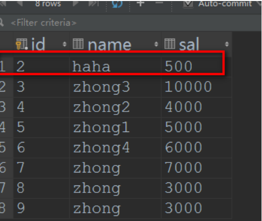

#### 6.3 动态删除

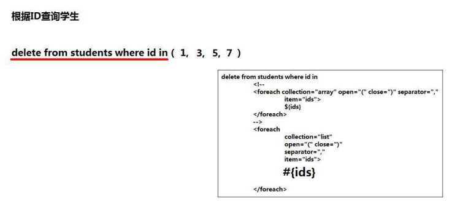

以前我们使用 JDBC 也好，Hibernate 也好，想要批量删除的时候，总是使用的是循环删除。而我们现在使用的是 Mybatis，SQL 语句是自己写的。所以我们可以写下如下的 SQL 来进行删除
delete from students where id in (?,?,?,?);
而我们的 Mybatis 又支持动态 SQL,所以删除起来就非常方便了！

```sql
	<delete id="deleteByConditions" parameterType="int">

		<!-- foreach用于迭代数组元素
			 open表示开始符号
			 close表示结束符合
			 separator表示元素间的分隔符
			 item表示迭代的数组，属性值可以任意，但提倡与方法的数组名相同
			 #{ids}表示数组中的每个元素值
		 -->
		delete from students where id in
		 <foreach collection="array" open="(" close=")" separator="," item="ids">
			 #{ids}
		 </foreach>

	</delete>
```

删除编号为 2，3，4 的记录

```java
    public void deleteByConditions(int... ids) throws Exception {
        //得到连接对象
        SqlSession sqlSession = MybatisUtil.getSqlSession();
        try{
            //映射文件的命名空间.SQL片段的ID，就可以调用对应的映射文件中的SQL
            /**
             * 由于我们的参数超过了两个，而方法中只有一个Object参数收集
             * 因此我们使用Map集合来装载我们的参数
             */
            sqlSession.delete("StudentID.deleteByConditions", ids);
            sqlSession.commit();
        }catch(Exception e){
            e.printStackTrace();
            sqlSession.rollback();
            throw e;
        }finally{
            MybatisUtil.closeSqlSession();
        }
    }

    public static void main(String[] args) throws Exception {
        StudentDao studentDao = new StudentDao();
        studentDao.deleteByConditions(2,3,4);

    }

```

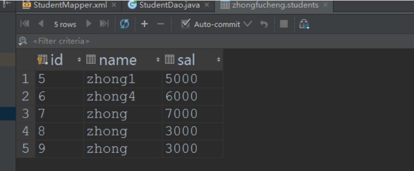

#### 6.4 动态插入

我们要想动态插入的话，就比其他的 DML 语句稍微复杂一点，因为它有两部分是不确定的，平常的 SQL 语句是这样的：
insert into student(id,name,sal) values(?,?,?)

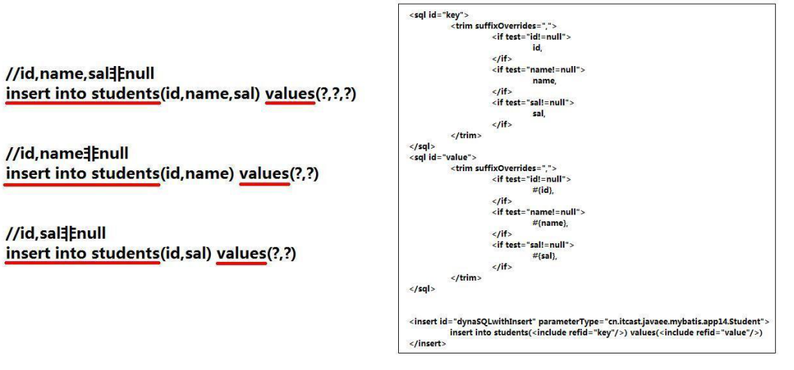

SQL 代码块是不能像之前那样帮我们自动去除多余的逗号的，因此我们需要使用 trim 标签来自己手动去除...
编写 insertSQL 语句的时候，不要忘了写()括号。

```sql
    <!--SQL片段默认是不帮我们自动生成合适的SQL，因此需要我们自己手动除去逗号-->
    <sql id="key">
        <trim suffixOverrides=",">
            <if test="id!=null">
                id,
            </if>

            <if test="id!=null">
                name,
            </if>

            <if test="id!=null">
                sal,
            </if>
        </trim>
    </sql>

    <sql id="value">
        <trim suffixOverrides=",">
            <if test="id!=null">
                #{id},
            </if>

            <if test="id!=null">
                #{name},
            </if>

            <if test="id!=null">
                #{sal},
            </if>
        </trim>
    </sql>
    <!--动态插入-->
    <insert id="insertByConditions" parameterType="zhongfucheng.Student">

    	insert into students (<include refid="key"/>) values
        (<include refid="value"/>)

    </insert>
```

测试三个不同内容的数据

```java
    public void insertByConditions(Student student) throws Exception {
        //得到连接对象
        SqlSession sqlSession = MybatisUtil.getSqlSession();
        try{
            //映射文件的命名空间.SQL片段的ID，就可以调用对应的映射文件中的SQL
            sqlSession.insert("StudentID.insertByConditions", student);
            sqlSession.commit();
        }catch(Exception e){
            e.printStackTrace();
            sqlSession.rollback();
            throw e;
        }finally{
            MybatisUtil.closeSqlSession();
        }
    }
    public static void main(String[] args) throws Exception {
        StudentDao studentDao = new StudentDao();
        studentDao.insertByConditions(new Student(55, null, null));//name和sal为空

        studentDao.insertByConditions(new Student(66, "haxi", null));//sal为空
        studentDao.insertByConditions(new Student(77, null, 3999d));//name为空


    }

```

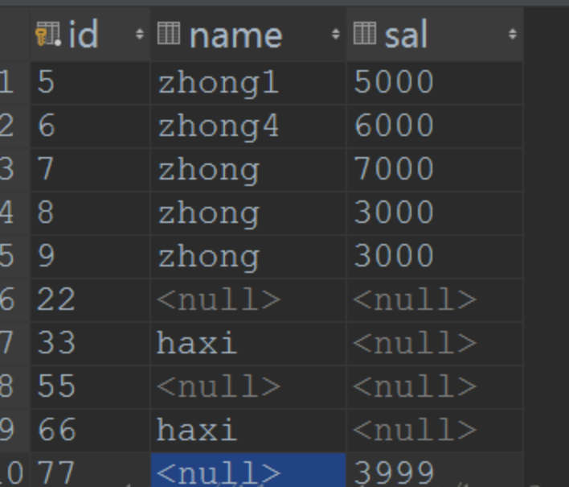

7. 入门总结

- Mybatis 的准备工作与 Hibernate 差不多，都需要一个总配置文件、一个映射文件。
- Mybatis 的 SQLSession 工具类使用 ThreadLocal 来对线程中的 Session 来进行管理。
- Mybatis 的事务默认是开启的，需要我们手动去提交事务。
- Mybatis 的 SQL 语句是需要手写的，在程序中通过映射文件的命名空间.sql 语句的 id 来进行调用!
- 在 Mybatis 中，增删改查都是 Mybatis 需要我们自己写 SQL 语句的，然后在程序中调用即可了。SQL 由于是我们自己写的，于是就相对 Hibernate 灵活一些。
- 如果需要传入多个参数的话，那么我们一般在映射文件中用 Map 来接收。
- 由于我们在开发中会经常用到条件查询，在之前，我们是使用查询助手来帮我们完成对 SQL 的拼接的。而 Mybatis 的话，我们是自己手写 SQL 代码的。
- Mybatis 也支持一些判断标签，于是我们就可以通过这些标签来完成动态 CRUD 的操作了。
- 值得注意的是，我们的 sql 片段代码是需要我们自己手动去分割，号的。
