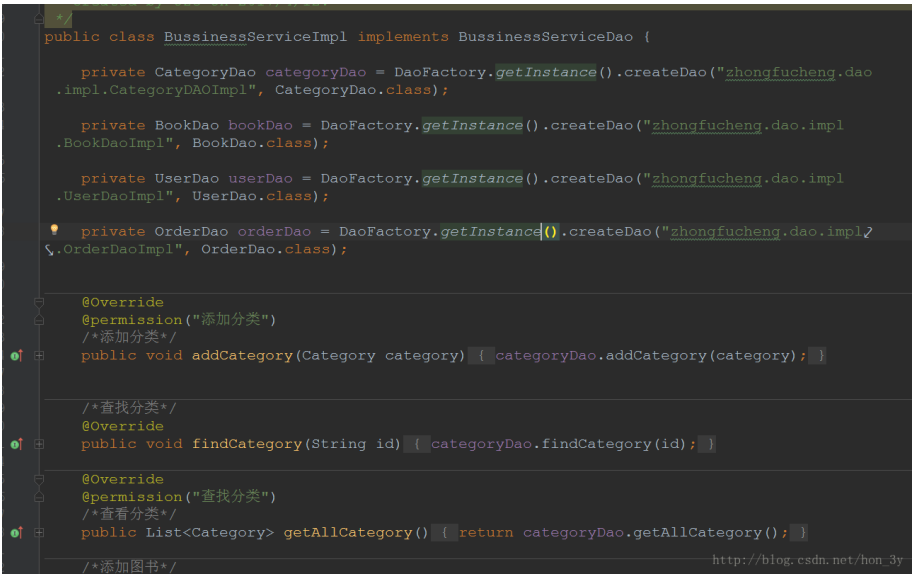
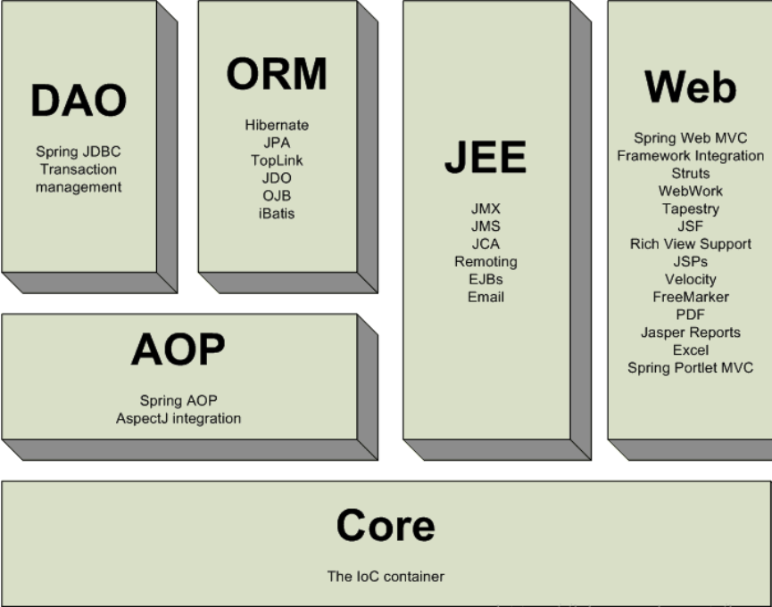

## 1.  Spring介绍

Spring诞生：
- 创建Spring的目的就是用来替代更加重量级的的企业级Java技术
- 简化Java的开发
   - 基于POJO轻量级和最小侵入式开发
   - 通过依赖注入和面向接口实现松耦合  
   - 基于切面和惯例进行声明式编程
   - 通过切面和模板减少样板式代码 

### 1.1侵入式概念

  侵入式：对于EJB、Struts2等一些传统的框架，**通常是要实现特定的接口，继承特定的类才能增强功能**
  **改变了java类的结构**  
  非侵入式：对于Hibernate、Spring等框架，**对现有的类结构没有影响，就能够增强JavaBean的功能**

### 1.2 松耦合概念

前面我们在写程序的时候，都是**面向接口编程，通过DaoFactroy等方法来实现松耦合**

```java
private CategoryDao categoryDao = DaoFactory.getInstance().createDao("zhongfucheng.dao.impl.CategoryDAOImpl", CategoryDao.class);

private BookDao bookDao = DaoFactory.getInstance().createDao("zhongfucheng.dao.impl.BookDaoImpl", BookDao.class);

private UserDao userDao = DaoFactory.getInstance().createDao("zhongfucheng.dao.impl.UserDaoImpl", UserDao.class);

private OrderDao orderDao = DaoFactory.getInstance().createDao("zhongfucheng.dao.impl.OrderDaoImpl", OrderDao.class);
```


代码如下：




DAO层和Service层通过DaoFactory来实现松耦合，如果Serivce层直接`new DaoBook()`，那么DAO和Service就紧耦合了**Service层依赖紧紧依赖于Dao**。

而Spring给我们更加合适的方法来实现松耦合，并且更加灵活、功能更加强大！---->**IOC控制反转**（这个后面会说）
1.3 切面编程
切面编程也就是AOP编程，其实我们在之前也接触过...动态代理就是一种切面编程了...
当时我们使用动态代理+注解的方式给Service层的方法添加权限.
```java
    @Override
    @permission("添加分类")
    /*添加分类*/
    public void addCategory(Category category) {
        categoryDao.addCategory(category);
    }


    /*查找分类*/
    @Override
    public void findCategory(String id) {
        categoryDao.findCategory(id);
    }

    @Override
    @permission("查找分类")
    /*查看分类*/
    public List<Category> getAllCategory() {
        return categoryDao.getAllCategory();
    }

    /*添加图书*/
    @Override
    public void addBook(Book book) {
        bookDao.addBook(book);

    }
```
Controller调用Service的时候，Service返回的是一个代理对象，代理对象得到Controller想要调用的方法，通过反射来看看该方法上有没有注解

如果有注解的话，那么就判断该用户是否有权限来调用 此方法，如果没有权限，就抛出异常给Controller，Controller接收到异常，就可以提示用户没有权限了。

AOP编程可以简单理解成：在执行某些代码前，执行另外的代码（Struts2的拦截器也是面向切面编程【在执行Action业务方法之前执行拦截器】）

Spring也为我们提供更好地方式来实现面向切面编程！
## 2. 引出Spring
我们试着回顾一下没学`Spring`的时候，是怎么开发Web项目的
1. **实体类--->class User{ }**
2. **daoclass--> UserDao{ .. 访问db}**
3. **service--->class UserService{ UserDao userDao = new UserDao();}**
4. **actionclass UserAction{UserService userService = new UserService();}** 

**用户访问：Tomcat->servlet->service->dao**

我们来思考几个问题：
①：**对象创建创建能否写死？**
②：对象创建细节
- 对象数量
  - action 多个 【维护成员变量】
  - service 一个 【不需要维护公共变量】
  - dao 一个 【不需要维护公共变量】
- 创建时间
action 访问时候创建
service 启动时候创建
dao 启动时候创建
③：对象的依赖关系
- **action 依赖 service**
-  **service依赖 dao**
对于第一个问题和第三个问题，**我们可以通过DaoFactory解决掉(虽然不是比较好的解决方法)**

对于第二个问题，我们要控制对象的数量和创建时间就有点麻烦了....

而**Spring框架通过IOC就很好地可以解决上面的问题**....

### 2.1 IOC控制反转
Spring的核心思想之一：Inversion of Control , 控制反转 IOC
那么控制反转是什么意思呢？？？对象的创建交给外部容器完成，这个就做控制反转。
Spring使用控制反转来实现对象不用在程序中写死
控制反转解决对象处理问题【把对象交给别人创建】
那么对象的对象之间的依赖关系Spring是怎么做的呢？？依赖注入：dependency injection.
Spring使用依赖注入来实现对象之间的依赖关系
在创建完对象之后，对象的关系处理就是依赖注入
上面已经说了，控制反转是通过外部容器完成的，而Spring又为我们提供了这么一个容器，我们一般将这个容器叫做：IOC容器.

无论是创建对象、处理对象之间的依赖关系、对象创建的时间还是对象的数量，我们都是在Spring为我们提供的IOC容器上配置对象的信息就好了。

那么使用IOC控制反转这一思想有什么作用呢？？？我们来看看一些优秀的回答...  
来自知乎：https://www.zhihu.com/question/23277575/answer/24259844  
我摘取一下核心的部分：  
ioc的思想最核心的地方在于，资源不由使用资源的双方管理，而由不使用资源的第三方管理，这可以带来很多好处。**第一，资源集中管理，实现资源的可配置和易管理。第二，降低了使用资源双方的依赖程度，也就是我们说的耦合度。**  

---
也就是说，甲方要达成某种目的不需要直接依赖乙方，它只需要达到的目的告诉第三方机构就可以了，比如甲方需要一双袜子，而乙方它卖一双袜子，它要把袜子卖出去，并不需要自己去直接找到一个卖家来完成袜子的卖出。  
它也只需要找第三方，告诉别人我要卖一双袜子。这下好了，甲乙双方进行交易活动，都不需要自己直接去找卖家，相当于程序内部开放接口，卖家由第三方作为参数传入。甲乙互相不依赖，而且只有在进行交易活动的时候，甲才和乙产生联系。反之亦然。  
这样做什么好处么呢，甲乙可以在对方不真实存在的情况下独立存在，而且保证不交易时候无联系，想交易的时候可以很容易的产生联系。甲乙交易活动不需要双方见面，避免了双方的互不信任造成交易失败的问题。  
因为交易由第三方来负责联系，而且甲乙都认为第三方可靠。那么交易就能很可靠很灵活的产生和进行了。这就是ioc的核心思想。生活中这种例子比比皆是，支付宝在整个淘宝体系里就是庞大的ioc容器，交易双方之外的第三方，提供可靠性可依赖可灵活变更交易方的资源管理中心。另外人事代理也是，雇佣机构和个人之外的第三方。

---
在以上的描述中，诞生了两个专业词汇，依赖注入和控制反转所谓的依赖注入，则是，甲方开放接口，在它需要的时候，能够讲乙方传递进来(注入)所谓的控制反转，甲乙双方不相互依赖，交易活动的进行不依赖于甲乙任何一方，整个活动的进行由第三方负责管理。
**1.不用自己组装，拿来就用。**
**2.享受单例的好处，效率高，不浪费空间。**
**3.便于单元测试，方便切换mock组件。**
**4.便于进行AOP操作，对于使用者是透明的。**
**5.统一配置，便于修改。**

## 3.Spring模块

Spring可以分为6大模块：
1. Spring Core spring的核心功能： IOC容器, 解决对象创建及依赖关系
2. Spring Web Spring对web模块的支持。
- 可以与struts整合,让struts的action创建交给spring
- spring mvc模式
3. Spring DAO Spring 对jdbc操作的支持 【JdbcTemplate模板工具类】
4. Spring ORM spring对orm的支持： 
- 既可以与hibernate整合，【session】
- 也可以使用spring的对hibernate操作的封装
5. Spring AOP 切面编程
6. SpringEE spring 对javaEE其他模块的支持



上面文主要引出了为啥我们需要使用Spring框架，以及大致了解了Spring是分为六大模块的....**下面主要讲解Spring的core模块！**