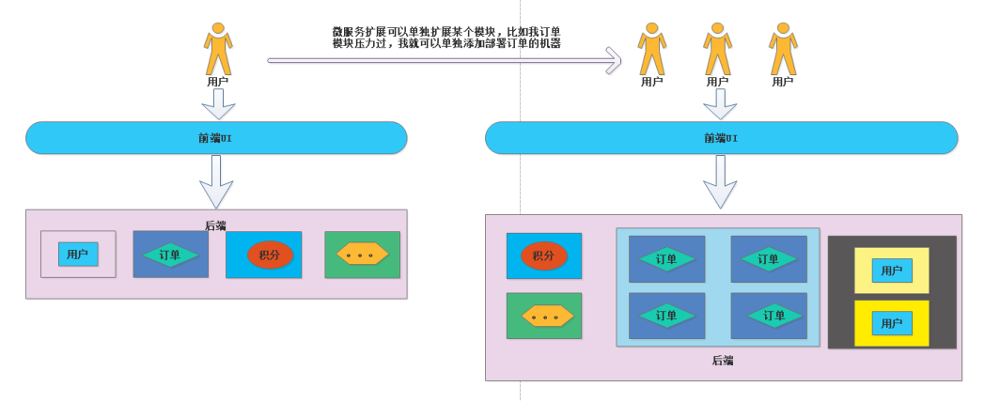
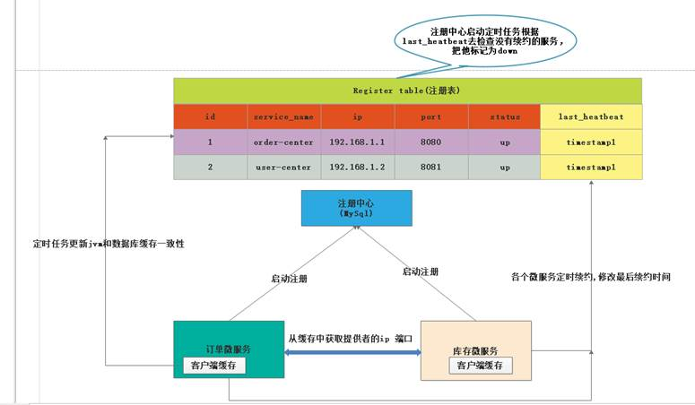
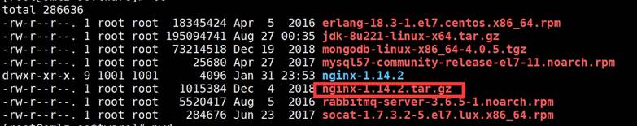

## 一:微服务 & 微服务架构

1：单体架构 VS 微服务架构

### **1.1)** **从单体架构说起**

一个工程对应一个归档包(war)，这个 war 包 包含了该工程的所有功能。我们成为这种应用为单体应用，也就是我们常说的单体架构(一个 war 包打天下)。

具体描述: 就是在我们的一个 war 包种，聚集了各种功能以及资源，比如 JSP

JS,CSS 等。而业务种包含了我们的用户模块，订单模块，支付模块等等.

### **1.2)** **单体架构图**


### **1.3)** **单体架构优缺点总结** **优点:**

①: 架构简单明了，没有”花里胡哨“的问题需要解决。

②:开发，测试，部署简单（尤其是运维人员 睡着都会笑醒） 缺点:

①：随着业务扩展，代码越来越复杂，代码质量参差不齐(开发人员的水平不一),会让你每次提交代码 ，修改每一个小 bug 都是心惊胆战的。

②:部署慢(由于单体架构，功能复杂) 能想像下一个来自 200W+代码部署的速度(15 分钟)

③:扩展成本高，根据单体架构图 假设用户模块是一个 CPU 密集型的模块(涉及到大量的运算)那么我们需要替换更加牛逼的 CPU，而我们的订单模块是一个 IO 密集模块（涉及大量的读写磁盘）,那我们需要替换更加牛逼的内存以及高效的磁盘。但是我们的单体架构上 无法针对单个功能模块进行扩展，那么就需要替换更牛逼的 CPU 更牛逼的内存 更牛逼的磁盘 价格蹭蹭的往上涨。

④:阻碍了新技术的发展。。。。。。比如我们的 web 架构模块 从 struts2 迁移到 springboot，那么就会成为灾难性

### **1.4）微服务以及微服务架构**

#### 1.4.1)微服务的定义

**①：英文:**[**https://martinfowler.com/articles/microservices.html**](https://martinfowler.com/articles/microservices.html)

**②: 中文:**[**http://blog.cuicc.com/blog/2015/07/22/microservices**](http://blog.cuicc.com/blog/2015/07/22/microservices)

**1.4.2）微服务核心就是把传统的单机应用，根据业务将单机应用拆分为一个一个的服务，彻底的解耦，每一个服务都是提供特定的功能，一个服务只做一件事,类似进程，每个服务都能够单独部署，甚至可以拥有自己的数据库。这样的一个一个的小服务就是 微服务.**

①: 比如传统的单机电商应用, tulingshop 里面有 订单/支付/库存/物流/积分等模块(理解为 servcie)

②:我们根据 业务模型来拆分,可以拆分为 订单服务，支付服务，库存服务，物流服务，积分服务

*③*若不拆分的时候，我的非核心业务积分模块 出现了重大 bug 导致系统内存溢出，导致整个服务宕机.

,若拆分之后，只是说我的积分微服务不可用，我的整个系统核心功能还是能使用

#### **1.4.3)** **单机架构扩展与微服务扩展**

①：单机架构扩展


②:微服务架构及扩展



③：微服务数据存储


#### **1.4.4)** **微服务架构是什么？**

微服务架构是一个架构风格, 提倡

①:将一个单一应用程序开发为一组小型服务.

②:每个服务运行在自己的进程中

③:服务之间通过轻量级的通信机制(http rest api)

④:每个服务都能够独立的部署

⑤:每个服务甚至可以拥有自己的数据库

#### 1.4.5）微服务以及微服务架构的是二个完全不同的概念。

**微服务**强调的是服务的大小和对外提供的单一功能，而**微服务架构**是指把 一个一个的微服务组合管理起来，对外提供一套完整的服务。

#### **1.4.6)微服务的优缺点**

A:**优点:**

①：每个服务足够小,足够内聚，代码更加容易理解,专注一个业务功能点(对比传统应用，可能改几行代码 需要了解整个系统)

②: 开发简单，一个服务只干一个事情。（加入你做支付服务，你只要了解支付相关代码就可以了）

③: 微服务能够被 2-5 个人的小团队开发，提高效率

④: 按需伸缩

⑤: 前后段分离, 作为 java 开发人员，我们只要关系后端接口的安全性以及性能，不要去关注页面的人机交互(H5 工程师)根据前后端接口协议，根据入参，返回 json 的回参

⑥:一个服务可用拥有自己的数据库。也可以多个服务连接同一个数据库.

**缺点:**

①:增加了运维人员的工作量，以前只要部署一个 war 包，现在可能需要部署成百上千个 war 包 (k8s+docker+jenkis )

②: 服务之间相互调用，增加通信成本

③:数据一致性问题(分布式事物问题)

④:系能监控等,问题定位.........................


1.4.6）微服务的适用场景

A：合适

①:大型复杂的项目............ (来自单体架构 200W 行代码的恐惧)

②:快速迭代的项目............ (来自一天一版的恐惧)

③:并发高的项目................ (考虑弹性伸缩扩容的恐惧)

B：不合适

①：业务稳定，就是修修 bug ，改改数据

②：迭代周期长 发版频率 一二个月一次.

## 二:Spring Cloud Alibaba

### **2.1)** **什么是 SpringCloud?**

[**https://spring.io/projects/spring-cloud**](https://spring.io/projects/spring-cloud)

**spring cloud 子项目孵化器地址:**[**https://github.com/spring-cloud-incubator** ](https://github.com/spring-cloud-incubator)**孵化成功就变为 springcloud 的子项目了。**

SpringCloud 是程序员用来开发我们微服务的一整套技术解决方案.包含如下

服务注册发现，服务容错降级，服务网关，服务调用，服务调用负载均衡,消息等.


### **2.2)** **什么是 Spring cloud Alibaba**

Spring cloud Alibaba 是我们 SpringCloud 的一个子项目,是提供微服务开发的一站式解决方案.包含微服务开发的必要组件。

#### **2.2.1)** 基于 SpringCloud 符合 SpringCloud 标准,是阿里的微服务的解决方案.

**文档:**[**https://github.com/alibaba/spring-cloud-alibaba/blob/master/README-**](https://github.com/alibaba/spring-cloud-alibaba/blob/master/README-zh.md)

[**zh.md**](https://github.com/alibaba/spring-cloud-alibaba/blob/master/README-zh.md)

**主要功能描述:**

#### **2.2.2)** **SpringCloud SpringCloudalibaba SpringBoot 的生产版本选择**

①:我们的 SpringBoot 版本 说明选择

```xml
1 /**
2	其中2：表示的主版本号，表示是我们的SpringBoot第二代产品
3	其中1:表示的是次版本号，增加了一些新的功能但是主体的架构是没有变化的，是兼容的
4	其中6:表示的是bug修复版
5	所以2.1.6合起来就是springboot的第二代版本的第一个小版本的 第6次bug修复版本
6	RELEASE:存在哪些取值了 ①:snapshot(开发版本) ②:M1...M2(里程碑版本,在
7	正式版发布之前 会出几个里程碑的版本) ③:release(正式版本)
8 **/
9	<parent>
10	<groupId>org.springframework.boot</groupId>
11	<artifactId>spring‐boot‐starter‐parent</artifactId>
12	<version>2.1.6.RELEASE</version>
13	</parent>

```

**②:Spring cloud 的版本说明**

第一代版本:Angle

第二代版本:Brixton

第三代版本:Camden

第四代版本:Edgware

第五代版本:Finchley

第六代版本:GreenWich

第七代版本:Hoxton(还在酝酿中，没正式版本) **这种发布的版本是 以伦敦地铁站发行地铁的站。**

为什么我们的 SpringCloud 会以这种方式来发布版本,因为假如我们传统的

5.1.5release 这种发布的而 SpringCloud 会包含很多子项目的版本就会给人造成混淆.


**SNAPSHOT**： 快照版本，随时可能修改

**M**： MileStone，M1 表示第 1 个里程碑版本，一般同时标注 PRE，表示预览版版。

**RC** 版本英文版名字叫 Release Candidate（候选版本）一般标注 PRE 表示预览版


**SR**： Service Release，SR1 表示第 1 个正式版本，一般同时标注 GA： (GenerallyAvailable),表示稳定版本。


比如还有一种 RELEASE 版本（正式版本） 比如 Greenwich 版本顺序

Greenwich.release----->发现 bug----->Greenwich.SR1------------------------------------------------------------ >发现 bug--- >Greenwich.SR2。

**SpringCloud**的发布计划https://github.com/spring-cloud/spring-cloud- [release/milestones](https://github.com/spring-cloud/spring-cloud-release/milestones)

SpringCloud 曾经发布的版本:

https://github.com/spring-cloud/spring-cloud-release/releases

③:Springboot SpringCloud SpringCloudalibaba 的版本对应关系

[https://github.com/alibaba/spring-cloud- alibaba/wiki/%E7%89%88%E6%9C%AC%E8%AF%B4%E6%98%8E](https://github.com/alibaba/spring-cloud-alibaba/wiki/版本说明)


④：生产版本选择

a:打死不用 非稳定版本/ end-of-life（不维护）版本

b:release 版本先等等(等别人去探雷)

c:推荐 SR2 以后的可以放心使用.

## 三:微服务注册中心 Nacos 入门

https://nacos.io/zh-cn/docs/what-is-nacos.html

服务的提供者 &服务的消费者是相对的概念

比如**用户服务**是**订单服务**的消费者，**订单服务**是**用户服务**的提供者。但是对于 **订单服务 >库存服务**，那么订单服务就成为服务消费者。


### 3.1）无注册中心的调用的缺点。

比如现在我的用户服务是占用(User 服务)8081 端口的服务, 此时我的服务提供方(order 服务端口是 8080)端口

```
 ResponseEntity<ProductInfo> responseEntity=
restTemplate.getForEntity(“http://localhost:8081/selectProductInfoById/”+
orderInfo.getProductNo(), ProductInfo.class);

```

我们可以通过 RestTemplate 调用方式来进行调用

缺点:

**1)** **从上面看出的缺点就是，我们的在调用的时候，请求的 Ip 地址和端口是硬编码的.**

若此时，服务提供方(order)服务部署的机器换了端口或者是更换了部署机器的 Ip,那么我们需要修改代码重新发布部署.

**2)** **假设我们的 order 服务压力过大，我们需要把 order 服务作为集群， 那么意味着 order 是多节点部署**

比如原来的，我们只有一台服务器，现在有多台服务器，那么作为运维人员 需要在服务消费方进行手工维护一份注册表(容易出错)

**3)** **有人马上回驳我说，我可以通过 ng 来做负载均衡,对，我首先认为这是可行的，当时微服务成百上千的服务，难道我们要那成百上千**

==ng 么？或者使用一个 Ng 那么我们能想一下哪个 ng 的配置文件有多么复杂。==


### 3.2）大话 服务注册发现原理

**V1 架构图：**


#### **3.2.1) V1 版本的架构，存在以下几个问题**

**①:我们的微服务每次调用，都会去进行对数据库的查询，并发一高，数据库性能就是一个瓶颈问题.**

**②:若我们的 mysql 挂了，那么我们所有的微服务调用都不能正常进行。**

**③:若 mysql 是正常的,库存微服务挂了，那么也不能正常的调用**

**V2 版本架构图**



### **3.3)** **Nacos 服务端搭建**

**下载地址:**https://github.com/alibaba/Nacos/releases

#### **3.3.1)** **linux 环境启停:**

①:把我们的 Nacos 包解压 tar -zxvf nacos-server-1.1.4.tar.gz


②：cd 到我们的解压目录 nacos cd nacos


③：进入到 bin 目录下 执行命令(启动单机) sh startup.sh -m standalone


④:检查 nacos 启动的端口 lsof -i:8848


⑤:访问 nocas 的服务端 http://192.168.159.8:8848/nacos/index.html 默认的用户名密码是 nocas/nocas


⑥：停止 nocas 在 nocas/bin 目录下 执行 sh shutdown.sh 

#### **3.3.2)** **window 环境下 启动 nocas server**


## 四：Nacos client 服务端的搭建

①:三板斧之:第一板斧 加入依赖

```xml
<dependency>
2	<groupId>com.alibaba.cloud</groupId>
3	<artifactId>spring‐cloud‐alibaba‐nacos‐discovery</artifactId>
4	</dependency>
```

②:三板斧之:第二板斧写注解(也可以不写)

```java
@SpringBootApplication
@EnableDiscoveryClient
public class Tulingvip01MsAlibabaNacosClientOrderApplication {

public static void main(String[] args) {
SpringApplication.run(Tulingvip01MsAlibabaNacosClientOrderApplication.cl ass, args);
}
}

```

③:第三板斧之:写配置文件 **注意**server-addr：不需要写协议

```
spring:
cloud:
nacos:
discovery:
server‐addr: localhost:8848
application:
name: order‐center

```


④:验证我们的 order-center 注册到我们的 nacos 上

```java
@Autowired
private DiscoveryClient discoveryClient;

@GetMapping("/getServiceList")
public List<ServiceInstance> getServiceList() {
List	<ServiceInstance	> serviceInstanceList	=
discoveryClient.getInstances("order‐center");
return serviceInstanceList;
}


```


## 五：Nacos 领域模型划分以及概念详解

## 


### **5.1)**

**NameSpace(默认的 NameSpace 是”public“ NameSpace 可以进行资源隔离，比如我们 dev 环境下的 NameSpace 下的服务是调用不到 prod 的 NameSpace 下的微服务)**


**证明 1)我们 dev 环境下的 order-center 调用 prod 环境下的 product-center**

**①:order-center 所在的 namespace 为 dev**

```
spring:
cloud:
nacos:
discovery:
server‐addr: localhost:8848
#dev环境的
namespace: bc7613d2‐2e22‐4292‐a748‐48b78170f14c #指定namespace的id
application:
name: order‐center

```

**②:product-center 所在的 namespace 为 prod**

```
spring:
application:
name: product‐center
cloud:
nacos:
discovery:
server‐addr: localhost:8848
#prod环境的
namespace: 20989a73‐cdb3‐41b8‐85c0‐e9a3530e28a6

```

**③：测试调用:** http://localhost:8080/selectOrderInfoById/1

|     |                                     |
| --- | ----------------------------------- |
|     |  |

### **5.2)** **Nacos 的集群模式**


#### **5.2.1)**

**首 先 我 们 需 要 安 装 我 们 的 ng**[ **http://nginx.org/download/nginx-1.14.2.tar.gz**](http://nginx.org/download/nginx-1.14.2.tar.gz)

第一步:下载 ng （老师下载的是:路径是/usr/local/software）

**wget** [**http://nginx.org/download/nginx-1.14.2.tar.gz**](http://nginx.org/download/nginx-1.14.2.tar.gz)



**第二步:解压 ng**

**tar -xzvf nginx-1.14.2.tar.gz 得到解压目录**


**第三步: 进入解压目录**

**cd nginx­1.14.2**


**第四步**: **执行命令指定安装目录**

./configure ­­prefix=/usr/local/nginx­1.14.2 意思是告诉等会安装的文件要放在哪里

**第五步 **: **接下来通过命令** **make** **编译**

**执行** **make** **命令**

**第六步**:**执行** **make install** **命令**


**第七步**:还记得第四步我们安装 ng 的目录么？ /usr/local/nginx­1.14.2

**进入该目录下的配置目录 conf**


**第八步**:修改 ng 的 conf 文件


```
修改的内容为:
upstream nacos_cluster {
server 192.168.159.8:8849;
server 192.168.159.8:8850;
server 192.168.159.8:8851;
}
server {
listen 8847;
server_name localhost;

#charset koi8‐r;

#access_log logs/host.access.log main;

location /nacos/ {
proxy_pass http://nacos_cluster/nacos/;
	}
 }
 ng配置到此完成。

```

#### **5.2.2)**

**安装 我们的 nacos­server(搭建三个集群端口分别为 8849 ,8850,8851)**


我们以配置一台为例（8849）为例

第一步:修改 nacos8849/conf 文件 application.properties

```
spring.datasource.platform=mysql

# 数据库实例数量

db.num=1
//自己数据库的连接信息
db.url.0=jdbc:mysql://192.168.159.8:3306/nacos_test?characterEncoding=utf &connectTimeout=1000&socketTimeout=3000&autoReconnect=true
db.user=root
db.password=Zw726515@

```

第二步:修改 nacos8859/conf 文件 把原来的 cluster.conf.example 改为

cluster.conf 文件


文件内容为如下


**到此为止 nacos8849 安装完成了 nacos8850 nacos8851 同 样 安 装 .**

#### **5.2.3)**

**最后一步：创建一个数据库（需要自己创建一个数据库） 脚本的位子在 nacos/conf/nacos-mysql.sql**

#### **5.2.4)**

**需要修改 nacos-server 的 启动脚本 jvm 参数 (怕你们内存参数设置的过小启动不了这么多服务)**


#### **5.2.4)分别启动 8849 8850 8851**

**进入到 nacos 的目录下的 bin 目录**


**执行./start.sh**

**启动成功的依据 查看日志**

**/usr/local/spring-cloud-alibaba/nacos/nacos8850/logs/start.out**


**测试:**

**分 别 登 陆 地 址 :** http://192.168.159.8:8849/nacos http://192.168.159.8:8850/nacos http://192.168.159.8:8851/nacos

**NG 测试**http://192.168.159.8:8847/nacos/


|     |                                     |
| --- | ----------------------------------- |
|     |  |

**客户端地址: 直接填写 8847ng 的地址就可以了**


## 六:什么是配置管理?


上图缺点:

**所有的环境的配置都是明文的 被太多开发人员都知道了。**

**业务场景：张三开发了一个新功能,业务需要，保留原来老逻辑的代码，所有他抽取了一个开关变量**

**isNewBusi 来控制，突然新功能上了生产后，发现有 bug,怎么做到修改 isNewBusi 的值不需要重启。**

根据上图我们知道配置管理的作用可以主要总结如下

**1）不同环境不管配置**

**2) 配置属性动态刷新**

**引入配置中心**


**根据这幅图，我们微服务需要解决的问题 1)我微服务怎么知道配置中心的地址**

**2)** **我微服务到底需要连接哪个环境**

**3)怎么找到 nacos config 上的对应的配置文件**

**微服务接入配置中心的步骤**

**①:添加依赖包 spring-cloud-alibaba-nacos-config**

```xml
<dependency>
<groupId>com.alibaba.cloud</groupId>
<artifactId>spring‐cloud‐alibaba‐nacos‐config</artifactId>
</dependency>
```

**②:编写配置文件,需要写一个 bootstrap.yml 配置文件**

**配置解释:**

`server-addr`: localhost:8848 表示我微服务怎么去找我的配置中心 spring.application.name=order-center 表示当前微服务需要向配置中心

索要`order-center`的配置

spring.profiles.active=prod 表示我需要向配置中心索要 order-center 的生产环境的配置

索要文件的格式为

${application.name}- ${spring.profiles.active}.\${file-extension} 真正在 nacos 配置中心上 就是 **order-center-prod.yml**

```
spring:
cloud:
nacos:
config:
server‐addr: localhost:8848
file‐extension: yml
application:
name: order‐center
profiles:
active: prod
```


现在我们需要不停机改变我们的生产环境 isNewBusi 的值来控制我们的业务逻辑。我们需要在对应的 Controller 上添加一**@RefreshScope** 进行动态刷新

### 6.2）

怎么解决 生产环境，测试环境，开发环境相同的配置。（配置通用）


**比如我们的 servlet-context 为 order-center 查看工程启动日志**


**所以我们需要创建一个通用配置文件:order-center.yml 配置**

**那么 order-center.yml 就是一个通用配置了，不管是启动 prod,还是 dev 都会有该段配置 order-server 的 context-path 配置**


**配置的优先级 精准配置 会覆盖 与通用配置 相同的配置，然后再和通用配置互补。**


### **6.3)** **不同微服务的通用配置。**


#### **6.3.1)** **通过** **shared-dataids 方式**

比如 每一个微服务都要写服务注册地址等

```
spring:
cloud:
nacos:
discovery:
server‐addr: localhost:8848
```

我们就可以把该配置提取为一个公共配置 yml,提供给所有的工程使用

```
spring:
cloud:
nacos:
config:
server‐addr: localhost:8848
file‐extension: yml
#各个微服务共享的配置,注意越拍到后面的公共配置yml优先级越高
shared‐dataids: common.yml,common2.yml
#支持动态刷新的配置文件
refreshable‐dataids: common.yml,common2.yml
application:
name: order‐center
profiles:
active: dev
```

配置优先级

2020-01-09 21:21:19.115 INFO 15316 --- [ main]

b.c.PropertySourceBootstrapConfiguration : Located property source: CompositePropertySource {name='NACOS',

propertySources=[

**NacosPropertySource {name='order-center-dev.yml'}, **

**NacosPropertySource {name='order-center.yml'}, **

**NacosPropertySource {name='common2.yml'}, **

**NacosPropertySource {name='common.yml'}**

]

}

#### **6.3.2)通过 ext-config 方式**

同样配置到越后面的配置 优先级越高

```
spring:
cloud:
nacos:
config:
server‐addr: localhost:8848
file‐extension: yml
ext‐config:
‐ data‐id: common3.yml
group: DEFAULT_GROUP
refresh: true
‐ data‐id: common4.yml
```

#### 6.3.3)各个配置的优先级

**精准配置>不同环境的通用配置>不同工程的(ext-config)>不同工程(shared- dataids)**

```
spring:
cloud:
nacos:
config:
server‐addr: localhost:8848
file‐extension: yml
shared‐dataids: common.yml,common2.yml
refreshable‐dataids: common.yml,common2.yml
ext‐config:
‐ data‐id: common3.yml
group: DEFAULT_GROUP
refresh: true
‐ data‐id: common4.yml
group: DEFAULT_GROUP
refresh: true

application:
name: order‐center
profiles:
active: dev
```

**上述配置 加载的优先级**

**1)** **order-center-dev.yml** **精准配置**

**2)** **order-center.yml 同工程不同环境的通用配置 3)ext-config: 不同工程 通用配置**

**3.1)：common4.yml **

**3.2): common3.yml**

**4) shared-dataids** **不同工程通用配置**

**4.1)common2.yml**

**4.2)common1.yml**
