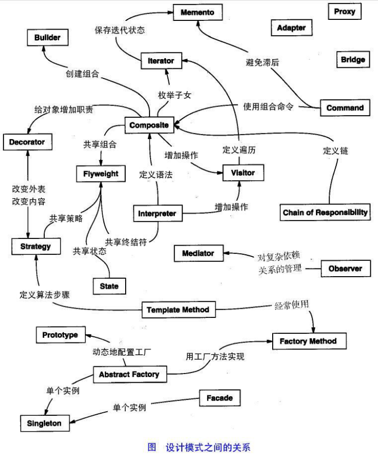
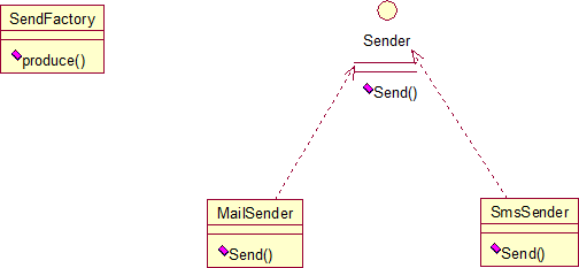
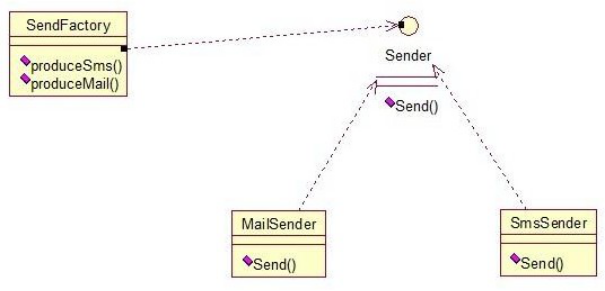
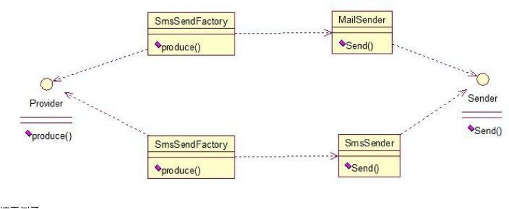

## 设计模式（Design Patterns）

- 可复用面向对象软件的基础
**设计模式（Design pattern）是一套被反复使用、多数人知晓的、经过分类编目的、代码设计经验的总结。**使用设计模式是为了可重用代码、让代码更容易被他人理解、保证代码可靠性。毫无疑问，设计模式于己于他人于系统都是多赢的，设计模式使代码编制真正工程化，设计模式是软件工程的基石，如同大厦的一块块砖石一样。项目中合理的运用设计模式可以完美的解决很多问题，每种模式在现在中都有相应的原理来与之对应，每一个模式描述了一个在我们周围不断重复发生的问题，以及该问题的核心解决方案，这也是它能被广泛应用的原因。

## 一、设计模式的分类

总体来说设计模式分为三大类：

**创建型模式**，共五种：工厂方法模式、抽象工厂模式、单例模式、建造者模式、原型模式。结构型模式，共七种：适配器模式、装饰器模式、代理模式、外观模式、桥接模式、组合模式、享元模式。

**行为型模式**，共十一种：策略模式、模板方法模式、观察者模式、迭代子模式、责任链模式、命令模式、备忘录模式、状态模式、访问者模式、中介者模式、解释器模式。

具体如下： 其中创建型有：

一、`Singleton`，`单例模式`：保证一个类只有一个实例，并提供一个访问它的全局访问点

二、`Abstract Factory`，`抽象工厂`：提供一个创建一系列相关或相互依赖对象的接口， 而无须指定它们的具体类。

三、`Factory Method`，`工厂方法`：定义一个用于创建对象的接口，让子类决定实例化哪一个类，Factory Method 使一个类的实例化延迟到了子类。

四、`Builder`，`建造模式`：将一个复杂对象的构建与他的表示相分离，使得同样的构建过程可以创建不同的表示。

五、`Prototype`，`原型模式`：用原型实例指定创建对象的种类，并且通过拷贝这些原型来创建新的对象。

行为型有：

六、`Iterator`，`迭代器模式`：提供一个方法顺序访问一个聚合对象的各个元素，而又不需要暴露该对象的内部表示。

七、`Observer`，`观察者模式`：定义对象间一对多的依赖关系，当一个对象的状态发生改变时，所有依赖于它的对象都得到通知自动更新。

八、`Template Method`，`模板方法`：定义一个操作中的算法的骨架，而将一些步骤延迟到子类中，TemplateMethod 使得子类可以不改变一个算法的结构即可以重定义该算法得某些特定步骤。

九、`Command`，`命令模式`：将一个请求封装为一个对象，从而使你可以用不同的请求对客户进行参数化，对请求排队和记录请求日志，以及支持可撤销的操作。

十、`State`，`状态模式`：允许对象在其内部状态改变时改变他的行为。对象看起来似乎改变了他的类。

十一、`Strategy`，`策略模式`：定义一系列的算法，把他们一个个封装起来，并使他们可以互相替换，本模式使得算法可以独立于使用它们的客户。

十二、`China of Responsibility`，`职责链模式`：使多个对象都有机会处理请求，从而避免请求的送发者和接收者之间的耦合关系

十三、`Mediator`，`中介者模式`：用一个中介对象封装一些列的对象交互。

十四、`Visitor`，`访问者模式`：表示一个作用于某对象结构中的各元素的操作，它使你可以在不改变各元素类的前提下定义作用于这个元素的新操作。

十五、`Interpreter`，`解释器模式`：给定一个语言，定义他的文法的一个表示，并定义一个解释器，这个解释器使用该表示来解释语言中的句子。

十六、`Memento`，`备忘录模式`：在不破坏对象的前提下，捕获一个对象的内部状态， 并在该对象之外保存这个状态。

结构型有：

十七、`Composite`，`组合模式`：将对象组合成树形结构以表示部分整体的关系，

Composite 使得用户对单个对象和组合对象的使用具有一致性。

十八、`Facade`，`外观模式`：为子系统中的一组接口提供一致的界面，fa?ade 提供了一高层接口，这个接口使得子系统更容易使用。

十九、`Proxy`，`代理模式`：为其他对象提供一种代理以控制对这个对象的访问

二十、`Adapter`,`适配器模式`：将一类的接口转换成客户希望的另外一个接口，Adapter 模式使得原本由于接口不兼容而不能一起工作那些类可以一起工作。

二十一、`Decrator`，`装饰模式`：动态地给一个对象增加一些额外的职责，就增加的功能来说，Decorator 模式相比生成子类更加灵活。

二十二、`Bridge`，`桥模式`：将抽象部分与它的实现部分相分离，使他们可以独立的变化。

二十三、`Flyweight`，`享元模式`

其实还有两类：`并发型模式`和`线程池模式`。用一个图片来整体描述一下：



## 二、设计模式的六大原则

1、`开闭原则（Open Close Principle）`

**开闭原则就是说对扩展开放，对修改关闭。** 在程序需要进行拓展的时候，不能去修改原有的代码，实现一个热插拔的效果。所以一句话概括就是：为了使程序的扩展性好，易于维护和升级。想要达到这样的效果，我们需要使用接口和抽象类，后面的具体设计中我们会提到这点。

2、`里氏代换原则（Liskov Substitution Principle）`  
里氏代换原则(Liskov Substitution Principle LSP)面向对象设计的基本原则之一。 里氏代换原则中说，**任何基类可以出现的地方，子类一定可以出现。** LSP 是继承复用的基石，只有当衍生类可以替换掉基类，软件单位的功能不受到影响时，基类才能真正被复用，而衍生类也能够在基类的基础上增加新的行为。里氏代换原则是对“开-闭”原则的补充。实现“开-闭” 原则的关键步骤就是抽象化。而基类与子类的继承关系就是抽象化的具体实现，所以里氏代换原则是对实现抽象化的具体步骤的规范。  
3、`依赖倒转原则（Dependence Inversion Principle）`  
这个是开闭原则的基础，具体内容：真对接口编程，**依赖于抽象而不依赖于具体**。  
4、`接口隔离原则（Interface Segregation Principle）`  
这个原则的意思是：**使用多个隔离的接口，比使用单个接口要好。**还是一个降低类之间的耦合度的意思，从这儿我们看出，其实设计模式就是一个软件的设计思想，从大型软件架构出发，为了升级和维护方便。所以上文中多次出现：降低依赖，降低耦合。  
5、`迪米特法则（最少知道原则）（Demeter Principle）`  
为什么叫最少知道原则，就是说：一个实体应当尽量少的与其他实体之间发生相互作用，使得系统功能模块相对独立。  
6、`合成复用原则（Composite Reuse Principle）` 原则是尽量使用合成/聚合的方式，而不是使用继承。

## 1、工厂方法模式（Factory Method）

工厂方法模式分为三种：
**11、普通工厂模式**，就是建立一个工厂类，对实现了同一接口的一些类进行实例的创建。 首先看下关系图：



举例如下：（我们举一个发送邮件和短信的例子）

首先，**创建二者的共同接口**：

```java
public interface Sender {

    public void send();
}

```

其次，**创建实现类**

```java
public class MailSender implements Sender {
    @Override
    public void send() {
        System.out.println("this is mailsender");
    }
}

public class SmsSender implements Sender {
    @Override
    public void send() {
        System.out.println("this is smssender");
    }
}

```

最后，**建工厂类**

```java
public class SenderFactory {
    public Sender produce(String type) {
        if ("mail".equals(type)) {
            return new MailSender();
        } else if ("sms".equals(type)) {
            return new SmsSender();
        } else {
            System.out.println("请输入正确的类型！");
            return null;
        }
    }
}

```

**测试类**

```java
import static org.junit.jupiter.api.Assertions.*;
class SenderFactoryTest {
    @org.junit.jupiter.api.Test
    void produce() {
        SenderFactory senderFactory=new SenderFactory();
        Sender sender=senderFactory.produce("sms");
        sender.send();
    }
}
```

输出 this is mailsender

**22、多个工厂方法模式**，是对普通工厂方法模式的改进，在普通工厂方法模式中，如果传递的字符串出错，则不能正确创建对象，而多个工厂方法模式是提供多个工厂方法，分别创建对象。关系图：



```java
public class SenderFactory {
   public Sender produceMail(){
       return new MailSender();
   }
   public  Sender produceSms(){
       return  new SmsSender();
   }
}

```

测试类

```java
class SenderFactoryTest {
    public static void main(String[] args) {
        SenderFactory factory=new SenderFactory();
        Sender sender=factory.produceMail();
        sender.send();
    }
}
```

输出：this is mailsender

**33、静态工厂方法模式**，将上面的多个工厂方法模式里的方法置为静态的，不需要创建实 例，直接调用即可。

静态工厂类

```java
public class SenderFactory {
    /**
     * @returnreturn如果是mail返回MailSender，另外如果是sms返回SmsSender
     */
    public static Sender produceMail() {
        return new MailSender();
    }

    public static Sender produceSms() {
        return new SmsSender();
    }
}
```

测试类

```java
class SenderFactoryTest {
    public static void main(String[] args) {
        Sender sender = SenderFactory.produceMail();
        sender.send();
    }
}
```

总体来说，**工厂模式适合：凡是出现了大量的产品需要创建，并且具有共同的接口时，可以通过工厂方法模式进行创建。** 在以上的三种模式中，第一种如果传入的字符串有误，不能正确创建对象，第三种相对于第二种，不需要实例化工厂类，所以，大多数情况下，我们会选用第三种——静态工厂方法模式。

## 2、抽象工厂模式（Abstract Factory）

工厂方法模式有一个问题就是，类的创建依赖工厂类，也就是说，如果想要拓展程序，必须对工厂类进行修改，这违背了闭包原则，所以，从设计角度考虑，有一定的问题，如何解决？ 就用到抽象工厂模式，创建多个工厂类，这样一旦需要增加新的功能，直接增加新的工厂类就可以了，不需要修改之前的代码。因为抽象工厂不太好理解，我们先看看图，然后就和代码，就比较容易理解。


