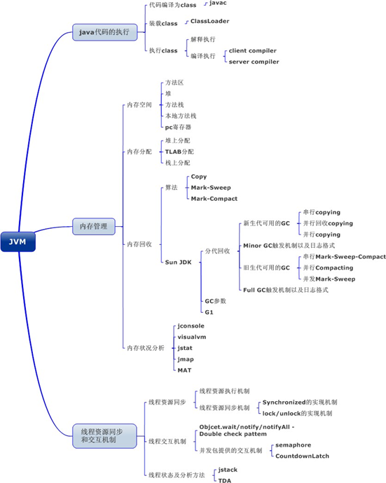
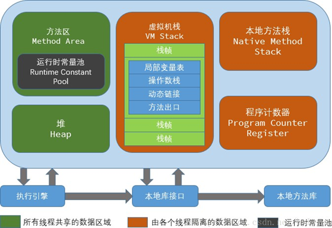
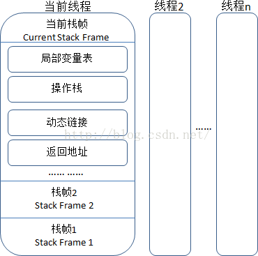
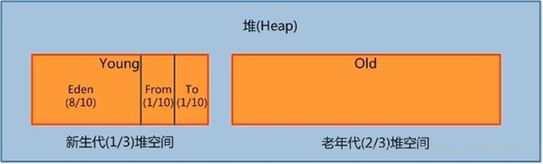

## 1.基本概念：

JVM 是可运行 Java 代码的假想计算机，包括一套字节码指令集、一组寄存器、一个栈、一个垃圾回收堆 和 一个存储方法域。JVM 是运行在操作系统之上的，它与硬件没有直接的交互。

## 2.运行过程

我们都知道 Java 源文件，通过编译器，能够生产相应的.Class 文件，也就是字节码文件， 而字节码文件又通过 Java 虚拟机中的解释器，编译成特定机器上的机器码 。
也就是如下：

① Java 源文件—->编译器—->字节码文件

② 字节码文件—->JVM—->机器码

每一种平台的解释器是不同的，但是实现的虚拟机是相同的，这也就是 Java 为什么能够跨平台的原因了 ，当一个程序从开始运行，这时虚拟机就开始实例化了，多个程序启动就会存在多个虚拟机实例。程序退出或者关闭，则虚拟机实例消亡，多个虚拟机实例之间数据不能共享。

2.1. 线程
这里所说的线程指程序执行过程中的一个线程实体。JVM 允许一个应用并发执行多个线程。**Hotspot JVM 中的 Java 线程与原生操作系统线程有直接的映射关系。**==当线程本地存储、缓冲区分配、同步对象、栈、程序计数器等准备好以后，就会创建一个操作系统原生线程。Java 线程结束，原生线程随之被回收。操作系统负责调度所有线程，并把它们分配到任何可用的 CPU 上。当原生线程初始化完毕，就会调用 Java 线程的 run() 方法。当线程结束时，会释放原生线程和 Java 线程的所有资源。==Hotspot JVM 后台运行的系统线程主要有下面几个：

| 线程                    | 作用                                                                                                                                                                                                                            |
| ----------------------- | ------------------------------------------------------------------------------------------------------------------------------------------------------------------------------------------------------------------------------- |
| 虚拟机线程（VM thread） | 这个线程等待 JVM 到达安全点操作出现。这些操作必须要在独立的线程里执行，因为当堆修改无法进行时，线程都需要 JVM 位于安全点。这些操作的类型有：stop-the- world 垃圾回收、线程栈 dump、线程暂停、线程偏向锁（biased locking）解除。 |
| 周期性任务线程          | 这线程负责定时器事件（也就是中断），用来调度周期性操作的执行。                                                                                                                                                                  |
| GC 线程                 | 这些线程支持 JVM 中不同的垃圾回收活动。                                                                                                                                                                                         |
| 编译器线程              | 这些线程在运行时将字节码动态编译成本地平台相关的机器码。                                                                                                                                                                        |
| 信号分发线程            | 这个线程接收发送到 JVM 的信号并调用适当的 JVM 方法处理。                                                                                                                                                                        |

2.2. JVM 内存区域

JVM 内存区域主要分为线程私有区域【程序计数器、虚拟机栈、本地方法区】、线程共享区域【JAVA 堆、方法区】、直接内存。
==线程私有数据区域生命周期与线程相同, 依赖用户线程的启动/结束 而 创建/销毁(在 Hotspot VM 内==, 每个线程都与操作系统的本地线程直接映射, 因此这部分内存区域的存/否跟随本地线程的生/死对应)。

==线程共享区域随虚拟机的启动/关闭而创建/销毁。==
==直接内存并不是 JVM 运行时数据区的一部分,== 但也会被频繁的使用: 在 JDK 1.4 引入的==NIO 提供了基于 Channel 与 Buffer 的 IO 方式, 它可以使用 Native 函数库直接分配堆外内存, 然后使用 DirectByteBuffer 对象作为这块内存的引用进行操作(详见: Java I/O 扩展), 这样就避免了在 Java 堆和 Native 堆中来回复制数据, 因此在一些场景中可以显著提高性能。==

2.2.1. 程序计数器(线程私有)

一块较小的内存空间, 是当前线程所执行的字节码的行号指示器，每条线程都要有一个独立的程序计数器，这类内存也称为“线程私有”的内存。
正在执行 java 方法的话，计数器记录的是虚拟机字节码指令的地址（当前指令的地址）。如果还是 Native 方法，则为空。
这个内存区域是唯一一个在虚拟机中没有规定任何 OutOfMemoryError 情况的区域。
2.2.2. 虚拟机栈(线程私有)

是描述 java 方法执行的内存模型，每个方法在执行的同时都会创建一个栈帧（Stack Frame） 用于存储局部变量表、操作数栈、动态链接、方法出口等信息。每一个方法从调用直至执行完成的过程，就对应着一个栈帧在虚拟机栈中入栈到出栈的过程。
`栈帧（ Frame）`是用来存储数据和部分过程结果的数据结构，同时也被用来处理`动态链接(Dynamic Linking)`、 方法返回值和`异常分派（ Dispatch Exception）`。栈帧随着方法调用而创

建，随着方法结束而销毁——无论方法是正常完成还是异常完成（抛出了在方法内未被捕获的异常）都算作方法结束。

2.2.3. 本地方法区(线程私有)

本地方法区和 Java Stack 作用类似, 区别是虚拟机栈为执行 Java 方法服务, 而本地方法栈则为 Native 方法服务, 如果一个 VM 实现使用 C-linkage 模型来支持 Native 调用, 那么该栈将会是一个 C 栈，但 HotSpot VM 直接就把本地方法栈和虚拟机栈合二为一。
2.2.4. 堆（Heap-线程共享）-运行时数据区

是被线程共享的一块内存区域，创建的对象和数组都保存在 Java 堆内存中，也是垃圾收集器进行垃圾收集的最重要的内存区域。由于现代 VM 采用分代收集算法, 因此 Java 堆从 GC 的角度还可以细分为: 新生代(Eden 区、From Survivor 区和 To Survivor 区)和老年代。
2.2.5. 方法区/永久代（线程共享）

即我们常说的永久代(Permanent Generation), 用于存储被 JVM 加载的类信息、常量、静态变量、即时编译器编译后的代码等数据. HotSpot VM 把 GC 分代收集扩展至方法区, 即使用 Java 堆的永久代来实现方法区, 这样 HotSpot 的垃圾收集器就可以像管理 Java 堆一样管理这部分内存, 而不必为方法区开发专门的内存管理器(永久带的内存回收的主要目标是针对常量池的回收和类型的卸载, 因此收益一般很小)。
运行时常量池（Runtime Constant Pool）是方法区的一部分。Class 文件中除了有类的版本、字段、方法、接口等描述等信息外，还有一项信息是常量池

（Constant Pool Table），用于存放编译期生成的各种字面量和符号引用，这部分内容将在类加载后存放到方法区的运行时常量池中。 Java 虚拟机对 Class 文件的每一部分（自然也包括常量池）的格式都有严格的规定，每一个字节用于存储哪种数据都必须符合规范上的要求，这样才会被虚拟机认可、装载和执行。
2.3. JVM 运行时内存

Java 堆从 GC 的角度还可以细分为: 新生代(Eden 区、From Survivor 区和 To Survivor 区)和老年代。

2.3.1. 新生代

是用来存放新生的对象。一般占据堆的 1/3 空间。由于频繁创建对象，所以新生代会频繁触发 MinorGC 进行垃圾回收。新生代又分为 Eden 区、ServivorFrom、ServivorTo 三个区。

2.3.1.1. `Eden 区`
Java 新对象的出生地（如果新创建的对象占用内存很大，则直接分配到老年代）。当 Eden 区内存不够的时候就会触发 MinorGC，对新生代区进行一次垃圾回收。

2.3.1.2. `ServivorFrom`
上一次 GC 的幸存者，作为这一次 GC 的被扫描者。

2.3.1.3. `ServivorTo`
保留了一次 MinorGC 过程中的幸存者。

2.3.1.4. MinorGC 的过程（复制->清空->互换）
MinorGC 采用复制算法。

1：eden、servicorFrom 复制到 ServicorTo，年龄+1
首先，把 Eden 和 ServivorFrom 区域中存活的对象复制到 ServicorTo 区域（如果有对象的年龄以及达到了老年的标准，则赋值到老年代区），同时把这些对象的年龄+1（如果 ServicorTo 不够位置了就放到老年区）；
2：清空 eden、servicorFrom
然后，清空 Eden 和 ServicorFrom 中的对象；
3：ServicorTo 和 ServicorFrom 互换
最后，ServicorTo 和 ServicorFrom 互换，原 ServicorTo 成为下一次 GC 时的 ServicorFrom 区。
2.3.2. 老年代

主要存放应用程序中生命周期长的内存对象。
老年代的对象比较稳定，所以 MajorGC 不会频繁执行。在进行 MajorGC 前一般都先进行了一次 MinorGC，使得有新生代的对象晋身入老年代，导致空间不够用时才触发。当无法找到足够大的连续空间分配给新创建的较大对象时也会提前触发一次 MajorGC 进行垃圾回收腾出空间。
MajorGC 采用标记清除算法：首先扫描一次所有老年代，标记出存活的对象，然后回收没有标记的对象。MajorGC 的耗时比较长，因为要扫描再回收。MajorGC 会产生内存碎片，为了减少内存损耗，我们一般需要进行合并或者标记出来方便下次直接分配。当老年代也满了装不下的时候，就会抛出 OOM（Out of Memory）异常。
2.3.3. 永久代

指内存的永久保存区域，主要存放 Class 和 Meta（元数据）的信息,Class 在被加载的时候被放入永久区域，它和和存放实例的区域不同,GC 不会在主程序运行期对永久区域进行清理。所以这也导致了永久代的区域会随着加载的 Class 的增多而胀满，最终抛出 OOM 异常。

2.3.3.1. JAVA8 与元数据
在 Java8 中，永久代已经被移除，被一个称为“元数据区”（元空间）的区域所取代。元空间的本质和永久代类似，元空间与永久代之间最大的区别在于：元空间并不在虚拟机中，而是使用本地内存。因此，默认情况下，元空间的大小仅受本地内存限制。类的元数据放入 native memory, 字符串池和类的静态变量放入 java 堆中，这样可以加载多少类的元数据就不再由 MaxPermSize 控制, 而由系统的实际可用空间来控制。
