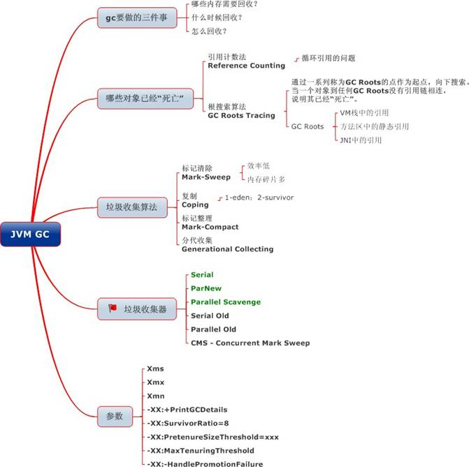
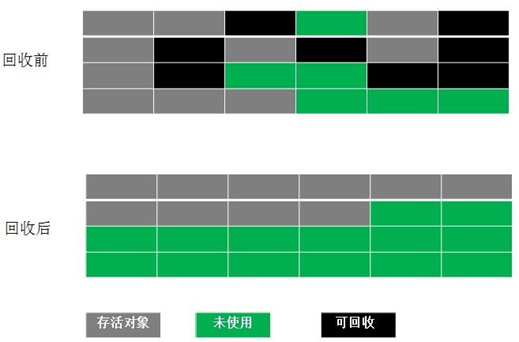
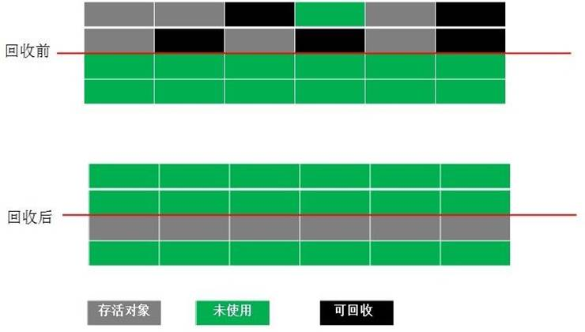

## 垃圾回收与算法

### 1. 引用计数法

在 Java 中，引用和对象是有关联的。如果要操作对象则必须用引用进行。因此，很显然一个简单的办法是通过引用计数来判断一个对象是否可以回收。简单说，即一个对象如果没有任何与之关联的引用，即他们的引用计数都不为 0，则说明对象不太可能再被用到，那么这个对象就是可回收对象。

### 2. 可达性分析

为了解决引用计数法的循环引用问题，Java 使用了可达性分析的方法。通过一系列的“GC roots” 对象作为起点搜索。如果在“GC roots”和一个对象之间没有可达路径，则称该对象是不可达的。

要注意的是，不可达对象不等价于可回收对象，不可达对象变为可回收对象至少要经过两次标记过程。两次标记后仍然是可回收对象，则将面临回收。

### 3.标记清除算法（_Mark-Sweep_）

最基础的垃圾回收算法，分为两个阶段，标注和清除。标记阶段标记出所有需要回收的对象，清除阶段回收被标记的对象所占用的空间。如图

从图中我们就可以发现，该算法最大的问题是内存碎片化严重，后续可能发生大对象不能找到可利用空间的问题。

## 4. 复制算法（_copying_）

为了解决 Mark-Sweep 算法内存碎片化的缺陷而被提出的算法。按内存容量将内存划分为等大小的两块。每次只使用其中一块，当这一块内存满后将尚存活的对象复制到另一块上去，把已使用的内存清掉，如图：

这种算法虽然实现简单，内存效率高，不易产生碎片，但是最大的问题是可用内存被压缩到了原本的一半。且存活对象增多的话，Copying 算法的效率会大大降低。

## 5. 标记整理算法(_Mark-Compact_)

结合了以上两个算法，为了避免缺陷而提出。标记阶段和 Mark-Sweep 算法相同，标记后不是清理对象，而是将存活对象移向内存的一端。然后清除端边界外的对象。如图：

