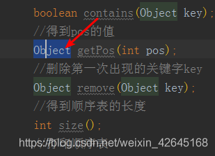
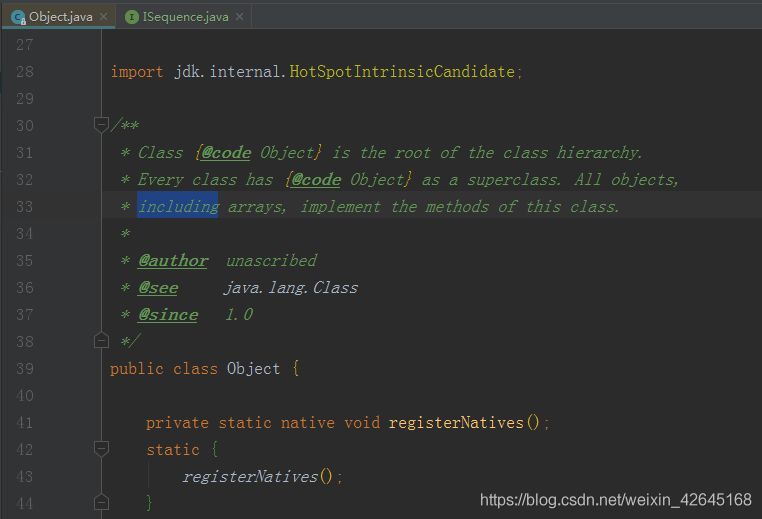
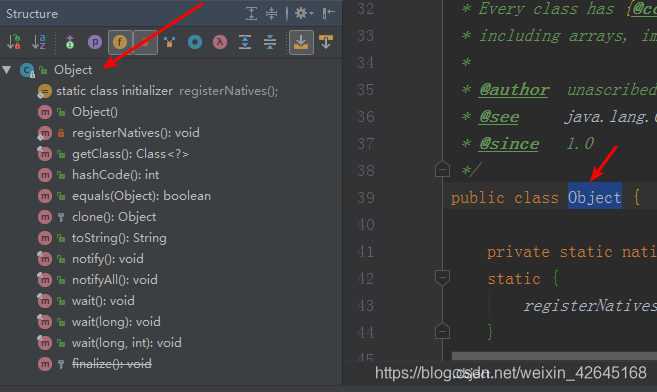
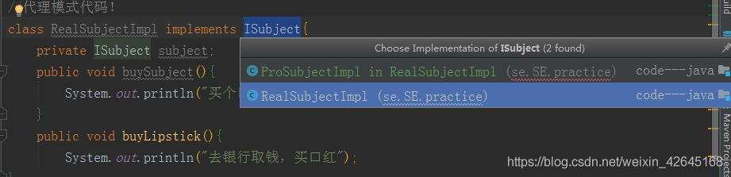
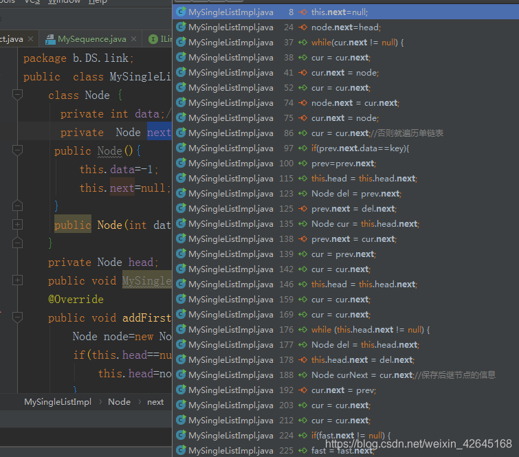

### １查看某类的源码

以 Object 类作为示范

［鼠标选中某类＋ ctrl］

点击后的显示界面：

### ２查看某类方法:

鼠标选中某类：[Alt+7]

### ３查看类继承的关系图

鼠标选中某类［ctrl+Alt+U］

### 4 查看接口的实现类

鼠标选中某接口[Ctrl+Alt+B]

### ５ 查看定义的变量在哪里被调用

鼠标选中该变量[Ctrl+Alt+F7]

---

参考文献:https://blog.csdn.net/weixin_42645168/article/details/102989030

---
