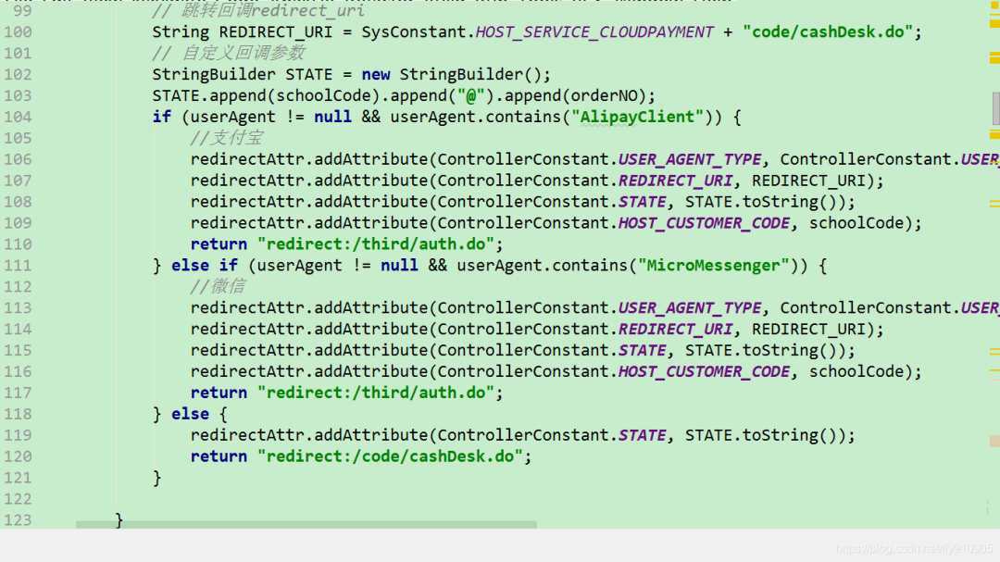
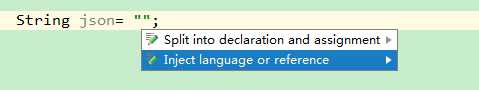
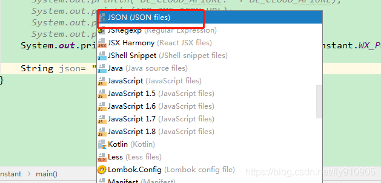
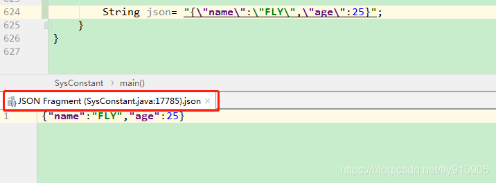

#### 1.设置 maven

> 1.在 File->settings->搜索 maven

> 2.Mavan home directory--设置 maven 安装包的 bin 文件夹所在的位置

> 3.User settings file--设置 setting 文件所在的位置

> 4.Local repository--设置本地仓库

#### 2.IDEA 设置代码行宽度

1. 在 File->settings->Editor->Code Style
2. 有人会问，如果输入的代码超出宽度界线时，如何让 IDE 自动将代码换行？``有两种方式！
3. 第一种，在上述的“Right margin (columns)”的下方，有“Wrap when typing reaches right margin”选项，选中它，是什么效果呢？
4. 随着输入的字符的增加，当代码宽度到达界线时，IDEA 会自动将代码换行。
5. 第一种方式是在输入代码时触发，还有第二种方式，在 File->settings->Code Style->Java 中，选中“Wrapping and Braces”选项卡，
6. 在“Keep when reformatting”中有一个“Ensure rigth margin is not exceeded”，选中它，是什么效果呢？
7. 从配置项的字面意思很容易理解，在格式化 Java 代码时，确保代码没有超过宽度界线。
8. 即输入的代码超出界线后，

#### 3.IDEA 提示不区分大小写

1. 首先打开 File----->setting
2. 然后，输入：``sensitive
3. 将右侧的 case sensitive completion 修改为 NONE

#### 4.IntelliJ 强制更新 Maven Dependencies

> 1.Intellj 自动载入 Mave 依赖的功能很好用，但有时候会碰到问题，导致 pom 文 2.件修改却没有触发自动重新载入的动作，此时需要手动强制更新依赖。
> 如下：`1.手动删除Project Settings里面的Libraries内容； 2.在Maven Project的试图里clean一下，删除之前编译过的文件； 3.项目右键-》Maven-》Reimport 4.Ok， 此时发现依赖已经建立！`

#### 5.idea 的环境配置默认保存位置

> 1.idea 的环境配置默认保存位置:C:\Users\xxxxxxxxx\.IntelliJIdea14 ,xxxxxx 代表用户目录, 2.可以对该目录进行备份,一但环境出问题恢复此配置即可. 3.可以在%IDEA_HOME%/bin/idea.properties 中修改该配置路径.

#### 6.隐藏不想看到的文件或者文件夹（类似 eclipse 的 filter 功能）

> intellij idea 隐藏不想看到的文件或者文件夹（类似 eclipse 的 filter 功能）
> 打开 intellij -->:>File -->>Settings-->>搜索 File Type

#### 7.修改为 Eclipse 快捷键

> File -> Settings -> Keymap => Keymaps 改为 Eclipse copy

#### 8.修改默认设置--default setting

> 修改默认设置--default setting

#### 9.修改智能提示快捷键

> 1.File -> Settings -> Keymap -> Main menu -> Code -> Completion -> Basic=>修改为 Ctrl+Alt+Enter 2.保存时把冲突的 Remove 掉。
> 3.File -> Settings -> Keymap -> Editor Actions -> Complete Current Statement=>修改为 Ctrl+

#### 10.查找快捷键冲突问题处理

> 1.File -> Settings -> Keymap -> Main menu -> Edit ->Find =>修改 Find...和 Replace...分别改为 Ctrl+F 和 Ctrl+R

#### 11.显示行号

> 1.File -> Settings ->Editor ->General -> Appearance =>Show line numbers 选中

#### 12.代码智能提示，忽略大小写

> File -> Settings -> Editor -> Code Completion 里把 Case sensitive completion 设置为 None 就可以了

#### 13.用\*标识编辑过的文件

> 1.Editor–>General –> Editor Tabs 2.在 IDEA 中，你需要做以下设置, 这样被修改的文件会以\*号标识出来，你可以及时保存相关的文件。
> 3.“Mark modifyied tabs with asterisk

#### 14.关闭自动代码提示

> 1.Preferences => IDE Settings => Editor => Code Completion => Autopopup documentation in (ms)

#### 15.常用快捷键

> 1.Ø Top #10 切来切去：`Ctrl+Tab 2.Ø Top #9选你所想【选中上下文相关联代码】：`Ctrl+W
> 3.Ø Top #8 代码生成：`Template/Postfix +Tab 4.Ø Top #7发号施令：`Ctrl+Shift+A
> 5.Ø Top #6 无处藏身：`Shift+Shift 6.Ø Top #5自动完成：`Ctrl+Shift+Enter
> 7.Ø Top #4 创造万物：`Alt+Insert 使用前三名！ 1.Ø Top #1智能补全：`Ctrl+Shift+Space
> 2.Ø Top #1 自我修复：`Alt+Enter 3.Ø Top #1重构一切：`Ctrl+Shift+Alt+T
> 其他辅助 1.以上这些神键配上一些辅助快捷键，即可让你的双手 90%以上的时间摆脱鼠 2 标，专注于键盘仿佛在进行钢琴表演。`这些不起眼却是至关重要的最后一块拼图有： 2.Ø 命令：`Ctrl+Shift+A 可以查找所有 Intellij 的命令，并且每个命令后面还有其快捷键。`所以它不仅是一大神键，也是查找学习快捷键的工具。 3.Ø 新建：`Alt+Insert 可以新建类、方法等任何东西。
> 4.Ø 格式化代码：`格式化import列表Ctrl+Alt+O，格式化代码Ctrl+Alt+L。 5.Ø 切换窗口：`Alt+Num，常用的有 1-项目结构，3-搜索结果，4/5-运行调试。`Ctrl+Tab切换标签页，Ctrl+E/Ctrl+Shift+E打开最近打开过的或编辑过的文件。 6.Ø 单元测试：`Ctrl+Alt+T 创建单元测试用例。
> 7.Ø 运行：`Alt+Shift+F10运行程序，Shift+F9启动调试，Ctrl+F2停止。 8.Ø 调试：`F7/F8/F9 分别对应 Step into，Step over，Continue。
> 此外还有些我自定义的，例如水平分屏 Ctrl+|等，和一些神奇的小功能 9.Ctrl+Shift+V 粘贴 很早以前拷贝过的，Alt+Shift+Insert(块选)进入到列模式进行按列选中

#### 16.svn 不能同步代码问题修正

> File -> Settings ->Subversion ->General => Use command line client 选中 1.使用 command line 方式需要指定 svn.exe 的路径,例如:D:\tools\TortoiseSVN\bin\svn.exe 2.注意,安装 TortoiseSVN 时路径中不要带空格,例如:C:\Program Files\TortoiseSVN\bin\svn.exe 就会报错. 3.安装 TortoiseSVN 选择全部安装组件,否则可能没有 svn.exe

#### 17.设置 idea 的 SVN 忽略掉\*.iml 文件

> 1.Editor->File Types=>Ignore files and folders 增加\*.iml; 2.在 lgnore files and folesrs 中输入.idea;注意要";"结尾。``你就可以隐藏.idea 文件夹

#### 18.改变编辑文本字体大小

> File -> settings -> EDITOR COLORS & FONTS -> FONT -> SIZ

#### 19.IDEA 编码设置

> 1.FILE -> SETTINGS -> FILE ENCODINGS => IDE ENCODING
> 2.FILE -> SETTINGS -> FILE ENCODINGS => Project Encoding
> 3.FILE -> SETTINGS -> FILE ENCODINGS => Default encoding for properties files
> 4.FILE -> SETTINGS -> FILE ENCODINGS => Transparent native-to-ascii conversion

#### 20.Live Templates

> `System.out.println` 快捷输出
> `“abc”.sout => System.out.println("abc");`
> 在 eclipse 中使用方式为：`sysout=> System.out.println();`
>
> for 循环
> `List<String> list = new ArrayList<String>();`
> 输入: `list.for` 即可输出
> `for(String s:list){}`

#### 21.配置 tomcat 参数

> 1.vm options: -Xms256m -Xmx512m -XX:PermSize=128m -XX:MaxPermSize=256m

#### 22.idea 安装插件的方法

> 1.以 IntelliJ IDEA 14.0.1 安装 findbugs 插件为例：
> 2.(1)在线方式:进入 File->setting->plugins->browse repositorits 搜索你要下载的插件名称， 3.右侧可以找到下载地址,完成后按提示重启即可.
> 4.(2)离线安装: 下载 findbugs 插件地址：`5.http://plugins.jetbrains.com/plugin/3847, 6.将下载的FindBugs-IDEA-0.9.994.zip,安装插件：`进入 File->setting-7.>plugins=> Install plugin from disk... 8.定位到到刚才下载的 jar,点击 ok,完成后按提示重启即可. 9.插件安装的位置在 C:\Users\xxxxxxxxx\.IntelliJIdea14\config\plugins\插件名下. 10.安装 iBATIS/MyBatis min-plugin 插件

#### 23.调整 idea 启动时的内存配置参数

> 1.%IDEA_HOME%/bin/idea.exe.vmoptions

#### 24.导入 eclipse web 项目发布到 Tomcat 如果找不到

> 1.导入 eclipse web 项目发布到 Tomcat 如果找不到,可以在环境配置的 Facets 增加 web 支持,在 Artifacts 中增加项目部署模块

#### 25.每次打开一个新 jsp 或 java 文件时,cpu 都占用很高,去掉检验即可

> 每次打开一个新 jsp 或 java 文件时,cpu 都占用很高,去掉检验即可:
> `file->settings->editor->inspection`

#### 26.idea 增加 spring/struts 关联文件支持

> project Settings->Modules->选中项目右键可添加

#### 27. IDEA 开启类修改后自动编译

> 1.File->setting->Buil,Execution,  Deployment->compiler=>Make project automatically 2.编译错误问题解决
> 3.Error:java: Compilation failed: internal java compiler error
> 4.set 中 Java complier 设置的问题 ，项目中有人用 jdk1.6 有人用 jdk1.7 版本不一样 会一起这个错

#### 28.提示实现 Serializable 接口

> 1.使用 Eclipse 或 MyEclipse 的同学可能知道，如果 implements Serializable 接口时，会提示你生成 serialVersionUID。 2.但 Intellij IDEA 默认没启用这个功能。
> 3.Preferences->IEditor->nspections->Serialization issues->Serializable class without ’serialVersionUID’， 4.选中以上后，在你的 class 中：``光标定位在类名前，按 Alt+Enter 就会提示自动创建 serialVersionUID

#### 29.演出模式

> 我们可以使用【Presentation Mode】，将 IDEA 弄到最大，可以让你只关注一个类里面的代码，进行毫无干扰的 coding。
> 可以使用 Alt+V 快捷键，谈出 View 视图，然后选择 Enter Presentation Mode。``效果如下

> 这个模式的好处就是，可以让你更加专注，因为你只能看到特定某个类的代码。`可能读者会问，进入这个模式后，我想看其他类的代码怎么办？`这个时候，就要考验你快捷键的熟练程度了。`你可以使用CTRL+E弹出最近使用的文件。`又或者使用 CTRL+N 和 CTRL+SHIFT+N 定位文件。
>
> 如何退出这个模式呢？`很简单，使用ALT+V弹出view视图，然后选择Exit Presentation Mode 即可。 但是我强烈建议你不要这么做，因为你是可以在Enter Presentation Mode模式下在IDEA里面做任何事情的。`当然前提是，你对 IDEA 足够熟练

#### 30.神奇的 Inject language

> 如果你使用 IDEA 在编写 JSON 字符串的时候，然后要一个一个\去转义双引号的话，就实在太不应该了，又烦又容易出错。
> 在 IDEA 可以使用 Inject language 帮我们自动转义双引号

先将焦点定位到双引号里面，使用 alt+enter 快捷键弹出 inject language 视图，并选中 Inject language or reference。

选择后,切记，要直接按下 enter 回车键，才能弹出 inject language 列表。在列表中选择 json 组件。

选择完后。鼠标焦点自动会定位在双引号里面，这个时候你再次使用 alt+enter 就可以看到

选中 Edit JSON Fragment 并回车，就可以看到编辑 JSON 文件的视图了。

可以看到 IDEA 确实帮我们自动转义双引号了。如果要退出编辑 JSON 信息的视图，只需要使用 ctrl+F4 快捷键即可。

Inject language 可以支持的语言和操作多到你难以想象，读者可以自行研究。

#### 31.强大的 symbol

> 如果你依稀记得某个方法名字几个字母，想在 IDEA 里面找出来，可以怎么做呢？
> 直接使用 ctrl+shift+alt+n，使用 symbol 来查找即可。

#### 32.idea 快捷键和 Windows 默认快捷键冲突解决（如：Ctrl+Alt+↑ 或 Ctrl+Alt+F12）

> 解决方式：``在桌面右键 - 图形选项 - 快捷键 - 禁止 就可以
