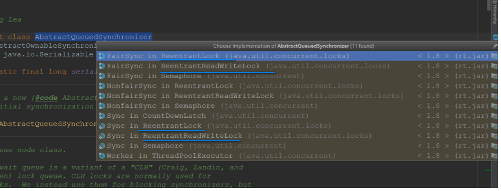
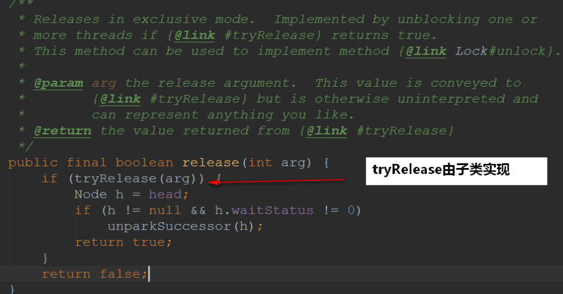

## 一、AQS 是什么？

首先我们来普及一下 juc 是什么：**juc 其实就是包的缩写(java.util.concurrent)**

- 不要被人家唬到了，以为 juc 是什么一个牛逼的东西。其实指的是包而已~

我们可以发现 lock 包下有三个抽象的类：


- AbstractOwnableSynchronizer
- AbstractQueuedLongSynchronizer
- AbstractQueuedSynchronizer

通常地：**AbstractQueuedSynchronizer 简称为 AQS**

我们 Lock 之类的两个常见的锁都是基于它来实现的：



那么我们来看看 AbstractQueuedSynchronizer 到底是什么，看一个类是干什么的**最快途径就是看它的顶部注释**


通读了一遍，可以总结出以下**比较关键**的信息：

- AQS 其实就是一个可以给我们实现锁的**框架**
- 内部实现的关键是：**先进先出的队列、state 状态**
- 定义了内部类 ConditionObject
- 拥有两种线程模式
  - 独占模式
  - 共享模式
- 在 LOCK 包中的相关锁(常用的有 ReentrantLock、 ReadWriteLock)都是**基于 AQS 来构建**
- 一般我们**叫 AQS 为同步器**

## 二、简单看看 AQS

上面也提到了 AQS 里边最重要的是状态和队列，我们接下来就看看其源码是怎么样的...

### 2.1 同步状态

使用 volatile 修饰实现线程可见性：


修改 state 状态值时使用 CAS 算法来实现：


### 2.2 先进先出队列

这个队列被称为：CLH 队列(三个名字组成)，是一个**双向队列**


看看它队列源码的组成：

```java
    static final class Node {

    // 共享
        static final Node SHARED = new Node();

    // 独占
        static final Node EXCLUSIVE = null;

    // 线程被取消了
        static final int CANCELLED =  1;

    // 后继线程需要唤醒
        static final int SIGNAL    = -1;

    // 等待condition唤醒
        static final int CONDITION = -2;

    // 共享式同步状态获取将会无条件地传播下去(没看懂)
        static final int PROPAGATE = -3;


    // 初始为0，状态是上面的几种
        volatile int waitStatus;

    // 前置节点
        volatile Node prev;

    // 后继节点
        volatile Node next;


        volatile Thread thread;


        Node nextWaiter;

        final boolean isShared() {
            return nextWaiter == SHARED;
        }


        final Node predecessor() throws NullPointerException {
            Node p = prev;
            if (p == null)
                throw new NullPointerException();
            else
                return p;
        }

        Node() {    // Used to establish initial head or SHARED marker
        }

        Node(Thread thread, Node mode) {     // Used by addWaiter
            this.nextWaiter = mode;
            this.thread = thread;
        }

        Node(Thread thread, int waitStatus) { // Used by Condition
            this.waitStatus = waitStatus;
            this.thread = thread;
        }
    }

```

### 2.3acquire 方法

获取独占锁的过程就是在 acquire 定义的，该方法用到了**模板设计模式**，由子类实现的~


> 过程：acquire(int)尝试获取资源，如果获取失败，将线程插入等待队列。插入等待队列后，acquire(int)并没有放弃获取资源，而是根据前置节点状态状态判断是否应该继续获取资源，如果前置节点是头结点，继续尝试获取资源，如果前置节点是 SIGNAL 状态，就中断当前线程，否则继续尝试获取资源。直到当前线程被 park()或者获取到资源，acquire(int)结束。

来源：

- https://blog.csdn.net/panweiwei1994/article/details/78769703

### 2.4release 方法

释放独占锁的过程就是在 acquire 定义的，该方法也用到了**模板设计模式**，由子类实现的~


> 过程:首先调用子类的 tryRelease()方法释放锁,然后唤醒后继节点,在唤醒的过程中,需要判断后继节点是否满足情况,如果后继节点不为且不是作废状态,则唤醒这个后继节点,否则从 tail 节点向前寻找合适的节点,如果找到,则唤醒.

来源：

- https://zhuanlan.zhihu.com/p/27134110

## ReentrantLock 和 ReentrantReadWriteLock

上一篇已经将 Lock 锁的基础 AQS 简单地过了一遍了，因此本篇主要是讲解 Lock 锁主要的两个子类：

- ReentrantLock
- ReentrantReadWriteLock

那么接下来我们就开始吧~

## 一、ReentrantLock 锁

首先我们来看看 ReentrantLock 锁的**顶部注释**，来看看他的相关特性呗：


来总结一下要点吧：

- 比 synchronized 更有伸缩性(灵活)
- 支持公平锁(是相对公平的)
- 使用时最标准用法是在 try 之前调用 lock 方法，在 finally 代码块释放锁

```java
class X {
    private final ReentrantLock lock = new ReentrantLock();
    // ...

    public void m() {
        lock.lock();  // block until condition holds
        try {
            // ... method body
        } finally {
            lock.unlock()
        }
    }
}
```

### 1.1 内部类

首先我们可以看到有三个内部类：


这些内部类都是 AQS 的子类，这就印证了我们之前所说的：**AQS 是 ReentrantLock 的基础，AQS 是构建锁、同步器的框架**

- 可以很清晰的看到，我们的 ReentrantLock 锁是支持公平锁和非公平锁的~


### 1.2 构造方法


### 1.3 非公平 lock 方法

尝试获取锁，获取失败的话就调用 AQS 的`acquire(1)`方法


`acquire(1)`方法我们在 AQS 时简单看过，其中`tryAcquire()`是子类来实现的


我们去看看`tryAcquire()`：


### 1.4 公平 lock 方法

公平的 lock 方法其实就**多了一个状态条件**：


这个方法主要是判断**当前线程是否位于 CLH 同步队列中的第一个。如果是则返回 flase，否则返回 true**。


### 1.5unlock 方法


unlock 方法也是在 AQS 中定义的：



去看看`tryRelease(arg)`是怎么实现的：


## 二、ReentrantReadWriteLock

我们知道 synchronized 内置锁和 ReentrantLock 都是**互斥锁**(一次只能有一个线程进入到临界区(被锁定的区域))

而 ReentrantReadWriteLock 是一个**读写锁**：

- 在**读**取数据的时候，可以**多个线程同时进入到到临界区**(被锁定的区域)
- 在**写**数据的时候，无论是读线程还是写线程都是**互斥**的

一般来说：我们大多数都是读取数据得多，修改数据得少。所以这个读写锁在这种场景下就很有用了！

读写锁有一个接口 ReadWriteLock，定义的方法就两个：


我们还是来看看顶部注释说得啥吧：


其实大概也是说明了：**在读的时候可以共享，在写的时候是互斥的**

接下来我们还是来看看对应的实现类吧：


按照惯例也简单看看它的顶部注释：


于是我们可以总结出读写锁的一些要点了：

- 读锁不支持条件对象，写锁支持条件对象
- 读锁不能升级为写锁，写锁可以降级为读锁
- 读写锁也有公平和非公平模式
- **读锁支持多个读线程进入临界区，写锁是互斥的**

### 2.1ReentrantReadWriteLock 内部类

ReentrantReadWriteLock 比 ReentrantLock 锁**多了两个内部类(都是 Lock 实现)来维护读锁和写锁**，但是**主体还是使用 Syn**：

- WriteLock
- ReadLock


### 2.2 读锁和写锁的状态表示

在 ReentrantLock 锁上使用的是 state 来表示同步状态(也可以表示重入的次数)，而在 ReentrantReadWriteLock 是这样代表读写状态的：


### 2.3 写锁的获取

主要还是调用 syn 的`acquire(1)`：


进去看看实现：


### 2.4 读锁获取

写锁的获取调用的是`acquireShared(int arg)`方法：


内部调用的是：`doAcquireShared(arg);`方法(实现也是在 Syn 的)，我们来看看：


## 三、最后

这里就简单总结一下本文的内容吧：

- **AQS 是**ReentrantReadWriteLock 和 ReentrantLock 的**基础**，因为默认的实现都是在内部类 Syn 中，而 Syn 是继承 AQS 的~
- ReentrantReadWriteLock 和 ReentrantLock**都支持公平和非公平模式**，公平模式下会去看 FIFO 队列线程是否是在队头，而非公平模式下是没有的
- ReentrantReadWriteLock 是一个读写锁，如果读的线程比写的线程要多很多的话，那可以考虑使用它。它使用 state 的变量**高 16 位是读锁，低 16 位是写锁**
- **写锁可以降级为读锁，读锁不能升级为写锁**
- **写锁是互斥的，读锁是共享的**。
