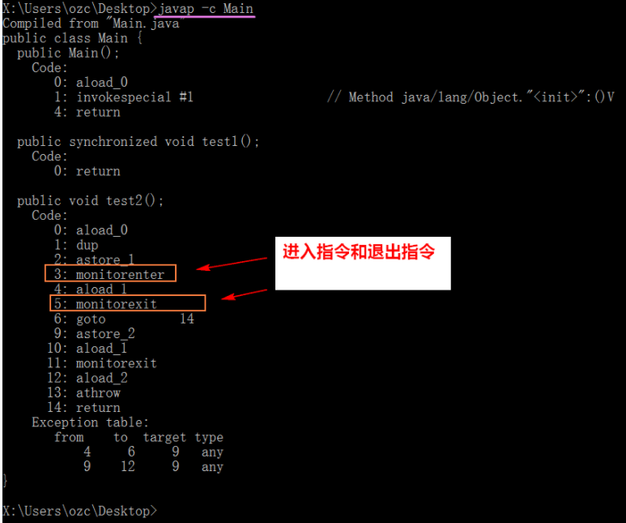
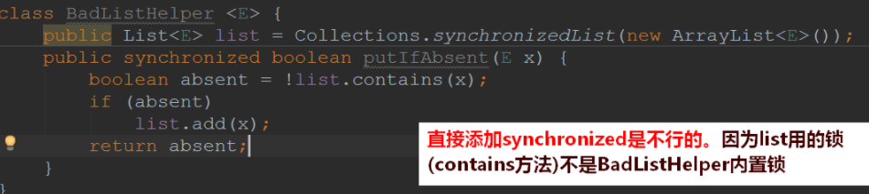
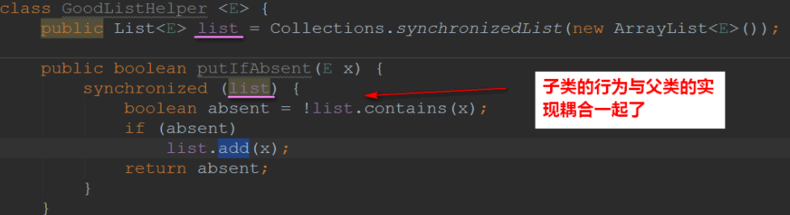
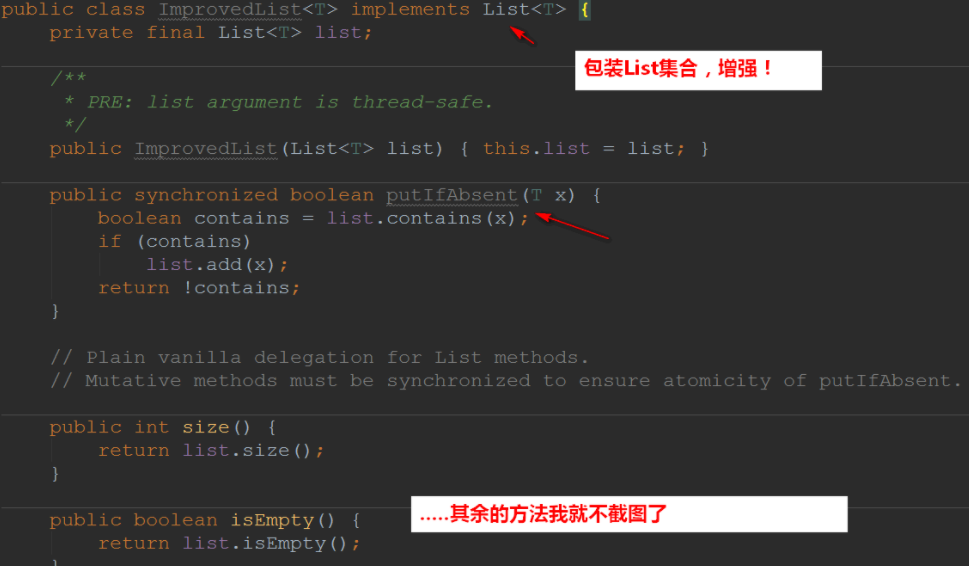
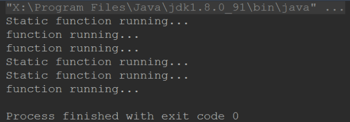
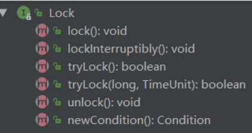
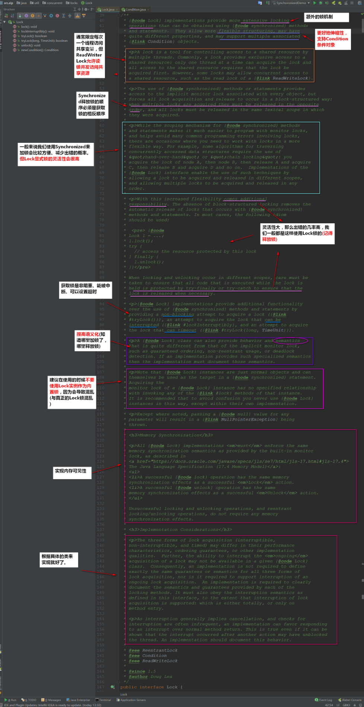

## 一、synchronized 锁

### 1.1synchronized 锁是什么？

synchronized 是 Java 的一个**关键字**，它能够将**代码块(方法)锁起来**

- 它使用起来是非常简单的，只要在代码块(方法)添加关键字 synchronized，即可以**实现同步**的功能~

```java
    public synchronized void test() {
        // 关注公众号Java3y
        // doSomething
    }
```

synchronized 是一种**互斥锁**

- **一次只能允许一个线程进入被锁住的代码块**

synchronized 是一种**内置锁/监视器锁**

- Java 中**每个对象**都有一个**内置锁(监视器,也可以理解成锁标记)**，而 synchronized 就是使用**对象的内置锁(监视器)**来将代码块(方法)锁定的！ (锁的是对象，但我们同步的是方法/代码块)

### 1.2synchronized 用处是什么？

- synchronized 保证了线程的**原子性**。(被保护的代码块是一次被执行的，没有任何线程会同时访问)
- synchronized 还保证了**可见性**。(当执行完 synchronized 之后，修改后的变量对其他的线程是可见的)

Java 中的 synchronized，通过使用内置锁，来实现对变量的同步操作，进而实现了**对变量操作的原子性和其他线程对变量的可见性**，从而确保了并发情况下的线程安全。

### 1.3synchronized 的原理

我们首先来看一段 synchronized 修饰方法和代码块的代码：

```java
public class Main {
  //修饰方法
    public synchronized void test1(){

    }


    public void test2(){
    // 修饰代码块
        synchronized (this){

        }
    }
}
```

来反编译看一下：



**同步代码块**：

- monitorenter 和 monitorexit 指令实现的

**同步方法**（在这看不出来需要看 JVM 底层实现）

- 方法修饰符上的 ACC_SYNCHRONIZED 实现。

synchronized 底层是是**通过 monitor 对象，对象有自己的对象头，存储了很多信息，其中一个信息标示是被哪个线程持有**。

### 1.4synchronized 如何使用

synchronized 一般我们用来修饰三种东西：

- 修饰普通方法
- 修饰代码块
- 修饰静态方法

#### 1.4.1 修饰普通方法：

用的锁是**Java3y 对象(内置锁)**

```java
public class Java3y {


    // 修饰普通方法，此时用的锁是Java3y对象(内置锁)
    public synchronized void test() {
        // 关注公众号Java3y
        // doSomething
    }

}

```

#### 1.4.2 修饰代码块：

用的锁是**Java3y 对象(内置锁)**--->this

```java
public class Java3y {

    public  void test() {

        // 修饰代码块，此时用的锁是Java3y对象(内置锁)--->this
        synchronized (this){
            // 关注公众号Java3y
            // doSomething
        }
    }
}
```

当然了，我们使用 synchronized 修饰代码块时未必使用 this，还可以**使用其他的对象(随便一个对象都有一个内置锁)**

所以，我们可以这样干：

```java
public class Java3y {


    // 使用object作为锁(任何对象都有对应的锁标记，object也不例外)
    private Object object = new Object();


    public void test() {

        // 修饰代码块，此时用的锁是自己创建的锁Object
        synchronized (object){
            // 关注公众号Java3y
            // doSomething
        }
    }

}

```

上面那种方式(随便使用一个对象作为锁)在书上称之为-->**客户端锁**，这是**不建议使用的**。

书上想要实现的功能是：给 ArrayList 添加一个`putIfAbsent()`，这需要是线程安全的。

**假定直接添加 synchronized 是不可行的**



**使用客户端锁，会将当前的实现与原本的 list 耦合了**：



书上给出的办法是使用**组合**的方式(也就是装饰器模式)



#### 1.4.3 修饰静态方法

获取到的是**类锁(类的字节码文件对象)**：Java3y.class

```java
public class Java3y {

    // 修饰静态方法代码块，静态方法属于类方法，它属于这个类，获取到的锁是属于类的锁(类的字节码文件对象)-->Java3y.class
    public static  synchronized void test() {

        // 关注公众号Java3y
        // doSomething
    }
}
```

#### 1.4.4 类锁与对象锁

synchronized 修饰静态方法获取的是类锁(类的字节码文件对象)，synchronized 修饰普通方法或代码块获取的是对象锁。

- 它俩是不冲突的，也就是说：**获取了类锁的线程和获取了对象锁的线程是不冲突的**！

```java
public class SynchoronizedDemo {

    //synchronized修饰非静态方法
    public synchronized void function() throws InterruptedException {
        for (int i = 0; i <3; i++) {
            Thread.sleep(1000);
            System.out.println("function running...");
        }
    }
    //synchronized修饰静态方法
    public static synchronized void staticFunction()
            throws InterruptedException {
        for (int i = 0; i < 3; i++) {
            Thread.sleep(1000);
            System.out.println("Static function running...");
        }
    }

    public static void main(String[] args) {
        final SynchoronizedDemo demo = new SynchoronizedDemo();

        // 创建线程执行静态方法
        Thread t1 = new Thread(() -> {
            try {
                staticFunction();
            } catch (InterruptedException e) {
                e.printStackTrace();
            }
        });

        // 创建线程执行实例方法
        Thread t2 = new Thread(() -> {
            try {
                demo.function();
            } catch (InterruptedException e) {
                e.printStackTrace();
            }
        });
        // 启动
        t1.start();
        t2.start();
    }
}
```

结果证明：**类锁和对象锁是不会冲突的**！



### 1.5 重入锁

我们来看下面的代码：

```java
public class Widget {

  // 锁住了
  public synchronized void doSomething() {
    ...
  }
}

public class LoggingWidget extends Widget {

  // 锁住了
  public synchronized void doSomething() {
    System.out.println(toString() + ": calling doSomething");
    super.doSomething();
  }
}
```

1. 当线程 A 进入到 LoggingWidget 的`doSomething()`方法时，**此时拿到了 LoggingWidget 实例对象的锁**。
2. 随后在方法上又调用了父类 Widget 的`doSomething()`方法，它**又是被 synchronized 修饰**。
3. 那现在我们 LoggingWidget 实例对象的锁还没有释放，进入父类 Widget 的`doSomething()`方法**还需要一把锁吗？**

**不需要的！**

因为**锁的持有者是“线程”，而不是“调用”**。线程 A 已经是有了 LoggingWidget 实例对象的锁了，当再需要的时候可以继续**“开锁”**进去的！

这就是内置锁的**可重入性**。记住，**持有锁的是线程**。

### 1.6 释放锁的时机

1. 当方法(代码块)执行完毕后会**自动释放锁**，不需要做任何的操作。
2. **当一个线程执行的代码出现异常时，其所持有的锁会自动释放**。

- 不会由于异常导致出现死锁现象~

## 二、Lock 显式锁

### 2.1Lock 显式锁简单介绍

Lock 显式锁是 JDK1.5 之后才有的，之前我们都是使用 Synchronized 锁来使线程安全的~

Lock 显式锁是一个接口，我们来看看：



随便翻译一下他的顶部注释，看看是干嘛用的：



可以**简单概括**一下：

- Lock 方式来获取锁**支持中断、超时不获取、是非阻塞的**
- **提高了语义化**，哪里加锁，哪里解锁都得写出来
- **Lock 显式锁可以给我们带来很好的灵活性，但同时我们必须手动释放锁**
- 支持 Condition 条件对象
- **允许多个读线程同时访问共享资源**

### 2.2synchronized 锁和 Lock 锁使用哪个

前面说了，Lock 显式锁给我们的程序带来了很多的灵活性，很多特性都是 Synchronized 锁没有的。那 Synchronized 锁有没有存在的必要？？

必须是有的！！Lock 锁在刚出来的时候很多性能方面都比 Synchronized 锁要好，但是从 JDK1.6 开始 Synchronized 锁就做了各种的优化(毕竟亲儿子，牛逼)

- 优化操作：适应自旋锁，锁消除，锁粗化，轻量级锁，偏向锁。

所以，到现在 Lock 锁和 Synchronized 锁的性能其实**差别不是很大**！而 Synchronized 锁用起来又特别简单。**Lock 锁还得顾忌到它的特性，要手动释放锁才行**(如果忘了释放，这就是一个隐患)

所以说，我们**绝大部分时候还是会使用 Synchronized 锁**，用到了 Lock 锁提及的特性，带来的灵活性才会考虑使用 Lock 显式锁~

### 2.3 公平锁

公平锁理解起来非常简单：

- 线程将按照它们**发出请求的顺序来获取锁**

非公平锁就是：

- 线程发出请求的时可以**“插队”**获取锁

Lock 和 synchronize 都是**默认使用非公平锁的**。如果不是必要的情况下，不要使用公平锁

- 公平锁会来带一些性能的消耗的

## 三、Java 锁简单总结

本文讲了 synchronized 内置锁和简单描述了一下 Lock 显式锁，总得来说：

- **synchronized 好用，简单，性能不差**
- 没有使用到 Lock 显式锁的特性就不要使用 Lock 锁了。
