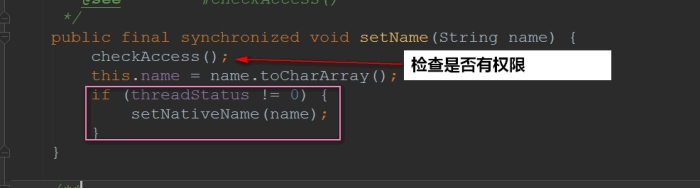

## **一、初识多线程**

### **1.1 介绍进程**

讲到线程，又不得不提进程了~

进程我们估计是很了解的了，在 windows 下打开任务管理器，可以发现我们在操作系统上运行的程序都是进程：


**进程的定义：**

进程是**程序的一次执行**，进程是一个程序及其数据在处理机上顺序执行时所发生的**活动**，进程是具有独立功能的程序在一个数据集合上运行的过程，它是系统进行资源**分配和调度的一个独立单位**

- **进程是系统进行资源分配和调度的独立单位。每一个进程都有它自己的内存空间和系统资源**

### **1.2 回到线程**

那系统有了进程这么一个概念了，进程已经是可以进行资源分配和调度了，**为什么还要线程呢**？

为使程序能并发执行，系统必须进行以下的一系列操作：

(1)**创建进程**，系统在创建一个进程时，必须为它分配其所必需的、除处理机以外的所有资源，如内存空间、I/O 设备，以及建立相应的 PCB；

(2)**撤消进程**，系统在撤消进程时，又必须先对其所占有的资源执行回收操作，然后再撤消 PCB；

(3)**进程切换**，对进程进行上下文切换时，需要保留当前进程的 CPU 环境，设置新选中进程的 CPU 环境，因而须花费不少的处理机时间。


可以看到进程实现多处理机环境下的进程调度，分派，切换时，**都需要花费较大的时间和空间开销**

引入线程主要是 **为了提高系统的执行效率，减少处理机的空转时间和调度切换的时间，以及便于系统管理。** 使 OS 具有更好的并发性

简单来说：**进程实现多处理**非常耗费 CPU 的资源，而我们**引入线程是作为调度和分派的基本单位** （取代进程的部分基本功能**调度**）。

那么线程在哪呢？？举个例子：


也就是说：**在同一个进程内又可以执行多个任务，而这每一个任务我就可以看出是一个线程**。

所以说：**一个进程会有 1 个或多个线程的**！

### **1.3 进程与线程**

于是我们可以总结出：

- 进程作为资源**分配**的基本单位

- 线程作为资源**调度**的基本单位，**是程序的执行单元，执行路径**(单线程：一条执行路径，多线程：多条执行路径)。是程序使用 CPU 的最基本单位。

线程有**3 个基本状态**：

- 执行、就绪、阻塞

线程有**5 种基本操作**：

- 派生、阻塞、激活、 调度、 结束


**线程的属性：**

1)轻型实体；

2)独立调度和分派的基本单位；

3)可并发执行；

4)共享进程资源。

线程有**两个基本类型**：

1. **用户级线程**：管理过程全部由用户程序完成，**操作系统内核心只对进程进行管理。**

2. **系统级线程**(核心级线程)：**由操作系统内核进行管理**。操作系统内核给应用程序提供相应的系统调用和应用程序接口 API，以使用户程序可以创建、执行以及撤消线程。


值得注意的是：多线程的存在，不是提高程序的执行速度。其实**是为了提高应用程序的使用率**，程序的执行其实都是在**抢 CPU 的资源**，CPU 的执行权。多个进程是在抢这个资源，**而其中的某一个进程如果执行路径比较多**，就会有**更高的几率**抢到 CPU 的执行权

### **1.4 并行与并发**

**并行：**

- 并行性是指**同一时刻内**发生两个或多个事件。

- 并行是在**不同**实体上的多个事件

**并发：**

- 并发性是指**同一时间间隔内**发生两个或多个事件。

- 并发是在**同一实体**上的多个事件

由此可见：并行是针对进程的，**并发是针对线程的**。

### **1.5 Java 实现多线程**

上面说了一大堆基础，理解完的话。我们回到 Java 中，看看 Java 是如何实现多线程的~

Java 实现多线程是使用 Thread 这个类的，我们来看看**Thread 类的顶部注释**：


通过上面的顶部注释我们就可以发现，创建多线程有**三种**方法：

- 继承 Thread，重写 run 方法

- 实现 Runnable 接口，重写 run 方法

- 实现 Callable 接口，重写 run 方法

#### **1.5.1 继承 Thread，重写 run 方法**

**创建一个类，继承 Thread，重写 run 方法**

```java
public class MyThread extends Thread {

 @Override
public void run() {
for(int x = 0; x < 200; x++) {
 System.out.println(x);
 }
 }

}
```

我们调用一下测试看看：

```java
public class MyThreadDemo {
public static void main(String[] args) {
// 创建两个线程对象
MyThread my1 = new MyThread();
MyThread my2 = new MyThread();

 my1.start();
my2.start();
 }
}
```


#### **1.5.2 实现 Runnable 接口，重写 run 方法**

**实现 Runnable 接口，重写 run 方法**

```java
public class MyRunnable implements Runnable {

	@Override
	public void run() {
		for (int x = 0; x < 100; x++) {
			System.out.println(x);
		}
	}

}
```

我们调用一下测试看看：

```java
public class MyRunnableDemo {
	public static void main(String[] args) {
		// 创建MyRunnable类的对象
		MyRunnable my = new MyRunnable();

		Thread t1 = new Thread(my);
		Thread t2 = new Thread(my);

		t1.start();
		t2.start();
	}
}
```

结果还是跟上面是**一样**的，这里我就不贴图了~~~

### **1.6 Java 实现多线程需要注意的细节**

不要将 run()和 start()搞混了~

**run()和 start()方法区别：**

- `run()`:仅仅是**封装被线程执行的代码**，直接调用是普通方法

- `start()`:首先**启动了线程**，然后再**由 jvm 去调用该线程的 run()方法。**

**jvm 虚拟机的启动是单线程的还是多线程的?**

- **是多线程的**。不仅仅是启动 main 线程，还至少会启动垃圾回收线程的，不然谁帮你回收不用的内存~

那么，既然有两种方式实现多线程，我们**使用哪一种**？？？

**一般我们使用实现 Runnable 接口**

- **可以避免 java 中的单继承的限制**

- 应该将并发**运行任务和运行机制解耦**，因此我们选择实现 Runnable 接口这种方式！

## **二、Thread 类解析**

### **1. Thread 线程类 API**

声明本文使用的是 JDK1.8

实现多线程从本质上都是由 Thread 类来进行操作的~我们来看看 Thread 类一些**重要的知识点**。Thread 这个类很大，不可能整个把它看下来，只能**看一些常见的、重要的方法**。

### **1.1 设置线程名**

我们在使用多线程的时候，想要查看线程名是很简单的，调用 `Thread.currentThread().getName()`即可。

如果没有做什么的设置，我们会发现线程的名字是这样子的：**主线程叫做 main，其他线程是 Thread-x**

下面我就带着大家来看看它是怎么命名的：


`nextThreadNum()`的方法实现是这样的：


基于这么一个变量-->**线程初始化的数量**


点进去看到 init 方法就可以确定了：


看到这里，如果我们想要为线程起个名字，那也是很简单的。**Thread 给我们提供了构造方法**！


下面我们来测试一下：

实现了 Runnable 的方式来实现多线程：

```java
public class MyThread implements Runnable {

    @Override
    public void run() {
		// 打印出当前线程的名字
        System.out.println(Thread.currentThread().getName());
    }
}
```

测试：

```java
public class MyThreadDemo {
    public static void main(String[] args) {


        MyThread myThread = new MyThread();

        //带参构造方法给线程起名字
        Thread thread1 = new Thread(myThread, "关注公众号Java3y");
        Thread thread2 = new Thread(myThread, "qq群：742919422");


        thread1.start();
        thread2.start();

		// 打印当前线程的名字
        System.out.println(Thread.currentThread().getName());
    }
}
```

结果：


当然了，我们还可以通过 `setName(String name)`的方法来改掉线程的名字的。我们来看看方法实现；



检查是否有权限修改：


至于 threadStatus 这个状态属性，**貌似没发现他会在哪里修改**：


### **1.2 守护线程**

守护线程是**为其他线程服务的**

- **垃圾回收线程就是守护线程**~

守护线程有一个**特点**：

- 当别的用户线程执行完了，虚拟机就会退出，守护线程也就会被停止掉了。
- 也就是说：守护线程作为一个**服务线程，没有服务对象就没有必要继续运行**了

**使用线程的时候要注意的地方**

**在线程启动前**设置为守护线程，方法是 `setDaemon(boolean on)`

使用守护线程**不要访问共享资源**(数据库、文件等)，因为它可能会在任何时候就挂掉了。

守护线程中产生的新线程也是守护线程

测试一波：

```java
public class MyThreadDemo {
public static void main(String[] args) {
    MyThread myThread = new MyThread();
 //带参构造方法给线程起名字
 Thread thread1 = new Thread(myThread, "关注公众号 Java3y");
Thread thread2 = new Thread(myThread, "qq 群：742919422");

 // 设置为守护线程
 thread2.setDaemon(true);

 thread1.start();
 thread2.start();
System.out.println(Thread.currentThread().getName());
}
}
```

上面的代码运行多次可以出现(电脑性能足够好的同学可能测试不出来)：**线程 1 和主线程执行完了，我们的守护线程就不执行了**~


原理：这也就为什么我们要在**启动之前**设置守护线程了。


### **1.3 优先级线程**

线程优先级高仅仅表示线程**获取的 CPU 时间片的几率高**，但这不是一个**确定的因素**！

线程的优先级是**高度依赖于操作系统的**，Windows 和 Linux 就有所区别(Linux 下优先级可能就被忽略了)~

可以看到的是，Java 提供的优先级默认是 5，最低是 1，最高是 10：


实现：


setPriority0 是一个本地(navite)的方法：

```java
private native void setPriority0(int newPriority);
```

### **1.4 线程生命周期**

在上一篇介绍的时候其实也提过了线程的线程有 3 个基本状态：执行、就绪、阻塞

在 Java 中我们就有了这个图，Thread 上很多的方法都是**用来切换线程的状态**的，这一部分是重点！


其实上面这个图是不够完整的，**省略**掉了一些东西。后面在讲解的线程状态的时候我会重新画一个~

下面就来讲解与线程生命周期相关的方法~

#### **1.4.1 sleep 方法**

调用 sleep 方法会进入计时等待状态，等时间到了，**进入的是就绪状态而并非是运行状态**！


于是乎，我们的图就可以补充成这样：


#### **1.4.2 yield 方法**

调用 yield 方法会先**让别的线程执行**，但是**不确保真正让出**

- 意思是：**我有空，可以的话，让你们先执行**


于是乎，我们的图就可以补充成这样：


#### **1.4.3 join 方法**

调用 join 方法，会等待**该线程**执行**完毕后才执行别的线程**~


我们进去看看**具体的实现**：


wait 方法是在 Object 上定义的，它是 native 本地方法，所以就看不了了：


**wait**方法实际上它也是 **计时等待(如果带时间参数)** 的一种！，于是我们可以补充我们的图：


#### **1.4.4 interrupt 方法**

线程中断在之前的版本有 stop 方法，但是被设置过时了。现在已经**没有强制线程终止**的方法了！

由于 stop 方法可以让**一个线程 A 终止掉另一个线程 B**

- 被终止的线程 B 会立即释放锁，这可能会让**对象处于不一致的状态**。

- **线程 A 也不知道线程 B 什么时候能够被终止掉**，万一线程 B 还处理运行计算阶段，线程 A 调用 stop 方法将线程 B 终止，那就很无辜了~

总而言之，Stop 方法太暴力了，不安全，所以被设置过时了。

我们一般使用的是 interrupt 来**请求终止线程**~

- 要注意的是：interrupt**不会真正停止**一个线程，它仅仅是给这个线程发了一个信号告诉它，它应该要结束了(明白这一点非常重要！)

- 也就是说：Java 设计者实际上是**想线程自己来终止**，通过上面的**信号**，就可以判断处理什么业务了。

- 具体到底中断还是继续运行，应该**由被通知的线程自己处理**

```java
Thread t1 = new Thread( new Runnable(){
public void run(){
// 若未发生中断，就正常执行任务
while(!Thread.currentThread.isInterrupted()){
// 正常任务代码……
}
// 中断的处理代码……
doSomething();
}
} ).start();
```

再次说明：调用 interrupt()**并不是要真正终止掉当前线程**，仅仅是设置了一个中断标志。这个中断标志可以给我们用来判断**什么时候该干什么活**！什么时候中断**由我们自己来决定**，这样就可以**安全地终止线程**了！

我们来看看源码是怎么讲的吧：


再来看看刚才说抛出的异常是什么东东吧：


所以说：**interrupt 方法压根是不会对线程的状态造成影响的，它仅仅设置一个标志位罢了**

interrupt 线程中断还有另外**两个方法(检查该线程是否被中断)**：

- 静态方法 interrupted()-->**会清除中断标志位**

- 实例方法 isInterrupted()-->**不会清除中断标志位**


上面还提到了，如果阻塞线程调用了 interrupt()方法，那么会**抛出异常，设置标志位为 false，同时该线程会退出阻塞**的。我们来测试一波：

```java
public class Main {
/**
**@param args
**/
public static void main(String[] args) {
Main main = new Main();

 // 创建线程并启动
 Thread t = new Thread(main.runnable);
 System.out.println("This is main ");
 t.start();

 try {

 // 在 main 线程睡个 3 秒钟*
 Thread.sleep(3000);
 } catch (InterruptedException e) {
System.out.println("In main");
 e.printStackTrace();
 }

 // 设置中断
 t.interrupt();
}

Runnable runnable = () -> {
int i = 0;
try {
while (i < 1000) {

 // 睡个半秒钟我们再执行
 Thread.sleep(500);

 System.out.println(i++);
 }
 } catch (InterruptedException e) {

// 判断该阻塞线程是否还在
      System.out.println(Thread.currentThread().isAlive());

// 判断该线程的中断标志位状态
System.out.println(Thread.currentThread().isInterrupted());

 System.out.println("In Runnable");
 e.printStackTrace();
 }
};
}
```

结果：


接下来我们分析它的**执行流程**是怎么样的：


## 三、使用多线程需要注意的问题

### 1.使用多线程遇到的问题

### 1.1 线程安全问题

在前面的文章中已经讲解了线程【[多线程三分钟就可以入个门了！](https://mp.weixin.qq.com/s?__biz=MzI4Njg5MDA5NA==&mid=2247484186&idx=1&sn=2a7b937e6d3b1623aceac199d3e402f9&chksm=ebd7421bdca0cb0d6206db8c7f063c884c3f0b285975c8e896fde424660b4ccb88da1549f32c#rd)】，多线程主要是为了提高我们**应用程序的使用率**。但同时，这会给我们**带来很多安全问题**！

如果我们在**单线程**中以“顺序”(串行-->独占)的方式执行代码**是没有任何问题**的。但是到了多线程的环境下(并行)，如果没有设计和控制得好，就会给我们带来很多**意想不到的状况，也就是线程安全性问题**

因为在多线程的环境下，线程是**交替执行**的，一般他们会使用多个线程**执行相同的代码**。如果在此相同的代码里边有着**共享的变量**，或者一些**组合操作**，我们想要的**正确**结果就很容易出现了问题

简单举个例子：

- **下面的程序在单线程中跑起来，是没有问题的**。

```java
public class UnsafeCountingServlet extends GenericServlet implements Servlet {
    private long count = 0;

    public long getCount() {
        return count;
    }

    public void service(ServletRequest servletRequest, ServletResponse servletResponse) throws ServletException, IOException {

        ++count;
        // To something else...
    }
}
```

但是在多线程环境下跑起来，它的**count 值计算**就不对了！

首先，它**共享**了 count 这个变量，其次来说`++count;`这是一个**组合的操作**(注意，**它并非是原子性**）

- `++count`实际上的操作是这样子的：
  - 读取 count 值
  - 将值+1
  - 将计算结果写入 count

于是多线程执行的时候**很可能**就会有这样的情况：

- 当线程 A 读取到 count 的值是 8 的时候，**同时**线程 B 也进去这个方法上了，也是读取到 count 的值为 8
- 它俩都对值进行加 1
- 将计算结果写入到 count 上。但是，**写入到 count 上的结果是 9**
- 也就是说：两个线程进来了，但是**正确的结果是应该返回 10**，而它返回了 9，这是不正常的！

如果说：当多个线程访问某个类的时候，这个类**始终**能表现出**正确的行为**，那么这个类就是线程安全的！

有个原则：**能使用 JDK 提供的线程安全机制，就使用 JDK 的**。

当然了，此部分其实是我们**学习多线程最重要的环节**，这里我就不详细说了。这里只是一个总览，这些知识点在后面的学习中都会遇到~~~

### 1.2 性能问题

使用多线程我们的目的就是为了提高应用程序的使用率，但是如果多线程的代码**没有好好设计**的话，那未必会提高效率。**反而降低了效率，甚至会造成死锁**！

就比如说我们的 Servlet，一个 Servlet 对象可以处理多个请求的，**Servlet 显然是一个天然支持多线程的**。

又以下面的例子来说吧：

```java
public class UnsafeCountingServlet extends GenericServlet implements Servlet {
    private long count = 0;

    public long getCount() {
        return count;
    }

    public void service(ServletRequest servletRequest, ServletResponse servletResponse) throws ServletException, IOException {

        ++count;
        // To something else...
    }
}
```

从上面我们已经说了，上面**这个类是线程不安全的**。最简单的方式：如果我们在 service 方法上加上 JDK 为我们提供的内置锁 synchronized，那么我们就可以实现线程安全了。

```java
public class UnsafeCountingServlet extends GenericServlet implements Servlet {
    private long count = 0;

    public long getCount() {
        return count;
    }

    public void synchronized service(ServletRequest servletRequest, ServletResponse servletResponse) throws ServletException, IOException {

        ++count;
        // To something else...
    }
}
```

虽然实现了线程安全了，但是这会带来**很严重的性能问题**：

- 每个请求都得**等待**上一个请求的 service 方法**处理了以后**才可以完成对应的操作

这就导致了：我们完成一个小小的功能，使用了多线程的目的是想要提高效率，但现在**没有把握得当，却带来严重的性能问题**！

在使用多线程的时候：更严重的时候还有**死锁**(程序就卡住不动了)。

这些都是我们接下来要学习的地方：**学习使用哪种同步机制来实现线程安全，并且性能是提高了而不是降低了**~

### 2.对象的发布与逸出

书上是这样定义发布和逸出的：

> 发布(publish) 使对象能够在当前作用域之外的代码中使用

> 逸出(escape) 当某个不应该发布的对象被发布了

常见**逸出**的有下面几种方式：

- 静态域逸出
- public 修饰的 get 方法
- 方法参数传递
- 隐式的 this

**静态域逸出：**


**public 修饰 get 方法：**


**方法参数传递我就不再演示了**，因为把对象传递过去给另外的方法，已经是逸出了~

下面来看看该书给出**this 逸出的例子**：


**逸出就是本不应该发布对象的地方，把对象发布了**。导致我们的**数据泄露**出去了，这就造成了一个**安全隐患**！理解起来是不是简单了一丢丢？

### 2.1 安全发布对象

上面谈到了好几种逸出的情况，我们接下来来谈谈**如何安全发布对象**。

安全发布对象有几种常见的方式：

- **在静态域中直接初始化** ： `public static Person = new Person()`;
  - 静态初始化由 JVM 在类的初始化阶段就执行了，**JVM 内部存在着同步机制**，致使这种方式我们可以安全发布对象
- 对应的引用保存到**volatile 或者 AtomicReferance 引用中**
  - 保证了该对象的引用的可见性和原子性
- **由 final 修饰**
  - 该对象是不可变的，那么线程就一定是安全的，所以是安全发布~
- **由锁来保护**
  - 发布和使用的时候都需要加锁，这样才保证能够该对象不会逸出

### 3.解决多线程遇到的问题

从上面我们就可以看到，使用多线程会把我们的系统搞得挺复杂的。是需要我们去处理很多事情，为了防止多线程给我们带来的安全和性能的问题~

下面就来**简单总结**一下我们需要哪些知识点来解决多线程遇到的问题。

### 3.1 简述解决线程安全性的办法

使用多线程就一定要**保证我们的线程是安全的**，这是最重要的地方！

在 Java 中，我们一般会有下面这么几种办法来实现线程安全问题：

- 无状态(**没有共享变量**)
- 使用 final 使该引用变量不可变(如果该对象引用也引用了其他的对象，那么无论是发布或者使用时都需要加锁)
- 加锁(内置锁，显示 Lock 锁)
- 使用 JDK 为我们提供的类来实现线程安全(此部分的类就很多了)
  - 原子性（就比如上面的`count++`操作，可以使用 AtomicLong 来实现原子性，那么在增加的时候就不会出差错了！)
  - 容器(ConcurrentHashMap 等等...)
  - ......
- ...等等

### 3.2 原子性和可见性

何为原子性？何为可见性？当初我在[ConcurrentHashMap 基于 JDK1.8 源码剖析](https://mp.weixin.qq.com/s?__biz=MzI4Njg5MDA5NA==&mid=2247484161&idx=1&sn=6f52fb1f714f3ffd2f96a5ee4ebab146&chksm=ebd74200dca0cb16288db11f566cb53cafc580e08fe1c570e0200058e78676f527c014ffef41#rd)中已经简单说了一下了。不了解的同学可以进去看看。

#### 3.2.1 原子性

在多线程中很多时候都是因为某个操作不是原子性的，使数据混乱出错。如果操作的数据是原子性的，那么就可以很大程度上避免了线程安全问题了！

- `count++`，先读取，后自增，再赋值。**如果该操作是原子性的，那么就可以说线程安全了(因为没有中间的三部环节，一步到位【原子性】**~

**原子性**就是执行**某一个操作是不可分割的**，

- 比如上面所说的`count++`操作，它就不是一个原子性的操作，它是分成了三个步骤的来实现这个操作的~
- JDK 中有 atomic 包提供给我们实现原子性操作


也有人将其做成了表格来分类，我们来看看：

| 类型           | Integer                   | Long                   |                             |
| -------------- | ------------------------- | ---------------------- | --------------------------- |
| 基本类型       | AtomicInteger             | AtomicLong             | AtomicBoolean               |
| 数组类型       | AtomicIntegerArray        | AtomicLongArray        | AtomicReferenceArray        |
| 属性原子修改器 | AtomicIntegerFieldUpdater | AtomicLongFieldUpdater | AtomicReferenceFieldUpdater |

#### 3.2.2 可见性

对于**可见性**，Java 提供了一个关键字：volatile 给我们使用~

- 我们可以简单认为：volatile 是一种**轻量级的同步机制**

volatile 经典总结：**volatile 仅仅用来保证该变量对所有线程的可见性，但不保证原子性**

我们将其拆开来解释一下：

- 保证**该变量对所有线程的可见性**
  - 在多线程的环境下：当这个变量修改时，**所有的线程都会知道该变量被修改了**，也就是所谓的“可见性”
- 不保证原子性
  - 修改变量(赋值)**实质上**是在 JVM 中**分了好几步**，而**在这几步内(从装载变量到修改)，它是不安全的**。

使用了 volatile 修饰的变量**保证了三点**：

- **一旦你完成写入，任何访问这个字段的线程将会得到最新的值**
- 在你写入前，**会保证所有之前发生的事已经发生**，并且任何更新过的数据值也是可见的，因为内存屏障会把之前的写入值都刷新到缓存。
- **volatile 可以防止重排序**(重排序指的就是：程序执行的时候，CPU、编译器可能会**对执行顺序做一些调整**，导致执行的顺序并不是从上往下的。从而出现了一些意想不到的效果)。而如果声明了 volatile，那么 CPU、编译器就会知道**这个变量是共享的**，不会被缓存在寄存器或者其他不可见的地方。

一般来说，**volatile 大多用于标志位上(判断操作)**,满足下面的条件才应该使用 volatile 修饰变量：

- **修改变量时不依赖变量的当前值**(因为 volatile 是不保证原子性的)
- **该变量不会纳入到不变性条件中**(该变量是可变的)
- **在访问变量的时候不需要加锁**(加锁就没必要使用 volatile 这种轻量级同步机制了)

### 3.3 线程封闭

在多线程的环境下，只要我们**不使用成员变量(不共享数据)**,那么就不会出现线程安全的问题了。

就用我们熟悉的 Servlet 来举例子，写了那么多的 Servlet，你见过我们说要加锁吗？？我们所有的数据都是在方法(栈封闭)上操作的，**每个线程都拥有自己的变量，互不干扰**！


在方法上操作，**只要我们保证不要在栈(方法)上发布对象**(每个变量的作用域仅仅停留在当前的方法上)，那么我们的线程就是安全的

在线程封闭上还有另一种方法，就是我之前写过的：[ThreadLocal 就是这么简单](https://mp.weixin.qq.com/s?__biz=MzI4Njg5MDA5NA==&mid=2247484118&idx=1&sn=da3e4c4cfd0642687c5d7bcef543fe5b&chksm=ebd743d7dca0cac19a82c7b29b5b22c4b902e9e53bd785d066b625b4272af2a6598a0cc0f38e#rd)

使用这个类的 API 就可以**保证每个线程自己独占一个变量**。(详情去读上面的文章即可)~

### 3.4 不变性

> 不可变对象一定线程安全的。

上面我们共享的变量都是可变的，正由于是可变的才会出现线程安全问题。如果**该状态是不可变的**，那么**随便多个线程访问都是没有问题的**！

Java 提供了 final 修饰符给我们使用，final 的身影我们可能就见得比较多了，但值得说明的是：

- **final 仅仅是不能修改该变量的引用，但是引用里边的数据是可以改的!**

就好像下面这个 HashMap，用 final 修饰了。但是它仅仅保证了该**对象引用**`hashMap变量`所指向是不可变的，但是 hashMap 内部的数据是可变的，也就是说：可以 add，remove 等等操作到集合中~~~

- 因此，仅仅只能够说明**hashMap 是一个不可变的对象引用**

```java
  final HashMap<Person> hashMap = new HashMap<>();
```

**不可变的对象引用**在使用的时候还是**需要加锁**的

- 或者把 Person 也设计成是一个线程安全的类~
- 因为内部的状态是可变的，**不加锁或者 Person 不是线程安全类，操作都是有危险的**！

要想将对象设计成不可变对象，那么要满足下面三个条件：

- **对象创建后状态就不能修改**
- **对象所有的域都是 final 修饰的**
- **对象是正确创建的**(没有 this 引用逸出)

String 在我们学习的过程中我们就知道它是一个**不可变对象**，但是它没有遵循第二点(对象所有的域都是 final 修饰的)，因为 JVM 在内部做了优化的。但是我们如果是要自己设计不可变对象，是需要满足三个条件的。


### 3.5 线程安全性委托

很多时候我们要实现线程安全**未必就需要自己加锁，自己来设计**。

我们可以使用 JDK 给我们提供的对象来完成线程安全的设计：


非常多的"工具类"供我们使用，这些在往后的学习中都会有所介绍的~~这里就不介绍了

### 4.多线程需要注意的事 -总结

正确使用多线程能够提高我们应用程序的效率，同时给我们会带来非常多的问题，这些都是我们在使用多线程之前需要注意的地方。

无论是不变性、可见性、原子性、线程封闭、委托这些都是实现线程安全的一种**手段**。要合理地使用这些手段，我们的程序才可以更加健壮！
