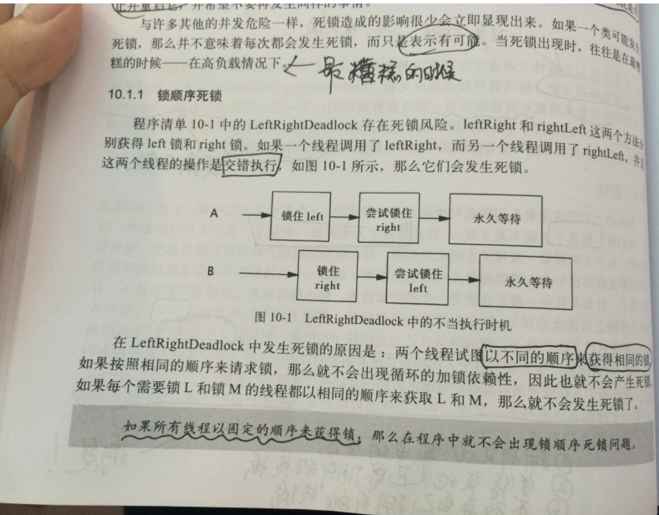

## 一、死锁讲解

在 Java 中使用多线程，就会**有可能导致死锁**问题。死锁会让程序一直**卡**住，不再程序往下执行。我们只能通过**中止并重启**的方式来让程序重新执行。

- 这是我们非常不愿意看到的一种现象，我们要**尽可能**避免死锁的情况发生！

造成死锁的原因可以**概括**成三句话：

- 当前线程**拥有其他线程需要的**资源
- 当前线程**等待其他线程已拥有**的资源
- **都不放弃**自己拥有的资源

### 1.1 锁顺序死锁

首先我们来看一下最简单的死锁(锁顺序死锁)是怎么样发生的：

```java
public class LeftRightDeadlock {
    private final Object left = new Object();
    private final Object right = new Object();

    public void leftRight() {
    // 得到left锁
        synchronized (left) {
      // 得到right锁
            synchronized (right) {
                doSomething();
            }
        }
    }

    public void rightLeft() {
    // 得到right锁
        synchronized (right) {
      // 得到left锁
            synchronized (left) {
                doSomethingElse();
            }
        }
    }
}
```

我们的线程是**交错执行**的，那么就很有可能出现以下的情况：

- 线程 A 调用`leftRight()`方法，得到 left 锁
- **同时**线程 B 调用`rightLeft()`方法，得到 right 锁
- 线程 A 和线程 B 都继续执行，此时线程 A 需要 right 锁**才能继续往下**执行。此时线程 B 需要 left 锁**才能继续往下**执行。
- 但是：**线程 A 的 left 锁并没有释放，线程 B 的 right 锁也没有释放**。
- 所以他们都只能等待，而这种等待是无期限的-->永久等待-->死锁



### 1.2 动态锁顺序死锁

我们看一下下面的例子，你认为会发生死锁吗？

```java
    // 转账
    public static void transferMoney(Account fromAccount,
                                     Account toAccount,
                                     DollarAmount amount)
            throws InsufficientFundsException {

        // 锁定汇账账户
        synchronized (fromAccount) {
            // 锁定来账账户
            synchronized (toAccount) {

                // 判余额是否大于0
                if (fromAccount.getBalance().compareTo(amount) < 0) {
                    throw new InsufficientFundsException();
                } else {

                    // 汇账账户减钱
                    fromAccount.debit(amount);

                    // 来账账户增钱
                    toAccount.credit(amount);
                }
            }
        }
    }
```

上面的代码**看起来是没有问题的**：锁定两个账户来判断余额是否充足才进行转账！

但是，同样**有可能会发生死锁**：

- 如果两个线程**同时**调用`transferMoney()`
- 线程 A 从 X 账户向 Y 账户转账
- 线程 B 从账户 Y 向账户 X 转账
- 那么就会发生死锁。

```
A:transferMoney(myAccount,yourAccount,10);
B:transferMoney(yourAccount,myAccount,20);
```

### 1.3 协作对象之间发生死锁

我们来看一下下面的例子：

```java
public class CooperatingDeadlock {
    // Warning: deadlock-prone!
    class Taxi {
        @GuardedBy("this") private Point location, destination;
        private final Dispatcher dispatcher;

        public Taxi(Dispatcher dispatcher) {
            this.dispatcher = dispatcher;
        }

        public synchronized Point getLocation() {
            return location;
        }

        // setLocation 需要Taxi内置锁
        public synchronized void setLocation(Point location) {
            this.location = location;
            if (location.equals(destination))
                // 调用notifyAvailable()需要Dispatcher内置锁
                dispatcher.notifyAvailable(this);
        }

        public synchronized Point getDestination() {
            return destination;
        }

        public synchronized void setDestination(Point destination) {
            this.destination = destination;
        }
    }

    class Dispatcher {
        @GuardedBy("this") private final Set<Taxi> taxis;
        @GuardedBy("this") private final Set<Taxi> availableTaxis;

        public Dispatcher() {
            taxis = new HashSet<Taxi>();
            availableTaxis = new HashSet<Taxi>();
        }

        public synchronized void notifyAvailable(Taxi taxi) {
            availableTaxis.add(taxi);
        }

        // 调用getImage()需要Dispatcher内置锁
        public synchronized Image getImage() {
            Image image = new Image();
            for (Taxi t : taxis)
                // 调用getLocation()需要Taxi内置锁
                image.drawMarker(t.getLocation());
            return image;
        }
    }

    class Image {
        public void drawMarker(Point p) {
        }
    }
}
```

上面的`getImage()`和`setLocation(Point location)`都需要获取两个锁的

- 并且在操作**途中是没有释放锁的**

这就是**隐式获取两个锁**(对象之间协作)..

这种方式**也很容易就造成死锁**.....

## 二、避免死锁的方法

避免死锁可以概括成三种方法：

- **固定加锁的顺序**(针对锁顺序死锁)
- **开放调用**(针对对象之间协作造成的死锁)
- **使用定时锁**-->`tryLock()`
  - 如果等待获取锁时间超时，则**抛出异常而不是一直等待**！

### 2.1 固定锁顺序避免死锁

上面`transferMoney()`发生死锁的原因是因为**加锁顺序**不一致而出现的~

- 正如书上所说的：如果所有线程**以固定的顺序来获得锁**，那么程序中就不会出现锁顺序死锁问题！

那么上面的例子我们就可以**改造**成这样子：

```java
public class InduceLockOrder {

    // 额外的锁、避免两个对象hash值相等的情况(即使很少)
    private static final Object tieLock = new Object();

    public void transferMoney(final Account fromAcct,
                              final Account toAcct,
                              final DollarAmount amount)
            throws InsufficientFundsException {
        class Helper {
            public void transfer() throws InsufficientFundsException {
                if (fromAcct.getBalance().compareTo(amount) < 0)
                    throw new InsufficientFundsException();
                else {
                    fromAcct.debit(amount);
                    toAcct.credit(amount);
                }
            }
        }
        // 得到锁的hash值
        int fromHash = System.identityHashCode(fromAcct);
        int toHash = System.identityHashCode(toAcct);

        // 根据hash值来上锁
        if (fromHash < toHash) {
            synchronized (fromAcct) {
                synchronized (toAcct) {
                    new Helper().transfer();
                }
            }

        } else if (fromHash > toHash) {// 根据hash值来上锁
            synchronized (toAcct) {
                synchronized (fromAcct) {
                    new Helper().transfer();
                }
            }
        } else {// 额外的锁、避免两个对象hash值相等的情况(即使很少)
            synchronized (tieLock) {
                synchronized (fromAcct) {
                    synchronized (toAcct) {
                        new Helper().transfer();
                    }
                }
            }
        }
    }
}
```

得到对应的**hash 值来固定加锁的顺序**，这样我们就不会发生死锁的问题了！

### 2.2 开放调用避免死锁

在协作对象之间发生死锁的例子中，主要是因为在**调用某个方法时就需要持有锁**，并且在方法内部也调用了其他带锁的方法！

- **如果在调用某个方法时不需要持有锁，那么这种调用被称为开放调用**！

我们可以这样来改造：

- 同步代码块最好**仅被用于保护那些涉及共享状态的操作**！

```java
class CooperatingNoDeadlock {
    @ThreadSafe
    class Taxi {
        @GuardedBy("this") private Point location, destination;
        private final Dispatcher dispatcher;

        public Taxi(Dispatcher dispatcher) {
            this.dispatcher = dispatcher;
        }

        public synchronized Point getLocation() {
            return location;
        }

        public synchronized void setLocation(Point location) {
            boolean reachedDestination;

            // 加Taxi内置锁
            synchronized (this) {
                this.location = location;
                reachedDestination = location.equals(destination);
            }
            // 执行同步代码块后完毕，释放锁


            if (reachedDestination)
                // 加Dispatcher内置锁
                dispatcher.notifyAvailable(this);
        }

        public synchronized Point getDestination() {
            return destination;
        }

        public synchronized void setDestination(Point destination) {
            this.destination = destination;
        }
    }

    @ThreadSafe
    class Dispatcher {
        @GuardedBy("this") private final Set<Taxi> taxis;
        @GuardedBy("this") private final Set<Taxi> availableTaxis;

        public Dispatcher() {
            taxis = new HashSet<Taxi>();
            availableTaxis = new HashSet<Taxi>();
        }

        public synchronized void notifyAvailable(Taxi taxi) {
            availableTaxis.add(taxi);
        }

        public Image getImage() {
            Set<Taxi> copy;

            // Dispatcher内置锁
            synchronized (this) {
                copy = new HashSet<Taxi>(taxis);
            }
            // 执行同步代码块后完毕，释放锁

            Image image = new Image();
            for (Taxi t : copy)
                // 加Taix内置锁
                image.drawMarker(t.getLocation());
            return image;
        }
    }

    class Image {
        public void drawMarker(Point p) {
        }
    }

}

```

使用开放调用是**非常好的一种方式**，应该尽量使用它~

### 2.3 使用定时锁

使用显式 Lock 锁，在获取锁时使用`tryLock()`方法。当等待**超过时限**的时候，`tryLock()`不会一直等待，而是返回错误信息。

使用`tryLock()`能够有效避免死锁问题~~

### 2.4 死锁检测

虽然造成死锁的原因是因为我们设计得不够好，但是可能写代码的时候不知道哪里发生了死锁。

JDK 提供了两种方式来给我们检测：

- JconsoleJDK 自带的图形化界面工具，使用 JDK 给我们的的工具 JConsole
- Jstack 是 JDK 自带的命令行工具，主要用于线程 Dump 分析。

具体可参考：

- https://www.cnblogs.com/flyingeagle/articles/6853167.html

## 三、死锁总结

发生死锁的原因主要由于：

- 线程之间交错执行
  - 解决：**以固定的顺序加锁**
- 执行某方法时就需要持有锁，且不释放
  - 解决：**缩减同步代码块范围，最好仅操作共享变量时才加锁**
- 永久等待
  - 解决：使用`tryLock()`定时锁，超过时限则返回错误信息
