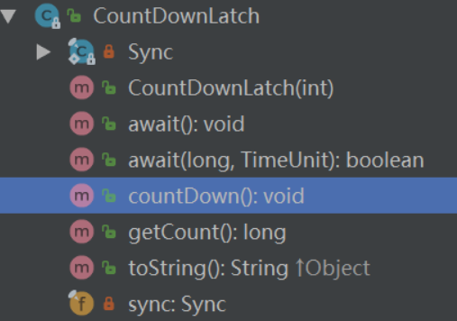
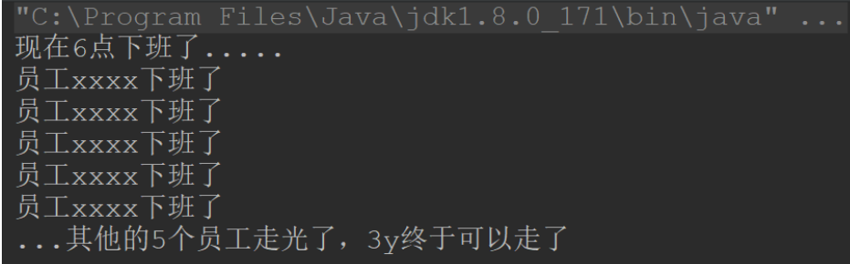
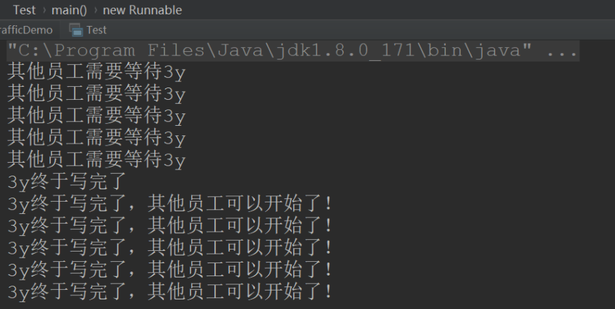
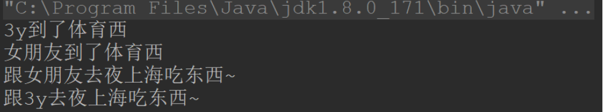
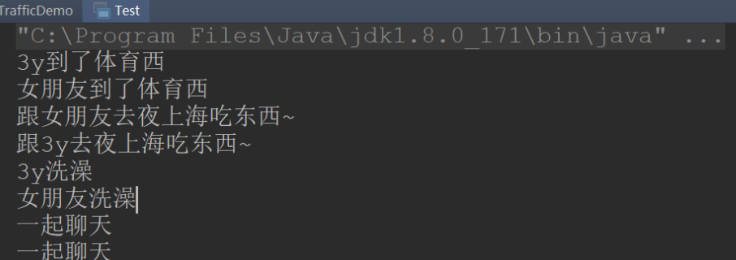
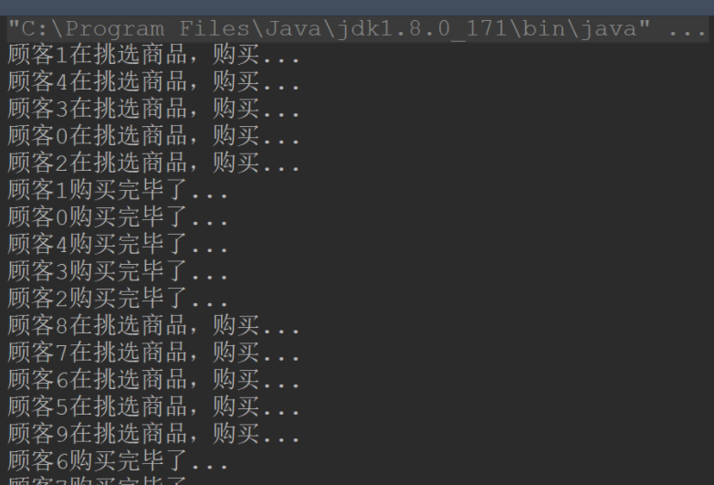

Java 为我们提供了**三个同步工具类**：

- CountDownLatch(闭锁)
- CyclicBarrier(栅栏)
- Semaphore(信号量)

这几个工具类其实说白了就是为了能够**更好控制线程之间的通讯问题**~

## 一、CountDownLatch

### 1.1CountDownLatch 简介

> - A synchronization aid that allows one or more threads to wait until a set of operations being performed in other threads completes.

简单来说：CountDownLatch 是一个同步的辅助类，**允许一个或多个线程一直等待**，**直到**其它线程**完成**它们的操作。

它常用的 API 其实就两个:`await()`和`countDown()`



使用说明：

- count 初始化 CountDownLatch，然后需要等待的线程调用 await 方法。await 方法会一直受阻塞直到 count=0。而其它线程完成自己的操作后，调用`countDown()`使计数器 count 减 1。**当 count 减到 0 时，所有在等待的线程均会被释放**
- 说白了就是通过**count 变量来控制等待**，如果**count 值为 0 了**(其他线程的任务都完成了)，那就可以继续执行。

### 1.2CountDownLatch 例子

例子：3y 现在去做实习生了，其他的员工还没下班，3y 不好意思先走，等其他的员工都走光了，3y 再走。

```java
import java.util.concurrent.CountDownLatch;

public class Test {

    public static void main(String[] args) {

        final CountDownLatch countDownLatch = new CountDownLatch(5);

    System.out.println("现在6点下班了.....");

        // 3y线程启动
        new Thread(new Runnable() {
            @Override
            public void run() {

                try {
                    // 这里调用的是await()不是wait()
                    countDownLatch.await();
                } catch (InterruptedException e) {
                    e.printStackTrace();
                }
                System.out.println("...其他的5个员工走光了，3y终于可以走了");
            }
        }).start();

        // 其他员工线程启动
        for (int i = 0; i < 5; i++) {
            new Thread(new Runnable() {
                @Override
                public void run() {
                    System.out.println("员工xxxx下班了");
                    countDownLatch.countDown();
                }
            }).start();
        }
    }
}

```

输出结果：



再写个例子：3y 现在负责仓库模块功能，但是能力太差了，写得很慢，**别的员工都需要等 3y 写好了才能继续往下写。**

```java
import java.util.concurrent.CountDownLatch;

public class Test {

    public static void main(String[] args) {

        final CountDownLatch countDownLatch = new CountDownLatch(1);

        // 3y线程启动
        new Thread(new Runnable() {
            @Override
            public void run() {

                try {
                    Thread.sleep(5);
                } catch (InterruptedException e) {
                    e.printStackTrace();
                }
                System.out.println("3y终于写完了");
                countDownLatch.countDown();

            }
        }).start();

        // 其他员工线程启动
        for (int i = 0; i < 5; i++) {
            new Thread(new Runnable() {
                @Override
                public void run() {
                    System.out.println("其他员工需要等待3y");
                    try {
                        countDownLatch.await();
                    } catch (InterruptedException e) {
                        e.printStackTrace();
                    }
                    System.out.println("3y终于写完了，其他员工可以开始了！");
                }
            }).start();
        }
    }
}
```

输出结果：



## 二、CyclicBarrier

### 2.1CyclicBarrier 简介

> - A synchronization aid that allows a set of threads to all wait for each other to reach a common barrier point. CyclicBarriers are useful in programs involving a fixed sized party of threads that must occasionally wait for each other. The barrier is called _cyclic_ because it can be re-used after the waiting threads are released.

简单来说：CyclicBarrier 允许一组线程互相等待，直到**到达某个公共屏障点**。叫做 cyclic 是因为当所有等待线程都被释放以后，CyclicBarrier 可以**被重用**(对比于 CountDownLatch 是不能重用的)

使用说明：

- CountDownLatch 注重的是**等待其他线程完成**，CyclicBarrier 注重的是：当线程**到达某个状态**后，暂停下来等待其他线程，**所有线程均到达以后**，继续执行。

### 2.2CyclicBarrier 例子

例子：3y 和女朋友约了去广州夜上海吃东西，由于 3y 和 3y 女朋友住的地方不同，自然去的路径也就不一样了。于是他俩约定在体育西路地铁站**集合**，约定等到**相互见面的时候**就发一条朋友圈。

```java
import java.util.concurrent.BrokenBarrierException;
import java.util.concurrent.CyclicBarrier;

public class Test {

    public static void main(String[] args) {

        final CyclicBarrier CyclicBarrier = new CyclicBarrier(2);
        for (int i = 0; i < 2; i++) {

            new Thread(() -> {

                String name = Thread.currentThread().getName();
                if (name.equals("Thread-0")) {
                    name = "3y";
                } else {
                    name = "女朋友";
                }
                System.out.println(name + "到了体育西");
                try {

                    // 两个人都要到体育西才能发朋友圈
                    CyclicBarrier.await();
                    // 他俩到达了体育西，看见了对方发了一条朋友圈：
                    System.out.println("跟" + name + "去夜上海吃东西~");
                } catch (InterruptedException e) {
                    e.printStackTrace();
                } catch (BrokenBarrierException e) {
                    e.printStackTrace();
                }
            }).start();
        }
    }
}
```

测试结果：



玩了一天以后，**各自回到家里**，3y 和女朋友约定**各自洗澡完之后再聊天**

```java
import java.util.concurrent.BrokenBarrierException;
import java.util.concurrent.CyclicBarrier;

public class Test {

    public static void main(String[] args) {

        final CyclicBarrier CyclicBarrier = new CyclicBarrier(2);
        for (int i = 0; i < 2; i++) {

            new Thread(() -> {

                String name = Thread.currentThread().getName();
                if (name.equals("Thread-0")) {
                    name = "3y";
                } else {
                    name = "女朋友";
                }
                System.out.println(name + "到了体育西");
                try {

                    // 两个人都要到体育西才能发朋友圈
                    CyclicBarrier.await();
                    // 他俩到达了体育西，看见了对方发了一条朋友圈：
                    System.out.println("跟" + name + "去夜上海吃东西~");

                    // 回家
                    CyclicBarrier.await();
                    System.out.println(name + "洗澡");

                    // 洗澡完之后一起聊天
                    CyclicBarrier.await();

                    System.out.println("一起聊天");

                } catch (InterruptedException e) {
                    e.printStackTrace();
                } catch (BrokenBarrierException e) {
                    e.printStackTrace();
                }
            }).start();
        }
    }
}
```

测试结果：



## 三、Semaphore

### 3.1Semaphore 简介

> Semaphores are often used to **restrict the number of threads than can access some (physical or logical) resource**.

---

> - A counting semaphore. Conceptually, a semaphore maintains a set of permits. Each {@link #acquire} blocks if necessary until a permit is available, and then takes it. Each {@link #release} adds a permit,potentially releasing a blocking acquirer.However, no actual permit objects are used; the {@code Semaphore} just keeps a count of the number available and acts accordingly.

Semaphore(信号量)实际上就是可以控制**同时访问的线程个数**，它维护了一组**"许可证"**。

- 当调用`acquire()`方法时，会消费一个许可证。如果没有许可证了，会阻塞起来
- 当调用`release()`方法时，会添加一个许可证。
- 这些"许可证"的个数其实就是一个 count 变量罢了~

### 3.2Semaphore 例子

3y 女朋友开了一间卖酸奶的小店，小店一次只能容纳 5 个顾客挑选购买，超过 5 个就需要排队啦~~~

```java

import java.util.concurrent.Semaphore;

public class Test {

    public static void main(String[] args) {

        // 假设有50个同时来到酸奶店门口
        int nums = 50;

        // 酸奶店只能容纳10个人同时挑选酸奶
        Semaphore semaphore = new Semaphore(10);

        for (int i = 0; i < nums; i++) {
            int finalI = i;
            new Thread(() -> {
                try {
                    // 有"号"的才能进酸奶店挑选购买
                    semaphore.acquire();

                    System.out.println("顾客" + finalI + "在挑选商品，购买...");

                    // 假设挑选了xx长时间，购买了
                    Thread.sleep(1000);

                    // 归还一个许可，后边的就可以进来购买了
                    System.out.println("顾客" + finalI + "购买完毕了...");
                    semaphore.release();


                } catch (InterruptedException e) {
                    e.printStackTrace();
                }
            }).start();

        }

    }
}
```

输出结果：



反正每次只能**5 个客户同时**进酸奶小店购买挑选。

## 四、总结

Java 为我们提供了**三个同步工具类**：

- CountDownLatch(闭锁)
  - 某个线程等待其他线程**执行完毕后**，它才执行(其他线程等待某个线程**执行完毕后**，它才执行)
- CyclicBarrier(栅栏)
  - 一组线程**互相等待至某个状态**，这组线程再同时执行。
- Semaphore(信号量)
  - **控制一组线程同时执行**。

本文简单的介绍了一下这三个同步工具类是干嘛用的，要**深入还得看源码**或者借鉴其他的资料。
