## 线程池

## 一、线程池简介

线程池可以看做是**线程的集合**。在没有任务时线程处于空闲状态，当请求到来：线程池给这个请求分配一个空闲的线程，任务完成后回到线程池中等待下次任务**(而不是销毁)**。这样就**实现了线程的重用**。

我们来看看**如果没有使用线程池**的情况是这样的：

- **为每个请求都新开一个线程**！

```java
public class ThreadPerTaskWebServer {
    public static void main(String[] args) throws IOException {
        ServerSocket socket = new ServerSocket(80);
        while (true) {
      // 为每个请求都创建一个新的线程
            final Socket connection = socket.accept();
            Runnable task = () -> handleRequest(connection);
            new Thread(task).start();
        }
    }
    private static void handleRequest(Socket connection) {
        // request-handling logic here
    }
}
```

为每个请求都开一个新的线程虽然**理论上是可以**的，但是会有**缺点**：

- **线程生命周期的开销非常高**。每个线程都有自己的生命周期，**创建和销毁线程**所花费的时间和资源可能比处理客户端的任务花费的时间和资源更多，并且还会有某些**空闲线程也会占用资源**。
- 程序的稳定性和健壮性会下降，每个请求开一个线程。如果受到了恶意攻击或者请求过多(内存不足)，程序很容易就奔溃掉了。

所以说：我们的**线程最好是交由线程池来管理**，这样可以减少对线程生命周期的管理，一定程度上提高性能。

## 二、JDK 提供的线程池 API

JDK 给我们提供了**Excutor 框架**来使用线程池，它是**线程池的基础**。

- Executor 提供了一种将**“任务提交”与“任务执行”**分离开来的机制(解耦)

下面我们来看看 JDK 线程池的总体 api 架构：

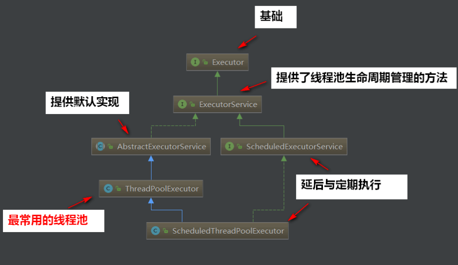

接下来我们把这些 API 都过一遍看看：

Executor 接口：

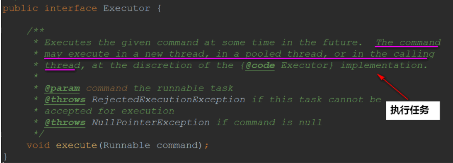

ExcutorService 接口：

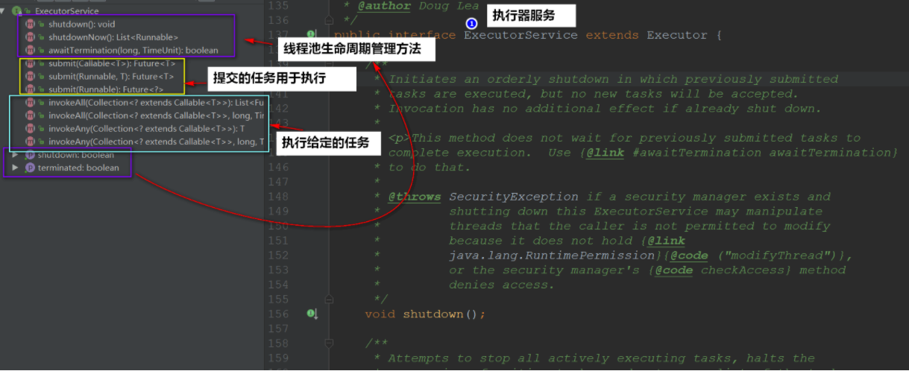

AbstractExecutorService 类：

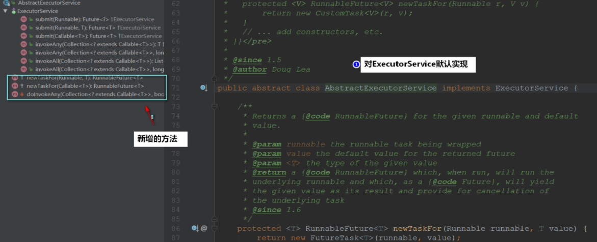

ScheduledExecutorService 接口：

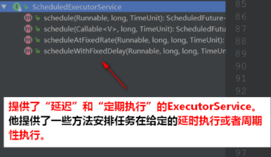

**ThreadPoolExecutor 类：**

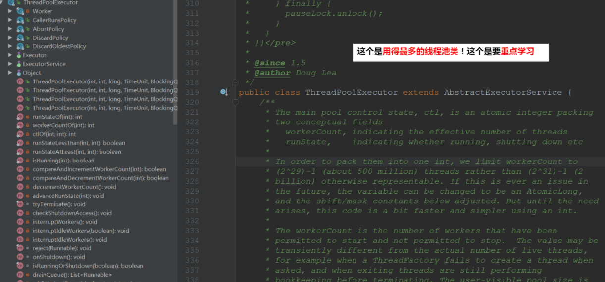

**ScheduledThreadPoolExecutor 类：**

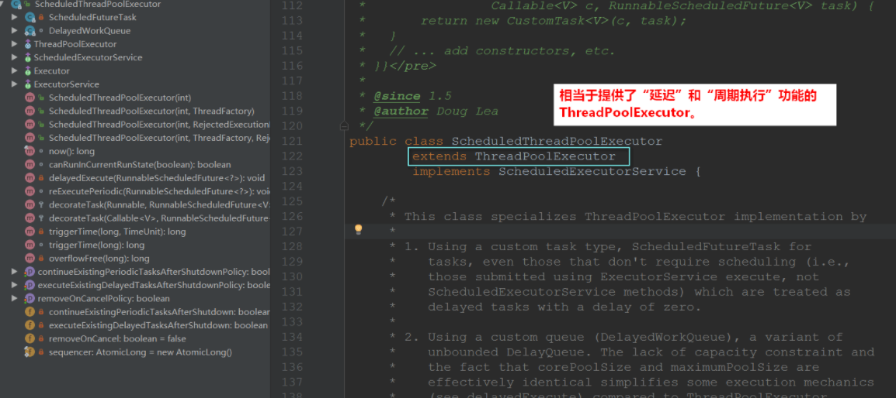

### 2.1ForkJoinPool 线程池

除了 ScheduledThreadPoolExecutor 和 ThreadPoolExecutor 类线程池以外，还有一个是**JDK1.7 新增**的线程池：ForkJoinPool 线程池

于是我们的类图就可以变得完整一些：

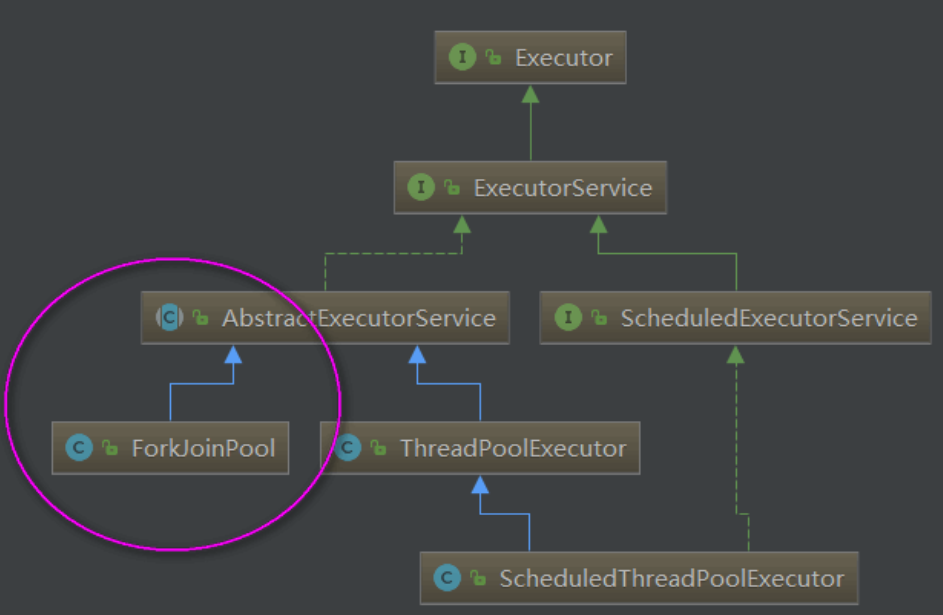

> JDK1.7 中新增的一个线程池，与 ThreadPoolExecutor 一样，同样继承了 AbstractExecutorService。ForkJoinPool 是 Fork/Join 框架的两大核心类之一。与其它类型的 ExecutorService 相比，**其主要的不同在于采用了工作窃取算法(work-stealing)**：所有池中线程会尝试找到并执行已被提交到池中的或由其他线程创建的任务。这样很少有线程会处于空闲状态，非常高效。这使得能够有效地处理以下情景：**大多数由任务产生大量子任务的情况**；从外部客户端大量提交小任务到池中的情况。

来源：

- https://blog.csdn.net/panweiwei1994/article/details/78969238

### 2.2 补充：Callable 和 Future

学到了线程池，我们可以很容易地发现：很多的 API 都有 Callable 和 Future 这么两个东西。

```java
  Future<?> submit(Runnable task)
  <T> Future<T> submit(Callable<T> task)
```

其实它们也不是什么高深的东西~~~

我们可以简单认为：**Callable 就是 Runnable 的扩展**。

- **Runnable 没有返回值，不能抛出受检查的异常，而 Callable 可以**！

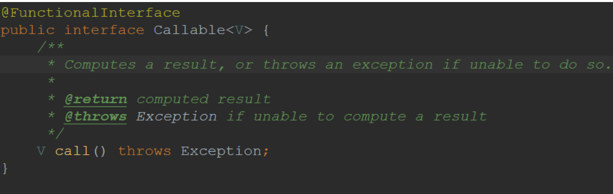

也就是说：当我们的**任务需要返回值**的时，我们就可以使用 Callable！

Future 一般我们认为是 Callable 的返回值，但他其实代表的是**任务的生命周期**(当然了，它是能获取得到 Callable 的返回值的)

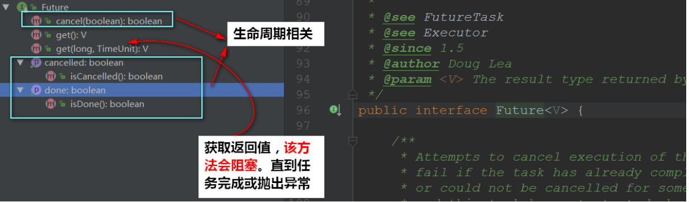

简单来看一下他们的用法：

```java
public class CallableDemo {
  public static void main(String[] args) throws InterruptedException, ExecutionException {
    // 创建线程池对象
    ExecutorService pool = Executors.newFixedThreadPool(2);

    // 可以执行Runnable对象或者Callable对象代表的线程
    Future<Integer> f1 = pool.submit(new MyCallable(100));
    Future<Integer> f2 = pool.submit(new MyCallable(200));

    // V get()
    Integer i1 = f1.get();
    Integer i2 = f2.get();

    System.out.println(i1);
    System.out.println(i2);

    // 结束
    pool.shutdown();
  }
}
```

Callable 任务：

```java
public class MyCallable implements Callable<Integer> {

  private int number;

  public MyCallable(int number) {
    this.number = number;
  }

  @Override
  public Integer call() throws Exception {
    int sum = 0;
    for (int x = 1; x <= number; x++) {
      sum += x;
    }
    return sum;
  }

}

```

执行完任务之后可以**获取得到任务返回的数据**：

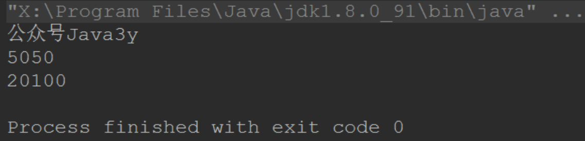

## 三、ThreadPoolExecutor 详解

这是用得最多的线程池，所以本文会重点讲解它。

我们来看看顶部注释：

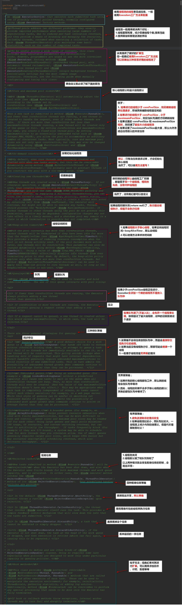

### 3.1 内部状态

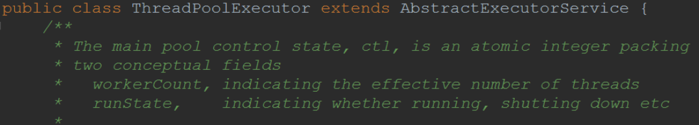

变量 ctl 定义为 AtomicInteger，**记录了“线程池中的任务数量”和“线程池的状态”两个信息**。

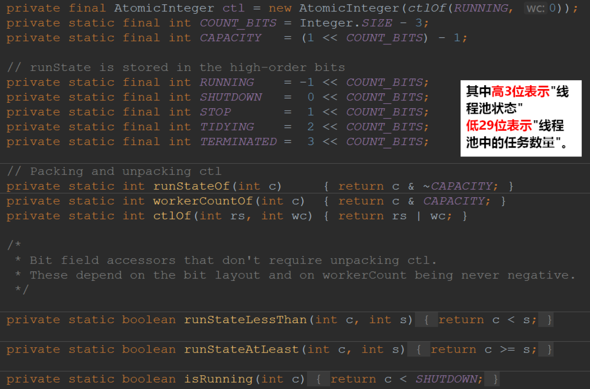

线程的状态：

- RUNNING：线程池**能够接受新任务**，以及对新添加的任务进行处理。
- SHUTDOWN：线程池**不可以接受新任务**，但是可以对已添加的任务进行处理。
- STOP：线程池**不接收新任务，不处理已添加的任务，并且会中断正在处理的任务**。
- TIDYING：当**所有的任务已终止**，ctl 记录的"任务数量"为 0，线程池会变为 TIDYING 状态。当线程池变为 TIDYING 状态时，会执行钩子函数 terminated()。terminated()在 ThreadPoolExecutor 类中是空的，若用户想在线程池变为 TIDYING 时，进行相应的处理；可以通过重载 terminated()函数来实现。
- TERMINATED：线程池**彻底终止的状态**。

| 状态       | 高三位 | 工作队列 workers 中的任务 | 阻塞队列 workQueue 中的任务                                              | 未添加的任务 |
| ---------- | ------ | ------------------------- | ------------------------------------------------------------------------ | ------------ |
| RUNNING    | 111    | 继续处理                  | 继续处理                                                                 | 添加         |
| SHUTDOWN   | 000    | 继续处理                  | 继续处理                                                                 | 不添加       |
| STOP       | 001    | 尝试终端                  | 不处理                                                                   | 不添加       |
| TIDYING    | 010    | 处理完了                  | 如果由 SHUTDOWN-TIDYING,那就是处理完了；如果由 STOP-TIDYING,那就是不处理 | 不添加       |
| TERMINATED | 011    | 处理完了                  | 如果由 SHUTDOWN-TIDYING,那就是处理完了；如果由 STOP-TIDYING,那就是不处理 | 不添加       |

各个状态之间转换：

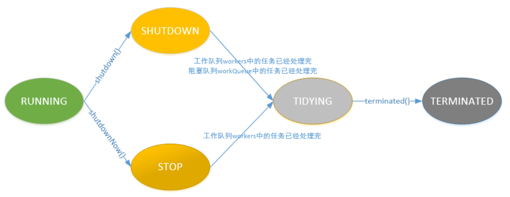

### 3.2 已默认实现的池

下面我就列举三个比较**常见**的实现池：

- newFixedThreadPool
- newCachedThreadPool
- SingleThreadExecutor

如果读懂了上面对应的策略呀，线程数量这些，应该就不会太难看懂了。

#### 3.2.1newFixedThreadPool

一个固定线程数的线程池，它将返回一个**corePoolSize 和 maximumPoolSize 相等的线程池**。

```java
   public static ExecutorService newFixedThreadPool(int nThreads) {
        return new ThreadPoolExecutor(nThreads, nThreads,
                                      0L, TimeUnit.MILLISECONDS,
                                      new LinkedBlockingQueue<Runnable>());
    }
```

#### 3.2.2newCachedThreadPool

**非常有弹性的线程池**，对于新的任务，如果此时线程池里没有空闲线程，**线程池会毫不犹豫的创建一条新的线程去处理这个任务**。

```java
    public static ExecutorService newCachedThreadPool() {
        return new ThreadPoolExecutor(0, Integer.MAX_VALUE,
                60L, TimeUnit.SECONDS,
                new SynchronousQueue<Runnable>());
    }
```

#### 3.2.3SingleThreadExecutor

**使用单个 worker 线程的 Executor**

```java
    public static ExecutorService newSingleThreadExecutor() {
        return new FinalizableDelegatedExecutorService
                (new ThreadPoolExecutor(1, 1,
                        0L, TimeUnit.MILLISECONDS,
                        new LinkedBlockingQueue<Runnable>()));
    }
```

### 3.3 构造方法

我们读完上面的默认实现池还有对应的属性，再回到构造方法看看

- 构造方法可以让我们**自定义(扩展)线程池**

```java
    public ThreadPoolExecutor(int corePoolSize,
                              int maximumPoolSize,
                              long keepAliveTime,
                              TimeUnit unit,
                              BlockingQueue<Runnable> workQueue,
                              ThreadFactory threadFactory,
                              RejectedExecutionHandler handler) {
        if (corePoolSize < 0 ||
                maximumPoolSize <= 0 ||
                maximumPoolSize < corePoolSize ||
                keepAliveTime < 0)
            throw new IllegalArgumentException();
        if (workQueue == null || threadFactory == null || handler == null)
            throw new NullPointerException();
        this.corePoolSize = corePoolSize;
        this.maximumPoolSize = maximumPoolSize;
        this.workQueue = workQueue;
        this.keepAliveTime = unit.toNanos(keepAliveTime);
        this.threadFactory = threadFactory;
        this.handler = handler;
    }
```

1. 指定核心线程数量
2. 指定最大线程数量
3. 允许线程空闲时间
4. 时间对象
5. 阻塞队列
6. 线程工厂
7. 任务拒绝策略

再总结一遍这些参数的要点：

**线程数量要点**：

- 如果运行线程的数量**少于**核心线程数量，则**创建新**的线程处理请求
- 如果运行线程的数量**大于**核心线程数量，**小于**最大线程数量，则当**队列满的时候才创建新**的线程
- 如果核心线程数量**等于**最大线程数量，那么将**创建固定大小**的连接池
- 如果设置了最大线程数量为**无穷**，那么允许线程池适合**任意**的并发数量

**线程空闲时间要点：**

- 当前线程数**大于**核心线程数，如果空闲时间已经超过了，那该线程会**销毁**。

**排队策略要点**：

- 同步移交：**不会放到队列中，而是等待线程执行它**。如果当前线程没有执行，很可能会**新开**一个线程执行。
- 无界限策略：**如果核心线程都在工作，该线程会放到队列中**。所以线程数不会超过核心线程数
- 有界限策略：**可以避免资源耗尽**，但是一定程度上减低了吞吐量

当线程关闭或者线程数量满了和队列饱和了，就有拒绝任务的情况了：

**拒绝任务策略：**

- 直接抛出异常
- 使用调用者的线程来处理
- 直接丢掉这个任务
- 丢掉最老的任务

## 四、execute 执行方法

execute 执行方法分了三步，以注释的方式写在代码上了~

```java
    public void execute(Runnable command) {
        if (command == null)
            throw new NullPointerException();
        int c = ctl.get();
    //如果线程池中运行的线程数量<corePoolSize，则创建新线程来处理请求，即使其他辅助线程是空闲的。
        if (workerCountOf(c) < corePoolSize) {
            if (addWorker(command, true))
                return;
            c = ctl.get();
        }

    //如果线程池中运行的线程数量>=corePoolSize，且线程池处于RUNNING状态，且把提交的任务成功放入阻塞队列中，就再次检查线程池的状态，
      // 1.如果线程池不是RUNNING状态，且成功从阻塞队列中删除任务，则该任务由当前 RejectedExecutionHandler 处理。
      // 2.否则如果线程池中运行的线程数量为0，则通过addWorker(null, false)尝试新建一个线程，新建线程对应的任务为null。
        if (isRunning(c) && workQueue.offer(command)) {
            int recheck = ctl.get();
            if (! isRunning(recheck) && remove(command))
                reject(command);
            else if (workerCountOf(recheck) == 0)
                addWorker(null, false);
        }
    // 如果以上两种case不成立，即没能将任务成功放入阻塞队列中，且addWoker新建线程失败，则该任务由当前 RejectedExecutionHandler 处理。
        else if (!addWorker(command, false))
            reject(command);
    }
```

## 五、线程池关闭

ThreadPoolExecutor 提供了`shutdown()`和`shutdownNow()`两个方法来关闭线程池

shutdown() ：

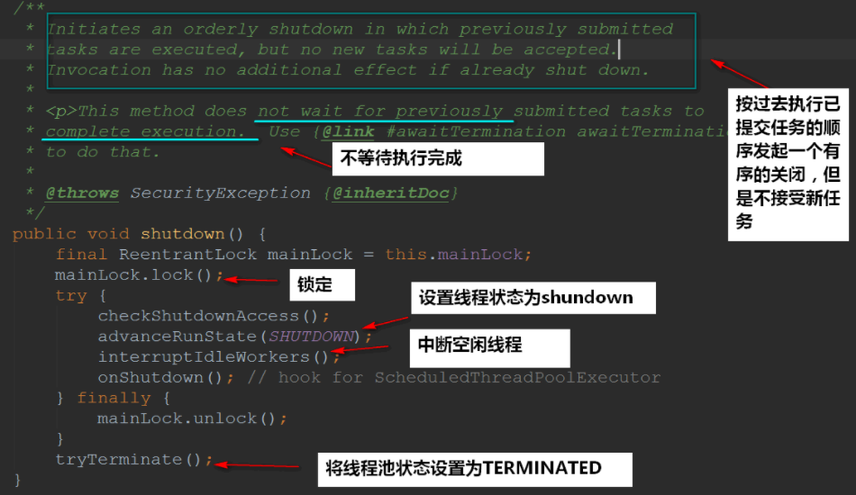

shutdownNow():

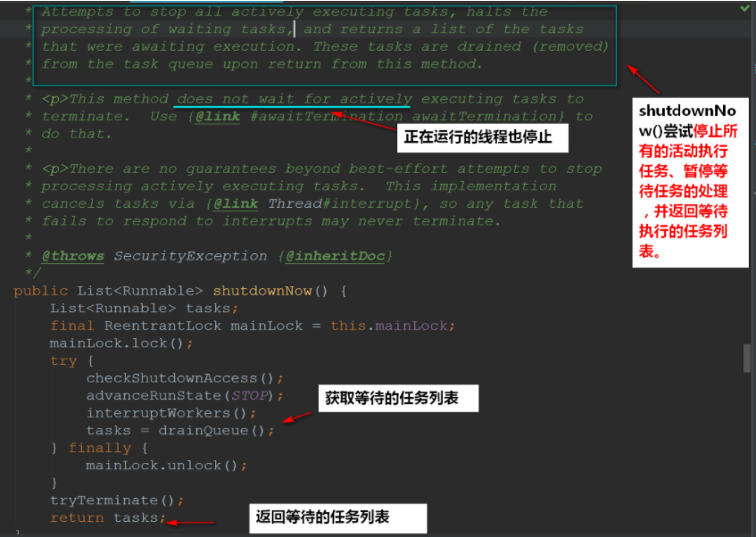

**区别：**

- 调用 shutdown()后，线程池状态立刻**变为 SHUTDOWN**，而调用 shutdownNow()，线程池状态**立刻变为 STOP**。
- shutdown()**等待任务执行完**才中断线程，而 shutdownNow()**不等任务执行完**就中断了线程。
