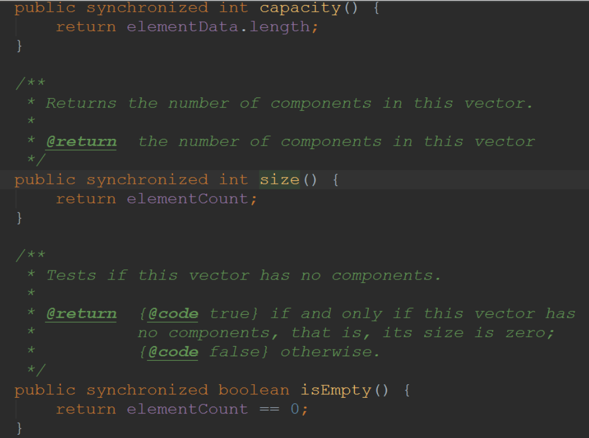
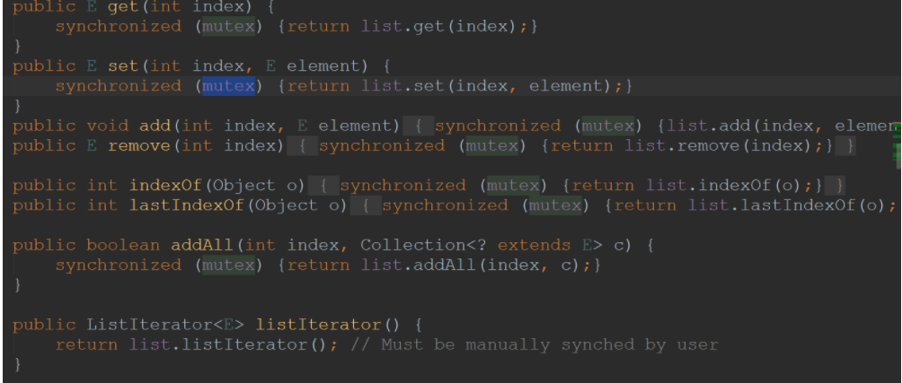
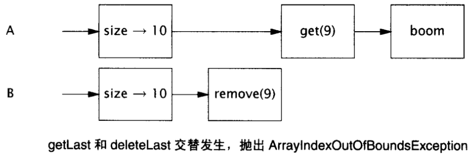
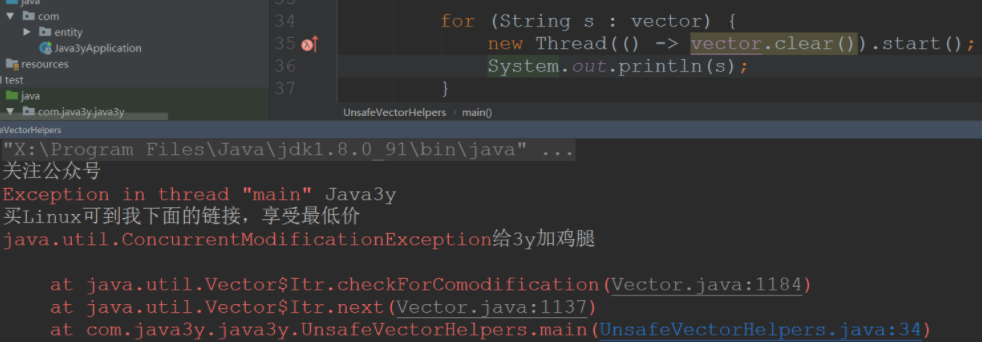
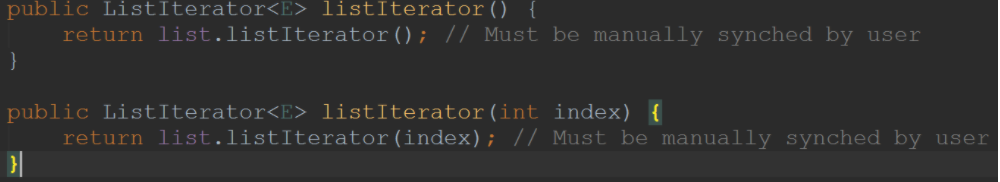
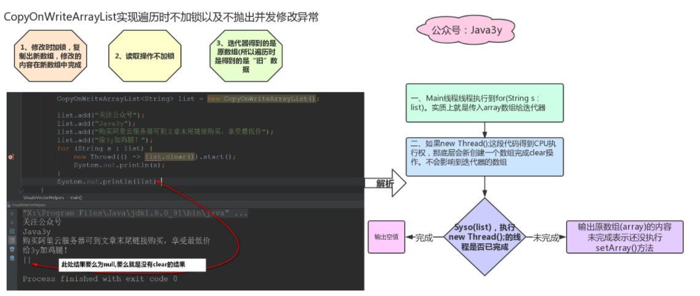

## 介绍

CopyWriteOn 可能大家对这个技术**比较陌生**吧，但这项技术是**挺多应用场景**的。除了上文所说的 Linux、文件系统外，其实在**Java**也有其身影。

大家对线程安全容器可能最熟悉的就是 ConcurrentHashMap 了，因为这个容器经常会在面试的时候考查。

比如说，一个常见的面试场景：

- 面试官问：“HashMap 是线程安全的吗？如果 HashMap 线程不安全的话，那有没有安全的 Map 容器”
- 3y：“线程安全的 Map 有两个，一个是 Hashtable，一个是 ConcurrentHashMap”
- 面试官继续问：“那 Hashtable 和 ConcurrentHashMap 有什么区别啊？”
- 3y：“balabalabalabalabalabala"
- 面试官：”ok,ok,ok,看你 Java 基础挺不错的呀“

那如果有这样的面试呢？

- 面试官问：“ArrayList 是线程安全的吗？如果 ArrayList 线程不安全的话，那有没有安全的类似 ArrayList 的容器”
- 3y：“线程安全的 ArrayList 我们可以使用 Vector，或者说我们可以使用 Collections 下的方法来包装一下”
- 面试官继续问：“嗯，我相信你也知道 Vector 是一个比较老的容器了，还有没有其他的呢？”
- 3y：“Emmmm,这个...“
- 面试官**提示**：“就比如 JUC 中有 ConcurrentHashMap，那 JUC 中有类似"ArrayList"的线程安全容器类吗？“
- 3y：“Emmmm,这个...“
- 面试官：”ok,ok,ok,**今天的面试时间也差不多了，你回去等通知吧**。“

今天主要讲解的是 CopyOnWriteArrayList~

本文**力求简单讲清每个知识点**，希望大家看完能有所收获

## 一、Vector 和 SynchronizedList

### 1.1 回顾线程安全的 Vector 和 SynchronizedList

我们知道 ArrayList 是用于替代 Vector 的，Vector 是线程安全的容器。因为它几乎在每个方法声明处都加了**synchronized 关键字**来使容器安全。



如果使用`Collections.synchronizedList(new ArrayList())`来使 ArrayList 变成是线程安全的话，也是几乎都是每个方法都加上 synchronized 关键字的，只不过**它不是加在方法的声明处，而是方法的内部**。



### 1.2 Vector 和 SynchronizedList 可能会出现的问题

在讲解 CopyOnWrite 容器之前，我们还是先来看一下线程安全容器的一些**可能没有注意到**的地方~

下面我们直接来看一下这段代码：

```java
    // 得到Vector最后一个元素
    public static Object getLast(Vector list) {
        int lastIndex = list.size() - 1;
        return list.get(lastIndex);
    }

    // 删除Vector最后一个元素
    public static void deleteLast(Vector list) {
        int lastIndex = list.size() - 1;
        list.remove(lastIndex);
    }

```

以我们第一反应来分析一下上面两个方法：**在多线程环境下，是否有问题**？

- 我们可以知道的是 Vector 的`size()和get()以及remove()`都被 synchronized 修饰的。

答案：从调用者的角度是**有问题**的

我们可以写段代码测试一下：

```java
import java.util.Vector;

public class UnsafeVectorHelpers {


    public static void main(String[] args) {

        // 初始化Vector
        Vector<String> vector = new Vector();
        vector.add("关注公众号");
        vector.add("Java3y");
        vector.add("买Linux可到我下面的链接，享受最低价");
        vector.add("给3y加鸡腿");

        new Thread(() -> getLast(vector)).start();
        new Thread(() -> deleteLast(vector)).start();
        new Thread(() -> getLast(vector)).start();
        new Thread(() -> deleteLast(vector)).start();
    }

    // 得到Vector最后一个元素
    public static Object getLast(Vector list) {
        int lastIndex = list.size() - 1;
        return list.get(lastIndex);
    }

    // 删除Vector最后一个元素
    public static void deleteLast(Vector list) {
        int lastIndex = list.size() - 1;
        list.remove(lastIndex);
    }
}

```

可以发现的是，有可能会抛出异常的：

原因也很简单，我们照着流程走一下就好了：

- 线程 A 执行`getLast()`方法，线程 B 执行`deleteLast()`方法
- 线程 A 执行`int lastIndex = list.size() - 1;`得到 lastIndex 的值是 3。**同时**，线程 B 执行`int lastIndex = list.size() - 1;`得到的 lastIndex 的值**也**是 3
- 此时线程 B 先得到 CPU 执行权，执行`list.remove(lastIndex)`将下标为 3 的元素删除了
- 接着线程 A 得到 CPU 执行权，执行`list.get(lastIndex);`，发现已经没有下标为 3 的元素，抛出异常了.



出现这个问题的原因也很简单：

- `getLast()`和`deleteLast()`这两个方法并不是原子性的，即使他们**内部的每一步操作是原子性**的(被 Synchronize 修饰就可以实现原子性)，但是内部之间还是可以**交替**执行。
  - 这里的意思就是：`size()和get()以及remove()`都是原子性的，但是如果并发执行`getLast()`和`deleteLast()`，方法里面的`size()和get()以及remove()`是可以交替执行的。

要解决上面这种情况也很简单，因为我们都是对 Vector 进行操作的，**只要操作 Vector 前把它锁住就没毛病了**！

所以我们可以改成这样子：

```java
    // 得到Vector最后一个元素
    public static Object getLast(Vector list) {
        synchronized (list) {
            int lastIndex = list.size() - 1;
            return list.get(lastIndex);
        }
    }
    // 删除Vector最后一个元素
    public static void deleteLast(Vector list) {
        synchronized (list) {
            int lastIndex = list.size() - 1;
            list.remove(lastIndex);
        }
    }

```

> ps:如果有人去测试一下，发现会抛出异常 java.lang.ArrayIndexOutOfBoundsException: -1，这是**没有检查角标的异常**，不是并发导致的问题。

经过上面的例子我们可以看看下面的代码：

```java
    public static void main(String[] args) {

        // 初始化Vector
        Vector<String> vector = new Vector();
        vector.add("关注公众号");
        vector.add("Java3y");
        vector.add("买Linux可到我下面的链接，享受最低价");
        vector.add("给3y加鸡腿");

        // 遍历Vector
        for (int i = 0; i < vector.size(); i++) {

            // 比如在这执行vector.clear();
            //new Thread(() -> vector.clear()).start();

            System.out.println(vector.get(i));
        }
    }
```

同样地：如果在遍历 Vector 的时候，有别的线程修改了 Vector 的长度，那还是会**有问题**！

- 线程 A 遍历 Vector，执行`vector.size()`时，发现 Vector 的长度为 5
- 此时**很有可能存在**线程 B 对 Vector 进行`clear()`操作
- 随后线程 A 执行`vector.get(i)`时，抛出异常

在 JDK5 以后，Java 推荐使用`for-each`(迭代器)来遍历我们的集合，好处就是**简洁、数组索引的边界值只计算一次**。

如果使用`for-each`(迭代器)来做上面的操作，会抛出 ConcurrentModificationException 异常



SynchronizedList 在使用**迭代器遍历**的时候同样会有问题的，源码已经提醒我们要手动加锁了。



如果想要完美解决上面所讲的问题，我们可以在**遍历前加锁**：

```java
    // 遍历Vector
    synchronized (vector) {
            for (int i = 0; i < vector.size(); i++) {
                vector.get(i);
            }
        }
```

有经验的同学就可以知道：**哇，遍历一下容器都要我加上锁，这这这不是要慢死了吗**.的确是挺慢的..

所以我们的 CopyOnWriteArrayList 就登场了！

## 二、CopyOnWriteArrayList(Set)介绍

一般来说，我们会认为：CopyOnWriteArrayList 是同步 List 的替代品，CopyOnWriteArraySet 是同步 Set 的替代品。

无论是 Hashtable-->ConcurrentHashMap，还是说 Vector-->CopyOnWriteArrayList。JUC 下支持并发的容器与老一代的线程安全类相比，总结起来就是加锁**粒度**的问题

- Hashtable、Vector 加锁的粒度大(直接在方法声明处使用 synchronized)
- ConcurrentHashMap、CopyOnWriteArrayList 加锁粒度小(用各种的方式来实现线程安全，比如我们知道的 ConcurrentHashMap 用了 cas 锁、volatile 等方式来实现线程安全..)
- JUC 下的线程安全容器在遍历的时候**不会**抛出 ConcurrentModificationException 异常

所以一般来说，我们都会**使用 JUC 包下给我们提供的线程安全容器**，而不是使用老一代的线程安全容器。

下面我们来看看 CopyOnWriteArrayList 是怎么实现的，为什么使用**迭代器遍历**的时候就**不用额外加锁**，也不会抛出 ConcurrentModificationException 异常。

### 2.1CopyOnWriteArrayList 实现原理

我们还是先来回顾一下 COW：

> 如果有多个调用者（callers）同时请求相同资源（如内存或磁盘上的数据存储），他们会共同获取**相同的指针指向相同的资源**，直到某个调用者**试图修改**资源的内容时，系统才会**真正复制一份专用副本**（private copy）给该调用者，而其他调用者所见到的最初的资源仍然保持不变。**优点**是如果调用者**没有修改该资源，就不会有副本**（private copy）被建立，因此多个调用者只是读取操作时可以**共享同一份资源**。

参考自维基百科：[https://zh.wikipedia.org/wiki/%E5%AF%AB%E5%85%A5%E6%99%82%E8%A4%87%E8%A3%BD](https://zh.wikipedia.org/wiki/寫入時複製)

> 之前写博客的时候，如果是要看源码，一般会翻译一下源码的注释并用图贴在文章上的。Emmm，发现阅读体验并不是很好，所以我这里就**直接概括一下源码注释**说了什么吧。另外，如果使用 IDEA 的话，可以下一个插件**Translation**(免费好用).

---概括一下 CopyOnWriteArrayList 源码注释介绍了什么：

- CopyOnWriteArrayList 是线程安全容器(相对于 ArrayList)，底层通过**复制数组**的方式来实现。
- CopyOnWriteArrayList 在遍历的使用不会抛出 ConcurrentModificationException 异常，并且遍历的时候就不用额外加锁
- 元素可以为 null

#### 2.1.1 看一下 CopyOnWriteArrayList 基本的结构

```java
    /** 可重入锁对象 */
    final transient ReentrantLock lock = new ReentrantLock();

    /** CopyOnWriteArrayList底层由数组实现，volatile修饰 */
    private transient volatile Object[] array;

    /**
     * 得到数组
     */
    final Object[] getArray() {
        return array;
    }

    /**
     * 设置数组
     */
    final void setArray(Object[] a) {
        array = a;
    }

    /**
     * 初始化CopyOnWriteArrayList相当于初始化数组
     */
    public CopyOnWriteArrayList() {
        setArray(new Object[0]);
    }
```

看起来挺简单的，CopyOnWriteArrayList 底层就是数组，加锁就交由 ReentrantLock 来完成。

#### 2.1.2 常见方法的实现

根据上面的分析我们知道如果遍历`Vector/SynchronizedList`是需要自己手动加锁的。

CopyOnWriteArrayList 使用迭代器遍历时不需要显示加锁，看看`add()、clear()、remove()`与`get()`方法的实现可能就有点眉目了。

首先我们可以看看`add()`方法

```java
    public boolean add(E e) {

    // 加锁
        final ReentrantLock lock = this.lock;
        lock.lock();
        try {

      // 得到原数组的长度和元素
            Object[] elements = getArray();
            int len = elements.length;

      // 复制出一个新数组
            Object[] newElements = Arrays.copyOf(elements, len + 1);

      // 添加时，将新元素添加到新数组中
            newElements[len] = e;

      // 将volatile Object[] array 的指向替换成新数组
            setArray(newElements);
            return true;
        } finally {
            lock.unlock();
        }
    }

```

通过代码我们可以知道：在添加的时候就上锁，并**复制一个新数组，增加操作在新数组上完成，将 array 指向到新数组中**，最后解锁。

再来看看`size()`方法：

```java
  public int size() {

    // 直接得到array数组的长度
        return getArray().length;
    }
```

再来看看`get()`方法：

```java

    public E get(int index) {
        return get(getArray(), index);
    }

  final Object[] getArray() {
        return array;
    }
```

那再来看看`set()`方法

```java
public E set(int index, E element) {
  final ReentrantLock lock = this.lock;
  lock.lock();
  try {

    // 得到原数组的旧值
    Object[] elements = getArray();
    E oldValue = get(elements, index);

    // 判断新值和旧值是否相等
    if (oldValue != element) {

      // 复制新数组，新值在新数组中完成
      int len = elements.length;
      Object[] newElements = Arrays.copyOf(elements, len);
      newElements[index] = element;

      // 将array引用指向新数组
      setArray(newElements);
    } else {
      // Not quite a no-op; enssures volatile write semantics
      setArray(elements);
    }
    return oldValue;
  } finally {
    lock.unlock();
  }
}

```

对于`remove()、clear()`跟`set()和add()`是类似的，这里我就不再贴出代码了。

总结：

- **在修改时，复制出一个新数组，修改的操作在新数组中完成，最后将新数组交由 array 变量指向**。
- **写加锁，读不加锁**

#### 2.1.3 剖析为什么遍历时不用调用者显式加锁

常用的方法实现我们已经基本了解了，但还是不知道为啥能够在容器遍历的时候对其进行修改而不抛出异常。所以，来看一下他的迭代器吧：

```java

  // 1. 返回的迭代器是COWIterator
  public Iterator<E> iterator() {
        return new COWIterator<E>(getArray(), 0);
    }


  // 2. 迭代器的成员属性
    private final Object[] snapshot;
    private int cursor;

  // 3. 迭代器的构造方法
  private COWIterator(Object[] elements, int initialCursor) {
        cursor = initialCursor;
        snapshot = elements;
    }

  // 4. 迭代器的方法...
  public E next() {
        if (! hasNext())
            throw new NoSuchElementException();
        return (E) snapshot[cursor++];
    }

  //.... 可以发现的是，迭代器所有的操作都基于snapshot数组，而snapshot是传递进来的array数组

```

到这里，我们应该就可以想明白了！CopyOnWriteArrayList 在使用迭代器遍历的时候，操作的都是**原数组**！



#### 2.1.4 CopyOnWriteArrayList 缺点

看了上面的实现源码，我们应该也大概能分析出 CopyOnWriteArrayList 的缺点了。

- **内存占用**：如果 CopyOnWriteArrayList 经常要增删改里面的数据，经常要执行`add()、set()、remove()`的话，那是比较耗费内存的。
  - 因为我们知道每次`add()、set()、remove()`这些增删改操作都要**复制一个数组**出来。
- **数据一致性**：CopyOnWrite 容器**只能保证数据的最终一致性，不能保证数据的实时一致性**。
  - 从上面的例子也可以看出来，比如线程 A 在迭代 CopyOnWriteArrayList 容器的数据。线程 B 在线程 A 迭代的间隙中将 CopyOnWriteArrayList 部分的数据修改了(已经调用`setArray()`了)。但是线程 A 迭代出来的是原有的数据。

#### 2.1.5 CopyOnWriteSet

CopyOnWriteArraySet 的原理就是 CopyOnWriteArrayList。

```java
    private final CopyOnWriteArrayList<E> al;

    public CopyOnWriteArraySet() {
        al = new CopyOnWriteArrayList<E>();
    }
```
