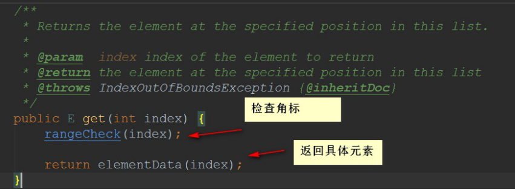

## 一、List 集合介绍

Collection 主要学习集合的类型两种：`Set`和`List`，这⾥主要讲解 List！

我们来看⼀下 List 接⼝的⽅法，⽐ Collection 多了⼀点点：
List 集合的特点就是：**有序(存储顺序和取出顺序⼀致),可重复**

Collection 返回的是 Iterator 迭代器接⼝，⽽ List 中⼜有它⾃⼰对应的实现-->**ListIterator**接⼝  
该接⼝⽐普通的 Iterator 接⼝多了⼏个⽅法：


从⽅法名就可以知道：ListIterator 可以往前遍历，添加元素，设置元素


#### 1.1 List 集合常用子类

List 集合常⽤的⼦类有三个：

- `ArrayList`
  底层数据结构是数组。线程不安全

- `LinkedList`
  底层数据结构是链表。线程不安全

- `Vector`
  底层数据结构是数组。线程安全

现在知道有三个常⽤的集合类即可，后⾯会开新的⽂章来讲解的～

### 二、 Set 集合介绍

从 Set 集合的⽅法我们可以看到：⽅法没有⽐ Collection 要多  
Set 集合的特点是：**元素不可重复**


#### 2.1 Set 集合常用子类

- `HashSet` 集合  
  A:底层数据结构是哈希表(是⼀个元素为链表的数组)

- `TreeSet` 集合  
  A:底层数据结构是红⿊树(是⼀个⾃平衡的⼆叉树)  
  B:保证元素的排序⽅式
- `LinkedHashSet` 集合  
  A:：底层数据结构由哈希表和链表组成。

### 三、List 集合

现在这篇主要讲 List 集合的三个⼦类：

- ArrayList
  底层数据结构是数组。线程不安全
- LinkedList
  底层数据结构是链表。线程不安全
- Vector
  底层数据结构是数组。线程安全  
  这篇主要来看看它们⽐较重要的⽅法是如何实现的，需要注意些什么，最后⽐较⼀下哪个时候⽤哪个～


### ArrayList 解析


⾸先，我们来讲解的是 ArrayList 集合，它是我们⽤得⾮常⾮常多的⼀个集合~
⾸先，我们来看⼀下 ArrayList 的属性：


根据上⾯我们可以清晰的发现：A**rrayList 底层其实就是⼀个数组**，ArrayList 中有扩容这么⼀个概念， 正因为它扩容，所以它能够**实现“动态”增⻓**

#### 3.1 构造方法

我们来看看构造⽅法来印证我们上⾯说得对不对：


#### 3.2 Add 方法

add ⽅法可以说是 ArrayList ⽐较重要的⽅法了，我们来总览⼀下：


##### 3.2.1 add(E e)

步骤：

- 检查是否需要扩容

- 插⼊元素

⾸先，我们来看看这个⽅法：

```java
public boolean add(E e){
    ensureCapacityInternal(size + 1);	// Increments modCount!! elementData[size++] = e;
return true;
}
```

该⽅法很短，我们可以根据⽅法名就猜到他是⼲了什么：

- 确认 list 容量，尝试容量加 1，看看有⽆必要

- 添加元素

接下来我们来看看这个⼩容量(+1)是否满⾜我们的需求：


随后调⽤`ensureExplicitCapacity()`来确定明确的容量，我们也来看看这个⽅法是怎么实现的：


所以，接下来看看`grow()` 是怎么实现的~


进去看`copyOf()`⽅法：


到⽬前为⽌，我们就可以知道`add(E e)`的基本实现了：
⾸先去检查⼀下数组的容量是否⾜够

- ⾜够：直接添加

- 不⾜够：扩容
  - 扩容到原来的 1.5 倍
  - 第⼀次扩容后，如果容量还是⼩于 minCapacity，就将容量扩充为 minCapacity。

##### 3.2.1add(int index, E element)

步骤：

- 检查⻆标
- 空间检查，如果有需要进⾏扩容
- 插⼊元素

我们来看看插⼊的实现：


我们发现，与扩容相关 ArrayList 的 add ⽅法底层其实都是 `arraycopy()` 来实现的
看到`arraycopy()`，我们可以发现：**该⽅法是由 C/C++来编写的**，并不是由 Java 实现。

总的来说：`arraycopy()`还是⽐较可靠⾼效的⼀个⽅法。

#### 3.3 get ⽅法

- 检查⻆标

- 返回元素



```java
// 检查⻆标
private void rangeCheck(int index) { if (index >= size)
throw new IndexOutOfBoundsException(outOfBoundsMsg(index));
}

// 返回元素
E elementData(int index) { return (E) elementData[index];
}
```

#### 3.4 set ⽅法

步骤：

- 检查⻆标
- 替代元素
- 返回旧值


#### 3.5 remove ⽅法

步骤：

- **检查⻆标**
- **删除元素**
- **计算出需要移动的个数，并移动**
- 设置为 null，让 Gc 回收


#### 3.6 细节再说明

- ArrayList 是基于动态数组实现的，在增删时候，需要数组的拷⻉复制。
- **ArrayList 的默认初始化容量是 10，每次扩容时候增加原先容量的⼀半，也就是变为原来的 1.5 倍**
- 删除元素时不会减少容量，若希望减少容量则调⽤`trimToSize()`
- 它不是线程安全的。它能存放 null 值。


### 四、 Vector 与 ArrayList 区别

Vector 是 jdk1.2 的类了，⽐较⽼旧的⼀个集合类。


Vector 底层也是数组，与 ArrayList 最⼤的区别就是：**同步(线程安全)**
Vector 是同步的，我们可以从⽅法上就可以看得出来~


在要求⾮同步的情况下，我们⼀般都是使⽤ ArrayList 来替代 Vector 的了~
如果想要 ArrayList 实现同步，可以使⽤ Collections 的⽅法： `List list = Collections.synchronizedList(new ArrayList(...));`，就可以实现同步了~
还有另⼀个区别：  
ArrayList 在底层数组不够⽤时在原来的基础上扩展 0.5 倍，Vector 是扩展 1 倍。


### 五、 LinkedList 解析


LinkedList 底层是**双向链表**~如果对于链表不熟悉的同学可先看看我的单向链表(双向链表的练习我还没 做)【Java 实现单向链表】
理解了单向链表，双向链表也就不难了。


从结构上，我们还看到了**LinkedList 实现了 Deque 接⼝**，因此，我们可以**操作 LinkedList 像操作队列和栈⼀样**~


LinkedList 变量就这么⼏个，因为我们操作单向链表的时候也发现了：有了头结点，其他的数据我们都 可以获取得到了。(双向链表也同理)


#### 5.1 构造⽅法

LinkedList 的构造⽅法有两个：


#### 5.2 add ⽅法

如果做过链表的练习，对于下⾯的代码并不陌⽣的~
add ⽅法实际上就是往链表最后添加元素

```java
public boolean add(E e) {
linkLast(e); return true;
}
void linkLast(E e) {
final Node<E> l = last;
final Node<E> newNode = new Node<>(l, e, null);
last = newNode;
    if (l == null)
first = newNode;
    else
l.next = newNode;
size++;
modCount++;
}
```

#### 5.3 remove ⽅法


实际上就是下⾯那个图的操作：


#### 5.4 get ⽅法

可以看到 get ⽅法实现就两段代码：

```java
public E get(int index) { checkElementIndex(index); return node(index).item;
}
```

我们进去看⼀下具体的实现是怎么样的：


#### 5.5 set ⽅法

set ⽅法和 get ⽅法其实差不多，根据下标来判断是从头遍历还是从尾遍历

```java
public E set(int index, E element) {
checkElementIndex(index);
Node<E> x = node(index);
E oldVal = x.item;
x.item = element;
return oldVal;
}
```

### 六、 List 集合总结

其实集合的源码看起来并不是很困难，遇到问题可以翻⼀翻，应该是能够看懂的~

ArrayList、LinkedList、Vector 算是在⾯试题中⽐较常⻅的的知识点了。下⾯我就来做⼀个简单的总 结：

#### ArrayList：

- 底层实现是数组
- ArrayList 的默认初始化容量是 10，每次扩容时候增加原先容量的⼀半，也就是变为原来的 1.5 倍
- **在增删时候，需要数组的拷⻉复制(navite ⽅法由 C/C++实现)**

#### LinkedList：

底层实现是双向链表[双向链表⽅便实现往前遍历]

#### Vector：

底层是数组，现在已少⽤，被 ArrayList 替代，原因有两个：  
Vector 所有⽅法都是同步，有性能损失。  
Vector 初始 length 是 10 超过 length 时 以 100%⽐率增⻓，相⽐于 ArrayList 更多消耗内存。  
总的来说：**查询多⽤ ArrayList，增删多⽤ LinkedList。**  
**ArrayList**增删慢不是绝对的(在数量⼤的情况下，已测试)：

- 如果增加元素⼀直是使⽤ add() (增加到末尾)的话，那是 ArrayList 要快
- ⼀直删除末尾的元素也是 ArrayList 要快【不⽤复制移动位置】
- ⾄于如果删除的是中间的位置的话，还是 ArrayList 要快！  
  但⼀般来说：**增删多还是⽤ LinkedList**，因为上⾯的情况是极端的~
