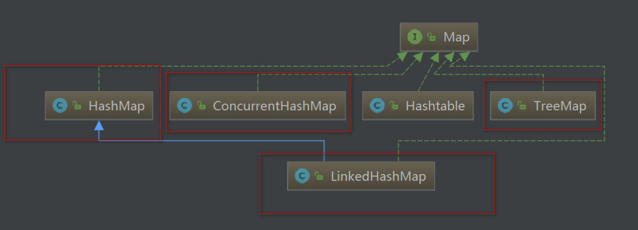
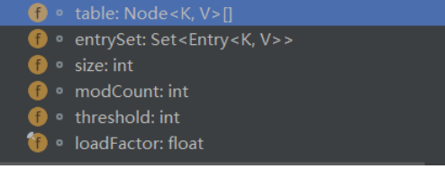
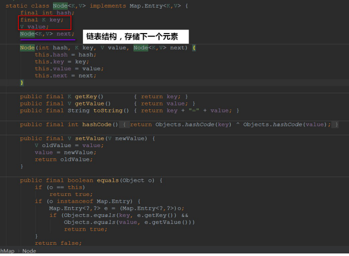
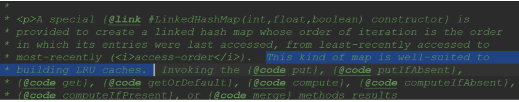
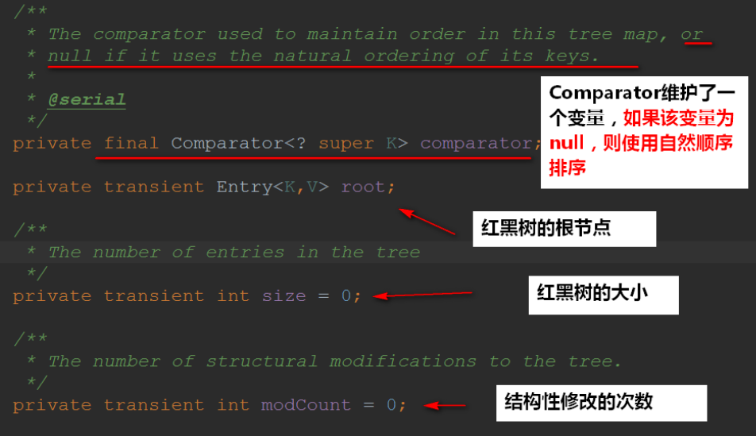
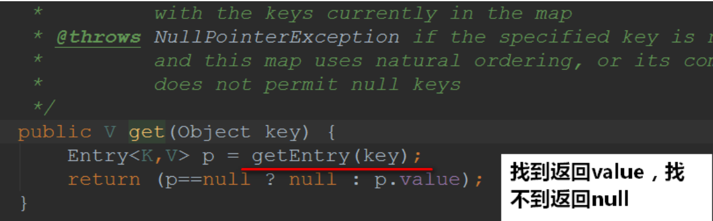
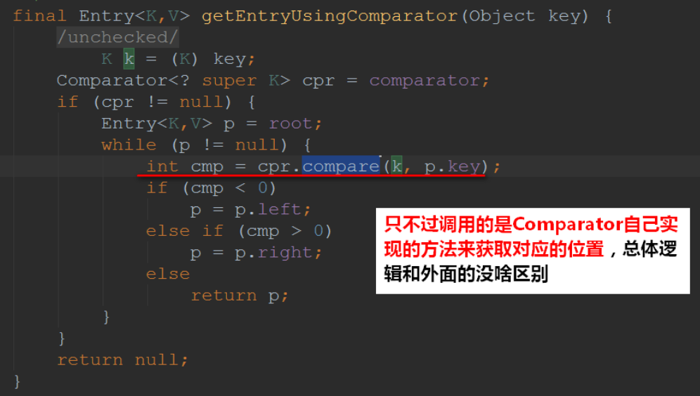

## 1. Map 介绍

### 1.1 为什么需要 Map

前⾯我们学习的 Collection 叫做集合，它可以快速查找现有的元素。  
⽽ Map 在《Core Java》中称之为-->映射..  
映射的模型图是这样的：


那为什么我们需要这种数据存储结构呢？？？    
举个例⼦    
作为学⽣来说，我们是根据学号来区分不同的学⽣。只要我们知道学号，就可以获取对应的学⽣信 息。这就是 Map 映射的作⽤！
⽣活中还有很多这样的例⼦：**只要你掏出身份证(key)，那就可以证明是你⾃⼰(value)**

### 1.2 Map 与 Collection 的区别

Map 集合的特点：

**将键映射到值的对象，一个映射不能包含重复的键，每个键最多只能映射到一个值**

Map 和 Collection 集合的区别：

1. Map 集合存储元素是成对出现的，Map 的键是唯一的，值是可以重复的。
2. Collection 集合存储元素是单独出现的，Collection 的儿子是唯一的，List 是可重复的。

要点：

1. **Map 集合的数据结构针对键有效，跟值无关**
2. **Collection 集合的数据结构针对元素有效**

### 1.3 Map 的功能

下⾯我们来看看 Map 的源码：


简单常⽤的 Map 功能有这么⼀些：

Map 集合的功能概述：

1. 添加功能  
   `V put (K key, V value)`:添加属性  
   如果键是第一次存储，就直接存储元素，返回 null  
   如果键不是第一次存储，就用值把以前的值替换掉，返回以前的值

2. 删除功能  
   `void clear()` 移除所有的键值对元素  
   `V remote(Object key)` 根据键删除值，并把值返回
3. 判断功能  
   `boolean containsKey(Object key)` 判断集合是否包含指定的值  
   `boolean containsValue（Object value）`判断集合是否包含指定的值  
   `boolean isEmpty()` 判断集合是否为空

4. 获取功能  
   `Set<Map.Entry<K key,V value>> entrySet()` 返回的是键值对对象的集合 `V get(Object key)` 根据键获取值  
   `Set <K> keySet()` 获取集合中所有的键的集合  
   `Collection<V> values()` 获取集合中所有得到值的集合
5. 长度功能  
   `int size()` 返回集合中键值对的对数

下⾯⽤红⾊框框圈住的就是**Map 值得关注的⼦类**：



## 2. 散列表介绍

⽆论是 Set 还是 Map，我们会发现都会有对应的-->HashSet,HashMap
⾸先我们也先得**回顾⼀下数据和链表**：

- 链表和数组都可以按照⼈们的意愿来排列元素的次序，他们可以说是有序的(存储的顺序和取出的 顺序是⼀致的)
- 但同时，这会带来缺点：想要获取某个元素，就要访问所有的元素，直到找到为⽌。
- 这会让我们消耗很多的时间在⾥边，遍历访问元素~

⽽还有另外的⼀些存储结构：**不在意元素的顺序，能够快速的查找元素的数据** 其中就有⼀种⾮常常⻅的：**散列表**

### 2.1 散列表⼯作原理

散列表为**每个对象计算出⼀个整数，称为散列码**。根据这些计算出来的**整数(散列码)保存在对应的位置上**！
在 Java 中，散列表⽤的是链表数组实现的，**每个列表称之为桶**。


⼀个桶上可能会**遇到被占⽤的情况(hashCode 散列码相同**，就存储在同⼀个位置上)，这种情况是⽆法避免的，这种现象称之为：**散列冲突**

- 此时需要⽤**该对象与桶上的对象进⾏⽐较，看看该对象是否存在桶⼦上了**~如果存在，就不添加 了，如果不存在则添加到桶⼦上
- 当然了，如果 hashcode 函数设计得⾜够好，桶的数⽬也⾜够，这种⽐较是很少的~

- 在**JDK1.8**中，**桶满**时会从**链表变成平衡⼆叉树**

如果散列表太满，**是需要对散列表再散列，创建⼀个桶数更多的散列表，并将原有的元素插⼊到新表中，丢弃原来的表~**
装填因⼦(load factor)**决定了何时**对散列表再散列~
装填因⼦默认为 0.75，如果表中**超过了 75%的位置**已经填⼊了元素，那么这个表就会⽤**双倍的桶数**
⾃动进⾏再散列


## 3. 红⿊树介绍

上⾯散列表中已经提过了：如果桶数满的时候，JDK8 是将**链表转成红⿊树**的~。并且，我们的 TreeSet、TreeMap 底层都是红⿊树来实现的。  
所以，在这⾥学习⼀波红⿊树到底是啥玩意。  
在未学习之前，我们可能是听过红⿊树这么⼀个数据结构类型的，还有其他什么 B/B+树等等，反正是⽐较复杂的数据结构了

各种常⻅的树的⽤途：

- `AVL树`

最早的平衡二叉树之一。引用相对其他数据结构比较少,window 对进程地址空间的管理用到 AVL 树

- `红黑树`

平衡二叉树，广泛用在 C++的 STL 中，如 Map 和 Set 都是用红黑树实现的。

- `B/B+树`

用在齿盘文件组件 数据索引和数据库索引

- `Trie树(字典树)`

用在统计和排序大量字符串，如自动机.

### 3.1 回顾⼆叉查找树

⾸先我们来回顾⼀下：利⽤⼆叉查找树的特性，我们⼀般来说可以很快地查找出对应的元素。

可是⼆叉查找树也有个例(最坏)的情况(线性)：


上⾯符合⼆叉树的特性，但是它是线性的，完全没树的⽤处~ 树是要“**均衡**”才能将它的优点展示出来的~，⽐如下⾯这种：


因此，就有了**平衡树**这么⼀个概念~红⿊树就是⼀种平衡树，它可以 **保证⼆叉树基本符合矮矮胖胖(均衡)** 的结构

### 3.2 知新 2-3 树

讲到了平衡树就不得不说最基础的 2-3 树，2-3 树⻓的是这个样⼦：


在⼆叉查找树上，我们插⼊节点的过程是这样的：⼩于节点值往右继续与左⼦节点⽐，⼤于则继续与右
⼦节点⽐，直到某节点左或右⼦节点为空，把值插⼊进去。**这样⽆法避免偏向问题**
⽽ 2-3 树不⼀样：**它插⼊的时候可以保持树的平衡**！

在 2-3 树插⼊的时可以简单总结为两个操作：

- **合并 2-节点为 3-节点，扩充将 3-节点扩充为⼀个 4-节点**

- **分解 4-节点为 3-节点，节点 3-节点为 2-节点**
- **........⾄使得树平衡~**


### 3.3 从 2-3 树到红⿊树

由于 2-3 树为了保持平衡性，在维护的时候是需要⼤量的节点交换的！这些变换在实际代码中是很复杂 的，⼤佬们在**2-3 树的理论基础上发明了红⿊树**(2-3-4 树也是同样的道理，只是 2-3 树是最简单的⼀种情况，所以我就不说 2-3-4 树了)。

红⿊树是对 2-3 查找树的改进，它能⽤⼀种**统⼀的⽅式完成所有变换。**
红⿊树是⼀种**平衡⼆叉树**,因此它没有 3-节点。那红⿊树是怎么将 3-节点来改进成全都是⼆叉树呢？ 红⿊树就字⾯上的意思，**有红⾊的节点，有⿊⾊的节点。**


我们可以将红⾊节点的左链接画平看看：


⼀颗典型的⼆叉树：


将红⾊节点的左链接画平之后：得到**2-3 平衡树**:


### 3.4 红⿊树基础知识

前⾯已经说了，**红⿊树是在 2-3 的基础上实现的⼀种树，它能够⽤统⼀的⽅式完成所有变换。** 红⿊树也是平衡树的⼀种，在插⼊元素的时候它也得保持树的平衡，那红⿊树是以什么的⽅式来保 持树的平衡的呢？
红⿊树⽤的是也是两种⽅式来替代 2-3 树不断的节点交换操作：

- 旋转：顺时针旋转和逆时针旋转

- 反⾊：交换红⿊的颜⾊

这个两个实现⽐ 2-3 树交换的节点(合并，分解)要⽅便⼀些

红⿊树为了保持平衡，还有制定⼀些约束，遵守这些约束的才能叫做红⿊树：

1. 红⿊树是⼆叉搜索树。
2. **根节点是⿊⾊。**
3. **每个叶⼦节点都是⿊⾊的空节点（NIL 节点）**。
4. **每个红⾊节点的两个⼦节点都是⿊⾊。(从每个叶⼦到根的所有路径上不能有两个连续的红⾊节点)**
5. 从任⼀节点到其每个叶⼦的所有路径都包含相同数⽬的⿊⾊节点(每⼀条树链上的⿊⾊节点数量（称之为“⿊⾼”）必须相等)。

## HashMap

## 一、HashMap 剖析

⾸先看看 HashMap 的顶部注释说了些什么：


再来看看 HashMap 的类继承图：


下⾯我们来看⼀下 HashMap 的属性：


成员属性有这么⼏个：



再来看⼀下 hashMap 的⼀个内部类 Node：



我们知道 Hash 的底层是散列表，⽽在 Java 中散列表的实现是通过数组+链表的~ 再来简单看看 put ⽅法就可以印证我们的说法了：**数组+链表-->散列表**


总结出 HashMap：

- **⽆序，允许为 null，⾮同步**
- **底层由散列表(哈希表)实现**
- **初始容量和装载因⼦对 HashMap 影响挺⼤的**，设置⼩了不好，设置⼤了也不好

### 1.1HashMap 构造方法

HashMap 的构造方法有 4 个：


在上面的构造方法最后一行，我们会发现调用了`tableSizeFor()`，我们进去看看：


看完上面可能会感到奇怪的是：**为啥是将 2 的整数幂的数赋给 threshold**？

- threshold 这个成员变量是阈值，决定了是否要将散列表再散列。它的值应该是：`capacity * load factor`才对的。

其实这里仅仅是一个初始化，当创建哈希表的时候，它会重新赋值的：


至于别的构造方法都差不多，这里我就不细讲了：


### 1.2put 方法

put 方法可以说是 HashMap 的核心，我们来看看：


我们来看看它是怎么计算哈希值的：


为什么要这样干呢？？我们一般来说直接将 key 作为哈希值不就好了吗，做异或运算是干嘛用的？？

我们看下来：


我们是根据 key 的哈希值来保存在散列表中的，我们表默认的初始容量是 16，要放到散列表中，就是 0-15 的位置上。也就是`tab[i = (n - 1) & hash]`。  
可以发现的是：在做`&`运算的时候，仅仅是**后 4 位有效**~那如果我们 key 的哈希值高位变化很大，低位变化很小。直接拿过去做`&`运算，这就会导致计算出来的 Hash 值相同的很多。

而设计者**将 key 的哈希值的高位也做了运算(与高 16 位做异或运算，使得在做&运算时，此时的低位实际上是高位与低位的结合)，这就增加了随机性**，减少了碰撞冲突的可能性！

下面我们再来看看流程是怎么样的：


新值覆盖旧值，返回旧值测试：


接下来我们看看`resize()`方法，在初始化的时候要调用这个方法，当散列表元素大于`capacity * load factor`的时候也是调用`resize()`


### 1.3 get 方法


接下来我们看看`getNode()`是怎么实现的：


### 1.4 remove 方法


再来看看`removeNode()`的实现：


## 二、HashMap 与 Hashtable 对比

> 从存储结构和实现来讲基本上都是相同的。它和 HashMap 的最大的不同是它是线程安全的，另外它不允许 key 和 value 为 null。Hashtable 是个过时的集合类，不建议在新代码中使用，不需要线程安全的场合可以用 HashMap 替换，需要线程安全的场合可以用 ConcurrentHashMap 替换

| 不同点                          | HashMap                 | HashTable                              |
| ------------------------------- | ----------------------- | -------------------------------------- |
| 数据结构                        | 数组+链表+红黑树        | 数据+链表                              |
| 继承的类不同                    | 继承 AbstractMap        | 继承 Dictionary                        |
| 是否线程安全                    | 否                      | 是                                     |
| 性能高低                        | 高                      | 低                                     |
| 默认初始化容器                  | 16                      | 11                                     |
| 扩容方式不同                    | 原始容量 x2             | 原始容量 x2+1                          |
| 底层数据的容量为 2 的整数次幂   | 要求一定为 2 的整数次幂 | 不要求                                 |
| 确认 key 在数据中的索引方式不同 | i=(n-1)&hash;           | index=(hash&0x7FFFFFFF)%tab.length;    |
| 遍历方法                        | iterator(迭代器)        | iterator(迭代器)和 Enumeration(枚举器) |
| iterator 遍历数组顺序           | 索引从小到大            | 索引从大到小                           |

## 三、HashMap 总结

在 JDK8 中 HashMap 的底层是：**数组+链表(散列表)+红黑树**

在散列表中有装载因子这么一个属性，当装载因子\*初始容量小于散列表元素时，该散列表会再散列，扩容 2 倍！

装载因子的**默认值是 0.75**，无论是初始大了还是初始小了对我们 HashMap 的性能都不好

- 装载因子初始值大了，可以减少散列表再散列(扩容的次数)，但同时会导致散列冲突的可能性变大(**散列冲突也是耗性能的一个操作，要得操作链表(红黑树)**！
- 装载因子初始值小了，可以减小散列冲突的可能性，但同时扩容的次数可能就会变多！

初始容量的**默认值是 16**，它也一样，无论初始大了还是小了，对我们的 HashMap 都是有影响的：

- 初始容量过大，那么遍历时我们的速度就会受影响~
- 初始容量过小，散列表再散列(扩容的次数)可能就变得多，扩容也是一件非常耗费性能的一件事~

从源码上我们可以发现：HashMap 并不是直接拿 key 的哈希值来用的，它会将 key 的哈希值的高 16 位进行异或操作，使得我们将元素放入哈希表的时候**增加了一定的随机性**。

还要值得注意的是：**并不是桶子上有 8 位元素的时候它就能变成红黑树，它得同时满足我们的散列表容量大于 64 才行的**~


## LinkedHashMap

## 一、LinkedHashMap

首先我们来看看类继承图：


我简单翻译了一下顶部的注释


从顶部翻译我们就可以归纳总结出 LinkedHashMap 几点：

- **底层是散列表和双向链表**
- **允许为 null，不同步**
- **插入的顺序是有序的(底层链表致使有序)**
- 装载因子和初始容量对 LinkedHashMap 影响是很大的~

同时也给我带了几个疑问：

- access-ordered 和 insertion-ordered 具体的使用和意思
- 为什么说初始容量对遍历没有影响？

希望可以在看源码的过程中可以解决掉我这两个疑问~~~那接下来就开始吧

### 1.1LinkedHashMap 的域


### 1.2LinkedHashMap 重写的方法

下面我列举就这两个比较重要的：


这就印证了我们的 LinkedHashMap**底层确确实实是散列表和双向链表**~

- 在构建新节点时，构建的是`LinkedHashMap.Entry` 不再是`Node`.

### 1.3 构造方法

可以发现，LinkedHashMap 有**5 个构造方法**：


下面我们来看看构造方法的定义是怎么样的：


从构造方法上我们可以知道的是：**LinkedHashMap 默认使用的是插入顺序**

### 1.4 put 方法

原本我是想要找 put 方法，看看是怎么实现的，**后来没找着，就奇了个怪**~


再顿了一下，原来 LinkedHashMap 和 HashMap 的 put 方法是一样的！LinkedHashMap 继承着 HashMap，LinkedHashMap 没有重写 HashMap 的 put 方法

所以，LinkedHashMap 的 put 方法和 HashMap 是一样的。

当然了，**在创建节点的时候，调用的是 LinkedHashMap 重写的方法**~


### 1.5 get 方法


get 方法也是多了：**判断是否为访问顺序**~~~

讲到了这里，感觉我们可以简单测试一波了：

首先我们来看看已**插入顺序**来进行插入和遍历：

```java
    public static void insertOrder() {

        // 默认是插入顺序
        LinkedHashMap<Integer,String>  insertOrder = new LinkedHashMap();

        String value = "关注公众号Java3y";
        int i = 0;

        insertOrder.put(i++, value);
        insertOrder.put(i++, value);
        insertOrder.put(i++, value);
        insertOrder.put(i++, value);
        insertOrder.put(i++, value);

        //遍历
        Set<Integer> set = insertOrder.keySet();
        for (Integer s : set) {
            String mapValue = insertOrder.get(s);
            System.out.println(s + "---" + mapValue);
        }
    }
```

测试一波：


接着，我们来测试一下以**访问顺序**来进行插入和遍历：

```java
    public static void accessOrder() {
        // 设置为访问顺序的方式
        LinkedHashMap<Integer,String> accessOrder = new LinkedHashMap(16, 0.75f, true);

        String value = "关注公众号Java3y";
        int i = 0;
        accessOrder.put(i++, value);
        accessOrder.put(i++, value);
        accessOrder.put(i++, value);
        accessOrder.put(i++, value);
        accessOrder.put(i++, value);


        // 遍历
        Set<Integer> sets = accessOrder.keySet();
        for (Integer key : sets) {
            String mapValue = accessOrder.get(key);
            System.out.println(key + "---" + mapValue);
        }

    }

```

代码**看似**是没有问题，但是运行会出错的！


前面在看源码注释的时候我们就发现了：**在 AccessOrder 的情况下，使用 get 方法也是结构性的修改**！

为了简单看出他俩的区别，下面我就**直接用 key 来进行看了**~

以下是**访问顺序的测试**：

```java

    public static void accessOrder() {
        // 设置为访问顺序的方式
        LinkedHashMap<Integer,String> accessOrder = new LinkedHashMap(16, 0.75f, true);

        String value = "关注公众号Java3y";
        int i = 0;
        accessOrder.put(i++, value);
        accessOrder.put(i++, value);
        accessOrder.put(i++, value);
        accessOrder.put(i++, value);
        accessOrder.put(i++, value);


        // 访问一下key为3的元素再进行遍历
        accessOrder.get(3);

        // 遍历
        Set<Integer> sets = accessOrder.keySet();
        for (Integer key : sets) {

            System.out.println(key );
        }

    }

```

测试结果：


以下是**插入顺序的测试**(代码就不贴了，和上面几乎一样)：


我们可以这样理解：**最常用的将其放在链表的最后，不常用的放在链表的最前**~

这个知识点以我的理解而言，它这个**访问顺序在 LinkedHashMap 如果不重写用处并不大**~它是用来给别的实现进行**扩展**的

- **因为最常被使用的元素再遍历的时候却放在了最后边，在 LinkedHashMap 中我也没找到对应的方法来进行调用**~
- 一个`removeEldestEntry(Map.Entry<K,V> eldest)`方法，**重写它可以删除最久未被使用的元素**！！
- 还有一个是`afterNodeInsertion(boolean evict)`方法，**新增时判断是否需要删除最久未被使用的元素**！！



### 1.6 remove 方法

对于 remove 方法，在 LinkedHashMap 中也没有重写，它调用的还是父类的 HashMap 的`remove()`方法，在 LinkedHashMap 中重写的是：`afterNodeRemoval(Node<K,V> e)`这个方法


当然了，在 remove 的时候会涉及到上面重写的方法：


### 1.7 遍历的方法

`Set<Map.Entry<K,V>> entrySet()`是被重写的了


看到了这里，我们就知道为啥注释说：**初始容量对遍历没有影响**

因为它遍历的是**LinkedHashMap 内部维护的一个双向链表**，而不是散列表(当然了，链表双向链表的元素都来源于散列表)

## 二、LinkedHashMap 总结

LinkedHashMap 比 HashMap 多了一个双向链表的维护，在数据结构而言它要复杂一些，阅读源码起来比较轻松一些，因为大多都由 HashMap 实现了..

阅读源码的时候我们会发现多态是无处不在的~子类用父类的方法，子类重写了父类的**部分**方法即可达到不一样的效果！

- 比如：LinkedHashMap 并没有重写 put 方法，而 put 方法内部的`newNode()`方法重写了。LinkedHashMap 调用父类的 put 方法，里面回调的是重写后的`newNode()`，从而达到目的！

LinkedHashMap 可以设置两种遍历顺序：

- 访问顺序（access-ordered）
- 插入顺序（insertion-ordered）
- **默认是插入顺序的**

对于访问顺序，它是 LRU(最近最少使用)算法的实现，要使用它要么**重写 LinkedListMap 的几个方法**(`removeEldestEntry(Map.Entry<K,V> eldest)`和`afterNodeInsertion(boolean evict)`)，要么是**扩展**成 LRUMap 来使用，不然设置为访问顺序（access-ordered）的用处不大~

**LinkedHashMap 遍历的是内部维护的双向链表**，所以说初始容量对 LinkedHashMap 遍历是不受影响的

## TreeMap

## 一、TreeMap 剖析

按照惯例，我简单翻译了一下顶部的注释


接着我们来看看类继承图：


在注释中提到的要点，我来总结一下：

- TreeMap 实现了 NavigableMap 接口，而 NavigableMap 接口继承着 SortedMap 接口，致使我们的**TreeMap 是有序的**！
- TreeMap 底层是红黑树，它方法的时间复杂度都不会太高:log(n)~
- 非同步
- 使用 Comparator 或者 Comparable 来比较 key 是否相等与排序的问题~

对我而言，Comparator 和 Comparable 我都忘得差不多了~~~下面就开始看 TreeMap 的源码来看看它是怎么实现的，并且回顾一下 Comparator 和 Comparable 的用法吧！

### 1.1 TreeMap 的域



### 1.2 TreeMap 构造方法

TreeMap 的构造方法有 4 个：


可以发现，TreeMap 的构造方法大多数与 comparator 有关：


也就是顶部注释说的：TreeMap 有序是通过 Comparator 来进行比较的，**如果 comparator 为 null，那么就使用自然顺序**~

打个比方：如果 value 是整数，自然顺序指的就是我们平常排序的顺序(1,2,3,4,5..)~

```java
    TreeMap<Integer, Integer> treeMap = new TreeMap<>();

    treeMap.put(1, 5);
    treeMap.put(2, 4);
    treeMap.put(3, 3);
    treeMap.put(4, 2);
    treeMap.put(5, 1);

    for (Entry<Integer, Integer> entry : treeMap.entrySet()) {

        String s = entry.getKey() +"关注公众号：Java3y---->" + entry.getValue();

        System.out.println(s);
    }
```


### 1.3 put 方法

我们来看看 TreeMap 的核心 put 方法，阅读它就可以获取不少关于 TreeMap 特性的东西了~


下面是`compare(Object k1, Object k2)`方法

```java
    /**
     * Compares two keys using the correct comparison method for this TreeMap.
     */
    @SuppressWarnings("unchecked")
    final int compare(Object k1, Object k2) {
        return comparator==null ? ((Comparable<? super K>)k1).compareTo((K)k2)
            : comparator.compare((K)k1, (K)k2);
    }
```

如果我们设置 key 为 null，会抛出异常的，就不执行下面的代码了。


### 1.4 get 方法

接下来我们来看看 get 方法的实现：



点进去`getEntry()`看看实现：


如果 Comparator 不为 null，接下来我们进去看看`getEntryUsingComparator(Object key)`，是怎么实现的



### 1.5 remove 方法


删除节点的时候调用的是`deleteEntry(Entry<K,V> p)`方法，这个方法主要是**删除节点并且平衡红黑树**

平衡红黑树的代码是比较复杂的，我就不说了，你们去看吧(反正我看不懂)....

### 1.6 遍历方法

在看源码的时候可能不知道哪个是核心的遍历方法，因为 Iterator 有非常非常多~


此时，我们只需要 debug 一下看看，跟下去就好！


于是乎，我们可以找到：**TreeMap 遍历是使用 EntryIterator 这个内部类的**

首先来看看 EntryIterator 的类结构图吧：


可以发现，EntryIterator 大多的实现都是在父类中：


那接下来我们去看看 PrivateEntryIterator 比较重要的方法：


我们进去`successor(e)`方法看看实现：

> successor 其实就是一个结点的 下一个结点，所谓 下一个，是按次序排序后的下一个结点。从代码中可以看出，如果右子树不为空，就返回右子树中最小结点。如果右子树为空，就要向上回溯了。在这种情况下，t 是以其为根的树的最后一个结点。如果它是其父结点的左孩子，那么父结点就是它的下一个结点，否则，t 就是以其父结点为根的树的最后一个结点，需要再次向上回溯。一直到 ch 是 p 的左孩子为止。

来源：https://blog.csdn.net/on_1y/article/details/27231855


## 二、TreeMap 总结

TreeMap 底层是红黑树，能够实现该 Map 集合有序~

如果在构造方法中传递了 Comparator 对象，那么就会以 Comparator 对象的方法进行比较。否则，则使用 Comparable 的`compareTo(T o)`方法来比较。

- 值得说明的是：如果使用的是`compareTo(T o)`方法来比较，**key 一定是不能为 null**，并且得实现了 Comparable 接口的。
- 即使是传入了 Comparator 对象，不用`compareTo(T o)`方法来比较，key**也是**不能为 null 的

```java
    public static void main(String[] args) {
        TreeMap<Student, String> map = new TreeMap<Student, String>((o1, o2) -> {
            //主要条件
            int num = o1.getAge() - o2.getAge();

            //次要条件
            int num2 = num == 0 ? o1.getName().compareTo(o2.getName()) : num;

            return num2;
        });

        //创建学生对象
        Student s1 = new Student("潘安", 30);
        Student s2 = new Student("柳下惠", 35);

        //添加元素进集合
        map.put(s1, "宋朝");
        map.put(s2, "元朝");
        map.put(null, "汉朝");

        //获取key集合
        Set<Student> set = map.keySet();

        //遍历key集合
        for (Student student : set) {
            String value = map.get(student);
            System.out.println(student + "---------" + value);
        }
    }
```


我们从源码中的很多地方中发现：Comparator 和 Comparable 出现的频率是很高的，因为 TreeMap 实现有序要么就是外界传递进来 Comparator 对象，要么就使用默认 key 的 Comparable 接口(实现自然排序)

最后我就来总结一下 TreeMap 要点吧：

1. 由于底层是红黑树，那么时间复杂度可以保证为 log(n)
2. key 不能为 null，为 null 为抛出 NullPointException 的
3. 想要自定义比较，在构造方法中传入 Co smparator 对象，否则使用 key 的自然排序来进行比较
4. TreeMap 非同步的，想要同步可以使用 Collections 来进行封装

## ConcurrentHashMap

## 一、ConCurrentHashMap 剖析

ConCurrentHashMap 在初学的时候反正我是没有接触过的，不知道你们接触过了没有~

这个类听得也挺少的，在集合中是比较复杂的一个类了，它涉及到了一些多线程的知识点。

不了解或忘记多线程知识点的同学也不要怕，哪儿用到了多线程的知识点，我都会简单介绍一下，并给出对应的资料去阅读的~

好了，我们就来开始吧~

### 1.1 初识 ConCurrentHashMap

ConCurrentHashMap 的**底层是：散列表+红黑树**，与 HashMap 是一样的。


从前面的章节我们也可以发现：最快了解一下类是干嘛的，我们**看源码的顶部注释**就可以了！

我简单翻译了一下顶部的注释(我英文水平渣，如果有错的地方请多多包涵~欢迎在评论区下指正)


根据上面注释我们可以简单总结：

- JDK1.8 底层是**散列表+红黑树**
- ConCurrentHashMap 支持**高并发**的访问和更新，它是**线程安全**的
- 检索操作不用加锁，get 方法是非阻塞的
- key 和 value 都不允许为 null

### 1.2JDK1.7 底层实现

上面指明的是 JDK1.8 底层是：散列表+红黑树，也就意味着，JDK1.7 的底层跟 JDK1.8 是不同的~

JDK1.7 的底层是：segments+HashEntry 数组：


图来源：https://blog.csdn.net/panweiwei1994/article/details/78897275

- Segment**继承了 ReentrantLock**,每个片段都有了一个锁，叫做“**锁分段**”

### 1.3 有了 Hashtable 为啥需要 ConCurrentHashMap

- Hashtable 是在**每个方法上都加上了 Synchronized**完成同步，效率低下。
- ConcurrentHashMap 通过在**部分加锁**和**利用 CAS 算法**来实现同步。

### 1.4CAS 算法和 volatile 简单介绍

在看 ConCurrentHashMap 源码之前，我们来简单讲讲 CAS 算法和 volatile 关键字

CAS（比较与交换，Compare and swap） 是一种有名的**无锁算法**

CAS 有**3 个**操作数

- **内存值 V**
- **旧的预期值 A**
- **要修改的新值 B**

**当且仅当预期值 A 和内存值 V 相同时，将内存值 V 修改为 B，否则什么都不做**

- 当多个线程尝试使用 CAS 同时更新同一个变量时，只有其中一个线程能更新变量的值(**A 和内存值 V 相同时，将内存值 V 修改为 B)**，而其它线程都失败，失败的线程**并不会被挂起**，而是被告知这次竞争中失败，并可以再次尝试 **(否则什么都不做)**

看了上面的描述应该就很容易理解了，先**比较**是否相等，如果相等则**替换**(CAS 算法)

---

接下来我们看看**volatile 关键字**，在初学的时候也很少使用到 volatile 这个关键字。反正我没用到，而又经常在看 Java 相关面试题的时候看到它，觉得是一个挺神秘又很难的一个关键字。其实不然，还是挺容易理解的~

volatile 经典总结：**volatile 仅仅用来保证该变量对所有线程的可见性，但不保证原子性**

我们将其拆开来解释一下：

- 保证**该变量对所有线程的可见性**
  - 在多线程的环境下：当这个变量修改时，**所有的线程都会知道该变量被修改了**，也就是所谓的“可见性”
- 不保证原子性
  - 修改变量(赋值)**实质上**是在 JVM 中**分了好几步**，而**在这几步内(从装载变量到修改)，它是不安全的**。

### 1.5 ConCurrentHashMap 域

域对象有这么几个：


我们来简单看一下他们是什么东东：


初次阅读完之后，有的属性我也不太清楚它是干什么的，在**继续阅读之后可能就明朗了**~

### 1.6 ConCurrentHashMap 构造方法

ConcurrentHashMap 的构造方法有 5 个：


具体的实现是这样子的：


可以发现，在构造方法中有几处都调用了`tableSizeFor()`，我们来看一下他是干什么的：

点进去之后发现，啊，原来我看过这个方法，在 HashMap 的时候.....


它就是用来获取**大于参数且最接近 2 的整次幂的数**...

**赋值给 sizeCtl 属性也就说明了：这是下次扩容的大小**~

### 1.7 put 方法

终于来到了最核心的方法之一：put 方法啦~~~~

我们先来**整体看一下**put 方法干了什么事：


接下来，我们来看看初始化散列表的时候干了什么事：`initTable()`


**只让一个线程对散列表进行初始化**！

### 1.8 get 方法

从顶部注释我们可以读到，get 方法是**不用加锁**的，是非阻塞的。

我们可以发现，Node 节点是重写的，设置了 volatile 关键字修饰，致使它每次获取的都是**最新**设置的值


## 二、ConcurrentHashMap 总结

上面简单介绍了 ConcurrentHashMap 的核心知识，还有很多知识点都没有提及到，作者的水平也不能将其弄懂~~有兴趣进入的同学可到下面的链接继续学习。

下面我来简单总结一下 ConcurrentHashMap 的核心要点：

- **底层结构是散列表(数组+链表)+红黑树**，这一点和 HashMap 是一样的。
- Hashtable 是将所有的方法进行同步，效率低下。而 ConcurrentHashMap 作为一个高并发的容器，它是通过**部分锁定+CAS 算法来进行实现线程安全的**。CAS 算法也可以认为是**乐观锁**的一种~
- 在高并发环境下，统计数据(计算 size...等等)其实是无意义的，因为在下一时刻 size 值就变化了。
- get 方法是非阻塞，无锁的。重写 Node 类，通过 volatile 修饰 next 来实现每次获取都是**最新**设置的值
- **ConcurrentHashMap 的 key 和 Value 都不能为 null**
