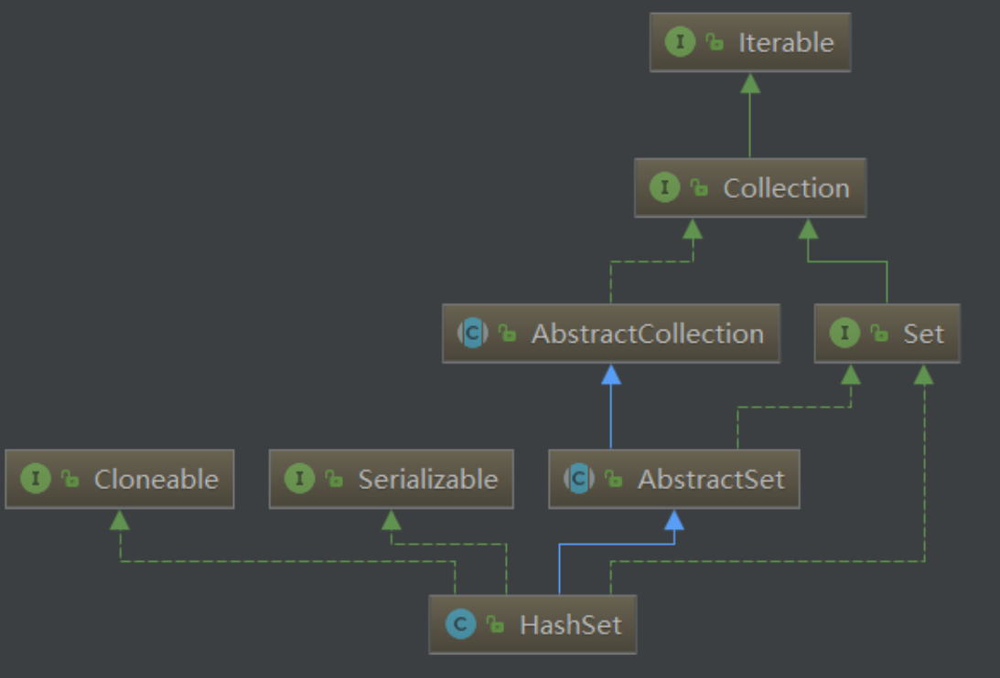
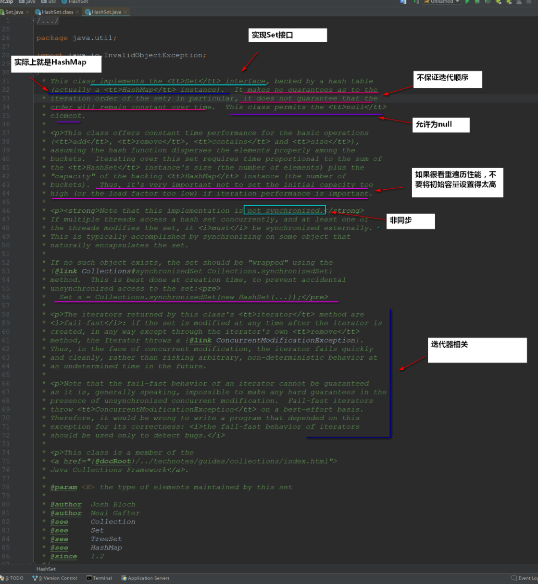
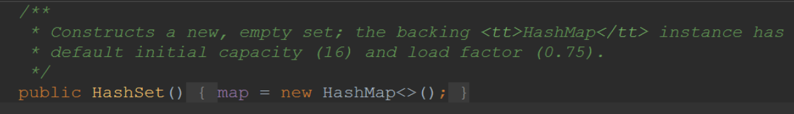
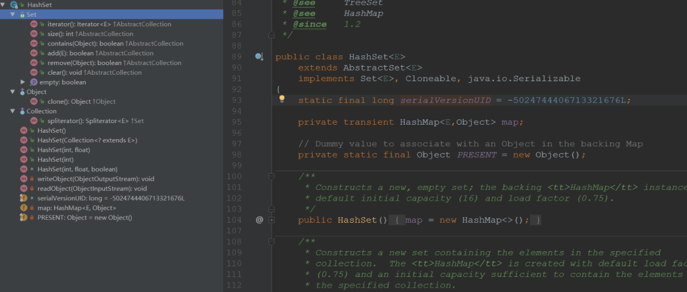
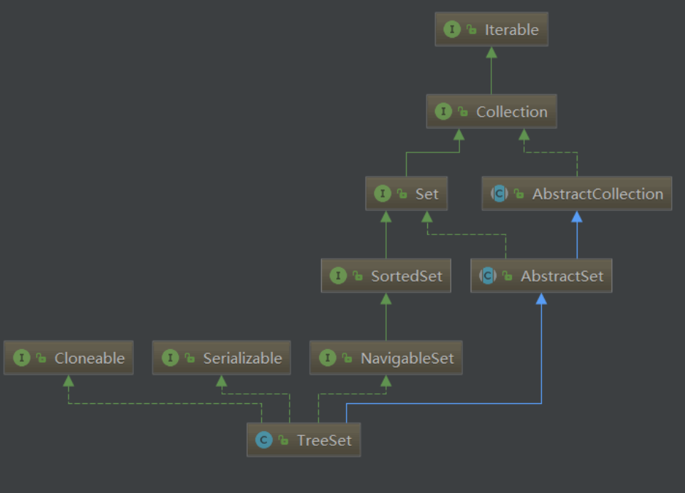
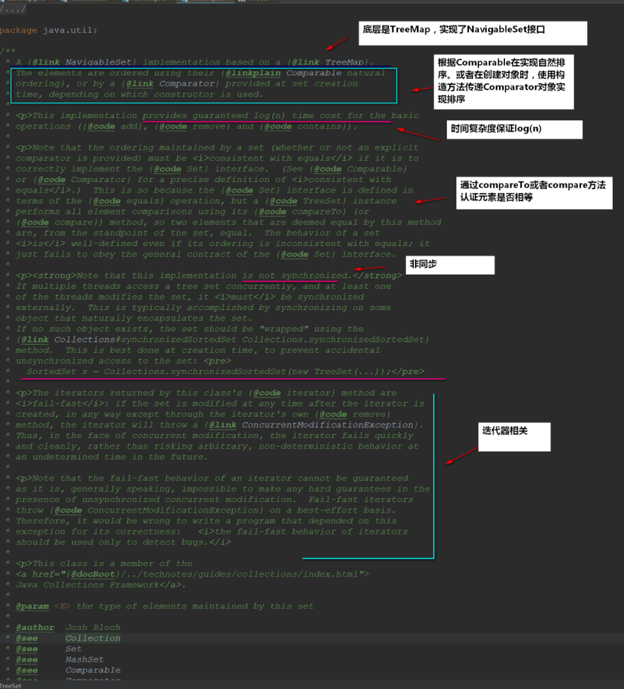
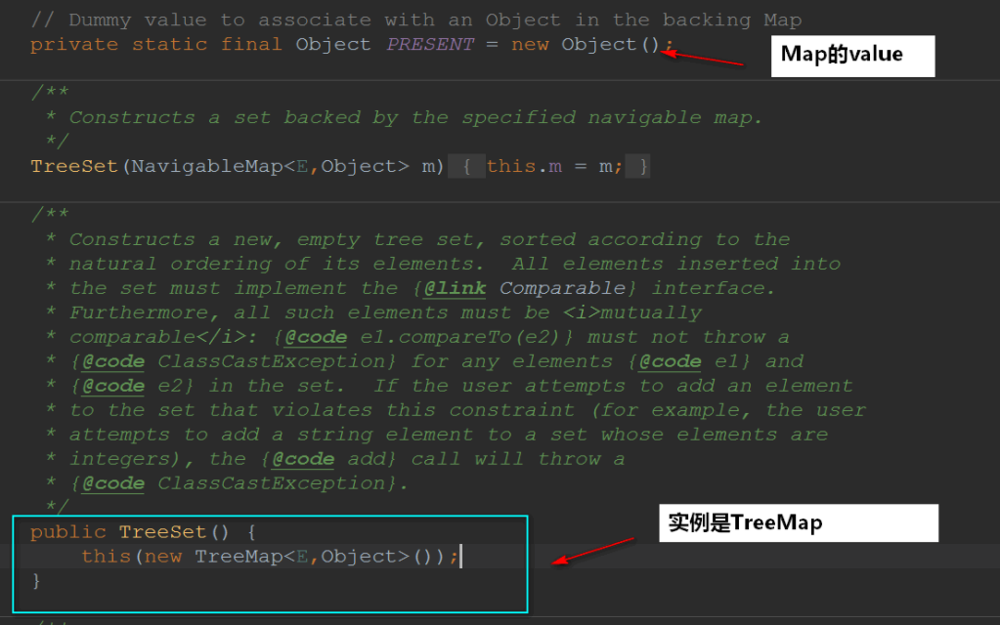
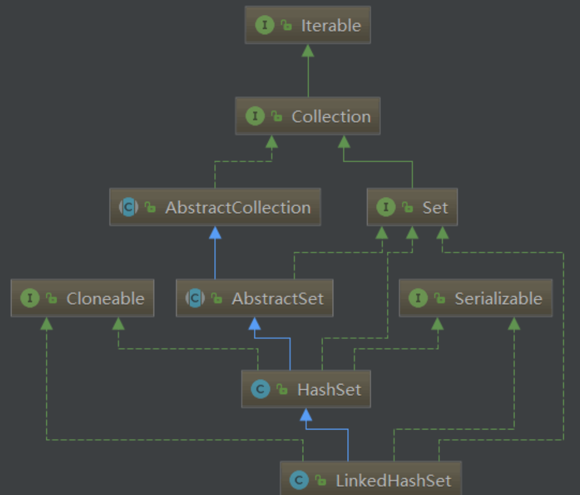
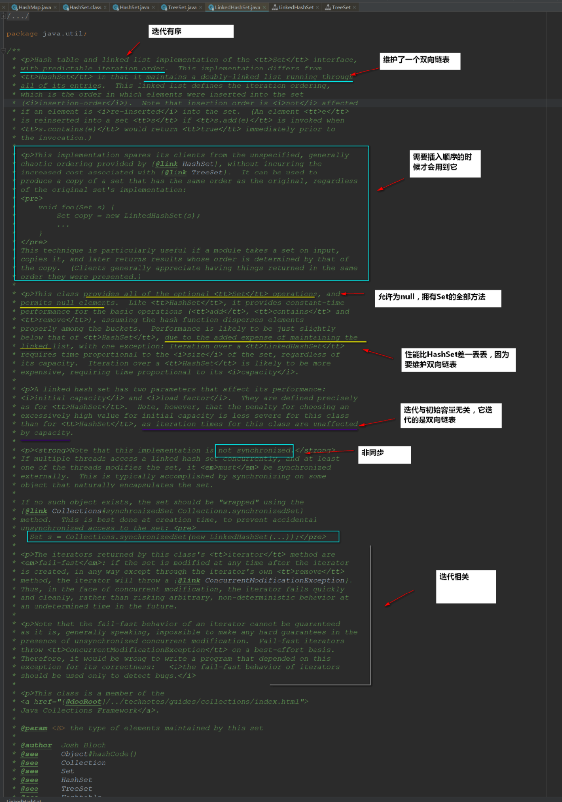

## 一、HashSet 剖析

首先，我们来看一下 HashSet 的继承结构图：



按照惯例，我们来看看 HashSet 顶部注释：



从顶部注释来看，我们就可以归纳 HashSet 的要点了：

- 实现 Set 接口
- 不保证迭代顺序
- 允许元素为 null
- **底层实际上是一个 HashMap 实例**
- 非同步
- 初始容量非常影响迭代性能

顶部注释说底层实际上是一个 HashMap 实例，那证据呢？



我们再来看一下 HashSet 整个类的方法和属性：



对于学习过 HashMap 的人来说，简直简单得让人开心，哈哈哈~

我们知道 Map 是一个映射，有 key 有 value，**既然 HashSet 底层用的是 HashMap，那么 value 在哪里呢**？？？

```java
//Dummy value to association with an Object in the backing Map
private static final Object PRESENT=new Object();
```

value 是一个 Object，**所有的 value 都是它**

所以可以直接总结出：HashSet 实际上就是封装了 HashMap，**操作 HashSet 元素实际上就是操作 HashMap**。这也是面向对象的一种体现，**重用性贼高**！

## 二、TreeSet 剖析

首先，我们也来看看 TreeSet 的类继承结构图：



按照惯例，我们来看看 TreeSet 顶部注释：



从顶部注释来看，我们就可以归纳 TreeSet 的要点了：

- 实现 NavigableSet 接口
- 可以实现排序功能
- **底层实际上是一个 TreeMap 实例**
- 非同步



## 三、LinkedHashSet 剖析

首先，我们也来看看 TreeSet 的类继承结构图：



按照惯例，我们来看看 LinkedHashSet 顶部注释：



从顶部注释来看，我们就可以归纳 LinkedHashSet 的要点了：

- 迭代是有序的
- 允许为 null
- **底层实际上是一个 HashMap+双向链表实例(其实就是 LinkedHashMap)...**
- 非同步
- 性能比 HashSet 差一丢丢，因为要维护一个双向链表
- 初始容量与迭代无关，LinkedHashSet 迭代的是双向链表

## 四、Set 集合总结

可以很明显地看到，**Set 集合的底层就是 Map**，所以我都没有做太多的分析在上面，也没什么好分析的了。

下面总结一下 Set 集合常用的三个子类吧：

**HashSet：**

- 无序，允许为 null，底层是 HashMap(散列表+红黑树)，非线程同步

**TreeSet：**

- 有序，不允许为 null，底层是 TreeMap(红黑树),非线程同步

**LinkedHashSet：**

- 迭代有序，允许为 null，底层是 HashMap+双向链表，非线程同步

从结论而言我们就可以根据自己的实际情况来使用了。
