## 一、学习集合学习指南

**Q:** 我们得知道为什么要学习 Java 集合，学到 Java 集合的时候已经学过了数组了，为什么我不⽤数组反⽽

⽤ Java 集合。数组和 Java 集合有什么区别？

**A:**Java 是⼀⻔⾯向对象的语⾔，就免不了处理对象，为了⽅便操作多个对象，那么我们就得把这多个对 象存储起来，想要存储多个对象(变量),很容易就能想到⼀个**容器**(集合)来装载

总的来说：就是 Java 给我们**提供了⼯具⽅便我们去操作多个**Java 对象。

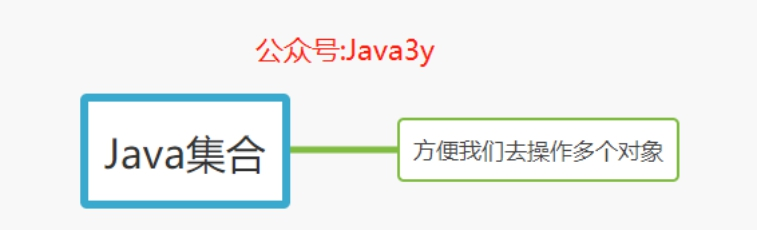

## **1.1** **如何入门学习**Java 集合

**Q:** 从上⾯我们已经知道了为什么要学 Java 集合，下⾯我们就该知道 Java 集合的基本⽤法，以及从它整体的知识点去了解它是什么

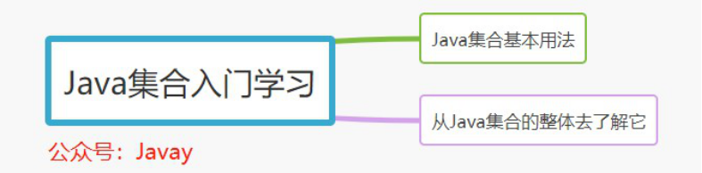

**A**： 我们学习 Java 集合实际上就是为了⽅便操作多个对象，⽽ Java 给我们提供⼀系列的 API(⽅法)供我们去操作。所以在初学 Java 集合的时候我们更多的是学习这些 API(⽅法)分别是什么意思。

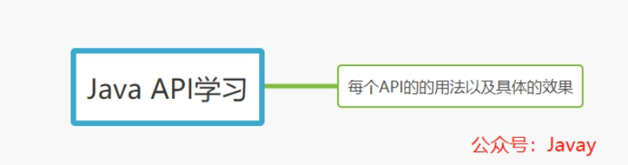

**Q**： 对 Java 集合的 API 使⽤有⼀定的了解之后，我们就应该从⾯向对象的⻆度去理解它。为什么会抽象出多个接⼝，以及每个接⼝的有什么特性。

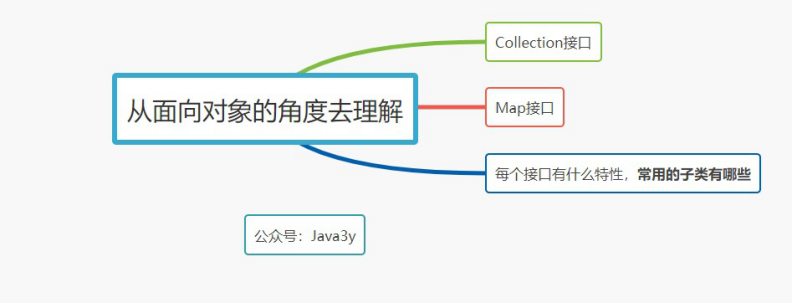

**A:** 我们可以总结出⼏个**常⽤的实现类**，这⼏个常⽤的实现类我们必须要知道它的**数据结构**是什么，什么时候使⽤这个类。

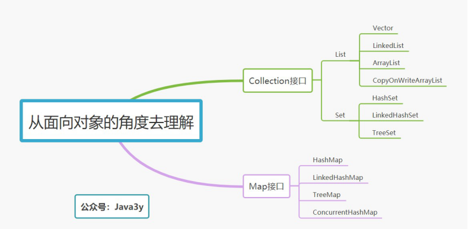

需要学习和了解的数据结构：

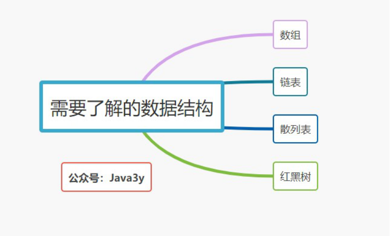

到这⾥，我们简单了解各个实现类的数据结构以后，我们可能会简单记住下⾯的**结论**：

如果是集合类型，有`List` 和 `Set` 供我们选择。
**List 的特点是插⼊有序的，元素是可重复的。Set 的特点是插⼊⽆序的，元素不可重复的。**  
 ⾄于选择哪个实现类来作为我们的存储容器，我们就得看具体 的应⽤场景。是希望可重复的就得⽤ List，选择 List 下常⻅的⼦类。是希望不可重复，选择 Set 下常⻅的⼦类。

**如果是 Key-Value 型，那我们会选择 Map。如果要保持插⼊顺序的，我们可以选择 LinkedHashMap，如果不需要则选择 HashMap，如果要排序则选择 TreeMap。**  
 总之：学完**常见**实现类的数据结构之后，你对它的使⽤场景就有⼀个清楚的认知了。

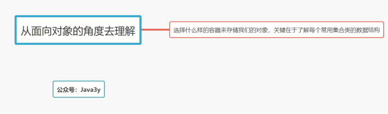

### **1.2** **集合进阶与⾯试**

如果我们在写代码的时候**懂得**选择什么样的集合作为我们的容器，那已经是⼊⻔了。但要知道的是，如 果去⾯试之前，你懂的不应该只有这么少。

（如果还在**初学或者零基础**的同学我建议可以跳过这⼀部分，在⽹上有可能很多⾔论，⽐如：**“**如果你**Java**基础扎实的话，那你以后找⼯作就不愁了。在学**Java**基础的时候⼀定要把基础学好，看源码！**”**。但我认为，这⼀块是建⽴在有⼀定的编码/项⽬或者是去找⼯作的时候才成⽴的，**⼀个刚⼊⻔学**Java 的，就不应该看源码，这很容易把⾃⼰劝退了）

我的观点是：如果刚⼊⻔学 Java，⾸先你要⼗分清楚知道为什么要学这个，这个到底有什么⽤，⽤在哪 些地⽅，以及熟悉常⽤的⽅法，就⾜够了。即便你花了两周左右时间去看源码实现了，可能看懂了。但 是，你相信我，你**⼤概率会忘掉**。

Java 集合是⾯试的**重点**，我在⾯试的时候⼏乎每家公司都会问集合的问题，从基础到源码，⼀步⼀步深

⼊。Java 集合⾯试的知识点就不限于基本的⽤法了。可能⾯试官会问你：

- HashMap 的数据结构是什么？他是怎么扩容的？底层有没有⽤红⿊树？取 Key Hash 值是 JDK 源码是怎么实现的？为什么要这样做？

* HashMap 是线程安全的吗？什么是线程安全？有什么更好的解决⽅案？那线程安全的 HashMap 是 怎么实现的？

- HashSet 是如何判断 Key 是重复的？

.....很多很多

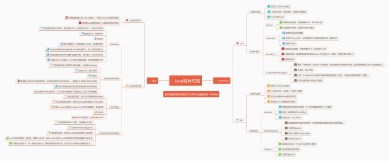

总的来说，⼊⻔ Java 集合并不难，归根到底我认为就是三件事：

- 了解为什么要学习 Java 集合

- 学习 Java 集合的各个接⼝以及常⽤的实现类⽤法

* 学习常⽤实现类的数据结构是什么，能在写代码的时候选择⼀个合适的实现类装载⾃⼰的对象。

零基础⼊⻔不需要阅读源码，⾯试前⼀定要回顾和阅读源码（这是⾯试必考的知识点）！

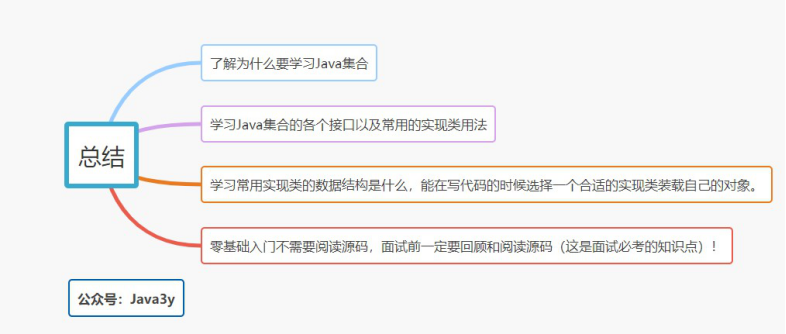

## ⼆、Collection

### 1.集合(Collection)介绍

#### 1.1 为什么需要 Collection

1. Java 是⼀⻔⾯向对象的语⾔，就免不了处理对象
2. 为了⽅便操作多个对象，那么我们就得把这多个对象存储起来
3. 想要存储多个对象(变量),很容易就能想到⼀个容器
4. 常⽤的容器我们知道有-->StringBuffered,数组(虽然有对象数组，但是数组的⻓度是不可变的！)
5. 所以，Java 就为我们提供了集合(Collection)～

#### 1.2 数组和集合的区别

接下来，我们可以对数组和集合的区别来分析⼀下：

数组和集合的区别:

1. 长度的区别

- **数组的长度固定**
- **集合的长度可变**

2. 元素的数据类型

- 数组可以存储基本数据类型,也可以存储引⽤类型
- **集合只能存储引⽤类型(你存储的是简单的 int，它会⾃动装箱成 Integer)**

#### 1.3 Collection 的由来与功能

Collection 的由来：

- 集合可以存储多个元素,但我们对多个元素也有不同的需求
  - 多个元素,不能有相同的
  - 多个元素,能够按照某个规则排序
- 针对不同的需求：java 就提供了很多集合类，多个集合类的数据结构不同。但是，结构不重要，重 要的是能够存储东⻄,能够判断,获取
- 把集合共性的内容不断往上提取,最终形成集合的继承体系 Collection

Collection 的⼤致结构体系是这样的：

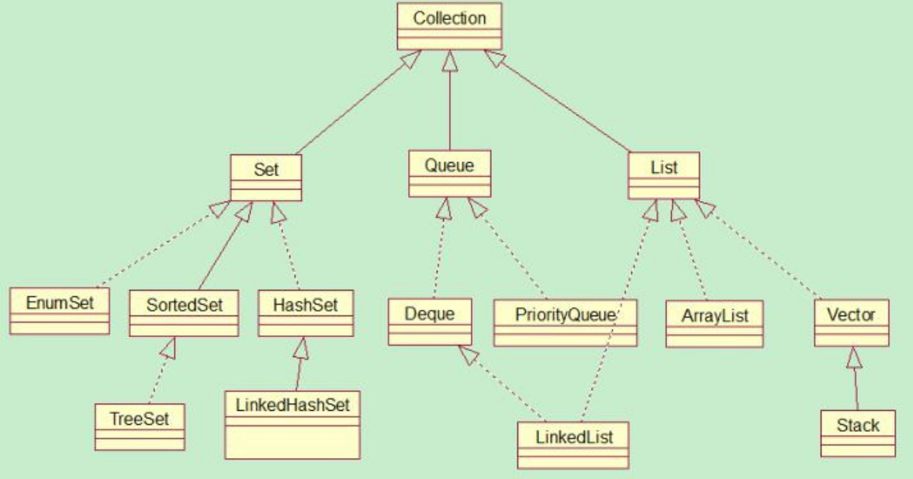

但是，⼀般我们要掌握的并不需要那么多，只需要掌握⼀些常⽤的集合类就⾏了。下⾯我圈出来的那些：

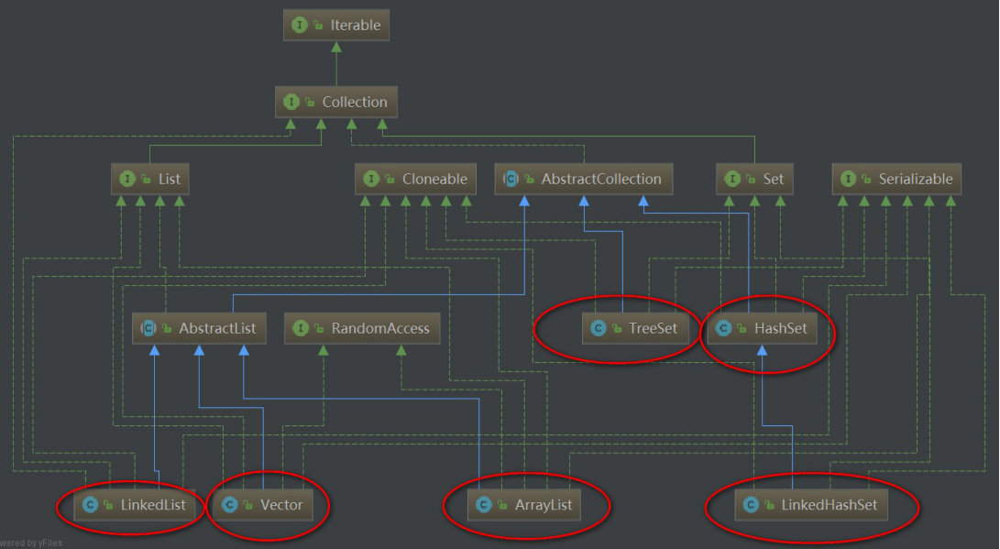

再次精减：

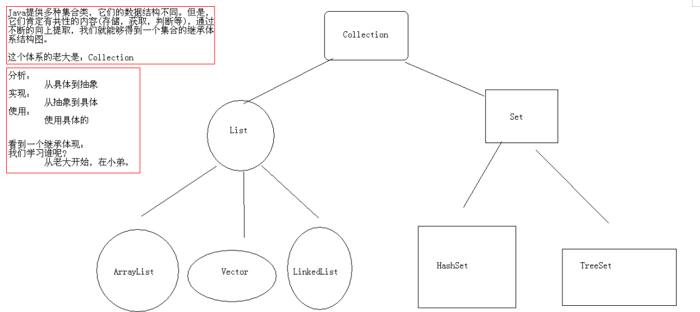

Collection 的基础功能：

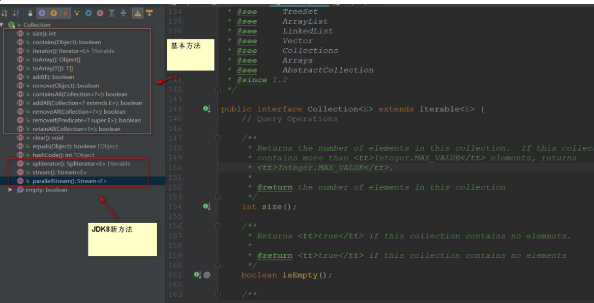

Collection 的功能：

1. 添加功能  
   `boolean add(Object obj)`:添加一个元素  
   `boolean addAll(Collection c)`：添加一个集合元素
2. 删除功能  
   `void clear()`：移出所有的元素  
   `boolean remove(Object)` ：移除一个元素  
   `boolean removeAll(Collection c)`:移除一个集合的元素，只要一个元素被移除，就返回 true
3. 判断功能  
  ` boolean contains(Object o)`:判断集合是否包含该元素  
   `boolean containAll(Collection c)`:半段集合中是否包含指定的集合元素，只有包含所有的元素，才叫包含
4. 获取功能  
   `Iterator[E] iterator()`：迭代器
5. 长度功能  
   `int size（）`：元素个数
6. 交集功能  
  ` boolean retainAll(Collection c)`：移除此 collection 中包含在指定 collection 中的所有元素。  
   集合 A 和集合 B 左交集，最终的结果保存在集合 A，返回值表示的是 A 是否发生变化。

### 2.迭代器(Iterator)介绍

我们可以发现 Collection 的源码中继承了 Iterable，有`iterator()`这个⽅法...

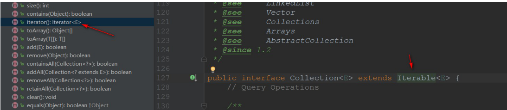

点进去看了⼀下，Iterable 是⼀个接⼝：

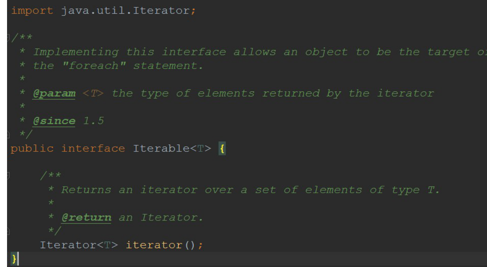

它有`iterator()`这个⽅法，返回的是 Iterator
再来看⼀下，Iterator 也是⼀个接⼝，它只有三个⽅法：

- `hasNext()`

- `next()`

- `remove()`

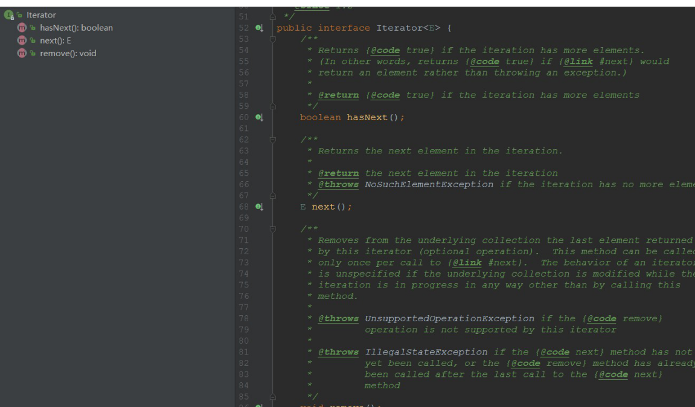

可是，我们没能找到对应的实现⽅法，只能往 Collection 的⼦类下找找了，于是我们找到了---

> ArrayList(该类后⾯会说)

于是，我们在 ArrayList 下找到了 iterator 实现的身影：它是在 ArrayList 以**内部类的⽅式实现**的！并且，从源码可知：**Iterator 实际上就是在遍历集合**

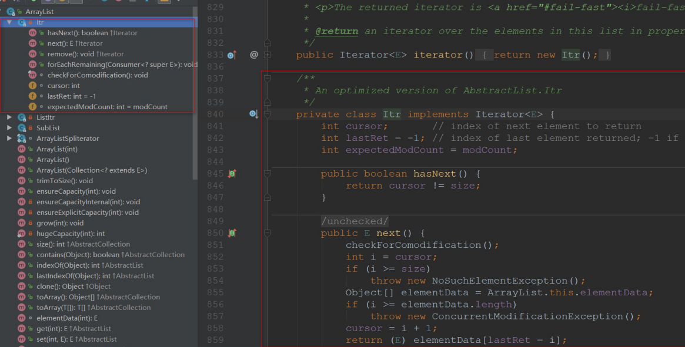

所以说：我们**遍历集合(Collection)的元素都可以使⽤ Iterator**，⾄于它的具体实现是以内部类的⽅式实现的！

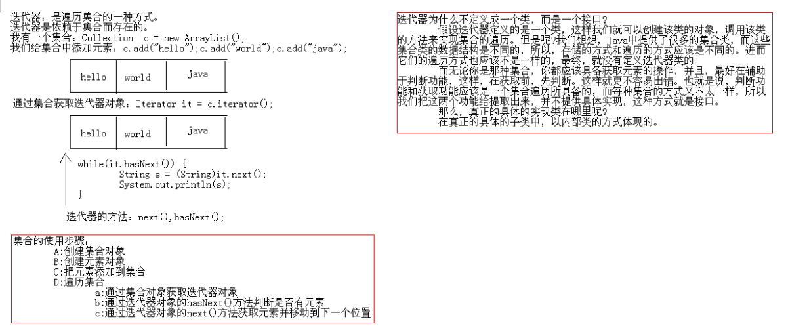
