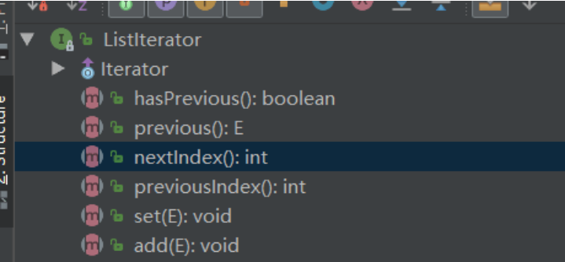

Java 容器可分为两大类：

- Collection
  - List
    - **ArrayList**
    - LinkedList
    - Vector(了解，已过时)
  - Set
    - **HashSet**
      - LinkedHashSet
    - TreeSet
- Map
  - **HashMap**
    - LinkedHashMap
  - TreeMap
  - ConcurrentHashMap
  - Hashtable(了解，，已过时)

着重标出的那些就是我们**用得最多**的容器。

## 一、ArrayList 和 Vector 的区别

**共同点：**

- 这两个类都实现了 List 接口，它们都是**有序**的集合(存储有序)，**底层是数组**。我们可以按位置索引号取出某个元素，**允许元素重复和为 null**。

**区别：**

- **同步性：**
  - ArrayList 是非同步的
  - Vector 是同步的
  - 即便需要同步的时候，我们可以使用 Collections 工具类来构建出同步的 ArrayList 而不用 Vector
- **扩容大小：**
  - Vector 增长原来的一倍，ArrayList 增长原来的 0.5 倍

## 二、HashMap 和 Hashtable 的区别

**共同点：**

- 从存储结构和实现来讲基本上都是相同的，都是实现 Map 接口~

**区别：**

- **同步性：**
  - HashMap 是非同步的
  - Hashtable 是同步的
  - 需要同步的时候，我们往往不使用，而使用 ConcurrentHashMap[ConcurrentHashMap 基于 JDK1.8 源码剖析](https://mp.weixin.qq.com/s?__biz=MzI4Njg5MDA5NA==&mid=2247484161&idx=1&sn=6f52fb1f714f3ffd2f96a5ee4ebab146&chksm=ebd74200dca0cb16288db11f566cb53cafc580e08fe1c570e0200058e78676f527c014ffef41#rd)
- **是否允许为 null：**
  - HashMap 允许为 null
  - Hashtable 不允许为 null
- **contains 方法**
  - 这知识点是在牛客网刷到的，没想到这种题还会有(我不太喜欢)....
  - Hashtable 有 contains 方法
  - HashMap 把 Hashtable 的 contains 方法去掉了，改成了 containsValue 和 containsKey
- **继承不同：**
  - HashMap<K,V> extends AbstractMap<K,V>
  - public class Hashtable<K,V> extends Dictionary<K,V>

## 三、List 和 Map 的区别

**共同点：**

- 都是 Java 常用的容器，都是接口(ps：写出来感觉好像和没写一样.....)

**不同点：**

- **存储结构不同**：
  - List 是存储单列的集合
  - Map 存储的是 key-value 键值对的集合
- **元素是否可重复**：
  - List 允许元素重复
  - Map 不允许 key 重复
- **是否有序**：
  - List 集合是有序的(存储有序)
  - Map 集合是无序的(存储无序)

## 四、Set 里的元素是不能重复的，那么用什么方法来区分重复与否呢? 是用==还是 equals()?

我们知道 Set 集合实际**大都使用的是 Map 集合的 put 方法来添加元素**。

以 HashSet 为例，HashSet 里的元素不能重复，在源码(HashMap)是这样体现的：

```

  // 1. 如果key 相等
    if (p.hash == hash &&
        ((k = p.key) == key || (key != null && key.equals(k))))
        e = p;
  // 2. 修改对应的value
     if (e != null) { // existing mapping for key
            V oldValue = e.value;
            if (!onlyIfAbsent || oldValue == null)
                e.value = value;
            afterNodeAccess(e);
            return oldValue;
       }
```

添加元素的时候，如果 key(也对应的 Set 集合的元素)相等，那么则修改 value 值。而在 Set 集合中，value 值仅仅是一个 Object 对象罢了(**该对象对 Set 本身而言是无用的**)。

也就是说：Set 集合如果添加的元素相同时，**是根本没有插入的(仅修改了一个无用的 value 值)**！从源码(HashMap)中也看出来，**==和 equals()方法都有使用**！

## 五、Collection 和 Collections 的区别

1. Collection 是集合的上级**接口**，继承它的有 Set 和 List 接口
2. Collections 是集合的**工具类**，提供了一系列的静态方法对集合的搜索、查找、同步等操作

## 六、说出 ArrayList,LinkedList 的存储性能和特性

ArrayList 的底层是数组，LinkedList 的底层是双向链表。

- ArrayList 它支持以角标位置进行索引出对应的元素(随机访问)，而 LinkedList 则需要遍历整个链表来获取对应的元素。因此**一般来说 ArrayList 的访问速度是要比 LinkedList 要快的**
- ArrayList 由于是数组，对于删除和修改而言消耗是比较大(复制和移动数组实现)，LinkedList 是双向链表删除和修改只需要修改对应的指针即可，消耗是很小的。因此**一般来说 LinkedList 的增删速度是要比 ArrayList 要快的**

### 6.1 扩展：

ArrayList 的增删**未必**就是比 LinkedList 要慢。

- 如果增删都是在**末尾**来操作【每次调用的都是 remove()和 add()】，此时 ArrayList 就不需要移动和复制数组来进行操作了。如果数据量有百万级的时，**速度是会比 LinkedList 要快的**。(我测试过)
- 如果**删除操作**的位置是在**中间**。由于 LinkedList 的消耗主要是在遍历上，ArrayList 的消耗主要是在移动和复制上(底层调用的是 arraycopy()方法，是 native 方法)。
  - LinkedList 的遍历速度是要慢于 ArrayList 的复制移动速度的
  - 如果数据量有百万级的时，**还是 ArrayList 要快**。(我测试过)

## 七、Enumeration 和 Iterator 接口的区别

这个我在前面的文章中也没有详细去讲它们，只是大概知道的是：Iterator 替代了 Enumeration，Enumeration 是一个旧的迭代器了。

与 Enumeration 相比，Iterator 更加安全，**因为当一个集合正在被遍历的时候，它会阻止其它线程去修改集合**。

- 我们在做练习的时候，迭代时会不会经常出错，抛出 ConcurrentModificationException 异常，说我们在遍历的时候还在修改元素。
- 这其实就是 fail-fast 机制~具体可参考博文：https://blog.csdn.net/panweiwei1994/article/details/77051261

**区别有三点：**

- Iterator 的方法名比 Enumeration 更科学
- Iterator 有 fail-fast 机制，比 Enumeration 更安全
- Iterator 能够删除元素，Enumeration 并不能删除元素

## 八、ListIterator 有什么特点

- ListIterator**继承了**Iterator 接口，它用于**遍历 List 集合的元素**。
- ListIterator 可以实现**双向遍历,添加元素，设置元素**

看一下源码的方法就知道了：



## 九、并发集合类是什么？

Java1.5 并发包（java.util.concurrent）**包含线程安全集合类，允许在迭代时修改集合**。

- Utils 包下的集合迭代器被设计为 fail-fast 的，会抛出 ConcurrentModificationException。但 java.util.concurrent 的并不会，感谢评论区提醒~
- 一部分类为：
  - CopyOnWriteArrayList
  - ConcurrentHashMap
  - CopyOnWriteArraySet

## 十、Java 中 HashMap 的 key 值要是为类对象则该类需要满足什么条件？

**需要同时重写该类的 hashCode()方法和它的 equals()方法**。

- 从源码可以得知，在插入元素的时候是**先算出该对象的 hashCode**。如果 hashcode 相等话的。那么表明该对象是存储在同一个位置上的。
- 如果调用 equals()方法，**两个 key 相同**，则**替换元素**
- 如果调用 equals()方法，**两个 key 不相同**，则说明该**hashCode 仅仅是碰巧相同**，此时是散列冲突，将新增的元素放在桶子上

一般来说，我们会认为：**只要两个对象的成员变量的值是相等的，那么我们就认为这两个对象是相等的**！因为，Object 底层比较的是两个对象的地址，而对我们开发来说这样的意义并不大~这也就为什么我们要重写`equals()`方法

重写了 equals()方法，就要重写 hashCode()的方法。因为**equals()认定了这两个对象相同**，而**同一个对象调用 hashCode()方法时**，是应该返回相同的值的！

## 十一、与 Java 集合框架相关的有哪些最好的实践

1. **根据需要**确定集合的类型。如果是单列的集合，我们考虑用 Collection 下的子接口 ArrayList 和 Set。如果是映射，我们就考虑使用 Map~
2. 确定完我们的集合类型，我们接下来**确定使用该集合类型下的哪个子类**~我认为可以简单分成几个步骤：
   - 是否需要同步
     - 去找线程安全的集合类使用
   - 迭代时是否需要有序(插入顺序有序)
     - 去找 Linked 双向列表结构的
   - 是否需要排序(自然顺序或者手动排序)
     - 去找 Tree 红黑树类型的(JDK1.8)
3. 估算存放集合的数据量有多大，无论是 List 还是 Map，它们实现动态增长，都是有性能消耗的。在初始集合的时候给出一个**合理的容量**会减少动态增长时的消耗~
4. **使用泛型**，避免在运行时出现 ClassCastException
5. 尽可能使用 Collections 工具类，或者获取只读、同步或空的集合，**而非编写自己的实现**。它将会提供代码重用性，它有着更好的稳定性和可维护性

## 十二、ArrayList 集合加入 1 万条数据，应该怎么提高效率

ArrayList 的默认初始容量为 10，要插入大量数据的时候需要不断扩容，而扩容是非常影响性能的。因此，现在明确了 10 万条数据了，我们可以**直接在初始化的时候就设置 ArrayList 的容量**！

这样就可以提高效率了~
