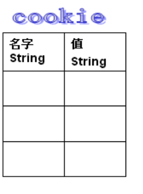
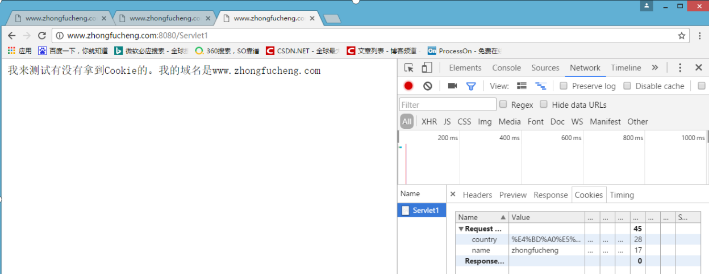

## 1、Cookie 饼干

### 1. 什么是会话技术

基本概念: 指用户开一个浏览器，**访问一个网站,只要不关闭该浏览器，不管该用户点击多少个超链接，访问多少资源，直到用户关闭浏览器，整个这个过程我们称为一次会话.**

### 2. 为什么我们要使用会话技术？

会话跟踪技术可以解决我们很多很多问题。

- 在论坛登陆的时候，**很多时候会有一个小框框问你是否要自动登陆，当你下次登陆的时候就不用输入密码了**


- 根据我以前浏览过的商品，猜我喜欢什么商品（要猜我喜欢，总得知道”我是谁“）


会话跟踪技术有 Cookie 和 Session，Cookie 技术是先出现的。我们先讲 Cookie 技术吧。

### a)什么是 **Cookie?**

Cookie 是由 W3C 组织提出，最早由 netscape 社区发展的一种机制

- 网页之间的**交互是通过 HTTP 协议传输数据的**，而**Http 协议是无状态的协议**。无状态的协议是什么意思呢**？一旦数据提交完后，浏览器和服务器的连接就会关闭，再次交互的时候需要重新建立新的连接。**
- 服务器无法确认用户的信息，于是乎，W3C 就提出了：**给每一个用户都发一个通行证，无论谁访问的时候都需要携带通行证，这样服务器就可以从通行证上确认用户的信息。**通行证就是**Cookie**


Cookie 的流程：浏览器访问服务器，**如果服务器需要记录该用户的状态，就使用 response 向浏览器发送一个 Cookie，浏览器会把 Cookie 保存起来。当浏览器再次访问服务器的时候，浏览器会把请求的网址连同 Cookie 一同交给服务器。**

- Cookie 翻译过来是饼干的意思。
- Cookie 是服务器通知客户端保存键值对的一种技术。
- 客户端有了 Cookie 后，每次请求都发送给服务器。
- 每个 Cookie 的大小不能超过 4kb

#### 1. Cookie API

- Cookie 类用于创建一个 Cookie 对象
- response 接口中定义了一个 addCookie 方法，它用于在其响应头中增加一个相应的 Set-Cookie 头字段
- request 接口中定义了一个 getCookies 方法，它用于获取客户端提交的 Cookie
  常用的 Cookie 方法：
- `public Cookie(String name,String value)`
- `setValue`与 `getValue`方法
- `setMaxAge`与`getMaxAge` 方法
- `setPath` 与`getPath`方法
- `setDomain` 与 `getDomain` 方法
- `getName` 方法

#### 2. 简单使用 Cookie

创建 Cookie 对象，发送 Cookie 给浏览器、

```java
//设置 response 的编码
response.setContentType("text/html;charset=UTF-8");

//创建 Cookie 对象，指定名称和值
Cookie cookie = new Cookie("username", "zhongfucheng");

//向浏览器给一个 Cookie
response.addCookie(cookie);
response.getWriter().write("我已经向浏览器发送了一个 Cookie");
```

浏览器本身没有任何 Cookie


访问 Servlet1，**再回到文件夹中，还是没有发现 Cookie，这是为什么呢？我明明向浏览器发送了一个 Cookie 的。**

**原来发送 Cookie 给浏览器是需要设置 Cookie 的时间的。** 在给浏览器之前，设置一下 Cookie 的时间

```java
//设置 Cookie 的时间
cookie.setMaxAge(1000);
```

再次访问，已经发现文件夹中多了个 Cookie 的文本了


### b)如何创建 **Cookie**


Servlet 程序中的代码：

```java
protected void createCookie(HttpServletRequest req, HttpServletResponse resp) throws ServletException, IOException {
//1 创建 Cookie 对象
Cookie cookie = new Cookie("key4", "value4");
//2 通知客户端保存
Cookie resp.addCookie(cookie);
//1 创建 Cookie 对象
Cookie cookie1 = new Cookie("key5", "value5");
//2 通知客户端保存
Cookie resp.addCookie(cookie1);
resp.getWriter().write("Cookie 创建成功"); }
```

### c)服务器如何获取 Cookie

服务器获取客户端的 Cookie 只需要一行代码：req.getCookies():Cookie[]


Cookie 的工具类：

```java
    public class CookieUtils {
        /*** 查找指定名称的 Cookie 对象 * @param name * @param cookies * @return */
        public static Cookie findCookie(String name, Cookie[] cookies) {
            if (name == null || cookies == null || cookies.length == 0) {
                return null;
            }
            for (Cookie cookie : cookies) {
                if (name.equals(cookie.getName())) {
                    return cookie;
                }
            }
            return null;
        }
    }
```

Servlet 程序中的代码：

```java
  protected void getCookie(HttpServletRequest req, HttpServletResponse resp) throws ServletException, IOException {
        Cookie[] cookies = req.getCookies();
        for (Cookie cookie : cookies) { // getName 方法返回Cookie 的 key（名）
// getValue 方法返回 Cookie 的 value 值
            resp.getWriter().write("Cookie[" + cookie.getName() + "=" + cookie.getValue() + "] <br/>");
        }
        Cookie iWantCookie = CookieUtils.findCookie("key1", cookies);
// for (Cookie cookie : cookies) {
// if ("key2".equals(cookie.getName())) { // iWantCookie = cookie; // break; // } // }
// 如果不等于 null，说明赋过值，也就是找到了需要的 Cookie
        if (iWantCookie != null) {
            resp.getWriter().write("找到了需要的 Cookie");
        }
    }
```

### d)Cookie 值的修改

方案一：

1、先创建一个要修改的同名（指的就是 key）的 Cookie 对象 2、在构造器，同时赋于新的 Cookie 值。

3、调用 response.addCookie( Cookie );

```java
// 方案一：
// 1、先创建一个要修改的同名的 Cookie 对象
// 2、在构造器，同时赋于新的 Cookie 值。
Cookie cookie = new Cookie("key1","newValue1");
// 3、调用
response.addCookie( Cookie );
通知 客户端 保存修改
resp.addCookie(cookie);
```

方案二：

1、 先查找到需要修改的 Cookie 对象

2、 调用 setValue()方法赋于新的 Cookie 值。

3、 调用 response.addCookie()通知客户端保存修改

```java
// 方案二：
// 1、先查找到需要修改的 Cookie 对象
Cookie cookie = CookieUtils.findCookie("key2", req.getCookies());
if (cookie != null) {
// 2、调用 setValue()方法赋于新的 Cookie 值。
cookie.setValue("newValue2");
// 3、调用 response.addCookie()通知客户端保存修改
resp.addCookie(cookie); }
```

### e)浏览器查看 Cookie：

谷歌浏览器如何查看 **Cookie**：


火狐浏览器如何查看 **Cookie**：


### f) Cookie 生命控制

Cookie 的生命控制指的是如何管理 Cookie 什么时候被销毁（删除）

setMaxAge()

正数，表示在指定的秒数后过期

负数，表示浏览器一关，Cookie 就会被删除（默认值是-1）零，表示马上删除 Cookie

```java
    /*** 设置存活 1 个小时的 Cooie * @param req * @param resp * @throws ServletException * @throws IOException */
    protected void life3600(HttpServletRequest req, HttpServletResponse resp) throws ServletException, IOException {
        Cookie cookie = new Cookie("life3600", "life3600");
        cookie.setMaxAge(60 * 60);
// 设置 Cookie 一小时之后被删除。无效
        resp.addCookie(cookie);
        resp.getWriter().write("已经创建了一个存活一小时的 Cookie");
    }

    /*** 马上删除一个 Cookie * @param req * @param resp * @throws ServletException * @throws IOException */
    protected void deleteNow(HttpServletRequest req, HttpServletResponse resp) throws ServletException, IOException {
// 先找到你要删除的 Cookie 对象
        Cookie cookie = CookieUtils.findCookie("key4", req.getCookies());
        if (cookie != null) {
// 调用 setMaxAge(0);
            cookie.setMaxAge(0);
// 表示马上删除，都不需要等待浏览器关闭
// 调用 response.addCookie(cookie);
            resp.addCookie(cookie);
            resp.getWriter().write("key4 的 Cookie 已经被删除");
        }
    }

    /*** 默认的会话级别的 Cookie * @param req * @param resp * @throws ServletException * @throws IOException */
    protected void defaultLife(HttpServletRequest req, HttpServletResponse resp) throws ServletException, IOException {
        Cookie cookie = new Cookie("defalutLife", "defaultLife");
        cookie.setMaxAge(-1);
//设置存活时间
        resp.addCookie(cookie);
    }
```

### g)Cookie 有效路径 Path 的设置

Cookie 的 path 属性可以有效的过滤哪些 Cookie 可以发送给服务器。哪些不发。

path 属性是通过请求的地址来进行有效的过滤。

**CookieA path=/工程路径**

**CookieB path=/工程路径/abc**

请求地址如下：

```
http://ip:port/工程路径/a.html
```

CookieA 发送

CookieB 不发送

```
http://ip:port/工程路径/abc/a.html
```

CookieA 发送

CookieB 发送

```java
protected void testPath(HttpServletRequest req, HttpServletResponse resp) throws ServletException, IOException {
Cookie cookie = new Cookie("path1", "path1");
// getContextPath() ===>>>> 得到工程路径
cookie.setPath( req.getContextPath() + "/abc" ); // ===>>>> /工程路径/abc
resp.addCookie(cookie);
resp.getWriter().write("创建了一个带有 Path 路径的 Cookie"); }
```

### h) **Cookie** 练习**---**免输入用户名登录


login.jsp 页面

```js
<form action="http://localhost:8080/13_cookie_session/loginServlet" method="get">
    用户名：<input type="text" name="username" value="${cookie.username.value}">
    <br>
    密码：<input type="password" name="password"> <br>
    <input type="submit" value="登录"></form>
```

LoginServlet 程序：

```java
  @Override
    protected void doGet(HttpServletRequest req, HttpServletResponse resp) throws ServletException, IOException {
        String username = req.getParameter("username");
        String password = req.getParameter("password");
        if ("wzg168".equals(username) && "123456".equals(password)) {
//登录 成功
            Cookie cookie = new Cookie("username", username);
            cookie.setMaxAge(60 * 60 * 24 * 7);
//当前 Cookie 一周内有效
            resp.addCookie(cookie);
            System.out.println("登录 成功");
        } else {
// 登录 失败
            System.out.println("登录 失败");
        }
    }
```

## 2.Cookie 细节

### 2.1Cookie 不可跨域名性

很多人在初学的时候可能有一个疑问：在访问 Servlet 的时候浏览器**是不是把所有的 Cookie 都带过去给服务器，会不会修改了别的网站的 Cookie**

答案是否定的。Cookie 具有不可跨域名性。浏览器判断一个网站是否能操作另一个网站的 Cookie 的依据是域名。所以一般来说，当我访问 baidu 的时候，浏览器只会把 baidu 颁发的 Cookie 带过去，而不会带上 google 的 Cookie。

### 2.2 Cookie 保存中文

上面我们的例子保存的是英文字符，下面我们来看下保存中文字符会怎么样。

```java
response.setContentType("text/html;charset=UTF-8");
PrintWriter printWriter = response.getWriter();

String name = "中国";
Cookie cookie = new Cookie("country", name);
cookie.setMaxAge(2000);
response.addCookie(cookie);

printWriter.write("我颁发了一个Cookie，值保存的是中文数据");
```

访问 Servlet1，好吧。出异常了！


**中文属于 Unicode 字符，英文数据 ASCII 字符，中文占 4 个字符或者 3 个字符，英文占 2 个字符。** 解决：**Cookie 使用 Unicode 字符时需要对 Unicode 字符进行编码。**

```java
//对Unicode字符进行编码
Cookie cookie = new Cookie("country", URLEncoder.encode(name, "UTF-8"));
```

再次访问 Servlet1，已经把 Cookie 成功颁发给浏览器了


我们发现 Cookie 保存在硬盘的中文数据是经过编码的，那么我们在**取出 Cookie 的时候要对中文数据进行解码**

```java
Cookie[] cookies = request.getCookies();
for (int i = 0; cookies != null && i < cookies.length; i++) {
  String name = cookies[i].getName();

  //经过URLEncoding就要URLDecoding
  String value = URLDecoder.decode(cookies[i].getValue(), "UTF-8");

  printWriter.write(name + "------" + value);
}
```

取出存进 Cookie 的值


### 2.3Cookie 的有效期

Cookie 的有效期是通过 setMaxAge()来设置的。

- 如果 MaxAge 为正数，浏览器会把 Cookie 写到硬盘中，只要还在 MaxAge 秒之前，登陆网站时该 Cookie 就有效【不论关闭了浏览器还是电脑】
- 如果 MaxAge 为负数，Cookie 是临时性的，仅在本浏览器内有效，关闭浏览器 Cookie 就失效了，Cookie 不会写到硬盘中。Cookie 默认值就是-1。这也就为什么在我第一个例子中，如果我没设置 Cookie 的有效期，在硬盘中就找不到对应的文件。
- 如果 MaxAge 为 0，则表示删除该 Cookie。Cookie 机制没有提供删除 Cookie 对应的方法，把 MaxAge 设置为 0 等同于删除 Cookie

### 2.4 Cookie 的修改和删除

上面我们已经知道了 Cookie 机制没有提供删除 Cookie 的方法。其实细心点我们可以发现，Cookie 机制也没有提供修改 Cookie 的方法。那么我们**怎么修改 Cookie 的值呢？**

Cookie 存储的方式**类似于 Map 集合**，如下图所示



**Cookie 的名称相同，通过 response 添加到浏览器中，会覆盖原来的 Cookie**。以 country 为名保存的是%E4%B8%AD%E5%9B%BD，下面我再**以 country 为名，把值改变一下。**


```java
String name = "看完博客就点赞";

//对 Unicode 字符进行编码
Cookie cookie = new Cookie("country", URLEncoder.encode(name, "UTF-8"));
```

再次查看 Cookie 的时候，**值已经改变了，但是文件还是那一份**


现在我要删除该 Cookie，**把 MaxAge 设置为 0，并添加到浏览器中即可**

```java
String name = "看完博客就点赞";

//对 Unicode 字符进行编码
Cookie cookie = new Cookie("country", URLEncoder.encode(name, "UTF-8"));

//一定不要忘记添加到浏览器中
cookie.setMaxAge(0);
response.addCookie(cookie);

printWriter.write("我删除了该 Cookie");
```

访问 Servlet，在硬盘已经找不到 Cookie 的文件了！


注意：删除，修改 Cookie 时，**新建的 Cookie 除了 value、maxAge 之外的所有属性都要与原 Cookie 相同**。否则浏览器将视为不同的 Cookie，**不予覆盖，导致删除修改失败！**
我们来试验一下把。

```java
String name = "看完博客就点赞";

//对 Unicode 字符进行编码
Cookie cookie = new Cookie("country", URLEncoder.encode(name, "UTF-8"));

//一定不要忘记添加到浏览器中
cookie.setMaxAge(10000);
response.addCookie(cookie);
```


上面新建了一个 Cookie，我**修改下 Cookie 的其他属性，再删除，看能否把 Cookie 删除掉**

```java
//一定不要忘记添加到浏览器中
cookie.setPath("/ouzicheng");
cookie.setMaxAge(0);
response.addCookie(cookie);

printWriter.write("删除一个 Cookie");

```

结果 Cookie 还在硬盘中


### 2.5 Cookie 的域名

Cookie 的 **domain 属性决定运行访问 Cookie 的域名。domain 的值规定为“.域名”**

- Cookie 的隐私安全机制决定 Cookie 是不可跨域名的。也就是说 www.baidu.com 和 www.google.com 之间的 Cookie 是互不交接的。**即使是同一级域名，不同二级域名也不能交接，**也就是说：www.goole.com 和 www.image.goole.com 的 Cookie 也不能访问
- 我在本地上**配置了 3 个虚拟主机**，localhost,www.zhongfucheng.com,www.image.zhongfucheng.com【如果不知道怎么配置，在我 Tomcat 的博客有】


我用 www.zhongfucheng.com 域名发送了一个 Cookie 给浏览器

```java
Cookie cookie = new Cookie("name", "zhongfucheng");
cookie.setMaxAge(1000);
response.addCookie(cookie);

printWriter.write("使用 www.zhongfucheng.com 域名添加了一个 Cookie");
```


首先，证明了 Cookie 不可跨名性，localhost 域名拿不到 www.zhongfucheng.com 颁发给浏览器的 Cookie


再使用 www.image.zhongfucheng.com 域名访问,证明即使一级域名相同，二级域名不同，也不能获取到 Cookie


当然，使用 www.zhongfucheng.com 当然能获取到 Cookie，Cookie 通过请求头带给服务器



现在我希望一级域名相同的网页 Cookie 之间可以相互访问。也就是说 www.image.zhongfucheng.com 可以获取到 www.zhongfucheng.com 的 Cookie 就需要使用到 domain 方法。

```java
Cookie cookie = new Cookie("name", "ouzicheng");
cookie.setMaxAge(1000);
cookie.setDomain(".zhongfucheng.com");
response.addCookie(cookie);

printWriter.write("使用 www.zhongfucheng.com 域名添加了一个 Cookie,只要一级是 zhongfucheng.com 即可访问");
```

使用 www.zhongfucheng.com 发布一个 Cookie


使用 www.image.zhongfucheng.com 域名访问一下。发现可以获取到 Cookie 了


### 2.6 Cookie 的路径

Cookie 的 path 属性决定允许访问 Cookie 的路径。一般地，Cookie 发布出来，整个网页的资源都可以使用。现在我只想 Servlet1 可以获取到 Cookie，其他的资源不能获取。

使用 Servlet2 颁发一个 Cookie 给浏览器,设置路径为"/Servlet1"。

```java
Cookie cookie = new Cookie("username", "java");
cookie.setPath("/Servlet1");
cookie.setMaxAge(1000);
response.addCookie(cookie);
printWriter.write("该 Cookie 只有 Servlet1 获取得到");
```

使用 Servlet3 访问服务器，看看浏览器是否把 Cookie 带上。显然，浏览器访问 Servlet3 并没有把 Cookie 带上。


使用 Servlet1 访问服务器，看看浏览器是否把 Cookie 带上。答案是肯定的！


### 2.7 Cookie 的安全属性

- HTTP 协议不仅仅是无状态的，而且是不安全的！如果不希望 Cookie 在非安全协议中传输，可以设置 Cookie 的 secure 属性为 true，浏览器只会在 HTTPS 和 SSL 等安全协议中传输该 Cookie。
- 当然了，设置 secure 属性不会将 Cookie 的内容加密。如果想要保证安全，最好使用 md5 算法加密【后面有】。

## 3、Session 会话

**i)** 什么是 **Session** 会话?

1、Session 就一个接口（HttpSession）。

2、Session 就是会话。它是用来维护一个客户端和服务器之间关联的一种技术。

3、每个客户端都有自己的一个 Session 会话。

4、Session 会话中，我们经常用来保存用户登录之后的信息。

### j) 如何创建 Session 和获取(id 号,是否为新)

如何创建和获取 Session。它们的 API 是一样的。

`request.getSession()` 第一次调用是：创建 Session 会话

之后调用都是：获取前面创建好的 Session 会话对象。

`isNew()`; 判断到底是不是刚创建出来的（新的） true 表示刚创建

false 表示获取之前创建

每个会话都有一个身份证号。也就是 ID 值。而且这个 ID 是唯一的。

`getId()` 得到 Session 的会话 id 值。

### k)Session 域数据的存取

```java
    /*** 往 Session 中保存数据 * @param req
     * @param resp * @throws ServletException * @throws IOException */
    protected void setAttribute(HttpServletRequest req, HttpServletResponse resp) throws ServletException, IOException {
        req.getSession().setAttribute("key1", "value1");
        resp.getWriter().write("已经往 Session 中保存了数据");
    }

    /*** 获取 Session 域中的数据 * @param req * @param resp * @throws ServletException * @throws IOException */
    protected void getAttribute(HttpServletRequest req, HttpServletResponse resp) throws ServletException, IOException {
        Object attribute = req.getSession().getAttribute("key1");
        resp.getWriter().write("从 Session 中获取出 key1 的数据是：" + attribute);
    }
```

### l) Session 生命周期控制

`public void setMaxInactiveInterval(int interval)` 设置 Session 的超时时间（以秒为单位），超过指定的时长，Session 就会被销毁。

值为正数的时候，设定 Session 的超时时长。负数表示永不超时（极少使用）

`public int getMaxInactiveInterval()`获取 Session 的超时时间 `public void invalidate()` 让当前 Session 会话马上超时无效。

Session 默认的超时时长是多少?

**Session 默认的超时时间长为 30 分钟。**

因为在 Tomcat 服务器的配置文件 web.xml 中默认有以下的配置，它就表示配置了当前 Tomcat 服务器下所有的 Session

超时配置默认时长为：30 分钟。

```xml
<session-config>

<session-timeout>30</session-timeout>

</session-config>


```

如果说。你希望你的 web 工程，默认的 Session 的超时时长为其他时长。你可以在你自己的 web.xml 配置文件中做

```xml
<session-config>
<session-timeout>20</session-timeout>
</session-config>
```

以上相同的配置。就可以修改你的 web 工程所有 Seession 的默认超时时长。

如果你想只修改个别 Session 的超时时长。就可以使用上面的 API。

`setMaxInactiveInterval(int interval)`来进行单独的设置 session.

`setMaxInactiveInterval(int interval)`单独设置超时时长。

Session 超时的概念介绍：


示例代码：

```java
protected void life3(HttpServletRequest req, HttpServletResponse resp) throws ServletException, IOException {
// 先获取 Session 对象
HttpSession session = req.getSession();
// 设置当前 Session3 秒后超时
session.setMaxInactiveInterval(3);
resp.getWriter().write("当前 Session 已经设置为 3 秒后超时"); }
```

Session 马上被超时示例：

```java
protected void deleteNow(HttpServletRequest req, HttpServletResponse resp) throws ServletException, IOException {

// 先获取 Session 对象 HttpSession session = req.getSession();

// 让 Session 会话马上超时 session.invalidate();

resp.getWriter().write("Session 已经设置为超时（无效）"); }
```

### m) 浏览器和 **Session** 之间关联的技术内幕

Session 技术，底层其实是基于 Cookie 技术来实现的。


