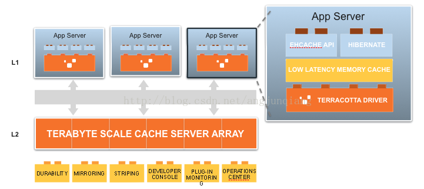
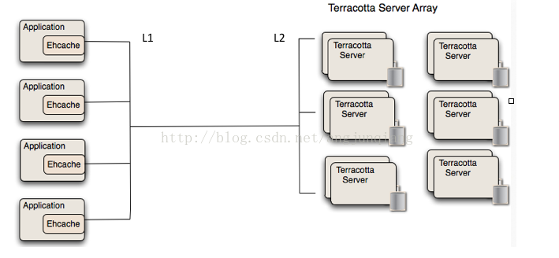

## 一、EhCache 特性

1、快速轻量
过去几年，诸多测试表明 Ehcache 是最快的 Java 缓存之一。
Ehcache 的线程机制是为大型高并发系统设计的。
大量性能测试用例保证 Ehcache 在不同版本间性能表现得一致性。
很多用户都不知道他们正在用 Ehcache，因为不需要什么特别的配置。
API 易于使用，这就很容易部署上线和运行。
很小的 jar 包，Ehcache 2.2.3 才 668kb。
最小的依赖：唯一的依赖就是 SLF4J 了。

2、伸缩性
缓存在内存和磁盘存储可以伸缩到数 G，Ehcache 为大数据存储做过优化。
大内存的情况下，所有进程可以支持数百 G 的吞吐。
为高并发和大型多 CPU 服务器做优化。
线程安全和性能总是一对矛盾，Ehcache 的线程机制设计采用了 Doug Lea 的想法来获得较高的性能。
单台虚拟机上支持多缓存管理器。
通过 Terracotta 服务器矩阵，可以伸缩到数百个节点。

3、灵活性
Ehcache 1.2 具备对象 API 接口和可序列化 API 接口。
不能序列化的对象可以使用除磁盘存储外 Ehcache 的所有功能。
除了元素的返回方法以外，API 都是统一的。只有这两个方法不一致：getObjectValue 和 getKeyValue。这就使得缓存对象、序列化对象来获取新的特性这个过程很简单。
支持基于 Cache 和基于 Element 的过期策略，每个 Cache 的存活时间都是可以设置和控制的。
提供了 LRU、LFU 和 FIFO 缓存淘汰算法，Ehcache 1.2 引入了最少使用和先进先出缓存淘汰算法，构成了完整的缓存淘汰算法。
提供内存和磁盘存储，Ehcache 和大多数缓存解决方案一样，提供高性能的内存和磁盘存储。
动态、运行时缓存配置，存活时间、空闲时间、内存和磁盘存放缓存的最大数目都是可以在运行时修改的。

4、标准支持
Ehcache 提供了对 JSR107 JCACHE API 最完整的实现。因为 JCACHE 在发布以前，Ehcache 的实现（如 net.sf.jsr107cache）已经发布了。
实现 JCACHE API 有利于到未来其他缓存解决方案的可移植性。
Ehcache 的维护者 Greg Luck，正是 JSR107 的专家委员会委员。

5、可扩展性
监听器可以插件化。Ehcache 1.2 提供了 CacheManagerEventListener 和 CacheEventListener 接口，实现可以插件化，并且可以在 ehcache.xml 里配置。
节点发现，冗余器和监听器都可以插件化。
分布式缓存，从 Ehcache 1.2 开始引入，包含了一些权衡的选项。Ehcache 的团队相信没有什么是万能的配置。
实现者可以使用内建的机制或者完全自己实现，因为有完整的插件开发指南。
缓存的可扩展性可以插件化。创建你自己的缓存扩展，它可以持有一个缓存的引用，并且绑定在缓存的生命周期内。
缓存加载器可以插件化。创建你自己的缓存加载器，可以使用一些异步方法来加载数据到缓存里面。
缓存异常处理器可以插件化。创建一个异常处理器，在异常发生的时候，可以执行某些特定操作。

6、应用持久化
在 VM 重启后，持久化到磁盘的存储可以复原数据。
Ehcache 是第一个引入缓存数据持久化存储的开源 Java 缓存框架。缓存的数据可以在机器重启后从磁盘上重新获得。
根据需要将缓存刷到磁盘。将缓存条目刷到磁盘的操作可以通过 cache.flush()方法来执行，这大大方便了 Ehcache 的使用。

7、监听器
缓存管理器监听器。允许注册实现了 CacheManagerEventListener 接口的监听器：
`notifyCacheAdded()`
`notifyCacheRemoved()`
缓存事件监听器。允许注册实现了 CacheEventListener 接口的监听器，它提供了许多对缓存事件发生后的处理机制：
notifyElementRemoved/Put/Updated/Expired

8、开启 JMX
Ehcache 的 JMX 功能是默认开启的，你可以监控和管理如下的 MBean：
CacheManager、Cache、CacheConfiguration、CacheStatistics

9、分布式缓存
从 Ehcache 1.2 开始，支持高性能的分布式缓存，兼具灵活性和扩展性。
分布式缓存的选项包括：
通过 Terracotta 的缓存集群：设定和使用 Terracotta 模式的 Ehcache 缓存。缓存发现是自动完成的，并且有很多选项可以用来调试缓存行为和性能。
使用 RMI、JGroups 或者 JMS 来冗余缓存数据：节点可以通过多播或发现者手动配置。状态更新可以通过 RMI 连接来异步或者同步完成。
Custom：一个综合的插件机制，支持发现和复制的能力。
可用的缓存复制选项。支持的通过 RMI、JGroups 或 JMS 进行的异步或同步的缓存复制。
可靠的分发：使用 TCP 的内建分发机制。
节点发现：节点可以手动配置或者使用多播自动发现，并且可以自动添加和移除节点。对于多播阻塞的情况下，手动配置可以很好地控制。
分布式缓存可以任意时间加入或者离开集群。缓存可以配置在初始化的时候执行引导程序员。
BootstrapCacheLoaderFactory 抽象工厂，实现了 BootstrapCacheLoader 接口（RMI 实现）。
缓存服务端。Ehcache 提供了一个 Cache Server，一个 war 包，为绝大多数 web 容器或者是独立的服务器提供支持。
缓存服务端有两组 API：面向资源的 RESTful，还有就是 SOAP。客户端没有实现语言的限制。
RESTful 缓存服务器：Ehcached 的实现严格遵循 RESTful 面向资源的架构风格。
SOAP 缓存服务端：Ehcache RESTFul Web Services API 暴露了单例的 CacheManager，他能在 ehcache.xml 或者 IoC 容器里面配置。
标准服务端包含了内嵌的 Glassfish web 容器。它被打成了 war 包，可以任意部署到支持 Servlet 2.5 的 web 容器内。Glassfish V2/3、Tomcat 6 和 Jetty 6 都已经经过了测试。

10、搜索
标准分布式搜索使用了流式查询接口的方式，请参阅文档。

11、Java EE 和应用缓存
为普通缓存场景和模式提供高质量的实现。
阻塞缓存：它的机制避免了复制进程并发操作的问题。
SelfPopulatingCache 在缓存一些开销昂贵操作时显得特别有用，它是一种针对读优化的缓存。它不需要调用者知道缓存元素怎样被返回，也支持在不阻塞读的情况下刷新缓存条目。
CachingFilter：一个抽象、可扩展的 cache filter。
SimplePageCachingFilter：用于缓存基于 request URI 和 Query String 的页面。它可以根据 HTTP request header 的值来选择采用或者不采用 gzip 压缩方式将页面发到浏览器端。你可以用它来缓存整个 Servlet 页面，无论你采用的是 JSP、velocity，或者其他的页面渲染技术。
SimplePageFragmentCachingFilter：缓存页面片段，基于 request URI 和 Query String。在 JSP 中使用 jsp:include 标签包含。
已经使用 Orion 和 Tomcat 测试过，兼容 Servlet 2.3、Servlet 2.4 规范。
Cacheable 命令：这是一种老的命令行模式，支持异步行为、容错。
兼容 Hibernate，兼容 Google App Engine。
基于 JTA 的事务支持，支持事务资源管理，二阶段提交和回滚，以及本地事务。

12、开源协议
Apache 2.0 license

### **Ehcache 的加载模块列表**

- ehcache-core：API，标准缓存引擎，RMI 复制和 Hibernate 支持
- ehcache：分布式 Ehcache，包括 Ehcache 的核心和 Terracotta 的库
- ehcache-monitor：企业级监控和管理
- ehcache-web：为 Java Servlet Container 提供缓存、gzip 压缩支持的 filters
- ehcache-jcache：JSR107 JCACHE 的实现
- ehcache-jgroupsreplication：使用 JGroup 的复制
- ehcache-jmsreplication：使用 JMS 的复制
- ehcache-openjpa：OpenJPA 插件
- ehcache-server：war 内部署或者单独部署的 RESTful cache server
- ehcache-unlockedreadsview：允许 Terracotta cache 的无锁读
- ehcache-debugger：记录 RMI 分布式调用事件
- Ehcache for Ruby：Jruby and Rails 支持

Ehcache 的结构设计概览：


### **核心定义**

`cache manager`：缓存管理器，以前是只允许单例的，不过现在也可以多实例了

`cache`：缓存管理器内可以放置若干 cache，存放数据的实质，所有 cache 都实现了 Ehcache 接口

`element`：单条缓存数据的组成单位

`system of record（SOR）`：可以取到真实数据的组件，可以是真正的业务逻辑、外部接口调用、存放真实数据的数据库等等，缓存就是从 SOR 中读取或者写入到 SOR 中去的。

代码示例：

```java
<span style="font-size:14px;">
    CacheManager manager = CacheManager.newInstance("src/config/ehcache.xml");


    manager.addCache("testCache");


    Cache test = singletonManager.getCache("testCache");


    test.put(new Element("key1", "value1"));


    manager.shutdow</span><span style="font-size:14px; font-family: Arial, Helvetica, sans-serif;">n();  </span>
```

当然，也支持这种类似 DSL 的配置方式，配置都是可以在运行时动态修改的：

```java
    Cache testCache = new Cache(


      new CacheConfiguration("testCache", maxElements)


        .memoryStoreEvictionPolicy(MemoryStoreEvictionPolicy.LFU)


        .overflowToDisk(true)


        .eternal(false)


        .timeToLiveSeconds(60)


        .timeToIdleSeconds(30)


        .diskPersistent(false)


        .diskExpiryThreadIntervalSeconds(0));
```

事务的例子：

```java
    Ehcache cache = cacheManager.getEhcache("xaCache");


    transactionManager.begin();


    try {


        Element e = cache.get(key);


        Object result = complexService.doStuff(element.getValue());


        cache.put(new Element(key, result));


        complexService.doMoreStuff(result);


        transactionManager.commit();


    } catch (Exception e) {


        transactionManager.rollback();


    }
```

### 一致性模型

说到一致性，数据库的一致性是怎样的？不妨先来回顾一下数据库的几个隔离级别：

`未提交读（Read Uncommitted）`：在读数据时不会检查或使用任何锁。因此，在这种隔离级别中可能读取到没有提交的数据。会出现脏读、不可重复读、幻象读。
`已提交读（Read Committed）`：只读取提交的数据并等待其他事务释放排他锁。读数据的共享锁在读操作完成后立即释放。已提交读是数据库的默认隔离级别。会出现不可重复读、幻象读。
`可重复读（Repeatable Read）`：像已提交读级别那样读数据，但会保持共享锁直到事务结束。会出现幻象读。
`可序列化（Serializable）`：工作方式类似于可重复读。但它不仅会锁定受影响的数据，还会锁定这个范围，这就阻止了新数据插入查询所涉及的范围。

基于以上，再来对比思考下面的一致性模型：

1、`强一致性模型`：系统中的某个数据被成功更新(事务成功返回)后，后续任何对该数据的读取操作都得到更新后的值。这是传统关系数据库提供的一致性模型，也是关系数据库深受人们喜爱的原因之一。强一致性模型下的性能消耗通常是最大的。

2、`弱一致性模型`：系统中的某个数据被更新后，后续对该数据的读取操作得到的不一定是更新后的值，这种情况下通常有个“不一致性时间窗口”存在：即数据更新完成后在经过这个时间窗口，后续读取操作就能够得到更新后的值。

3、`最终一致性模型`：属于弱一致性的一种，即某个数据被更新后，如果该数据后续没有被再次更新，那么最终所有的读取操作都会返回更新后的值。

最终一致性模型包含如下几个必要属性，都比较好理解：

- 读写一致：某线程 A，更新某条数据以后，后续的访问全部都能取得更新后的数据。
- 会话内一致：它本质上和上面那一条是一致的，某用户更改了数据，只要会话还存在，后续他取得的所有数据都必须是更改后的数据。
- 单调读一致：如果一个进程可以看到当前的值，那么后续的访问不能返回之前的值。
- 单调写一致：对同一进程内的写行为必须是保序的，否则，写完毕的结果就是不可预期的了。

4、Bulk Load：这种模型是基于批量加载数据到缓存里面的场景而优化的，没有引入锁和常规的淘汰算法这些降低性能的东西，它和最终一致性模型很像，但是有批量、高速写和弱一致性保证的机制。

这样几个 API 也会影响到一致性的结果：

1、`显式锁（[Explicit Locking](http://terracotta.org/documentation/enterprise-ehcache/api-guide#31478)）`：如果我们本身就配置为强一致性，那么自然所有的缓存操作都具备事务性质。而如果我们配置成最终一致性时，再在外部使用显式锁 API，也可以达到事务的效果。当然这样的锁可以控制得更细粒度，但是依然可能存在竞争和线程阻塞。

2、`无锁可读取视图（UnlockedReadsView）`：一个允许脏读的 decorator，它只能用在强一致性的配置下，它通过申请一个特殊的写锁来比完全的强一致性配置提升性能。

举例如下，xml 配置为强一致性模型：

```java
    <cache name="myCache"


         maxElementsInMemory="500"


         eternal="false"


         overflowToDisk="false"


       <terracotta clustered="true" consistency="strong" />


    </cache>
```

但是使用 UnlockedReadsView：

```java
Cache cache = cacheManager.getEhcache("myCache");


UnlockedReadsView unlockedReadsView = new UnlockedReadsView(cache, "myUnlockedCache");
```

3、`原子方法（Atomic methods）`：方法执行是原子化的，即`CAS操作（Compare and Swap）`。CAS 最终也实现了强一致性的效果，但不同的是，它是采用乐观锁而不是悲观锁来实现的。在乐观锁机制下，更新的操作可能不成功，因为在这过程中可能会有其他线程对同一条数据进行变更，那么在失败后需要重新执行更新操作。现代的 CPU 都支持 CAS 原语了。

```java
    cache.putIfAbsent(Element element);


    cache.replace(Element oldOne, Element newOne);


    cache.remove(Element);
```

### **缓存拓扑类型**

1、`独立缓存（Standalone Ehcache）`：这样的缓存应用节点都是独立的，互相不通信。

2、`分布式缓存（Distributed Ehcache）`：数据存储在 Terracotta 的服务器阵列（Terracotta Server Array，TSA）中，但是最近使用的数据，可以存储在各个应用节点中。

逻辑视角：



L1 缓存就在各个应用节点上，而 L2 缓存则放在 Cache Server 阵列中。

组网视角：



模型存储视角：


L1 级缓存是没有持久化存储的。另外，从缓存数据量上看，server 端远大于应用节点。

3、`复制式缓存（Replicated Ehcache）`：缓存数据时同时存放在多个应用节点的，数据复制和失效的事件以同步或者异步的形式在各个集群节点间传播。上述事件到来时，会阻塞写线程的操作。在这种模式下，只有弱一致性模型。

它有如下几种事件传播机制：RMI、JGroups、JMS 和 Cache Server。

RMI 模式下，所有节点全部对等：


JGroup 模式：可以配置单播或者多播，协议栈和配置都非常灵活。

```html
<cacheManagerPeerProviderFactory
  class="net.sf.ehcache.distribution.jgroups.JGroupsCacheManagerPeerProviderFactory"
  properties="connect=UDP(mcast_addr=231.12.21.132;mcast_port=45566;):PING:  


    MERGE2:FD_SOCK:VERIFY_SUSPECT:pbcast.NAKACK:UNICAST:pbcast.STABLE:FRAG:pbcast.GMS"
  propertySeparator="::"
/>
```

JMS 模式：这种模式的核心就是一个消息队列，每个应用节点都订阅预先定义好的主题，同时，节点有元素更新时，也会发布更新元素到主题中去。JMS 规范实现者上，Open MQ 和 Active MQ 这两个，Ehcache 的兼容性都已经测试过。


Cache Server 模式：这种模式下存在主从节点，通信可以通过 RESTful 的 API 或者 SOAP。


无论上面哪个模式，更新事件又可以分为 updateViaCopy 或 updateViaInvalidate，后者只是发送一个过期消息，效率要高得多。

复制式缓存容易出现数据不一致的问题，如果这成为一个问题，可以考虑使用数据同步分发的机制。

即便不采用分布式缓存和复制式缓存，依然会出现一些不好的行为，比如：

缓存漂移（Cache Drift）：每个应用节点只管理自己的缓存，在更新某个节点的时候，不会影响到其他的节点，这样数据之间可能就不同步了。这在 web 会话数据缓存中情况尤甚。

数据库瓶颈（Database Bottlenecks ）：对于单实例的应用来说，缓存可以保护数据库的读风暴；但是，在集群的环境下，每一个应用节点都要定期保持数据最新，节点越多，要维持这样的情况对数据库的开销也越大。

### **存储方式**

1、`堆内存储`：速度快，但是容量有限。

2、`堆外（OffHeapStore）存储`：被称为 BigMemory，只在企业版本的 Ehcache 中提供，原理是利用 nio 的 DirectByteBuffers 实现，比存储到磁盘上快，而且完全不受 GC 的影响，可以保证响应时间的稳定性；但是 direct buffer 的在分配上的开销要比 heap buffer 大，而且要求必须以字节数组方式存储，因此对象必须在存储过程中进行序列化，读取则进行反序列化操作，它的速度大约比堆内存储慢一个数量级。（注：direct buffer 不受 GC 影响，但是 direct buffer 归属的的 JAVA 对象是在堆上且能够被 GC 回收的，一旦它被回收，JVM 将释放 direct buffer 的堆外空间。）

3、`磁盘存储`。

### **缓存使用模式**

`cache-aside`：直接操作。先询问 cache 某条缓存数据是否存在，存在的话直接从 cache 中返回数据，绕过 SOR；如果不存在，从 SOR 中取得数据，然后再放入 cache 中。

```java
    public V readSomeData(K key)


    {


       Element element;


       if ((element = cache.get(key)) != null) {


           return element.getValue();


       }


       if (value = readDataFromDataStore(key)) != null) {


           cache.put(new Element(key, value));


       }


       return value;


    }
```

`cache-as-sor`：结合了 read-through、write-through 或 write-behind 操作，通过给 SOR 增加了一层代理，对外部应用访问来说，它不用区别数据是从缓存中还是从 SOR 中取得的。

read-through。

write-through。

`write-behind（write-back）`：既将写的过程变为异步的，又进一步延迟写入数据的过程。

Copy Cache 的两个模式：CopyOnRead 和 CopyOnWrite。

`CopyOnRead`指的是在读缓存数据的请求到达时，如果发现数据已经过期，需要重新从源处获取，发起的 copy element 的操作（pull）；

`CopyOnWrite`则是发生在真实数据写入缓存时，发起的更新其他节点的 copy element 的操作（push）。

前者适合在不允许多个线程访问同一个 element 的时候使用，后者则允许你自由控制缓存更新通知的时机。

### **多种配置方式**

包括配置文件、声明式配置、编程式配置，甚至通过指定构造器的参数来完成配置，配置设计的原则包括：

所有配置要放到一起

缓存的配置可以很容易在开发阶段、运行时修改

错误的配置能够在程序启动时发现，在运行时修改出错则需要抛出运行时异常

提供默认配置，几乎所有的配置都是可选的，都有默认值

### **自动资源控制**（Automatic Resource Control，ARC）

它是提供了一种智能途径来控制缓存，调优性能。特性包括：

内存内缓存对象大小的控制，避免 OOM 出现

池化（cache manager 级别）的缓存大小获取，避免单独计算缓存大小的消耗

灵活的独立基于层的大小计算能力，下图中可以看到，不同层的大小都是可以单独控制的

可以统计字节大小、缓存条目数和百分比

优化高命中数据的获取，以提升性能，参见下面对缓存数据在不同层之间的流转的介绍


缓存数据的流转包括了这样几种行为：

Flush：缓存条目向低层次移动。

Fault：从低层拷贝一个对象到高层。在获取缓存的过程中，某一层发现自己的该缓存条目已经失效，就触发了 Fault 行为。

Eviction：把缓存条目除去。

Expiration：失效状态。

Pinning：强制缓存条目保持在某一层。

下面的图反映了数据在各个层之间的流转，也反映了数据的生命周期：


### **监控功能**

监控的拓扑：


每个应用节点部署一个监控探针，通过 TCP 协议与监控服务器联系，最终将数据提供给富文本客户端或者监控操作服务器。

### 简单的使用案例

```java
package com.spring.cache;


import static org.junit.Assert.assertTrue;


import net.sf.ehcache.Cache;


import net.sf.ehcache.CacheManager;


import net.sf.ehcache.Element;


import net.sf.ehcache.pool.Pool;


import org.slf4j.Logger;


public class TestDefaultCache {


	private Logger Log;


	//测试类


	public static void main(String[] args) {


		TestDefaultCache.cacheLocate("C:\\DATA\\cache");


	}


// 使用缓存的基本操作


  public static void testDefault(){


	  //从classes目录中查找encache.xml配置文件


	  CacheManager cacheManager=CacheManager.getInstance();


	  //根据配置文件获Cache实例


	  Cache cache=cacheManager.getCache("test");


	  //清空cache中的所用元素


	  cache.removeAll();


	  //往cache中添加元素,这里的Element相当于HashMap中的键值对Entry<K,V>;


	  cache.put(new Element("s1","1111"));


	  cache.put(new Element("s2","2222"));


	  System.out.println("calculateOnDiskSize: "+cache.calculateOnDiskSize());


	  System.out.println("MemoryStoreSize: "+cache.getMemoryStoreSize());


	  assertTrue(cache.getMemoryStoreSize() + cache.calculateOnDiskSize() == 2);


	  //System.out.println("MemoryStoreSize: "+cache.get);


	  //从cache中取得元素


	  Element e=cache.get("s2");


	  System.out.println(e.getValue());


	  //输出当前cacheManager正在使用的配置对应的Xml格式文本


	   System.out.println(cacheManager.getActiveConfigurationText());


	  //卸载缓存管理器


	  cacheManager.shutdown();


  }


    //将缓存写到本地硬盘上指定的位置。


    public static void cacheLocate(String targetlocate){


       /*系统默认的缓存地址可以在System.getProperty(String key)方法中找到，其中key为java.io.tmpdir


        * 这里我们也可以通过 System.setProperty("java.io.tmpdir", "C:\\DATA\\cache");这个方法去改变我们想缓存的地方


        * */


       System.out.println(System.getProperty("java.io.tmpdir"));


   	   System.setProperty("java.io.tmpdir", targetlocate);//设置缓存的位置


   	   System.out.println(System.getProperty("java.io.tmpdir"));


	   CacheManager cacheManager=new CacheManager();


	   Cache cache=cacheManager.getCache("simpleCache");


	   for(int i=0;i<5;i++){


		   Element element=new Element("key"+i,"myvalue"+i);


		   cache.put(element);


	   }


	   cache.flush();


	   System.out.println("已经成功缓存");


	   //===============================================================================================


	   System.out.println("=============================读取cache=================================");


	   System.out.println("DiskStoreSize:"+cache.getDiskStoreSize());


	   System.out.println("MemoryStoreSize:"+cache.getMemoryStoreSize());


	   String [] strs=cacheManager.getCacheNames();//拿到所有cache名字


	   for (String str : strs) {


		System.out.println(str);


	   }


	   cacheManager.shutdown();


    }


}
```

EhCache.xml 文件

```html
<!-- <ehcache xmlns:xsi="http://www.w3.org/2001/XMLSchema-instance"


   xsi:noNamespaceSchemaLocation="http://ehcache.org/ehcache.xsd"


   maxBytesLocalDisk="20G" maxBytesLocalOffHeap="50M">


<diskStore path="java.id.tmpdir"/>


<defaultCache copyOnRead="true" copyOnWrite="true" overflowToOffHeap="false"></defaultCache>


<cache name="test" maxBytesLocalHeap="10M"/>


<cache name="test2" overflowToOffHeap="false" maxBytesLocalHeap="10M"></cache>


    <cache name="sampleCache" maxElementsInMemory="10000"  maxElementsOnDisk="1000" eternal="false"


        overflowToDisk="true"  diskSpoolBufferSizeMB="20"


        timeToIdleSeconds="300" timeToLiveSeconds="600" memoryStoreEvictionPolicy="FIFO" />


</ehcache> -->  <pre name="code" class="html"> <ehcache xmlns:xsi="http://www.w3.org/2001/XMLSchema-instance"


    xsi:noNamespaceSchemaLocation="../config/ehcache.xsd">


        <diskStore path="java.io.tmpdir"/>


        <Cache name="test" maxElementsInMemory="1000"></Cache>


        <!-- 缓存到本地硬盘上 -->


          <Cache  name="simpleCache"


                maxElementsInMemory="2"


                eternal="false"


                timeToIdleSeconds="600"


                timeToLiveSeconds="300"


                overflowToDisk="true"


                maxElementsOnDisk="3"


                diskPersistent="true"


                diskExpiryThreadIntervalSeconds="120"


                memoryStoreEvictionPolicy="FIFO"


                />


         <!--


        <Cache  name="simpleCache"      缓存的名字


                maxElementsInMemory="10000"  内存中最大的对象数


                eternal="false"   对象是否永久存活


                timeToIdleSeconds="120"  最大的空闲时间


                timeToLiveSeconds="120"  最长的活跃时间


                overflowToDisk="true"  当大小超过memory的大小时，可以缓存到本地硬盘


                maxElementsOnDisk="10000000"  硬盘上最大的对象数


                diskPersistent="false"      是否在硬盘上持久化保存


                diskExpiryThreadIntervalSeconds="120"


                memoryStoreEvictionPolicy="LRU"  内存清除对象的方式


                /> -->


    </ehcache>
```
