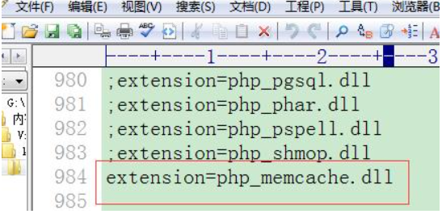

## 一、优化

什么是优化：以更小的资源支持更大负载网站的运行，以小博大。

思路：尽量减少用户等待时间，节省系统资源开销，节省带宽使用。

优化什么地方？有三方面：**Memcache 内存缓存技术、静态化技术、mysql 优化**

## 二．Memcache

内存缓存技术：memcache 是实现 php 语言 对内存 进行操作的中间介质。

## memcache 与 redis 的区别和联系

redis:支持比较多的数据类型(String/list/set/sortset/hash)，redis 支持集合计算的(set 类型支持)，每个 key 最大数据存储量为 1G，redis 是新兴的内存缓存技术，对各方面支持不完善，支持持久化操作。

memcache：老牌的内存缓存技术，对相关领域支持比较丰富，window 和 linux 都可以使用，各种框架(tp/yii 等等)都支持使用，session 的信息可以非常方便的保存到该 memcache 中，每个 key 保存的数据量最大为 1M，支持的数据类型比较单一，就是 String 类型，不支持持久化。

**两者的相同之处在于把数据保存在内存中。**

**注意：以上的区别必须要知道哦，在进行选择第三方优化的时候，就可以根据实际情况来定了！**

## 安装 memcache

1， **复制服务器端文件到运行目录**

复制 memcached.exe 文件到运行目录(如：H:/memcached.exe)：

启动 memcache 服务

前台方式 memcache 启动服务

默认是前台启动，Ctrl+C 可以结束该前台进程。

此时，进程里边已经有 memcache 服务：

memcache 相关参数设置：

通过具体参数设置启动 memcache 的格式：

给 memcache 设置开机启动项服务

设置开机启动项服务：

生成开机启动项服务：

通过命名方式启动服务：

## php 中安装 memcache 扩展

复制如图文件到 php 扩展目录：

修改 php.ini，使其开启 memcache 扩展：

之后重启 apache 即可。php 开启 memcache 扩展成功

php 对 memcache 的使用

memcache 在 php 中就是一个操作类，具体使用：实例化对象、对象调用成员的过程。

php 中连接 memcache 服务器：

php 中 memcache 的使用，其数据模型与 redis 一致，为 key - value。

在 php 中给 memcache 设置一个 key，名称为“weather”

对 weather 的 key 再进行查询操作：

key 的名字：该 key 的名字的组成部分与 redis 比较相似，基本键盘可以输入的信息都可以作为 key 的名字部分，key 的长度最大是 250 字节。

有效期事宜：\$me -> set(key, value, 是否压缩, 有效期 秒);

有效期设置有两种方式：

A. 时间差设置：从当前的时间点项后顺延指定秒的时间就到期(过期)

\$me -> set(key, value, 是否压缩, 120); //向后 120 秒到期，该方式有限制：最多的时间差就是 30 天(2592000 秒)

B. 时间戳设置：从 1970-1-1 0:0:0 到现在经过的秒数，\$me -> set(key, value, 是否压缩, time()+120); //向后 120 秒到期

时间差方式的有效期最大为 30 天：

(如果需要设置 key 的有效期时间大于 30 天的，就必须使用“时间戳”方式设置)

各种数据类型的存储：php 的数据类型：标量类型：int string boolean float 复合类型：array object resource null

memcache 存储标量类型数据，把他们都转化为”String 字符串”类型存储。

存储复合类型数据，直接“原型”存储。

标量类型的存储：

标量类型信息在 memcache 中都变为“String 字符串”类型信息

复合类型信息存储：在 memcache 中直接是“原型”存储。

原型存储对资源的消耗比较大，为了节省资源，可以把复合类型信息都变为字符串形式进行存储，这样就需要对复合信息进行 序列化 操作： serialize() unserialize()

## 压缩选项

\$me -> set(key, value, 是否压缩 0/1, 有效期 秒);

是否压缩的特点：压缩：内存空间节省、运行速度稍慢。未压缩：内存空间占据少多、运行速度快。

压缩原理是 zlib 技术：

zlib---->php----->memcache

其他相关操作方法可以参考对应的文档，这里就不加以赘述了！直接进入重点

## 总结

\1. memcache 安装和开启服务使用：开启服务：① 前台开启 ② 设置开机启动项服务

\2. 给 php 开放 memcache 扩展：① 复制扩展文件 php_memcache.dll、② php.ini 打开扩展参数

\3. php 里边操作 memcache：① 实例化对象、② 对象连接服务器、③ 对象调用相关方法实现具体操作

set(key,value,压缩，有效期) ，get() delete() connect()

## 终端操作 memcache

连接 memcache：利用协议 telnet(远程连接协议)，实现对 memcache 的操作。

利用终端操作 memcache

查看 memcache 的状态：

## 分布式部署 memcache

分布式：把原先有一台 memcache 服务器做的工作，现在分摊到多台 memcache 执行。这样会降低 memcache 的工作负载。

例如：一台 memcache 需要存储 100w 的 key，如果有 5 个服务器，则每个服务器存储 20w 的可以。

该分布式与 redis 的主从模式比较相似，但是他们不一样

**redis:其为主从模式，一个 redis 负责数据写入，其他多个 redis 负责数据读取**。

**memcache:其不是主从模式，该分布式是平均分摊工作，每个子服务器之间都是平级的，每个服务器都要执行数据的写入、读取操作**。

下图为 memcache 中分布式的示意图：

从图中可以看到，memcache 本身有算法，可以保证数据“平均”地存储在不同的服务器里边，php 语言和各个服务器之间也通过该算法衔接，进一步讲，php 内部的实现与之前的代码风格保持一致即可。

memcache 分布式具体实现类型：

① 在一个服务器里边，开启多个 memcache 服务

② 买多个服务器，每个服务器里边安装一个 memcache 服务

使用分布式：开启多个 memcache 服务：

注意：memcache 集群使用的时候，key 的设置和获取，他们的服务器顺序必须严格一致，否则数据的使用有错误。

数据读取失败：

## 缓存失效

超过有效期：具体是通过“懒惰”机制删除该过期数据，与过期 session 的删除类似。

过期 session 删除机制：session 是以文件形式保存的硬盘中，如果有的 session 文件已经过期了，则该 session 文件不会立即被删除，而是后期其他用户访问网站使用 session 的同时会有一定的几率触发删除过期的 session 文件。

memcache 的过期数据删除也是懒惰机制实现，如果有一个 key 过期了，其本身不会马上被删除，而是我们调用 get 方法获取数据的同时会删除该过期的数据。

缓存空间耗尽

如果存储的数据超过 memcache 最大的存储限制(默认是 64M)，此时还继续存入数据，则会把最近不常使用的 key 就删除了。该机制名称为 LRU(least recently use)优先删除最近很好使用的 key。

该 LRU 机制可以根据实际情况禁用，如果继续使用满载的 memcache 则系统要报错。

(开启服务的同时可以设置-M 参数，禁用 LRU 机制)

## session 存入 memcache

session 可以存入 mysql 数据库中。

需求：一个大型的网站开发完毕，内部涉及的服务器一般是有多个组成的，多台服务器彼此之间需要共享 session 信息，这样就要求 session 势必要存入 mysql 或 memcache 中。

**session 的信息以文件形式存储在服务器内部，不能实现多个服务器共享，只有存入的 mysql 或 memcache 中才可以实现数据共享。**

mysql 或 memcache 可以实现多个服务器彼此之间共享 session 信息。

具体使用：php.ini 里边有 session 存储的方式和保存位置设置参数：

session 信息存储到 memcache 的 key 的名称为 session_id():

在终端里边把 session 信息给获得出来：

分布式集群设置：

### memcache 案例

网站有一个页面，内部需要获得许多数据信息，该数据信息在短时间内不发生变化，为了降低 mysql 的负载，就把这些数据获得出来存入到 memacache 中过去，供后续访问。

第一次使用，缓存没有数据，就从 mysql 数据库获得数据，提供给用户，同时把数据存储给缓存供后续使用

第二次(后续)使用，缓存有数据，就直接提供使用即可。

### 最后再谈与 redis 的区别

redis 分布式：主从模式

memcache 分布式：把 key 平均分配到各个服务器，addServer(主机名，端口);

注意：key 的设置和读取的多个 memcache 的加载顺序要保持一致

分布式类型：① 一台服务器多个服务、② 多台服务器多个服务

redis: 可以存储稍微复杂的数据(list、set、sortset、hash)用于集合计算

memcache: 支持领域比较多(win 系统和 linux 系统都可以使用、各种框架支持使用、允许把 session 信息存入 memcache 中)一般存储的信息比较简单，例如字符串型信息，就可以使用 memcache
