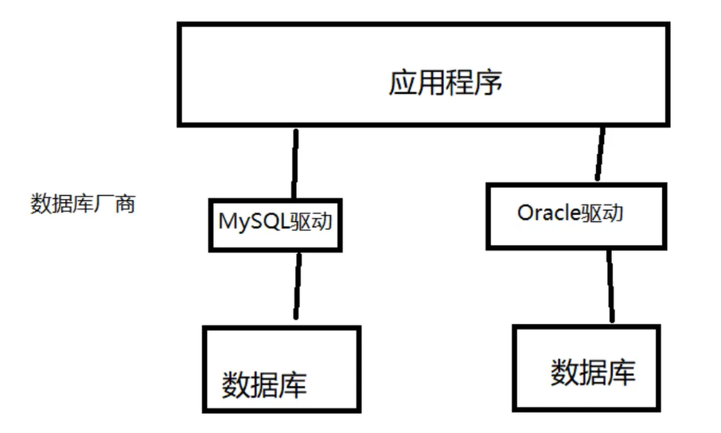
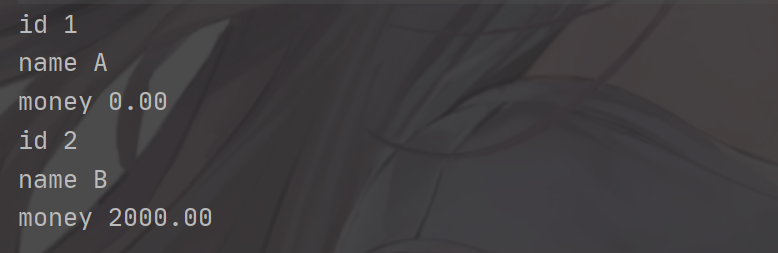

## 一、数据库驱动



## 二、JDBC

简介

SUN 公司为了简化开发人员(对数据库的统一使用)，提供一个（java 操作数据库的规范）,俗称(JDBC) Java Database Connectivity

JDBC API 允许用户访问任何形式的表格数据，尤其是存储在关系数据库中的数据。

执行流程：

- 连接数据源，如：数据库。
- 为数据库传递查询和更新指令。
- 处理数据库响应并返回的结果。

### JDBC 架构

分为双层架构和三层架构。

#### 双层


作用：此架构中，Java Applet 或应用直接访问数据源。

条件：要求 Driver 能与访问的数据库交互。

机制：用户命令传给数据库或其他数据源，随之结果被返回。

部署：数据源可以在另一台机器上，用户通过网络连接，称为 C/S 配置（可以是内联网或互联网）。

#### 三层


侧架构特殊之处在于，引入中间层服务。

流程：命令和结构都会经过该层。

吸引：可以增加企业数据的访问控制，以及多种类型的更新；另外，也可简化应用的部署，并在多数情况下有性能优势。

历史趋势： 以往，因性能问题，中间层都用 C 或 C++ 编写，随着优化编译器（将 Java 字节码 转为 高效的 特定机器码）和技术的发展，如 EJB，Java 开始用于中间层的开发这也让 Java 的优势突显出现出来，使用 Java 作为服务器代码语言，JDBC 随之被重视。

> JDBC 测试

```java
package JDBC;

import java.sql.*;

public class JDBCFirstDemo {

    public static void main(String[] args) throws ClassNotFoundException, SQLException {
        //加载驱动
        Class.forName("com.mysql.cj.jdbc.Driver");
        //固定写法，加载驱动

        //用户信息和url
        //useUnicode=true&&characterEncoding=utf-8&&useSSL=true
        String url = "jdbc:mysql://localhost:3306/shop?useUnicode=true&&characterEncoding=utf-8&&useSSL=true";
        String username = "root";
        String password = "123456";

        //连接成功，数据库对象
        Connection connection = DriverManager.getConnection(url, username, password);

        //执行SQl的对象Statement执行sql对象
        Statement statement = connection.createStatement();

        //执行SQl的对象去执行SQL
        String sql = "SELECT * from account";

        ResultSet resultSet = statement.executeQuery(sql);
// 返回的结果，全部集中封装了我们全部的查询出来的结果

        while (resultSet.next())
        {
            System.out.println("id "+resultSet.getObject("id"));
            System.out.println("name "+resultSet.getObject("name"));
            System.out.println("money "+resultSet.getObject("money"));
        }
        //释放连接
        resultSet.close();
        statement.close();
        connection.close();
    }
}
```

执行结果:



步骤总结：

1. 加载驱动

```java
Class.forName("com.mysql.cj.jdbc.Driver");
```

2. 连接数据库 DriverManage

```java
 /*useUnicode=true&&characterEncoding=utf-8&&useSSL=true
 useUnicode=true 支持中文名称
 characterEncoding=utf-8 字符集 utf-8
 useSSL=true 使用安全连接
 */
String url = "jdbc:mysql://localhost:3306/jdbcstudy?useUnicode=true&&characterEncoding=utf-8&&useSSL=true";
//mysql-- 3306
// jdbc:mysql://主机地址：端口号/数据库？参数1&参数2&参数3
//oracle-- 1521
// jdbc:orcle:thin:@localhost:1521:thin
        String username = "root";
        String password = "123456";
```

3. 获得执行 SQL 的对象 Statement

```java
//执行SQl的对象Statement执行sql对象
        Statement statement = connection.createStatement();

        //执行SQl的对象去执行SQL
        String sql = "SELECT * from account";

        ResultSet resultSet = statement.executeQuery(sql);
// 返回的结果，全部集中封装了我们全部的查询出来的结果
```

4. 获得返回的结果集
5. 释放连接

> Statement 执行 SQL 的对象， PrepareStatement 执行 SQL 的对象

```java
// 编写SQL
string sql="select * from users"

//查询操作返回ResultSet
statement.executeQuery();
//执行任何SQl
statement.execute();
//更新、插入、删除、都是用这个、返回一个受影响的函数
statement.executeUpdate();
```

> ResultSet 查询的结果集：封装了所有的查询结果

获得指定的数据类型

```java
//在不知道列类型的情况下使用
resultSet.getObject();
//如果知道类的类型就是用指定的类型
resultSet.getString();
resultSet.getInt();
resultSet.getFloat();
resultSet.getDate();
```
