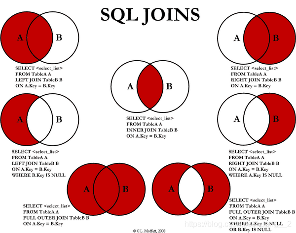
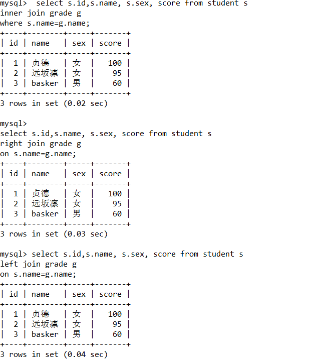

## 数据库相关

MySQL 启动后

连接数据库：

```sql
mysql （-h 主机号 -p 端口号） -u 用户名 -p 密码  # 如果是本机端口是3306括号内可以省略
```

查看数据库：

```sql
show databases;
```

使用数据库：

```sql
use databases;
```

查看数据库中所有表：

```sql
show tables;　
```

创建数据库：(create database + 数据库名)

```sql
create database test_db_name
```

删除数据库：(drop database + 数据库名)

```sql
drop database dbname;
```

## 用户相关

### 创建用户

```sql
# 创建名为 ‘monkey’ 密码为’password’ 登陆IP只能为：192.168.2.2 的用户
create user 'monkey’@'192.168.2.2’ identified by 'password’;

# 创建名为 ‘monkey’ 密码为’password’ 登陆IP为：192.168.2 网段的用户

create user 'monkey’@'192.168.2.%' identified by 'password’;

 # 创建名为 ‘monkey’ 密码为’password’ 登陆IP不限的用户

create user 'monkey’@'%' identified by 'password’;

 -- 修改密码(当前用户)
 set password =password('123456');

 -- 修改密码(指定用户)
 set password for monkey=password('123456');

 -- 重命名 rename user oldusername to newusername
rename user monkey to monkey1

```

### 对用户进行授权

```sql
# 对 monkey 用户 开放数据库：test_db_name 下表：table1 的查 插 更新的权限
grant select,insert,update  on test_db_name.table1 to 'monkey’@'%';

 # 对 monkey 用户 开放数据库：test_db_name 下表：table1 的所有权限
grant all privileges  on test_db_name.table1 to 'monkey’@'%';

-- 用户授权 all privileges 全部的权限， 库，表

-- ALL privileges 除了给别人授权,其他功能都能使用
grant all privileges on *.* monkey1

-- 查询权限

-- 查看指定用户的权限
show grant for monkey1


show grant for root@localhost


 # 取消权限
revoke all privileges  on test_db_name.table1 from 'monkey’@'%';

revoke all privileges on *.* from monkey1;

-- 删除用户
drop user monkey1
```

### 关于用户

在 mysql 数据库下的 user 表，这张表存放着用户的信息

```sql
use mysql;
select user,Host from user;
```


**对用户的操作也可以修改这张表，但是不建议这样做！**

## 数据表相关

### 数据的字段类型

**数值型**：

| **类型**       | **大小** | **范围（有符号）**                                                                                                                  | **范围（无符号）**                                                | **用途**        |
| -------------- | -------- | ----------------------------------------------------------------------------------------------------------------------------------- | ----------------------------------------------------------------- | --------------- |
| TINYINT        | 1 字节   | (-128，127)                                                                                                                         | (0，255)                                                          | 小整数值        |
| SMALLINT       | 2 字节   | (-32 768，32 767)                                                                                                                   | (0，65 535)                                                       | 大整数值        |
| MEDIUMINT      | 3 字节   | (-8 388 608，8 388 607)                                                                                                             | (0，16 777 215)                                                   | 大整数值        |
| INT 或 INTEGER | 4 字节   | (-2 147 483 648，2 147 483 647)                                                                                                     | (0，4 294 967 295)                                                | 大整数值        |
| BIGINT         | 8 字节   | (-9 233 372 036 854 775 808，9 223 372 036 854 775 807)                                                                             | (0，18 446 744 073 709 551 615)                                   | 极大整数值      |
| FLOAT          | 4 字节   | (-3.402 823 466 E+38，-1.175 494 351 E-38)，0，(1.175 494 351 E-38，3.402 823 466 351 E+38)                                         | 0，(1.175 494 351 E-38，3.402 823 466 E+38)                       | 单精度 浮点数值 |
| DOUBLE         | 8 字节   | (-1.797 693 134 862 315 7 E+308，-2.225 073 858 507 201 4 E-308)，0，(2.225 073 858 507 201 4 E-308，1.797 693 134 862 315 7 E+308) | 0，(2.225 073 858 507 201 4 E-308，1.797 693 134 862 315 7 E+308) | 双精度 浮点数值 |

**字符串类型**

| 类型       | 大小                 | 用途                            |
| ---------- | -------------------- | ------------------------------- |
| CHAR       | 0-255 字节           | 定长字符串                      |
| VARCHAR    | 0-65535 字节         | 变长字符串                      |
| TINYBLOB   | 0-255 字节           | 不超过 255 个字符的二进制字符串 |
| TINYTEXT   | 0-255 字节           | 短文本字符串                    |
| BLOB       | 0-65 535 字节        | 二进制形式的长文本数据          |
| TEXT       | 0-65 535 字节        | 长文本数据                      |
| MEDIUMBLOB | 0-16 777 215 字节    | 二进制形式的中等长度文本数据    |
| MEDIUMTEXT | 0-16 777 215 字节    | 中等长度文本数据                |
| LONGBLOB   | 0-4 294 967 295 字节 | 二进制形式的极大文本数据        |
| LONGTEXT   | 0-4 294 967 295 字节 | 极大文本数据                    |

**日和期时间类型**

| 类型      | 大小   | 范围                                                                                                                            | 格式                | 用途                     |
| --------- | ------ | ------------------------------------------------------------------------------------------------------------------------------- | ------------------- | ------------------------ |
| DATE      | 3 字节 | 1000-01-01/9999-12-31                                                                                                           | YYYY-MM-DD          | 日期值                   |
| TIME      | 3 字节 | '-838:59:59'/'838:59:59'                                                                                                        | HH:MM:SS            | 时间值或持续时间         |
| YEAR      | 1 字节 | 1901/2155                                                                                                                       | YYYY                | 年份值                   |
| DATETIME  | 8 字节 | 1000-01-01 00:00:00/9999-12-31 23:59:59                                                                                         | YYYY-MM-DD HH:MM:SS | 混合日期和时间值         |
| TIMESTAMP | 4 字节 | 1970-01-01 00:00:00/2038 结束时间是第 2147483647 秒，北京时间 2038-1-19 11:14:07，格林尼治时间 2038 年 1 月 19 日 凌晨 03:14:07 | YYYYMMDD HHMMSS     | 混合日期和时间值，时间戳 |

### 数据表的 CRUD(增删改查)

**创建表：**

语法：`create` `table` +tablename(列名 1 类型 其他,

列名 2 类型 其他　) `engine = innodb default charset=utf-8`

```sql
create table tablename(
                id int auto_increment primary key,
                name varchar(32),
                age int
            )engine=innodb default charset=utf8;
```

其中

engine 指明数据库建表引擎为 innodb （支持事务操作）。

myisam 不支持事务。

default charset=utf-8 指明数据表的编码字符集 为 utf-8。

### 关于数据库引擎

```sql
/*
INNODB 默认使用
MYISAM 早些年使用的
*/
```

|              | INNODB          | MYISAM |
| ------------ | --------------- | ------ |
| 事务支持     | 支持            | 不支持 |
| 数据行锁定   | 支持            | 不支持 |
| 外键约束     | 支持            | 不支持 |
| 全文索引     | 不支持          | 支持   |
| 表空间的大小 | 较大，约为 2 倍 | 较小   |

常规使用操作：

- MYISAM 节约空间，速度较快
- INNOB 安全性高，事物的处理，多表多用户操作

> 在物理空间存在的位置

所有的数据库文件都存在 data 目录下

本质还是文件的存储

MySQL 引擎在物理文件的区别

- innoDB 在数据库表中只有一个\*.frm 文件，以及上级目录下的 ibdata1 文件
- MYISAM 对应文件

1.  \*.frm -表结构的定义文件
2.  \*.MYD 数据文件(data)
3.  \*.MYI 索引文件(index)

> 设置数据库字符编码

```sql
SHARSET=utf8
```

不设置的话，会是 mysql 默认的字符集编码~(不支持中文)

MySQL 的默认编码 Latin1，不支持中文

在 my.ini 中配置默认的编码

```ini
character-set-server=utf8
```

#### DML 语言(data manipulation language)

DML 是数据操作语言。DML 组成

- insert
- update
- delete

**在表中添加数据（三种）**

> insert 命令

语法：`insert into`表名(字段名,字段名) `values`('字符',数字);

```sql
/*
insert into 表名(字段名,字段名) values('字符',数字);
*/
insert into tablename(name,age) values('monkey’,18);

insert into tablename(name,age) values('JIAJIA’,18),('xiaoliu’,18);

                                                     # 可以跟多条记录，一元组的形式添加

insert into tablename(name,age) select name,age from tablename2;

                                                     # 从别的表查找数据 写入
```

**修改表中的数据:**

语法:

> alter 命令

`alter table` 旧表名 `as` 新表名

`alter table` 表名`add`字段名 列属性

```sql
/* 修改表名
alter table 旧表名 rename as 新表名
*/
alter table teacher as teacher1;
/*增加表名的字段
alter table 表名 add 字段名 列属性*/
alter table teacher1 add age int(11);
#修改表的字段
alter table teacher1 age varchar(11); #约束条件
alter table teacher1 age age int (1); #字段重命名
#删除表的字段
alter table teacher1 drop age1;
```

> update 命令

`update` 表名 `set` colnum_name=value, `where` [条件]

```sql

/*
update 表名（条件） set字段名=新值 where[条件]
*/
#修改学员姓名
update `student` set `name`='tea' where id=1;
#不指定条件情况下，会改动所有的表。切记一定要加条件！！！
update `student` set `name`='tea'
#修改多个属性，逗号隔开.
update `student` set `name`='tea' email='123456@qq.com' where id=1
```

注意：

- colnum_name 是数据库的列(字段名),尽量加上``
- ==筛选的条件，如果没有指定，则会修改所有的列==
- value，是一个具体的值，也可以是一个变量
- 多个设置的属性之间，使用英文逗号隔开

**删除表中数据不删除表（三种）：**

> delete 命令

语法:delete from 表名[where 条件 ]

> truncate 命令

作用：完全清空一个数据库表，表的结构和索引约束不会变！

> delete 的 truncate 区别

- 相同点：都能删除数据，都不会删除表的结构
- 不同：

1. truncate 重新设置自增列，计数器会归零
2. truncate 不会影响事物

```sql
# 删除数据，但是自增计数不会被删除 单纯的清掉数据 (避免这样写)
delete from tablename;

# 清空表，相当于新的表 自增计数 清零
truncate table tablename;

delete from tb1 where id > 10    # 跟条件
```

`delect删除问题`,重启数据库,现象

- innoDB 自增列会从 1 开始 (存在内存当中，断电即失)
- MyISAM 继续从上一个自增量开始(存在文件中的，不会丢失)

**删除表:**

```sql
drop table if exist tablename;  # 删除表
```

==所有的创建和删除操作尽量加上判断，以免报错==

#### DQL 语言(data Query language)

DQL 是数据查询语言

- 所有操作都用它 select
- 简单查询， 复杂的查询它都能做
- ==数据库最核心的语言，最重要的语言==
- 使用频率最高的语言

**查看数据**

> select 命令

语法:


- `select` 字段 `from` 表

```sql
# 查看表的所有行列
select * from tablename;

 # 查看name和age 列
select  name,age from tablename;

#别名 给结果起一个别名 as 可以给字段起别名，也可以给表起别名
select `name` as '名字'， `age` as '年龄' from tablename as t;
```

- `select` 表达式 `from` 表名
- `select` 表达式 `as` 别名

==数据库中表达式:文本值,列,NULL,函数,计算表达式,系统变量~~~==

```sql
#函数 concat(a,b)
select concat('姓名',name) as 新名字 from tablename

# 查询表中的age数据 找出年龄段
select * from tablename;
select `name` from tablename;

#发现重复数据，去重
select distinct 'age' from tablename;

#查询系统的版本(函数)
select version()；

#计算结果 (表达式)
select 100*3-1 as '计算结果'

#查询自增的步长(变量)
select @@auto_increment_increment;

#一年后，年龄+1
select `name` `age`+1 as 'one year later' from tablename ;

```

> concat 函数

1. 含义:

   将多个字符串连接成一个字符串。

2. 语法：

   concat(str1, str2,...) 返回结果为连接参数产生的字符串，**如果有任何一个参数为 null，则返回值为 null。**

```sql
  select concat (name, age) as person from tablename;
```

> 去重 distinct

作用:去除 select 查询出来的结果重复的数据,重复数据只显示一条

```sql

#发现重复数据，去重
select distinct 'age' from tablename;
```

#### where 条件子句

作用:检索数据中`符合条件`的值

```sql
#查询20-30岁之间的人
select `name`,`age` from tablename
where age >=20 and(&&) age<=30;

#查询非20岁的人
select `name`,`age` from tablename
where age!=20;

#查询地址为空的人
select `name`,`address` from tablename
where address='' or address IS NULL;

#查询地址不为空的人
select `name`,`address` from tablename
where  address IS NOT NULL;

#查询 21 22 23岁的人
select `name`,`age` from table
where age in(21,22,23);
```

逻辑运算符

| 运算符  | 语法          | 描述                         |
| ------- | ------------- | ---------------------------- |
| and &&  | a and b a&&b  | 逻辑与，两个都为真，结果为真 |
| or \|\| | a or b a\|\|b | 逻辑非，一个为真，结果为真   |
| not !   | not a !a      | 逻辑非， 真为假，假为真      |

MySQL 比较运算符

| 比较运算符        | 说明                                 |
| ----------------- | ------------------------------------ |
| =                 | 等于                                 |
| <                 | 小于                                 |
| <=                | 小于等于                             |
| >                 | 大于                                 |
| >=                | 大于等于                             |
| <=>               | 安全的等于，不会返回 UNKNOWN         |
| <> 或!=           | 不等于                               |
| IS NULL 或 ISNULL | 判断一个值是否为 NULL                |
| IS NOT NULL       | 判断一个值是否不为 NULL              |
| LEAST             | 当有两个或多个参数时，返回最小值     |
| GREATEST          | 当有两个或多个参数时，返回最大值     |
| BETWEEN AND       | 判断一个值是否落在两个值之间         |
| IN                | 判断一个值是 IN 列表中的任意一个值   |
| NOT IN            | 判断一个值不是 IN 列表中的任意一个值 |
| LIKE              | 通配符匹配                           |
| REGEXP            | 正则表达式匹配                       |

#### 联表查询




```sql
/*
思路
1.分析需求，分析查询的字段来自哪些表(连接查询)
2.确定使用哪种连接查询？7种
确定交叉点(这两个表中那个数据是相同)
判断的条件：学生表中的name=成绩表中的name
*/
-- join on 连接查询
--  where  等值查询

-- 查看所有人的成绩和所有信息
 select s.id,s.name, s.sex, score from student s
inner join grade g
where s.name=g.name;

# rightJoin
select s.id,s.name, s.sex, score from student s
right join grade g
on s.name=g.name;

#LeftJoin
select s.id,s.name, s.sex, score from student s
left join grade g
on s.name=g.name;
```

| 操作       | 描述                                         |
| ---------- | -------------------------------------------- |
| inner join | 如果表中至少有一个匹配，就返回行             |
| left join  | 即使右表中没有匹配，也会从左表中返回所有的值 |
| right join | 即使左表中没有匹配，也会从右表中返回所有的值 |

最终效果：

s

自连接

==自己的表和自己的表连接，核心:一张表拆成两张一样的表==

```sql
--  查看student表中数据
select * from student

-- 查看编号、姓名和性别
select b.id,b.name,b.sex
from student a
join student b
 on a.id=b.id and a.name=b.name and a.sex=b.sex  ;
```


子查询

**外键**

外键的创建：定义表的列时预料外键字段，之后 constraint fk_t1_t2 foreign key (friend_id) references tablename1(id)); constaint ... foreign key 预留字段名 references 被关联表名（字段名）

```sql
create table tablename1(id int auto_increment primary key ,
name char(32));

create table tablename2(id int auto_increment primary key ,
name char(32),
friend_id int,
constraint fk_t1_t2 foreign key (friend_id) references tablename1(id));
```

**表的补充**

```sql
desc t;    # 查看t 的表结构

show create table t;    # 查看创建t的创建语句

show create table t \G;    # 横向查看

alter table t10 AUTO_INCREMENT=10000;    # 设置自增的起始值
```

**MySQL 的自增问题**

自增的起始值：

```sql
alter table t10 AUTO_INCREMENT=10000;    # 设置自增的起始值
```

MySQL: 自增步长
基于会话级别：

```sql
show session variables like 'auto_inc%';    查看全局变量
set session auto_increment_increment=2; 设置会话步长
# set session auto_increment_offset=10;
```

基于全局级别：

```sql
show global variables like 'auto_inc%'; 查看全局变量
set global auto_increment_increment=2; 设置会话步长
# set global auto_increment_offset=10;
```

SqlServer：自增步长：

基于表级别：

```sql
CREATE TABLE `table1` (
`id` int(11) NOT NULL AUTO_INCREMENT,
) ENGINE=InnoDB AUTO_INCREMENT=3, 步长=2 DEFAULT CHARSET=utf8
# 自增起始值为 3 步长为 2

CREATE TABLE `table2` (
`id` int(11) NOT NULL AUTO_INCREMENT,
) ENGINE=InnoDB AUTO_INCREMENT=9, 步长=3 DEFAULT CHARSET=utf8
# 自增起始值为 9 步长为 3
```

# 约束与索引

## 三种约束关系

### 一对多约束

外键约束本身就实现了一对多的约束

```sql
create table tablename1(id int auto_increment primary key ,
name char(32));

create table tablename2(id int auto_increment primary key ,
name char(32),
friend_id int,
constraint fk_t1_t2 foreign key (friend_id) references tablename1(id));
```

### 一对一约束

实现一对一约束 外键 加 唯一索引

```sql
create table class(id int auto_increment primary key ,
name char(32));

create table teacher(id int auto_increment primary key ,
name char(32),
class_id int,
unique (class_id),
constraint fk_class_teacher foreign key (class_id) references class(id));
```

### 多对多约束

通过一张关系表和外键约束建立多对多的映射关系

```sql
create table class(id int auto_increment primary key ,
name char(32));

create table student(id int auto_increment primary key ,
name char(32),
class_id int);

create table student_class_relation(id int auto_increment primary key ,
student_id int,
class_id int,
constraint fk_relation_class foreign key (class_id)references class(id),
constraint fk_relation_student foreign key (student_id)references student(id));
```

## 主键外键唯一约束

**所有的索引都有一个共有的作用：加速查找**

### **主键**

---

主键约束即在表中定义一个主键来唯一确定表中每一行数据的标识符。主键可以是表中的某一列或者多列的组合，`其中由多列组合的主键称为复合主键`。主键应该遵守下面的规则：

- 每个表只能定义一个主键。

* 主键值必须唯一标识表中的每一行，且不能为 NULL，即表中不可能存在两行数据有相同的主键值。这是唯一性原则。
* 一个列名只能在复合主键列表中出现一次。
* 复合主键不能包含不必要的多余列。当把复合主键的某一列删除后，如果剩下的列构成的主键仍然满足唯一性原则，那么这个复合主键是不正确的。这是最小化原则。

---

**主键声明的两种方式**：

1、直接在定义字段的时候声明为主键，但是这样只能声明单一字段为主键无法声明 复合主键。

```sql
create table class(id int auto_increment primary key ,
name char(32));
```

2、在字段定义全部结束之后声明主键，这样既可以声明单一的主键，也可以声明为 复合主键。

```sql
create table person(name char(32) not null,
part char(32) not null ,
company char(32) not null ,
primary key (part,company,name));
```

---

**联合主键**

当建立多对多关系的两个表，通过关系表来唯一确定关系的时候，关系表的主键称为 联合主键。

例如： 多对多示例中的

student_class_relation 表中的 id int auto_increment primary key 字段。

创建表后修改主键约束

```sql
create table user(id int, name char(32), sex char(4));
# 创建 user表 包含 id name sex 三个字段 没有主键

# 添加主键
alter table user add primary key(id);     # 将id字段设置为主键

# 修改主键
alter table user drop primary key,add primary key(name);    # 删除原主键 将name设置为新的主键

# 将主键改为 复合主键
alter table username drop primary key,add primary key(id,name);  # 主键改为id 和 name的联合主键
```

### **外键**

---

**主表和从表：**

主表（父表）：对于两个具有关联关系的表而言，相关联字段中主键所在的表就是主表。

从表（子表）：对于两个具有关联关系的表而言，相关联字段中外键所在的表就是从表。

- 父表必须已经存在于数据库中，或者是当前正在创建的表。如果是后一种情况，则父表与子表是同一个表，这样的表称为自参照表，这种结构称为自参照完整性。

* 必须为父表定义主键。
* 主键不能包含空值，但允许在外键中出现空值。也就是说，只要外键的每个非空值出现在指定的主键中，这个外键的内容就是正确的。
* 在父表的表名后面指定列名或列名的组合。这个列或列的组合必须是父表的主键或候选键。
* 外键中列的数目必须和父表的主键中列的数目相同。
* 外键中列的数据类型必须和父表主键中对应列的数据类型相同。

---

**外键的声明：**

外键约束本身就实现了一对多的约束

```sql
　create table tablename1(id int auto_increment primary key ,
name char(32));

create table tablename2(id int auto_increment primary key ,
name char(32),
friend_id int,
constraint fk_t1_t2 foreign key (friend_id) references tablename1(id));
```

**创建表后修改外键：**

```sql
/*
alter table <数据表名> add constraint <索引名>
foreign key(<列名>) refrences <主表名> (<列名>);
 */
alter table user add part_id int;    # 为user表添加 part_id列 作为外键
alter table user add constraint fk_part_user foreign key(part_id) references part(id);     # 为user表添加外键约束
```

以上的操作都是物理外键，数据库级别的外键，我们不建议使用！

(避免数据库过多造成困扰)

**==最佳实践==**

- **数据库就是单纯的表，只用来存储数据，只有行（数据）和列（字段）**
- **我们想使用多张表的数据，想使用外键(程序去实现)**

### 唯一约束

---

- 唯一约束也叫唯一索引，MySQL 唯一约束（Unique Key）要求该列唯一，允许为空，但只能出现一个空值。唯一约束可以确保一列或者几列不出现重复值。

* 唯一约束允许为空，但是不允许有重复，主键约束不允许为空，不允许重复。
* 唯一约束可以对多个字段设置，联合唯一索引。
* **注意** 唯一索引中的空值允许重复，即可以有多个空值记录存在。

---

**声明唯一约束的两种方式：**

1、在定义字段时声明，这样的方式像声明主键一样，同样的无法声明联合唯一。

```sql
create table unique_table0(name char(32) unique ,
company char(32);
```

2、在字段声明全部结束的时候单独的声明唯一索引，这样可以声明成多个字段的唯一索引 即联合唯一索引。

```sql
reate table unique_table1(name char(32) ,
part char(32) ,
company char(32) ,
unique (part,company,name));
```

创建表后修改唯一约束：

创建唯一约束：

```sql
create table t1(id int, name char(32));

# way 1:  alter table '数据表名' add  constraint '索引名'  unique(‘要添加的字段名’)；
alter table t1 add  constraint unique_id_name unique(id,name);

# way 2:  create unique index 索引名 on 数据表名(字段名);
create unique index unique_id_name unique(id,name);
```

删除唯一约束

```sql
# way 1:  alter table 数据表名 drop index 删除的索引名；
alter table t1 drop index unique_id_name;

# way 2:  drop index 索引名 on 数据表名；
drop index unique_id_name on t1;
```

## 索引

> MySQL 官方对索引的定义为：索引（index）是帮助 MySQL 高效获取数据的数据结构，提取句子的主干，就可以得到索引的本质：索引是数据结构。

索引的分类

> 在一个表中，主键索引只能有一个，唯一索引可以有多个。

- 普通索引(KEY/INDEX)

默认的，index ，key 关键字来设置

- 唯一索引(UNIQUE KEY)

避免重复的列出现，唯一索引可以重复，多个列都可以标识为唯一索引

- 主键索引(PRIMARY KEY)

唯一的标识，主键不可重复，只能有一个列作为主键

- 外键索引(FORIGN KEY)

- 全文索引(Full text)

在特定的数据库引擎下才有，MyISAM

快速定位数据

### 普通索引

普通索引(由关键字 KEY 或 INDEX 定义的索引)的唯一任务是加快对数据的访问速度。因此，`应该只为那些最经常出现在查询条件(WHERE column = …)或排序条件(ORDER BY column)中的数据列创建索引`。只要有可能，就应该选择一个数据最整齐、最紧凑的数据列(如一个整数类型的数据列)来创建索引。

**索引的通用方法**

```sql
# 查看索引
show index from table_name;
# 其中 Key_name 字段为索引名
 alter table tablename.table_name add index `key_name`(table_attibute);
# 删除索引
drop index index_name on table_name；
```

**普通索引方法**

```sql
-- 直接创建索引(length表示使用名称前1ength个字符)
CREATE INDEX index_name ON table_name(column_name(length))
--  修改表结构的方式添加索引
ALTER TABLE table_name ADD INDEX index_name ON (column_name)
--  创建表的时候同时创建索引
CREATE TABLE table_name (
id int(11) NOT NULL AUTO_INCREMENT ,
title char(255) NOT NULL ,
PRIMARY KEY (id),
INDEX index_name (title)
) ENGINE=InnoDB  DEFAULT CHARSET=utf8mb4;
-- 建立复合索引 。
CREATE INDEX mytable_categoryid_userid ON mytable (category_id,user_id);
--  注意命名时的习惯了吗？使用“表名字段1名字段2名”的方式
```

### 唯一索引

唯一索引就是唯一约束，与普通索引类似，除索引列的值必须唯一外跟普通索引无异。创建方法和普通索引类似。也就是说唯一约束的创建方式也可以由索引的创建方式创建。

唯一索引简化了 MySQL 对这个索引的管理工作，这个索引也因此而变得更有效率。

唯一索引是 MySQL 会在有新记录插入数据表时，自动检查新记录的这个字段的值是否已经在某个记录的这个字段里出现过了。

### 主键索引（PRIMRAY KEY）

必须为主键字段创建一个索引，这个索引就是所谓的”主索引”。主索引与唯一索引的唯一区别是：前者在定义时使用的关键字是 PRIMARY 而不是 UNIQUE。

### 外键索引

如果为某个外键字段定义了一个外键约束条件，MySQL 就会定义一个内部索引来帮助自己以最有效率的方式去管理和使用外键约束条件。

### 全文索引（Full TEXT）

MySQL 从 3.23.23 版开始支持全文索引和全文检索，fulltext 索引仅可用于 MyISAM 表；他们可以从 CHAR、VARCHAR 或 TEXT 列中作为 CREATE TABLE 语句的一部分被创建，或是随后使用 ALTER TABLE 或 CREATE INDEX 被添加。

对于较大的数据集，将你的资料输入一个没有 FULLTEXT 索引的表中，然后创建索引，其速度比把资料输入现有 FULLTEXT 索引的速度更为快。不过切记对于大容量的数据表，生成全文索引是一个非常消耗时间非常消耗硬盘空间的做法。
文本字段上的普通索引只能加快对出现在字段内容最前面的字符串(也就是字段内容开头的字符)进行检索操作。如果字段里存放的是由几个、甚至是多个单词构成的较大段文字，普通索引就没什么作用了。这种检索往往以 LIKE %word%的形式出现，这对 MySQL 来说很复杂，如果需要处理的数据量很大，响应时间就会很长。
　　这类场合正是全文索引(full-text index)可以大显身手的地方。在生成这种类型的索引时，MySQL 将把在文本中出现的所有单词创建为一份清单，查询操作将根据这份清单去检索有关的数据记录。全文索引即可以随数据表一同创建，也可以等日后有必要时再使用下面这条命令添加：

```sql
ALTER TABLE table_name ADD FULLTEXT(column1, column2)
```

有了全文索引，就可以用 SELECT 查询命令去检索那些包含着一个或多个给定单词的数据记录了。下面是这类查询命令的基本语法：

```sql
　SELECT * FROM table_name
　　WHERE MATCH(column1, column2) AGAINST(‘word1’, ‘word2’, ‘word3’)
```

上面这条命令将把 column1 和 column2 字段里有 word1、word2 和 word3 的数据记录全部查询出来。

```sql
–创建表的适合添加全文索引
CREATE TABLE table_name (
id int(11) NOT NULL AUTO_INCREMENT ,
content text CHARACTER SET utf8 COLLATE utf8_general_ci NULL ,
PRIMARY KEY (id),
FULLTEXT (content)
);
–修改表结构添加全文索引
ALTER TABLE table_name ADD FULLTEXT index_name(column_name)
–直接创建索引
CREATE FULLTEXT INDEX index_name ON table_name (column_name)
```

### 单列、多列索引

多个单列索引与单个多列索引的查询效果不同，因为执行查询时，MySQL 只能使用一个索引，会从多个索引中选择一个限制最为严格的索引。

### 组合(复合)索引

平时用的 SQL 查询语句一般都有比较多的限制条件，所以为了进一步榨取 MySQL 的效率，就要考虑建立组合索引。例如上表中针对 title 和 time 建立一个组合索引：ALTER TABLE article ADD INDEX index_titme_time (title(50),time(10))。建立这样的组合索引，其实是相当于分别建立了下面两组组合索引：
–title,time
–title
为什么没有 time 这样的组合索引呢？这是因为 MySQL 组合索引“最左前缀”的结果。简单的理解就是只从最左面的开始组合。并不是只要包含这两列的查询都会用到该组合索引，如下面的几个 SQL 所示
–使用到上面的索引

```sql
SELECT * FROM article WHREE title=’测试’ AND time=1234567890;
SELECT * FROM article WHREE title=’测试’;
```

–不使用上面的索引

```sql
SELECT * FROM article WHREE time=1234567890;
```

–不使用上面的索引

```sql
SELECT * FROM article WHREE time=1234567890;
```

索引原则:

- 索引不是越多越好
- 不要进程变动数据加索引
- 小数据量的表不需要加索引
- 索引一般加在常用来查询的字段上

> 索引的数据结构

hash 类型的索引

Btree：innoDB

## SQL 高级查找

## 条件查询

排序 order by

```sql
/*asc代表的升序，desc代表的是升序
如果不写，默认是升序。
order by 子句可以支持单个字段，多个字段、表达式、函数、别名
order by 子句一般是放在查询语句的最后面，limit子句除外
*/
 # 从大到小
select * form table_name order by id desc
 # 从小到大
select * form table_name order by id asc

```

限制 limit

```sql
 # 取查询结果的前10条
select * form table_name order by id asc limit 10

 # 取查询结果从第20条开始 往后查10条
select * form table_name order by id asc limit 20,10

 # 取查询结果从第20条开始 往后查10条
select * form table_name order by id asc limit 10 offset 20
/*分页排序
第一页 limit 0,5  (1-1)*5
第二页 limit 5,5  (2-1)*5
第三页 limit 10,5 (3-1)*5
第N页  limit 0,5  (n-1)*pagesize
pagesize:页面大小,
当前页:n
起始值:(n-1)*pagesize
数据总数/页面大小=总页数
*/
```

模糊查寻 like

%表示任意长度的字符

\_表示单字符

```sql
 # 以张开头的
select * from table_name where name like "张%"

# 包含张的
select * from table_name where name like "%张%"

# 以张结尾的
select * from table_name where name like "%张"

# 以张开头的一个字的
select * from table_name where name like "张_"

# 以张开头的两个字的
select * from table_name where name like "张__"

# 三个字的 并且中间是浩的
select * from table_name where name like "_浩_%"
```

日期查询

```sql
select * form table_name where date_key between '2020-10-10' and '2020-10-10';
```

## **分组聚合**

### **聚合函数**

- sum() 求和
- avg() 求平均（期望）
- max() 最大值
- min() 最小值
- count() 计数（求有多少个记录）

count()

**count(\*) 和 count(1)和 count(列名)区别**

**执行效果上 ：**
count(\*)包括了所有的列，相当于行数，在统计结果的时候， 不会忽略列值为 NULL
count(1)包括了忽略所有列，用 1 代表代码行，在统计结果的时候， 不会忽略列值为 NULL
count(列名)只包括列名那一列，在统计结果的时候，会忽略列值为空（这里的空不是只空字符串或者 0，而是表示 null）的计数， 即某个字段值为 NULL 时，不统计。

**执行效率上：**
列名为主键，count(列名)会比 count(1)快
列名不为主键，count(1)会比 count(列名)快
如果表多个列并且没有主键，则 count（1） 的执行效率优于 count（）
如果有主键，则 select count（主键）的执行效率是最优的
如果表只有一个字段，则 select count（）最优。

**对聚合函数的结果进行二次筛选的时候，条件 应该跟在 having 后 而不是 where 后面。**

### 数据库级别的 MD5 加密

什么是 MD5？

主要增强算法复杂度和==不可逆性==。

```sql
-- 测试md5加密
 -- 测试md5加密
 create table textMD5(
 `id` int(4) not null,
 `name` varchar(30) not null,
 `pwd` varchar(30) not null,
 primary key(`id`)
) engine =innoDB default charset=utf8;

-- 明文密码
insert into textMD5 values(1,'zg1','123'),(2,'zg2','123'),(3,'zg2','123')

-- 加密
update textMD5 set pwd=MD5(pwd) where id=1;
update textMD5 set pwd=MD5(pwd); -- 加密全部的密码

-- 插入的时候加密
insert into textmd5 values(4,'zg3','123');

-- 如何校验：将用户传递进来的密码，进行md5加密，然后比对加密的值
select * from textMD5 where name='zg3' and pwd MD5('123')
```

### **内链接查询**

创建表：part 并插入数据：

```sql
create table part(id int,
name char(32));
```


创建表：person 并插入数据：

```sql
create table person(name char(32),
part_id int,
constraint fk_part_person foreign key(part_id) references part(id));
```


```sql
select part_id,count(part_id) from person group by(part_id);

```


```sql
select * from person,part where part.id = person.part_id;  # 有时候性能可能会不如下面
select * from person inner join part on part.id = person.part_id;  # 性能可能会更好一些
```

**注意 使用 where 子句定义连接条件比较简单明了，而 inner join 语法是 ANSI SQL 的标准规范，使用 inner join 连接语法能够确保不会忘记连接条件，而且 where 子句在某些时候会影响查询的性能。**

### **外链接查询**

```sql
select * from person left join part on part.id = person.part_id;

select * from person right join part on part.id = person.part_id;
```

**注意 关于 left 和 right ：两张表 连表查询，left 就是 left 左边的表呃记录要全部显示出来 right 就是 right 右边的表要全部现实出来**

### **分组聚合查询**

每个部门有多少个人：

```sql
select part.name,count(person.name) from person left join part on part.id = person.part_id group by(part.name);
```


