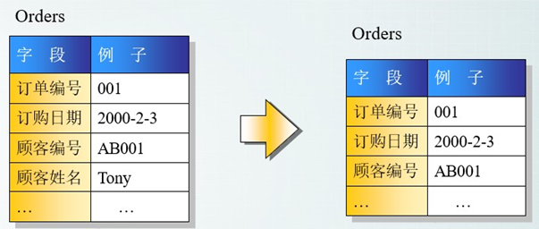

==范式是具有最小冗余的表结构。==

3 范式具体如下：

### 第一范式(1st NF －列都是不可再分)

第一范式的目标是确保每列的原子性:如果每列都是不可再分的最小数据单元（也称为最小的原子单元），则满足第一范式（1NF）

### 第二范式(2nd NF－每个表只描述一件事情)

首先满足第一范式，并且表中非主键列不存在对主键的部分依赖。 第二范式要求每个表只描述一件事情。

### 第三范式(3rd NF－ 不存在对非主键列的传递依赖)

第三范式定义是，满足第二范式，并且表中的列不存在对非主键列的传递依赖。除了主键订单编号外，顾客姓名依赖于非主键顾客编号。

### 反 3NF

没有冗余的数据库未必是最好的数据库，有时为了提高运行效率，提高读性能，就必须降低范式标准，适当保留冗余数据。具体做法是： 在概念数据模型设计时遵守第三范式，降低范式标准的工作放到物理数据模型设计时考虑。降低范式就是增加字段，减少了查询时的关联，提高查询效率，因为在数据库的操作中查询的比例要远远大于 DML 的比例。但是反范式化一定要适度，并且在原本已满足三范式的基础上再做调整的。
