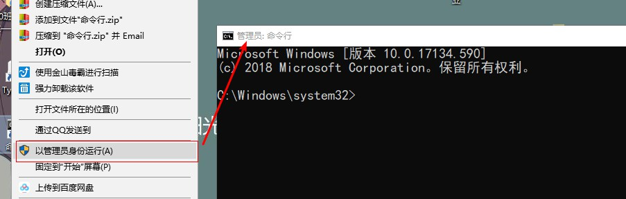
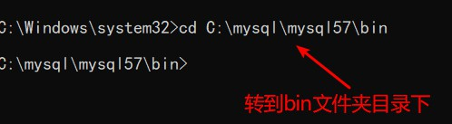
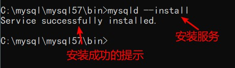

MySQL 关是一种关系数据库管理系统，所使用的 SQL 语言是用于访问数据库的最常用的标准化语言，其特点为体积小、速度快、总体拥有成本低，尤其是开放源码这一特点，在 Web 应用方面 MySQL 是最好的 RDBMS(Relational Database Management System：关系数据库管理系统)应用软件之一。

## **一：下载安装包：**

1.  进入官网后，点击"Dowload"，然后页面往下拉

****

2. 接下来看到的页面是这样的，红色框框的链接就是 mysql 社区版，是免费的 mysql 版本，然后我们点击这个框框的链接


3. 接下来跳转到这个页面，在这里，我们只要下载社区版的 Server 就可以了


4. 下载免安装版(windows 以外的其他系统除外)


**这样，安装包就下载好了！**

**注意，安装的目录应当放在指定位置，，其次，绝对路径中避免出现中文，推荐首选英文为命名条件！！！！(我的为参考)**

****

## 　

## **二：Mysql 的配置**

**\*以管理员身份打开命令行(如下图所示)**

****

### 　　 1.下转到 mysql 的 bin 目录下：



### 　　 2. 安装 mysql 的服务：

```sql
mysqld --install
```



### 3.初始化 mysql

在这里，初始化会产生一个随机密码,如下图框框所示，记住这个密码，后面会用到。

```sql
mysqld --initialize --console
```


### 　　 4 开启 mysql 的服务

```sql
/* terminal以管理员模式
*/
net start mysql
```


### 5.登录验证，mysql 是否安装成功！

**(要注意上面产生的随机密码，不包括前面符号前面的空格，否则会登陆失败)，如果和下图所示一样，则说明你的 mysql 已经安装成功！注意，，一定要先开启服务，不然会登陆失败，出现拒绝访问的提示符！！！**

​ 登录验证

```sql
mysql -u root -p
```


### 　　修改密码：

由于初始化产生的随机密码太复杂，，不便于我们登录 mysql，因此，我们应当修改一个自己能记住的密码！！

```sql
alter user '用户'@'localhost' identified by 'root';
```


再次登录验证新密码：

​ 登录验证

```sql
mysql -u root -p
```


## 　　**三:设置系统的全局变量：**

为了方便登录操作 mysql，在这里我们设置一个全局变量：↓

1.点击"我的电脑"-->"属性"-->''高级系统设置''-->''环境变量'',接下来如下图所操作


2.把新建的 mysql 变量添加到 Path 路径变量中，点击确定，即完成：


配置完成之后，每当我们想要用命令行使用 mysql 时，只需要 win+R，-->输入"cmd"打开命令行，之后输入登录 sql 语句即可。

另一种方式配置环境变量

3. 在 mysql 目录下创建一个 ini 或 cnf 配置文件，在这里我创建的是 ini 配置文件，里面写的代码是 mysql 的一些基本配置


就这样，一个免安装版的 Mysql 就安装并配置完成了
