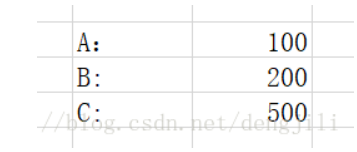

事物 (transaction)

## 事物定义

- `Transaction`
- 事务：一个最小的不可再分的工作单元；通常一个事务对应一个完整的业务(例如银行账户转账业务，该业务就是一个最小的工作单元)
- 一个完整的业务需要批量的 DML(insert、update、delete)语句共同联合完成
- 事务只和 DML 语句有关，或者说 DML 语句才有事务。这个和业务逻辑有关，业务逻辑不同，DML 语句的个数不同

## 二、转账操作理解事务

关于银行账户转账操作，账户转账是一个完整的业务，最小的单元，不可再分也就是说银行账户转账是一个事务

以下是银行账户表 t_act(账号、余额)，进行转账操作

```
actno		balance
1			500
2			100
123
```

转账操作

```
update t_act set balance=400 where actno=1;
update t_act set balance=200 where actno=2;
12
```

> 以上两台 DML 语句必须同时成功或者同时失败。最小单元不可再分，当第一条 DML 语句执行成功后，并不能将底层数据库中的第一个账户的数据修改，只是将操作记录了一下；这个记录是在内存中完成的；当第二条 DML 语句执行成功后，和底层数据库文件中的数据完成同步。若第二条 DML 语句执行失败，则清空所有的历史操作记录，要完成以上的功能必须借助事务

```sql
-- mysql 是默认开启事物自动提交的
set autocommit =0 /*关闭*/
set autocommit=1  /*开启*/

-- 手动处理事务

-- 事物开启
start transaction -- 标记一个事务的开始，从这个之后的sql都在同一个事务内

insert xx
insert xx

-- 提交: 持久化
commit
-- 回滚:回到的原来的样子
rollback
-- 事物结束

-- 了解
savepoint 保存点名 -- 设置一个事物的保存点
rollback to savepoint 保存点名 -- 回滚到保存点
release savepoint 保存点名 -- 撤销保存点

-- 转账
create database shop character set utf8 collate utf8_general_ci;

create table `account` (
id int(3) not null auto_increment,
name varchar(30) not null ,
money decimal(9,2) not null,
primary key(id)
) engine=innoDB default charset=utf8

-- 关闭自动提交事务(默认开启自动提交事物)
set autocommit=0;
start transaction;

-- 给表插入数据
insert into account(name,money) values('A','1000.0'),('B','1000.0');

-- A给B转账500 B收到A500
update account set money=money-500 where name='A';
update account set money=money+500 where name='B';

-- 提交事务
commit ;
-- 回滚
rollback ;
-- 开启自动提交事物
set autocommit=1;

```

## 三、事物四大特性(ACID)

- `原子性(Atomicity)`:事务中的所有操作作为一个整体像原子一样不可分割，要么全部成功,要么全部失败。

- `一致性(Consistency)`:事务的执行结果必须使数据库从一个一致性状态到另一个一致性状态。一致性状态是指:1.系统的状态满足数据的完整性约束(主码,参照完整性,check 约束等) 2.系统的状态反应数据库本应描述的现实世界的真实状态,比如转账前后两个账户的金额总和应该保持不变。

- `隔离性(Isolation)`:并发执行的事务不会相互影响,其对数据库的影响和它们串行执行时一样。比如多个用户同时往一个账户转账,最后账户的结果应该和他们按先后次序转账的结果一样。

- `持久性(Durability)`:事务一旦提交,其对数据库的更新就是持久的。任何事务或系统故障都不会导致数据丢失。

### 原子性(Atomicity)

针对同一个事务


这个过程包含两个步骤

A： 800 - 200 = 600
B: 200 + 200 = 400

原子性表示，这两个步骤一起成功，或者一起失败，不能只发生其中一个动作

### 一致性（Consistency）

针对一个事务操作前与操作后的状态一致


操作前 A：800，B：200
操作后 A：600，B：400

一致性表示事务完成后，符合逻辑运算

### **持久性（Durability）**

表示事务结束后的数据不随着外界原因导致数据丢失

操作前 A：800，B：200
操作后 A：600，B：400
如果在操作前（事务还没有提交）服务器宕机或者断电，那么重启数据库以后，数据状态应该为
A：800，B：200
如果在操作后（事务已经提交）服务器宕机或者断电，那么重启数据库以后，数据状态应该为
A：600，B：400

### **隔离性（Isolation）**

针对多个用户同时操作，主要是排除其他事务对本次事务的影响


两个事务同时进行，其中一个事务读取到另外一个事务还没有提交的数据，B


## 四、数据库事物的四种隔离级别

数据库事务的隔离级别有 4 种，由低到高分别为`Read uncommitted` 、`Read committed` 、`Repeatable read` 、`Serializable`。而且，在事务的并发操作中可能会出现脏读，不可重复读，幻读。

**Read uncommitted**

**读未提交**，顾名思义，就是一个事务可以读取另一个未提交事务的数据。

事例：老板要给程序员发工资，程序员的工资是 3.6 万/月。但是发工资时老板不小心按错了数字，按成 3.9 万/月，该钱已经打到程序员的户口，但是事务还没有提交，就在这时，程序员去查看自己这个月的工资，发现比往常多了 3 千元，以为涨工资了非常高兴。但是老板及时发现了不对，马上回滚差点就提交了的事务，将数字改成 3.6 万再提交。

分析：实际程序员这个月的工资还是 3.6 万，但是程序员看到的是 3.9 万。他看到的是老板还没提交事务时的数据。这就是**脏读**。

**Read committed**

**读提交**，顾名思义，就是一个事务要等另一个事务提交后才能读取数据。

事例：程序员拿着信用卡去享受生活（卡里当然是只有 3.6 万），当他买单时（程序员事务开启），收费系统事先检测到他的卡里有 3.6 万，就在这个时候！！程序员的妻子要把钱全部转出充当家用，并提交。当收费系统准备扣款时，再检测卡里的金额，发现已经没钱了（第二次检测金额当然要等待妻子转出金额事务提交完）。程序员就会很郁闷，明明卡里是有钱的…

分析：这就是读提交，若有事务对数据进行更新（UPDATE）操作时，读操作事务要等待这个更新操作事务提交后才能读取数据，可以解决脏读问题。但在这个事例中，出现了一个事务范围内两个相同的查询却返回了不同数据，这就是不可重复读。

**Repeatable read**

**重复读**，就是在开始读取数据（事务开启）时，不再允许修改操作

事例：程序员拿着信用卡去享受生活（卡里当然是只有 3.6 万），当他埋单时（事务开启，不允许其他事务的 UPDATE 修改操作），收费系统事先检测到他的卡里有 3.6 万。这个时候他的妻子不能转出金额了。接下来收费系统就可以扣款了。

分析：重复读可以解决不可重复读问题。写到这里，应该明白的一点就是，不可重复读**对应的是修改，即 UPDATE 操作**。但是可能还会有幻读问题。因为**幻读问题对应的是插入 INSERT 操作，而不是 UPDATE 操作**。

**什么时候会出现幻读？**

事例：程序员某一天去消费，花了 2 千元，然后他的妻子去查看他今天的消费记录（全表扫描 FTS，妻子事务开启），看到确实是花了 2 千元，就在这个时候，程序员花了 1 万买了一部电脑，即新增 INSERT 了一条消费记录，并提交。当妻子打印程序员的消费记录清单时（妻子事务提交），发现花了 1.2 万元，似乎出现了幻觉，这就是幻读。

那怎么解决幻读问题？Serializable

**Serializable 序列化**

Serializable 是最高的事务隔离级别，在该级别下，事务串行化顺序执行，可以避免脏读、不可重复读与幻读。但是这种事务隔离级别效率低下，比较耗数据库性能，一般不使用。

**四种隔离级别可能导致的问题：**

1、`Serializable (串行化)`：最严格的级别，事务串行执行，资源消耗最大;

2、`Repeatable read(重复读)` ：保证了一个事务不会修改已经由另一个事务读取但未提交(回滚)的数据。避免了“脏读取”和“不可重复读取”的情况，但不能避免“幻读”，但是带来了更多的性能损失。

3、`Read committed(提交读)`：大多数主流数据库的默认事务等级，保证了一个事务不会读到另一个并行事务已修改但未提交的数据，避免了“脏读取”，但不能避免“幻读”和“不可重复读取”。该级别适用于大多数系统。

4、`Read uncommitted(未提交读)` ：事务中的修改，即使没有提交，其他事务也可以看得到，会导致“脏读”、“幻读”和“不可重复读取”。

**通俗解释：**

**脏读**：所谓的脏读，其实就是读到了别的事务回滚前的脏数据。比如事务 B 执行过程中修改了数据 X，在未提交前，事务 A 读取了 X，而事务 B 却回滚了，这样事务 A 就形成了脏读。

也就是说，当前事务读到的数据是别的事务想要修改成为的但是没有修改成功的数据。

**不可重复读**：事务 A 首先读取了一条数据，然后执行逻辑的时候，事务 B 将这条数据改变了，然后事务 A 再次读取的时候，发现数据不匹配了，就是所谓的不可重复读了。

也就是说，当前事务先进行了一次数据读取，然后再次读取到的数据是别的事务修改成功的数据，导致两次读取到的数据不匹配，也就照应了不可重复读的语义。

**幻读**：事务 A 首先根据条件索引得到 N 条数据，然后事务 B 改变了这 N 条数据之外的 M 条或者增添了 M 条符合事务 A 搜索条件的数据，导致事务 A 再次搜索发现有 N+M 条数据了，就产生了幻读。

也就是说，当前事务读第一次取到的数据比后来读取到数据条目不一致。

## 事务的隔离级别

### 脏读：

指一个事务读取了另外一个事务未提交的数据。


### 不可重复读：

在一个事务内读取表中的某一行数据，多次读取结果不同。（这个不一定是错误，只是某些场合不对）

页面统计查询值

点击生成报表的时候，B 有人转账进来 300（事务已经提交）


### 虚读(幻读)

是指在一个事务内读取到了别的事务插入的数据，导致前后读取不一致。
（一般是行影响，多了一行）


### 四种隔离级别设置

\####数据库
set transaction isolation level 设置事务隔离级别
select @@tx_isolation 查询当前事务隔离级别

| 设置             | 描述                                               |
| ---------------- | -------------------------------------------------- |
| Serializable     | 可避免脏读、不可重复读、虚读情况的发生。（串行化） |
| Repeatable read  | 可避免脏读、不可重复读情况的发生。（可重复读）     |
| Read committed   | 可避免脏读情况发生（读已提交）。                   |
| Read uncommitted | 最低级别，以上情况均无法保证。(读未提交)           |

#### java

适当的 Connection 方法，比如 setAutoCommit 或 setTransactionIsolation

| 设置                         | 描述                                                                    |
| ---------------------------- | ----------------------------------------------------------------------- |
| TRANSACTION_SERIALIZABLE     | 指示不可以发生脏读、不可重复读和虚读的常量。                            |
| TRANSACTION_REPEATABLE_READ  | 指示不可以发生脏读和不可重复读的常量；虚读可以发生。                    |
| TRANSACTION_READ_UNCOMMITTED | 指示可以发生脏读 (dirty read)、不可重复读和虚读 (phantom read) 的常量。 |
| TRANSACTION_READ_COMMITTED   | 指示不可以发生脏读的常量；不可重复读和虚读可以发生。                    |

### mysql 模拟事务隔离性测试

```sql
SELECT @@session.tx_isolation;
SELECT @@tx_isolation;

SET SESSION TRANSACTION ISOLATION LEVEL read uncommitted;
SET SESSION TRANSACTION ISOLATION LEVEL read committed;
SET SESSION TRANSACTION ISOLATION LEVEL repeatable read;
SET SESSION TRANSACTION ISOLATION LEVEL serializable;

start transaction;

--建表
drop table AMOUNT;
CREATE TABLE `AMOUNT` (
`id`  varchar(10) NULL,
`money`  numeric NULL
)
;
--插入数据
insert into amount(id,money) values('A', 800);
insert into amount(id,money) values('B', 200);
insert into amount(id,money) values('C', 1000);
--测试可重复读，插入数据
insert into amount(id,money) values('D', 1000);

--设置事务
SET SESSION TRANSACTION ISOLATION LEVEL read uncommitted;
SELECT @@tx_isolation;
--开启事务
start transaction;

--脏读演示，读到其他事务未提交的数据
--案列1，事务一：A向B转200，事务二：查看B金额变化，事务一回滚事务
update amount set money = money - 200 where id = 'A';
update amount set money = money + 200 where id = 'B';

--不可重复读演示，读到了其他事务提交的数据
--案列2，事务一：B向A转200，事务二：B向C转200转100
SET SESSION TRANSACTION ISOLATION LEVEL read committed;

--开启事务
start transaction;
--两个事务都查一下数据(转账之前需要，查一下金额是否够满足转账)
select * from amount;
--事务一：B向A转200
update amount set money = money - 200 where id = 'B';
update amount set money = money + 200 where id = 'A';

commit;
--事务二：B向C转200转100
update amount set money = money - 100 where id = 'B';
update amount set money = money + 100 where id = 'C';
commit;
--从事务二的角度来看，读到了事务一提交事务的数据，导致金额出现负数

--幻读演示
--案列3，事务一：B向A转200，事务二：B向C转200转100
SET SESSION TRANSACTION ISOLATION LEVEL repeatable read;

--开启事务
start transaction;
--两个事务都查一下数据(转账之前需要，查一下金额是否够满足转账)
select * from amount;
--事务一：B向A转200
update amount set money = money - 200 where id = 'B';
update amount set money = money + 200 where id = 'A';

commit;
--事务二：B向C转200转100
update amount set money = money - 100 where id = 'B';
update amount set money = money + 100 where id = 'C';
commit;
--从事务二的角度来看，读到了事务一提交事务的数据，导致金额出现负数
```
