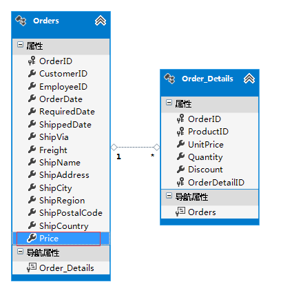
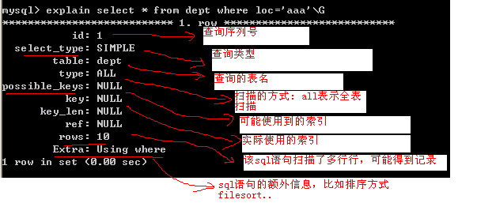

mysql 的性能优化无法一蹴而就，必须一步一步慢慢来，从各个方面进行优化，最终性能就会有大的提升。

## Mysql 数据库的优化技术

对 mysql 优化是一个综合性的技术，主要包括

- 表的设计合理化(符合 3NF)
- 添加适当索引(index) [四种: 普通索引、主键索引、唯一索引 unique、全文索引]
- 分表技术(水平分割、垂直分割)
- 读写[写: update/delete/add]分离
- 存储过程 [模块化编程，可以提高速度]
- 对 mysql 配置优化 [配置最大并发数 my.ini, 调整缓存大小 ]
- mysql 服务器硬件升级
- 定时的去清除不需要的数据,定时进行碎片整理(MyISAM)

## 数据库优化工作

对于一个以数据为中心的应用，数据库的好坏直接影响到程序的性能，因此数据库性能至关重要。一般来说，要保证数据库的效率，要做好以下四个方面的工作：

① 数据库设计

② sql 语句优化

③ 数据库参数配置

④ 恰当的硬件资源和操作系统

此外，使用适当的存储过程，也能提升性能。

这个顺序也表现了这四个工作对性能影响的大小

## 数据库表设计

通俗地理解三个范式，对于数据库设计大有好处。在数据库设计中，为了更好地应用三个范式，就必须通俗地理解三个范式(通俗地理解是够用的理解，并不是最科学最准确的理解)：

第一范式：1NF 是对属性的原子性约束，要求属性(列)具有原子性，不可再分解；(只要是关系型数据库都满足 1NF)

第二范式：2NF 是对记录的惟一性约束，要求记录有惟一标识，即实体的惟一性；

第三范式：3NF 是对字段冗余性的约束，它要求字段没有冗余。 没有冗余的数据库设计可以做到。

但是，没有冗余的数据库未必是最好的数据库，有时为了提高运行效率，就必须降低范式标准，适当保留冗余数据。具体做法是： 在概念数据模型设计时遵守第三范式，降低范式标准的工作放到物理数据模型设计时考虑。降低范式就是增加字段，允许冗余。

**☞** **数据库的分类**

关系型数据库: mysql/oracle/db2/informix/sysbase/sql server

非关系型数据库: (特点: 面向对象或者集合)

NoSql 数据库: MongoDB(特点是面向文档)

举例说明什么是适度冗余，或者说有理由的冗余!


上面这个就是不合适的冗余，原因是:

在这里，为了提高学生活动记录的检索效率，把单位名称冗余到学生活动记录表里。单位信息有 500 条记录，而学生活动记录在一年内大概有 200 万数据量。 如果学生活动记录表不冗余这个单位名称字段，只包含三个 int 字段和一个 timestamp 字段，只占用了 16 字节，是一个很小的表。而冗余了一个 varchar(32)的字段后则是原来的 3 倍，检索起来相应也多了这么多的 I/O。而且记录数相差悬殊，500 VS 2000000 ，导致更新一个单位名称还要更新 4000 条冗余记录。由此可见，这个冗余根本就是适得其反。



订单表里面的 Price 就是一个冗余字段，因为我们可以从订单明细表中统计出这个订单的价格，但是这个冗余是合理的，也能提升查询性能。

从上面两个例子中可以得出一个结论:

1---n 冗余应当发生在 1 这一方.

## SQL 语句优化

### SQL 优化的一般步骤

1. 通过 show status 命令了解各种 SQL 的执行频率。
2. 定位执行效率较低的 SQL 语句-（重点 select）
3. 通过 explain 分析低效率的 SQL
4. 确定问题并采取相应的优化措施

```sql
-- select语句分类
Select
Dml数据操作语言(insert update delete)
dtl 数据事物语言(commit rollback savepoint)
Ddl数据定义语言(create alter drop..)
Dcl(数据控制语言) grant revoke

-- Show status 常用命令
--查询本次会话
Show session status like 'com_%';     //show session status like 'Com_select'

--查询全局
Show global status like 'com_%';

-- 给某个用户授权
grant all privileges on *.* to 'abc'@'%';
--为什么这样授权 'abc'表示用户名  '@' 表示host, 查看一下mysql->user表就知道了

--回收权限
revoke all on *.* from 'abc'@'%';

--刷新权限[也可以不写]
flush privileges;
```

## SQL 语句优化-show 参数

MySQL 客户端连接成功后，通过使用 show [session|global] status 命令可以提供服务器状态信息。其中的 session 来表示当前的连接的统计结果，global 来表示自数据库上次启动至今的统计结果。默认是 session 级别的。
下面的例子：
show status like 'Com\_%';
其中 Com_XXX 表示 XXX 语句所执行的次数。
重点注意：Com_select,Com_insert,Com_update,Com_delete 通过这几个参数，可以容易地了解到当前数据库的应用是以插入更新为主还是以查询操作为主，以及各类的 SQL 大致的执行比例是多少。

还有几个常用的参数便于用户了解数据库的基本情况。
Connections：试图连接 MySQL 服务器的次数
Uptime：服务器工作的时间（单位秒）
Slow_queries：慢查询的次数 (默认是慢查询时间 10s)

```sql
show status like 'Connections'
show status like 'Uptime'
show status like 'Slow_queries'
```

如何查询 mysql 的慢查询时间

```sql
Show variables like 'long_query_time';
```

修改 mysql 慢查询时间

```sql
set long_query_time=2
```

## SQL 语句优化-定位慢查询

问题是： 如何从一个大项目中，迅速的定位执行速度慢的语句. (定位慢查询)

首先我们了解 mysql 数据库的一些运行状态如何查询(比如想知道当前 mysql 运行的时间/一共执行了多少次 select/update/delete.. / 当前连接)

为了便于测试，我们构建一个大表(400 万)-> 使用存储过程构建

默认情况下，mysql 认为 10 秒才是一个慢查询.

修改 mysql 的慢查询.

```sql
show variables like 'long_query_time' ; //可以显示当前慢查询时间
set long_query_time=1 ;//可以修改慢查询时间
```

构建大表->大表中记录有要求, 记录是不同才有用，否则测试效果和真实的相差大.创建:

```sql
CREATE TABLE dept( /*部门表*/
deptno MEDIUMINT   UNSIGNED  NOT NULL  DEFAULT 0,  /*编号*/
dname VARCHAR(20)  NOT NULL  DEFAULT "", /*名称*/
loc VARCHAR(13) NOT NULL DEFAULT "" /*地点*/
) ENGINE=MyISAM DEFAULT CHARSET=utf8 ;


CREATE TABLE emp
(empno  MEDIUMINT UNSIGNED  NOT NULL  DEFAULT 0, /*编号*/
ename VARCHAR(20) NOT NULL DEFAULT "", /*名字*/
job VARCHAR(9) NOT NULL DEFAULT "",/*工作*/
mgr MEDIUMINT UNSIGNED NOT NULL DEFAULT 0,/*上级编号*/
hiredate DATE NOT NULL,/*入职时间*/
sal DECIMAL(7,2)  NOT NULL,/*薪水*/
comm DECIMAL(7,2) NOT NULL,/*红利*/
deptno MEDIUMINT UNSIGNED NOT NULL DEFAULT 0 /*部门编号*/
)ENGINE=MyISAM DEFAULT CHARSET=utf8 ;


CREATE TABLE salgrade
(
grade MEDIUMINT UNSIGNED NOT NULL DEFAULT 0,
losal DECIMAL(17,2)  NOT NULL,
hisal DECIMAL(17,2)  NOT NULL
)ENGINE=MyISAM DEFAULT CHARSET=utf8;
```

测试数据

```sql
INSERT INTO salgrade VALUES (1,700,1200);
INSERT INTO salgrade VALUES (2,1201,1400);
INSERT INTO salgrade VALUES (3,1401,2000);
INSERT INTO salgrade VALUES (4,2001,3000);
INSERT INTO salgrade VALUES (5,3001,9999);
```

为了存储过程能够正常执行，我们需要把命令执行结束符修改 delimiter \\\\\\\$\$

创建函数，该函数会返回一个指定长度的随机字符串

```sql
create function rand_string(n INT)
returns varchar(255) #该函数会返回一个字符串
begin
#chars_str定义一个变量 chars_str,类型是 varchar(100),默认值'abcdefghijklmnopqrstuvwxyzABCDEFJHIJKLMNOPQRSTUVWXYZ';
 declare chars_str varchar(100) default
   'abcdefghijklmnopqrstuvwxyzABCDEFJHIJKLMNOPQRSTUVWXYZ';
 declare return_str varchar(255) default '';
 declare i int default 0;
 while i < n do
   set return_str =concat(return_str,substring(chars_str,floor(1+rand()*52),1));
   set i = i + 1;
   end while;
  return return_str;
  end
```

创建一个存储过程

```sql
create procedure insert_emp(in start int(10),in max_num int(10))
begin
declare i int default 0;
#set autocommit =0 把autocommit设置成0
 set autocommit = 0;
 repeat
 set i = i + 1;
 insert into emp values ((start+i) ,rand_string(6),'SALESMAN',0001,curdate(),2000,400,rand());
  until i = max_num
 end repeat;
   commit;
 end
```

\#调用刚刚写好的函数, 1800000 条记录,从 100001 号开始

call insert_emp(100001,4000000);

这时我们如果出现一条语句执行时间超过 1 秒中，就会统计到.

如果把慢查询的 sql 记录到我们的一个日志中

在默认情况下，低版本的 mysql 不会记录慢查询，需要在启动 mysql 时候，指定记录慢查询才可以

```
  bin\mysqld.exe - -safe-mode - -slow-query-log [mysql5.5 可以在my.ini指定]

  bin\mysqld.exe –log-slow-queries=d:/abc.log [低版本mysql5.0可以在my.ini指定]
```

该慢查询日志会放在 data 目录下[在 mysql5.0 这个版本中时放在 mysql 安装目录/data/下],在 mysql5.5.19 下是需要查看

```ini
my.ini 的 datadir="C:/Documents and Settings/All Users/Application Data/MySQL/MySQL Server 5.5/Data/“
```

在 mysql5.6 中，默认是启动记录慢查询的，my.ini 的所在目录为：C:\ProgramData\MySQL\MySQL Server 5.6，其中有一个配置项

slow-query-log=1

针对 mysql5.5 启动慢查询有两种方法

```
bin\mysqld.exe - -safe-mode - -slow-query-log
```

也可以在 my.ini 文件中配置:

```ini
[mysqld]
# The TCP/IP Port the MySQL Server will listen on
port=3306
slow-query-log
```

通过慢查询日志定位执行效率较低的 SQL 语句。慢查询日志记录了所有执行时间超过 long_query_time 所设置的 SQL 语句。
show variables like 'long_query_time';
set long_query_time=2;

为 dept 表添加数据

```sql
desc dept;
ALTER table  dept add id int PRIMARY key auto_increment;
CREATE PRIMARY KEY on dept(id);
create INDEX idx_dptno_dptname on dept(deptno,dname);
INSERT into dept(deptno,dname,loc) values(1,'研发部','康和盛大厦5楼501');
INSERT into dept(deptno,dname,loc) values(2,'产品部','康和盛大厦5楼502');
INSERT into dept(deptno,dname,loc) values(3,'财务部','康和盛大厦5楼503');UPDATE emp set deptno=1 where empno=100002;
```

**测试语句**[对 emp 表的记录可以为 3600000 ,效果很明显慢]

select \* from emp where empno=(select empno from emp where ename='研发部')

如果带上 order by e.empno 速度就会更慢，有时会到 1min 多.

测试语句

```sql
 select * from emp e,dept d where e.empno=100002  and e.deptno=d.deptno;
```

查看慢查询日志：默认为数据目录 data 中的 host-name-slow.log。低版本的 mysql 需要通过在开启 mysql 时使用- -log-slow-queries[=file_name]来配置

## SQL 语句优化-explain 分析问题

Explain select \* from emp where ename=“wsrcla”
会产生如下信息：
select_type:表示查询的类型。
table:输出结果集的表
type:表示表的连接类型
possible_keys:表示查询时，可能使用的索引
key:表示实际使用的索引
key_len:索引字段的长度
rows:扫描出的行数(估算的行数)
Extra:执行情况的描述和说明



```sql
explain select * from emp where ename='JKLOIP'
```

如果要测试 Extra 的 filesort 可以对上面的语句修改

```sql
explain select * from emp order by ename
```

**EXPLAIN**

**id**

SELECT 识别符。这是 SELECT 的查询序列号

id 示例

```sql
SELECT * FROM emp WHERE empno = 1 and ename = (SELECT ename FROM emp WHERE empno =  100001) \G;
```

**select_type**

PRIMARY :子查询中最外层查询

SUBQUERY : 子查询内层第一个 SELECT，结果不依赖于外部查询

DEPENDENT SUBQUERY:子查询内层第一个 SELECT，依赖于外部查询

UNION :UNION 语句中第二个 SELECT 开始后面所有 SELECT，

SIMPLE：简单的 select 查询,不使用 union 及子查询

UNION ：UNION 中的第二个或随后的 select 查询,不依赖于外部查询的结果集

**Table**

显示这一步所访问数据库中表名称

**Type**

对表访问方式

ALL：

SELECT \* FROM emp \G

完整的表扫描 通常不好

SELECT _ FROM (SELECT _ FROM emp WHERE empno = 1) a ;

system：表仅有一行(=系统表)。这是 const 联接类型的一个特

const：表最多有一个匹配行

**Possible_keys**

该查询可以利用的索引，如果没有任何索引显示 null

**Key**

Mysql 从 Possible_keys 所选择使用索引

**Rows**

估算出结果集行数

**Extra**

查询细节信息

No tables ：Query 语句中使用 FROM DUAL 或不含任何 FROM 子句

Using filesort ：当 Query 中包含 ORDER BY 操作，而且无法利用索引完成排序，

Impossible WHERE noticed after reading const tables: MYSQL Query Optimizer

通过收集统计信息不可能存在结果

Using temporary：某些操作必须使用临时表，常见 GROUP BY ; ORDER BY

Using where：不用读取表中所有信息，仅通过索引就可以获取所需数据;

---
参考文献
https://www.cnblogs.com/jiekzou/p/5380073.html

---

[MySQL 性能优化二](http://kl7v8u.coding-pages.com/java_note/javaEE/MySQL/MySQL%E6%80%A7%E8%83%BD%E4%BC%98%E5%8C%96%E4%BA%8C.html#%E5%BB%BA%E7%AB%8B%E9%80%82%E5%BD%93%E7%9A%84%E7%B4%A2%E5%BC%95)

