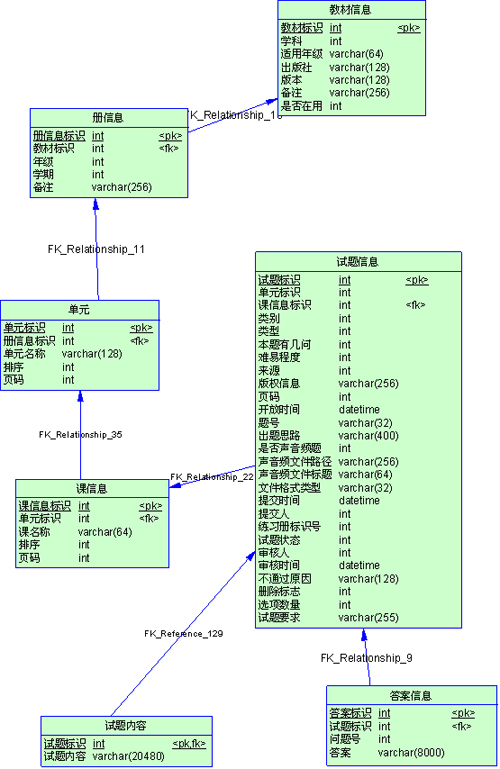
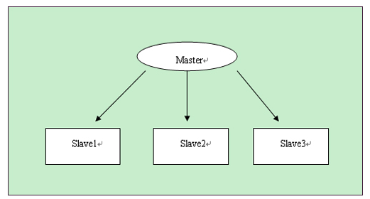
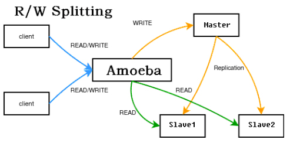
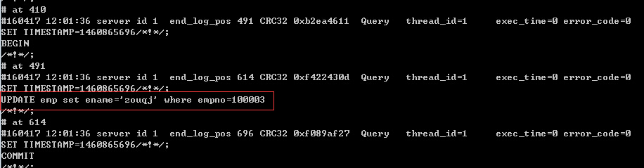
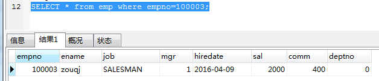

## 对表进行水平划分

如果一个表的记录数太多了，比如上千万条，而且需要经常检索，那么我们就有必要化整为零了。如果我拆成 100 个表，那么每个表只有 10 万条记录。当然这需要数据在逻辑上可以划分。一个好的划分依据，有利于程序的简单实现，也可以充分利用水平分表的优势。比如系统界面上只提供按月查询的功能，那么把表按月拆分成 12 个，每个查询只查询一个表就够了。如果非要按照地域来分，即使把表拆的再小，查询还是要联合所有表来查，还不如不拆了。所以一个好的拆分依据是 最重要的。关键字：UNION
例：

- 订单表根据订单产生时间来分表（一年一张）
- 学生情况表
- 查询电话费，近三个月的数据放入一张表，一年内的放入到另一张表

## 对表进行垂直划分

有些表记录数并不多，可能也就 2、3 万条，但是字段却很长，表占用空间很大，检索表时需要执行大量 I/O，严重降低了性能。这个时候需要把大的字段拆分到另一个表，并且该表与原表是一对一的关系。 (JOIN)



【试题内容】、【答案信息】两个表，最初是作为几个字段添加到【试题信息】里的，可以看到试题内容和答案这两个字段很长，在表里有 3 万记录时，表已经占 了 1G 的空间，在列试题列表时非常慢。经过分析，发现系统很多时候是根据【册】、【单元】、类型、类别、难易程度等查询条件，分页显示试题详细内容。而每 次检索都是这几个表做 join，每次要扫描一遍 1G 的表。我们完全可以把内容和答案拆分成另一个表，只有显示详细内容的时候才读这个大表，由此 就产生了【试题内容】、【答案信息】两个表。

## 选择适当的字段类型，特别是主键

选择字段的一般原则是保小不保大，能用占用字节小的字段就不用大字段。比如主键， 建议使用自增类型，这样省空间,空间就是效率!按 4 个字节和按 32 个字节定位一条记录，谁快谁慢太明显了。涉及到几个表做 join 时，效果就更明显了。
建议使用一个不含业务逻辑的 id 做主角如 s1001。例：

```
int 4  bigint 8 mediumint smallint 2 tinyint 1
md5  char(32)
id ：整数 tinyint samllint int bigint
student表
id stuno     stuname     adress
1  s1001    小民            深圳
```

### 文件、图片等大文件用文件系统存储

数据库只存储路径。图片和文件存放在文件系统，甚至单独放在一台服务器(图床 / 视频服务器 ).

## 数据库参数配置

最重要的参数就是内存，我们主要用的 innodb 引擎，所以下面两个参数调的很大

```
innodb_additional_mem_pool_size = 64M
innodb_buffer_pool_size =1G
```

对于 myisam，需要调整 key_buffer_size，当然调整参数还是要看状态，用 show status 语句可以看到当前状态，以决定改调整哪些参数
在 my.ini 修改端口 3306，默认存储引擎和最大连接数

```
在my.ini中.
port=3306 [有两个地方修改]
default-storage-engine=INNODB
max_connections=100
```

## 合理的硬件资源和操作系统

如果你的机器内存超过 4G，那么毋庸置疑应当采用 64 位操作系统和 64 位 mysql 5.5.19 or mysql5.6
**读写分离**
如果数据库压力很大，一台机器支撑不了，那么可以用 mysql 复制实现多台机器同步，将数据库的压力分散。


Master
　　 Slave1
　　 Slave2
　　 Slave3
主库 master 用来写入，slave1—slave3 都用来做 select，每个数据库分担的压力小了很多。
　 要实现这种方式，需要程序特别设计，写都操作 master，读都操作 slave，给程序开发带来了额外负担。当然目前已经有中间件来实现这个代理，对程 序来读写哪些数据库是透明的。官方有个 mysql-proxy，但是还是 alpha 版本的。新浪有个 amobe for mysql，也可达到这个目的，结构如下　


## 定时完成数据库的备份

项目实际需求，请完成定时备份某个数据库，或者定时备份数据库的某些表的操作
windows 下每隔 1 小时，备份一次数据 newsdb
windows 每天晚上 2:00 备份 newsdb 下 某一张表
cmd> mysqldump –u root –p 密码 数据库名 > 把数据库放入到某个目录
案例,备份 mydb 库的所有表
进入 mysqldump 所在的目录
cmd> mysqldump –u root –phsp shop> d:/shop.log [把 shop 数据库的所有表全部导出]
cmd> mysqldump –u root –phsp shop temusers emp > d:/shop2.log [shop 数据库的 temusers 和 emp 导出]
如何恢复数据的表
进入的 mysql 操作界面
mysql>source 备份文件的全路径
定时备份:(把命令写入到 my.bat 问中)
windows 如何定时备份 (每天凌晨 2:00)
使用 windows 自带的计划任务，定时执行批处理命令。

## 增量备份和还原

定义：mysql 数据库会以二进制的形式，自动把用户对 mysql 数据库的操作，记录到文件，当用户希望恢复的时候，可以使用备份文件进行恢复。

增量备份会记录 dml 语句、创建表的语句，不会记录 select。记录的东西包括：sql 语句本身、操作时间，位置

**进行增量备份的步骤和恢复**

注意：mysql5.0 及之前的版本是不支持增量备份的
1、配置 my.ini 文件或者 my.conf，启用二进制备份。
打开 my.ini 文件，查找 log-bin，进行配置：log-bin=G:\Database\mysqlbinlog\mylog

如果是 5.7 还要进行配置：binlog_format=mixed
在 G:\Database 目录下面新建目录 mysqlbinlog
2、重启 mysql 服务
这个时候会在 mysqlbinlog 目录下面看到以下两个文件：
mylog.000001：日志备份文件。如果要查看这个日志文件里面的信息，我们可以使用 mysqlbinlog 程序查看，mysqlbinlog 程序存放在 mysql 的 bin 目录下面（“C:\Program Files\MySQL\MySQL Server 5.6\bin”）。

执行 sql 语句

```
UPDATE emp set ename='zouqj' where empno=100003;
```

开始——运行——cmd，mysqlbinlog 备份文件路径

```
C:\Program Files\MySQL\MySQL Server 5.6\bin>mysqlbinlog G:\Database\mysqlbinlog\mylog.000001
```


mylog.index：日志索引文件，里面记录了所以的日志文件。（G:\Database\mysqlbinlog\mylog.000001）
3、假设现在问题来了，我这条 update 是误操作，如何进行恢复
在 mysql 日志中会记录每一次操作的时间和位置，所以我们既可以根据时间来恢复，也可以根据位置来恢复。
那么，我们现在马上可以从上图看出，这条语句产生的时间是"2016-04-17 12:01:36"，位置是 614

**按时间来恢复**

我们可以选择在语句产生时间的前一秒

执行 cmd 命令：mysqlbinlog --stop-datetime="2016-04-17 12:01:35" G:\Database\mysqlbinlog\mylog.000001 | mysql -uroot -p

这个时候我再执行 SQL 语句查看

```
SELECT * from emp where empno=100003;
```

结果变成了


**按位置来恢复**

执行 cmd 命令：mysqlbinlog --stop-position="614" G:\Database\mysqlbinlog\mylog.000001 | mysql -uroot -p

这个时候再执行 SQL 来查看结果，又变回来了。



引用:对表进行水平划分

如果一个表的记录数太多了，比如上千万条，而且需要经常检索，那么我们就有必要化整为零了。如果我拆成 100 个表，那么每个表只有 10 万条记录。当然这需要数据在逻辑上可以划分。一个好的划分依据，有利于程序的简单实现，也可以充分利用水平分表的优势。比如系统界面上只提供按月查询的功能，那么把表按月拆分成 12 个，每个查询只查询一个表就够了。如果非要按照地域来分，即使把表拆的再小，查询还是要联合所有表来查，还不如不拆了。所以一个好的拆分依据是 最重要的。关键字：UNION
例：

- 订单表根据订单产生时间来分表（一年一张）
- 学生情况表
- 查询电话费，近三个月的数据放入一张表，一年内的放入到另一张表

## 对表进行垂直划分

有些表记录数并不多，可能也就 2、3 万条，但是字段却很长，表占用空间很大，检索表时需要执行大量 I/O，严重降低了性能。这个时候需要把大的字段拆分到另一个表，并且该表与原表是一对一的关系。 (JOIN)


【试题内容】、【答案信息】两个表，最初是作为几个字段添加到【试题信息】里的，可以看到试题内容和答案这两个字段很长，在表里有 3 万记录时，表已经占 了 1G 的空间，在列试题列表时非常慢。经过分析，发现系统很多时候是根据【册】、【单元】、类型、类别、难易程度等查询条件，分页显示试题详细内容。而每 次检索都是这几个表做 join，每次要扫描一遍 1G 的表。我们完全可以把内容和答案拆分成另一个表，只有显示详细内容的时候才读这个大表，由此 就产生了【试题内容】、【答案信息】两个表。

## 选择适当的字段类型，特别是主键

选择字段的一般原则是保小不保大，能用占用字节小的字段就不用大字段。比如主键， 建议使用自增类型，这样省空间,空间就是效率!按 4 个字节和按 32 个字节定位一条记录，谁快谁慢太明显了。涉及到几个表做 join 时，效果就更明显了。
建议使用一个不含业务逻辑的 id 做主角如 s1001。例：

```
int 4  bigint 8 mediumint smallint 2 tinyint 1
md5  char(32)
id ：整数 tinyint samllint int bigint
student表
id stuno     stuname     adress
1  s1001    小民            深圳
```

### 文件、图片等大文件用文件系统存储

数据库只存储路径。图片和文件存放在文件系统，甚至单独放在一台服务器(图床 / 视频服务器 ).

## 数据库参数配置

最重要的参数就是内存，我们主要用的 innodb 引擎，所以下面两个参数调的很大

```
innodb_additional_mem_pool_size = 64M
innodb_buffer_pool_size =1G
```

对于 myisam，需要调整 key_buffer_size，当然调整参数还是要看状态，用 show status 语句可以看到当前状态，以决定改调整哪些参数
在 my.ini 修改端口 3306，默认存储引擎和最大连接数

```
在my.ini中.
port=3306 [有两个地方修改]
default-storage-engine=INNODB
max_connections=100
```

## 合理的硬件资源和操作系统

如果你的机器内存超过 4G，那么毋庸置疑应当采用 64 位操作系统和 64 位 mysql 5.5.19 or mysql5.6
**读写分离**
如果数据库压力很大，一台机器支撑不了，那么可以用 mysql 复制实现多台机器同步，将数据库的压力分散。


Master
　　 Slave1
　　 Slave2
　　 Slave3
主库 master 用来写入，slave1—slave3 都用来做 select，每个数据库分担的压力小了很多。
　 要实现这种方式，需要程序特别设计，写都操作 master，读都操作 slave，给程序开发带来了额外负担。当然目前已经有中间件来实现这个代理，对程 序来读写哪些数据库是透明的。官方有个 mysql-proxy，但是还是 alpha 版本的。新浪有个 amobe for mysql，也可达到这个目的，结构如下　


## 定时完成数据库的备份

项目实际需求，请完成定时备份某个数据库，或者定时备份数据库的某些表的操作
windows 下每隔 1 小时，备份一次数据 newsdb
windows 每天晚上 2:00 备份 newsdb 下 某一张表
cmd> mysqldump –u root –p 密码 数据库名 > 把数据库放入到某个目录
案例,备份 mydb 库的所有表
进入 mysqldump 所在的目录
cmd> mysqldump –u root –phsp shop> d:/shop.log [把 shop 数据库的所有表全部导出]
cmd> mysqldump –u root –phsp shop temusers emp > d:/shop2.log [shop 数据库的 temusers 和 emp 导出]
如何恢复数据的表
进入的 mysql 操作界面
mysql>source 备份文件的全路径
定时备份:(把命令写入到 my.bat 问中)
windows 如何定时备份 (每天凌晨 2:00)
使用 windows 自带的计划任务，定时执行批处理命令。

## 增量备份和还原

定义：mysql 数据库会以二进制的形式，自动把用户对 mysql 数据库的操作，记录到文件，当用户希望恢复的时候，可以使用备份文件进行恢复。

增量备份会记录 dml 语句、创建表的语句，不会记录 select。记录的东西包括：sql 语句本身、操作时间，位置

**进行增量备份的步骤和恢复**

注意：mysql5.0 及之前的版本是不支持增量备份的
1、配置 my.ini 文件或者 my.conf，启用二进制备份。
打开 my.ini 文件，查找 log-bin，进行配置：log-bin=G:\Database\mysqlbinlog\mylog

如果是 5.7 还要进行配置：binlog_format=mixed
在 G:\Database 目录下面新建目录 mysqlbinlog
2、重启 mysql 服务
这个时候会在 mysqlbinlog 目录下面看到以下两个文件：
mylog.000001：日志备份文件。如果要查看这个日志文件里面的信息，我们可以使用 mysqlbinlog 程序查看，mysqlbinlog 程序存放在 mysql 的 bin 目录下面（“C:\Program Files\MySQL\MySQL Server 5.6\bin”）。

执行 sql 语句

```
UPDATE emp set ename='zouqj' where empno=100003;
```

开始——运行——cmd，mysqlbinlog 备份文件路径

```
C:\Program Files\MySQL\MySQL Server 5.6\bin>mysqlbinlog G:\Database\mysqlbinlog\mylog.000001
```


mylog.index：日志索引文件，里面记录了所以的日志文件。（G:\Database\mysqlbinlog\mylog.000001）
3、假设现在问题来了，我这条 update 是误操作，如何进行恢复
在 mysql 日志中会记录每一次操作的时间和位置，所以我们既可以根据时间来恢复，也可以根据位置来恢复。
那么，我们现在马上可以从上图看出，这条语句产生的时间是"2016-04-17 12:01:36"，位置是 614

**按时间来恢复**

我们可以选择在语句产生时间的前一秒

执行 cmd 命令：mysqlbinlog --stop-datetime="2016-04-17 12:01:35" G:\Database\mysqlbinlog\mylog.000001 | mysql -uroot -p

这个时候我再执行 SQL 语句查看

```
SELECT * from emp where empno=100003;
```

结果变成了


**按位置来恢复**

执行 cmd 命令：mysqlbinlog --stop-position="614" G:\Database\mysqlbinlog\mylog.000001 | mysql -uroot -p

这个时候再执行 SQL 来查看结果，又变回来了。


引用：对表进行水平划分

如果一个表的记录数太多了，比如上千万条，而且需要经常检索，那么我们就有必要化整为零了。如果我拆成 100 个表，那么每个表只有 10 万条记录。当然这需要数据在逻辑上可以划分。一个好的划分依据，有利于程序的简单实现，也可以充分利用水平分表的优势。比如系统界面上只提供按月查询的功能，那么把表按月拆分成 12 个，每个查询只查询一个表就够了。如果非要按照地域来分，即使把表拆的再小，查询还是要联合所有表来查，还不如不拆了。所以一个好的拆分依据是 最重要的。关键字：UNION
例：

- 订单表根据订单产生时间来分表（一年一张）
- 学生情况表
- 查询电话费，近三个月的数据放入一张表，一年内的放入到另一张表

## 对表进行垂直划分

有些表记录数并不多，可能也就 2、3 万条，但是字段却很长，表占用空间很大，检索表时需要执行大量 I/O，严重降低了性能。这个时候需要把大的字段拆分到另一个表，并且该表与原表是一对一的关系。 (JOIN)


【试题内容】、【答案信息】两个表，最初是作为几个字段添加到【试题信息】里的，可以看到试题内容和答案这两个字段很长，在表里有 3 万记录时，表已经占 了 1G 的空间，在列试题列表时非常慢。经过分析，发现系统很多时候是根据【册】、【单元】、类型、类别、难易程度等查询条件，分页显示试题详细内容。而每 次检索都是这几个表做 join，每次要扫描一遍 1G 的表。我们完全可以把内容和答案拆分成另一个表，只有显示详细内容的时候才读这个大表，由此 就产生了【试题内容】、【答案信息】两个表。

## 选择适当的字段类型，特别是主键

选择字段的一般原则是保小不保大，能用占用字节小的字段就不用大字段。比如主键， 建议使用自增类型，这样省空间,空间就是效率!按 4 个字节和按 32 个字节定位一条记录，谁快谁慢太明显了。涉及到几个表做 join 时，效果就更明显了。
建议使用一个不含业务逻辑的 id 做主角如 s1001。例：

[](<javascript:void(0);>)

```
int 4  bigint 8 mediumint smallint 2 tinyint 1
md5  char(32)
id ：整数 tinyint samllint int bigint
student表
id stuno     stuname     adress
1  s1001    小民            深圳
```

[](<javascript:void(0);>)

### 文件、图片等大文件用文件系统存储

数据库只存储路径。图片和文件存放在文件系统，甚至单独放在一台服务器(图床 / 视频服务器 ).

## 数据库参数配置

最重要的参数就是内存，我们主要用的 innodb 引擎，所以下面两个参数调的很大

```
innodb_additional_mem_pool_size = 64M
innodb_buffer_pool_size =1G
```

对于 myisam，需要调整 key_buffer_size，当然调整参数还是要看状态，用 show status 语句可以看到当前状态，以决定改调整哪些参数
在 my.ini 修改端口 3306，默认存储引擎和最大连接数

```
在my.ini中.
port=3306 [有两个地方修改]
default-storage-engine=INNODB
max_connections=100
```

## 合理的硬件资源和操作系统

如果你的机器内存超过 4G，那么毋庸置疑应当采用 64 位操作系统和 64 位 mysql 5.5.19 or mysql5.6
**读写分离**
如果数据库压力很大，一台机器支撑不了，那么可以用 mysql 复制实现多台机器同步，将数据库的压力分散。


Master
　　 Slave1
　　 Slave2
　　 Slave3
主库 master 用来写入，slave1—slave3 都用来做 select，每个数据库分担的压力小了很多。
　 要实现这种方式，需要程序特别设计，写都操作 master，读都操作 slave，给程序开发带来了额外负担。当然目前已经有中间件来实现这个代理，对程 序来读写哪些数据库是透明的。官方有个 mysql-proxy，但是还是 alpha 版本的。新浪有个 amobe for mysql，也可达到这个目的，结构如下　


## 定时完成数据库的备份

项目实际需求，请完成定时备份某个数据库，或者定时备份数据库的某些表的操作
windows 下每隔 1 小时，备份一次数据 newsdb
windows 每天晚上 2:00 备份 newsdb 下 某一张表
cmd> mysqldump –u root –p 密码 数据库名 > 把数据库放入到某个目录
案例,备份 mydb 库的所有表
进入 mysqldump 所在的目录
cmd> mysqldump –u root –phsp shop> d:/shop.log [把 shop 数据库的所有表全部导出]
cmd> mysqldump –u root –phsp shop temusers emp > d:/shop2.log [shop 数据库的 temusers 和 emp 导出]
如何恢复数据的表
进入的 mysql 操作界面
mysql>source 备份文件的全路径
定时备份:(把命令写入到 my.bat 问中)
windows 如何定时备份 (每天凌晨 2:00)
使用 windows 自带的计划任务，定时执行批处理命令。

## 增量备份和还原

定义：mysql 数据库会以二进制的形式，自动把用户对 mysql 数据库的操作，记录到文件，当用户希望恢复的时候，可以使用备份文件进行恢复。

增量备份会记录 dml 语句、创建表的语句，不会记录 select。记录的东西包括：sql 语句本身、操作时间，位置

**进行增量备份的步骤和恢复**

注意：mysql5.0 及之前的版本是不支持增量备份的
1、配置 my.ini 文件或者 my.conf，启用二进制备份。
打开 my.ini 文件，查找 log-bin，进行配置：log-bin=G:\Database\mysqlbinlog\mylog

如果是 5.7 还要进行配置：binlog_format=mixed
在 G:\Database 目录下面新建目录 mysqlbinlog
2、重启 mysql 服务
这个时候会在 mysqlbinlog 目录下面看到以下两个文件：
mylog.000001：日志备份文件。如果要查看这个日志文件里面的信息，我们可以使用 mysqlbinlog 程序查看，mysqlbinlog 程序存放在 mysql 的 bin 目录下面（“C:\Program Files\MySQL\MySQL Server 5.6\bin”）。

执行 sql 语句

```
UPDATE emp set ename='zouqj' where empno=100003;
```

开始——运行——cmd，mysqlbinlog 备份文件路径

```
C:\Program Files\MySQL\MySQL Server 5.6\bin>mysqlbinlog G:\Database\mysqlbinlog\mylog.000001
```


mylog.index：日志索引文件，里面记录了所以的日志文件。（G:\Database\mysqlbinlog\mylog.000001）
3、假设现在问题来了，我这条 update 是误操作，如何进行恢复
在 mysql 日志中会记录每一次操作的时间和位置，所以我们既可以根据时间来恢复，也可以根据位置来恢复。
那么，我们现在马上可以从上图看出，这条语句产生的时间是"2016-04-17 12:01:36"，位置是 614

**按时间来恢复**

我们可以选择在语句产生时间的前一秒

执行 cmd 命令：mysqlbinlog --stop-datetime="2016-04-17 12:01:35" G:\Database\mysqlbinlog\mylog.000001 | mysql -uroot -p

这个时候我再执行 SQL 语句查看

```
SELECT * from emp where empno=100003;
```

结果变成了


**按位置来恢复**

执行 cmd 命令：mysqlbinlog --stop-position="614" G:\Database\mysqlbinlog\mylog.000001 | mysql -uroot -p

这个时候再执行 SQL 来查看结果，又变回来了。


---
参考文献
https://www.cnblogs.com/jiekzou/p/5380073.html

---

[MySQL 性能优化一](http://kl7v8u.coding-pages.com/java_note/javaEE/MySQL/MySQL%E6%80%A7%E8%83%BD%E4%BC%98%E5%8C%96%E4%B8%80.html#mysql-%E6%95%B0%E6%8D%AE%E5%BA%93%E7%9A%84%E4%BC%98%E5%8C%96%E6%8A%80%E6%9C%AF)

[MySQL 性能优化二](http://kl7v8u.coding-pages.com/java_note/javaEE/MySQL/MySQL%E6%80%A7%E8%83%BD%E4%BC%98%E5%8C%96%E4%BA%8C.html#%E5%BB%BA%E7%AB%8B%E9%80%82%E5%BD%93%E7%9A%84%E7%B4%A2%E5%BC%95)
