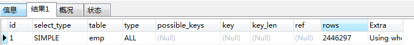
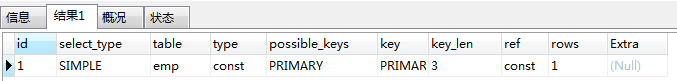

## 建立适当的索引

说起提高数据库性能，索引是最物美价廉的东西了。不用加内存，不用改程序，不用调 sql，只要执行个正确的'create index'，查询速度就可能提高百倍千倍，这可真有诱惑力。可是天下没有免费的午餐，查询速度的提高是以插入、更新、删除的速度为代价的，这些写操作，增加了大量的 I/O。

是不是建立一个索引就能解决所有的问题?ename 上没有建立索引会怎样?

```
UPDATE emp set ename='zhangsan' where empno=100002;
select * from emp where ename='zhangsan';
```

我 emp 表中有 2446297 条记录，empno 创建索引前，执行查询花了 16 秒钟，进行了全表扫描

```
explain SELECT * from emp where empno=100002;
```



---测试案例命令如下 (最好以 select \* from emp e,dept d where e.empno=123451 )

\*添加主键

```
ALTER TABLE emp ADD PRIMARY KEY(empno);
```

再执行查询，执行时间显示 0，用 explain 分析



\*删除主键

```
alter table emp drop primary key;
```

## 索引的原理说明

没有索引为什么会慢?

使用索引为什么会快?

btree 类型的索引，就是使用的二分查找法，肯定快啊，算法复杂度是 log2N，也就是说 16 条数据查 4 次，32 条数据查 5 次，64 条数据查 6 次....依次类推。

使用索引跟没使用索引的区别，就跟我们使用新华字典查字，一个是根据拼音或者笔画查找，一个是从头到尾一页一页翻。

**索引的代价**

1、磁盘占用

2、对 dml(update delete insert)语句的效率影响

btree 方式检索，算法复杂度： log2N 次数


## 哪些列上适合添加索引

1、较频繁的作为查询条件字段应该创建索引

```
select * from emp where empno = 1;
```

2、唯一性太差的字段不适合单独创建索引，即使频繁作为查询条件

```
   select * from emp where sex = '男'
```

3、更新非常频繁的字段不适合创建索引

```
select * from emp where logincount = 1
```

4、不会出现在 WHERE 子句中的字段不该创建索引

## 索引的类型

- 主键索引，主键自动的为主索引 (类型 Primary)
- 唯一索引 (UNIQUE)
- 普通索引 (INDEX)
- 全文索引 (FULLTEXT) [适用于 MyISAM] ——》sphinx + 中文分词 coreseek [sphinx 的中文版 ]
- 综合使用=>复合索引

**简述 mysql 四种索引的区别**

PRIMARY 索引 =》在主键上自动创建

UNIQUE 索引=> 只要是 UNiQUE 就是 Unique 索引.(只能在字段内容不重复的情况下，才能创建唯一索引)

INDEX 索引=>就是普通索引

FULLTEXT => 只在 MYISAM 存储引擎支持, 目的是全文索引，在内容系统中用的多， 在全英文网站用多(英文词独立). 中文数据不常用，意义不大，国内全文索引通常使用 sphinx 来完成,全文索引只能在 char varchar text 字段创建.

**全文索引案例**

1.创建表

```
create table news(id int , title varchar(32),con varchar(1024)) engine=MyISAM;
```

2.建立全文索引

```
create fulltext index ful_inx on news (con);
```

3.插入数据

这里要注意，对于常见的英文 fulltext 不会匹配，而且插入的语句本身是正确的.

'but it often happens that they are not above supporting themselves by dishonest means.which should be more disreputable.Cultivate poverty like a garden herb'

4.看看匹配度

```
mysql> select match(con) against('poverty') from news;

+-------------------------------+

| match(con) against('poverty') |

+-------------------------------+

|                             0 |

|                             0 |

|                             0 |

|            0.9853024482727051 |

+-------------------------------+
```

0 表示没有匹配到，或者你的词是停止词，是不会建立索引的.

使用全文索引,不能使用 like 语句，这样就不会使用到全文索引了.

**复合索引**

```
create index 索引名 on 表名(列1，列2);
```

## 索引的使用

**建立索引**

```
create [UNIQUE|FULLTEXT]  index index_name on tbl_name (col_name [(length)] [ASC | DESC] , …..);
alter table table_name ADD INDEX [index_name]  (index_col_name,...)
```

添加主键(索引) ALTER TABLE 表名 ADD PRIMARY KEY(列名,..); 联合主键

**删除索引**

```
DROP INDEX index_name ON tbl_name;
alter table table_name drop index index_name;
```

删除主键(索引)比较特别: alter table t_b drop primary key;

查询索引(均可)

```
show index(es) from table_name;
show keys from table_name;
desc table_Name;
```

修改索引，我们一般是先删除再重新创建.

查询要使用索引最重要的条件是查询条件中需要使用索引。

下列几种情况下有可能使用到索引：
1，对于创建的多列索引，只要查询条件使用了最左边的列，索引一般就会被使用。
2，对于使用 like 的查询，查询如果是 '%aaa' 不会使用到索引， 'aaa%' 会使用到索引。

下列的表将不使用索引：
1，如果条件中有 or，即使其中有条件带索引也不会使用。
2，对于多列索引，不是使用的第一部分，则不会使用索引。
3，like 查询是以%开头
4，如果列类型是字符串，那一定要在条件中将数据使用引号引用起来。否则不使用索引。(添加时,字符串必须'')
5，如果 mysql 估计使用全表扫描要比使用索引快，则不使用索引。

测试案例(就在前面的 dept 表上做演示.)

```
CREATE TABLE dept(
deptno MEDIUMINT   UNSIGNED  NOT NULL  DEFAULT 0,
dname VARCHAR(20)  NOT NULL  DEFAULT "",
loc VARCHAR(13) NOT NULL DEFAULT ""
) ENGINE=MyISAM DEFAULT CHARSET=utf8 ;
```

--放入数据，前面应该已经添加了，如果没有则需要重新添加

--测试开始.

添加一个主键索引

```
alter table dept add primary key (deptno)
```

--测试语句

```
explain select * from dept where deptno=1;
```

结果是:

```
mysql> explain select * from dept where deptno=1;
*************************** 1. row ***************************
           id: 1
  select_type: SIMPLE
        table: dept
         type: const
possible_keys: PRIMARY
          key: PRIMARY
      key_len: 3
          ref: const
         rows: 1
        Extra:
1 row in set (0.00 sec)
```

--创建多列索引

```
alter table dept add index myind (dname,loc);
```

--证明对于创建的多列索引，只要查询条件使用了最左边的列，索引一般就会被使用

explain select \* from dept where dname='研发部'; 会显示使用到了索引 myind

explain select \* from dept where loc='MsBDpMRX'; 不会显示使用到了索引 myind

--对于使用 like 的查询

explain select \* from dept where dname like '%研发部'; 不会显示使用到了索引 myind

explain select \* from dept where dname like '研发部%'; 会显示使用到了索引 myind

--如果条件中有 or，即使其中有条件带索引也不会使用

--为了演示，我们把复合索引删除，然后只在 dname 上加入索引.

```
alter table dept drop index myind
alter table dept add index myind (dname)
explain select * from dept where dname='研发部' or loc='aa';-- 就不会使用到dname列上的
```

--如果列类型是字符串，那一定要在条件中将数据使用引号引用起来。否则不使用索引

select \* from dept from dname=1234; //不会使用到索引

select \* from dept from dname='1234'; //会使用到索引

查看索引的使用情况
show status like 'Handler_read%';
大家可以注意：
handler_read_key:这个值越高越好，越高表示使用索引查询到的次数。

handler_read_rnd_next:这个值越高，说明查询低效。

\* 这时我们会看到 handler_read_rnd_next 值很高，为什么,这是因为我们前面没有加索引的时候，做过多次查询的原因.

## 常用 SQL 优化

大批量插入数据(MySql 管理员) 了解
对于 MyISAM：

```
alter table table_name disable keys;
loading data//insert语句;
alter table table_name enable keys;
```

对于 Innodb：
1，将要导入的数据按照主键排序
2，set unique_checks=0,关闭唯一性校验。
3，set autocommit=0,关闭自动提交。

**优化 group by 语句**
默认情况，MySQL 对所有的 group by col1,col2 进行排序。这与在查询中指定 order by col1, col2 类似。如果查询中包括 group by 但用户想要避免排序结果的消耗，则可以使用 order by null 禁止排序

有些情况下，可以使用连接来替代子查询。
因为使用 join，MySQL 不需要在内存中创建临时表。(讲解)

如果想要在含有 or 的查询语句中利用索引，则 or 之间的每个条件列都必须用到索引，如果没有索引，则应该考虑增加索引(与环境相关 讲解)

select \* from 表名 where 条件 1='' or 条件 2='tt'

explain select \* from dept group by dname; =>这时显示 extra: using filesort 说明会进行排序

explain select \* from dept group by dname order by null =>这时不含有显示 extra: using filesort 说明不会进行排序

\*\*\*有些情况下，可以使用连接来替代子查询。因为使用 join，MySQL 不需要在内存中创建临时表。

explain select \* from emp , dept where emp.deptno=dept.deptno;

和下面比较就可以说明问题!!

explain select \* from emp left join dept on emp.deptno=dept.deptno;

## 选择合适的存储引擎

**MyISAM：**Mysql5.5 默认的 MySQL 存储引擎。如果应用是以读操作和插入操作为主，只有很少的更新和删除操作，并且对事务的完整性要求不是很高。其优势是访问的速度快。

**InnoDB：**Mysql5.6 默认的 MySQL 存储引擎，提供了具有提交、回滚和崩溃恢复能力的事务安全。但是对比 MyISAM，写的处理效率差一些并且会占用更多的磁盘空间。

**Memory：**数据存在内存中，服务重启时，数据丢失

**MyISAM：** 在插入数据时，默认放在最后. ,删除数据后，空间不回收.(不支持事务和外键)

InnoDB 支持事务和外键

对应我们程序员说，常用的存储引擎主要是 myisam / innodb / memory,heap 表

如果选用小原则:

1.如果追求速度，不在乎数据是否一直保存，也不考虑事务，请选择 memory 比如存放用户在线状态.

2.如果表的数据要持久保存，应用是以读操作和插入操作为主，只有很少的更新和删除操作，并且对事务的完整性要求不是很高。选用 MyISAM

3.如果需要数据持久保存，并提供了具有提交、回滚和崩溃恢复能力的事务安全,请选用 Innodb

## 选择合适的数据类型

在精度要求高的应用中，建议使用定点数来存储数值，以保证结果的准确性。能用 deciaml 就不要用 float

对于存储引擎是 MyISAM 的数据库,如果经常做删除和修改记录的操作，要定时执行 optimize table table_name;功能对表进行碎片整理。

日期类型要根据实际需要选择能够满足应用的最小存储的早期类型

create table bbs(id int ,con varchar(1024) , pub_time int);

date('Ymd',时间-3*24*60\*60); 2038 年-1-19

对于使用浮点数和定点数的案例说明

create table temp1( t1 float(10,2), t2 decimal(10,2));

insert into temp1 values(1000000.32,1000000,32); 发现 t1 成了 1000000.31 所以有问题.

对于 optimize table 表名 演示

```sql
create table temp2( id int) engine=MyISAM;
insert into temp2 values(1); insert into temp2 values(2); insert into temp2 values(3);
insert into temp2 select * from temp2;--复制
delete from temp2 where id=1; --发现该表对应的数据文件没有变小
```

定期执行 optimize table temp2 发现表大小变化，碎片整理完毕

对于 InnoDB 它的数据会存在 data/ibdata1 目录下，在 data/数据库/只有一个 \*.frm 表结构文件.

---
参考文献
https://www.cnblogs.com/jiekzou/p/5380073.html

---
[MySQL 性能优化一](http://kl7v8u.coding-pages.com/java_note/javaEE/MySQL/MySQL%E6%80%A7%E8%83%BD%E4%BC%98%E5%8C%96%E4%B8%80.html#mysql-%E6%95%B0%E6%8D%AE%E5%BA%93%E7%9A%84%E4%BC%98%E5%8C%96%E6%8A%80%E6%9C%AF)

[MySQL 性能优化三](http://kl7v8u.coding-pages.com/java_note/javaEE/MySQL/MySQL%E6%80%A7%E8%83%BD%E4%BC%98%E5%8C%96%E4%B8%89.html#%E5%AF%B9%E8%A1%A8%E8%BF%9B%E8%A1%8C%E6%B0%B4%E5%B9%B3%E5%88%92%E5%88%86)
