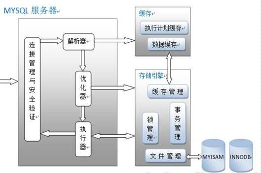
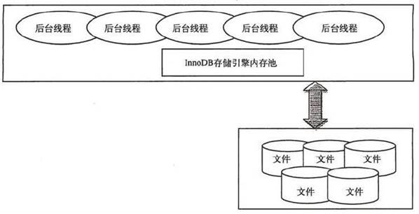

### Mysql 数据库架构图

MyISAM 和 InnoDB 是最常见的两种存储引擎，特点如下。

MyISAM 存储引擎

MyISAM 是 MySQL 官方提供默认的存储引擎，其特点是不支持事务、表锁和全文索引，对于一些 OLAP（联机分析处理）系统，操作速度快。

每个 MyISAM 在磁盘上存储成三个文件。文件名都和表名相同，扩展名分别是.frm（存储表定义）、.MYD (MYData，存储数据)、.MYI (MYIndex，存储索引)。这里特别要注意的是 MyISAM 不缓存数据文件，只缓存索引文件。InnoDB 存储引擎

InnoDB 存储引擎支持事务，主要面向 OLTP（联机事务处理过程）方面的应用，其特点是行锁设置、支持外键， 并支持类似于 Oracle 的非锁定读，即默认情况下读不产生锁。InnoDB 将数据放在一个逻辑表空间中（类似 Oracle）。InnoDB 通过多版本并发控制来获得高并发性，实现了 ANSI 标准的 4 种隔离级别，默认为 Repeatable，使用一种被称为 next-key locking 的策略避免幻读。

对于表中数据的存储，InnoDB 采用类似 Oracle 索引组织表 Clustered 的方式进行存储。

InnoDB 存储引擎提供了具有提交、回滚和崩溃恢复能力的事务安全。但是对比 Myisam 的存储引擎，InnoDB 写的处理效率差一些并且会占用更多的磁盘空间以保留数据和索引。

InnoDB 体系架构

### Mysql 架构器中各个模块都是什么？

#### （1） 连接管理与安全验证是什么？

每个客户端都会建立一个与服务器连接的线程，服务器会有一个线程池来管理这些连接；如果客户端需要连接到 MYSQL 数据库还需要进行验证，包括用户名、密码、主机信息等。

#### （2） 解析器是什么？

解析器的作用主要是分析查询语句，最终生成解析树；首先解析器会对查询语句的语法进行分析，分析语法是否有问题。还有解析器会查询缓存，如果在缓存中有对应的语句，就返回查询结果不进行接下来的优化执行操作。前提是缓存中的数据没有被修改，当然如果被修改了也会被清出缓存。

#### （3） 优化器怎么用？

优化器的作用主要是对查询语句进行优化操作，包括选择合适的索引，数据的读取方式，包括获取查询的开销信息，统计信息等，这也是为什么图中会有优化器指向存储引擎的箭头。之前在别的文章没有看到优化器跟存储引擎之间的关系，在这里我个人的理解是因为优化器需要通过存储引擎获取查询的大致数据和统计信息。

#### （4） 执行器是什么？

执行器包括执行查询语句，返回查询结果，生成执行计划包括与存储引擎的一些处理操作。
