## Nosql 概述

### 为什么要用 Nosql

### 1、单机 MySQL 的年代！

90 年代，一个基本的网站访问量一般不会太大，单个数据库完全足够！ 那个时候，更多的去使用静态网页 Html ~ 服务器根本没有太大的压力！ 思考一下，这种情况下：整个网站的瓶颈是什么？
1、数据量如果太大、一个机器放不下了！
2、数据的索引 （B+ Tree），一个机器内存也放不下
3、访问量（读写混合），一个服务器承受不了~
只要你开始出现以上的三种情况之一，那么你就必须要晋级！

### 2、Memcached（缓存） + MySQL + 垂直拆分 （读写分离）

网站 80%的情况都是在读，每次都要去查询数据库的话就十分的麻烦！所以说我们希望减轻数据的压 力，我们可以使用缓存来保证效率！
发展过程： 优化数据结构和索引--> 文件缓存（IO）---> Memcached（当时最热门的技术！）


### 3、分库分表 + 水平拆分 + MySQL 集群

技术和业务在发展的同时，对人的要求也越来越高！

**==本质：数据库（读，写）==**
早些年 MyISAM： 表锁，十分影响效率！高并发下就会出现严重的锁问题转战 Innodb：行锁
慢慢的就开始使用分库分表来解决写的压力！ MySQL 在哪个年代推出 了表分区！这个并没有多少公司使用！
MySQL 的 集群，很好满足哪个年代的所有需求！


### 4、如今最近的年代

2010--2020 十年之间，世界已经发生了翻天覆地的变化；（定位，也是一种数据，音乐，热榜！）
MySQL 等关系型数据库就不够用了！数据量很多，变化很快~！
MySQL 有的使用它来村粗一些比较大的文件，博客，图片！数据库表很大，效率就低了！如果有一种数据库来专门处理这种数据,
MySQL 压力就变得十分小（研究如何处理这些问题！）大数据的 IO 压力下，表几乎没法更大！

### 目前一个基本的互联网项目


### 为什么要用 NoSQL

用户的个人信息，社交网络，地理位置。用户自己产生的数据，用户日志等等爆发式增长！ 这时候我们就需要使用 NoSQL 数据库的，Nosql 可以很好的处理以上的情况！

### 什么是 NoSQL

NoSQL = Not Only SQL （不仅仅是 SQL） 关系型数据库：表格 ，行 ，列
泛指非关系型数据库的，随着 web2.0 互联网的诞生！传统的关系型数据库很难对付 web2.0 时代！尤其 是超大规模的高并发的社区！ 暴露出来很多难以克服的问题，NoSQL 在当今大数据环境下发展的十分迅速，Redis 是发展最快的，而且是我们当下必须要掌握的一个技术！
很多的数据类型用户的个人信息，社交网络，地理位置。这些数据类型的存储不需要一个固定的格式！ 不需要多月的操作就可以横向扩展的 ！ Map<String,Object> 使用键值对来控制！

#### NoSQL 特点

解耦！
1、方便扩展（数据之间没有关系，很好扩展！）
2、大数据量高性能（Redis 一秒写 8 万次，读取 11 万，NoSQL 的缓存记录级，是一种细粒度的缓存，性能会比较高！）
3、数据类型是多样型的！（不需要事先设计数据库！随取随用！如果是数据量十分大的表，很多人就无 法设计了！）
4、传统 RDBMS 和 NoSQL

#### 传统的 RDBMS

- 结构化组织

- SQL

- 数据和关系都存在单独的表中 row col

- 操作操作，数据定义语言

- 严格的一致性
- 基础的事务

- .....

#### Nosql

- 不仅仅是数据

- 没有固定的查询语言

- 键值对存储，列存储，文档存储，图形数据库（社交关系）

- 最终一致性，

- CAP 定理和 BASE （异地多活） 初级架构师！（狂神理念：只要学不死，就往死里学！）

- 高性能，高可用，高可扩

- ....

大数据时代的 3V：主要是描述问题的

1. 海量 Volume

2. 多样 Variety

3. 实时 Velocity

大数据时代的 3 高：主要是对程序的要求

1. 高并发
2. 高可扩
3. 高性能

真正在公司中的实践：NoSQL + RDBMS 一起使用才是最强的，阿里巴巴的架构演进！ 技术没有高低之分，就看你如何去使用！（提升内功，思维的提高！）

阿里巴巴演进分析

思考问题：这么多东西难道都是在一个数据库中的吗?


技术急不得，越是慢慢学，才能越扎实！ 开源才是技术的王道！
任何一家互联网的公司，都不可能只是简简单单让用户能用就好了！
大量公司做的都是相同的业务；（竞品协议）
随着这样的竞争，业务是越来越完善，然后对于开发者的要求也是越来越高！

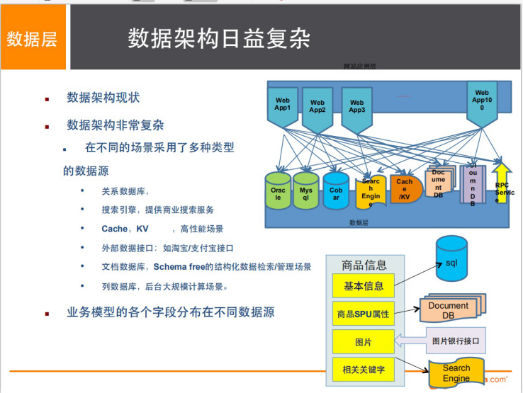

如果你未来相当一个架构师： 没有什么是加一层解决不了的！

1. 商品的基本信息

名称、价格、商家信息；

关系型数据库就可以解决了！ MySQL / Oracle （淘宝早年就去 IOE 了！- 王坚：推荐文章：阿里云的这群疯子：40 分钟重要！）

淘宝内部的 MySQL 不是大家用的 MySQL

2. 商品的描述、评论（文字比较多） 文档型数据库中，MongoDB

3. 图片

分布式文件系统 FastDFS

- 淘宝自己的 TFS

- Gooale 的 GFS

- Hadoop HDFS

- 阿里云的 oss

4. 商品的关键字 （搜索）

- 搜索引擎 solr elasticsearch

- ISerach：多隆（多去了解一下这些技术大佬！）

5. 商品热门的波段信息

- 内存数据库

- Redis Tair、Memache...

6. 商品的交易，外部的支付接口

- 三方应用

要知道，一个简单地网页背大型互联网应用问题后的技术一定不是大家所想的那么简单！

- 数据类型太多了！
- 数据源繁多，经常重构！ 数据要改造，大面积改造？

解决问题：

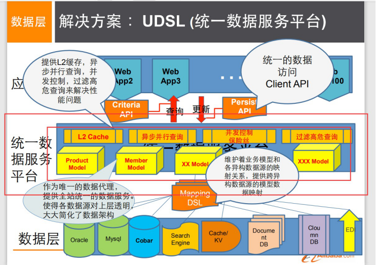

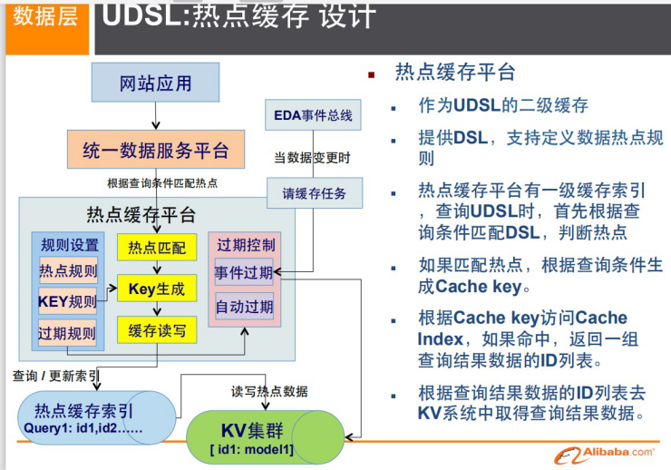

这里以上都是 NoSQL 入门概述，不仅能够提高大家的知识，还可以帮助大家了解大厂的工作内容！

NoSQL 的四大分类

KV 键值对：

- 新浪：Redis
- 美团：Redis + Tair
- 阿里、百度：Redis + memecache
  文档型数据库（bson 格式 和 json 一样）：
- MongoDB （一般必须要掌握）
- ConthDB
  1. MongoDB 是一个基于分布式文件存储的数据库，C++ 编写，主要用来处理大量的文档！ MongoDB 是一个介于关系型数据库和非关系型数据中中间的产品！
  2. MongoDB 是非关系型数据库中功能最丰富，最像关系型数据库的！

**列存储数据库**

- HBase
- 分布式文件系统

**图关系数据库**

- 他不是存图形，放的是关系，比如：朋友圈社交网络，广告推荐！
- Neo4j，InfoGrid；

**四者区别**


## Redis 入门

### 概述

Redis（Remote Dictionary Server )，即远程字典服务 !
是一个开源的使用 ANSI C 语言编写、支持网络、可基于内存亦可持久化的日志型、Key-Value 数据库， 并提供多种语言的 API。


redis 会周期性的把更新的数据写入磁盘或者把修改操作写入追加的记录文件，并且在此基础上实现了 master-slave(主从)同步。
免费和开源！是当下最热门的 NoSQL 技术之一！也被人们称之为结构化数据库！

1. 内存存储、持久化，内存中是断电即失、所以说持久化很重要（rdb、aof）
2. 效率高，可以用于高速缓存
3. 发布订阅系统
4. 地图信息分析
5. 计时器、计数器（浏览量！）
6. ........

特性

1. 多样的数据类型
2. 持久化
3. 集群
4. 事务
   ......

学习中需要用到的东西

1. 官网：https://redis.io/
2. 中文网：http://www.redis.cn/

下载地址：通过官网下载即可！


**注意：Windows 在 Github 上下载（停更很久了！）**
Redis 推荐都是在 Linux 服务器上搭建的，我们是基于 Linux 学习！

Linux 安装

1、下载安装包！`redis-5.0.8.tar.gz`
2、解压 Redis 的安装包！ 程序/opt


3、进入解压后的文件，可以看到我们 redis 的配置文件


4、基本的环境安装

```
yum install gcc-c++


make


make install
```


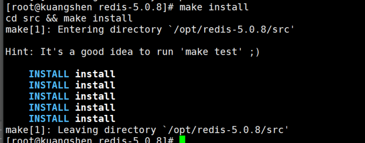

5、redis 的默认安装路径

/usr/local/bin

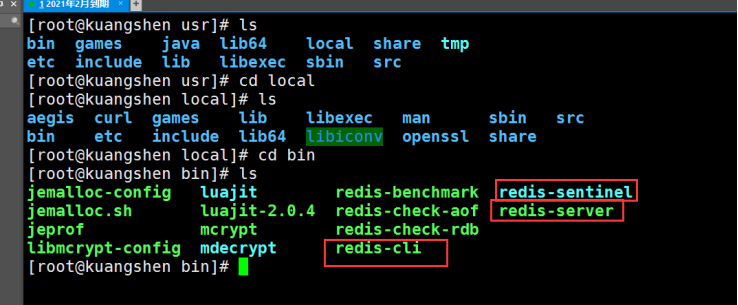

6、将 redis 配置文件。复制到我们当前目录下

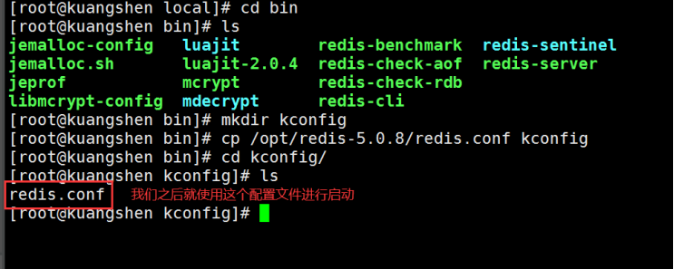

7、redis 默认不是后台启动的，修改配置文件！

8、启动 Redis 服务！


9、使用 redis-cli 进行连接测试！

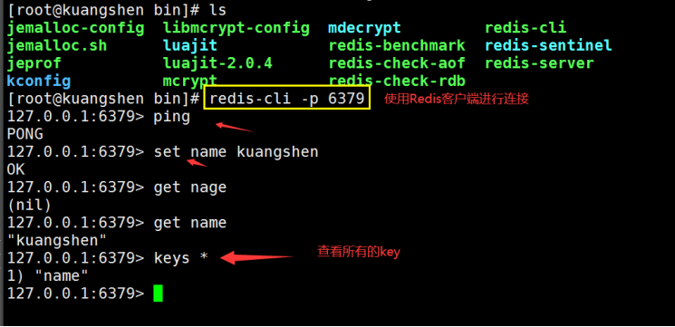

10、查看 redis 的进程是否开启！


11、如何关闭 Redis 服务呢？


12、再次查看进程是否存在


13、后面我们会使用单机多 Redis 启动集群测试！

测试性能

redis-benchmark 是一个压力测试工具！ 官方自带的性能测试工具！
redis-benchmark 命令参数！
图片来自菜鸟教程：


我们来简单测试下：

```
# 测试：100个并发连接	100000请求
redis-benchmark -h localhost -p 6379 -c 100 -n 100000
```

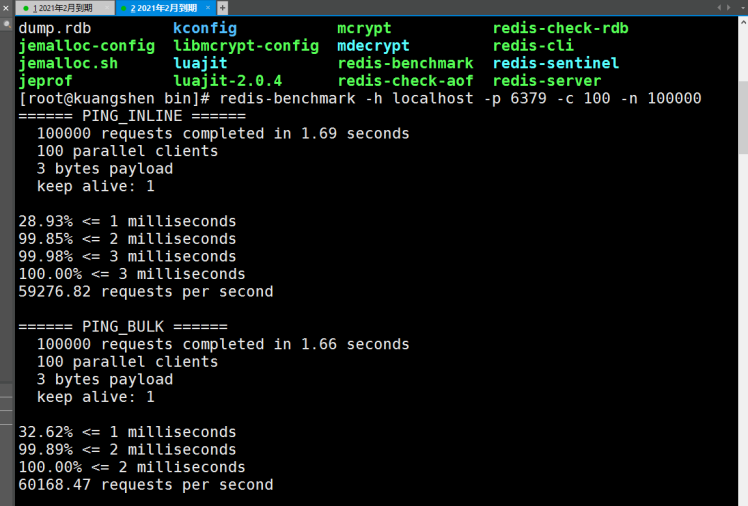

如何查看这些分析呢？


基础的知识

redis 默认有 16 个数据库

默认使用的是第 0 个

可以使用 select 进行切换数据库！

```
127.0.0.1:6379> select 3	# 切换数据库
OK
127.0.0.1:6379[3]> DBSIZE	# 查看DB大小！
(integer) 0
```

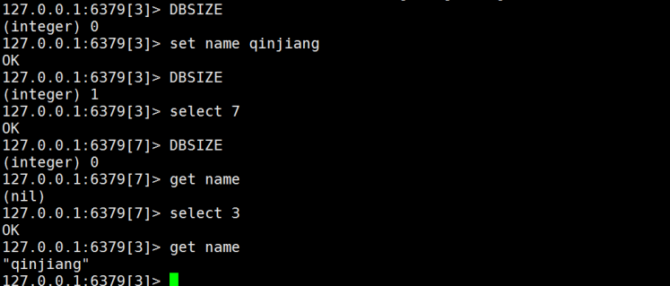

```
127.0.0.1:6379[3]> keys *	# 查看数据库所有的key
1) "name"
```

清除当前数据库`flushdb`
清除全部数据库的内容`FLUSHALL`

```
127.0.0.1:6379[3]> flushdb OK
127.0.0.1:6379[3]> keys *
(empty list or set)
```

思考：为什么 redis 是 6379！粉丝效应！（了解一下即可！）

### redis 是单线程

明白 Redis 是很快的，官方表示，Redis 是基于内存操作，CPU 不是 Redis 性能瓶颈，Redis 的瓶颈是根据 机器的内存和网络带宽，既然可以使用单线程来实现，就使用单线程了！所有就使用了单线程了！
Redis 是 C 语言写的，官方提供的数据为 100000+ 的 QPS，完全不比同样是使用 key-vale 的 Memecache 差！

#### Redis 为什么单线程还这么快？

1、误区 1：高性能的服务器一定是多线程的？
2、误区 2：多线程（CPU 上下文会切换！）一定比单线程效率高！ 先去 CPU>内存>硬盘的速度要有所了解！
核心：redis 是将所有的数据全部放在内存中的，所以说使用单线程去操作效率就是最高的，多线程
（CPU 上下文会切换：耗时的操作！！！），对于内存系统来说，如果没有上下文切换效率就是最高 的！多次读写都是在一个 CPU 上的，在内存情况下，这个就是最佳的方案！

### 五大数据类型

> 官方文档

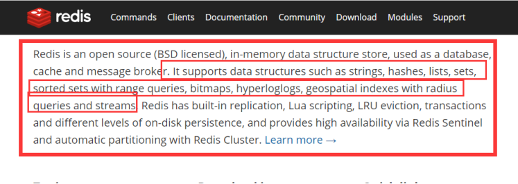

全段翻译：
Redis 是一个开源（BSD 许可）的，内存中的数据结构存储系统，它可以用作==数据库==、==缓存==和==消息中间件 MQ==。 它支持多种类型的数据结构，如 字符串（strings）， 散列（hashes）， 列表（lists）， 集合
（sets）， 有序集合（sorted sets） 与范围查询， bitmaps， hyperloglogs 和 地理空间
（geospatial） 索引半径查询。 Redis 内置了 复制（replication），LUA 脚本（Lua scripting）， LRU 驱动事件（LRU eviction），事务（transactions） 和不同级别的 磁盘持久化（persistence）， 并通过 Redis 哨兵（Sentinel）和自动 分区（Cluster）提供高可用性（high availability）。

### **Redis-Key**

```sql
127.0.0.1:6379> keys * # 查看所有的key
(empty list or set)
127.0.0.1:6379> set name kuangshen # set key
OK
127.0.0.1:6379> keys *
1) "name"
127.0.0.1:6379> set age 1
OK
127.0.0.1:6379> keys *
1) "age"
2) "name"
127.0.0.1:6379> EXISTS name # 判断当前的key是否存在
(integer) 1
127.0.0.1:6379> EXISTS name1
(integer) 0
127.0.0.1:6379> move name 1 # 移除当前的key
(integer) 1
127.0.0.1:6379> keys *
1) "age"
127.0.0.1:6379> set name qinjiang
OK
127.0.0.1:6379> keys *
1) "age"
2) "name"
127.0.0.1:6379> clear
127.0.0.1:6379> keys *
1) "age"
2) "name"
127.0.0.1:6379> get name
"qinjiang"
127.0.0.1:6379> EXPIRE name 10 # 设置key的过期时间，单位是秒
(integer) 1
127.0.0.1:6379> ttl name # 查看当前key的剩余时间
(integer) 4
127.0.0.1:6379> ttl name
(integer) 3
127.0.0.1:6379> ttl name
(integer) 2
127.0.0.1:6379> ttl name
(integer) 1
127.0.0.1:6379> ttl name
(integer) -2
127.0.0.1:6379> get name
(nil)
127.0.0.1:6379> type name # 查看当前key的一个类型！
string
127.0.0.1:6379> type age
string
```

### string(字符串)

90% 的 java 程序员使用 redis 只会使用一个 String 类型！

```sql
##########################################################################
127.0.0.1:6379> set key1 v1 # 设置值
OK
127.0.0.1:6379> get key1 # 获得值
"v1"
127.0.0.1:6379> keys * # 获得所有的key
1) "key1"
127.0.0.1:6379> EXISTS key1 # 判断某一个key是否存在
(integer) 1
127.0.0.1:6379> APPEND key1 "hello" # 追加字符串，如果当前key不存在，就相当于setkey
(integer) 7
127.0.0.1:6379> get key1
"v1hello"
127.0.0.1:6379> STRLEN key1 # 获取字符串的长度！
(integer) 7
127.0.0.1:6379> APPEND key1 ",kaungshen"
(integer) 17
127.0.0.1:6379> STRLEN key1
(integer) 17
127.0.0.1:6379> get key1
"v1hello,kaungshen"


##########################################################################
# i++
# 步长 i+=
127.0.0.1:6379> set views 0 # 初始浏览量为0
OK
127.0.0.1:6379> get views
"0"
127.0.0.1:6379> incr views # 自增1 浏览量变为1
(integer) 1
127.0.0.1:6379> incr views
(integer) 2
127.0.0.1:6379> get views
"2"
127.0.0.1:6379> decr views # 自减1 浏览量-1
(integer) 1
127.0.0.1:6379> decr views
(integer) 0
127.0.0.1:6379> decr views
(integer) -1
127.0.0.1:6379> get views
"-1"
127.0.0.1:6379> INCRBY views 10 # 可以设置步长，指定增量！
(integer) 9
127.0.0.1:6379> INCRBY views 10
(integer) 19
127.0.0.1:6379> DECRBY views 5
bilibili：狂神说Java(integer) 14


##########################################################################
# 字符串范围 range
127.0.0.1:6379> set key1 "hello,kuangshen" # 设置 key1 的值
OK
127.0.0.1:6379> get key1
"hello,kuangshen"
127.0.0.1:6379> GETRANGE key1 0 3 # 截取字符串 [0,3]
"hell"
127.0.0.1:6379> GETRANGE key1 0 -1 # 获取全部的字符串 和 get key是一样的
"hello,kuangshen"
# 替换！
127.0.0.1:6379> set key2 abcdefg
OK
127.0.0.1:6379> get key2
"abcdefg"
127.0.0.1:6379> SETRANGE key2 1 xx # 替换指定位置开始的字符串！
(integer) 7
127.0.0.1:6379> get key2
"axxdefg"


##########################################################################
# setex (set with expire) # 设置过期时间
# setnx (set if not exist) # 不存在在设置 （在分布式锁中会常常使用！）
127.0.0.1:6379> setex key3 30 "hello" # 设置key3 的值为 hello,30秒后过期
OK
127.0.0.1:6379> ttl key3
(integer) 26
127.0.0.1:6379> get key3
"hello"
127.0.0.1:6379> setnx mykey "redis" # 如果mykey 不存在，创建mykey
(integer) 1
127.0.0.1:6379> keys *
1) "key2"
2) "mykey"
3) "key1"
127.0.0.1:6379> ttl key3
(integer) -2
127.0.0.1:6379> setnx mykey "MongoDB" # 如果mykey存在，创建失败！
(integer) 0
127.0.0.1:6379> get mykey
"redis"


##########################################################################
mset
mget
127.0.0.1:6379> mset k1 v1 k2 v2 k3 v3 # 同时设置多个值
OK
127.0.0.1:6379> keys *
1) "k1"
2) "k2"
3) "k3"
127.0.0.1:6379> mget k1 k2 k3 # 同时获取多个值
1) "v1"
2) "v2"
3) "v3"
bilibili：狂神说Java数据结构是相同的！
String类似的使用场景：value除了是我们的字符串还可以是我们的数字！
计数器
统计多单位的数量
粉丝数
对象缓存存储！
List（列表）
基本的数据类型，列表
127.0.0.1:6379> msetnx k1 v1 k4 v4 # msetnx 是一个原子性的操作，要么一起成功，要么一起
失败！
(integer) 0
127.0.0.1:6379> get k4
(nil)
# 对象
set user:1 {name:zhangsan,age:3} # 设置一个user:1 对象 值为 json字符来保存一个对象！
# 这里的key是一个巧妙的设计： user:{id}:{filed} , 如此设计在Redis中是完全OK了！
127.0.0.1:6379> mset user:1:name zhangsan user:1:age 2
OK
127.0.0.1:6379> mget user:1:name user:1:age
1) "zhangsan"
2) "2"


##########################################################################
getset # 先get然后在set
127.0.0.1:6379> getset db redis # 如果不存在值，则返回 nil
(nil)
127.0.0.1:6379> get db
"redis
127.0.0.1:6379> getset db mongodb # 如果存在值，获取原来的值，并设置新的值
"redis"
127.0.0.1:6379> get db
"mongodb"
```

数据结构是相同的！
String 类似的使用场景：value 除了是我们的字符串还可以是我们的数字！

- 计数器
- 统计多单位的数量粉丝数
- 对象缓存存储！

List（列表）

基本的数据类型，列表


在 redis 里面，我们可以把 list 玩成 ，栈、队列、阻塞队列！ 所有的 list 命令都是用 l 开头的，Redis 不区分大小命令

```sql
##########################################################################
127.0.0.1:6379> LPUSH list one	# 将一个值或者多个值，插入到列表头部 （左）
(integer) 1
127.0.0.1:6379> LPUSH list two
(integer) 2
127.0.0.1:6379> LPUSH list three (integer) 3
127.0.0.1:6379> LRANGE list 0 -1	# 获取list中值！
1)"three"
2)"two"
3)"one"
127.0.0.1:6379> LRANGE list 0 1	# 通过区间获取具体的值！
1)"three"
2)"two"
127.0.0.1:6379> Rpush list righr	# 将一个值或者多个值，插入到列表位部 （右）
(integer) 4
127.0.0.1:6379> LRANGE list 0 -1
1)"three"
2)"two"
3)"one"
4)"righr"


########################################################################## LPOP
RPOP
127.0.0.1:6379> LRANGE list 0 -1
1)"three"
2)"two"
3)"one"
4)"righr"
127.0.0.1:6379> Lpop list	# 移除list的第一个元素
"three"
127.0.0.1:6379> Rpop list	# 移除list的最后一个元素
"righr"
127.0.0.1:6379> LRANGE list 0 -1
1)"two"
2)"one"


########################################################################## Lindex

127.0.0.1:6379> LRANGE list 0 -1
1)"two"
2)"one"
127.0.0.1:6379> lindex list 1	# 通过下标获得 list 中的某一个值！
"one"
127.0.0.1:6379> lindex list 0 "two"


##########################################################################
Llen


127.0.0.1:6379> Lpush list one (integer) 1
127.0.0.1:6379> Lpush list two

(integer) 2
127.0.0.1:6379> Lpush list three (integer) 3
127.0.0.1:6379> Llen list	# 返回列表的长度
(integer) 3


##########################################################################
移除指定的值！ 取关	uid

Lrem
127.0.0.1:6379> LRANGE list 0 -1
1)"three"
2)"three"
3)"two"
4)"one"
127.0.0.1:6379> lrem list 1 one	# 移除list集合中指定个数的value，精确匹配
(integer) 1
127.0.0.1:6379> LRANGE list 0 -1
1)"three"
2)"three"
3)"two"
127.0.0.1:6379> lrem list 1 three
(integer) 1
127.0.0.1:6379> LRANGE list 0 -1
1)"three"
2)"two"
127.0.0.1:6379> Lpush list three (integer) 3
127.0.0.1:6379> lrem list 2 three
(integer) 2
127.0.0.1:6379> LRANGE list 0 -1
1) "two"


##########################################################################
trim 修剪。； list 截断!


127.0.0.1:6379> keys *
(empty list or set)
127.0.0.1:6379> Rpush mylist "hello" (integer) 1
127.0.0.1:6379> Rpush mylist "hello1" (integer) 2
127.0.0.1:6379> Rpush mylist "hello2" (integer) 3
127.0.0.1:6379> Rpush mylist "hello3" (integer) 4
127.0.0.1:6379> ltrim mylist 1 2	# 通过下标截取指定的长度，这个list已经被改变了，截断了
只剩下截取的元素！
OK
127.0.0.1:6379> LRANGE mylist 0 -1
1)"hello1"
2)"hello2"


##########################################################################
rpoplpush # 移除列表的最后一个元素，将他移动到新的列表中！

127.0.0.1:6379> rpush mylist "hello"

(integer) 1
127.0.0.1:6379> rpush mylist "hello1" (integer) 2
127.0.0.1:6379> rpush mylist "hello2" (integer) 3
127.0.0.1:6379> rpoplpush mylist myotherlist	# 移除列表的最后一个元素，将他移动到新的
列表中！
"hello2"
127.0.0.1:6379> lrange mylist 0 -1 # 查看原来的列表
1)"hello"
2)"hello1"
127.0.0.1:6379> lrange myotherlist 0 -1	# 查看目标列表中，确实存在改值！
1) "hello2"


##########################################################################
lset	将列表中指定下标的值替换为另外一个值，更新操作127.0.0.1:6379> EXISTS list	# 判断这个列表是否存在(integer) 0
127.0.0.1:6379> lset list 0 item	# 如果不存在列表我们去更新就会报错
(error) ERR no such key 127.0.0.1:6379> lpush list value1 (integer) 1
127.0.0.1:6379> LRANGE list 0 0
1) "value1"
127.0.0.1:6379> lset list 0 item	# 如果存在，更新当前下标的值
OK
127.0.0.1:6379> LRANGE list 0 0
1) "item"
127.0.0.1:6379> lset list 1 other	# 如果不存在，则会报错！
(error) ERR index out of range ##########################################################################
linsert # 将某个具体的value插入到列把你中某个元素的前面或者后面！

127.0.0.1:6379> Rpush mylist "hello" (integer) 1
127.0.0.1:6379> Rpush mylist "world" (integer) 2
127.0.0.1:6379> LINSERT mylist before "world" "other" (integer) 3
127.0.0.1:6379> LRANGE mylist 0 -1
1)"hello"
2)"other"
3)"world"
127.0.0.1:6379> LINSERT mylist after world new (integer) 4
127.0.0.1:6379> LRANGE mylist 0 -1
1)"hello"
2)"other"
3)"world"
4)"new"
```

> 小结

- 它实际上是一个链表，before Node after ， left，right 都可以插入值如果 key 不存在，创建新的链表
- 如果 key 存在，新增内容
- 如果移除了所有值，空链表，也代表不存在！
- 在两边插入或者改动值，效率最高！ 中间元素，相对来说效率会低一点~

消息排队！消息队列 （Lpush Rpop）， 栈（ Lpush Lpop）！

### Set（集合）

set 中的值是不能重读的！

```sql
##########################################################################
127.0.0.1:6379> sadd myset "hello"	# set集合中添加匀速(integer) 1
127.0.0.1:6379> sadd myset "kuangshen" (integer) 1
127.0.0.1:6379> sadd myset "lovekuangshen" (integer) 1
127.0.0.1:6379> SMEMBERS myset	# 查看指定set的所有值
1)"hello"
2)"lovekuangshen"
3)"kuangshen"
127.0.0.1:6379> SISMEMBER myset hello	# 判断某一个值是不是在set集合中！
(integer) 1
127.0.0.1:6379> SISMEMBER myset world
(integer) 0


##########################################################################
127.0.0.1:6379> scard myset	# 获取set集合中的内容元素个数！
(integer) 4


##########################################################################
rem

127.0.0.1:6379> srem myset hello	# 移除set集合中的指定元素
(integer) 1
127.0.0.1:6379> scard myset
(integer) 3
127.0.0.1:6379> SMEMBERS myset
1)"lovekuangshen2"
2)"lovekuangshen"
3)"kuangshen"


##########################################################################
set 无序不重复集合。抽随机！

127.0.0.1:6379> SMEMBERS myset
1)"lovekuangshen2"
2)"lovekuangshen"
3)"kuangshen"
127.0.0.1:6379> SRANDMEMBER myset	# 随机抽选出一个元素
"kuangshen"
127.0.0.1:6379> SRANDMEMBER myset
"kuangshen"
127.0.0.1:6379> SRANDMEMBER myset
"kuangshen"
127.0.0.1:6379> SRANDMEMBER myset
"kuangshen"
127.0.0.1:6379> SRANDMEMBER myset 2	# 随机抽选出指定个数的元素

1)"lovekuangshen"
2)"lovekuangshen2"
127.0.0.1:6379> SRANDMEMBER myset 2
1)"lovekuangshen"
2)"lovekuangshen2"
127.0.0.1:6379> SRANDMEMBER myset	# 随机抽选出一个元素
"lovekuangshen2"


##########################################################################
删除定的key，随机删除key！

127.0.0.1:6379> SMEMBERS myset
1)"lovekuangshen2"
2)"lovekuangshen"
3)"kuangshen"
127.0.0.1:6379> spop myset	# 随机删除一些set集合中的元素！
"lovekuangshen2" 127.0.0.1:6379> spop myset "lovekuangshen" 127.0.0.1:6379> SMEMBERS myset
1) "kuangshen"


##########################################################################
将一个指定的值，移动到另外一个set集合！ 127.0.0.1:6379> sadd myset "hello" (integer) 1
127.0.0.1:6379> sadd myset "world" (integer) 1
127.0.0.1:6379> sadd myset "kuangshen" (integer) 1
127.0.0.1:6379> sadd myset2 "set2" (integer) 1
127.0.0.1:6379> smove myset myset2 "kuangshen" # 将一个指定的值，移动到另外一个set集
合！
(integer) 1
127.0.0.1:6379> SMEMBERS myset
1)"world"
2)"hello"
127.0.0.1:6379> SMEMBERS myset2
1)"kuangshen"
2)"set2"


##########################################################################
微博，B站，共同关注！(并集) 数字集合类：
- 差集 SDIFF
- 交集
- 并集
127.0.0.1:6379> SDIFF key1 key2	# 差集
1) "b"
2) "a"
127.0.0.1:6379> SINTER key1 key2	# 交集	共同好友就可以这样实现
1) "c"
127.0.0.1:6379> SUNION key1 key2	# 并集
1) "b"
2) "c"
3) "e"
4) "a"

```

微博，A 用户将所有关注的人放在一个 set 集合中！将它的粉丝也放在一个集合中！ 共同关注，共同爱好，二度好友，推荐好友！（六度分割理论）

### Hash（哈希）

Map 集合，key-map! 时候这个值是一个 map 集合！ 本质和 String 类型没有太大区别，还是一个简单的
key-vlaue！
set myhash field kuangshen

```sql
##########################################################################
127.0.0.1:6379> hset myhash field1 kuangshen	# set一个具体 key-vlaue (integer) 1
127.0.0.1:6379> hget myhash field1	# 获取一个字段值
"kuangshen"
127.0.0.1:6379> hmset myhash field1 hello field2 world	# set多个 key-vlaue OK
127.0.0.1:6379> hmget myhash field1 field2	# 获取多个字段值
1)"hello"
2)"world"
127.0.0.1:6379> hgetall myhash	# 获取全部的数据，
1)"field1"
2)"hello"
3)"field2"
4)"world"
127.0.0.1:6379> hdel myhash field1	# 删除hash指定key字段！对应的value值也就消失了！
(integer) 1
127.0.0.1:6379> hgetall myhash
1)"field2"
2)"world"

########################################################################## hlen

127.0.0.1:6379> hmset myhash field1 hello field2 world OK
127.0.0.1:6379> HGETALL myhash
1)"field2"
2)"world"
3)"field1"
4)"hello"
127.0.0.1:6379> hlen myhash	# 获取hash表的字段数量！
(integer) 2


##########################################################################
127.0.0.1:6379> HEXISTS myhash field1	# 判断hash中指定字段是否存在！
(integer) 1
127.0.0.1:6379> HEXISTS myhash field3 (integer) 0


##########################################################################
# 只获得所有field # 只获得所有value
127.0.0.1:6379> hkeys myhash	# 只获得所有field
1)"field2"
2)"field1"
127.0.0.1:6379> hvals myhash	# 只获得所有value
1)"world"
2)"hello"

########################################################################## incr	decr

127.0.0.1:6379> hset myhash field3 5	#指定增量！
(integer) 1
127.0.0.1:6379> HINCRBY myhash field3 1
(integer) 6
127.0.0.1:6379> HINCRBY myhash field3 -1
(integer) 5
127.0.0.1:6379> hsetnx myhash field4 hello	# 如果不存在则可以设置
(integer) 1
127.0.0.1:6379> hsetnx myhash field4 world	# 如果存在则不能设置
(integer) 0
```

hash 变更的数据 user name age,尤其是是用户信息之类的，经常变动的信息！ hash 更适合于对象的存储，String 更加适合字符串存储！

### Zset（有序集合）

在 set 的基础上，增加了一个值，set k1 v1 zset k1 score1 v1

```sql
127.0.0.1:6379> zadd myset 1 one # 添加一个值
(integer) 1
127.0.0.1:6379> zadd myset 2 two 3 three # 添加多个值
(integer) 2
127.0.0.1:6379> ZRANGE myset 0 -1
1) "one"
2) "two"
3) "three"
##########################################################################
排序如何实现
127.0.0.1:6379> zadd salary 2500 xiaohong # 添加三个用户
(integer) 1
127.0.0.1:6379> zadd salary 5000 zhangsan
(integer) 1
127.0.0.1:6379> zadd salary 500 kaungshen
(integer) 1
# ZRANGEBYSCORE key min max
127.0.0.1:6379> ZRANGEBYSCORE salary -inf +inf # 显示全部的用户 从小到大！
1) "kaungshen"
2) "xiaohong"
3) "zhangsan"
127.0.0.1:6379> ZREVRANGE salary 0 -1 # 从大到进行排序！
1) "zhangsan"
2) "kaungshen"

127.0.0.1:6379> ZRANGEBYSCORE salary -inf +inf withscores # 显示全部的用户并且附带成
绩 1)
1)"kaungshen"
2) "500"
3) "xiaohong"
4) "2500"
5) "zhangsan"
6) "5000"
127.0.0.1:6379> ZRANGEBYSCORE salary -inf 2500 withscores # 显示工资小于2500员工的升
序排序！
1) "kaungshen"
2) "500"
3) "xiaohong"
4) "2500"

##########################################################################
# 移除rem中的元素
127.0.0.1:6379> zrange salary 0 -1
1) "kaungshen"
2) "xiaohong"
3) "zhangsan"
127.0.0.1:6379> zrem salary xiaohong # 移除有序集合中的指定元素
(integer) 1
127.0.0.1:6379> zrange salary 0 -1
1) "kaungshen"
2) "zhangsan"
127.0.0.1:6379> zcard salary # 获取有序集合中的个数
(integer) 2

##########################################################################
127.0.0.1:6379> zadd myset 1 hello
(integer) 1
127.0.0.1:6379> zadd myset 2 world 3 kuangshen
(integer) 2
127.0.0.1:6379> zcount myset 1 3 # 获取指定区间的成员数量！
(integer) 3
127.0.0.1:6379> zcount myset 1 2
(integer) 2
```

其与的一些 API，通过我们的学习吗，你们剩下的如果工作中有需要，这个时候你可以去查查看官方文 档！
案例思路：set 排序 存储班级成绩表，工资表排序！ 普通消息，1， 重要消息 2，带权重进行判断！
排行榜应用实现，取 Top N 测试！

### 三种特殊数据类型

#### Geospatial 地理位置

朋友的定位，附近的人，打车距离计算？
Redis 的 Geo 在 Redis3.2 版本就推出了！ 这个功能可以推算地理位置的信息，两地之间的距离，方圆几里的人！
可以查询一些测试数据：http://www.jsons.cn/lngcodeinfo/0706D99C19A781A3/

只有 六个命令：


、
官方文档：https://www.redis.net.cn/order/3685.html

> getadd

```sql
# getadd 添加地理位置
# 规则：两级无法直接添加，我们一般会下载城市数据，直接通过java程序一次性导入！
# 有效的经度从-180度到180度。
# 有效的纬度从-85.05112878度到85.05112878度。
# 当坐标位置超出上述指定范围时，该命令将会返回一个错误。
# 127.0.0.1:6379> geoadd china:city 39.90 116.40 beijin
(error) ERR invalid longitude,latitude pair 39.900000,116.400000
# 参数 key 值（）
127.0.0.1:6379> geoadd china:city 116.40 39.90 beijing
(integer) 1
127.0.0.1:6379> geoadd china:city 121.47 31.23 shanghai
(integer) 1
127.0.0.1:6379> geoadd china:city 106.50 29.53 chongqi 114.05 22.52 shengzhen
(integer) 2
127.0.0.1:6379> geoadd china:city 120.16 30.24 hangzhou 108.96 34.26 xian
(integer) 2
```

> getpos

获得当前定位：一定是一个坐标值！

```sql
127.0.0.1:6379> GEOPOS china:city beijing # 获取指定的城市的经度和纬度！
1) 1) "116.39999896287918091"
2) "39.90000009167092543"
127.0.0.1:6379> GEOPOS china:city beijing chongqi
1) 1) "116.39999896287918091"
2) "39.90000009167092543"
2) 1) "106.49999767541885376"
2) "29.52999957900659211"
```

> GEODIST

两人之间的距离！ 单位：
m 表示单位为米。

km 表示单位为千米。

mi 表示单位为英里。

ft 表示单位为英尺。

```sql
127.0.0.1:6379> GEODIST china:city beijing shanghai km # 查看上海到北京的直线距离
"1067.3788"
127.0.0.1:6379> GEODIST china:city beijing chongqi km # 查看重庆到北京的直线距离
"1464.0708"
```

> geradius 以给定的经纬度为中心,找出某一半径内的元素

我附近的人？ （获得所有附近的人的地址，定位！）通过半径来查询！ 获得指定数量的人，200
所有数据应该都录入：china:city ，才会让结果更加请求！

```sql
127.0.0.1:6379> GEORADIUS china:city 110 30 1000 km # 以110，30 这个经纬度为中心，寻
找方圆1000km内的城市
1) "chongqi"
2) "xian"
3) "shengzhen"
4) "hangzhou"
127.0.0.1:6379> GEORADIUS china:city 110 30 500 km
1) "chongqi"
2) "xian"
127.0.0.1:6379> GEORADIUS china:city 110 30 500 km withdist # 显示到中间距离的位置
1) 1) "chongqi"
2) "341.9374"
2) 1) "xian"
2) "483.8340"
127.0.0.1:6379> GEORADIUS china:city 110 30 500 km withcoord # 显示他人的定位信息
1) 1) "chongqi"
2) 1) "106.49999767541885376"
2) "29.52999957900659211"
2) 1) "xian"
2) 1) "108.96000176668167114"
2) "34.25999964418929977"
127.0.0.1:6379> GEORADIUS china:city 110 30 500 km withdist withcoord count 1 #
筛选出指定的结果！
1) 1) "chongqi"
2) "341.9374"
3) 1) "106.49999767541885376"
2) "29.52999957900659211"
127.0.0.1:6379> GEORADIUS china:city 110 30 500 km withdist withcoord count 2
1) 1) "chongqi"
2) "341.9374"
3) 1) "106.49999767541885376"
2) "29.52999957900659211"
2) 1) "xian"
2) "483.8340"
3) 1) "108.96000176668167114"
2) "34.25999964418929977
```

> GEORADIUSBYMEMBER

```sql
# 找出位于指定元素周围的其他元素！
127.0.0.1:6379> GEORADIUSBYMEMBER china:city beijing 1000 km
1)"beijing"
2)"xian"
127.0.0.1:6379> GEORADIUSBYMEMBER china:city shanghai 400 km
1)"hangzhou"
2)"shanghai"
```

> GEOHASH 命令 - 返回一个或多个位置元素的 Geohash 表示

该命令将返回 11 个字符的 Geohash 字符串!

```sql
# 将二维的经纬度转换为一维的字符串，如果两个字符串越接近，那么则距离越近！
127.0.0.1:6379> geohash china:city beijing chongqi
1)"wx4fbxxfke0"
2)"wm5xzrybty0"
```

> GEO 底层的实现原理其实就是 Zset！我们可以使用 Zset 命令来操作 geo！

```sql
127.0.0.1:6379> ZRANGE china:city 0 -1	# 查看地图中全部的元素
1)"chongqi"
2)"xian"
3)"shengzhen"
4)"hangzhou"
5)"shanghai"
6)"beijing"
127.0.0.1:6379> zrem china:city beijing	# 移除指定元素！
(integer) 1
127.0.0.1:6379> ZRANGE china:city 0 -1
1)"chongqi"
2)"xian"
3)"shengzhen"
4)"hangzhou"
5)"shanghai"
```

#### Hyperloglog

> 什么是基数?

A {1,3,5,7,8,7}
B{1，3,5,7,8}
基数（不重复的元素） = 5，可以接受误差！

> 简介

Redis 2.8.9 版本就更新了 Hyperloglog 数据结构！
Redis Hyperloglog 基数统计的算法！

优点：占用的内存是固定，2^64 不同的元素的技术，只需要废 12KB 内存！如果要从内存角度来比较的话 Hyperloglog 首选！
**网页的 UV （一个人访问一个网站多次，但是还是算作一个人！）**
传统的方式， set 保存用户的 id，然后就可以统计 set 中的元素数量作为标准判断 !
这个方式如果保存大量的用户 id，就会比较麻烦！我们的目的是为了计数，而不是保存用户 id；
0.81% 错误率！ 统计 UV 任务，可以忽略不计的！

> 测试

```sql
127.0.0.1:6379> PFadd mykey a b c d e f g h i j	# 创建第一组元素 mykey (integer) 1
127.0.0.1:6379> PFCOUNT mykey	# 统计 mykey 元素的基数数量
(integer) 10
127.0.0.1:6379> PFadd mykey2 i j z x c v b n m	# 创建第二组元素 mykey2 (integer) 1
127.0.0.1:6379> PFCOUNT mykey2
(integer) 9
127.0.0.1:6379> PFMERGE mykey3 mykey mykey2	# 合并两组 mykey mykey2 => mykey3 并集
OK
127.0.0.1:6379> PFCOUNT mykey3	# 看并集的数量！
(integer) 15
```

如果允许容错，那么一定可以使用 Hyperloglog ！
如果不允许容错，就使用 set 或者自己的数据类型即可！

#### Bitmap

为什么其他教程都不喜欢讲这些？这些在生活中或者开发中，都有十分多的应用场景，学习了，就是就 是多一个思路！
技多不压身！

> 位存储

统计用户信息，活跃，不活跃！ 登录 、 未登录！ 打卡，365 打卡！ 两个状态的，都可以使用
Bitmaps！
Bitmap 位图，数据结构！ 都是操作二进制位来进行记录，就只有 0 和 1 两个状态！
365 天 = 365 bit 1 字节 = 8bit 46 个字节左右！

> 测试


使用 bitmap 来记录 周一到周日的打卡！ 周一：1 周二：0 周三：0 周四：1 ......

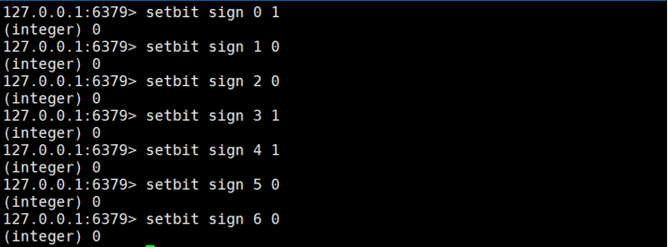

查看某一天是否有打卡！

```sql
127.0.0.1:6379> getbit sign 3
(integer) 1
127.0.0.1:6379> getbit sign 6
(integer) 0
```

统计操作，统计 打卡的天数！

```sql
 127.0.0.1:6379> bitcount sign	# 统计这周的打卡记录，就可以看到是否有全勤！
(integer) 3
```

事务

Redis 事务本质：一组命令的集合！ 一个事务中的所有命令都会被序列化，在事务执行过程的中，会按照顺序执行！
一次性、顺序性、排他性！执行一些列的命令！

```
------ 队列 set set set 执行------
```

==Redis 事务没有没有隔离级别的概念！==
所有的命令在事务中，并没有直接被执行！只有发起执行命令的时候才会执行！Exec

==Redis 单条命令式保存原子性的，但是事务不保证原子性==
redis 的事务：

- 开启事务（multi）
- 命令入队（```）
- 执行事务（exec）

> 正常执行事务

```sql
127.0.0.1:6379> multi	# 开启事务
OK
# 命令入队
127.0.0.1:6379> set k1 v1
QUEUED
127.0.0.1:6379> set k2 v2 QUEUED
127.0.0.1:6379> get k2 QUEUED
127.0.0.1:6379> set k3 v3 QUEUED
127.0.0.1:6379> exec	# 执行事务
1)OK
2)OK 3) "v2"
4) OK
```

> 放弃事务

```sql
127.0.0.1:6379> multi	# 开启事务
OK
127.0.0.1:6379> set k1 v1 QUEUED
127.0.0.1:6379> set k2 v2 QUEUED
127.0.0.1:6379> set k4 v4 QUEUED
127.0.0.1:6379> DISCARD	# 取消事务
OK
127.0.0.1:6379> get k4	# 事务队列中命令都不会被执行！
(nil)
```

> 编译型异常（代码有问题！ 命令有错！） ，事务中所有的命令都不会被执行！

```sql
127.0.0.1:6379> multi OK
127.0.0.1:6379> set k1 v1 QUEUED
127.0.0.1:6379> set k2 v2 QUEUED
127.0.0.1:6379> set k3 v3 QUEUED
127.0.0.1:6379> getset k3 # 错误的命令
(error) ERR wrong number of arguments for 'getset' command 127.0.0.1:6379> set k4 v4
QUEUED
127.0.0.1:6379> set k5 v5 QUEUED
127.0.0.1:6379> exec	# 执行事务报错！
(error) EXECABORT Transaction discarded because of previous errors. 127.0.0.1:6379> get k5	# 所有的命令都不会被执行！
(nil)
```

> 运行时异常（1/0）， 如果事务队列中存在语法性，那么执行命令的时候，其他命令是可以正常执行的，错误命令抛出异常！

```sql
127.0.0.1:6379> set k1 "v1" OK
127.0.0.1:6379> multi OK
127.0.0.1:6379> incr k1	# 会执行的时候失败！
QUEUED
127.0.0.1:6379> set k2 v2 QUEUED
127.0.0.1:6379> set k3 v3 QUEUED
127.0.0.1:6379> get k3 QUEUED 127.0.0.1:6379> exec
1)(error) ERR value is not an integer or out of range	# 虽然第一条命令报错了，但是
依旧正常执行成功了！
2)OK
3)OK 4) "v3"
127.0.0.1:6379> get k2 "v2"
127.0.0.1:6379> get k3
"v3"
```

> 监控！ Watch （面试常问！）

悲观锁：

- 很悲观，认为什么时候都会出问题，无论做什么都会加锁！

乐观锁：

- 很乐观，认为什么时候都不会出问题，所以不会上锁！ 更新数据的时候去判断一下，在此期间是否有人修改过这个数据，
- 获取 version
- 更新的时候比较 version

> Redis 测监视测试

正常执行成功！

```sql
127.0.0.1:6379> set money 100 OK
127.0.0.1:6379> set out 0 OK
127.0.0.1:6379> watch money	# 监视 money 对象
OK
127.0.0.1:6379> multi	# 事务正常结束，数据期间没有发生变动，这个时候就正常执行成功！
OK
127.0.0.1:6379> DECRBY money 20 QUEUED
127.0.0.1:6379> INCRBY out 20 QUEUED
127.0.0.1:6379> exec
1)(integer) 80
2)(integer) 20
```

测试多线程修改值 , 使用 watch 可以当做 redis 的乐观锁操作！

```sql
127.0.0.1:6379> watch money	# 监视	money OK
127.0.0.1:6379> multi OK
127.0.0.1:6379> DECRBY money 10 QUEUED
127.0.0.1:6379> INCRBY out 10 QUEUED
127.0.0.1:6379> exec	# 执行之前，另外一个线程，修改了我们的值，这个时候，就会导致事务执行失
败！
(nil)
```

如果修改失败，获取最新的值就好


## Jedis

什么是 Jedis

Jedis 是 Redis 官方推荐的 java 连接开发工具！ 使用 Java 操作 Redis 中间件！如果你要使用

java 操作 redis，那么一定要对 Jedis 十分的熟悉！

> 测试

1、导入对应的依赖

```xml
<!--导入jedis的包-->
<dependencies>
<!-- https://mvnrepository.com/artifact/redis.clients/jedis -->
<dependency>
<groupId>redis.clients</groupId>
<artifactId>jedis</artifactId>
<version>3.2.0</version>
</dependency>
<!--fastjson-->
<dependency>
<groupId>com.alibaba</groupId>
<artifactId>fastjson</artifactId>
<version>1.2.62</version>
</dependency>
</dependencies>
```

2、编码测试：

- 连接数据库操作命令断开连接！
- 操作命令
- 断开连接

```java
package com.kuang;


import redis.clients.jedis.Jedis;


public class TestPing {
public static void main(String[] args) {
// 1、 new Jedis 对象即可
Jedis jedis = new Jedis("127.0.0.1",6379);
// jedis 所有的命令就是我们之前学习的所有指令！所以之前的指令学习很重要！

System.out.println(jedis.ping());
}
}
```

输出：


常用的 API

String

List

Set

Hash

Zset

所有的 api 命令，就是我们对应的上面学习的指令，一个都没有变化！

事务

```java
public class TestTX {
public static void main(String[] args) {
Jedis jedis = new Jedis("127.0.0.1", 6379);


jedis.flushDB();


JSONObject jsonObject = new JSONObject(); jsonObject.put("hello","world"); jsonObject.put("name","kuangshen");
// 开启事务
Transaction multi = jedis.multi();
String result = jsonObject.toJSONString();
   // jedis.watch(result)
    try {
multi.set("user1",result); multi.set("user2",result);
int i = 1/0 ; // 代码抛出异常事务，执行失败！
multi.exec(); // 执行事务！
} catch (Exception e) { multi.discard(); // 放弃事务e.printStackTrace();
} finally {
System.out.println(jedis.get("user1")); System.out.println(jedis.get("user2")); jedis.close(); // 关闭连接
}
```

SpringBoot 整合

SpringBoot 操作数据：spring-data jpa jdbc mongodb redis！ SpringData 也是和 SpringBoot 齐名的项目！
说明： 在 SpringBoot2.x 之后，原来使用的 jedis 被替换为了 lettuce?
jedis : 采用的直连，多个线程操作的话，是不安全的，如果想要避免不安全的，使用 jedis pool 连接池！ 更像 BIO 模式
lettuce : 采用 netty，实例可以再多个线程中进行共享，不存在线程不安全的情况！可以减少线程数据了，更像 NIO 模式
源码分析：

```java
@Bean
@ConditionalOnMissingBean(name = "redisTemplate") // 我们可以自己定义一个
redisTemplate来替换这个默认的！
public RedisTemplate<Object, Object> redisTemplate(RedisConnectionFactory redisConnectionFactory)
throws UnknownHostException {
// 默认的 RedisTemplate 没有过多的设置，redis 对象都是需要序列化！
// 两个泛型都是 Object, Object 的类型，我们后使用需要强制转换 <String, Object> RedisTemplate<Object, Object> template = new RedisTemplate<>(); template.setConnectionFactory(redisConnectionFactory);
return template;
}


@Bean
@ConditionalOnMissingBean	// 由于 String 是redis中最常使用的类型，所以说单独提出来了一个bean！
public StringRedisTemplate stringRedisTemplate(RedisConnectionFactory redisConnectionFactory)
throws UnknownHostException {
StringRedisTemplate template = new StringRedisTemplate(); template.setConnectionFactory(redisConnectionFactory); return template;
```

1、导入依赖

```xml
<!-- 操作redis -->
<dependency>
<groupId>org.springframework.boot</groupId>
<artifactId>spring-boot-starter-data-redis</artifactId>
</dependency>
```

2、配置连接

```java
# 配置redis
spring.redis.host=127.0.0.1 spring.redis.port=6379
```

3、测试！

```java
@SpringBootTest
class Redis02SpringbootApplicationTests {


@Autowired
private RedisTemplate redisTemplate;


@Test
void contextLoads() {

// redisTemplate	操作不同的数据类型，api和我们的指令是一样的
// opsForValue	操作字符串 类似String
// opsForList	操作List 类似List
// opsForSet
// opsForHash
// opsForZSet
// opsForGeo
// opsForHyperLogLog

// 除了进本的操作，我们常用的方法都可以直接通过redisTemplate操作，比如事务，和基本的
CRUD

// 获取redis的连接对象
//RedisConnection connection = redisTemplate.getConnectionFactory().getConnection();
//connection.flushDb();
//connection.flushAll();

redisTemplate.opsForValue().set("mykey","关注狂神说公众号"); System.out.println(redisTemplate.opsForValue().get("mykey"));

}


}
```


关于对象的保存：


```java

//我们来编写一个自己的 RedisTemplete
package com.kuang.config;


import com.fasterxml.jackson.annotation.JsonAutoDetect; import com.fasterxml.jackson.annotation.PropertyAccessor; import com.fasterxml.jackson.databind.ObjectMapper; import org.springframework.context.annotation.Bean;
import org.springframework.context.annotation.Configuration;
import org.springframework.data.redis.connection.RedisConnectionFactory; import org.springframework.data.redis.core.RedisTemplate;
import org.springframework.data.redis.serializer.Jackson2JsonRedisSerializer; import org.springframework.data.redis.serializer.StringRedisSerializer;

@Configuration
public class RedisConfig {
    // 这是我给大家写好的一个固定模板，大家在企业中，拿去就可以直接使用！
// 自己定义了一个 RedisTemplate @Bean @SuppressWarnings("all")
public RedisTemplate<String, Object> redisTemplate(RedisConnectionFactory factory) {
// 我们为了自己开发方便，一般直接使用 <String, Object>
RedisTemplate<String, Object> template = new RedisTemplate<String, Object>();
template.setConnectionFactory(factory);

// Json序列化配置
Jackson2JsonRedisSerializer jackson2JsonRedisSerializer = new Jackson2JsonRedisSerializer(Object.class);
ObjectMapper om = new ObjectMapper(); om.setVisibility(PropertyAccessor.ALL, JsonAutoDetect.Visibility.ANY); om.enableDefaultTyping(ObjectMapper.DefaultTyping.NON_FINAL); jackson2JsonRedisSerializer.setObjectMapper(om);
// String 的序列化
StringRedisSerializer stringRedisSerializer = new StringRedisSerializer();

// key采用String的序列化方式template.setKeySerializer(stringRedisSerializer);
// hash的key也采用String的序列化方式template.setHashKeySerializer(stringRedisSerializer);
// value 序 列 化 方 式 采 用 jackson template.setValueSerializer(jackson2JsonRedisSerializer);
// hash 的 value 序 列 化 方 式 采 用 jackson template.setHashValueSerializer(jackson2JsonRedisSerializer); template.afterPropertiesSet();

return template;
}

}
```

所有的 redis 操作，其实对于 java 开发人员来说，十分的简单，更重要是要去理解 redis 的思想和每一种数 据结构的用处和作用场景！

### Redis.conf 详解

启动的时候，就通过配置文件来启动！
工作中，一些小小的配置，可以让你脱颖而出！

> 单位


1、配置文件 unit 单位 对大小写不敏感！

> 包含


就是好比我们学习 Spring、Improt， include

> 网络

```sql
bind 127.0.0.1	# 绑定的
ip protected-mode yes # 保护模式
port 6379	# 端口设置
```

> 通用 GENERAL

```
daemonize yes	# 以守护进程的方式运行，默认是 no，我们需要自己开启为yes！

pidfile /var/run/redis_6379.pid	# 如果以后台的方式运行，我们就需要指定一个 pid 文件！

# 日志
# Specify the server verbosity level. # This can be one of:
# debug (a lot of information, useful for development/testing)
# verbose (many rarely useful info, but not a mess like the debug level)
# notice (moderately verbose, what you want in production probably) 生产环境
# warning (only very important / critical messages are logged) loglevel notice
logfile "" # 日志的文件位置名
databases 16	# 数据库的数量，默认是 16 个数据库
always-show-logo yes	# 是否总是显示LOGO
```

> 快照

持久化， 在规定的时间内，执行了多少次操作，则会持久化到文件 .rdb. aof redis 是内存数据库，如果没有持久化，那么数据断电及失！

```sql
# 如果900s内，如果至少有一个1 key进行了修改，我们及进行持久化操作
save 900 1
# 如果300s内，如果至少10 key进行了修改，我们及进行持久化操作
save 300 10
# 如果60s内，如果至少10000 key进行了修改，我们及进行持久化操作
save 60 10000
# 我们之后学习持久化，会自己定义这个测试！

stop-writes-on-bgsave-error yes	# 持久化如果出错，是否还需要继续工作！ rdbcompression yes # 是否压缩 rdb 文件，需要消耗一些cpu资源！
rdbchecksum yes # 保存rdb文件的时候，进行错误的检查校验！
dir ./	# rdb 文件保存的目录！
```

> SECURITY 安 全

可以在这里设置 redis 的密码，默认是没有密码！

```sql
127.0.0.1:6379> ping PONG
127.0.0.1:6379> config get requirepass	# 获取redis的密码
1) "requirepass" 2) ""
127.0.0.1:6379> config set requirepass "123456"	# 设置redis的密码
OK
127.0.0.1:6379> config get requirepass	# 发现所有的命令都没有权限了
(error) NOAUTH Authentication required. 127.0.0.1:6379> ping
(error) NOAUTH Authentication required. 127.0.0.1:6379> auth 123456	# 使用密码进行登录！ OK
127.0.0.1:6379> config get requirepass
1) "requirepass" 2) "123456"
```

> 限制 CLIENTS

```
maxclients 10000	# 设置能连接上redis的最大客户端的数量

maxmemory <bytes>	# redis 配置最大的内存容量

maxmemory-policy noeviction	# 内存到达上限之后的处理策略
1、volatile-lru：只对设置了过期时间的key进行LRU（默认值）  2、allkeys-lru ： 删除lru算法的key
3、volatile-random：随机删除即将过期key 4、allkeys-random：随机删除
5、volatile-ttl ： 删除即将过期的
6、noeviction ： 永不过期，返回错误
```

> APPEND ONLY 模式 aof 配置

```
appendonly no	# 默认是不开启aof模式的，默认是使用rdb方式持久化的，在大部分所有的情况下，
rdb完全够用！
appendfilename "appendonly.aof"	# 持久化的文件的名字

# appendfsync always	# 每次修改都会 sync。消耗性能
appendfsync everysec	# 每秒执行一次 sync，可能会丢失这1s的数据！
# appendfsync no	# 不执行 sync，这个时候操作系统自己同步数据，速度最快！
```

具体的配置，我们在 Redis 持久化 中去给大家详细详解！

## Redis 持久化

面试和工作，持久化都是重点！
Redis 是内存数据库，如果不将内存中的数据库状态保存到磁盘，那么一旦服务器进程退出，服务器中的数据库状态也会消失。所以 Redis 提供了持久化功能！

### RDB（Redis DataBase）

> 什么是 RDB

在主从复制中，rdb 就是备用了！从机上面！


在指定的时间间隔内将内存中的数据集快照写入磁盘，也就是行话讲的 Snapshot 快照，它恢复时是将快 照文件直接读到内存里。
Redis 会单独创建（fork）一个子进程来进行持久化，会先将数据写入到一个临时文件中，待持久化过程 都结束了，再用这个临时文件替换上次持久化好的文件。整个过程中，主进程是不进行任何 IO 操作的。 这就确保了极高的性能。如果需要进行大规模数据的恢复，且对于数据恢复的完整性不是非常敏感，那 RDB 方式要比 AOF 方式更加的高效。RDB 的缺点是最后一次持久化后的数据可能丢失。我们默认的就是 RDB，一般情况下不需要修改这个配置！
有时候在生产环境我们会将这个文件进行备份！
==rdb 保存的文件是 dump.rdb== 都是在我们的配置文件中快照中进行配置的！


> 触发机制

1、save 的规则满足的情况下，会自动触发 rdb 规则

2、执行 flushall 命令，也会触发我们的 rdb 规则！

3、退出 redis，也会产生 rdb 文件！
备份就自动生成一个 dump.rdb


> 如果恢复 rdb 文件

1、只需要将 rdb 文件放在我们 redis 启动目录就可以，redis 启动的时候会自动检查 dump.rdb 恢复其中的数据！
2、查看需要存在的位置

```
127.0.0.1:6379> config get dir
1)"dir"
2)"/usr/local/bin"	# 如果在这个目录下存在 dump.rdb 文件，启动就会自动恢复其中的数据
```

优点：
1、适合大规模的数据恢复！
2、对数据的完整性要不高！
缺点：
1、需要一定的时间间隔进程操作！如果 redis 意外宕机了，这个最后一次修改数据就没有的了！
2、fork 进程的时候，会占用一定的内容空间！！

### AOF（Append Only File）

将我们的所有命令都记录下来，history，恢复的时候就把这个文件全部在执行一遍！


以日志的形式来记录每个写操作，将 Redis 执行过的所有指令记录下来（读操作不记录），只许追加文件 但不可以改写文件，redis 启动之初会读取该文件重新构建数据，换言之，redis 重启的话就根据日志文件 的内容将写指令从前到后执行一次以完成数据的恢复工作
==Aof 保存的是 appendonly.aof 文件==

> append


默认是不开启的，我们需要手动进行配置！我们只需要将 appendonly 改为 yes 就开启了 aof！ 重启，redis 就可以生效了！
如果这个 aof 文件有错位，这时候 redis 是启动不起来的吗，我们需要修复这个 aof 文件
redis 给我们提供了一个工具`redis-check-aof --fix`


如果文件正常，重启就可以直接恢复了！


> 重写规则说明

aof 默认就是文件的无限追加，文件会越来越大！


如果 aof 文件大于 64m，太大了！ fork 一个新的进程来将我们的文件进行重写！

```sql
appendonly no # 默认是不开启aof模式的，默认是使用rdb方式持久化的，在大部分所有的情况下，rdb完全够用！
appendfilename "appendonly.aof"	# 持久化的文件的名字

# appendfsync always	# 每次修改都会 sync。消耗性能
appendfsync everysec	# 每秒执行一次 sync，可能会丢失这1s的数据！
# appendfsync no	# 不执行 sync，这个时候操作系统自己同步数据，速度最快！

# rewrite	重写，
```

优点：
1、每一次修改都同步，文件的完整会更加好！
2、每秒同步一次，可能会丢失一秒的数据
3、从不同步，效率最高的！

缺点：
1、相对于数据文件来说，aof 远远大于 rdb，修复的速度也比 rdb 慢！
2、Aof 运行效率也要比 rdb 慢，所以我们 redis 默认的配置就是 rdb 持久化！

扩展：
1、RDB 持久化方式能够在指定的时间间隔内对你的数据进行快照存储
2、AOF 持久化方式记录每次对服务器写的操作，当服务器重启的时候会重新执行这些命令来恢复原始的数据，AOF 命令以 Redis 协议追加保存每次写的操作到文件末尾，Redis 还能对 AOF 文件进行后台重写，使得 AOF 文件的体积不至于过大。
3、==只做缓存，如果你只希望你的数据在服务器运行的时候存在，你也可以不使用任何持久化==
4、同时开启两种持久化方式

- 在这种情况下，当 redis 重启的时候会优先载入 AOF 文件来恢复原始的数据，因为在通常情况下 AOF 文件保存的数据集要比 RDB 文件保存的数据集要完整。

- RDB 的数据不实时，同时使用两者时服务器重启也只会找 AOF 文件，那要不要只使用 AOF 呢？作者建议不要，因为 RDB 更适合用于备份数据库（AOF 在不断变化不好备份），快速重启，而且不会有 AOF 可能潜在的 Bug，留着作为一个万一的手段。

5、性能建议

- 因为 RDB 文件只用作后备用途，建议只在 Slave 上持久化 RDB 文件，而且只要 15 分钟备份一次就够 了，只保留 save 900 1 这条规则。
- 如果 Enable AOF ，好处是在最恶劣情况下也只会丢失不超过两秒数据，启动脚本较简单只 load 自己的 AOF 文件就可以了，代价一是带来了持续的 IO，二是 AOF rewrite 的最后将 rewrite 过程中产生的新数据写到新文件造成的阻塞几乎是不可避免的。只要硬盘许可，应该尽量减少 AOF rewrite 的频率，AOF 重写的基础大小默认值 64M 太小了，可以设到 5G 以上，默认超过原大小 100%大小重 写可以改到适当的数值。
- 如果不 Enable AOF ，仅靠 Master-Slave Repllcation 实现高可用性也可以，能省掉一大笔 IO，也减少了 rewrite 时带来的系统波动。代价是如果 Master/Slave 同时倒掉，会丢失十几分钟的数据， 启动脚本也要比较两个 Master/Slave 中的 RDB 文件，载入较新的那个，微博就是这种架构。

### Redis 发布订阅

Redis 发布订阅(pub/sub)是一种==消息通信模式==：发送者(pub)发送消息，订阅者(sub)接收消息。微信、微博、关注系统！
Redis 客户端可以订阅任意数量的频道。订阅/发布消息图：
第一个：消息发送者， 第二个：频道 第三个：消息订阅者！


下图展示了频道 channel1 ， 以及订阅这个频道的三个客户端 —— client2 、 client5 和 client1 之间的关系：


当有新消息通过 PUBLISH 命令发送给频道 channel1 时， 这个消息就会被发送给订阅它的三个客户端：


这些命令被广泛用于构建即时通信应用，比如网络聊天室(chatroom)和实时广播、实时提醒等。


> 测试

订阅端：

```sql
127.0.0.1:6379> SUBSCRIBE kuangshenshuo	# 订阅一个频道 kuangshenshuo Reading messages... (press Ctrl-C to quit)
1)"subscribe"
2)"kuangshenshuo"
3)(integer) 1
# 等待读取推送的信息
1)"message"	# 消息
2)"kuangshenshuo"	# 那个频道的消息
3)"hello,kuangshen"	# 消息的具体内容

1)"message"
2)"kuangshenshuo"
3)"hello,redis"
```

发送端：

```sql
127.0.0.1:6379> PUBLISH kuangshenshuo "hello,kuangshen"	# 发布者发布消息到频道！
(integer) 1
127.0.0.1:6379> PUBLISH kuangshenshuo "hello,redis"	# 发布者发布消息到频道！
(integer) 1
127.0.0.1:6379>
```

> 原理

Redis 是使用 C 实现的，通过分析 Redis 源码里的 pubsub.c 文件，了解发布和订阅机制的底层实现，籍此加深对 Redis 的理解。

Redis 通过 PUBLISH 、SUBSCRIBE 和 PSUBSCRIBE 等命令实现发布和订阅功能。微信：
通过 SUBSCRIBE 命令订阅某频道后，redis-server 里维护了一个字典，字典的键就是一个个 频道！， 而字典的值则是一个链表，链表中保存了所有订阅这个 channel 的客户端。SUBSCRIBE 命令的关键， 就是将客户端添加到给定 channel 的订阅链表中。

通过 PUBLISH 命令向订阅者发送消息，redis-server 会使用给定的频道作为键，在它所维护的 channel 字典中查找记录了订阅这个频道的所有客户端的链表，遍历这个链表，将消息发布给所有订阅者。


Pub/Sub 从字面上理解就是发布（Publish）与订阅（Subscribe），在 Redis 中，你可以设定对某一个 key 值进行消息发布及消息订阅，当一个 key 值上进行了消息发布后，所有订阅它的客户端都会收到相应 的消息。这一功能最明显的用法就是用作实时消息系统，比如普通的即时聊天，群聊等功能。
**使用场景：**
1、实时消息系统！
2、事实聊天！（频道当做聊天室，将信息回显给所有人即可！）
3、订阅，关注系统都是可以的！
稍微复杂的场景我们就会使用 消息中间件 MQ （）

### Redis 主从复制

#### 概念

主从复制，是指将一台 Redis 服务器的数据，复制到其他的 Redis 服务器。前者称为主节点(master/leader)，后者称为从节点(slave/follower)；==数据的复制是单向的，只能由主节点到从节点。Master 以写为主，Slave 以读为主。==
==默认情况下，每台 Redis 服务器都是主节点==；
且一个主节点可以有多个从节点(或没有从节点)，但一个从节点只能有一个主节点。（）
主从复制的作用主要包括：  
1、数据冗余：主从复制实现了数据的热备份，是持久化之外的一种数据冗余方式。  
2、故障恢复：当主节点出现问题时，可以由从节点提供服务，实现快速的故障恢复；实际上是一种服务 的冗余。  
3、负载均衡：在主从复制的基础上，配合读写分离，可以由主节点提供写服务，由从节点提供读服务  
（即写 Redis 数据时应用连接主节点，读 Redis 数据时应用连接从节点），分担服务器负载；尤其是在写 少读多的场景下，通过多个从节点分担读负载，可以大大提高 Redis 服务器的并发量。  
4、高可用（集群）基石：除了上述作用以外，主从复制还是哨兵和集群能够实施的基础，因此说主从复 制是 Redis 高可用的基础。  

一般来说，要将 Redis 运用于工程项目中，只使用一台 Redis 是万万不能的（宕机），原因如下：
1、从结构上，单个 Redis 服务器会发生单点故障，并且一台服务器需要处理所有的请求负载，压力较 大；  
2、从容量上，单个 Redis 服务器内存容量有限，就算一台 Redis 服务器内存容量为 256G，也不能将所有 内存用作 Redis 存储内存，一般来说，==单台 Redis 最大使用内存不应该超过 20G==。  
电商网站上的商品，一般都是一次上传，无数次浏览的，说专业点也就是"多读少写"。 对于这种场景，我们可以使如下这种架构：  


主从复制，读写分离！ 80% 的情况下都是在进行读操作！减缓服务器的压力！架构中经常使用！ 一主二从！
只要在公司中，主从复制就是必须要使用的，因为在真实的项目中不可能单机使用 Redis！

#### 环境配置

```sql
127.0.0.1:6379> info replication	# 查看当前库的信息
# Replication
role:master	# 角色	master connected_slaves:0 #		没有从机
master_replid:b63c90e6c501143759cb0e7f450bd1eb0c70882a master_replid2:0000000000000000000000000000000000000000
master_repl_offset:0 second_repl_offset:-1 repl_backlog_active:0 repl_backlog_size:1048576 repl_backlog_first_byte_offset:0
repl_backlog_histlen:0
```

只配置从库，不用配置主库！

复制 3 个配置文件，然后修改对应的信息
1、端口
2、pid 名字
3、log 文件名字
4、dump.rdb 名字
修改完毕之后，启动我们的 3 个 redis 服务器，可以通过进程信息查看！


一主二从

默认情况下，每台 Redis 服务器都是主节点； 我们一般情况下只用配置从机就好了！ 认老大！ 一主 （79）二从（80，81）

```sql
127.0.0.1:6380> SLAVEOF 127.0.0.1 6379	#	SLAVEOF host 6379	找谁当自己的老大！
OK
127.0.0.1:6380> info replication # Replication
role:slave	# 当前角色是从机
master_host:127.0.0.1	# 可以的看到主机的信息
master_port:6379
master_link_status:up master_last_io_seconds_ago:3 master_sync_in_progress:0 slave_repl_offset:14 slave_priority:100 slave_read_only:1 connected_slaves:0
master_replid:a81be8dd257636b2d3e7a9f595e69d73ff03774e master_replid2:0000000000000000000000000000000000000000
master_repl_offset:14 second_repl_offset:-1 repl_backlog_active:1 repl_backlog_size:1048576 repl_backlog_first_byte_offset:1 repl_backlog_histlen:14

# 在主机中查看！
127.0.0.1:6379> info replication # Replication
role:master
connected_slaves:1	# 多了从机的配置slave0:ip=127.0.0.1,port=6380,state=online,offset=42,lag=1	# 多了从机的配置master_replid:a81be8dd257636b2d3e7a9f595e69d73ff03774e master_replid2:0000000000000000000000000000000000000000
master_repl_offset:42 second_repl_offset:-1 repl_backlog_active:1 repl_backlog_size:1048576 repl_backlog_first_byte_offset:1 repl_backlog_histlen:42
```

如果两个都配置完了，就是有两个从机的

真实的从主配置应该在配置文件中配置，这样的话是永久的，我们这里使用的是命令，暂时的！

主机可以写，从机不能写只能读！主机中的所有信息和数据，都会自动被从机保存！

主机写：


从机只能读取内容！


测试：主机断开连接，从机依旧连接到主机的，但是没有写操作，这个时候，主机如果回来了，从机依 旧可以直接获取到主机写的信息！
如果是使用命令行，来配置的主从，这个时候如果重启了，就会变回主机！只要变为从机，立马就会从 主机中获取值！

> 复制原理

Slave 启动成功连接到 master 后会发送一个 sync 同步命令
Master 接到命令，启动后台的存盘进程，同时收集所有接收到的用于修改数据集命令，在后台进程执行完毕之后，==master 将传送整个数据文件到 slave，并完成一次完全同步。==
==全量复制==：而 slave 服务在接收到数据库文件数据后，将其存盘并加载到内存中。

==增量复制==：Master 继续将新的所有收集到的修改命令依次传给 slave，完成同步
但是只要是重新连接 master，一次完全同步（全量复制）将被自动执行！ 我们的数据一定可以在从机中看到！

> 层层链路

上一个 M 链接下一个 S！


这时候也可以完成我们的主从复制！

> 谋朝篡位

如果主机断开了连接，我们可以使用`SLAVEOF no one`让自己变成主机！其他的节点就可以手动连

接到最新的这个主节点（手动）！如果这个时候老大修复了，那就重新连接！

#### 哨兵模式

（自动选举老大的模式）

> 概述

主从切换技术的方法是：当主服务器宕机后，需要手动把一台从服务器切换为主服务器，这就需要人工 干预，费事费力，还会造成一段时间内服务不可用。这不是一种推荐的方式，更多时候，我们优先考虑 哨兵模式。Redis 从 2.8 开始正式提供了 Sentinel（哨兵） 架构来解决这个问题。
谋朝篡位的自动版，能够后台监控主机是否故障，如果故障了根据投票数自动将从库转换为主库。
哨兵模式是一种特殊的模式，首先 Redis 提供了哨兵的命令，哨兵是一个独立的进程，作为进程，它会独 立运行。其原理是**哨兵通过发送命令，等待 Redis 服务器响应，从而监控运行的多个 Redis 实例。**

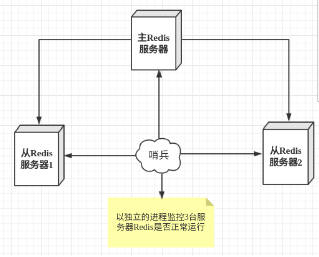

这里的哨兵有两个作用

- 通过发送命令，让 Redis 服务器返回监控其运行状态，包括主服务器和从服务器。
- 当哨兵监测到 master 宕机，会自动将 slave 切换成 master，然后通过发布订阅模式通知其他的从服 务器，修改配置文件，让它们切换主机。

然而一个哨兵进程对 Redis 服务器进行监控，可能会出现问题，为此，我们可以使用多个哨兵进行监控。 各个哨兵之间还会进行监控，这样就形成了多哨兵模式。


假设主服务器宕机，哨兵 1 先检测到这个结果，系统并不会马上进行 failover 过程，仅仅是哨兵 1 主观的认 为主服务器不可用，这个现象成为**主观下线**。当后面的哨兵也检测到主服务器不可用，并且数量达到一 定值时，那么哨兵之间就会进行一次投票，投票的结果由一个哨兵发起，进行 failover[故障转移]操作。 切换成功后，就会通过发布订阅模式，让各个哨兵把自己监控的从服务器实现切换主机，这个过程称为 **客观下线**。

我的老师是张宇打打打

我们目前的状态是 一主二从！  
1、配置哨兵配置文件 sentinel.conf  

后面的这个数字 1，代表主机挂了，slave 投票看让谁接替成为主机，票数最多的，就会成为主机！
2、启动哨兵！  

如果 Master 节点断开了，这个时候就会从从机中随机选择一个服务器！ （这里面有一个投票算法！）
哨兵日志！

如果主机此时回来了，只能归并到新的主机下，当做从机，这就是哨兵模式的规则！

优点：  
1、哨兵集群，基于主从复制模式，所有的主从配置优点，它全有  
2、 主从可以切换，故障可以转移，系统的可用性就会更好  
3、哨兵模式就是主从模式的升级，手动到自动，更加健壮！ 缺点：  
4、Redis 不好啊在线扩容的，集群容量一旦到达上限，在线扩容就十分麻烦！  
5、实现哨兵模式的配置其实是很麻烦的，里面有很多选择！  

社会目前程序员饱和（初级和中级）、高级程序员重金难求！（提升自己！）

Redis 缓存穿透和雪崩

在这里我们不会详细的区分析解决方案的底层！
Redis 缓存的使用，极大的提升了应用程序的性能和效率，特别是数据查询方面。但同时，它也带来了一 些问题。其中，最要害的问题，就是数据的一致性问题，从严格意义上讲，这个问题无解。如果对数据 的一致性要求很高，那么就不能使用缓存。
另外的一些典型问题就是，缓存穿透、缓存雪崩和缓存击穿。目前，业界也都有比较流行的解决方案。

缓存穿透（查不到）
缓存穿透的概念很简单，用户想要查询一个数据，发现 redis 内存数据库没有，也就是缓存没有命中，于 是向持久层数据库查询。发现也没有，于是本次查询失败。当用户很多的时候，缓存都没有命中（秒 杀！），于是都去请求了持久层数据库。这会给持久层数据库造成很大的压力，这时候就相当于出现了 缓存穿透。

布隆过滤器
布隆过滤器是一种数据结构，对所有可能查询的参数以 hash 形式存储，在控制层先进行校验，不符合则 丢弃，从而避免了对底层存储系统的查询压力；

缓存空对象

当存储层不命中后，即使返回的空对象也将其缓存起来，同时会设置一个过期时间，之后再访问这个数 据将会从缓存中获取，保护了后端数据源；

但是这种方法会存在两个问题：  
1、如果空值能够被缓存起来，这就意味着缓存需要更多的空间存储更多的键，因为这当中可能会有很多 的空值的键；  
2、即使对空值设置了过期时间，还是会存在缓存层和存储层的数据会有一段时间窗口的不一致，这对于 需要保持一致性的业务会有影响。  

缓存击穿（量太大，缓存过期！）  
这里需要注意和缓存击穿的区别，缓存击穿，是指一个 key 非常热点，在不停的扛着大并发，大并发集中 对这一个点进行访问，当这个 key 在失效的瞬间，持续的大并发就穿破缓存，直接请求数据库，就像在一 个屏障上凿开了一个洞。
当某个 key 在过期的瞬间，有大量的请求并发访问，这类数据一般是热点数据，由于缓存过期，会同时访 问数据库来查询最新数据，并且回写缓存，会导使数据库瞬间压力过大。

设置热点数据永不过期 
从缓存层面来看，没有设置过期时间，所以不会出现热点 key 过期后产生的问题。  
加互斥锁  
分布式锁：使用分布式锁，保证对于每个 key 同时只有一个线程去查询后端服务，其他线程没有获得分布 式锁的权限，因此只需要等待即可。这种方式将高并发的压力转移到了分布式锁，因此对分布式锁的考 验很大。  

缓存雪崩  
缓存雪崩，是指在某一个时间段，缓存集中过期失效。Redis 宕机！  
产生雪崩的原因之一，比如在写本文的时候，马上就要到双十二零点，很快就会迎来一波抢购，这波商 品时间比较集中的放入了缓存，假设缓存一个小时。那么到了凌晨一点钟的时候，这批商品的缓存就都 过期了。而对这批商品的访问查询，都落到了数据库上，对于数据库而言，就会产生周期性的压力波 峰。于是所有的请求都会达到存储层，存储层的调用量会暴增，造成存储层也会挂掉的情况。  

其实集中过期，倒不是非常致命，比较致命的缓存雪崩，是缓存服务器某个节点宕机或断网。因为自然 形成的缓存雪崩，一定是在某个时间段集中创建缓存，这个时候，数据库也是可以顶住压力的。无非就 是对数据库产生周期性的压力而已。而缓存服务节点的宕机，对数据库服务器造成的压力是不可预知 的，很有可能瞬间就把数据库压垮。  

redis 高可用  
这个思想的含义是，既然 redis 有可能挂掉，那我多增设几台 redis，这样一台挂掉之后其他的还可以继续 工作，其实就是搭建的集群。（异地多活！）  
限流降级（在 SpringCloud 讲解过！）  
这个解决方案的思想是，在缓存失效后，通过加锁或者队列来控制读数据库写缓存的线程数量。比如对 某个 key 只允许一个线程查询数据和写缓存，其他线程等待。  
数据预热  
数据加热的含义就是在正式部署之前，我先把可能的数据先预先访问一遍，这样部分可能大量访问的数 据就会加载到缓存中。在即将发生大并发访问前手动触发加载缓存不同的 key，设置不同的过期时间，让 缓存失效的时间点尽量均匀。
