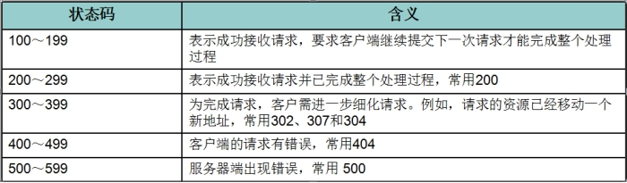
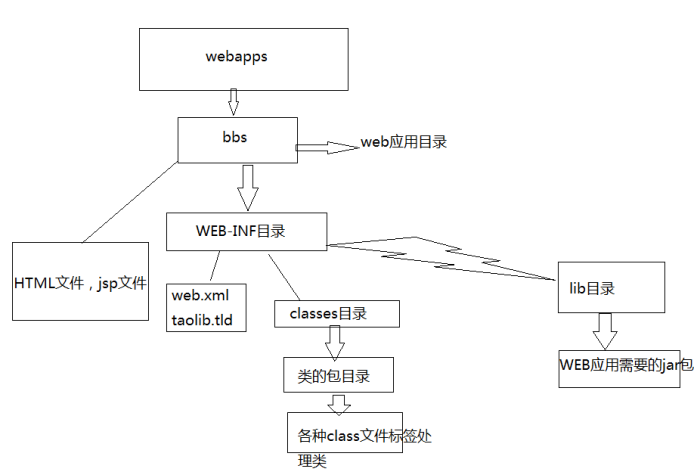

## 1. Servlet 技术

### a)什么是 Servlet

1、Servlet 是 JavaEE 规范之一。规范就是接口

2、Servlet 就 JavaWeb 三大组件之一。三大组件分别是：Servlet 程序、Filter 过滤器、Listener 监听器。

3、Servlet 是运行在服务器上的一个 java 小程序，它可以接收客户端发送过来的请求，并响应数据给客户端。

### b)手动实现 Servlet 程序

1、编写一个类去实现 Servlet 接口

2、实现 service 方法，处理请求，并响应数据

3、到 web.xml 中去配置 servlet 程序的访问地址

Servlet 程序的示例代码：

```java
public class HelloServlet implements Servlet {
/**
*	service方法是专门用来处理请求和响应的
*	@param servletRequest
*	@param servletResponse
*	@throws ServletException
*	@throws IOException
*/ @Override
public void service(ServletRequest servletRequest, ServletResponse servletResponse) throws
ServletException, IOException {
System.out.println("Hello Servlet 被访问了"); }
}

```

web.xml 中的配置：

```xml
<?xml version="1.0" encoding="UTF-8"?>
<web-app xmlns="http://xmlns.jcp.org/xml/ns/javaee" xmlns:xsi="http://www.w3.org/2001/XMLSchema-instance"
         xsi:schemaLocation="http://xmlns.jcp.org/xml/ns/javaee http://xmlns.jcp.org/xml/ns/javaee/web-app_4_0.xsd"version="4.0">
         <!-- servlet 标签给 Tomcat 配置 Servlet 程序 -->
    <servlet> <!--servlet-name 标签 Servlet 程序起一个别名（一般是类名） -->
        <servlet-name>HelloServlet</servlet-name> <!--servlet-class 是 Servlet 程序的全类名-->
        <servlet-class>com.atguigu.servlet.HelloServlet</servlet-class>
    </servlet>
    <!--servlet-mapping 标签给 servlet 程序配置访问地址-->
    <servlet-mapping>
    <!--servlet-name 标签的作用是告诉服务器，我当前配置的地址给哪个 Servlet 程序使用-->
        <servlet-name>HelloServlet</servlet-name>
        <!--url-pattern 标签配置访问地址 <br/> / 斜杠在服务器解析的时候，表示地址为：http://ip:port/工程路径 <br/> /hello 表示地址为：http://ip:port/工程路径/hello <br/> -->
        <url-pattern>/hello</url-pattern>
    </servlet-mapping>
```

常见的错误 1：url-pattern 中配置的路径没有以斜杠打头。


常见错误 2：servlet-name 配置的值不存在：


### c)url 地址到 Servlet 程序的访问


### d)Servlet 的生命周期

1、 执行 Servlet 构造器方法

2、 执行 init 初始化方法

第一、二步，是在第一次访问，的时候创建 Servlet 程序会调用。

3、 执行 service 方法

第三步，每次访问都会调用。

4、 执行 destroy 销毁方法

第四步，在 web 工程停止的时候调用。

### e)GET 和 POST 请求的分发处理

```java
public class HelloServlet implements Servlet {
/**
*	service方法是专门用来处理请求和响应的
*	@param servletRequest
*	@param servletResponse
*	@throws ServletException
*	@throws IOException
*/ @Override
public void service(ServletRequest servletRequest, ServletResponse servletResponse) throws
ServletException, IOException {
System.out.println("3 service === Hello Servlet 被访问了");
// 类型转换（因为它有getMethod()方法）
HttpServletRequest httpServletRequest = (HttpServletRequest) servletRequest;
// 获取请求的方式
String method = httpServletRequest.getMethod();
if ("GET".equals(method)) { doGet();
} else if ("POST".equals(method)) { doPost();
}
}
/**
*	做get请求的操作
*/ public void doGet(){
System.out.println("get请求");
System.out.println("get请求");
}
/**
*	做post请求的操作
*/ public void doPost(){
System.out.println("post请求");
System.out.println("post请求"); }
}

```

### f) 通过继承 HttpServlet 实现 Servlet 程序

一般在实际项目开发中，都是使用继承 HttpServlet 类的方式去实现 Servlet 程序。

1、 编写一个类去继承 HttpServlet 类

2、 根据业务需要重写 doGet 或 doPost 方法

3、 到 web.xml 中的配置 Servlet 程序的访问地址 Servlet 类的代码：

```java
public class HelloServlet2 extends HttpServlet {
/**
*	doGet（）在get请求的时候调用
*	@param req
*	@param resp
*	@throws ServletException
*	@throws IOException
*/ @Override
protected void doGet(HttpServletRequest req, HttpServletResponse resp) throws ServletException,
IOException {
System.out.println("HelloServlet2 的doGet方法");
}
/**
*	doPost（）在post请求的时候调用
*	@param req
*	@param resp
*	@throws ServletException
*	@throws IOException
*/ @Override
protected void doPost(HttpServletRequest req, HttpServletResponse resp) throws ServletException,
IOException {
System.out.println("HelloServlet2 的doPost方法");
}
}

```

web.xml 中的配置：

```xml
<servlet>

<servlet-name>	HelloServlet2	</servlet-name>
<servlet-class>	com.atguigu.servlet.HelloServlet2	</servlet-class>

<servlet-mapping>
<servlet-name>	HelloServlet2	</servlet-name>
<url-pattern>/hello2</url-pattern>
</servlet-mapping>

</servlet>


```

### g)使用 IDEA 创建 Servlet 程序

菜单：new ->Servlet 程序


配置 Servlet 的信息：


### h)Servlet 类的继承体系

**Servlet 继承体系**


### Servlet 请求分发

```java
public class HelloServlet implements Servlet {
    @Override
    public void init(ServletConfig servletConfig) throws ServletException {
//初始化init
    }

    @Override
    public ServletConfig getServletConfig() {
        return null;
    }

    @Override
    public void service(ServletRequest servletRequest, ServletResponse servletResponse) throws ServletException, IOException {
        System.out.println("helloServlet");
//        进入服务
        HttpServletRequest httpServletRequest= (HttpServletRequest) servletRequest;
    //类型转换 getmethod方法（）
        String method = httpServletRequest.getMethod();
    //获取请求的方式
        if ("GET".equals(method))
        {
            System.out.println("get请求");
        }
        else if ("POST".equals(method))
        {
            System.out.println("post请求");
        }
    }

    @Override
    public String getServletInfo() {
        return null;
        // get请求
    }

    @Override
    public void destroy() {
//销毁
    }
}

```

**通过继承 HttpServlet 实现 Servlet 程序**

一般在实际项目开发中，都是使用继承 HttpServlet 类的方法去实现 Servlet 程序。

1. 编写一个类去继承 HttpServlet 类
2. 根据业务需要重写 doGet 和 doPost 方法
3. 到 web.xml 中的配置 Servlet 程序的访问地址

````java
public class HelloServlet2 extends HttpServlet {
@Override
protected void doGet(HttpServletRequest req, HttpServletResponse resp) throws ServletException, IOException {
System.out.println("doGet 方法");
}

    @Override
    protected void doPost(HttpServletRequest req, HttpServletResponse resp) throws ServletException, IOException {
        System.out.println("doPost方法");
    }

}
```
```xml
//配置servlet
<servlet>
        <servlet-name>HelloServlet2</servlet-name>
        <servlet-class>servlets.HelloServlet2</servlet-class>
    </servlet>
<servlet-mapping>
    <servlet-name>HelloServlet2</servlet-name>
    <url-pattern>/hello2</url-pattern>
</servlet-mapping>
````

## 2.ServletConfig 类

ServletConfig 类从类名上来看，就知道是 Servlet 程序的配置信息类。

Servlet 程序和 ServletConfig 对象都是由 Tomcat 负责创建，我们负责使用。

Servlet 程序默认是第一次访问的时候创建，ServletConfig 是每个 Servlet 程序创建时，就创建一个对应的 ServletConfig 对象。

## a)ServletConfig 类的三大作用

1、 可以获取 Servlet 程序的别名 servlet-name 的值

2、 获取初始化参数 init-param

3、 获取 ServletContext 对象 web.xml 中的配置：

```xml
  <!-- servlet 标签给 Tomcat 配置 Servlet 程序 -->
    <servlet> <!--servlet-name 标签 Servlet 程序起一个别名（一般是类名） -->
        <servlet-name>HelloServlet</servlet-name>
        <!--servlet-class 是 Servlet 程序的全类名-->
        <servlet-class>com.atguigu.servlet.HelloServlet</servlet-class> <!--init-param 是初始化参数-->
        <init-param> <!--是参数名-->
            <param-name>username</param-name> <!--是参数值-->
            <param-value>root</param-value>
        </init-param> <!--init-param 是初始化参数-->
        <init-param> <!--是参数名-->
            <param-name>url</param-name> <!--是参数值-->
            <param-value>jdbc:mysql://localhost:3306/test</param-value>
        </init-param>
    </servlet> <!--servlet-mapping 标签给 servlet 程序配置访问地址-->
    <servlet-mapping> <!--servlet-name 标签的作用是告诉服务器，我当前配置的地址给哪个 Servlet 程序使用-->
        <servlet-name>HelloServlet</servlet-name> <!--url-pattern 标签配置访问地址 <br/> / 斜杠在服务器解析的时候，表示地址为：http://ip:port/工程路径 <br/> /hello 表示地址为：http://ip:port/工程路径/hello <br/> -->
        <url-pattern>/hello</url-pattern>
    </servlet-mapping>
```

Servlet 中的代码：

```java
@Override
    public void init(ServletConfig servletConfig) throws ServletException {
        System.out.println("2 init 初始化方法");
        // 1、可以获取 Servlet 程序的别名 servlet-name 的值
        System.out.println("HelloServlet " + servletConfig.getServletName());
        // 2、获取初始化参数 init-param
        System.out.println(" 初始化参数 username 的值是;" + servletConfig.getInitParameter("username"));
        System.out.println("初始化参数 url 的值是;" + servletConfig.getInitParameter("url"));
        // 3、获取 ServletContext 对象
        System.out.println(servletConfig.getServletContext());
```

注意点：


## 3.ServletContext 类

a)什么是 **ServletContext?**

1、ServletContext 是一个接口，它表示 Servlet 上下文对象

2、一个 web 工程，只有一个 ServletContext 对象实例。

3、ServletContext 对象是一个域对象。

4、ServletContext 是在 web 工程部署启动的时候创建。在 web 工程停止的时候销毁。

什么是域对象?

域对象，是可以像 Map 一样存取数据的对象，叫域对象。

这里的域指的是存取数据的操作范围，整个 web 工程。

|        | 存数据         | 取数据         | 删除数据           |
| ------ | -------------- | -------------- | ------------------ |
| Map    | put()          | get()          | remove()           |
| 域对象 | setAttribute() | getAttribute() | removeAttribute(); |

## b)ServletContext 类的四个作用

1、获取 web.xml 中配置的上下文参数 context-param

2、获取当前的工程路径，格式: /工程路径

3、获取工程部署后在服务器硬盘上的绝对路径

4、像 Map 一样存取数据

ServletContext 演示代码：

```java
    protected void doGet(HttpServletRequest request, HttpServletResponse response) throws ServletException,
              IOException
              { // 1、获取 web.xml 中配置的上下文参数
        context - param ServletContext context = getServletConfig().getServletContext();
        String username = context.getInitParameter("username");
        System.out.println("context-param 参数 username的值是:" + username);
        System.out.println(" context - param 参数 password 的值是: " + context.getInitParameter("password"));
        // 2、获取当前的工程路径，格式: /工程路径
        System.out.println("当前工程路径:" + context.getContextPath());
        // 3、获取工程部署后在服务器硬盘上的绝对路径 /*** /
        // 斜杠被服务器解析地址为:http://ip:port/工程名/ 映射到 IDEA 代码的 web 目录<br/> */
        System.out.println("工程部署的路径是:" + context.getRealPath("/"));
        System.out.println("工程下 css 目录的绝对路径是:" + context.getRealPath("/css"));
        System.out.println("工程下 imgs 目录 1.jpg 的绝对路径是:" + context.getRealPath("/imgs/1.jpg"));
    }


```

web.xml 中的配置：

```xml
    <!--context-param 是上下文参数(它属于整个 web 工程)-->
    <context-param>
        <param-name>username</param-name>
        <param-value>context</param-value>
    </context-param> <!--context-param 是上下文参数(它属于整个 web 工程)-->
    <context-param>
        <param-name>password</param-name>
        <param-value>root</param-value>
    </context-param>
```

ServletContext 像 Map 一样存取数据：

````java
protectedvoiddoGet(HttpServletRequestrequest,HttpServletResponseresponse)throwsServletException, IOException { ServletContext context = getServletContext();
```
ContextServlet1 代码：

```java
    public class ContextServlet1 extends HttpServlet {
        protected void doGet(HttpServletRequest request, HttpServletResponse response) throws ServletException,
                IOException { // 获取 ServletContext 对象
            ServletContext context = getServletContext();
            System.out
                    .println(context);
            System.out.println("保存之前: Context1 获取 key1 的值是:" + context.getAttribute("key1"));
            context.setAttribute("key1", "value1");
            System.out.println("Context1 中获取域数据 key1 的值是:" + context
                    .getAttribute("key1"));
        }
    }
````

ContextServlet2 代码：

```java
    protected void doGet(HttpServletRequest request, HttpServletResponse response) throws ServletException,
            IOException {
        ServletContext context = getServletContext();
        System.out.println(context);
        System.out.println("Context2 中获取域数据 key1 的值是:" + context.getAttribute("key1"));
    }
```

## 4.HTTP 协议

### a)什么是 HTTP 协议

什么是协议?

协议是指双方，或多方，相互约定好，大家都需要遵守的规则，叫协议。

所谓 HTTP 协议，就是指，客户端和服务器之间通信时，发送的数据，需要遵守的规则，叫 HTTP 协议。

**HTTP 协议就是客户端和服务器交互的一种通迅的格式**。

HTTP 协议中的数据又叫报文。

```java
System.out.println(context); System.out.println("Context2 中获取域数据key1的值是:"+ context.getAttribute("key1")); }
```

例子:在浏览器点击一个链接，浏览器就为我打开这个链接的网页。

原理：当在浏览器中点击这个链接的时候，**浏览器会向服务器发送一段文本**， **告诉服务器请求打开的是哪一个网页。服务器收到请求后，就返回一段文本给浏览器，浏览器会将该文本解析，然后显示出来。** 这段文本就是遵循 HTTP 协议规范的。

### HTTP1.0 和 HTTP1.1 的区别

HTTP1.0 协议中，客户端与 web 服务器建立连接后，只能获得一个 web 资源【短连接，获取资源后就断开连接】

HTTP1.1 协议，允许客户端与 web 服务器建立连接后，在一个连接上获取多个 web 资源【保持连接】

### b)HTTP 请求

客户端给服务器发送数据叫请求。服务器给客户端回传数据叫响应。
浏览器向服务器请求某个 web 资源时，称之为浏览器向服务器发送了一个 http 请求。
**浏览器向服务器请求某个 web 资源时，称之为浏览器向服务器发送了一个 http 请求。**
一个完整 http 请求应该包含三个部分： 1.请求行【描述客户端的**请求方式、请求的资源名称**，以及**使用的 HTTP 协议版本号**】 2.多个消息头【描述客户端请求哪台主机，以及**客户端的一些环境信息**等】 3.一个空行

请求行
请求行：GET /java.html HTTP/1.1
请求行中的 GET 称之为请求方式，请求方式有：`POST,GET,HEAD,OPTIONS,DELETE,TRACE,PUT`。
常用的有：`POST,GET`
一般来说，当我们点击超链接，通过地址栏访问都是 get 请求方式。通过表单提交的数据一般是 post 方式。
可以简单理解**GET 方式用来查询数据,POST 方式用来提交数据，get 的提交速度比 post 快**
GET 方式：在 URL 地址后**附带的参数是有限制的**，**其数据容量通常不能超过 1K。**
POST 方式：可以在**请求的实体内容中向服务器发送数据，传送的数据量无限制。**
**i.** **GET** 请求

1、请求行

(1) 请求的方式 GET

(2) 请求的资源路径[+?+请求参数]

(3) 请求的协议的版本号 HTTP/1.1

2、请求头 key : value 组成 不同的键值对，表示不同的含义。


**ii.** **POST** 请求

1、请求行

(1) 请求的方式 POST

(2) 请求的资源路径[+?+请求参数]

(3) 请求的协议的版本号 HTTP/1.1

2、请求头

1. key : value 不同的请求头，有不同的含义空行

3、请求体 ===>>> 就是发送给服务器的数据


#### **iii.** 请求头的说明

- `Accept`: text/html,image/ 【浏览器告诉服务器，它支持的数据类型】
- `Accept-Charset`: ISO-8859-1 【浏览器告诉服务器，它支持哪种**字符集**】
- `Accept-Encoding`: gzip,compress 【浏览器告诉服务器，它支持的**压缩格式**】
- `Accept-Language`: en-us,zh-cn 【浏览器告诉服务器，它的语言环境】
- `Host`: www.it315.org:80【浏览器告诉服务器，它的想访问哪台主机】
- `If-Modified-Since`: Tue, 11 Jul 2000 18:23:51 GMT【浏览器告诉服务器，缓存数据的时间】
- `Referer`: http://www.it315.org/index.jsp【浏览器告诉服务器，客户机是从那个页面来的---**反盗链**】
- 8.`User-Agen`t: Mozilla/4.0 (compatible; MSIE 5.5; Windows NT 5.0)【浏览器告诉服务器，浏览器的内核是什么】
- `Cookie`【浏览器告诉服务器，**带来的 Cookie 是什么**】
- `Connection`: close/Keep-Alive 【浏览器告诉服务器，请求完后是断开链接还是保持链接】
- `Date`: Tue, 11 Jul 2000 18:23:51 GMT【浏览器告诉服务器，请求的时间】

**iv.** 哪些是 **GET** 请求，哪些是 **POST** 请求

GET 请求有哪些：

1、form 标签 method=get

2、a 标签

3、link 标签引入 css

4、Script 标签引入 js 文件

5、img 标签引入图片

6、iframe 引入 html 页面

7、在浏览器地址栏中输入地址后敲回车

POST 请求有哪些：

8、form 标签 method=post

### c)HTTP 响应

一个 HTTP 响应代表着**服务器向浏览器回送数据**
一个完整的 HTTP 响应应该包含四个部分: 1.一个状态行【用于描述**服务器对请求的处理结果**。】 2.多个消息头【用于描述**服务器的基本信息，以及数据的描述，服务器通过这些数据的描述信息，可以通知客户端如何处理等一会儿它回送的数据**】 3.一个空行 4.实体内容【**服务器向客户端回送的数据**】

#### **状态行**

格式： HTTP 版本号 状态码 原因叙述

状态行：HTTP/1.1 200 OK

状态码用于表示**服务器对请求的处理结果**，它是一个**三位的十进制数**。响应状态码分为 5 类



响应头

- `Location`: http://www.it315.org/index.jsp 【服务器告诉浏览器要跳转到哪个页面】
- `Server`:apache tomcat【服务器告诉浏览器，服务器的型号是什么】
- `Content-Encoding`: gzip 【服务器告诉浏览器数据压缩的格式】
- `Content-Length`: 80 【服务器告诉浏览器回送数据的长度】
- `Content-Language`: zh-cn 【服务器告诉浏览器，服务器的语言环境】
- `Content-Type`: text/html; charset=GB2312 【服务器告诉浏览器，回送数据的类型】
- `Last-Modified`: Tue, 11 Jul 2000 18:23:51 GMT【服务器告诉浏览器该资源上次更新时间】
- `Refresh`: 1;url=http://www.it315.org【服务器告诉浏览器要定时刷新】
- `Content-Disposition`: attachment; filename=aaa.zip【服务器告诉浏览器以下载方式打开数据】
- `Transfer-Encoding`: chunked 【服务器告诉浏览器数据以分块方式回送】
- `Set-Cookie`:SS=Q0=5Lb_nQ; path=/search【服务器告诉浏览器要保存 Cookie】
- `Expires`: -1【服务器告诉浏览器不要设置缓存】
- `Cache-Control`: no-cache 【服务器告诉浏览器不要设置缓存】
- `Pragma`: no-cache 【服务器告诉浏览器不要设置缓存】
- `Connection`: close/Keep-Alive 【服务器告诉浏览器连接方式】
- `Date`: Tue, 11 Jul 2000 18:23:51 GMT【服务器告诉浏览器回送数据的时间】

### d)常用的响应码说明

200 表示请求成功

302 表示请求重定向（明天讲）

404 表示请求服务器已经收到了，但是你要的数据不存在（请求地址错误）

| 文件               | MIME 类型    |                 |
| ------------------ | ------------ | --------------- |
| 超文本标记语言文本 | .html , .htm | text/html       |
| 普通文本           | .txt         | text/plain      |
| RTF 文本           | .rtf         | application/rtf |
| GIF 图形           | .gif         | image/gif       |
| JPEG 图形          | .jpeg,.jpg   | image/jpeg      |
| au 声音文件        | .au          | audio/basic     |

500 表示服务器已经收到请求，但是服务器内部错误（代码错误） **e)MIME** 类型说明

MIME 是 HTTP 协议中数据类型。

MIME 的英文全称是"Multipurpose Internet Mail Extensions" 多功能 Internet 邮件扩充服务。MIME 类型的格式是“大类型/小类型”，并与某一种文件的扩展名相对应。

常见的 MIME 类型：

|                    | MIDI 音乐文件 | mid,.midi            | audio/midi,audio/x-midi |     |
| ------------------ | ------------- | -------------------- | ----------------------- | --- |
| RealAudio 音乐文件 | .ra, .ram     | audio/x-pn-realaudio |                         |     |
| MPEG 文件          | .mpg,.mpeg    | video/mpeg           |                         |     |
| AVI 文件           | .avi          | video/x-msvideo      |                         |     |
| GZIP 文件          | .gz           | application/x-gzip   |                         |     |
| TAR 文件           | .tar          | application/x-tar    |                         |     |

谷歌浏览器如何查看 HTTP 协议：


火狐浏览器如何查看 HTTP 协议：


## 5. JAVAWEB 目录结构


