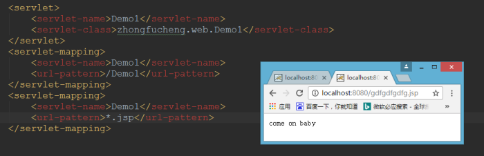

## **1.HttpServletRequest** 类

### a)HttpServletRequest 类有什么作用。

每次只要有请求进入 Tomcat 服务器，Tomcat 服务器就会把请求过来的 HTTP 协议信息解析好封装到 Request 对象中。然后传递到 service 方法（doGet 和 doPost）中给我们使用。我们可以通过 HttpServletRequest 对象，获取到所有请求的信息。

### b)HttpServletRequest 类的常用方法

| 方法                      | 描述                                 |
| ------------------------- | ------------------------------------ |
| getRequestURI()           | 获取请求的资源路径                   |
| getRequestURL()           | 获取请求的统一资源定位符（绝对路径） |
| getRemoteHost()           | 获取客户端的 ip 地址                 |
| getHeader()               | 获取请求头                           |
| getParameter()            | 获取请求的参数                       |
| getParameterValues()      | 获取请求的参数（多个值的时候使用）   |
| getMethod()               | 获取请求的方式 GET 或 POST           |
| setAttribute(key, value); | 设置域数据                           |
| getAttribute(key);        | 获取域数据                           |
| getRequestDispatcher()    | 获取请求转发对象                     |

常用 API 示例代码：

```java
  public class RequestAPIServlet extends HttpServlet {
        @Override
        protected void doGet(HttpServletRequest req, HttpServletResponse resp) throws ServletException, IOException {
            // i.getRequestURI() 获取请求的资源路径
        }
             System.out.println("URI => "+req.getRequestURI());
        // ii.getRequestURL() 获取请求的统一资源定位符（绝对路径）
            System.out.println("URL => "+req.getRequestURL());
/**
* 在 IDEA 中，使用 localhost 访问时，得到的客户端 ip 地址是 ===>>> 127.0.0.1<br/>
* 在 IDEA 中，使用127.0.0.1 访问时，得到的客户端 ip 地址是 ===>>>127.0.0.1<br/>
* 在 IDEA中，使用 真实ip 访问时，得到的客户端 ip地址是 ===>>>真实的客户端 ip地址<br/>
**/
// iii.getRemoteHost() 获取客户端的 ip 地址
System.out.println("客户端 ip 地址 => "+req.getRemoteHost());
// iv.getHeader() 获取请求头
System.out.println("请求头User-Agent ==>>"+req.getHeader("User-Agent"));
        // vii.getMethod() 获取请求的方式 GET 或 POST
System.out.println("请求的方式==>>"+req.getMethod());
    }
```

### c)如何获取请求参数表单：

表单：

```html
<body>
  <form action="http://localhost:8080/07_servlet/parameterServlet" method="get">
    用户名：<input type="text" name="username" /><br />
    密码：<input type="password" name="password" /><br />
    兴趣爱好：<input type="checkbox" name="hobby" value="cpp" />C++
    <input type="checkbox" name="hobby" value="java" />Java
    <input type="checkbox" name="hobby" value="js" />JavaScript<br />
    <input type="submit" />
  </form>
</body>
```

Java 代码：

```java
public class ParameterServlet extends HttpServlet {
    @Override
    protected void doGet(HttpServletRequest req, HttpServletResponse resp) throws ServletException, IOException { // 获取请求参数 String username = req.getParameter("username");
    String password = req.getParameter("password");
    String[] hobby = req.getParameterValues("hobby");
    System.out.println("用户名：" + username);
    System.out.println("密码：" + password);
    System.out.println("兴趣爱好：" + Arrays.asList(hobby));
    }
}
```

### **doGet** 请求的中文乱码解决：

```java
  // 获取请求参数
    String username = req.getParameter("username");
// 1 先以 iso8859-1 进行编码
// 2 再以 utf-8 进行解码
    username =new String(username.getBytes("iso-8859-1"), "UTF-8")
```

### **d)POST** 请求的中文乱码解决

```java
@Override
protected void doPost(HttpServletRequest req, HttpServletResponse resp) throws ServletException, IOException { //
    // 设置请求体的字符集为 UTF-8，从而解决 post 请求的中文乱码问题
    req.setCharacterEncoding("UTF-8");
    System.out.println("-------------doPost------------");
    // 获取请求参数
    String username = req.getParameter("username");
    String password = req.getParameter("password");
    String[] hobby = req.getParameterValues("hobby");
    System.out.println("用户名：" + username);
    System.out.println("密码：" + password);
    System.out.println("兴趣爱好：" + Arrays.asList(hobby));
}
```

### e)请求的转发

什么是请求的转发? 请求转发是指，服务器收到请求后，从一次资源跳转到另一个资源的操作叫请求转发。


Servlet1 代码：

```java
public class Servlet1 extends HttpServlet {
    @Override
    protected void doGet(HttpServletRequest req, HttpServletResponse resp) throws ServletException, IOException { // 获取请求的参数（办事的材料）查看
        String username = req.getParameter("username");
        System.out.println("在 Servlet1（柜台 1）中查看参数（材料）：" + username);
        // 给材料 盖一个章，并传递到 Servlet2（柜台 2）去查看
        req.setAttribute("key1", "柜台 1 的章");
        // 问路：Servlet2（柜台 2）怎么走
        /*** 请求转发必须要以斜杠打头，/ 斜杠表示地址为：http://ip:port/工程名/ , 映射到 IDEA 代码的 web 目录 <br/> **/
        RequestDispatcher requestDispatcher = req.getRequestDispatcher("/servlet2");
        RequestDispatcher requestDispatcher = req.getRequestDispatcher("http://www.baidu.com");
        // 走向 Sevlet2（柜台 2）
        requestDispatcher.forward(req, resp);
    }
}
```

Servlet2 代码：

```java
public class Servlet2 extends HttpServlet {
    @Override
    protected void doGet(HttpServletRequest req, HttpServletResponse resp) throws ServletException, IOException {
        // 获取请求的参数（办事的材料）查看
        String username = req.getParameter("username");
        System.out.println("在 Servlet2（柜台 2）中查看参数（材料）：" + username);
        // 查看 柜台 1 是否有盖章
         Object key1 = req.getAttribute("key1");
        System.out.println("柜台 1 是否有章：" + key1);
        // 处理自己的业务
        System.out.println("Servlet2 处理自己的业务 ");
    }
}
```

### f) base 标签的作用


```html
<!DOCTYPE html>
<html lang="zh_CN">
  <head>
    <meta charset="UTF-8" />
    <title>Title</title>
    <!--base 标签设置页面相对路径工作时参照的地址 href 属性就是参数的地址值 -->
    <base href="http://localhost:8080/07_servlet/a/b/" />
  </head>
  <body>
    这是 a 下的 b 下的 c.html 页面<br />
    <a href="../../index.html">跳回首页</a><br />
  </body>
</html>
```

### **g)Web** 中的相对路径和绝对路径

在 javaWeb 中，路径分为相对路径和绝对路径两种：

相对路径是：

. 表示当前目录

.. 表示上一级目录

资源名 表示当前目录/资源名

绝对路径：

http://ip:port/工程路径/资源路径

在实际开发中，路径都使用绝对路径，而不简单的使用相对路径。

1、绝对路径

2、base+相对

### **h)web** 中 **/** 斜杠的不同意义

```xml
/*在 web 中 / 斜杠 是一种绝对路径。

/ 斜杠 如果被浏览器解析，得到的地址是：http://ip:port/   */

<a href="/">斜杠</a>

/* / 斜杠 如果被服务器解析，得到的地址是：http://ip:port/工程路径 */

1、<url-pattern>/servlet1</url-pattern>

2、servletContext.getRealPath(“/”);

3、request.getRequestDispatcher(“/”);
/*
特殊情况： response.sendRediect(“/”);

把斜杠发送给浏览器解析。得到 http://ip:port/ */
```

## **2.HttpServletResponse** 类

### a)HttpServletResponse 类的作用

HttpServletResponse 类和 HttpServletRequest 类一样。每次请求进来，Tomcat 服务器都会创建一个 Response 对象传递给 Servlet 程序去使用。HttpServletRequest 表示请求过来的信息，HttpServletResponse 表示所有响应的信息，我们如果需要设置返回给客户端的信息，都可以通过 HttpServletResponse 对象来进行设置

### **b)两个输出流的说明。**

| 字节流 | getOutputStream(); | 常用于下载（传递二进制数据） |
| ------ | ------------------ | ---------------------------- |
| 字符流 | getWriter();       | 常用于回传字符串（常用）     |

两个流同时只能使用一个。

使用了字节流，就不能再使用字符流，反之亦然，否则就会报错。


### c)如何往客户端回传数据要求：往客户端回传字符串数据。

```java
public class ResponseIOServlet extends HttpServlet {
    @Override
    protected void doGet(HttpServletRequest req, HttpServletResponse resp) throws ServletException, IOException {
        // 要求 ： 往客户端回传 字符串 数据。
        PrintWriter writer = resp.getWriter();
        writer.write("response's content!!!"); } }
```

### d)响应的乱码解决

解决响应中文乱码方案一（不推荐使用）：

```java
// 设置服务器字符集为UTF-8
resp.setCharacterEncoding("UTF-8");
// 通过响应头，设置浏览器也使用UTF-8字符集
resp.setHeader("Content-Type", "text/html; charset=UTF-8");
```

解决响应中文乱码方案二（推荐）：

```java
// 它会同时设置服务器和客户端都使用UTF-8字符集，还设置了响应头
// 此方法一定要在获取流对象之前调用才有效
resp.setContentType("text/html; charset=UTF-8");
```

### e)请求重定向

请求重定向，是指客户端给服务器发请求，然后服务器告诉客户端说。我给你一些地址。你去新地址访问。叫请求重定向（因为之前的地址可能已经被废弃）。


请求重定向的第一种方案：

```java
// 设置响应状态码302 ，表示重定向，（已搬迁）

resp.setStatus(302);

// 设置响应头，说明新的地址在哪里

resp.setHeader("Location", "http://localhost:8080");
```

请求重定向的第二种方案（推荐使用）：

```java
resp.sendRedirect("http://localhost:8080");
```

## 2.Servlet 细节

### Servlet 调用


### 2.1 一个已经注册的 Servlet 可以被多次映射

同一个 Servlet 可以被映射到多个 URL 上。

```xml
<servlet>
  <servlet-name>Demo1</servlet-name>
  <servlet-class>zhongfucheng.web.Demo1</servlet-class>
</servlet>
<servlet-mapping>
  <servlet-name>Demo1</servlet-name>
  <url-pattern>/Demo1</url-pattern>
</servlet-mapping>
<servlet-mapping>
  <servlet-name>Demo1</servlet-name>
  <url-pattern>/ouzicheng</url-pattern>
</servlet-mapping>
```

无论我访问的是http://localhost:8080/Demo1还是http://localhost:8080/ouzicheng。我访问的都是Demo1。


### 2.2 Servlet 映射的 URL 可以使用通配符

通配符有两种格式：

1. 扩展名

2. 正斜杠（/）开头并以“/”结尾。
   匹配所有


匹配扩展名为.jsp 的



如果.扩展名和正斜杠（/）开头并以“/”结尾两种通配符同时出现，匹配的是哪一个呢？

1.看谁的匹配度高，谁就被选择  
2..扩展名的优先级最低
Servlet 映射的 URL 可以使用通配符和 Servlet 可以被映射到多个 URL 上的作用：

1.隐藏网站是用什么编程语言写的【.php,.net,.asp 实际上访问的都是同一个资源】

2.用特定的后缀声明版权【公司缩写】

```xml
<servlet>
  <servlet-name>Demo1</servlet-name>
  <servlet-class>zhongfucheng.web.Demo1</servlet-class>
</servlet>
<servlet-mapping>
  <servlet-name>Demo1</servlet-name>
  <url-pattern>*.jsp</url-pattern>
</servlet-mapping>
<servlet-mapping>
  <servlet-name>Demo1</servlet-name>
  <url-pattern>*.net</url-pattern>
</servlet-mapping>
<servlet-mapping>
  <servlet-name>Demo1</servlet-name>
  <url-pattern>*.asp</url-pattern>
</servlet-mapping>
<servlet-mapping>
  <servlet-name>Demo1</servlet-name>
  <url-pattern>*.php</url-pattern>
</servlet-mapping>
```

### 2.3 Servlet 是单例的

#### 2.3.1 为什么 Servlet 是单例的

**浏览器多次对 Servlet 的请求**，一般情况下，**服务器只创建一个 Servlet 对象**，也就是说，Servlet 对象**一旦创建了**，就会**驻留在内存中，为后续的请求做服务，直到服务器关闭**。

#### 2.3.2 每次访问请求对象和响应对象都是新的

对于每次访问请求，Servlet 引擎都会创建一个新的`HttpServletRequest`请求对象和一个新的`HttpServletResponse`响应对象，然后将这两个对象作为参数传递给它调用的 Servlet 的`service()`方法，service 方法再根据请求方式分别调用 doXXX 方法。

#### 2.3.3 线程安全问题

当多个用户访问 Servlet 的时候，**服务器会为每个用户创建一个线程。当多个用户并发访问 Servlet 共享资源的时候就会出现线程安全问题。**
原则：

- 1. 如果一个变量需要多个用户共享，则应当在访问该变量的时候，**加同步机制 synchronized (对象){}**
- 2. 如果一个变量**不需要共享，则直接在 `doGet()` 或者 `doPost()`**定义.这样不会存在线程安全问题

### 2.4 load-on-startup

如果在`<servlet>`元素中配置了一个`<load-on-startup>`元素，那么**WEB 应用程序在启动时**，就会**装载并创建 Servlet 的实例对象、以及调用 Servlet 实例对象的 init()方法。**


作用：

1. 为 web 应用写一个 InitServlet，这个**servlet 配置为启动时装载**，为整个 web 应用**创建必要的数据库表和数据**
2. 完成一些定时的任务【定时写日志，定时备份数据】

### 2.5 在 web 访问任何资源都是在访问 Servlet

当你启动 Tomcat，你在网址上输入http://localhost:8080。为什么会出现Tomcat小猫的页面？
这是由缺省 Servlet 为你服务的！
我们先看一下 web.xml 文件中的配置,web.xml 文件配置了一个缺省 Servlet

```xml
<servlet>
  <servlet-name>default</servlet-name>
  <servlet-class>org.apache.catalina.servlets.DefaultServlet</servlet-class>
  <init-param>
    <param-name>debug</param-name>
    <param-value>0</param-value>
  </init-param>
  <init-param>
    <param-name>listings</param-name>
    <param-value>false</param-value>
  </init-param>
  <load-on-startup>1</load-on-startup>
</servlet>

<servlet-mapping>
  <servlet-name>default</servlet-name>
  <url-pattern>/</url-pattern>
</servlet-mapping>
```

**什么叫做缺省 Servlet？**

凡是在 web.xml 文件中**找不到匹配的元素的 URL**，它们的访问请求都将交给缺省 Servlet 处理，也就是说，**缺省 Servlet 用于处理所有其他 Servlet 都不处理的访问请求**  
既然我说了在 web 访问任何资源都是在访问 Servlet，那么**我访问静态资源【本地图片，本地 HTML 文件】也是在访问这个缺省 Servlet【DefaultServlet】**
证实一下：当我没有手工配置缺省 Servlet 的时候，**访问本地图片是可以访问得到的**


现在我自己配置一个缺省 Servlet,Demo1 就是我手工配置的缺省 Servlet，覆盖掉 web.xml 配置的缺省 Servlet

```xml
    <servlet>
        <servlet-name>Demo1</servlet-name>
        <servlet-class>zhongfucheng.web.Demo1</servlet-class>
    </servlet>

    <servlet-mapping>
        <servlet-name>Demo1</servlet-name>
        <url-pattern>/</url-pattern>
    </servlet-mapping>
```

下面我继续访问一下刚才的图片，此时输出的是**Demo1 这个 Servlet 写上的内容了**


总结： **无论在 web 中访问什么资源【包括 JSP】，都是在访问 Servlet。**  
没有手工配置缺省 Servlet 的时候，**你访问静态图片，静态网页，缺省 Servlet 会在你 web 站点中寻找该图片或网页**，如果有就返回给浏览器，没有就报 404 错误
