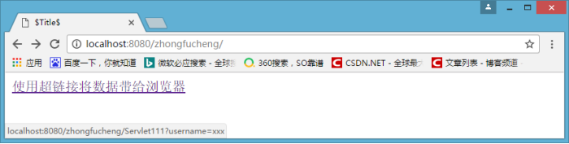

## 3. ServletConfig 对象

### 3.1 ServletConfig 对象有什么用？

通过此对象可以读取 web.xml 中配置的初始化参数。
现在问题来了， **为什么我们要把参数信息放到 web.xml 文件中呢？** 我们可以直接在程序中都可以定义参数信息，**搞到 web.xml 文件中又有什么好处呢？**
好处就是：**能够让你的程序更加灵活**【更换需求，更改配置文件 web.xml 即可，程序代码不用改】

### 3.2 获取 web.xml 文件配置的参数信息

- 为 Demo1 这个 Servlet 配置一个参数，参数名是 name，值是 zhongfucheng

```xml
<servlet>
    <servlet-name>Demo1</servlet-name>
    <servlet-class>zhongfucheng.web.Demo1</servlet-class>
    <init-param>
    <param-name>name</param-name>
    <param-value>zhongfucheng</param-value>
    </init-param>
</servlet>
<servlet-mapping>
    <servlet-name>Demo1</servlet-name>
    <url-pattern>/Demo1</url-pattern>
</servlet-mapping>
```

在 Servlet 中获取 ServletConfig 对象，通过 ServletConfig 对象获取在 web.xml 文件配置的参数


## 4. ServletContext 对象

### 4.1 什么是 ServletContext 对象？

当 Tomcat 启动的时候，就会创建一个 ServletContext 对象。**它代表着当前 web 站点**

### 4.2 ServletContext 有什么用？

1.ServletContext 既然代表着当前 web 站点，那么**所有 Servlet 都共享着一个 ServletContext 对象**，所以**Servlet 之间可以通过 ServletContext 实现通讯。**  
2.ServletConfig 获取的是配置的是单个 Servlet 的参数信息，**ServletContext 可以获取的是配置整个 web 站点的参数信息**  
3.**利用 ServletContext 读取 web 站点的资源文件**  
4.实现 Servlet 的转发【用 ServletContext 转发不多，主要用 request 转发】

### 4.3 Servlet 之间实现通讯

ServletContext 对象可以被称之为**域对象**
到这里可能有一个疑问，域对象是什么呢？其实域对象可以简单理解成一个容器**类似于 Map 集合**
实现 Servlet 之间通讯就**要用到 ServletContext 的 setAttribute(String name,Object obj)方法**，
第一个参数是关键字，第二个参数是你要存储的对象
这是 Demo2 的代码

```java
//获取到ServletContext对象
ServletContext servletContext = this.getServletContext();

String value = "zhongfucheng";

//MyName作为关键字，value作为值存进   域对象【类型于Map集合】
servletContext.setAttribute("MyName", value);
```

这是 Demo3 的代码

```java
//获取ServletContext对象
ServletContext servletContext = this.getServletContext();

//通过关键字获取存储在域对象的值
String value = (String) servletContext.getAttribute("MyName");

System.out.println(value);
```

访问 Demo3 可以获取 Demo2 存储的信息，从而实现多个 Servlet 之间通讯

### 4.4 获取 web 站点配置的信息

如果我想要让所有的 Servlet 都能够获取到连接数据库的信息，不可能在 web.xml 文件中每个 Servlet 中都配置一下，这样代码量太大了！并且会显得非常啰嗦冗余。

- web.xml 文件支持对**整个站点进行配置参数信息【所有 Servlet 都可以取到该参数信息】**

```xml
<context-param>
  <param-name>name</param-name>
  <param-value>zhongfucheng</param-value>
</context-param>
```

Demo4 代码

```java
//获取到ServletContext对象
ServletContext servletContext = this.getServletContext();

//通过名称获取值
String value = servletContext.getInitParameter("name");
System.out.println(value);

```

试一下 Demo3 是否能拿到，相同的代码

```java
//获取到ServletContext对象
ServletContext servletContext = this.getServletContext();

//通过名称获取值
String value = servletContext.getInitParameter("name");
System.out.println(value);
```

### 4.5 读取资源文件

读取资源第一种方式：  
第一种方式：现在我要通过 Servlet111 读取 1.png 图片


按我们以前的方式，代码应该是这样的。

```java
FileInputStream fileInputStream = new FileInputStream("1.png");
System.out.println(fileInputStream);
```

当我们访问的时候，却出错了！说找不到 1.png 文件


这是为什么呢？我们**以前读取文件的时候，如果程序和文件在同一包名，可以直接通过文件名称获取得到的！**  
原因很简单，**以前我们写的程序都是通过 JVM 来运行的，而现在，我们是通过 Tomcat 来运行的**
根据 web 的目录规范，Servlet 编译后的 class 文件是存放在 WEB-INF\classes 文件夹中的


看到这里，我们知道了**要进入 classes 目录中读取文件**，所以我们将代码改成以下方式

```java
FileInputStream fileInputStream = new FileInputStream("D:\\zhongfucheng\\web\\WEB-INF\\classes\\zhongfucheng\\web\\1.png");
System.out.println(fileInputStream);
```

再去读取时，就发现可以获取到文件了。但是现在问题又来了，**我读取文件的时候都要写上绝对路径，这样太不灵活了**。  
试想一下，如果我将该**读取文件的模块移到其他的 web 站点上，我的代码就又要修改了【因为 web 站点的名字不一样】。**
我们通过**ServletContext 读取就可以避免修改代码的情况**，因为 ServletContext 对象是根据当前 web 站点而生成的。  
代码如下所示：

```java
//获取到ServletContext对象
ServletContext servletContext = this.getServletContext();

//调用ServletContext方法获取到读取文件的流
InputStream inputStream = servletContext.getResourceAsStream("/WEB-INF/classes/zhongfucheng/web/1.png");
```

读取资源第二种方式：
如果我的**文件放在 web 目录下**，那么就简单得多了！,**直接通过文件名称就能获取**


代码如下所示

```java
//获取到ServletContext对象
ServletContext servletContext = this.getServletContext();

//调用ServletContext方法获取到读取文件的流
InputStream inputStream = servletContext.getResourceAsStream("2.png");
```

读取资源第三种方式：
通过**类装载器读取资源文件**。我的文件放在了**src 目录下【也叫做类目录】**

代码如下所示

```java
//获取到类装载器
ClassLoader classLoader = Servlet111.class.getClassLoader();

//通过类装载器获取到读取文件流
InputStream inputStream = classLoader.getResourceAsStream("3.png");
```


我的文件放在了 src 目录下的包下


代码如下，添加包名路径即可。

```java
//获取到类装载器
ClassLoader classLoader = Servlet111.class.getClassLoader();

//通过类装载器获取到读取文件流
InputStream inputStream = classLoader.getResourceAsStream("/zhongfucheng/web/1.png");
```

原则：**如果文件太大，就不能用类装载器的方式去读取，会导致内存溢出**

## Request 对象

### 1. 什么是 HttpServletRequest

HttpServletRequest 对象代表客户端的请求，当客户端通过 HTTP 协议访问服务器时，HTTP 请求头中的所有信息都封装在这个对象中，开发人员通过这个对象的方法，可以获得客户这些信息。  
简单来说，**要得到浏览器信息，就找 HttpServletRequest 对象**

### 2. HttpServletRequest 常用方法

#### 2.1 获得客户机【浏览器】信息

- `getRequestURL` 方法返回客户端发出请求时的完整 URL。
- `getRequestURI` 方法返回请求行中的资源名部分。
- `getQueryString`方法返回请求行中的参数部分。
- `getPathInfo` 方法返回请求 URL 中的额外路径信息。额外路径信息是请求 URL 中的位于 Servlet 的路径之后和查询参数之前的内容，它以“/”开头。
- `getRemoteAddr` 方法返回发出请求的客户机的 IP 地址
- `getRemoteHost`方法返回发出请求的客户机的完整主机名
- `getRemotePort` 方法返回客户机所使用的网络端口号
- `getLocalAddr` 方法返回 WEB 服务器的 IP 地址。
- `getLocalName` 方法返回 WEB 服务器的主机名

#### 2.2 获得客户机请求头

- `getHeader` 方法
- `getHeaders`方法
- `getHeaderNames` 方法

#### 2.3 获得客户机请求参数(客户端提交的数据)

- `getParameter` 方法
- `getParameterValues（String name）`方法
- `getParameterNames` 方法
- `getParameterMap` 方法

### 3. HttpServletRequest 应用

### 3.1 防盗链

什么是防盗链呢？比如：**我现在有海贼王最新的资源，想要看海贼王的要在我的网页上看。现在别的网站的人看到我有海贼王的资源，想要把我的资源粘贴在他自己的网站上。这样我独家的资源就被一个 CTRL+C 和 CTRL+V 抢走了？**  
而反盗链就是不能被他们 CRTL+C 和 CRTL+V

下面我模拟一下场景。现在我首页先有一个超链接，指向着海贼王最新资源


当我点进去，就能看到海贼王最新资源了


其他的人可以通过复制粘贴我的地址，放到它们的网页上

这样我就划不来啦【我的广告你来没看呢！】。**想要看我的资源，就必须经过我的首页点进去看。**
想要实现这样的效果，就要**获取 Referer 这个消息头，判断 Referer 是不是从我的首页来的。如果不是从我的首页来的，跳转回我的首页。**

```java
//获取到网页是从哪里来的
String referer = request.getHeader("Referer");

//如果不是从我的首页来或者从地址栏直接访问的，
if ( referer == null || !referer.contains("localhost:8080/zhongfucheng/index.jsp") ) {

//回到首页去
response.sendRedirect("/zhongfucheng/index.jsp");
return;
}

//能执行下面的语句，说明是从我的首页点击进来的，那没问题，照常显示
response.setContentType("text/html;charset=UTF-8");
response.getWriter().write("路飞做了 XXXXxxxxxxxxxxxxxxxx");
```

首先按正常预想的，**别人从首页点击我的资源，访问我海贼王最新的资源**


能够成功访问到资源


如果我在浏览器直接输入地址【此时 Referer 是为 null 的】，我们来看看


跳回到首页上，不能访问到海贼王资源


再试试，如果**别人粘贴了我的资源 url，在它的网页上挂了一个网址呢**。


在别人网页上点击的时候


又跳回到了我的首页了。


### 3.2 表单提交数据【通过 post 方式提交数据】

```html
<form action="/zhongfucheng/Servlet111" method="post">
  <table>
    <tr>
      <td>用户名</td>
      <td><input type="text" name="username" /></td>
    </tr>
    <tr>
      <td>密码</td>
      <td><input type="password" name="password" /></td>
    </tr>
    <tr>
      <td>性别</td>
      <td>
        <input type="radio" name="gender" value="男" />男
        <input type="radio" name="gender" value="女" />女
      </td>
    </tr>
    <tr>
      <td>爱好</td>
      <td>
        <input type="checkbox" name="hobbies" value="游泳" />游泳
        <input type="checkbox" name="hobbies" value="跑步" />跑步
        <input type="checkbox" name="hobbies" value="飞翔" />飞翔
      </td>
    </tr>
    <input type="hidden" name="aaa" value="my name is zhongfucheng" />
    <tr>
      <td>你的来自于哪里</td>
      <td>
        <select name="address">
          <option value="广州">广州</option>
          <option value="深圳">深圳</option>
          <option value="北京">北京</option>
        </select>
      </td>
    </tr>
    <tr>
      <td>详细说明:</td>
      <td>
        <textarea cols="30" rows="2" name="textarea"></textarea>
      </td>
    </tr>
    <tr>
      <td><input type="submit" value="提交" /></td>
      <td><input type="reset" value="重置" /></td>
    </tr>
  </table>
</form>
```

```java
//设置request字符编码的格式
request.setCharacterEncoding("UTF-8"); //通过html的name属性， 获取到值 String
username =request.getParameter("username"); String password =
request.getParameter("password"); String gender
=request.getParameter("gender");
//复选框和下拉框有多个值，获取到多个值
String[] hobbies = request.getParameterValues("hobbies"); String[] address
=request.getParameterValues("address");
//获取到文本域的值 String description
= request.getParameter("textarea");
//得到隐藏域的值 String hiddenValue
=request.getParameter("aaa"); ....各种System.out.println().......
```

向表单输入数据
Servlet111 得到表单带过来的数据，最后的一个数据是隐藏域带过来的。

### 3.3 超链接方式提交数据

常见的 get 方式提交数据有：使用超链接，`sendRedirect()`
格式如下： sendRedirect("servlet 的地址?参数名="+参数值 &"参数名="+参数值);
我们来使用一下，通过超链接将数据带给浏览器 `
<a href="/zhongfucheng/Servlet111?username=xxx"

使用超链接将数据带给浏览器`</a>`

> 在 Servlet111 接收数据

```java
//接收以 username 为参数名带过来的值 String
 username = request.getParameter("username");
System.out.println(username);
```

`</form>`
注意看**浏览器左下角**  
  
服务器成功接收到浏览器发送过来的数据  
  
并且，**传输数据明文的出现在浏览器的地址栏上**  
`sendRedirect()`和超链接类似，在这里就不赘述了

### 3.4 解决中文乱码问题

细心的朋友会发现，我在获取表单数据的时候，有这句代码 request.setCharacterEncoding("UTF-8");，如果没有这句代码，会发生什么事呢？我们看看。
再重新填写数据
  
在服务器查看提交过来的数据，**所有的中文数据都乱码了**
  
来这里我们来分析一下乱码的原因，  
Tomcat 服务器默认编码是 ISO8859-1，而浏览器使用的是**UTF-8 编码**。浏览器的中文数据提交给服务器，**Tomcat 以 ISO8859-1 编码对中文编码，当我在 Servlet 读取数据的时候，拿到的当然是乱码**。
而我设置 request 的编码为 UTF-8，乱码就解决了。
接下来使用**get**方式传递中文数据，**把表单的方式改成 get**即可，当我们访问的时候，又出现乱码了！
  
于是我按照上面的方式，把 request 对象设置编码为 UTF-8 试试 `java request.setCharacterEncoding("UTF-8"); String name =request.getParameter("name");` 结果还是乱码。
  
这是为什么呢？**我明明已经把编码设置成 UTF-8 了，按照 post 方式，乱码问题已经解决了！**。我们来看看 get 和 post 方式的区别在哪？**为什么 post 方式设置了 request 编码就可以解决乱码问题，而 get 方式不能呢。**
首先我们来看一下 post 方法是怎么进行参数传递的。当我们**点击提交按钮的时候，数据封装进了 FormData 中，http 请求中把实体主体带过去了【传输的数据称之为实体主体】**，既然 request 对象封装了 http 请求，所以**request 对象可以解析到发送过来的数据**，于是只要**把编码设置成 UTF-8 就可以解决乱码问题了**  
  
而 get 方式不同，它的**数据是从消息行带过去的，没有封装到 request 对象里面**，所以使用 request 设置编码是无效的。
  
要解决 get 方式乱码问题也不难，我们既然知道 Tomcat 默认的编码是 ISO
8859-1，那么**get 方式由消息体带过去给浏览器的时候肯定是用 ISO 8859-1 编码了**。

```java
 //此时得到的数据已经是被ISO 8859-1编码后的字符串了，这个是乱码 String
name = request.getParameter("username");
//乱码通过反向查ISO
8859-1得到原始的数据 byte[] bytes = name.getBytes("ISO8859-1");
//通过原始的数据，设置正确的码表， 构建字符串 String value =
newString(bytes,"UTF-8");
```

上面的代码有些难理解，我画张图说明一下：

  
经过我们手工转换，再来访问一下
  
好的，成功解决掉乱码问题了。除了手工转换，**get 方式还可以改 Tomcat 服务器的配置来解决乱码，但是不推荐使用，这样不灵活。“**
我们都知道**Tomcat 默认的编码是 ISO 8859-1,如果在 Tomcat 服务器的配置下改成是 UTF-8 的编码，那么就解决服务器在解析数据的时候造成乱码问题了**
在 8080 端口的 Connector 上加入 URIEncoding="utf-8"，设置 Tomcat 的访问该端口时的编码为 utf-8，从而解决乱码，**这种改法是固定使用 UTF-8 编码的**

```xml
<Connector
  port="8080"
  protocol="HTTP/1.1"
  connectionTimeout="20000"
  redirectPort="8443"
  URIEncoding="utf-8"
/>
```

设置了编码后，没有做任何手工转换，成功拿到数据   
当然也有另一种改服务器编码的方式。设置 Tomcat 的访问该端口时的编码**为页面的编码，这种改法是随着页面的编码而变**

```xml
<Connector
  port="8080"
  protocol="HTTP/1.1"
  connectionTimeout="20000"
  redirectPort="8443"
  useBodyEncodingForURI="true"
/>
```

设置编码为 UTF-8

```java
request.setCharacterEncoding("UTF-8");
String name=request.getParameter("name");
```

再次访问  
  
手写超链接如果附带中文参数问题，要 URL 重写，在 JSP 博客中会讲到  
 总结：

- post 方式直接改 request 对象的编码 - get 方式需要手工转换编码

- **get 方式也可以修改 Tomcat 服务器的编码，不推荐，因为会太依赖服务器了！**
  提交数据能用 post 就用 post`</form>`

### 3.5 实现转发

之前讲过使用 response 的 sendRedirect()可以**实现重定向，做到的功能是页面跳转**，使用 request 的 getRequestDispatcher.forward(request,response)** 实现转发，做到的功能也是页面跳转**，他们有什么区别呢？  
现在我先来说下转发代码如下所示

```java
 //获取到requestDispatcher对象，跳转到index.jsp
RequestDispatcher requestDispatcher =request.getRequestDispatcher("/index.jsp");
//调用requestDispatcher对象的forward()实现转发,传入request和response方法
requestDispatcher.forward(request, response);
```

访问 Servlet111
上面已经说了，可以通**过`sendRedirect()`重定向可以在资源尾部添加参数提交数据给服务器。那么转发能不能提交数据给服务器呢？答案明显是可以的，并且使用这种方法非常频繁**
在讲 ServletContext 的时候，**Servlet 之间可以通过 ServletContext 实现通讯，ServletContext 也能称之为域对象。而 request 也可以称之为域对象，**
只不过 ServletContext 的域是整个 web 应用，而**request 的域仅仅代表一次 http 请求**
下面我们来使用 request 实现 Servlet 之间的通讯，  
Servlet111 代码

```java
//以username为关键字存zhongfucheng值
request.setAttribute("username","zhongfucheng");
//获取到requestDispatcher对象
RequestDispatcher requestDispatcher =
request.getRequestDispatcher("/Servlet222");
//调用requestDispatcher对象的forward()实现转发,传入request和response方法
requestDispatcher.forward(request, response);
```

Servlet222 代码

```java
//获取到存进request对象的值 String userName = (String)
request.getAttribute("username");
//在浏览器输出该值
response.getWriter().write("i am :"+userName);
```

访问 Servlet111 看下效果
  
如上图所示，**Servlet222 成功拿到了 request 对象在 Servlet111 存进的数据**。
现在问题又来了，我们可以**使用 ServletContext 和 request 实现 Servlet 之间的通讯，那么我们用哪一种呢？** 一般的原则： **可以使用 request 就尽可能使用 request。** 因为 ServletContext 代表着整个 web 应用，

使用 ServletContext 会消耗大量的资源，而

**request 对象会随着请求的结束而结束，资源会被回收。使用 request 域进行 Servlet 之间的通讯在开发中是非常频繁的。**

### 3.6 转发的时序图


#### 3.6.1

请求转发的细节
如果在**调用 forward 方法之前**，在**Servlet 程序中写入的部分内容已经被真正地传送到了客户端**，forward 方法将抛出 IllegalStateException 异常。
也就是说：**不要在转发之前写数据给浏览器** 我们来试试是不是真的会出现异常。

```java
 OutputStream outputStream = response.getOutputStream();
outputStream.write("--------------------------------------------".getBytes());
//关闭流，确保让数据到浏览器中
outputStream.close();
//跳转
request.getRequestDispatcher("/Foot").forward(request, response);
```

访问的时候，看到浏览器可以输出数据，Tomcat 后台抛出了异常
  
如果在调用 forward 方法之前向 Servlet 引擎的缓冲区中写入了内容，**只要写入到缓冲区中的内容还没有被真正输出到客户端**，forward 方法就可以被正常执行，**原来写入到输出缓冲区中的内容将被清空**，但是，**已写入到 HttpServletResponse 对象中的响应头字段信息保持有效**。

### **3.7 转发和重定向的区别**

#### **3.7.1 实际发生位置不同，地址栏不同**

- 转发是发生在服务器的
  **转发是由服务器进行跳转的**，细心的朋友会发现，在转发的时候，**浏览器的地址栏是没有发生变化的**，在我访问 Servlet111 的时候，即使跳转到了 Servlet222 的页面，浏览器的地址还是 Servlet111 的。也就是说**浏览器是不知道该跳转的动作，转发是对浏览器透明的**。通过上面的转发时序图我们也可以发现，**实现转发只是一次的 http 请求**，**一次转发中 request 和 response 对象都是同一个**。这也解释了，为什么可以使用**request 作为域对象进行 Servlet 之间的通讯。**
- 重定向是发生在浏览器的**重定向是由浏览器进行跳转的**，进行重定向跳转的时候，**浏览器的地址会发生变化的**。曾经介绍过：实现重定向的原理是由 response 的状态码和 Location 头组合而实现的。**这是由浏览器进行的页面跳转**实现重定向**会发出两个 http 请求**，**request 域对象是无效的，因为它不是同一个 request 对象**

#### **3.7.2 用法不同**

很多人都搞不清楚转发和重定向的时候，**资源地址究竟怎么写**。有的时候要把应用名写上，有的时候不用把应用名写上。很容易把人搞晕。记住一个原则：
**给服务器用的直接从资源名开始写，给浏览器用的要把应用名写上**

- request.getRequestDispatcher("/资源名 URI").forward(request,response)  
  **转发时"/"代表的是本应用程序的根目录【zhongfucheng】**
- response.send("/web 应用/资源名 URI");
- **重定向时"/"代表的是 webapps 目录**

#### **3.7.3 能够去往的 URL 的范围不一样**

- **转发是服务器跳转只能去往当前 web 应用的资源**
- **重定向是服务器跳转，可以去往任何的资源**

#### **3.7.4 传递数据的类型不同**

- **转发的 request 对象可以传递各种类型的数据，包括对象** **重定向只能传递字符串**

#### **3.7.5 跳转的时间不同**

- 转发时：执行到跳转语句时就会立刻跳转

- **重定向：整个页面执行完之后才执行跳转**

### 3.8 转发和重定向使用哪一个？

根据上面说明了转发和重定向的区别也可以很容易概括出来。
**转发是带着转发前的请求的参数的。重定向是新的请求。**

1. **典型**的应用场景： 转发: 访问 Servlet 处理业务逻辑，然后 forward 到 jsp 显示处理结果，浏览器里 URL 不变
2. **重定向**: 提交表单，处理成功后 redirect 到另一个 jsp，防止表单重复提交，浏览器里 URL 变了

### **3.9 RequestDispatcher 再说明**

RequestDispatcher 对象调用`forward()`可以实现转发上面已经说过了。RequestDispatcher 还有另外一个方法`include()`，该方法可以实现包含，有什么用呢？
我们在写网页的时候，一般网**页的头部和尾部是不需要改变的**。  
如果我们**多个地方使用 Servlet 输出网头和网尾的话，需要把代码重新写一遍**。而使用 RequestDispatcher 的**include()方法就可以实现包含网头和网尾的效果了**。
我们来操作吧！现在我有网头和网尾的 Servlet 2


使用 Servlet111 将网头和网尾包含

```java
request.getRequestDispatcher("/Head").include(request, response);
response.getWriter().write("--------------------------------------------");
request.getRequestDispatcher("/Foot").include(request, response);
```

访问一下 Servlet111,成功把网头和网尾包含了 
