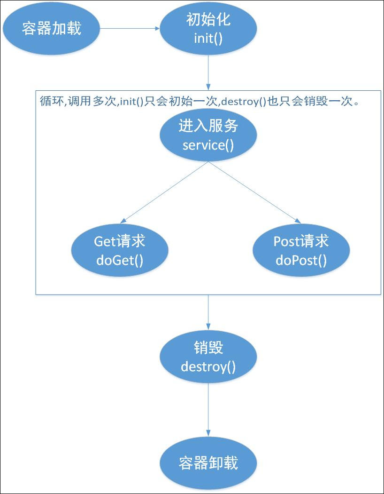

## 生命周期

每个 Servlet 的运行都遵循如下生命周期:

### 1. 创建 Servlet 实例

web 容器负责加载 Servlet，当 web 容器启动时或者是在第一次使用这个 Servlet 时，容器会负责创建 Servlet 实例，但是用户必须通过部署描述符（web.xml）指定 Servlet 的位置，也就是 Servlet 所在的类名称，成功加载后，web 容器会通过反射的方式对 Servlet 进行实例化。

### 2. WEB 容器调用 Servlet 的 init()方法，对 Servlet 进行初始化

在 Servlet 实例化之后，Servlet 容器会调用`init()`方法，来初始化该对象，主要是为了让 Servlet 对象在处理客户请求前可以完成一些初始化的工作，例如，建立数据库的连接，获取配置信息等。对于每一个 Servlet 实例，init()方法只能被调用一次。init()方法有一个类型为 ServletConfig 的参数，Servlet 容器通过这个参数向 Servlet 传递配置信息。Servlet 使用 ServletConfig 对象从 Web 应用程序的配置信息中获取以名-值对形式提供的初始化参数。另外，在 Servlet 中，还可以通过 ServletConfig 对象获取描述 Servlet 运行环境的 ServletContext 对象，使用该对象，Servlet 可以和它的 Servlet 容器进行通信。无论有多少客户机访问 Servlet，都不会重复执行 init()。

### 3. Servlet 初始化之后，将一直存在于容器中，service()响应客户端请求

1. 如果客户端发送 GET 请求，容器调用 Servlet 的 doGet 方法处理并响应请求

2. 如果客户端发送 POST 请求，容器调用 Servlet 的 doPost 方法处理并响应请求

3. 或者统一用`service()`方法处理来响应用户请求

**service()是 Servlet 的核心，负责响应客户的请求。**每当一个客户请求一个 HttpServlet 对象，该对象的`Service()`方法就要调用，而且传递给这个方法一个“请求”（ServletRequest）对象和一个“响应”（ServletResponse）对象作为参数。在 HttpServlet 中已存在 Service()方法。默认的服务功能是调用与 HTTP 请求的方法相应的 do 功能。要注意的是，在 service()方法被容器调用之前，必须确保 init()方法正确完成。容器会构造一个表示客户端请求信息的请求对象（类型为 ServletRequest）和一个用于对客户端进行响应的响应对象（类型为 ServletResponse）作为参数传递给`service()`方法。在`service()`方法中，Servlet 对象通过 ServletRequest 对象得到客户端的相关信息和请求信息，在对请求进行处理后，调用 ServletResponse 对象的方法设置响应信息。

### 4. WEB 容器决定销毁 Servlet 时，先调用 Servlet 的 destroy()方法，通常在关闭 web 应用之前销毁 Servlet

`destroy()`仅执行一次，在服务器端停止且卸载 Servlet 时执行该方法。当容器检测到一个 Servlet 对象应该从服务中被移除的时候，容器会调用该对象的`destroy()`方法，以便让 Servlet 对象可以释放它所使用的资源，保存数据到持久存储设备中，例如，将内存中的数据保存到数据库中，关闭数据库的连接等。当需要释放内存或者容器关闭时，容器就会调用 Servlet 对象的`destroy()`方法。在 Servlet 容器调用`destroy()`方法前，如果还有其他的线程正在`service()`方法中执行，容器会等待这些线程执行完毕或等待服务器设定的超时值到达。一旦 Servlet 对象的`destroy()`方法被调用，容器不会再把其他的请求发送给该对象。如果需要该 Servlet 再次为客户端服务，容器将会重新产生一个 Servlet 对象来处理客户端的请求。在`destroy()`方法调用之后，容器会释放这个 Servlet 对象，在随后的时间内，该对象会被 Java 的垃圾收集器所回收。

## 总结

1. 在正常情况下，Servlet 只会初始化一次，而处理服务会调用多次，销毁也只会调用一次；但是如果一个 Servlet 长时间不使用的话，也会被容器自动销毁，而如果需要再次使用时会重新进行初始化的操作，即在特殊情况下初始化可能会进行多次，销毁也可能进行多次。

2. 在 servlet 实例创建之后，在 servlet 能为客户请求提供服务之前，容器会在 servlet 实例上调用 init()方法。如果你有初始化代码，就应该覆盖 servlet 类的 init()方法，否则会调用 GenericServlet 的 init()方法。而对应每个客户请求（无论是谁，无论是不是同一个人，只针对请求），容器都会创建一对新的请求和响应对象，创建一个新的线程/栈。任何 servlet 类都不会有多个实例，除非一种特殊情况（SingleThreadModel）。

3. servlet 生命周期的 4 个周期总结如下：
   a. 实例化以及加载 servlet，new 的过程
   b. 初始化 init(ServletConfig)。
   c. 处理请求，调用 servlet 的 service，doget，dopost 方法将 Request 和 Response，作为参数传递。
   d. 退出服务，调用 destory 方法释放资源。
