## 一、局域网、广域网和 Internet

### 1.1、局域网

1）概述

局域网（Local Area Network，LAN）是指在某一区域内由多台计算机互联成的计算机组。一般是方圆几千米以内。局域网可以实现  
　　　　文件管理、应用软件共享、打印机共享、工作组内的日程安排、电子邮件和传真通信服务等功能。局域网是封闭型的，可以由办公室内的两台计算机组成，也可以由一个公司内的上千台计算机组成。  
　　局域网（Local Area Network，LAN）是在一个局部的地理范围内（如一个学校、工厂和机关内），一般是方圆几千米以内，将各种计算机，外部设备和数据库等互相联接起来组成的计算机通信网。  
　　　　它可以通过数据通信网或专用数据电路，与远方的局域网、数据库或处理中心相连接，构成一个较大范围的信息处理系统。局域网可以实现文件管理、应用软件共享、打印机共享、  
　　　　扫描仪共享、工作组内的日程安排、电子邮件和传真通信服务等功能。
　　　　局域网严格意义上是封闭型的。它可以由办公室内几台甚至上千上万台计算机组成。决定局域网的主要技术要素为：网络拓扑，传输介质与介质访问控制方法。

2）特点

覆盖范围较小、自己花钱买设备来组件小型网络，宽带固定，自己维护

覆盖范围小：相比于整个 internet 来讲，局域网肯定很小了，例如，校园网、企业网，覆盖范围也就那么一点

宽带固定：因为是局域网，范围小，网络部拥堵，几乎就是有多少带宽，趋于稳定

自己花钱买设备维护：比如以下的是校园网， 三个教室，每个教室都有电脑，每台电脑都连自己教室里的交换机，接入交换机又连到学校里一个更大的汇聚交换机，汇聚交换机连接外面的网络，

校园内每间教室或者每个用网的地方都是如此来上网的，这样学校自己花钱买的交换机， 自己来维护自己学校里面的网络。

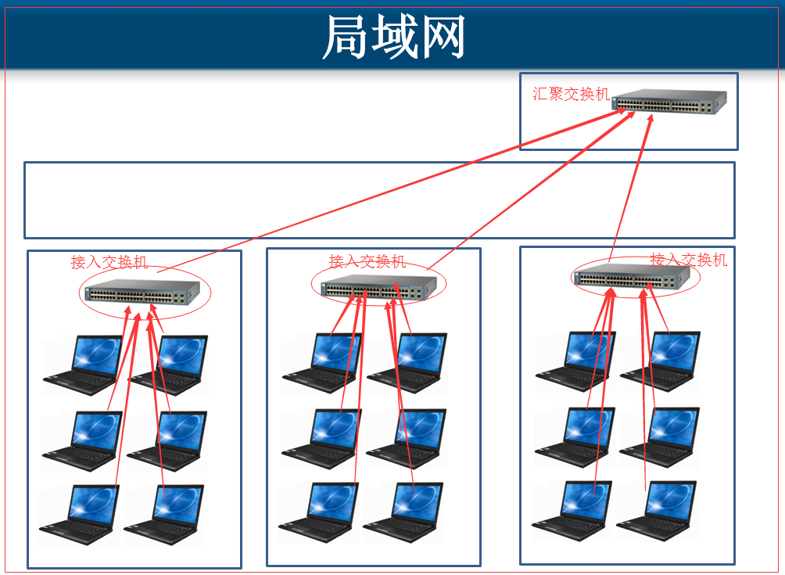

### 1.2、广域网

1）概述

广域网（WAN，Wide Area Network）也称远程网（long haul network ）。通常跨接很大的物理范围，所覆盖的范围从几十公里到几千公里，  
　　　　它能连接多个城市或国家，或横跨几个洲并能提供远距离通信，形成国际性的远程网络。  
　　覆盖的范围比局域网（LAN）和城域网（MAN）都广。广域网的通信子网主要使用分组交换技术。广域网的通信子网可以利用公用分组交换网、卫星通信网和无线分组交换网，  
　　　　它将分布在不同地区的局域网或计算机系统互连起来，达到资源共享的目的。如因特网（Internet）是世界范围内最大的广域网。  
　　广域网是由许多交换机组成的，交换机之间采用点到点线路连接，几乎所有的点到点通信方式都可以用来建立广域网，  
　　　　包括租用线路、光纤、微波、卫星信道。而广域网交换机实际上就是一台计算机，有处理器和输入/输出设备进行数据包的收发处理。

2）举例生活：距离远 花钱租带宽

看下图，我们不管哪个地方上网，都必须联网，上网能访问一些网站，跟别人聊天，为什么呢？  
　　因为有一些 ISP 在帮我们做牵线工作。ISP(Internet Service Provider)因特网服务提供商，电信、联通、移动等，它们在各个地方埋网线，有自己的主机、 然后我们出钱连入他们的网络，  
　　就能访问上网了。有一些网站站点放在电信机房中，我们电信网去访问，就会比较快，因为通往主机那边的地址的方式很多，如果电信网访问放在联通主机房中的网址，则相对会受到影响。

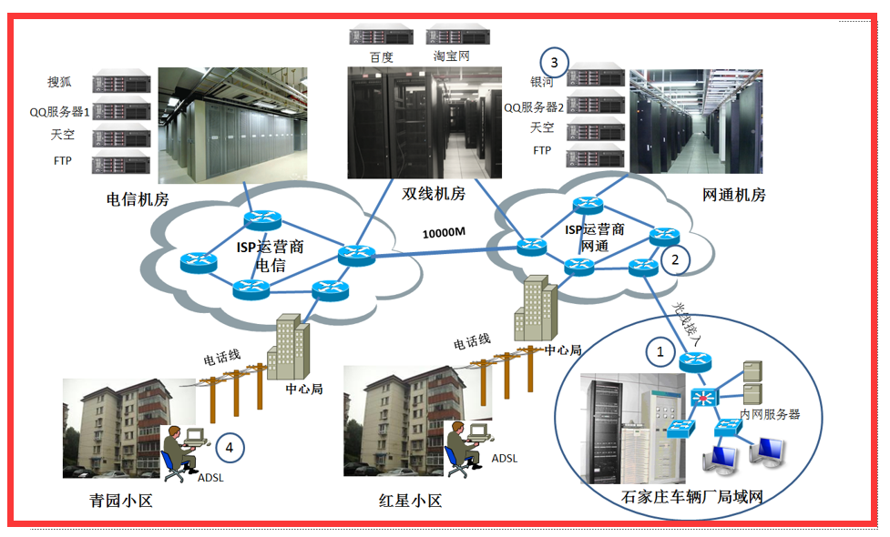

### 1.3、Internet

Internet，中文正式译名为因特网，又叫做国际互联网。它是由那些使用公用语言互相通信的计算机连接而成的全球网络。一旦你连接到它的任何一个节点上，就意味着您的计算机已经连入 Internet 网上了。  
　　 Internet 目前的用户已经遍及全球，有超过几亿人在使用 Internet，并且它的用户数还在以等比级数上升。

## 二、计算机数据之间通信的过程

### 2.1、路由器的功能（转发收到的分组）

1）什么是分组？

发送一段数据，将该段数据进行分组发送，而不是一次性全发送完。

2）什么是分组交换？

在网路中，路由器跟路由器之间有一定的距离， 我们计算机要发送一段数据出去，首先将数据分成 n 个分组，在每个分组前特定的头部，就成了数据包。

然后将数据包发送到路由器，通过路由器来接受这些数据包，然后一部分一部分的发送，接受，在发送其中一个数据包的过程中，占用了其中的道路，发送完这一个，

就释放，并不是一直占用该资源，直到传输结束，在其接受或发送数据时，也可以接受或发送别的数据，看先接受谁，就先发送谁，其实就是一个队列。

3）分组交换、电路交换、报文交换的区别？

电路交换：就是电话线， A 打给 B ，AB 之间的电话线就接通了，那么不管他两说没说话，说多久，直到挂断之前，该线都是在占用之中。

报文交换：一次性发送完整的数据，那么该段路就被占用，传完就释放，然后接下一步的传送。直到到达目的地

分组交换：高效、灵活、迅速、可靠。

4）图解

情景： 1 号计算机和 2 号计算机组成局域网， 主机 1、主机 2、主机 3 就相当于电信的主机，网页都存在在主机中

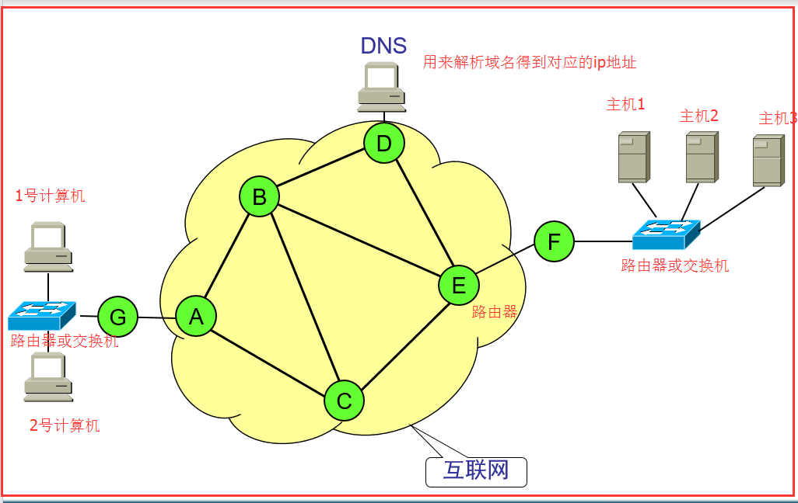

4.1）ip 地址跟 MAC 地址：

每个计算机都有自己独特的 ip 地址，全球独一无二，跟电话一样，有些电话是 031-开头 有些地区是 079 开头， 这是分地区的，ip 地址也是一样，

mac 地址：每台计算机上都有一个物理地址，也是独有的。在网卡上面，路由器也有 mac 地址。

4.2）号计算机如何通过 www.baidu.com 来访问到百度的主页：

每台计算机上都有 DNS 解析器， 通过 DNS 将域名解析成对应地址，

路由器每次识别目标 ip 地址，以此来更改原 mac 地址和下一步目标的 mac 地址

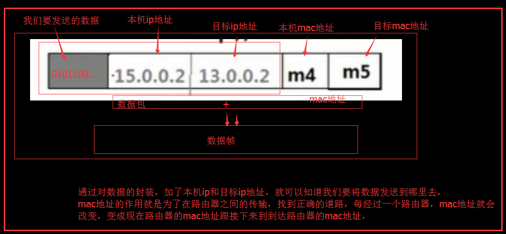

4.3）主机如何将网页数据发回请求的计算机：

第一步：将要返回的数据分成 N 份
　　　　　　第二步：每次将发送几份到缓存中，缓存就相当于队列，先进先出，缓存中发一份发回请求的计算机
　　　　　　第三步：计算机接到第一份，返回一个数据，让主机发送下一份，然后将缓存中刚才发送的那一份删除
　　　　　　第四步；如果中途数据丢包，则从缓存中继续发送刚才不成功那一份，直到接收到请求的计算机发回的确认数据。

## 三、OSI 参考模型

### 3.1、OSI 参考模型概述

OSI（Open Systems Interconnection Reference Model）OSI/RM 简称 OSI 开放系统互连参考模型，通俗的将就是我们说的 7 层协议的体系结构

OSI 七层模型的划分：

OSI 定义了网络互连的七层框架（物理层、数据链路层、网络层、传输层、会话层、表示层、应用层），即 ISO 开放互连系统参考模型。

每一层实现各自的功能和协议，并完成与相邻层的接口通信。OSI 的服务定义详细说明了各层所提供的服务。某一层的服务就是该层及其下各层的一种能力，它通过接口提供给更高一层。各层所提供的服务与这些服务是怎么实现的无关。

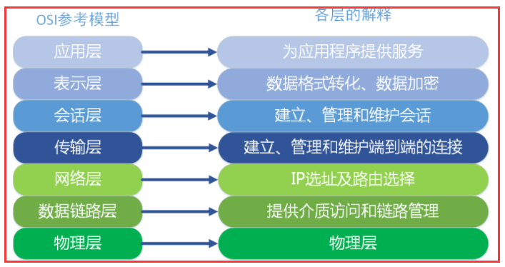

### 3.2、各层功能概述

在这里我们简单描述一下各层的功能，不详细深究，因为每一层实际都是一个复杂的层。整个过程以公司 A 和公司 B 的一次商业报价单发送为例子进行讲解。

注意：这七层是在发送数据到网线之前，在计算机中内部就已经经过了这 7 层，不是在传输过程中才慢慢经过这 7 层的。

1）应用层

OSI 参考模型中最靠近用户的一层，是为计算机用户提供应用接口，也为用户直接提供各种网络服务。我们常见应用层的网络服务协议有：HTTP，HTTPS，FTP，POP3、SMTP 等。

​ 　 例子 ：实际公司 A 的老板就是我们所述的用户，而他要发送的商业报价单，就是应用层提供的一种网络服务，当然，老板也可以选择其他服务，比如说，发一份商业合同，发一份询价单，等等。

2）表示层

表示层提供各种用于应用层数据的编码和转换功能,确保一个系统的应用层发送的数据能被另一个系统的应用层识别。如果必要，该层可提供一种标准表示形式，

用于将计算机内部的多种数据格式转换成通信中采用的标准表示形式。数据压缩和加密也是表示层可提供的转换功能之一。

例子：由于公司 A 和公司 B 是不同国家的公司，他们之间的商定统一用英语作为交流的语言，所以此时表示层（公司的文秘），就是将应用层的传递信息转翻译成英语。

同时为了防止别的公司看到，公司 A 的人也会对这份报价单做一些加密的处理。这就是表示的作用，将应用层的数据转换翻译等。

3）会话层

会话层就是负责建立、管理和终止表示层实体之间的通信会话。该层的通信由不同设备中的应用程序之间的服务请求和响应组成。

例子：会话层的同事拿到表示层的同事转换后资料，（会话层的同事类似公司的外联部），会话层的同事那里可能会掌握本公司与其他好多公司的联系方式，这里公司就是实际传递过程中的实体。

他们要管理本公司与外界好多公司的联系会话。当接收到表示层的数据后，会话层将会建立并记录本次会话，他首先要找到公司 B 的地址信息，然后将整份资料放进信封，并写上地址和联系方式。

准备将资料寄出。等到确定公司 B 接收到此份报价单后，此次会话就算结束了，外联部的同事就会终止此次会话。

4）传输层

传输层建立了主机端到端的链接，传输层的作用是为上层协议提供端到端的可靠和透明的数据传输服务，包括处理差错控制和流量控制等问题。该层向高层屏蔽了下层数据通信的细节，

使高层用户看到的只是在两个传输实体间的一条主机到主机的、可由用户控制和设定的、可靠的数据通路。我们通常说的，TCP UDP 就是在这一层。端口号既是这里的“端”。

例子： 传输层就相当于公司中的负责快递邮件收发的人，公司自己的投递员，他们负责将上一层的要寄出的资料投递到快递公司或邮局。

5）网络层

本层通过 IP 寻址来建立两个节点之间的连接，为源端的运输层送来的分组，选择合适的路由和交换节点，正确无误地按照地址传送给目的端的运输层。

就是通常说的 IP 层。这一层就是我们经常说的 IP 协议层。IP 协议是 Internet 的基础。

例子： 网络层就相当于快递公司庞大的快递网络，全国不同的集散中心，比如说，从深圳发往北京的顺丰快递（陆运为例啊，空运好像直接就飞到北京了），

首先要到顺丰的深圳集散中心，从深圳集散中心再送到武汉集散中心，从武汉集散中心再寄到北京顺义集散中心。这个每个集散中心，就相当于网络中的一个 IP 节点。

6）数据链路层

将比特组合成字节,再将字节组合成帧,使用链路层地址 (以太网使用 MAC 地址)来访问介质,并进行差错检测。  
　　　　数据链路层又分为 2 个子层：逻辑链路控制子层（LLC）和媒体访问控制子层（MAC）。  
　　　　 MAC 子层处理 CSMA/CD 算法、数据出错校验、成帧等；LLC 子层定义了一些字段使上次协议能共享数据链路层。 在实际使用中，LLC 子层并非必需的。

7）物理层

实际最终信号的传输是通过物理层实现的。通过物理介质传输比特流。规定了电平、速度和电缆针脚。  
　　　　常用设备有（各种物理设备）集线器、中继器、调制解调器、网线、双绞线、同轴电缆。这些都是物理层的传输介质。  
　　　　例子： 快递寄送过程中的交通工具，就相当于我们的物理层，例如汽车，火车，飞机，船。

### 3.3、各层通信的特点

通信特点：对等通信

对等通信，为了使数据分组从源传送到目的地，源端 OSI 模型的每一层都必须与目的端的对等层进行通信，这种通信方式称为对等层通信。在每一层通信过程中，使用本层自己协议进行通信。

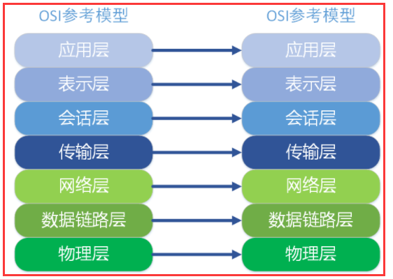

## 四、TCP/IP 五层模型

TCP/IP 五层协议和 OSI 的七层协议对应关系如下

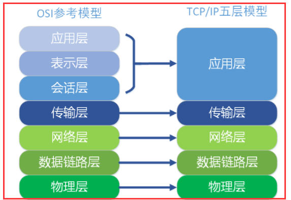

在每一层都工作着不同的设备，比如我们常用的交换机就工作在数据链路层的，一般的路由器是工作在网络层的。

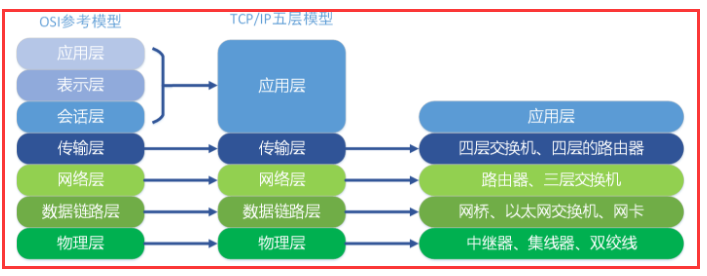

在每一层实现的协议也各不同，即每一层的服务也不同.下图列出了每层主要的协议。其中每层中具体的协议。

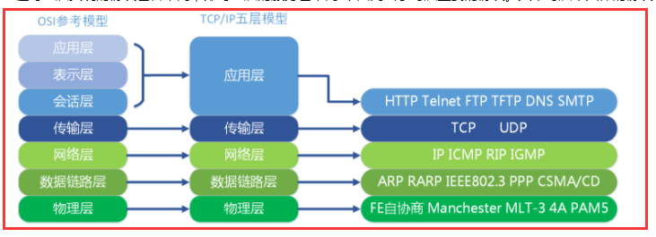

## 五、OSI 参考模型和 TCP/IP 协议

1）OSI 参考模型和 TCP/IP 协议图

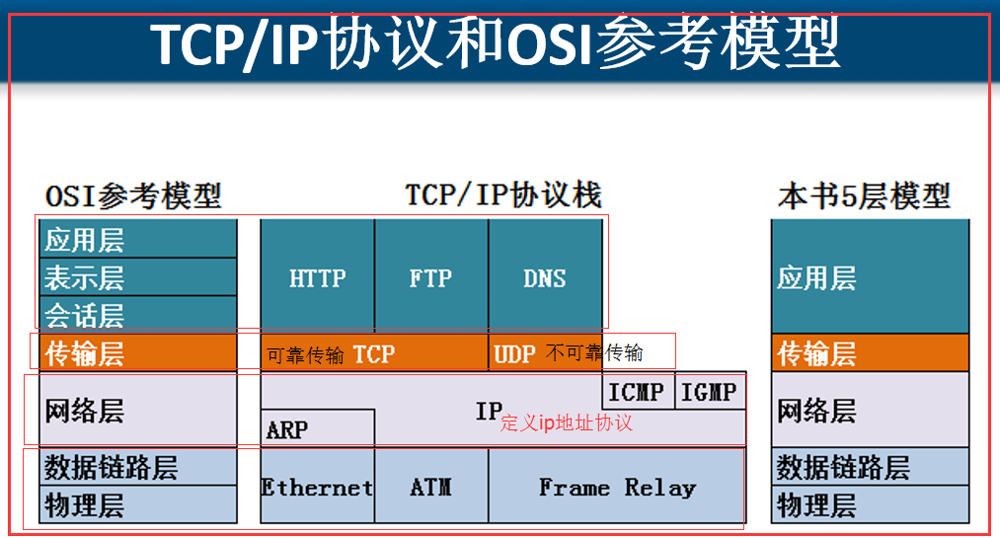

2）发送数据：数据的封装，各个层次都做了什么事情

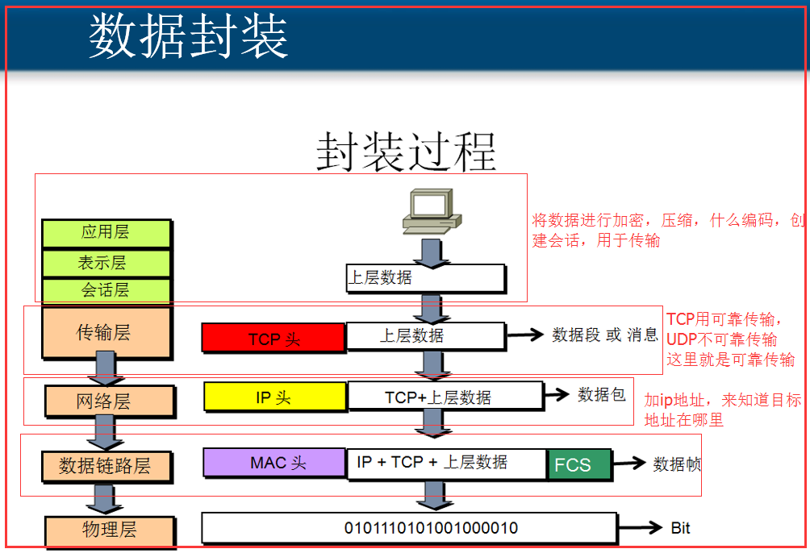

3）数据封装后的样子

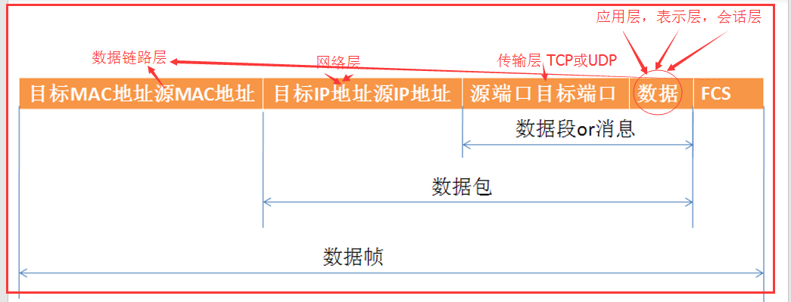

4）接受数据，解封装

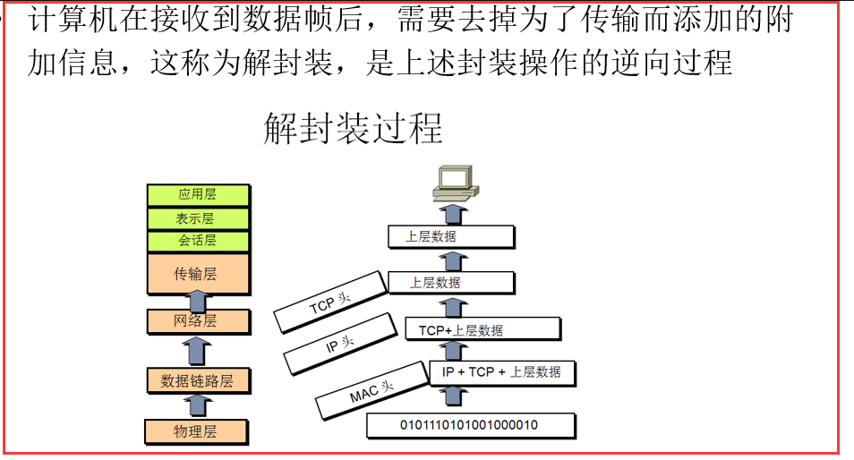

## 六、计算机上的各种性能指标解释

速率、带宽、吞吐量、时延、时延带宽积、往返时间、利用率

### 6.1、速率

在计算机与计算机之间通信时传输数据位数的速率 单位 bit/s 1 bit 也就是 1 位

byte 与 bit 的区别和换算

byte：字节 　　　 bit：位

1byte = 8bit

按字节换算

1 k = 1024byte 　　 M 与 byte 之间的换算是 1024

1M = 1024K

按位换算

1kb = 1000bit

1Mb = 1000Kb

1Gb = 1000Mb

问题一：我们人们常说的我的网络是 8M 为什么下载速度只有 1M/S 呢？

这里的 8M，单位是 Mb，也就是按位来算的， 而下载速度是按字节算的 8M = 8000Kb = 8000，000bit = 1000，000 byte ≈1000kb ≈1M

所以一般都市直接除以 8，8M 的网络下载速度就是 1M/s 100M 的网下载速度也就 10M/s

### 6.2、带宽

接口支持最高的传输速率， 也就是我们的带宽是 8M， 带宽是 100M. 就是最高支持一次传输 8M，自己换算一下，能传多个位。

### 6.3、吞吐量

单位时间内通过某个网络的数据量

简单的说，就是通过一根网线一次性传输的多少个位，最高位就是带宽，但不是每次传输都达到了带宽值，有可能通过的只有 3M，5M，都不一定，通过的量就是我们说的吞吐量

### 6.4、时延

发送时延、传播时延、处理时延、排队时延

发送时延 = 数据块长度(bit)/信道宽度(bit/s)

过一个特定情景来讲解

A----------------路由器---------------------B

A 发送 0101010101(10bit)数据到 B 带宽是 10bit/s 　 　 A 距离 B 100 米 信号在信道上的传播速率 10 米/s

当从开始发送 1 到最后一个 0 从 A 的网卡中出来结束，发送时延 = 10bit/10bit/s = 1s

传播时延 = 信道长度（米）/信号在信道上传播速率(米/秒)

传播时延：从 A 发送 1 开始，到路由器，接受最后一个 0 结束，这一段也算是传播时延，路由器到 B 之间也是 100/10 = 10 秒。 在电线上花费的时间是 10 秒

排队时延：路由器接受数据，有一个缓冲区，相当于队列，数据到路由器，先到缓冲区排队等待路由器一个个接受数据，直到路由器开始接受第一个位，这就是排队时延，从路由器出来也需要排队时延

处理时延：路由器开始接受第一个位，这就开始处理数据了，到最后一个位接受完，这之间就是处理时延

### 6.5、时延带宽积

其实也就是在信道中有多少位数据在其中，用的是带宽，也就是最高的数据。

传播时延 \* 带宽

### 6.6、往返时间

从 A 到 B，在 B 返回数据到 A，之间用了多少时间

使用命令 ping www.baidu.com 从我们浏览器到存放百度地址的主机，然后返回数据到我们计算机需要的时间
