## 一、物理层概述

解决如何在连接各种计算机的传输媒体上传输数据比特流，而不是指具体的传输媒体 （通俗的讲就是传输的数据是通过何种方式，以什么形态传输的，

类似于我们说话，别人是如何听到的，通过的就是声波，计算机传数据，又是怎么样吧数据带过去的呢，）

主要任务：确定与传输媒体的接口的一些特性，即 机械特性、电气特性、功能特性、过程特性

机械特性：接口形状、大小、引线数量等，通俗讲也就是网线的水晶头的设计等一些规定

电气特性：规定电压范围（-5V~+5V）等 在网线中传输时所用的电压范围

过程特性：也称规程特性 规定建立连接时各个相关部件的工作步骤

## 二、数据通信基础知识

### 2.1、数据通信模型

源点、发送器、接受器、终点 和 源系统 -- 传输系统 --- 目的系统 的对应关系

PC 机要发的数据会转换为 010101，数字比特流就代表着 010101 传给调制解调器，调制解调器将数字比特流转换为模拟信号，通过公用电话网传到很远的目的地去。然后逆过来解析成原数据就行了

提到的数字比特流、模拟信号之后会讲解到，这样，我们就大概了解了数据通信的模型了，大概知道数据是转换成哪种形势传到目标中。

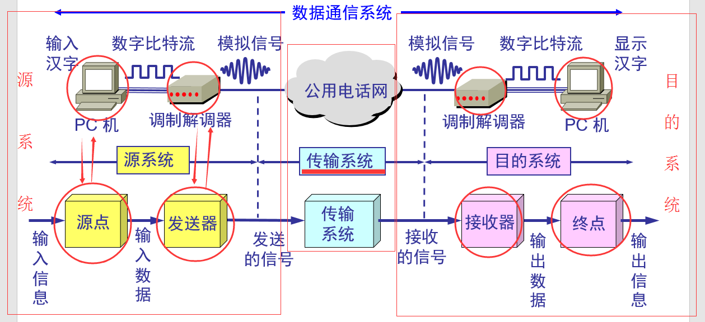

### 2.2、常用术语

1）通信的目的是传送信息

2）数据：运送信息的实体

3）信号：数据的电气或电磁的表现 通俗讲就是通过电气或者电磁的一些表现形式来代表我们的数据，这就是我们说的信号，电气、电磁，比如一些电磁波等

数字信号：代表消息的参数的取值是离散的，下面就是数字信号，通过一高一低，不连续的波。

模拟信号：代表信息的参数的取值是连续的，下面就是模拟信号， 有高有低，但是是连续的波

4）码元：在使用时间域的波形表示数字信号时，则代表不同离散数值的基本波形就成为码元。 太理论的语言，看了跟没看一样，其实码元很简单，看下图，在数字信号中，带着 0 或者 1 的波形就是一个码元

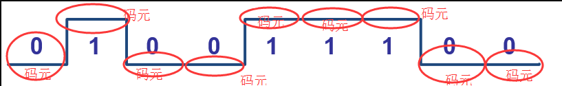

码元长度：每一个码元都是通过一段时间间隔来表示， 这个时间间隔就是码元长度

注意：1 码元可以携带 nbit 的信息量，并不是 1 码元就只能代表 1bit 的信息量，可以是 nbit，也就是说上面 1 码元就代表 0 或 1 这样 1bit 的信息量.

### 3.3、信道与传输方式

信道一般表示向一个方向传送信息的媒体，所以平常说的通信线路往往包含一条发送信息的信道和一条接受信息的信道

1）单工通信：也就是单向通信，只能有一个方向的通信而没有反方向的交互

2）半双工通信：也就是能双向通信，但是不能同时通信，一方在发送数据，另一方必须接受数据，等待对方发完，然后自己才能发，例如，电视里面军方的对讲机，都是只有等待一方说完话，另外一方才能说话。

3）全双工通信：相对于半双工通信来讲，就是能同时通信且双向，例如，电话。

### 3.4、基带信号与带通信号　

1）基带信号：即基本频带信号，来自信源的信号，像计算机输出的代表各种文字或图像文件的数据信号都属于基带信号，基带信号就是发出的直接表达了要传输的信息的信号，

例如：我们说话的声波就是基带信号

2）带通信号：把基带信号经过载波调制后，把信号的频率范围移到较高的频段以便在信道中传输

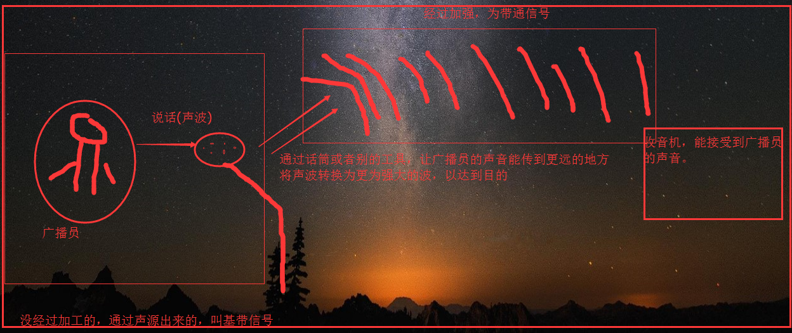

### 3.5、编码与调制

1）编码：人们将数字数据转换为数字信号的过程称为编码

2）调制：将数字数据转换为模拟信号的过程称为调制

[回到顶部(go to top)](https://www.cnblogs.com/zhangyinhua/p/7607633.html#_labelTop)

## 四、物理层下的传输媒体

通俗的讲：前面我们知道了数据是以什么形态传输的，但是我们不知道该种形态就在什么上面传输呢？分两种：导向传输媒体 和 非导向传输媒体

### 4.1、导向传输媒体

1）双绞线

屏蔽双绞线 STP

无屏蔽双绞线 UTP

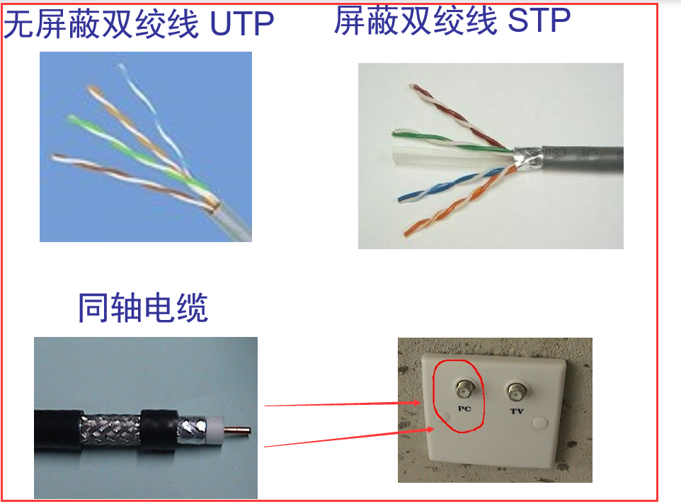

2）同轴电缆

50Ω 同轴电缆，用于数字传输，由于多用于基带传输，也叫基带同轴电缆

75Ω 同轴电缆，用于模拟传输，即宽带同轴电缆

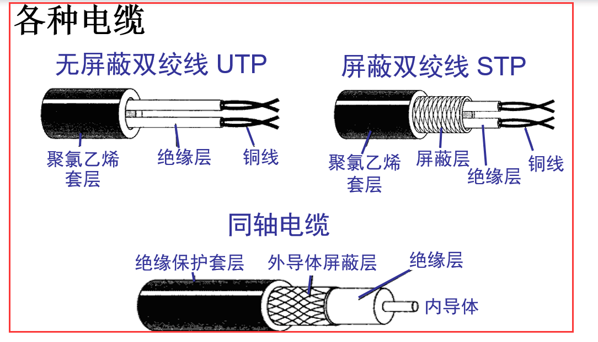

这两种普通的网线（直通线 和 交叉线）

直通线：具体的线序制作方法是：双绞线夹线顺序是两边一致，统一都是：1：白橙、2：橙、3：白绿、4：蓝、5：白蓝、6：绿、7：白棕、8：棕。

注意两端都是同样的线序且一一对应。这就是 100M 网线的做线标准，即 568B 标准，也就是我们平常所说的正线或标准线、直通线

直通线应用最广泛，这种类型的以太网电缆用来实现下列连接:

主机到交换机或集线器

路由器到交换机或集线器

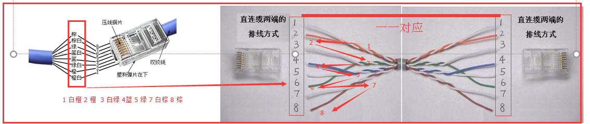

交叉线：就相当于直通线是一一对应，而交叉线就不一样，1 对 3 2 对 4 等

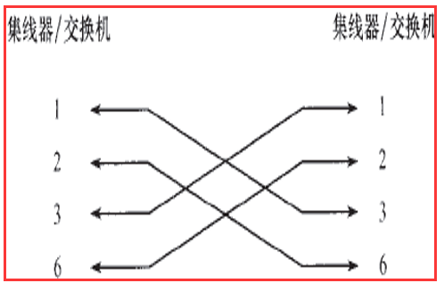

3）光缆

光纤长什么样子

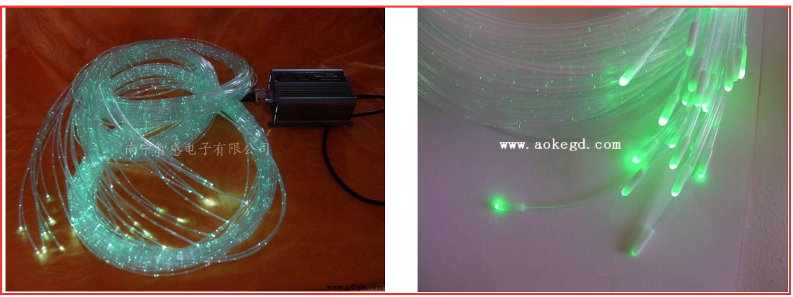

工作原理：就是通过光的折射，在里面传播，直到光出来。

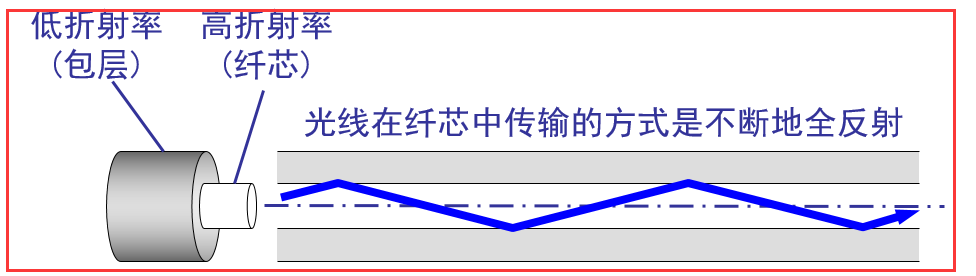

具体光在其中是怎么传播的，看下图就知道了。

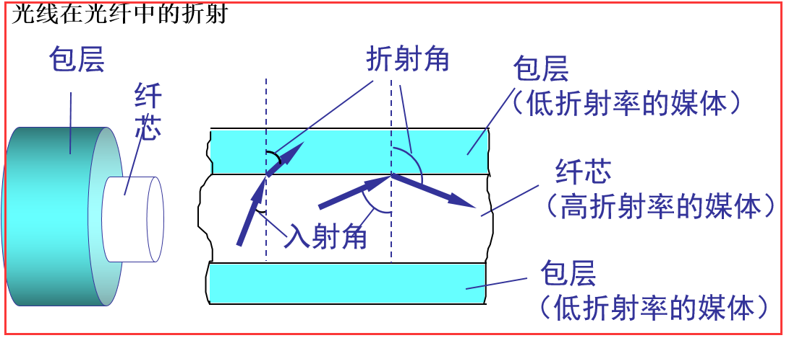

光纤分多模光纤和单模光纤

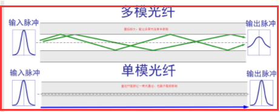

区别：单模光纤指只能传输一种电磁波模式，多模光纤只可以传输多个电磁波模式，实际上单模光纤和多模光纤之分，也就是纤芯的直径之分。单模光纤细，多模光纤粗。

在有线电视网络中使用的光纤全是单模光纤，其传播特性好，带宽可达 10GHZ，可以在一根光纤中传输 60 套 PAL—D 电视节目

### 4.2、非导向传输媒体

非导向传输媒体就是指自由空间，其中的电磁波传输被称为无线传输。 通俗来讲，就是通过无线，不用那种固态的媒体，在空气中自由传播，在空气中传播的波很多，如何分别呢，就是通过每个波的频率不一样

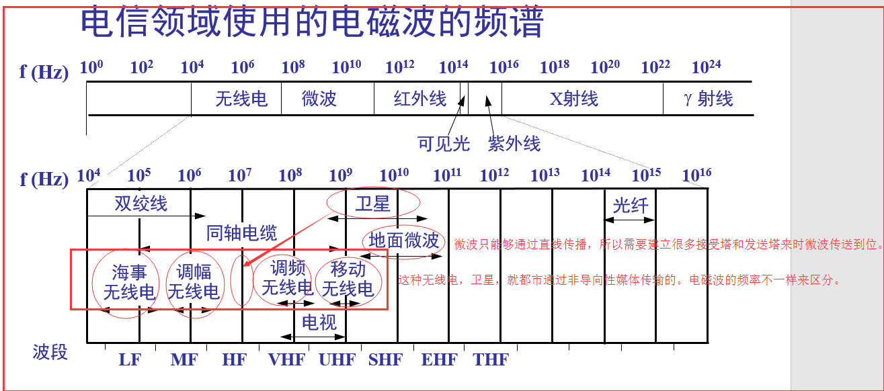

## 五、信道复用技术

复用：通过下图，就可以很容易知道什么是复用，就是同时公用一条信道来进行传输信息。信道复用技术：频分复用、时分复用、统计时分复用、波分复用

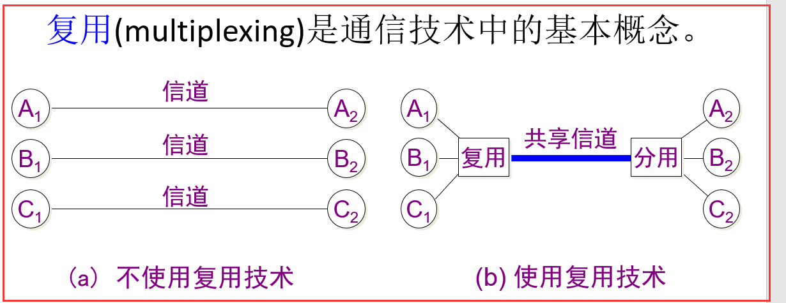

### 5.1、频分复用　

用户在分配到一定的频带后，在通信过程中自始至终都占用这个频带(这个是一个范围，例如下图)

所有用户在同样的时间占用不同的带宽资源（请注意，这里的“带宽”是频率带宽而不是数据的发送速率）

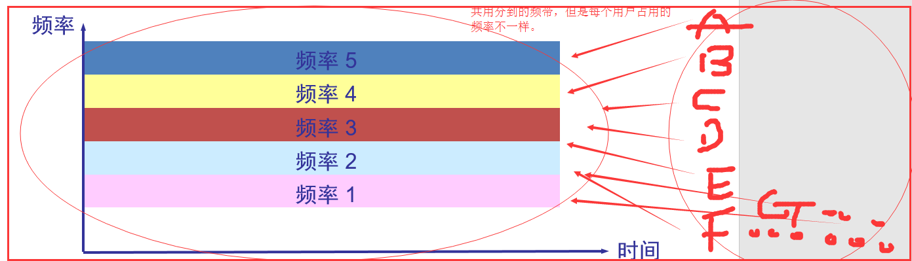

分析：

发送数据：

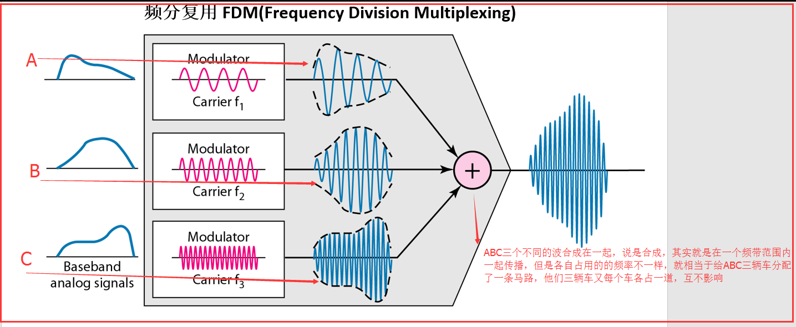

接受数据：

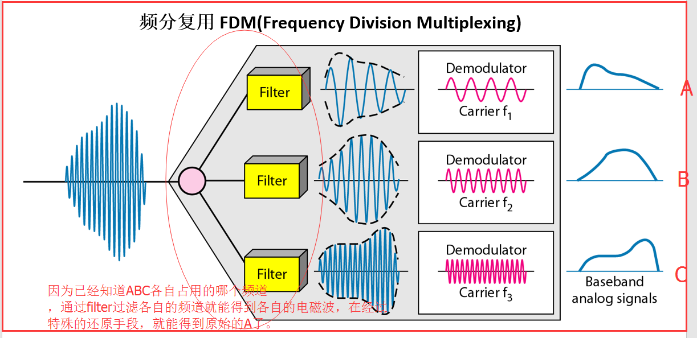

### 5.2、时分复用

按时间轮流分配带宽资源给不同的用户，每个用户只在分配的时间里使用线路传输数据。

通俗来讲：就是每个用户都有自己的时间段来传输数据，没到自己时间就需要等待，直到属于自己的传输时间段的到来，周期性的周转

特点：在信道中，每个资源都有先后顺序，并且不会乱，一直是按照一定的顺序传输数据。

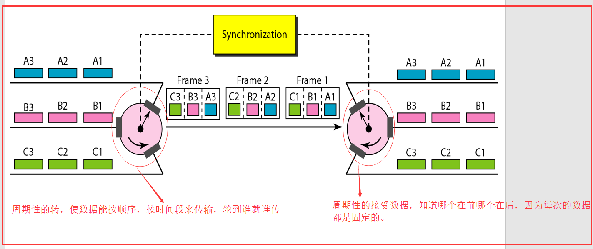

缺点：计算机数据的突发性质，用户对分配的子信道的利用率不高，因为不知道什么时候通道就会发送数据，可能别的通道都不发数据，就一个通道需要发送，但也还是要等待一定的时间，即使信道是空的。

### 5.3、统计时分复用

是对时分复用的一种改进，它能完善时分复用 对信道的利用率不高这个缺点，

原理：就是在每个要发送的数据上面做一个特殊的标记，而不是通过一个多路复用器，周期性的发送数据， 给每个要发送的数据

放入 STDM 帧中，让 STDM 帧带着数据发送过去，而接受的话，只需要分析 STDM 帧就行了。

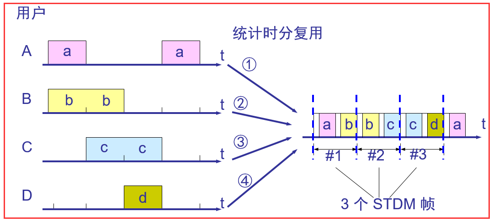

注意：时分复用 又称同步时分复用，统计十分复用 称为 异布时分复用。 因为某一个用户所占用的时间间隙并不是周期性的出现。

### 5.4、波分复用

波分复用就是光的频分复用

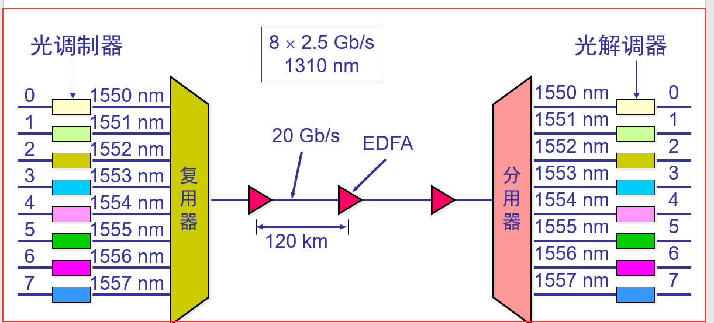

## 六、数字传输系统

PCM(脉冲编码调制)技术：将模拟电话信号转换为数字信号的一种技术。

有两种 PCM 技术：北美的 24 路 PCM(T1) 1.544M/s、 欧洲的 30 路 PCM(E1) 我国采用的是 E1 2.048M/S

## 七、宽带接入技术

### 7.1、电话网线拨号接入

老式的拨号联网方式，因为速度最高只能达到 56kb/s

工作原理：通过将计算机发出的信号转换为音频信号，因为要通过电话网线来传播数据，所以这样转换来转换去，达到的上网速率太低，虽然方便，但实用性不强， 不能同时上网和打电话。

### 7.2、数字用户线接入

DSL：数字用户线 　 xDSL：用数字技术对现有的模拟电话用户线进行改造，在 DSL 上加了 x 表示不同的数字用户线技术。

这个其实就是改善了电话网拨号接入的缺点，能同时上网和打电话，并且网速提高了很多，

工作原理：xDSL 技术就把 0~4 kHz 低端频谱留给传统电话使用，而把原来没有被利用的高端频谱留给用户上网使用。这样一来，就互不干扰了。通过频率的高低来区分是电话还是网络数据。

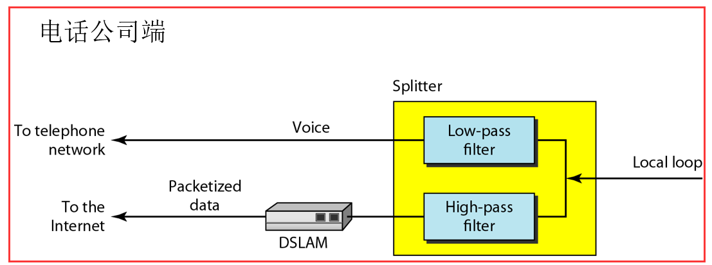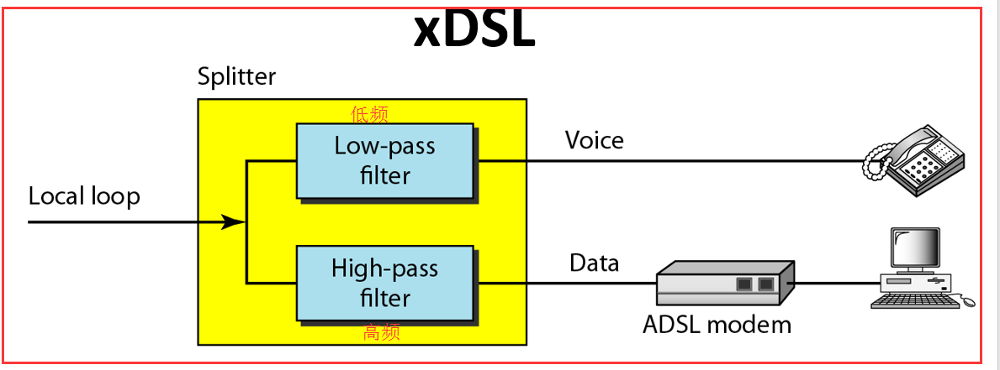

举例：ADSL 的接入网

上行和下行带宽做成不对称的。指的是上行信道和下行信道，具体看 DMT 调制技术中的解释。

ADSL 在用户线的两端各安装一个 ADSL 调制解调器。目的就是为了区分低频和高频

我国目前采用的方案是离散多音调 DMT (Discrete Multi-Tone)调制技术

DMT 调制技术采用频分复用的方法，把 40 kHz 以上一直到 1.1 MHz 的高端频谱划分为许多的子信道，其中 25 个子信道用于上行信道，而 249 个子信道用于下行信道。

每个子信道占据 4 kHz 带宽,并使用不同的载波（即不同的音调）进行数字调制。这种做法相当于在一对用户线上使用许多小的调制解调器并行地传送数据。

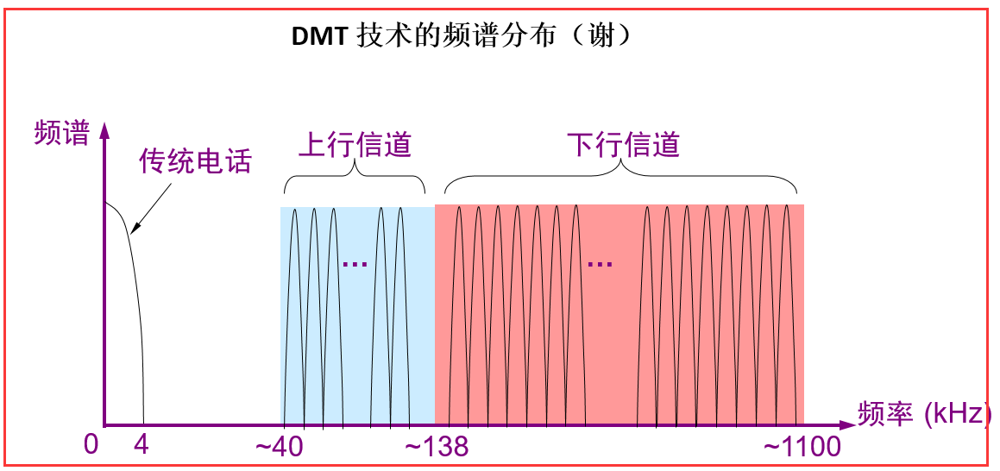

接入网的工作原理图

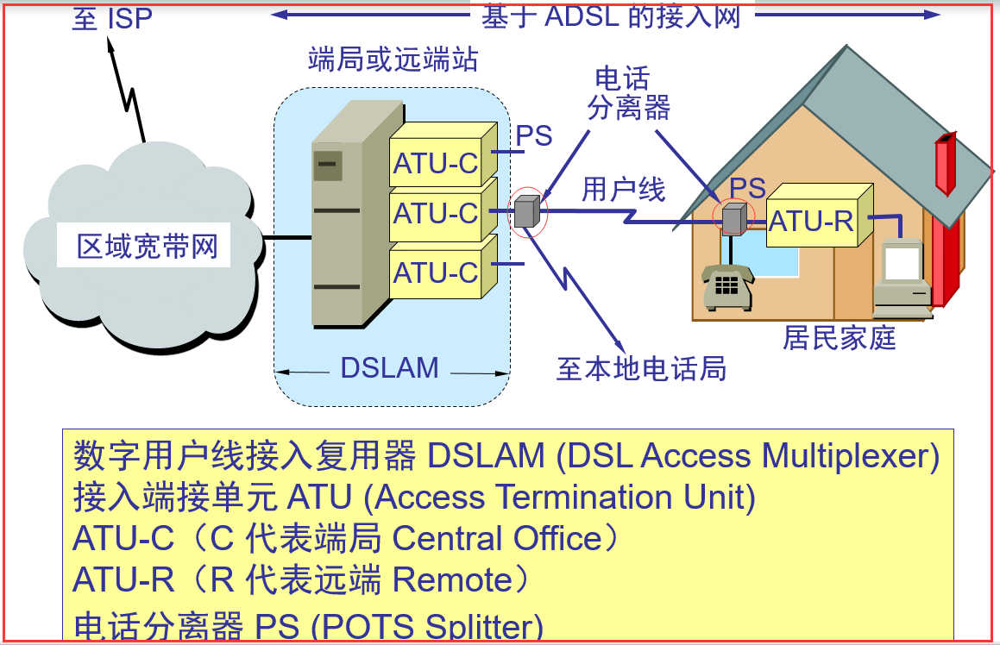

### 7.3、光纤同轴混合网接入　　 HFC

CATV：树形拓扑结构的同轴电缆网络，采用模拟技术的频分复用对电视节目的单向传输，

HFC 对 CATV 的基础上进行改造，从而开发出的一种居民宽带接入网。

特点：

HFC 网的主干线路采用光纤，将原 CATV 网中的同轴电缆主干部分该换位光纤，并且使用的是模拟光纤技术，

每个家庭都要安装一个用户接口盒

HFC 网具有比 CATV 网更宽的频谱，且具有双向传输功能

光纤结点(光分配结点)，同轴电缆分别是那些，看下图

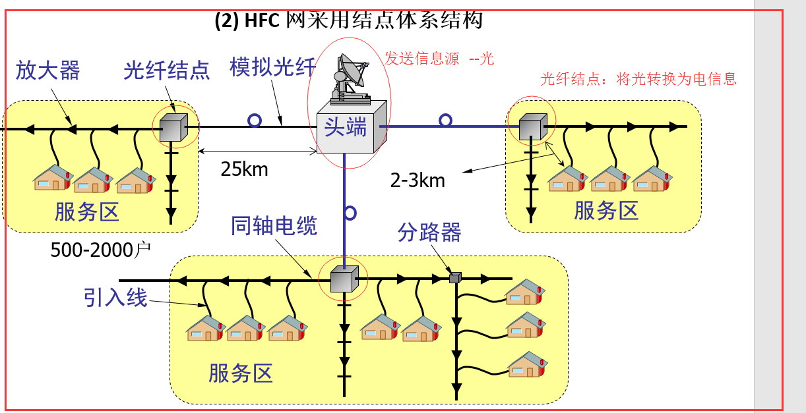

### 7.4、光纤接入

FTTx（光纤到...）：实现宽带居民接入网的方案，这里字母 x 可代表不同的意思

FTTH：光纤到家，光纤一直铺设到用户家庭可能是居民接入网最后的解决方法(155Mb/s)

FTTB：光纤到大楼，光纤进入大楼后就转换为电信号，然后用电缆或双绞线分配到各用户。

FTTC：从路边到各用户可使用星形结构双绞线作为传输媒体(155Mb/s)

### 7.5、以太网接入

局域网，大学校园、大型企业、各种政府通过内部的局域网，然后再让局域网接入到因特网。

### 7.6、无线网接入　

前面都是有线接入，现在很多都使用无线联网，手机、笔记本等都用无线连，很方便

从 1G 到 2G 到 3G 到现在的 4G 时代，每一代的特点不一样，马上就要出 5G 了。

1G：蜂窝移动通信只能够模拟话音通信，跟那个电话网拨号接入类似，网速很慢很慢

2G：以数字话音通信为主，也能提供短信，收发邮件，浏览网页的数据通信功能

3G：3G 时代，记得以前用的网页版 QQ，就是要一直刷新也能接受信息，哈哈，

4G：网速很快，能达到 1M~2M 之间的速度。
