## 一、数据链路层概述

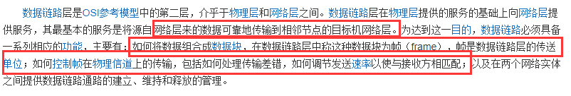

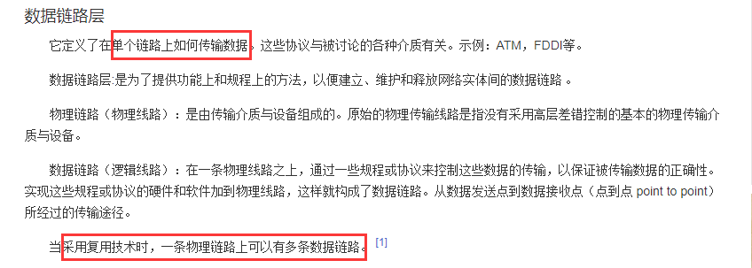

这是百度的简介

看图：理解一下，数据链路层之间的运输、数据链路层之间的信道

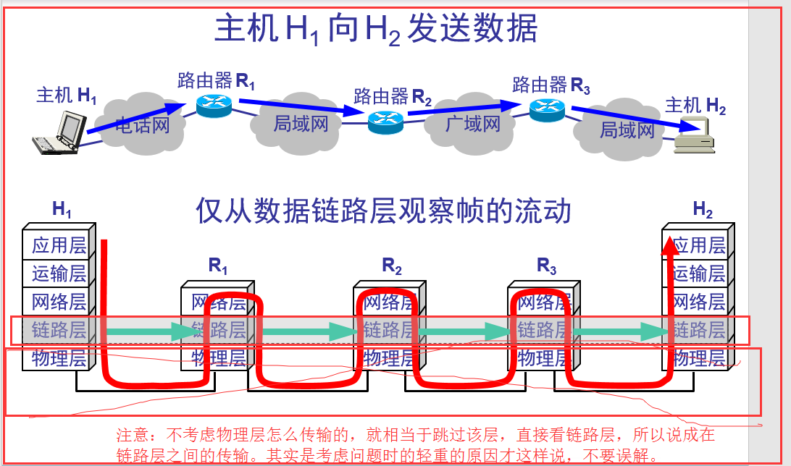

链路：一条点到点的物理线路段，中间没有任何其他的交换结点，通俗的将，就是一根线，其中不经过任何东西，这样的就是链路，一条链路只是一条通路的一个组成部分

数据链路：除了物理线路外，还必须有通信协议来控制这些数据的传输。若把实现这些协议的硬件和软件加到链路上，就构成了数据链路。 通俗讲，就是经过了一些交换机呀，什么的。

最终到达目的地，所有路段就是数据链路，而数据链路中就包含了多段链路。

适配器：也就是网卡，就是用来实现数据链路上一些协议。

帧：数据链路层上传送的就是帧

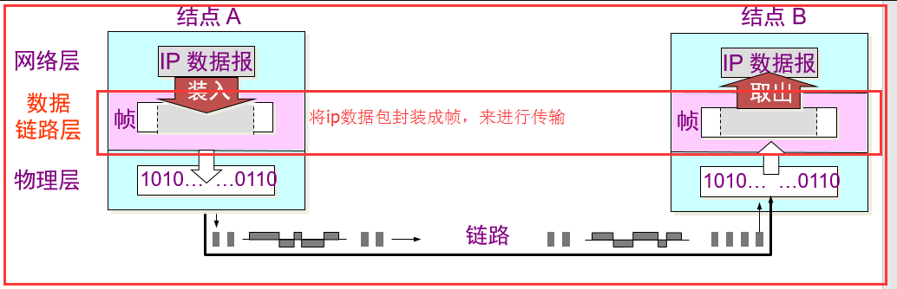

## 二、数据链路层的三个问题

封装成帧、透明传输、差错控制

讲解如何封装帧，封装完后帧的传输问题、传输到达目的地，如何检验该段帧是否完整

### 2.1、封装成帧

数据链路层就是在 ip 数据报的前面和末尾加了一个首部和尾部来代表 ip 数据包的开始和结束，首部和尾部都是由 8 位二进制数表示的，可以一样也可以不一样。

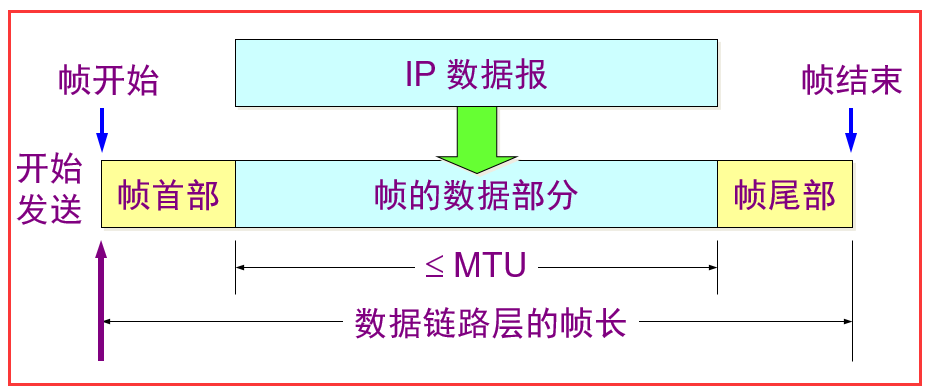

### 2.2、透明传输

有一个这样的问题， 在 ip 数据包中如果有一个跟帧尾部一样的 8 位二进制数，则会提前结束接受数据包，这样数据就被破坏了。出现了如下图这样的问题：

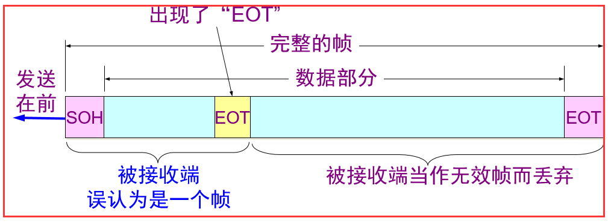

解决：通过在特殊字符前面增加一个转义字符 ESC， 就可以解决上面所遇到的问题，在接收端，将数据包中所有 ESC 的字符删除，

遇到两个 ESC 的，就删除第一个，这样一开始传输的时候有 ESC 转义字符，接受完就没了，所以说的是透明传输

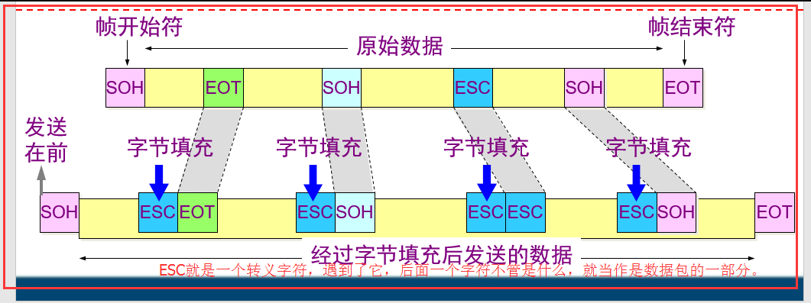

### 2.3、差错检测

问题：传输过程中可能会产生比特差错：1 可能会变成 0 而 0 也可能变成 1。在一段时间内，传输错误的比特占所传输比特总数的比率称为误码率 BER (Bit Error Rate)。

为了检测传送的帧中 ip 数据包是否完整，是否没有被损坏，所以需要差错检测

解决：循环冗余检测 CRC，截个图，把概念性的文字截下来，看到这个人都晕了，其实很简单。

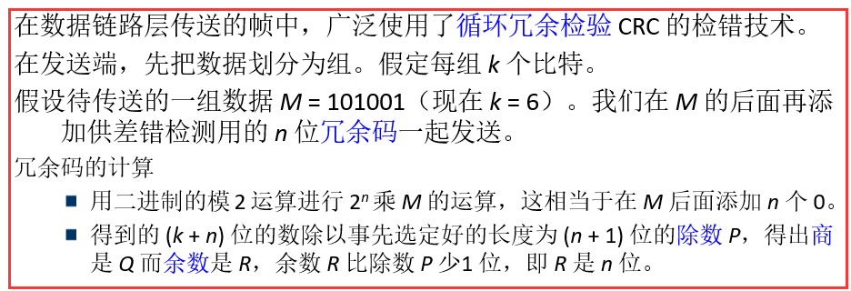

按照下图中的 7 步走，理解一下，然后再看上面的文字，就理解了

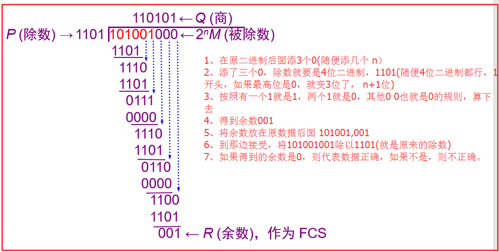

检测：

若得出的余数 R = 0，则判定这个帧没有差错，就接受(accept)。

若余数 R ≠ 0，则判定这个帧有差错，就丢弃

生成多项式：也很简单，例如上面的除数 1101 就用 P(X)=X3+X2+1 　(X3 是 x 的三次方的意思) 最高位是 2 的三次方，就是 x 的三次方这样算，例如，101101 P(X)=X5+X3+X2+1

## 三、可靠传输

在有些情况下，我们需要数据链路层向上的网络层提供“可靠传输”的服务，就是发送端发送什么，在对应的接收端就收到什么， 前面的 CRC 只能检测出位数的差错，不能正确的检测出更精准的错误。

### 3.1、停止等待协议

停止等待就是每发送完一个分组就停止发送，等待对方的确认。在收到确认后再发送下一个分组。

超时重传：解决上面如果数据分组或确认分组丢失时，发送方将会一直等待接收方的确认分组的问题，设置一个超时计时器，

若到了超时计时器所设置的重传时间，而发送方仍收不到接收方的任何确认分组，则会重传原来的分组。

重复分组：如果只使用超时重传来解决，不用发送确认分组，那么会出现重复分组的问题，就是当接收方收到分组后，发回确认分组时，确认分组丢失，

那么会触发超时重传，则接收方会收到两个重复的分组，这里需要注意的是，是确认分组丢失。第一次发送的分组已经正确接收了。

### 3.2、停止等待算法

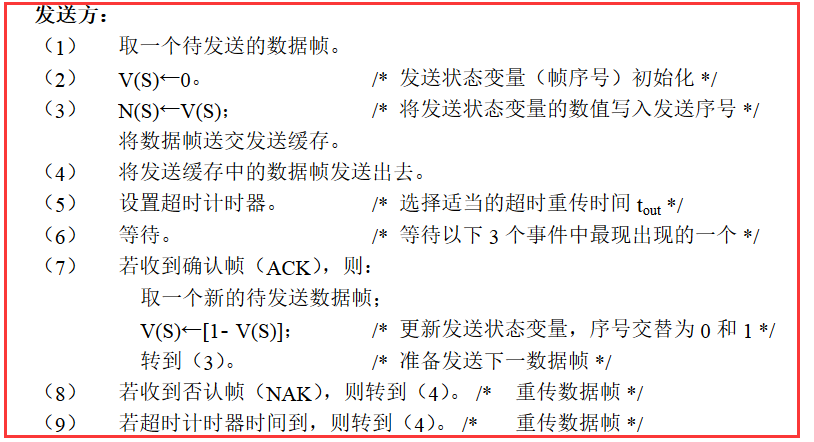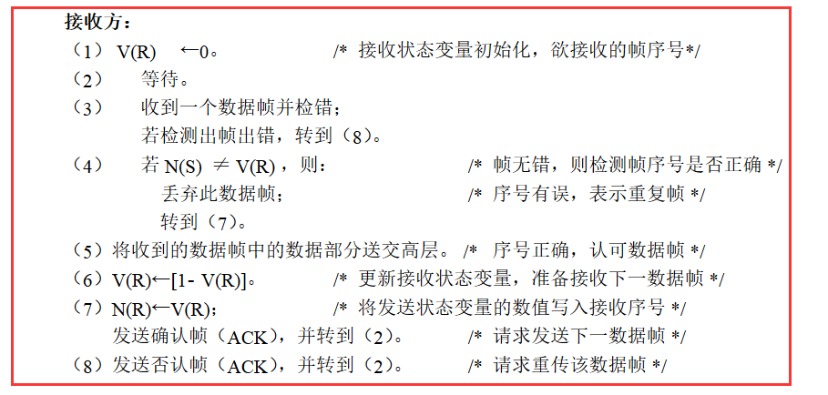

画图分析一下：

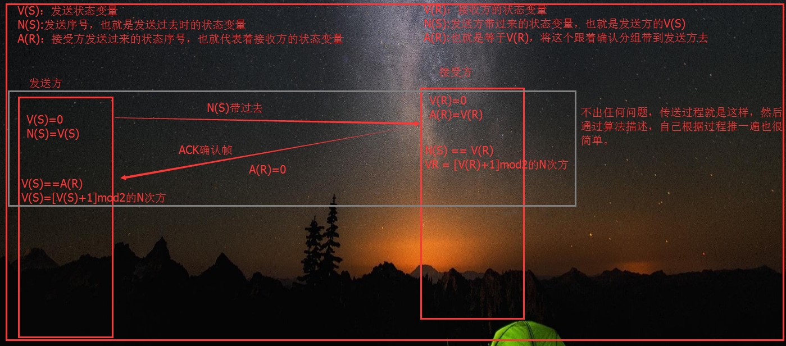

### 3.3、退回 N 步协议

其实跟停止等待协议差不多，只是使用的是流水线传输方式，发送方不间断的发送分组，每次发送的分组大小有限制，如果不限制，可能会使接收方或网络来不及处理这些分组，

导致分组的丢失，所以每次发送的分组大小可能是 5，6 或者更多。这种限制就是回退 N 步协议。

回退 N 步协议：利用发送窗口来限制发送方连续发送分组的个数。要是发送窗口为 1 就是我们上面所讨论的停止等待协议。

退回等待是怎么工作：

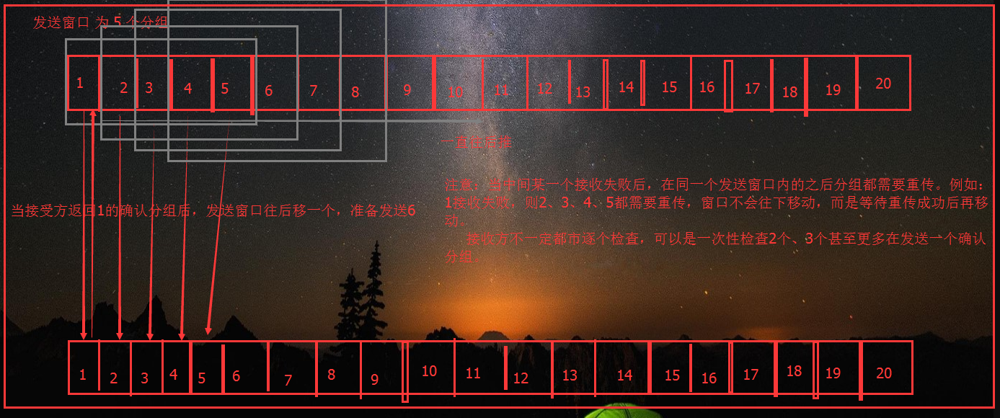

这个就是回退 N 步协议，根据这个原理图，也能看出，为什么叫回退 N 步协议了，在哪里出错了，就必须回退到哪里全部重传，为了解决这个，又有了选择重传协议

### 3.4、选择重传协议

改进回退 N 布协议， 方式都是一样， 在接受方必须逐一确认， 但是出现错误，只需要重传出现错误的那一个分组，不用全部重传，这里的全部，指的是在出现错误的分组之后的所有分组，前提是在同一个发送窗口中。

总结：不可靠的链路上，通过各种协议，就能达到可靠传输，来保证数据的准确性

## 四、两种信道下的数据链路层

点对点信道的数据链路层、 广播信道的数据链路层

### 4.1、点对点协议

概述：现在全世界使用的最多的数据链路层协议就是点对点协议 PPP(Point to Point Protocol)，我们大多数用户使用的拨号电话线接入因特网时，一般使用的就是 PPP 协议

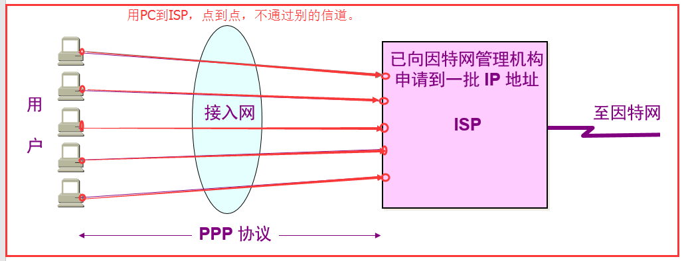

1）PPP 协议的特点

·　　　　简单：接收方每接收一个帧，就进行 CRC 检验，检验正确，就收下，否则就丢弃，它是不可靠传输，所以这就是简单的原因

封装成帧：前一章已经讲过

多种网络层协议：数据链路层的上一层就是网络层，所以它同时支持多种网络层协议的运行

多种类型链路：比如，串行的、并行的，（串行：一个比特一个比特发送，只需要一条线路，并行：一次性传输 n 个比特，所以需要 n 条线路，所以叫并行）同步的、异步的（同步：以稳定的比特流

的形式传输 异步：以字节为独立的传输单位，字节跟字节之间的时间间隔不确定，但字节中的每个比特仍是同步的。），低速或高速、电或光，等不同类型的链路都能支持

差错检测：就是用 CRC 来检验

透明传输

检测连接状态：检测点跟点之间的连接状态，也就是在 PC 机和 ISP 之间的线路。

最大传送单位：PPP 协议帧有最大的传送单元，发送的分组不能超过这个最大长度

网络层地址协商：使通信的两个网络层实体能够通过协商知道或能够配置彼此的网络层地址，通俗的讲，就是在分配 IP 地址时，就现需要这个协商才能解决

2）PPP 协议的组成

2.1）数据链路层可以用于异步串行或同步串行介质，通俗讲也就是可以适应多种性质的链路，有这种介质存在

2.2）使用 LCP(链路控制协议)建立并维护数据链路连接， 也就是上面讲的一些维护链路连接、检测连接状态等功能，就是用它来实现的

2.3）网络控制协议(NCP)允许点到点连接上使用多种网络层协议，也就是因为跟网络层连接在一起，所以需要支持上一层的多种协议，这样才能完成一系列的功能，比如，网络层地址协商。

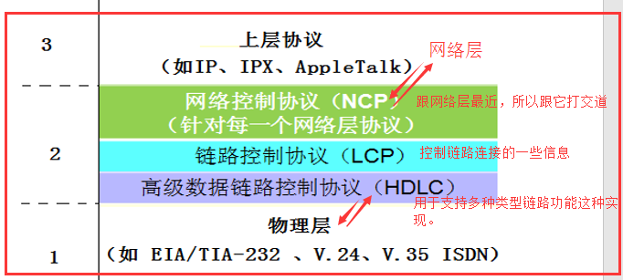

3）PPP 协议帧格式

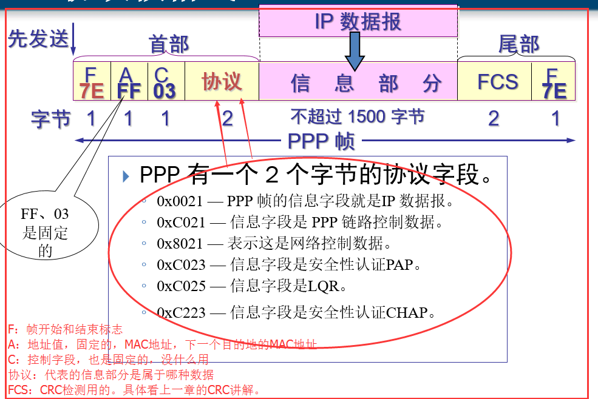

4）PPP 协议帧传输时透明输出问题

4.1）字节填充：

使用的是字节传输，也就是异步，所有的 PPP 帧的长度都是整数字节，所以会出现 IP 数据包中有字节跟开始结束标志字节相同的问题

解决： 标志字段 F = 0x7E

IP 数据包中出现 0x7E 字节 ： 转变为 0x7D、0x5E

IP 数据包中出现 0x7D：0x7D、0x5D

IP 数据包中出现 ASCII 码的控制字符，则在该控制字符前面加 0x7D

4.2）零比特填充方法

使用的是比特流传输(一连串的比特连续传送)，也就是同步，PPP 协议就采用零比特填充方法来实现透明传输。

5）PPP 协议的工作流程

链路静止、链路建立、鉴别、网络层协议、链路打开、链路终止 大概流程图就是下面这个图这样：

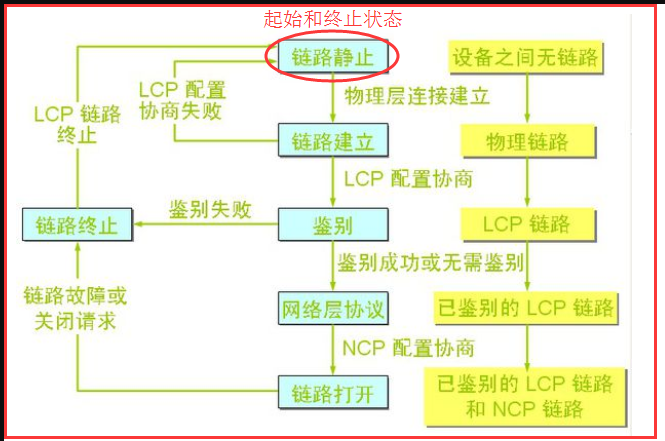

六步的具体实现细节（验证了 PPP 协议的三个组成部分）：

1）链路静止到链路建立：用户拨号接通 ISP 拨号服务器后，就创建了 PC 机到 ISP 服务器的物理连接，这里面的细节就归咎于物理层的功劳了，

创建了一条怎么样的信道，通过什么传送数据，都是物理层需要做的事情。

2）链路建立到鉴别：建立了物理连接后，PPP 中 LCP(链路控制协议)就需要做事了，LCP 协商一些配置选项(链路上的最大帧长，所使用的鉴别协议，或者不使用 PPP 帧中的地址和控制字段)，

如何跟 ISP 协商这些呢，就是通过发送 LCP 的配置请求帧，而 ISP 也可以发送几种响应，配置确认帧：所有选项都接受 配置否认帧：所有选项都理解但不能接受 配置拒绝帧：有的选项无法

识别或不能接受，需要协商。 通过一系列的协商后，此过程就结束了，就到了鉴别状态，如果协商失败，就直接回到链路静止状态。

3）鉴别到网络层协议：这里到达网络层协议之间做的事情就是鉴别身份，这里感觉还没学习到，大概就是鉴别一些用户的身份信息，比如交钱了没有等等吧，猜的。这一阶段可以去查查，估计之后

会遇得到。给出参考答案：只允许传送 LCP 协议的分组、鉴别协议的分组以及检测链路质量的分组。若使用口令鉴别协议 PAP(Password Authentication Protocol)，则需要发起通信的一方发送身份标识符和口令。

系统可运行用户重试若干次。如果需要有更好的安全性，则可使用更加复杂的口令握手鉴别协议 CHAP(Challenge-Handshake Authentication Protocol)。若鉴别身份失败，则转到链路终止状态(Link Dead)。

若鉴别成功，则进入网络层协议状态(Network-Layer Protocol)。

4）网络层协议到链路打开：前面已经经过了 PPP 协议的前两层，接下来就是 NCP(网络控制协议)做事的时候了，这一阶段就是给 PC 机分配一个 IP 地址和对链路层进行网络层协议的设置，让链路层能支持网络层的工作

5）链路打开到链路终止：进行传输数据，如果传输完成，就发送终止请求分组，收到终止确认分组后，就到了终止状态，

6）链路终止到链路静止：当物理层没有载波时，就到静止状态

### 4.2、广播信道的数据链路层

讲解广播信道的知识，就必须要提到以太网，但是现在大多数人已经把以太网就当成局域网了，现在来说清楚以太网和局域网的区别

1）以太网和局域网的区别

以太网是通信协议标准，该标准定义了在局域网（LAN）中采用的电缆类型和信号处理方法，比如有 CSMA/CD 协议，这个协议后面会讲到。

局域网：在较小范围内组建的网络，通过交换器什么的连接各个 PC 机，比如一个实验室，一栋楼，一个校园内，这都市局域网，拿网线将两台计算机连在一起，这也能算是局域网，

所以：以太网是一种局域网，而局域网却不一定是以太网，大多数局域网就是采用了以太网的这个标准，所以很多人就将局域网默认为以太网，这种说法是有点偏差的。

在局域网中，就采用的是广播信道

广播信道：就是一台 PC 机发送数据给另一台 PC 机，在同一个局域网中的计算机都能接收到该数据，这就像广播一样，所以这种就叫做广播信道。
