## 一、局域网

### 1.1、局域网和以太网的区别和联系

局域网：前面已经介绍了，其实就是学校里面、各个大的公司里，自己组件的一个小型网络，这种就属于局域网。

以太网：以太网(Ethernet)指的是由 Xerox 公司创建并由 Xerox、Intel 和 DEC 公司联合开发的基带局域网规范，是当今现有局域网采用的最通用的通信协议标准。

以太网络使用 CSMA/CD（载波监听多路访问及冲突检测）技术，并以 10M/S 的速率运行在多种类型的电缆上。

联系：是以太网就一定是局域网，但是局域网不一定就是以太网。 因为以太网就是一个规范，而大多数局域网都使用这个规范，所以才有这个话。

### 1.2、以太网常用的拓扑结构

1）星状

这种结构的网络是各[工作站](https://baike.baidu.com/item/工作站)以星形方式连接起来的，网中的每一个节点设备都以中防节为中心，通过连接线与中心 节点相连，如果一个工作站需要传输数据，它首先必须通过中心节点。

由于在这种结构的网络系统中，中心节点是控制中心，任意两个节点间的[通信](https://baike.baidu.com/item/通信)最多只需两步，所以，能够传输速度快，并且网络构形简单、建网容易、便于控制和管理。但这种网络系统，

网络可靠性低，[网络共享](https://baike.baidu.com/item/网络共享)能力差，并且一旦中心节点出现故障则导致全网瘫痪。

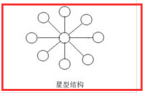

2）树形

树形结构网络是天然的分级结构，又被称为分级的集中式网络。其特点
　　　　是网络成本低，结构比较简单。在网络中，任意两个节点之间不产生[回路](https://baike.baidu.com/item/回路)，每个链路都支持双向传输，并且，网络中节点扩充方便、灵活，寻查链路路径比较简单。

但在这种结构网络系统中，除叶节点及其相连的链路外，任何一个工作站或链路产生故障会影响整个网络系统的正常运行。

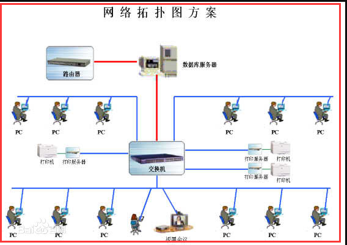

3）总线型

总线形结构网络是将各个节点设备和一根总线相连。网络中所有的节点工作站都是通过总线进行[信息](https://baike.baidu.com/item/信息)传输的。

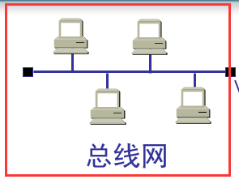

4）环形

环形结构是网络中各节点通过一条首尾相连的[通信链路](https://baike.baidu.com/item/通信链路)连接起来的一个闭合环形结构网。环形结构网络的结构也比较简单，系统中各工作站地位相等。

系统中通信[设备](https://baike.baidu.com/item/设备)和线路比较节省。在网中信息设有固定方向单向流动，两个工作站节点之间仅有一条通路，系统中无信道选择问题；某个结点的故障将导致物理瘫痪。

环网中，由于环路是封闭的，所以不便于扩充，系统响应延时长，且信息传输效率相对较低。

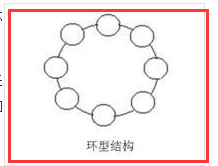

[回到顶部(go to top)](https://www.cnblogs.com/zhangyinhua/p/7608818.html#_labelTop)

## 二、CSMA/CD 协议（半双工通信）

局域网是用广播信道的方式去传送数据，那么就会遇到问题，如果在局域网内有两个 pc 机同时在其中传播数据呢？就会发生碰撞，使两个数据都失效，那么如何解决这个问题呢，使用 CSMA/CD 协议来解决这类问题。

### 2.1、概述

1）多址接入

一种多址接入协议，许多站点以多址接入的方式链接在一根总线上，其实就是局域网中总线网这种形式。

2）载波监听

发送前监听，就是在发送数据前监听总线中是否有数据在传播，如果有就不发送。就是用电子技术检测总线上有没有其他计算机发送的数据信号。

3）碰撞检测

边发送边监听，在发送数据的中途也会监听总线中是否会有其它数据，当几个站同时在总线上发送数据时，总线上的信号电压摆动值将会增大（互相叠加）。

当一个站检测到的信号电压摆动值超过一定的门限值时，就认为总线上至少有两个站同时在发送数据，表明产生了碰撞。 所谓“碰撞”就是发生了冲突。因此“碰撞检测”也称为“冲突检测”

检测到碰撞之后：

在发生碰撞时，总线上传输的信号产生了严重的失真，无法从中恢复出有用的信息来。

每一个正在发送数据的站，一旦发现总线上出现了碰撞，就要立即停止发送，免得继续浪费网络资源，然后等待一段随机时间后再次发送。

通过例子也说明一下 CSMA/CD 协议会做哪些事情，借用下面这个图来说明问题

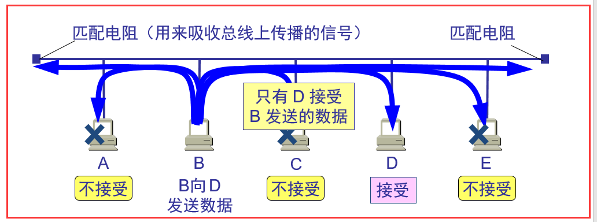

分析：

第一步：B 向 D 发送数据，在发送数据前，由于采用的 CSMA/CD 协议，那么先会进行载波监听，看总线中是否有其他的数据传输(如果检测，通过物理层的一些电磁波等)。

第二步：如果没有，那么 B 就可以开始发送数据，由于 B 到 D 之间存在一定距离，那么在总线中传输数据也要时间，虽然很快，可能只需要十几微秒，在发送的的途中，遇到 C 向 A 发送数据，

由于 B 到 D 的数据还没传过来，那么 C 也就没监听到总线中有数据，所以也开始发，那么在途中两个数据就会相遇，这就形成了碰撞，在碰撞以后，两个电磁波叠加，在总线中传输，

那么会到 C 或者 B 时，就会知道电磁波的不同，从而发生了碰撞。这就是碰撞检测。

### 2.2、详细描述

1）解释名词

传播延时：

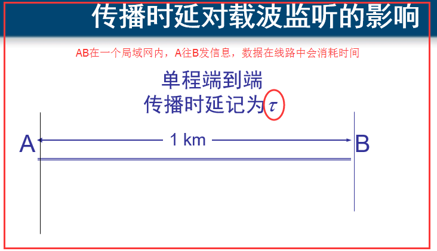

争用期：发生碰撞所需要的最迟时间。在根据上面的大体分析，我们知道 A 到 B 之间的任意时刻都可能会发生碰撞，那么 A 确认发生碰撞要多久呢，那就是 2t 了，传播时延是 t，

可能正好到 B 那里就发生了碰撞，然后返回到 A，又需要 t 的时间，那就是 2t 了，我们把这个 2t 时间就叫做争用期。

举例：在 10Mb/s(传播速率)的以太网，争用期为 51.2μs（微秒），那么在争用期内可发送 64 字节，及 512bit 的数据。怎么算来的呢？

10Mb/s = 10 000 Kb/s = 10 000 000 b/s (这里的换算是 1000，指的是计算机网络中传输的多少位多少位，也就是 0101 这样的位数)

51.2μs = 0.0512 ms = 0.000 0512 s (1s = 1000ms = 1000 000 μs)

51.2μs 能传多少 bit 呢？ 上面两个相乘就为 512bit 了，换算为字节，字节的换算是 1byte(字节) = 8bit(位) 所以 512/8=64byte(字节) 就这样算过来的。

最短有效帧：64 字节，就是上面这样算的，发送了 64 个字节之后，肯定就不会发生碰撞，以太网规定了最短有效帧长为 64 字节，凡长度小于 64 字节的帧都是由于冲突而异常中止的无效帧。

2）二进制指数类型退避算法

这个算法就是在发生碰撞后，pc 机该如何处理，在什么时间后再次发送数据。

其实就是四部曲：

第一步：确定基本退避时间，一般就是争用期 2t

第二步：定义参数 k K = Min[重传次数，10]

第三步：从整数集合中[0,1,...,(2 的 k 次方 -1)]随机取一个数，记为 r，重传所需要等待的时延就是 r 倍的基本退避时间(2rt)

第四步：当重传 16 次还不能成功则丢弃该帧，并向高层汇报

解释：其实这四步很简单，我来分析一下就会了，首先第一次传数据，重传次数为 0，那么 k=0，从整数集合中只有 0 这个值，那么 r=0，等待的时延就是 2rt=0，所以第一次传数据需要等待的时延就是 0，

不需要等待，除非先检测到了有数据已经在传了，如果第一传数据发现碰撞，那么重传次数为 1，那么 k=1，整数集合中就有 0，1 两个值，随机取值，取到 r=1，那么等待的时延就是 2t，意思就是

在第一次发生碰撞后，需要等待 2t 的时间，才能在重新发送数据，也可能不需要等就直接发，r=0 时。

[回到顶部(go to top)](https://www.cnblogs.com/zhangyinhua/p/7608818.html#_labelTop)

## 二、以太网信道利用率问题

分析图：

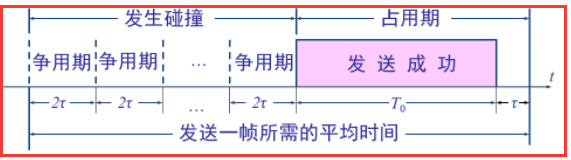

分析：一个帧从开始发送，经可能发生的碰撞后，将再重传数次，到发送成功(发送成功这段时间 T0 是指数据的发送时延，帧长为 L (bit)，数据发送速率为 C (b/s)，因而帧的发送时间为 L/C = T0 (s))，

帧发出去以后，还要经过端到端的传播时延 t，所有在真正占用信道的时间是 TO+t ，前面发生的碰撞损耗的时间，数据并没有占用信道，我们指真正占用信道的时间是指数据发送成功即不发生

碰撞然后到达目的地的这段时间，而前面发生碰撞的时间，都市在浪费信道，每发送一帧需要的平均时间就是在信道中发生碰撞浪费的时间+上数据传输成功所用的占用期。不要理解错了。

公式和参数 a 的理解：　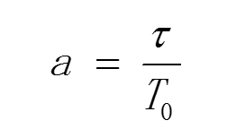 首先理解一下信道利用率，借用上面的图，就是占用期在其图中的比例变大，则信道利用率就高。但是不确定前面发生了多少次碰撞，

只是一个平均的估算值，所以就定义了这个 a 的公式，用 t/T0 来代表信道利用率

1）a→0 表示一发生碰撞就立即可以检测出来，并立即停止发送，因而信道利用率很高。

a→0 也就是 t 越小，而 T0 越大，发送时延尽可能大一点，而 t 传播时延尽可能小一点，现实意义就是数据在在信道中传播的时间如果很小很小，那么数据一发送，

就能在很少的时间里面检测出碰撞来了，那么在前面那张图中，花费在争用期(发生碰撞)的时间就少了，就能快点成功发送数据占的时间就长了了，那信道的利用率不就很高吗，

2）a 越大，表明争用期所占的比例增大，每发生一次碰撞就浪费许多信道资源，使得信道利用率明显降低

就是 T0 越小，而 r 很大，那发生一次碰撞就浪费了很多信道资源，因为在信道中传输无用的波占的时间太长了。而成功发送的占用期自然就变小了，所以信道利用率就越低了。

根据上面的分析信道利用率，就发现，影响信道利用率的就跟 T0 和 t 有关，也就是跟以太网的连线长度有关，所以才有在以太网中，有最远距离的限制，就是不能让 t 太大，

以至于 a 很大，信道利用率太低，还有发送的帧长也有最小帧长的限制，因为怕发送的数据帧太短，而发送速率就一定，那么发送时延 T0 就太小了，会让 a 的值越大，信道利用率就太低了。

### 2.1、最大信道利用率

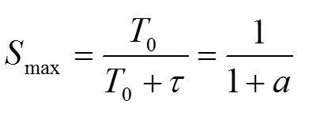

理想的情况下就是不发生碰撞，一发送完数据，另一个数据就又发送，也就是一有空闲时间，就发送数据。这个时候，信道中一直有数据在传输，一刻也不停歇，那此时的信道利用率就是 100 了？

错误，这个想法是错的，举个例子就知道了。每帧用的时间就是下面图中这块，这块也就可以看成一段数据帧平均花费的时间，这里面所影响的因素就是发送时延 T0 和 t 传播时延了，一段数据帧平均花费的时间为 1s，

这是已经固定了，但是其中的两个部分并没有确定，如果 T0 占的比例大，说明发送时延大，发送速率已经确定了，那么就肯定是发送的数据变多了，在信道中传输的 bit 更过，信道利用率不就更到了吗，通俗一点讲，

就是给了你 1s 的时间，你尽可能的多发些 bit 过去，那么你的传播时延就大了，那不就信道利用率的很高了吗，理想状态下考虑的因素跟那个现实考虑的因素不一样。

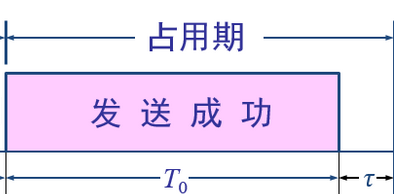

对 CSMA/CD 协议的讨论，大概就是这些内容了，刚才讨论的前提是已经知道谁发送给谁了，然后说的数据在传播过程中遇到的问题。

## 三、PC 机与 PC 机怎么找到对方

用的就是 MAC 地址，在以太网中是如果封装数据帧来达到能够准确传输数据到目的地的呢？

MAC 地址的格式：

48bit，6 个字节，前 3 个字节是由管理机构给各个厂家分配的。也就是说如果有厂家想生产网卡这类需要 mac 地址的东西，必须先像管理机构申请前三位字节，

所以网卡上的前三个字节就代表着某个厂家，后三个字节就是由厂家自己来设定的。

每个网卡都拥有识别数据帧中 mac 地址的功能

数据帧格式：

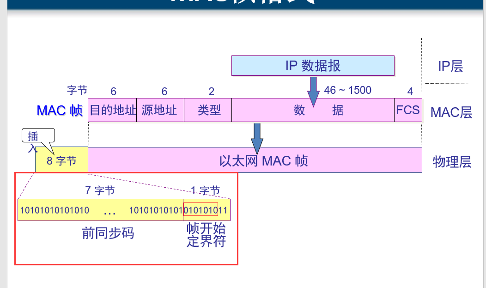

先不管前 8 个插入字节的意思，在以太网中，发送的数据帧最小要是 64 个字节，那这 64 个字节由哪些组成的呢，就是图中所示，6 个目的 MAC 地址，6 个源 MAC 地址，2 个字节代表数据包的类型，

还有 4 个字节是 FCS，用来进行 CRC 算法检测的，剩下的 46 个字节就是数据包最少要发送的字节数了，如果数据包实际发的少于 46，那么会给这个数据包自动补充 0，来达到需要的字节数。

然后说说插入的 8 个字节是什么意思？前 7 个字节用来使发送的数据帧的的比特同步，也叫作前同步码，最后一个字节，帧的开始定界符，也就是告诉接收方，从这个字节开始，后面是是 MAC 帧了。

有人这个时候会问，既然有了帧开始定界符，为什么还要同步码？原因是，在接受 MAC 帧后，并不能马上识别出帧开始定界符，没有那么快的反应分辨出来，所以需要在前面加同步码，使接收方有反应的时间，

所以同步码都是 1010101010101 这样的 bit。前 7 个字节的同步码跟最后一个字节中的前 6 个 bit 位相同。上面图中这里画的有点错误，圈错了，正确的是下面这样：

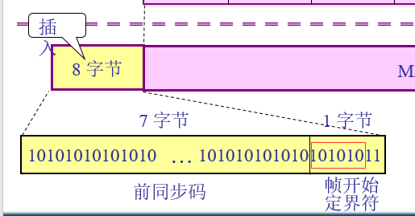

[回到顶部(go to top)](https://www.cnblogs.com/zhangyinhua/p/7608818.html#_labelTop)

# 三、扩展以太网

集线器和网桥(多个接口的交换机)

### 3.1、集线器

1）概述

集线器（HUB）属于数据通信系统中的基础设备，它和双绞线等传输介质一样，是一种不需任何软件支持或只需很少管理软件管理的硬件设备。它被广泛应用到各种场合。**集线器工作在局域网(LAN)环境**，

应用于 OSI 参考模型第一层，因此又被称为物理层设备。集线器内部采用了电器互联，当维护 LAN 的环境是逻辑总线或环型结构时，完全可以用集线器建立一个物理上的星型或树型网络结构。在这方面，集线器

所起的作用相当于多端口的中继器。其实，集线器实际上就是中继器的一种，其区别仅在于集线器能够提供更多的端口服务，所以集线器又叫多口中继器。**HUB 按照对输入信号的处理方式上，可以分为无源 HUB、有源 HUB、智能 HUB。**

2）工作过程

集线器的工作过程是非常简单的，它可以这样的简单描述：首先是节点发信号到线路，集线器接收该信号，因信号在电缆传输中有衰减，**集线器接收信号后将衰减的信号整形放大，最后集线器将放大的信号广播转发给其他所有端口。**

就是只能够转发数据，来了就往接了集线器的 PC 机上发数据，其他什么差错校验呀，什么东西全都不做，

集线器的用法首先是下面这样

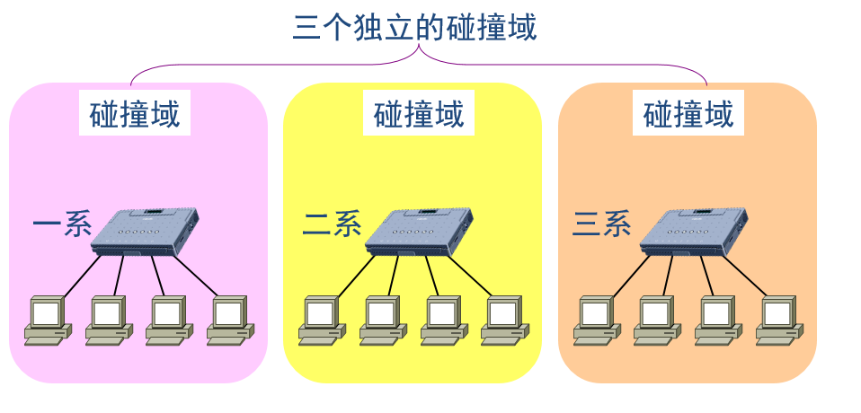

然后想办法，改进成这样了

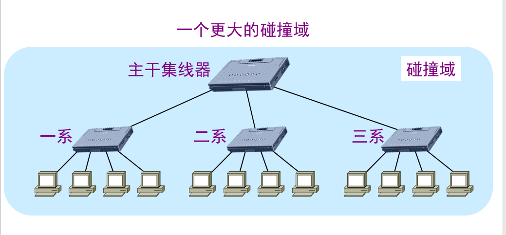

改完是有好处也有坏处

用集线器扩展局域网优点：

使原来属于不同碰撞域的局域网上的计算机能够进行跨碰撞域的通信。

扩大了局域网覆盖的地理范围。

用集线器扩展局域网缺点：

碰撞域增大了，但总的吞吐量并未提高。

如果不同的碰撞域使用不同的数据率，那么就不能用集线器将它们互连起来。

由于集线器总有这样的缺点，所以网桥这个设备就出来了

### 3.2、网桥

1）概述

也有人把“网桥”比喻成一个聪明的中继器（Repeater）。因为中继器只是对所接收的信号进行放大，然后直接发送到另一个端口连接的电缆上，主要用于扩展网络的物理连接范围；

而网桥除了可以扩展网络的物理连接范围外，还可以对 MAC 地址进行分区，隔离不同物理网段之间的碰撞（也就是隔离“冲突域”）。集线器和中继器都是物理层设备，而网桥属于二层设备。
　　　　我们经常听到这样的说法，那就是“网桥”是一种可连接不同网段的二层网络设备（二层交换机也一样），一个端口可以连接一个网段。所以很多人总在纳闷，网桥怎么能连接不同网段呢？

其实这是因为大家对这里所说的“网段”并不理解。其实这里“网段”更准确地讲应该是叫“物理网段”，是指 IP 地址属于同一网络地址段（也就是 IP 地址中的网络 ID 一样），位于不同地理位置的不同 LAN 分段，

是基于物理意义上的地理区域进行划分的。我们常说的网段是指 IP 地址属于不同网络地址段的网络或子网，是一个三层概念，其实这应该叫做逻辑网段，是基于逻辑意义上的网络地址进行划分的。

（hzhsan:就是说这里的网段是物理网段，并不是我们平时说的 IP 网段，不关心三层上的概念）
　　　　无论是网桥，还是二层交换机，虽然每个端口可以连接一个网段，但是它们所连接的主机都在同一网络，或者同一子网中。如连接的主机位于不同办公室或者不同办公楼中，则可采用同一网络地址的两个或多个小 LAN，

以组成一个可以统一管理的大 LAN。但要注意的是，因为网桥只有两个端口，所以所连接的两个物理网段的主机通常就是由当时的集线器进行集中连接的（网桥端口通常不是直接连接主机的）。

软件中通常所说的桥接（如 VMware 中的桥接工作模式）也就是网桥的作用，它连接的也是同一网络或子网中的两个网段。
　　　　网桥都是只有两个端口吗？应该可以有多个端口吧？
　　　　答案：基本网桥只有两个端口，还有一种网桥叫做多口网桥，多口网桥有多个端口

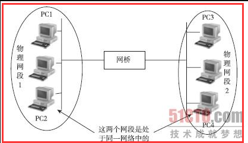图 1

2）优点

有两个优点，能识别 mac 地址，遇到陌生的 mac 地址，会在内部 mac 表中记录下该 mac 地址，下次再使用，就认识了

1.1）根据 MAC 帧的目的地址对收到的帧进行转发

2.2）过滤帧的功能。当网桥收到一个帧时，并不是向所有的接口转发此帧，而是先检查此帧的目的 MAC 地址，然后再确定将该帧转发到哪一个接口

3）网桥原理

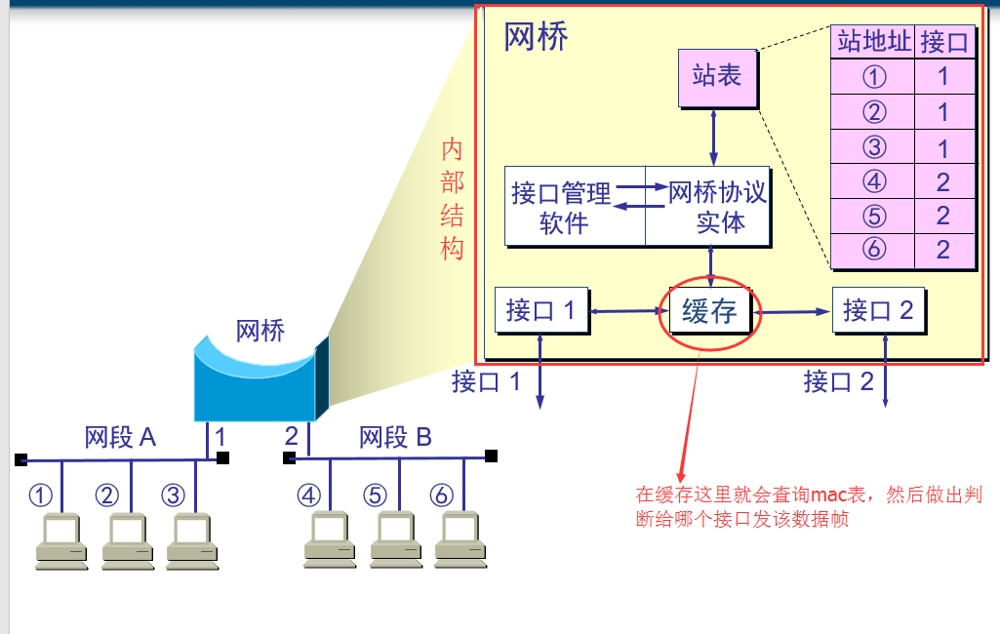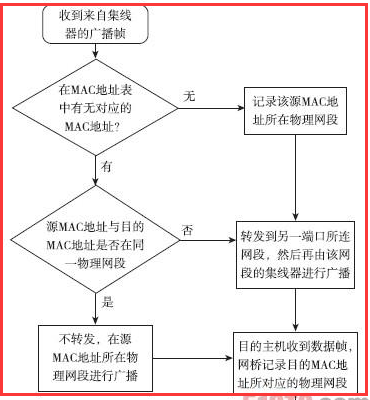图 2

前面说到了网桥具有两种主要特性：一是可基于物理网段的 MAC 地址进行学习，二是可以隔离冲突域。下面通过一个示例来进行解析。
　　假设图 1 中所示的物理网段 1 和物理网段 2 中的主机都是通过集线器集中连接的，则这样这两个物理网段各自形成一个冲突域，因为集线器是采用共享介质传输的，

而网桥的背板信道不是共享的（每个端口的数据收发都有一条单独的信道），所以一个集线器就是一个冲突域。网桥的数据转发原理如图 2 所示。下面是具体的解析。
　　　　说明　 MAC 地址表也就是通常所说的 CAM（Content Addressable Memory，内容可寻址存储器）表，保存的是对应 MAC 地址主机与所连接的交换机端口的映射。这个映射表项可以由管理员手动绑定创建，

也可以由交换机自动学习得到。在交换机上可以通过一些命令（如 Cisco 交换机是使用 show mac-address-table 命令）查看。下面是一个在交换机上查看 MAC 地址和端口映射表的示例，其中列出了交换机中

为 CPU 分配的静态（static）MAC 地址和通过学习功能自动学习得到的动态（dynamic）MAC 地址，其中的 Ports 列显示的是对应 MAC 地址主机所连接的端口，VLAN 列则为对应主机连接端口所属的 VLAN。

 mac-address-table

现假设图 5-34 所示网络中的一台 PC 要向另一台 PC 发送数据。因为集线器也是物理层设备，不能识别帧中的 MAC 地址，所以无论是哪台主机要发送数据，在集线器上都是以广播方式进行的，

连接该集线器上的所有节点都会收到这个广播帧，包括网桥连接到该集线器的端口。

1）当网桥收到集线器的广播帧后，网桥会把帧中的源 MAC 地址和目的 MAC 地址与网桥缓存中保存的 MAC 地址表进行比较。

2）最初，网桥的缓存中是没有任何 MAC 地址的，所以一开始它也不知道哪台主机在哪个物理网段上，收到的所有帧都直接以泛洪方式（也是复制原数据帧）转发到另一个端口上，

同时会把数据帧中的源 MAC 地址所对应的物理网段记录下来（其实就是与对应的网桥端口对应起来）。

3）在数据帧被某个 PC 机接收后，也会把对应目的 MAC 地址所对应的物理网段记录在缓存中的 MAC 表中。这样，经过多次这样的记录，就可以在 MAC 地址表中把整个网络中各

主机 MAC 地址与对应的物理网段全部记录下来。因为网桥的端口通常是连接集线器的，所以一个网桥端口会与多个主机 MAC 地址进行映射。

4）当网桥收到的数据帧中源 MAC 地址和目的 MAC 地址都在网桥 MAC 地址表中可以找到时，网桥会比较这两个 MAC 地址是否属于同一个物理网段。如果是同一物理网段，

则网桥不会把该帧转发到下一个端口，直接丢弃，起到冲突域隔离作用。相反，如果两个 MAC 地址不在同一物理网段，则网桥会把从一个物理网段发来的帧转发到连接

另一个物理网段上，然后再通过所连接的集线器进行复制方式的广播。

3）透明网桥

局域网上的站点并不知道所发送的帧将经过哪几个网桥，因为网桥对各站来说是看不见的

是一种即插即用设备，其标准是 IEEE 802.1D

4）网桥的优点与缺点

优点：

过滤通信量。

扩大了物理范围。

提高了可靠性。

可互连不同物理层、不同 MAC 子层和不同速率（如 10 Mb/s 和 100 Mb/s 以太网）的局域网。

缺点：

存储转发增加了时延。

在 MAC 子层并没有流量控制功能。

具有不同 MAC 子层的网段桥接在一起时时延更大。

网桥只适合于用户数不太多(不超过几百个)和通信量不太大的局域网，否则有时还会因传播过多的广播信息而产生网络拥塞。这就是所谓的广播风暴。

[回到顶部(go to top)](https://www.cnblogs.com/zhangyinhua/p/7608818.html#_labelTop)

## 四、高速以太网

从最早的使用集线器连接的以太网(CSMA/CD，半双工，10Mb/s)到使用网桥阶段的扩展以太网(CSMA/CD，半双工，10Mb/s 或 100Mb/s)到现在的高速以太网(半双工/全双工通信)。

### 4.1、高速以太网

速率达到或超过 100Mb/s 的以太网

这个也没什么好讲的，就是在之前的基础上加强了很多东西，

速率提高了很多

从半双工通信到能使用全双工通信了(这个并不是说就抛弃了半双工，在星形拓扑结构中的局域网，也就使用 CSMA/CD 协议的半双工通信的方式，全双工就不使用该协议了)

传输距离可以增长，因为有了光纤(传输过程的稳定性)，速率增强很大，不止局限于局域网，扩展到了有城域网，广域网。

### 4.2、10Gb/s 以太网

1）概述

与 10 Mb/s，100 Mb/s 和 1 Gb/s 以太网的帧格式完全相同。

保留了 802.3 标准规定的以太网最小和最大帧长，便于升级。也就是最小 64 字节，最大是多少不知道。

不再使用铜线而只使用光纤作为传输媒体。

只工作在全双工方式，因此没有争用问题，也不使用 CSMA/CD 协议。

2）优点

成熟的技术

互操作性很好

在广域网中使用以太网时价格便宜。

统一的帧格式简化了操作和管理
