## 一、网络层概述

### 1.1、网络层简介

百度定义：

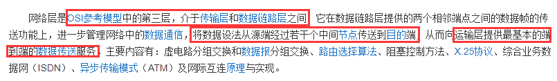

功能目的：

[回到顶部(go to top)](https://www.cnblogs.com/zhangyinhua/p/7609242.html#_labelTop)

## 二、网络层的基础知识

### 2.1、ip 地址

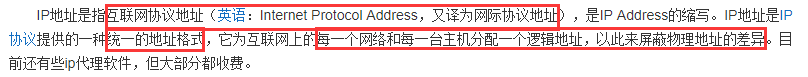

不就是一连串数组加.组成的吗，比如我们常常设置路由器时登录 192.168.1.1。这个就是 ip 地址。那到底是什么样的呢？

ip 地址就是 32 位，也就是 4 个字节组成，因为 32 位太长了，我们不好识别，所以每次将其分为 8 位一组，分成 4 组，然后在根据每组换算成 10 进制数组，组与组之间用.分隔开来。

举个例子：11111111，11111111，11111111，11111111 就可以用 255，255，255，255 来表示了，所以每一组都是从 0 到 255 之间。现在在来看 192.168.1.1 这个 ip 地址，

也能将其换成 2 进制来表示，只不过那样太麻烦，让人不易于看懂，所以就将其用 10 进制来表示。

ip 地址的意义在哪里呢？

要上网就需要一个 ip 地址，这个 ip 地址不能和别人一样，独一无二，因为在网络上通信就是通过 ip 地址来找到你这台主机的，但是这个 ip 地址不是固定的，比如你在家拨号上网，

是 A 这个 ip 地址，下一次拨号，可能就不是 A，变成 B 了，这要看你所在的网络给你分配了什么 ip 地址。如何通过 ip 查找到你，这个问题后面来讨论。

### 2.2、ip 地址的分类

既然每个人的 ip 地址都不一样，那一台主机怎么通过 ip 地址找到另一台主机的呢，茫茫人海，不可能一个个查找把，所以就有专门的人来管理和分配这个 ip 地址，看看以前怎么分的地址(了解)

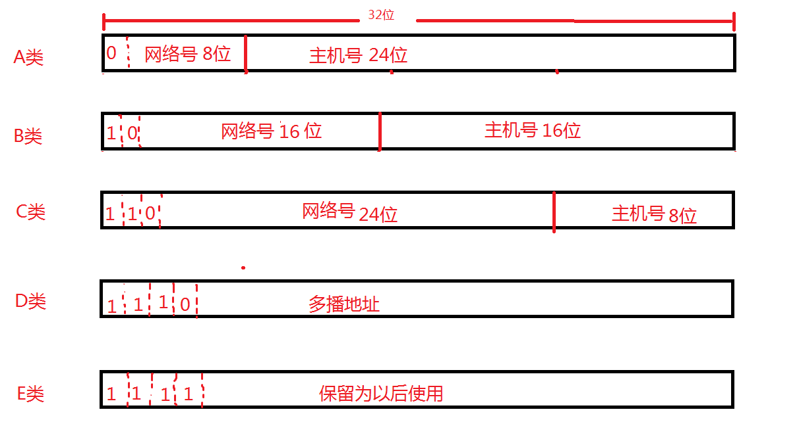

网络号由你所连的网决定，学校的局域网，公司的局域网，城市的广域网等，就是相当于先市、在区、在到村这样的。跟快递一样，你 ip 地址肯定也得这样分，先找到大的，然后慢慢一层层找下去。

A 类地址：网络号有 8 位，第一位固定为 0，127 种，主机号有 24 位，那么就能给该类地址划分 16777215 个 ip 地址，也就 1 千多万个地址，意思就是比如你需要组建一个有 1 千多万台主机的网络，

那么你就要去分配一个 A 类地址，要求给你一个网络号，然后其中 1 千多万的 ip 地址就由你自己分配了，最多也就只能分配 127 个这样的网络

B 类：网络号、主机号 16 位，就能有 65535 个网络号和 65535 个主机号了。

C 类：网络号有 24 位，也就能够分配 1000 多万个网络，但是主机号只有 8 位，也就是只能够自己分配 254 台主机最多

D 类：用于多播，多播后面讲

E 类：留着以后用

这就是我们老早以前所使用的 ip 地址，就是这样分的，这样看起来很合理啊，你看 B 类中，有那么多种，肯定够分了把，但是会暴露出一个问题就是，C 类地址只能分配 254 台主机，

现在中小型网络那么多，都超过了 254 台电脑，如果 A 公司有 1000 台电脑，那他肯定要去分配 B 类地址，就造成了几万个的 ip 地址浪费了。这显然不是很合理。

划分子网 = <网络号>+<子网号>+<主机号>

这是 ip 地址分类的第二大步，中间加了一个子网号，这样就加大了对上面的 A 类和 B 类地址的使用率。也就减少了 A 类和 B 类地址的浪费，但是也有问题就是 C 类地址不管怎么划分，

他所容纳的主机太小了，随着网路的扩增，人人度使用电脑，那么 A 类和 B 类迟早度会用光，所以就用到了我们现在的 IP 地址。

无分类编址 = <网路前缀>+<主机号> 这个就是我们现在用的 ip 地址的算法。

这个一看，跟第一种分类编址一样呀，其实很大的不同就在于分类编址的网络号不能变，是固定长度，而无分类编址通过网络前缀可变化，就能根据你需要多少个主机号来自由给你分配网络前缀了。

网络前缀：也就是用不定长的一连串 1 来表示 ip 地址的网络号。什么意思呢？

网络前缀：255.0.0.0 ip 地址：192.168.1.1 那么该 ip 地址的前 8 位就属于网络号。

网络前缀：255.224.0.0 ip 地址：192.255.1.1 因为 255 是 8 个 1，224 是 111 00000 ，所以前 11 位表示网络号，也就是这个 ip 地址是处于 192.224.0.0 这个网络中，在这个网络中，能包含 21 个 1 转换为 10 进制这么多的主机。

这个网络前缀我们也称子网掩码，所以现在知道 ip 地址和我们的子网掩码什么意思了吗。

例如：已知 ip 地址 141.14.72.24，所在网络的子网掩码是 255.255.192.0，试求其网络地址？

子网掩码：255.255.192.0 11111111，11111111，11000000，00000000

ip 地址：141.14.72.24 10001101，00001110，01001000，00011000

所以根据子网掩码知道 ip 地址的前 18 位为网络号，网络地址就为：10001101.00001110.01

所以根据子网掩码知道 ip 地址的前 18 位为网络号，网络地址就为：10001101.00001110.01000000.00000000 转换为 10 进制就是 141.14.64.0， 能够存纳 14 位 1 也就是 16383 台主机。

(别问我怎么算的，肯定拿二进制转换器啊，不可能自己手算把，哈哈，二进制转 10 进制这么多怎么手算呢，记住特殊的，8 个 1 就是 255)

### 2.3、mac 地址和 ip 地址的区别与联系

1）mac 地址概述

百度中定义：

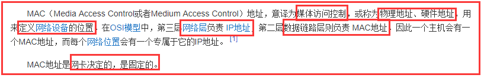

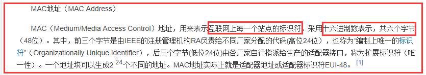

2）mac 地址的作用

谈起 MAC 地址，不得不说一下 IP 地址。IP 地址工作在 OSI 参考模型的第三层网络层。两者之间分工明确，默契合作，完成通信过程。IP 地址专注于网络层，

将数据包从一个网络转发到另外一个网络；而 MAC 地址专注于数据链路层，将一个数据帧从一个节点传送到相同链路的另一个节点。

在一个稳定的网络中，IP 地址和 MAC 地址是成对出现的。如果一台计算机要和网络中另一外计算机通信，那么要配置这两台计算机的 IP 地址，MAC 地址是网卡出厂时设定的，

这样配置的 IP 地址就和 MAC 地址形成了一种对应关系。在数据通信时，IP 地址负责表示计算机的网络层地址，网络层设备（如路由器）根据 IP 地址来进行操作；MAC 地址负责表示计算机的数据链路层地址，

数据链路层设备（如交换机）根据 MAC 地址来进行操作。IP 和 MAC 地址映射关系是由这种 ARP（Address Resolution Protocol，[地址解析协议](https://baike.baidu.com/item/地址解析协议)）协议完成。

IP 地址就如同一个[职位](https://baike.baidu.com/item/职位)，而 MAC 地址则好像是去应聘这个职位的人才，职位既可以让甲坐，也可以让乙坐，同样的道理一个结点的 IP 地址对于[网卡](https://baike.baidu.com/item/网卡)是不做要求，基本上什么样的厂家都可以用，

也就是说 IP 地址与 MAC 地址并不存在着绑定关系。本身有的计算机流动性就比较强，正如同人才可以给不同的单位干活的道理一样的，人才的流动性是比较强的。职位和人才的对应关系就有点像是 IP 地址与 MAC 地址的对应关系。

比如，如果一个网卡坏了，可以被更换，而无须取得一个新的 IP 地址。如果一个 IP[主机](https://baike.baidu.com/item/主机)从一个网络移到另一个网络，可以给它一个新的 IP 地址，而无须换一个新的网卡。当然 MAC 地址除了仅仅只有这个功能还是不够的，

就拿人类社会与网络进行类比，通过类比，我们就可以发现其中的类似之处，更好地理解 MAC 地址的作用。无论是局域网，还是[广域网](https://baike.baidu.com/item/广域网)中的计算机之间的通信，最终都表现为将[数据包](https://baike.baidu.com/item/数据包)从某种形式的链路上的初始[结点](https://baike.baidu.com/item/结点)出发，

从一个结点传递到另一个[结点](https://baike.baidu.com/item/结点)，最终传送到目的[结点](https://baike.baidu.com/item/结点)。[数据包](https://baike.baidu.com/item/数据包)在这些[节点](https://baike.baidu.com/item/节点)之间的移动都是由 ARP 负责将 IP 地址映射到 MAC 地址上来完成的。其实人类社会和[网络](https://baike.baidu.com/item/网络)也是类似的，试想在人际关系网络中，甲要捎个口信给丁，

就会通过乙和丙中转一下，最后由丙 转告给丁。在网络中，这个口信就好比是一个网络中的一个[数据包](https://baike.baidu.com/item/数据包)。[数据包](https://baike.baidu.com/item/数据包)在传送过程中会不断询问相邻[节点](https://baike.baidu.com/item/节点)的 MAC 地址，这个过程就好比是人类社会的口信传送过程。

相信通过这两个例子，我们就可以进一步理解 MAC 地址的作用。

3）mac 地址和 ip 地址的区别

IP 地址和 MAC 地址相同点是它们都唯一，不同的特点主要有：
　　　　一是：对于网络上的某一设备，如一台计算机或一台路由器，其 IP 地址是基于网络拓扑设计出的，同一台设备或计算机上，改动 IP 地址是很容易的（但必须唯一），而 MAC 则是生产厂商烧录好的，

一般不能改动。我们可以根据需要给一台主机指定任意的 IP 地址，如我们可以给局域网上的某台计算机分配 IP 地址为 192.168.0.112 ，也可以将它改成 192.168.0.200。

而任一网络设备（如网卡，路由器）一旦生产出来以后，其 MAC 地址不可由本地连接内的配置进行修改。如果一个计算机的网卡坏了，在更换网卡之后，该计算机的 MAC 地址就变了。
　　　　二是：长度不同。IP 地址为 32 位，MAC 地址为 48 位。
　　　　三是：分配依据不同。IP 地址的分配是基于网络拓扑，MAC 地址的分配是基于制造商。
　　　　四是：寻址协议层不同。IP 地址应用于 OSI 第三层，即网络层，而 MAC 地址应用在 OSI 第二层，即数据链路层。 数据链路层协议可以使数据从一个节点传递到相同链路的另一个节点上（通过 MAC 地址），

而网络层协议使数据可以从一个网络传递到另一个网络上（ARP 根据目的 IP 地址，找到中间节点的 MAC 地址，通过中间节点传送，从而最终到达目的网络）。

4）两者关系

这两者的关系是什么呢？在网络中我们通过主机的 ip 地址，先找到他的网络地址，到达了网络地址后，然后通过该网络中的老大(路由器)来分析一下这个 ip 地址是你网路中的哪个主机，

这时，老大(路由器)就通过该目标 ip 地址改到对应主机的 mac 地址，既然知道了 mac 地址，就能找到该计算机了。就好比什么呢。路由器是每次分配给你的 ip 地址不一样，但是你的 mac 地址肯定不会变，

所以就根据 ip 地址找到你的 mac 地址。但是怎么找到的呢？就要通过网络层中的 ARP(地址解析协议)协议了。

知道了基础的知识后，现在来讲解网络层的几个协议：

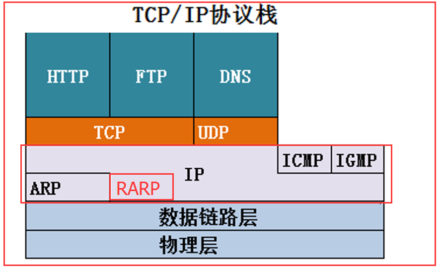

RARP:逆地址解析协议(现在不单独讲这个了，所以我在图中画在红色圆圈内部，因为 RARP 已经被 DHCP 协议给包含了，DHCP 协议在后面会讲解到)，所以我们下面讲的就 4 个协议。

[回到顶部(go to top)](https://www.cnblogs.com/zhangyinhua/p/7609242.html#_labelTop)

## 三、ARP 协议

百度介绍：

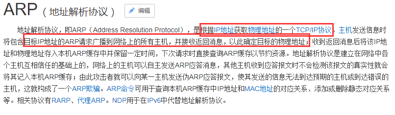

地址解析协议：通过 ip 地址来解析主机的 mac 地址，是怎么个过程呢，拿局域网来说，一个局域网中有很多主机，主机 A 想和局域网中的主机 B 通话，但是只知道对方的 ip 地址，所以他就通过发广播，

给局域网中所有的主机，问这个 ip 地址是谁，主机 B 收到了这个信息，通过网络适配器(网卡)就发现自己是这个 ip 地址，然后就把自己的 mac 地址发给源主机，这样就知道了 mac 地址，就能够通信了。

类似的，在跨网络中就不是直接发广播了，先通过 ip 地址找到对应的网络地址，如何找到的对应的网络地址呢，通过路由器，每个路由器都有三层。网络层、链路层、物理层，也就是说最高能够识别网络层中的东西来，

那么路由器也就有 ARP 协议了，每个路由器都能识别出目标 ip 地址在哪个路由器上，这其中涉及到了很多算法，我们这里不做更多的解释，简单来说，路由器能根据目标 ip 地址找到下一跳路由器的 mac 地址，然后一步一步跳下去，

直到找到目标 ip 地址的网络地址的路由器，然后通过该路由器来找到目标 ip 地址的 mac 地址，这样就能够找到目标主机了。这就是 ARP 协议。

发送方是主机，要把 IP 数据报发送到本网络上的另一个主机。这时用 ARP 找到目的主机的硬件地址。
　　　　　　发送方是主机，要把 IP 数据报发送到另一个网络上的一个主机。这时用 ARP 找到本网络上的一个路由器的硬件地址。剩下的工作由这个路由器来完成。
　　　　　　发送方是路由器，要把 IP 数据报转发到本网络上的一个主机。这时用 ARP 找到目的主机的硬件地址。
　　　　　　发送方是路由器，要把 IP 数据报转发到另一个网络上的一个主机。这时用 ARP 找到本网络上的一个路由器的硬件地址。剩下的工作由这个路由器来完成。

[回到顶部(go to top)](https://www.cnblogs.com/zhangyinhua/p/7609242.html#_labelTop)

## 四、IP 协议

### 4.1、IP 协议概述

百度定义：

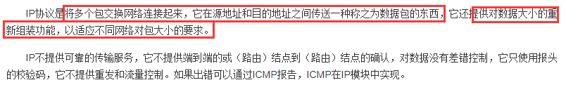

其实 IP 的责任就是把数据从源地址传送到目的地。它不负责保证传送可靠性，流控制，包顺序和其它对于主机到主机协议来说很普通的服务。

### 4.2、通过 IP 数据包格式认识 IP 协议

IP 协议通过看一下 IP 数据包(报)的格式就知道 IP 协议是干嘛的了，就是来规定数据报的格式，以及定义的功能

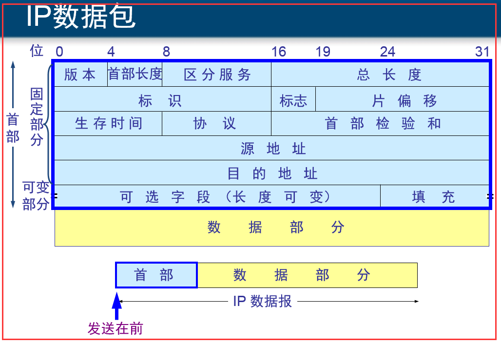

1）固定部分：20 个字节，一行是 4 个字节，有 5 行，自己看清楚

1.1）第一行

版本：占 4 位，IP 协议的版本，通信双方的 IP 协议版本要一致，普遍用 IPv4，以后可能会用 IPv6.

首部长度：占 4 位，可表示的最大十进制为 15，单位是 32 位字(4 个字节)，表示首部最长为 60 个字节，也就是说除去固定部分的 20 个字节，可选字段和填充最多能是 40 个字节。

区分服务：占 8 位，1 个字节。有些要传输的数据要立马传达到对面，比如视频，语音这样的，不能跟邮件慢慢吞吞的达到对方一样，需要立马送达，这就是为什么需要这个区分服务了

总长度：占 16 位，2 个字节。占首部+数据部分 的总长度是多少。数据帧最长不能超过 1500 个字节，数据包就不能一次性发太大，如果发的太大就要选择分片处理了。

1.2）第二行

标识：占 16 位，2 个字节，一个计数器，每产生一个数据包，计数器就加 1，当数据包被分片时，下面将会说到分片问题，所有分片后的数据包的标识度一样。这样相同的标识的数据包片就能够重新组合到一起

标志：占 3 位，第一位暂时没意义，第二位 DF：不能分片的意思，为 1 时，不能分片，为 0 就可以分片 第三位 MF 还有分片的意思，为 0 代表这是若干数据包中的最后一片

片偏移：占 13 位，在较长的分组在分片后，某片在原分组中的相对位置，几个例子，1111，1111，1111，1111 这 16 位，分成 4 个数据包分片来发，第一个数据包分片的片偏移为 1，第二个为 5，第三个为 9，

第四个为 13，就是这个意思，片偏移以 8 个字节为偏移单位，也就是说，每个分片的长度一定是 8 字节的整数倍，上面是以位来举例说明问题，实际上单位是 8 个字节为单位。

1.3）第三行

生存时间：也就是 ping 命令中显示的 TTL 字段，跳数限制，每经过一个路由器，就减 1，当跳到 0 后，就丢弃该数据包。window 系统的起始 TTL 为 32、Linux64、xp：128

协议：占 8 位，数据包中数据部分使用的是什么协议，方便目的主机的 IP 层知道讲数据部分上交给哪个处理。(也就是下一章要将的 TCP 还是 UDP 协议)

首部检验和：占 16 位。这个字段只检验数据报的首部，但不包括数据部分。这是因为数据报每经过一个路由器，路由器都要重新计算一下首部检验和（一些字段，如生存时间、标志、片偏移等都可能发生变化）。

不检验数据部分可减少计算的工作量。

1.4）第四行

源地址：占 32 为，也就是源 IP 地址

1.5）第五行

目标地址：占 32 位，也是 IP 地址

2）可选部分：为了使整个数据包为整数个字节而设置的。

[回到顶部(go to top)](https://www.cnblogs.com/zhangyinhua/p/7609242.html#_labelTop)

## 五、ICMP 协议

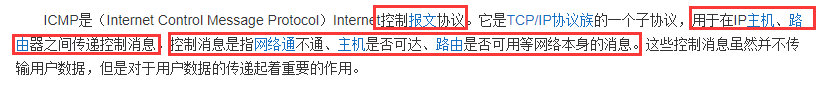

ICMP 协议是一种面向无连接的协议，用于传输出错报告控制信息。它是一个非常重要的协议，它对于[网络安全](https://baike.baidu.com/item/网络安全)具有极其重要的意义。

它是[TCP/IP 协议](https://baike.baidu.com/item/TCP%2FIP协议)族的一个子协议，属于网络层协议，主要用于在主机与路由器之间传递控制信息，包括报告错误、交换受限控制和状态信息等。

当遇到 IP 数据无法访问目标、IP[路由器](https://baike.baidu.com/item/路由器)无法按当前的传输速率转发[数据包](https://baike.baidu.com/item/数据包)等情况时，会自动发送 ICMP 消息。ICMP 报文在 IP 帧结构的首部协议类型字段（Protocol 8bit)的值=1。

这个协议比较简单，它有两部分组成：ICMP 差错报告报文、ICMP 询问报文 。这个挺有用的，比如我们经常用来测试网络连接畅通的 ping 命令等

### 5.1、ICMP 差错报告报文

检测在传送数据的过程中，发生的错误，如果发生了错误，会通过该协议返回给源主机一个带有错误原因的数据包

终点不可达：发送数据后，路由器或主机不能完成交付数据报时，就会往源主机发送终点不可达报文

源点抑制：当路由器或主机由于网络拥塞而丢弃数据报时，返回一个源点抑制报文

超时：

参数问题，在 ip 数据包中的首部有的字段不正确时，丢弃该报，返回参数问题报文

改变路由(重定向)：路由器把改变路由报文发送给主机，让主机下次直接经过改变后的路由器。

### 5.2、ICMP 询问报文

回送请求和回答：主机向特定目标发出询问，收到此报文必须返回一个 ICMP 回送回答报文。用于测试目的站是否可达。

时间戳请求和回答：请某个路由器或主机回答当前的日期和时间，用于进行时钟的同步和测量时间。

[回到顶部(go to top)](https://www.cnblogs.com/zhangyinhua/p/7609242.html#_labelTop)

## 六、IGMP 协议

### 6.1、概述

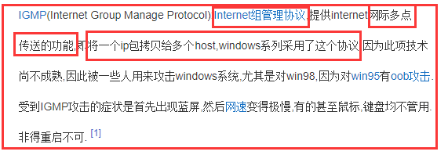

### 6.2、多播　　

IGMP 协议用于多播，解释一下多播是什么把。

广播：老师在台上讲课，你们能随时看到老师的电脑屏幕，因为采用的广播，每个人度能接受到老师屏幕上所有的数据包

多播：在一个局域网中，有三个多播组，A、B、C，A 在放 java 视频，B 在放 C++视频，C 在放娱乐视频，如果你想看 Java 视频，那么你就调到 A 这个多播组中学习 java 视频，学习累了，

你就可以换到 C 这个多播组中看看娱乐节目，这就是多播的意思，相对广播来说，自己需要什么就调什么，而不是跟广播一样，被动接受，他播到哪，就只能看到哪，多播能自由控制速度。

单播：50 个人想看视频，就得发送 50 个数据包。多播的话就发一个，然后通过路由器转发 50 分给不同的人。

单播：　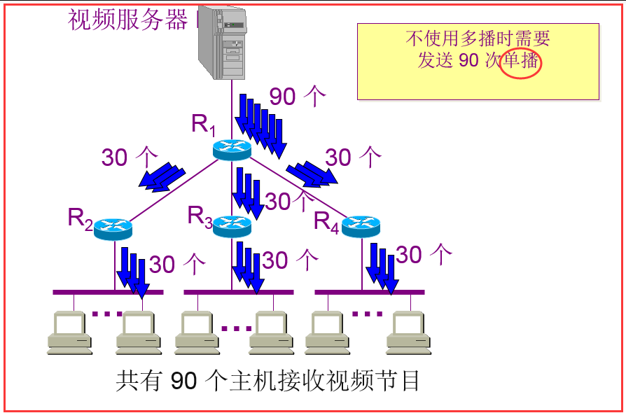 多播： 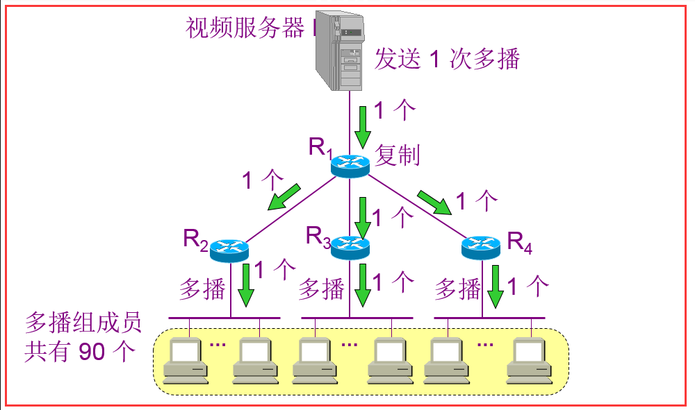

### 6.3、IGMP 协议工作流程

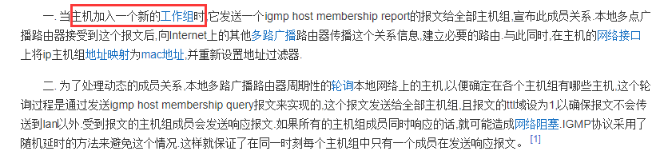

## 七、总结

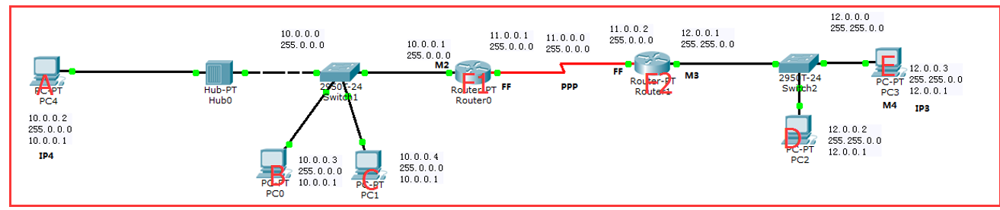

注意：每个路由器度有一个路由表，并且主机也有记录 ip 地址和对应 mac 地址的功能。并不是每次通信度需要发广播询问。

### 7.1、分析从主机 A 找到主机 B 的过程

1）A 先在自己的网络中发送广播，通过 ARP 协议。问所有的主机，谁知道 10.0.0.3 这个 ip 地址的主机是谁，同时把自己的主机 ip 地址和 mac 地址一起发送，

主机 B 发现自己是 10.0.03 这个 ip 地址，就把自己的 mac 地址发回去

2）主机 A 发现有人回应，就知道在自己本网络中，然后就找到了目标主机，开始通讯

### 7.2、分析从主机 A 找到主机 E 的过程

1）主机 A 先发广播看自己本网络没有该主机，没有，然后就给 ip 地址为 10.0.0.1 这个路由器 F1 发信号获得路由器的 mac 地址，然后给他发信号叫该路由器 F1 帮我们查找 ip 地址为 12.0.0.3 的主机。

这个路由器的 ip 地址就网关，所以每台计算机上度要有三个东西，ip 地址，子网掩码，网关。

2）路由器因为知道所有的网络在哪里，通过子网掩码和 ip 地址，就能够算出该 ip 地址在哪一个网段中，路由器就一跳一跳的经过路由器，知道找到对应网段的路由器 F2

3）找到 F2 后，F2 就以同样的方式通过 ip 地址找到对应的 mac 地址，就这样找到了。

省略了路由器如何找的这一步，这个可以自己看书，其中有很多中方式，很多种算法，我们就知道我们给 ip 地址和子网掩码给路由器，路由器就知道下一跳给谁，知道找到对应网段

### 7.3、分析从主机 A 到主机 E 数据的形式

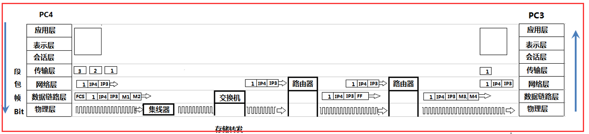

传输层(还没讲)：讲各个数据段划分序号

网络层：加上 ip 地址

数据链路层：加上 mac 地址和 CRC 检测的 FCS

物理层：转化为比特流传输

集线器：只认识物理层，用来转发比特流

交换机：能认识数据链路层，所以交换机有 mac 地址表，能够记录各种 mac 地址，下一次就能选择性的转发数据了

路由器，能认识网络层，有路由表，所以能够通过 ip 地址找到对应网段。
