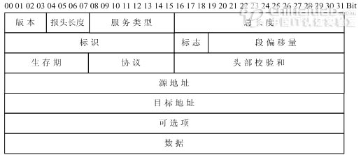
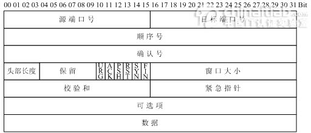
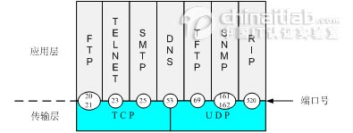

## 一、TCP/IP 参考模型概述

ISO 制定的 OSI 参考模型的过于庞大、复杂招致了许多批评。与此对照，由技术人员自己开发的 TCP/IP 协议栈获得了更为广泛的应用。如下图，是 TCP/IP 参考模型和 OSI 参考模型的对比示意图。

### 1.1、TCP/IP 参考模型的层次结构

TCP/IP 协议栈是美国国防部高级研究计划局计算机网（Advanced Research Projects Agency Network，ARPANET）和其后继因特网使用的参考模型。ARPANET 是由美国国防部（U.S．Department of Defense，DoD）赞助的研究网络。

最初，它只连接了美国境内的四所大学。随后的几年中，它通过租用的电话线连接了数百所大学和政府部门。最终 ARPANET 发展成为全球规模最大的互连网络-因特网。最初的 ARPANET 于 1990 年永久性地关闭。　　
　　 TCP/IP 参考模型分为四个层次：应用层、传输层、网络互连层和主机到网络层。如下图所示。

## 二、TCP/IP 四层功能概述

在 TCP/IP 参考模型中，去掉了 OSI 参考模型中的会话层和表示层（这两层的功能被合并到应用层实现）。同时将 OSI 参考模型中的数据链路层和物理层合并为主机到网络层。下面，分别介绍各层的主要功能。

### 2.1、主机到网络层　　

网络接入层与 OSI 参考模型中的物理层和数据链路层相对应。它负责监视数据在主机和网络之间的交换。事实上，TCP/IP 本身并未定义该层的协议，而由参与互连的各网络使用自己的物理层和数据链路层协议，

然后与 TCP/IP 的网络接入层进行连接。地址解析协议（ARP）工作在此层，即 OSI 参考模型的数据链路层。
　　实际上 TCP/IP 参考模型没有真正描述这一层的实现，只是要求能够提供给其上层-网络互连层一个访问接口，以便在其上传递 IP 分组。由于这一层次未被定义，所以其具体的实现方法将随着网络类型的不同而不同。

### 2.2、网络互连层　　

网络互连层是整个 TCP/IP 协议栈的核心。它的功能是把分组发往目标网络或主机。同时，为了尽快地发送分组，可能需要沿不同的路径同时进行分组传递。因此，分组到达的顺序和发送的顺序可能不同，这就需要上层必须对分组进行排序。　　
　　网络互连层定义了分组格式和协议，即 IP 协议（Internet Protocol）。　　
　　网络互连层除了需要完成路由的功能外，也可以完成将不同类型的网络（异构网）互连的任务。除此之外，网络互连层还需要完成拥塞控制的功能。

### 2.3、传输层　　

在 TCP/IP 模型中，传输层的功能是使源端主机和目标端主机上的对等实体可以进行会话。在传输层定义了两种服务质量不同的协议。即：传输控制协议 TCP（transmission control protocol）和用户数据报协议 UDP（user datagram protocol）。　　
　　 TCP 协议是一个面向连接的、可靠的协议。它将一台主机发出的字节流无差错地发往互联网上的其他主机。在发送端，它负责把上层传送下来的字节流分成报文段并传递给下层。

在接收端，它负责把收到的报文进行重组后递交给上层。TCP 协议还要处理端到端的流量控制，以避免缓慢接收的接收方没有足够的缓冲区接收发送方发送的大量数据。　　
　　 UDP 协议是一个不可靠的、无连接协议，主要适用于不需要对报文进行排序和流量控制的场合。

### 2.4、应用层　

TCP/IP 模型将 OSI 参考模型中的会话层和表示层的功能合并到应用层实现。　　
　　应用层面向不同的网络应用引入了不同的应用层协议。其中，有基于 TCP 协议的，如文件传输协议（File Transfer Protocol，FTP）、虚拟终端协议（TELNET）、超文本链接协议（Hyper Text Transfer Protocol，HTTP），也有基于 UDP 协议的。

## 三、TCP/IP 报文格式

### 3.1、IP 报文格式

IP 协议是 TCP/IP 协议族中最为核心的协议。它提供不可靠、无连接的服务，也即依赖其他层的协议进行差错控制。

在局域网环境，IP 协议往往被封装在以太网帧中传送。而所有的 TCP、UDP、ICMP、IGMP 数据都被封装在 IP 数据报中传送。如下图所示：
　　　　
　　　　　　　　 TCP/IP 报文封装

IP 头部（报头）格式：（RFC 791）

分析：

1）版本（Version）字段：占 4 比特。用来表明 IP 协议实现的版本号，当前一般为 IPv4，即 0100。　　
　　　　 2）报头长度（Internet Header Length，IHL）字段：占 4 比特。是头部占 32 比特的数字，包括可选项。普通 IP 数据报（没有任何选项），该字段的值是 5，即 160 比特=20 字节。此字段最大值为 60 字节。

3）服务类型（Type of Service ，TOS）字段：占 8 比特。其中前 3 比特为优先权子字段（Precedence，现已被忽略）。第 8 比特保留未用。第 4 至第 7 比特分别代表延迟、吞吐量、可靠性和花费。  
　　　　　　当它们取值为 1 时分别代表要求最小时延、最大吞吐量、最高可靠性和最小费用。这 4 比特的服务类型中只能置其中 1 比特为 1。可以全为 0，若全为 0 则表示一般服务。服务类型字段声明了数据报被网络系统传输时可以被怎样处理。  
　　　　　　例如：TELNET 协议可能要求有最小的延迟，FTP 协议（数据）可能要求有最大吞吐量，SNMP 协议可能要求有最高可靠性，NNTP（Network News Transfer Protocol，网络新闻传输协议）可能要求最小费用，而 ICMP 协议可能无特殊要求（4 比特全为 0）。  
　　　　　　实际上，大部分主机会忽略这个字段，但一些动态路由协议如 OSPF（Open Shortest Path First Protocol）、IS-IS （Intermediate System to Intermediate System Protocol）可以根据这些字段的值进行路由决策。

4）总长度字段：占 16 比特。指明整个数据报的长度（以字节为单位）。最大长度为 65535 字节。　　  
　　　　 5）标志字段：占 16 比特。用来唯一地标识主机发送的每一份数据报。通常每发一份报文，它的值会加 1。　 　  
　　　　 6）标志位字段：占 3 比特。标志一份数据报是否要求分段。　　  
　　　　 7）段偏移字段：占 13 比特。如果一份数据报要求分段的话，此字段指明该段偏移距原始数据报开始的位置。

         8）生存期（TTL：Time to Live）字段：占 8 比特。用来设置数据报最多可以经过的路由器数。由发送数据的源主机设置，通常为 32、64、128 等。每经过一个路由器，其值减 1，直到 0 时该数据报被丢弃。　
         　
         9）协议字段：占 8 比特。指明 IP 层所封装的上层协议类型，如 ICMP（1）、IGMP（2） 、TCP（6）、UDP（17）等。　

         10）头部校验和字段：占 16 比特。内容是根据 IP 头部计算得到的校验和码。计算方法是：对头部中每个 16 比特进行二进制反码求和。（和 ICMP、IGMP、TCP、UDP 不同，IP 不对头部后的数据进行校验）。　　

        11）源 IP 地址、目标 IP 地址字段：各占 32 比特。用来标明发送 IP 数据报文的源主机地址和接收 IP 报文的目标主机地址。　　

        12）可选项字段：占 32 比特。用来定义一些任选项：如记录路径、时间戳等。这些选项很少被使用，同时并不是所有主机和路由器都支持这些选项。可选项字段的长度必须是 32 比特的整数倍，如果不足，必须填充 0 以达到此长度要求。

### 3.2、TCP 数据段格式

TCP 是一种可靠的、面向连接的字节流服务。源主机在传送数据前需要先和目标主机建立连接。然后，在此连接上，被编号的数据段按序收发。同时，要求对每个数据段进行确认，保证了可靠性。

如果在指定的时间内没有收到目标主机对所发数据段的确认，源主机将再次发送该数据段。　　
　　　　

TCP 头部结构（RFC 793、1323）

分析：

1）源、目标端口号字段：占 16 比特。TCP 协议通过使用"端口"来标识源端和目标端的应用进程。端口号可以使用 0 到 65535 之间的任何数字。在收到服务请求时，操作系统动态地为客户端的应用程序分配端口号。

在服务器端，每种服务在"众所周知的端口"（Well-Know Port）为用户提供服务。
　　　　 2）顺序号字段：占 32 比特。用来标识从 TCP 源端向 TCP 目标端发送的数据字节流，它表示在这个报文段中的第一个数据字节。

3）确认号字段：占 32 比特。只有 ACK 标志为 1 时，确认号字段才有效。它包含目标端所期望收到源端的下一个数据字节。 　　
　　　　 4）头部长度字段：占 4 比特。给出头部占 32 比特的数目。没有任何选项字段的 TCP 头部长度为 20 字节；最多可以有 60 字节的 TCP 头部。　　  
　　　　 5）标志位字段（U、A、P、R、S、F）：占 6 比特。各比特的含义如下：　　  
　　　　　　 URG：紧急指针（urgent pointer）有效。　　  
　　　　　　 ACK：确认序号有效。　　  
　　　　　　 PSH：接收方应该尽快将这个报文段交给应用层。　 　
　　　　　　 RST：重建连接。　　  
　　　　　　 SYN：发起一个连接。　　  
　　　　　　 FIN：释放一个连接。　　  
　　　　 6）窗口大小字段：占 16 比特。此字段用来进行流量控制。单位为字节数，这个值是本机期望一次接收的字节数。

        7）TCP 校验和字段：占 16 比特。对整个 TCP 报文段，即 TCP 头部和 TCP 数据进行校验和计算，并由目标端进行验证。

        8）紧急指针字段：占 16 比特。它是一个偏移量，和序号字段中的值相加表示紧急数据最后一个字节的序号。

        9）选项字段：占 32 比特。可能包括"窗口扩大因子"、"时间戳"等选项。

### 3.3、UDP 数据段格式

UDP 是一种不可靠的、无连接的数据报服务。源主机在传送数据前不需要和目标主机建立连接。数据被冠以源、目标端口号等 UDP 报头字段后直接发往目的主机。这时，每个数据段的可靠性依靠上层协议来保证。在传送数据较少、较小的情况下，UDP 比 TCP 更加高效。　　
　　　　

UDP 头部结构（RFC 793、1323）

分析：
　　　　 1）源、目标端口号字段：占 16 比特。作用与 TCP 数据段中的端口号字段相同，用来标识源端和目标端的应用进程。　　  
　　　　 2）长度字段：占 16 比特。标明 UDP 头部和 UDP 数据的总长度字节。　　  
　　　　 3）校验和字段：占 16 比特。用来对 UDP 头部和 UDP 数据进行校验。和 TCP 不同的是，对 UDP 来说，此字段是可选项，而 TCP 数据段中的校验和字段是必须有的。

### 3.4、套接字

在每个 TCP、UDP 数据段中都包含源端口和目标端口字段。有时，我们把一个 IP 地址和一个端口号合称为一个套接字（Socket），而一个套接字对（Socket pair）可以唯一地确定互连网络中每个 TCP 连接的双方（客户 IP 地址、客户端口号、服务器 IP 地址、服务器端口号）。

　　　　　　　　　常见协议和对应的服务端口号

注意：不同的应用层协议可能基于不同的传输层协议，如 FTP、TELNET、SMTP 协议基于可靠的 TCP 协议。TFTP、SNMP、RIP 基于不可靠的 UDP 协议。　　
　　同时，有些应用层协议占用了两个不同的端口号，如 FTP 的 20、21 端口，SNMP 的 161、162 端口。这些应用层协议在不同的端口提供不同的功能。如 FTP 的 21 端口用来侦听用户的连接请求，而 20 端口用来传送用户的文件数据。

再如，SNMP 的 161 端口用于 SNMP 管理进程获取 SNMP 代理的数据，而 162 端口用于 SNMP 代理主动向 SNMP 管理进程发送数据。　　
　　还有一些协议使用了传输层的不同协议提供的服务。如 DNS 协议同时使用了 TCP 53 端口和 UDP 53 端口。DNS 协议在 UDP 的 53 端口提供域名解析服务，在 TCP 的 53 端口提供 DNS 区域文件传输服务。
