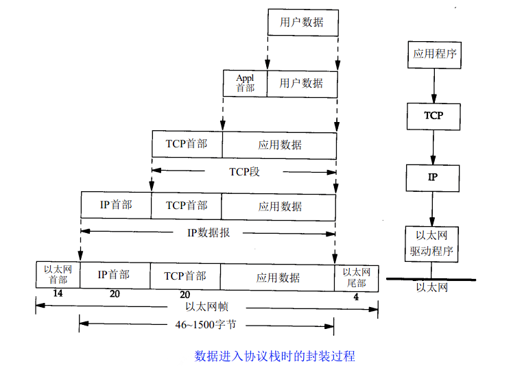
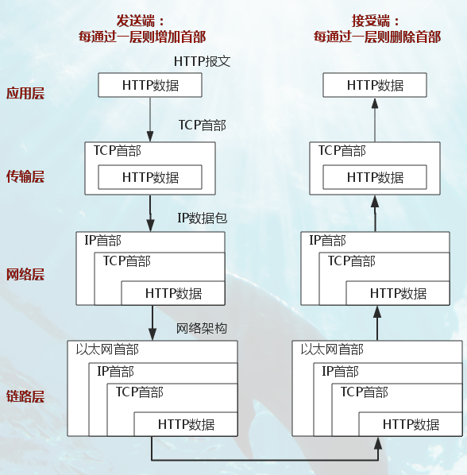
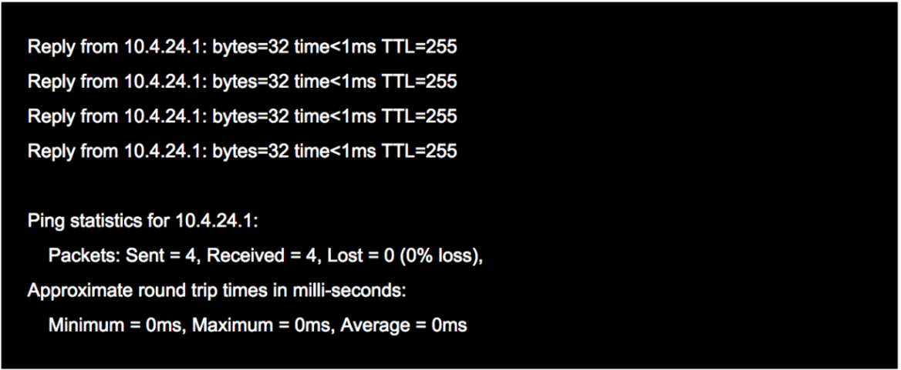
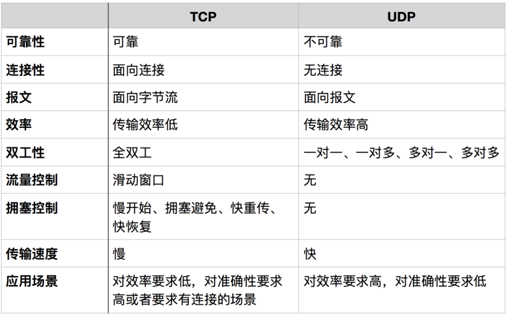
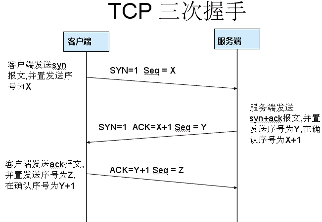
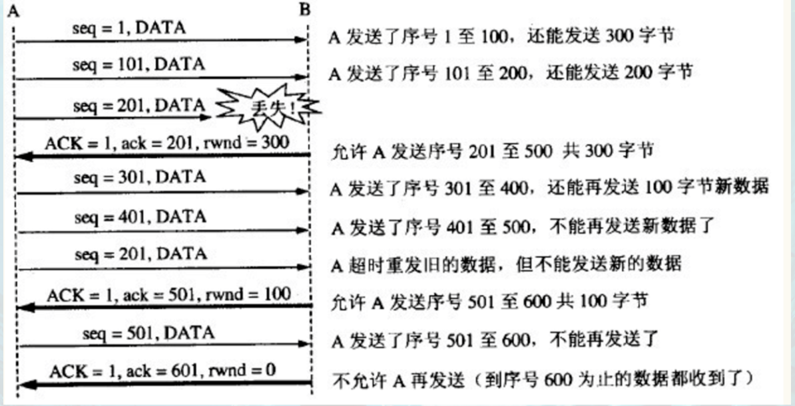
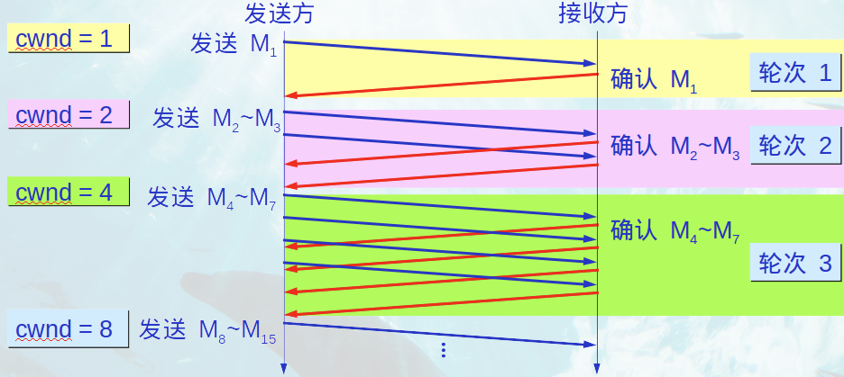
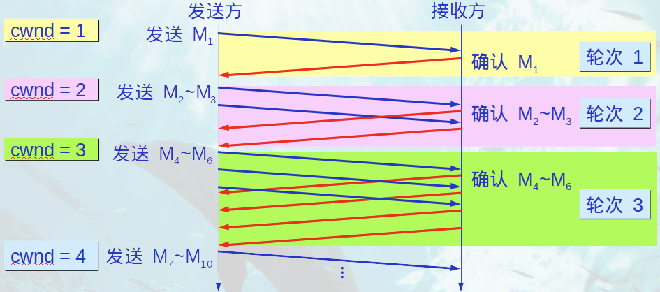
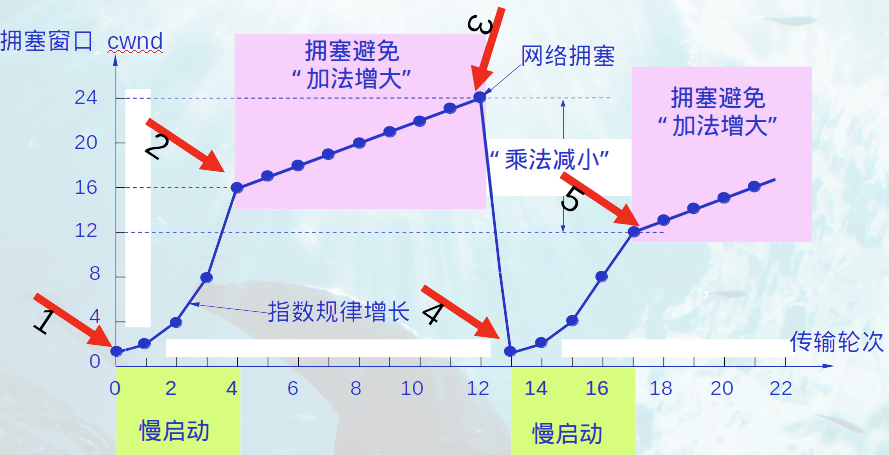
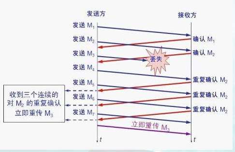

## 一、TCP/IP 模型

TCP/IP 协议模型（Transmission Control Protocol/Internet Protocol），包含了一系列构成互联网基础的网络协议，是 Internet 的核心协议。

基于 TCP/IP 的参考模型将协议分成四个层次，它们分别是链路层、网络层、传输层和应用层。下图表示 TCP/IP 模型与 OSI 模型各层的对照关系。

  
TCP/IP 协议族按照层次由上到下，层层包装。最上面的是应用层，这里面有 http，ftp,等等我们熟悉的协议。而第二层则是传输层，著名的 TCP 和 UDP 协议就在这个层次。

第三层是网络层，IP 协议就在这里，它负责对数据加上 IP 地址和其他的数据以确定传输的目标。第四层是数据链路层，这个层次为待传送的数据加入一个以太网协议头，并进行 CRC 编码，为最后的数据传输做准备。

上图清楚地表示了 TCP/IP 协议中每个层的作用，而 TCP/IP 协议通信的过程其实就对应着数据入栈与出栈的过程。入栈的过程，数据发送方每层不断地封装首部与尾部，添加一些传输的信息，确保能传输到目的地。

出栈的过程，数据接收方每层不断地拆除首部与尾部，得到最终传输的数据。

上图以 HTTP 协议为例，具体说明。

## 二、数据链路层

物理层负责 0、1 比特流与物理设备电压高低、光的闪灭之间的互换。 数据链路层负责将 0、1 序列划分为数据帧从一个节点传输到临近的另一个节点,这些节点是通过 MAC 来唯一标识的(MAC,物理地址，一个主机会有一个 MAC 地址)。

- 封装成帧: 把网络层数据报加头和尾，封装成帧,帧头中包括源 MAC 地址和目的 MAC 地址。
- 透明传输:零比特填充、转义字符。
- 可靠传输: 在出错率很低的链路上很少用，但是无线链路 WLAN 会保证可靠传输。
- 差错检测(CRC):接收者检测错误,如果发现差错，丢弃该帧。

## 三、网络层

### 3.1、IP 协议

IP 协议是 TCP/IP 协议的核心，所有的 TCP，UDP，IMCP，IGMP 的数据都以 IP 数据格式传输。要注意的是，IP 不是可靠的协议，这是说，IP 协议没有提供一种数据未传达以后的处理机制，这被认为是上层协议：TCP 或 UDP 要做的事情。

##### 1）IP 地址

在数据链路层中我们一般通过 MAC 地址来识别不同的节点，而在 IP 层我们也要有一个类似的地址标识，这就是 IP 地址。

32 位 IP 地址分为网络位和地址位，这样做可以减少路由器中路由表记录的数目，有了网络地址，就可以限定拥有相同网络地址的终端都在同一个范围内，那么路由表只需要维护一条这个网络地址的方向，就可以找到相应的这些终端了。

A 类 IP 地址: 0.0.0.0~127.0.0.0
B 类 IP 地址:128.0.0.1~191.255.0.0
C 类 IP 地址:192.168.0.0~239.255.255.0

##### 2） IP 协议头

这里只介绍:八位的 TTL 字段。这个字段规定该数据包在穿过多少个路由之后才会被抛弃。某个 IP 数据包每穿过一个路由器，该数据包的 TTL 数值就会减少 1，当该数据包的 TTL 成为零，它就会被自动抛弃。
这个字段的最大值也就是 255，也就是说一个协议包也就在路由器里面穿行 255 次就会被抛弃了，根据系统的不同，这个数字也不一样，一般是 32 或者是 64。

### 3.2.ARP 及 RARP 协议

ARP 是根据 IP 地址获取 MAC 地址的一种协议。

ARP（地址解析）协议是一种解析协议，本来主机是完全不知道这个 IP 对应的是哪个主机的哪个接口，当主机要发送一个 IP 包的时候，会首先查一下自己的 ARP 高速缓存（就是一个 IP-MAC 地址对应表缓存）。

如果查询的 IP－MAC 值对不存在，那么主机就向网络发送一个 ARP 协议广播包，这个广播包里面就有待查询的 IP 地址，而直接收到这份广播的包的所有主机都会查询自己的 IP 地址，

如果收到广播包的某一个主机发现自己符合条件，那么就准备好一个包含自己的 MAC 地址的 ARP 包传送给发送 ARP 广播的主机。

而广播主机拿到 ARP 包后会更新自己的 ARP 缓存（就是存放 IP-MAC 对应表的地方）。发送广播的主机就会用新的 ARP 缓存数据准备好数据链路层的的数据包发送工作。

RARP 协议的工作与此相反，不做赘述。

### 3.3、 ICMP 协议

IP 协议并不是一个可靠的协议，它不保证数据被送达，那么，自然的，保证数据送达的工作应该由其他的模块来完成。其中一个重要的模块就是 ICMP(网络控制报文)协议。ICMP 不是高层协议，而是 IP 层的协议。

当传送 IP 数据包发生错误。比如主机不可达，路由不可达等等，ICMP 协议将会把错误信息封包，然后传送回给主机。给主机一个处理错误的机会，这 也就是为什么说建立在 IP 层以上的协议是可能做到安全的原因。

## 四、ping

ping 可以说是 ICMP 的最著名的应用，是 TCP/IP 协议的一部分。利用“ping”命令可以检查网络是否连通，可以很好地帮助我们分析和判定网络故障。

例如：当我们某一个网站上不去的时候。通常会 ping 一下这个网站。ping 会回显出一些有用的信息。一般的信息如下:

ping 这个单词源自声纳定位，而这个程序的作用也确实如此，它利用 ICMP 协议包来侦测另一个主机是否可达。原理是用类型码为 0 的 ICMP 发请 求，受到请求的主机则用类型码为 8 的 ICMP 回应。

ping 程序来计算间隔时间，并计算有多少个包被送达。用户就可以判断网络大致的情况。我们可以看到， ping 给出来了传送的时间和 TTL 的数据。

## 五、Traceroute

Traceroute 是用来侦测主机到目的主机之间所经路由情况的重要工具，也是最便利的工具。

Traceroute 的原理是非常非常的有意思，它收到到目的主机的 IP 后，首先给目的主机发送一个 TTL=1 的 UDP 数据包，而经过的第一个路由器收到这个数据包以后，就自动把 TTL 减 1，而 TTL 变为 0 以后，路由器就把这个包给抛弃了，并同时产生 一个主机不可达的 ICMP 数据报给主机。主机收到这个数据报以后再发一个 TTL=2 的 UDP 数据报给目的主机，然后刺激第二个路由器给主机发 ICMP 数据 报。如此往复直到到达目的主机。这样，traceroute 就拿到了所有的路由器 IP。

## 六、TCP/UDP

TCP/UDP 都是是传输层协议，但是两者具有不同的特性，同时也具有不同的应用场景，下面以图表的形式对比分析。

##### 面向报文

面向报文的传输方式是应用层交给 UDP 多长的报文，UDP 就照样发送，即一次发送一个报文。因此，应用程序必须选择合适大小的报文。若报文太长，则 IP 层需要分片，降低效率。若太短，会是 IP 太小。

##### 面向字节流

面向字节流的话，虽然应用程序和 TCP 的交互是一次一个数据块（大小不等），但 TCP 把应用程序看成是一连串的无结构的字节流。TCP 有一个缓冲，当应用程序传送的数据块太长，TCP 就可以把它划分短一些再传送。

关于拥塞控制，流量控制，是 TCP 的重点，后面讲解。

TCP 和 UDP 协议的一些应用

#### 什么时候应该使用 TCP？

当对网络通讯质量有要求的时候，比如：整个数据要准确无误的传递给对方，这往往用于一些要求可靠的应用，比如 HTTP、HTTPS、FTP 等传输文件的协议，POP、SMTP 等邮件传输的协议。

#### 什么时候应该使用 UDP？

当对网络通讯质量要求不高的时候，要求网络通讯速度能尽量的快，这时就可以使用 UDP。

## 七、DNS

DNS（Domain Name System，域名系统），因特网上作为域名和 IP 地址相互映射的一个分布式数据库，能够使用户更方便的访问互联网，而不用去记住能够被机器直接读取的 IP 数串。通过主机名，最终得到该主机名对应的 IP 地址的过程叫做域名解析（或主机名解析）。DNS 协议运行在 UDP 协议之上，使用端口号 53。

## 八、TCP 连接的建立与终止

#### 1.三次握手

TCP 是面向连接的，无论哪一方向另一方发送数据之前，都必须先在双方之间建立一条连接。在 TCP/IP 协议中，TCP 协议提供可靠的连接服务，连接是通过三次握手进行初始化的。三次握手的目的是同步连接双方的序列号和确认号并交换 TCP 窗口大小信息。

第一次握手： 建立连接。客户端发送连接请求报文段，将 SYN 位置为 1，Sequence Number 为 x；然后，客户端进入 SYN_SEND 状态，等待服务器的确认；

第二次握手： 服务器收到 SYN 报文段。服务器收到客户端的 SYN 报文段，需要对这个 SYN 报文段进行确认，设置 Acknowledgment Number 为 x+1(Sequence Number+1)；同时，自己自己还要发送 SYN 请求信息，将 SYN 位置为 1，Sequence Number 为 y；服务器端将上述所有信息放到一个报文段（即 SYN+ACK 报文段）中，一并发送给客户端，此时服务器进入 SYN_RECV 状态；

第三次握手： 客户端收到服务器的 SYN+ACK 报文段。然后将 Acknowledgment Number 设置为 y+1，向服务器发送 ACK 报文段，这个报文段发送完毕以后，客户端和服务器端都进入 ESTABLISHED 状态，完成 TCP 三次握手。

##### 为什么要三次握手？

为了防止已失效的连接请求报文段突然又传送到了服务端，因而产生错误。

具体例子：“已失效的连接请求报文段”的产生在这样一种情况下：client 发出的第一个连接请求报文段并没有丢失，而是在某个网络结点长时间的滞留了，以致延误到连接释放以后的某个时间才到达 server。本来这是一个早已失效的报文段。但 server 收到此失效的连接请求报文段后，就误认为是 client 再次发出的一个新的连接请求。于是就向 client 发出确认报文段，同意建立连接。假设不采用“三次握手”，那么只要 server 发出确认，新的连接就建立了。由于现在 client 并没有发出建立连接的请求，因此不会理睬 server 的确认，也不会向 server 发送数据。但 server 却以为新的运输连接已经建立，并一直等待 client 发来数据。这样，server 的很多资源就白白浪费掉了。采用“三次握手”的办法可以防止上述现象发生。例如刚才那种情况，client 不会向 server 的确认发出确认。server 由于收不到确认，就知道 client 并没有要求建立连接。”

#### 2.四次挥手

当客户端和服务器通过三次握手建立了 TCP 连接以后，当数据传送完毕，肯定是要断开 TCP 连接的啊。那对于 TCP 的断开连接，这里就有了神秘的“四次分手”。

第一次分手： 主机 1（可以使客户端，也可以是服务器端），设置 Sequence Number，向主机 2 发送一个 FIN 报文段；此时，主机 1 进入 FIN_WAIT_1 状态；这表示主机 1 没有数据要发送给主机 2 了；

第二次分手： 主机 2 收到了主机 1 发送的 FIN 报文段，向主机 1 回一个 ACK 报文段，Acknowledgment Number 为 Sequence Number 加 1；主机 1 进入 FIN_WAIT_2 状态；主机 2 告诉主机 1，我“同意”你的关闭请求；

第三次分手： 主机 2 向主机 1 发送 FIN 报文段，请求关闭连接，同时主机 2 进入 LAST_ACK 状态；

第四次分手： 主机 1 收到主机 2 发送的 FIN 报文段，向主机 2 发送 ACK 报文段，然后主机 1 进入 TIME_WAIT 状态；主机 2 收到主机 1 的 ACK 报文段以后，就关闭连接；此时，主机 1 等待 2MSL 后依然没有收到回复，则证明 Server 端已正常关闭，那好，主机 1 也可以关闭连接了。

##### 为什么要四次分手？

TCP 协议是一种面向连接的、可靠的、基于字节流的运输层通信协议。TCP 是全双工模式，这就意味着，当主机 1 发出 FIN 报文段时，只是表示主机 1 已经没有数据要发送了，主机 1 告诉主机 2，它的数据已经全部发送完毕了；但是，这个时候主机 1 还是可以接受来自主机 2 的数据；当主机 2 返回 ACK 报文段时，表示它已经知道主机 1 没有数据发送了，但是主机 2 还是可以发送数据到主机 1 的；当主机 2 也发送了 FIN 报文段时，这个时候就表示主机 2 也没有数据要发送了，就会告诉主机 1，我也没有数据要发送了，之后彼此就会愉快的中断这次 TCP 连接。

##### 为什么要等待 2MSL？

MSL：报文段最大生存时间，它是任何报文段被丢弃前在网络内的最长时间。
原因有二：

- 保证 TCP 协议的全双工连接能够可靠关闭
- 保证这次连接的重复数据段从网络中消失

第一点：如果主机 1 直接 CLOSED 了，那么由于 IP 协议的不可靠性或者是其它网络原因，导致主机 2 没有收到主机 1 最后回复的 ACK。那么主机 2 就会在超时之后继续发送 FIN，此时由于主机 1 已经 CLOSED 了，就找不到与重发的 FIN 对应的连接。所以，主机 1 不是直接进入 CLOSED，而是要保持 TIME_WAIT，当再次收到 FIN 的时候，能够保证对方收到 ACK，最后正确的关闭连接。

第二点：如果主机 1 直接 CLOSED，然后又再向主机 2 发起一个新连接，我们不能保证这个新连接与刚关闭的连接的端口号是不同的。也就是说有可能新连接和老连接的端口号是相同的。一般来说不会发生什么问题，但是还是有特殊情况出现：假设新连接和已经关闭的老连接端口号是一样的，如果前一次连接的某些数据仍然滞留在网络中，这些延迟数据在建立新连接之后才到达主机 2，由于新连接和老连接的端口号是一样的，TCP 协议就认为那个延迟的数据是属于新连接的，这样就和真正的新连接的数据包发生混淆了。所以 TCP 连接还要在 TIME_WAIT 状态等待 2 倍 MSL，这样可以保证本次连接的所有数据都从网络中消失。

## 九、TCP 流量控制

如果发送方把数据发送得过快，接收方可能会来不及接收，这就会造成数据的丢失。所谓流量控制就是让发送方的发送速率不要太快，要让接收方来得及接收。

利用滑动窗口机制可以很方便地在 TCP 连接上实现对发送方的流量控制。

设 A 向 B 发送数据。在连接建立时，B 告诉了 A：“我的接收窗口是 rwnd = 400 ”(这里的 rwnd 表示 receiver window) 。因此，发送方的发送窗口不能超过接收方给出的接收窗口的数值。请注意，TCP 的窗口单位是字节，不是报文段。假设每一个报文段为 100 字节长，而数据报文段序号的初始值设为 1。大写 ACK 表示首部中的确认位 ACK，小写 ack 表示确认字段的值 ack。

从图中可以看出，B 进行了三次流量控制。第一次把窗口减少到 rwnd = 300 ，第二次又减到了 rwnd = 100 ，最后减到 rwnd = 0 ，即不允许发送方再发送数据了。这种使发送方暂停发送的状态将持续到主机 B 重新发出一个新的窗口值为止。B 向 A 发送的三个报文段都设置了 ACK = 1 ，只有在 ACK=1 时确认号字段才有意义。

TCP 为每一个连接设有一个持续计时器(persistence timer)。只要 TCP 连接的一方收到对方的零窗口通知，就启动持续计时器。若持续计时器设置的时间到期，就发送一个零窗口控测报文段（携 1 字节的数据），那么收到这个报文段的一方就重新设置持续计时器。

## 十、TCP 拥塞控制

#### 1.慢开始和拥塞避免

发送方维持一个拥塞窗口 cwnd ( congestion window )的状态变量。拥塞窗口的大小取决于网络的拥塞程度，并且动态地在变化。发送方让自己的发送窗口等于拥塞窗口。

发送方控制拥塞窗口的原则是：只要网络没有出现拥塞，拥塞窗口就再增大一些，以便把更多的分组发送出去。但只要网络出现拥塞，拥塞窗口就减小一些，以减少注入到网络中的分组数。

##### 慢开始算法：

当主机开始发送数据时，如果立即所大量数据字节注入到网络，那么就有可能引起网络拥塞，因为现在并不清楚网络的负荷情况。
因此，较好的方法是 先探测一下，即由小到大逐渐增大发送窗口，也就是说，由小到大逐渐增大拥塞窗口数值。

通常在刚刚开始发送报文段时，先把拥塞窗口 cwnd 设置为一个最大报文段 MSS 的数值。而在每收到一个对新的报文段的确认后，把拥塞窗口增加至多一个 MSS 的数值。用这样的方法逐步增大发送方的拥塞窗口 cwnd ，可以使分组注入到网络的速率更加合理。

每经过一个传输轮次，拥塞窗口 cwnd 就加倍。一个传输轮次所经历的时间其实就是往返时间 RTT。不过“传输轮次”更加强调：把拥塞窗口 cwnd 所允许发送的报文段都连续发送出去，并收到了对已发送的最后一个字节的确认。

另，慢开始的“慢”并不是指 cwnd 的增长速率慢，而是指在 TCP 开始发送报文段时先设置 cwnd=1，使得发送方在开始时只发送一个报文段（目的是试探一下网络的拥塞情况），然后再逐渐增大 cwnd。

为了防止拥塞窗口 cwnd 增长过大引起网络拥塞，还需要设置一个慢开始门限 ssthresh 状态变量。慢开始门限 ssthresh 的用法如下：

- 当 cwnd < ssthresh 时，使用上述的慢开始算法。

- 当 cwnd > ssthresh 时，停止使用慢开始算法而改用拥塞避免算法。

- 当 cwnd = ssthresh 时，既可使用慢开始算法，也可使用拥塞控制避免算法。

  ##### 拥塞避免

  让拥塞窗口 cwnd 缓慢地增大，即每经过一个往返时间 RTT 就把发送方的拥塞窗口 cwnd 加 1，而不是加倍。这样拥塞窗口 cwnd 按线性规律缓慢增长，比慢开始算法的拥塞窗口增长速率缓慢得多。

  

无论在慢开始阶段还是在拥塞避免阶段，只要发送方判断网络出现拥塞（其根据就是没有收到确认），就要把慢开始门限 ssthresh 设置为出现拥塞时的发送 方窗口值的一半（但不能小于 2）。然后把拥塞窗口 cwnd 重新设置为 1，执行慢开始算法。

这样做的目的就是要迅速减少主机发送到网络中的分组数，使得发生 拥塞的路由器有足够时间把队列中积压的分组处理完毕。

如下图，用具体数值说明了上述拥塞控制的过程。现在发送窗口的大小和拥塞窗口一样大。

#### 2.快重传和快恢复

##### 快重传

快重传算法首先要求接收方每收到一个失序的报文段后就立即发出重复确认（为的是使发送方及早知道有报文段没有到达对方）而不要等到自己发送数据时才进行捎带确认。

接收方收到了 M1 和 M2 后都分别发出了确认。现在假定接收方没有收到 M3 但接着收到了 M4。

显然，接收方不能确认 M4，因为 M4 是收到的失序报文段。根据 可靠传输原理，接收方可以什么都不做，也可以在适当时机发送一次对 M2 的确认。

但按照快重传算法的规定，接收方应及时发送对 M2 的重复确认，这样做可以让 发送方及早知道报文段 M3 没有到达接收方。发送方接着发送了 M5 和 M6。接收方收到这两个报文后，也还要再次发出对 M2 的重复确认。这样，发送方共收到了 接收方的四个对 M2 的确认，其中后三个都是重复确认。

快重传算法还规定，发送方只要一连收到三个重复确认就应当立即重传对方尚未收到的报文段 M3，而不必 继续等待 M3 设置的重传计时器到期。

由于发送方尽早重传未被确认的报文段，因此采用快重传后可以使整个网络吞吐量提高约 20%。

##### 快恢复

与快重传配合使用的还有快恢复算法，其过程有以下两个要点：

- 当发送方连续收到三个重复确认，就执行“乘法减小”算法，把慢开始门限 ssthresh 减半。
- 与慢开始不同之处是现在不执行慢开始算法（即拥塞窗口 cwnd 现在不设置为 1），而是把 cwnd 值设置为 慢开始门限 ssthresh 减半后的数值，然后开始执行拥塞避免算法（“加法增大”），使拥塞窗口缓慢地线性增大。
  
