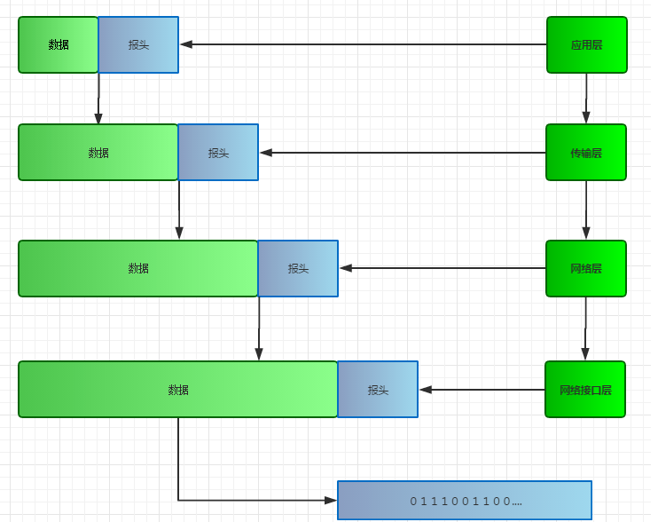

## 1.什么是 TCP/IP

**TCP/IP 是一套用于网络通信的协议集合或者系统。TCP/IP 协议模型就有 OSI 模型分为 7 层。但其实一般我们所谈到的都是四层的 TCP/IP 协议栈。**

**网络接口层：主要是指一些物理层层次的接口，比如电缆等**

**网络层：提供了独立于硬件的逻辑寻址，实现物理地址和逻辑地址的转换。网络层协议包括 IP 协议（网际协议），ICMP 协议（互联网控制报文协议），IGMP 协议(Internet 组协议管理)**

**传输层：为网络提供了流量控制，错误控制和确认服务。传输层有两个互不相同的传输协议：TCP（传输控制协议）、UDP（用户数据报协议）**

**应用层：为文件传输，网络排错和 Internet 操作提供具体的程序应用**

## **2.数据包**

**在 TCP/IP 协议中数据由上至下将数据封装成包，然后再由下至上的拆包。那么数据又是怎么打包的呢？**

**在装包的时候，每一层都会增加一些信息用于传输，这部分信息叫做\*\*报头\*\*。当上层数据到达本层的时候，会将数据加上报头打包在一起形成新的数据包继续往下一层传递。拆包的时候就是反着来了，就像俄罗斯套娃一样，拆完最外面一层得到需要的报头，向上传递。**

### 接下来由上至下的分析整个 TCP/IP 协议的工作过程

### 1.应用层

**应用层作为 TCP/IP 协议的最上层，其实是我们接触最多的。**

**由于在传输层的传输协议大致分成了 TCP 和 UDP，所以在应用层对应的协议也就分成了两部分。**

### 运行在 TCP 协议上的协议：

- HTTP（Hypertext Transfer Protocol，超文本传输协议），主要用于普通浏览。
- HTTPS（Hypertext Transfer Protocol over Secure Socket Layer, or HTTP over SSL，安全超文本传输协议）,HTTP 协议的安全版本。
- FTP（File Transfer Protocol，文件传输协议），由名知义，用于文件传输。
- POP3（Post Office Protocol, version 3，邮局协议），收邮件用。
- SMTP（Simple Mail Transfer Protocol，简单邮件传输协议），用来发送电子邮件。
- TELNET（Teletype over the Network，网络电传），通过一个终端（terminal）登陆到网络。
- SSH（Secure Shell，用于替代安全性差的 TELNET），用于加密安全登陆用。

### 运行在 UDP 协议上的协议：

- BOOTP（Boot Protocol，启动协议），应用于无盘设备。
- NTP（Network Time Protocol，网络时间协议），用于网络同步。
- DHCP（Dynamic Host Configuration Protocol，动态主机配置协议），动态配置 IP 地址。

**Http 协议的工作流程**

**一次 Http 操作称为一个事务，其整个工作流程如下：**

**1）地址解析**

**比如客户端浏览器请求浏览页面：www.baidu.com。其实这是一个默认路径，因为平常默认会省略协议名、端口号，访问主页的时候路径也会省略，所以完整路径写法是[http://www.baidu.com:80/index.html](http://www.baidu.com/index.html)。这就是我们常说的 URL 统一资源定位符，用来定位我们访问资源在服务器上的位置。**

**从这个 URL 中可以分解出协议名、主机名、端口号、访问对象的路径**

- 协议名：http
- 主机名：[www.baidu.com](http://www.baidu.com/index.html)
- 端口号：80（http 协议的默认端口）
- 路径：[/index.html](http://www.baidu.com/index.html)

**在这时候需要域名系统 DNS 协议解析域名，得到主机的 ip。**

**2）封装 http 请求数据包**

**将以上部分（我们想要访问的服务器页面资源）结合自己的本机信息生成一个请求数据报文，封装成一个 HTTP 请求数据包。至于 http 的请求数据报文什么样，[点击这个](https://blog.csdn.net/weixin_42621338/article/details/84574977)。**

**DNS 协议工作流程**

**1）通过域名访问网页**

**2）计算机会先将域名发送到一个解析域名的服务器上**

- 在其服务器上有很多服务器，能解析各种各样的域名，比如有专门解析.org 的，解析.com 的，解析.net 的。等等，最主要的有一个根域名服务器
- 域名解析(在服务器上查找 IP 地址)的过程有两种算法，迭代查询，递归查询。一般是两种查询的结合
- 本机计算机找到其中一台解析域名的服务器(可能是.com)，如果没有找到对应的 IP 地址，那么就会去找根域名服务器，根域名服务器知道所有的子服务器，所以他肯定知道该域名所对应的 IP 地址在那个子服务器中，所以告诉第一次查询的服务器要他去另一台服务器上找，找到了，就将其返回给计算机，以后在有另一台计算机也通过这个域名访问，那么第一台服务器会有原来的域名 IP 地址的缓存，就不用去找根服务器了。

**3）找到服务器 ip 地址就可以访问了**

#

### 2.传输层

**http 封装请求数据包以后传给传输层，tcp 协议部分开始运作。这里将数据包和 TCP 报头生成 TCP 报文，打包成新的数据包。**

**TCP 报文结构（[点击查看详情](https://www.cnblogs.com/zhangyinhua/p/7610922.html#_lab2_2_0)）：**

> **为了完成三次挥手四次握手，这里需要知道序列号 seq、确认应答序号 ack（小写字母）、控制位：**
>
> **序列号 seq：**
>
> 因为在 TCP 是面向字节流的，他会将报文都分成一个个字节，给每个字节进行序号编写，比如一个报文有 900 个字节组成，那么就会编成 1-900 个序号，然后分几部分来进行传输，
>
> 比如第一次传，序列号就是 1，传了 50 个字节， 那么第二次传，序列号就为 51，所以序列号就是传输的数据的第一个字节相对所有的字节的位置。
>
> **确认应答 ack：**
>
> 如刚说的例子，第一次传了 50 个字节给对方，对方也会回应你，其中带有确认应答，就是告诉你下一次要传第 51 个字节来了，所以这个确认应答就是告诉对方下一次要传第多少个字节了。也就是说告诉序列号下一次从哪里开始
>
> **控制位目前有 6 个**
>
> URG:紧急，当 URG 为 1 时，表名紧急指针字段有效，标识该报文是一个紧急报文，传送到目标主机后，不用排队，应该让该报文尽量往下排，让其早点让应用程序给接受。
>
> ACK:确认，当 ACK 为 1 时，确认序号才有效。当 ACK 为 0 时，　　　　确认序号没用
>
> PSH：推送，当为 1 时，当遇到此报文时，会减少数据向上交付，本来想应用进程交付数据是要等到一定的缓存大小才发送的，但是遇到它，就不用在等足够多的数据才向上交付，
>
> 而是让应用进程早点拿到此报文，这个要和紧急分清楚，紧急是插队，但是提交缓存大小的数据不变，这个推送就要排队，但是遇到他的时候，会减少交付的缓存数据，提前交付。
>
> RST:复位，报文遇到很严重的差错时，比如 TCP 连接出错等，会将 RST 置为 1，然后释放连接，全部重新来过。
>
> SYN：同步，在进行连接的时候，也就是三次握手时用得到，下面会具体讲到，配合 ACK 一起使用
>
> FIN：终止，在释放连接时，也就是四次挥手时用的。

### **三次握手：**

**在通信之前，会先通过三次握手的机制来确认两端口之间的连接是否可用。而 UDP 是不需要确认的，直接传**

> **最开始的时候客户端和[服务器](https://www.baidu.com/s?wd=服务器&tn=24004469_oem_dg&rsv_dl=gh_pl_sl_csd)都是处于 CLOSED 状态。主动打开连接的为客户端，被动打开连接的是服务器。**
>
> **某个时刻客户端和服务器要进行通信，此时双方都有备好的端口，服务器的端口会处于监听状态，等待客户端的连接。**

**怎么知道服务器端口号的？**

http 在访问 url 中已经拿到！

**怎么知道客户端要连接进来，服务器才进入 listen 状态？**

TCP 老早就创建了传输控制块 TCB，时刻待命准备接受客户端的连接请求，此时服务器就被动地进入了 listen 状态。

**第一次握手：**

客户端想要连接，创建传输控制块 TCB，状态变为主动打开。发送给服务器不包含数据内容的连接请求报文。该请求报文首部中同步位 SYN=1，同时选择一个初始序列号 seq=x（携带了 x 个字节）。然后客户端进入 SYN-SENT （同步已发送）状态，告诉服务器我想和你同步连接。TCP 规定，SYN 报文段（SYN=1 的报文段）不能携带数据，但需要消耗掉一个序号。

**第二次握手：**

TCP 服务器收到连接请求报文，如果同意连接则发送确认报文。为了保证下次客户端发送报文时 seq 序列号是正确的，需要发送确认号 ack=x+1，同时确认号 ack 要生效必须发送 ACK=1，再加上同步位 SYN=1，序列号 seq=y（携带 Y 个字节），然后服务器也进 入 SYN-RCVD (同步已收到) 状态，完成同步连接。这个报文也是 SYN 报文，也不能携带数据，但是同样要消耗一个序号。

**第三次握手：**

客户端收到确认后还要再向服务器发送确认报文。确认报文已经不是请求报文 SYN 了，不再包含 SYN 同步位。发送的内容有序列号 seq=x+1（和第二次握手的 ACK 对应），确认号 ack=y+1，ACK=1。客户端发送确认报文以后进入 ESTABLISHED（已建立）状态，服务器接收到确认报文以后也进入 ESTABLISHED 状态。此时 TCP 连接完成建立。

**然后就可以发送 TCP 接收到 Http 的数据包后生成的新数据包了！**

> **但是貌似看起来两次握手请求就可以完成事，为什么非要三次握手呢？**
>
> 主要是为了防止已经失效的连接请求报文突然又传到了服务器，从而产生错误。
>
> 如果是两次握手，假设一种情景：客户端发送了第一个请求连接报文并未丢失，只是因为网络问题在网络节点中滞留太久了。由于客户端迟迟没有收到确认报文，以为服务器没有收到。于是再发送一条请求连接报文，此时一路畅通完成两次握手建立连接，传输数据，关闭连接。然后那个前一条龟速的请求报文终于走到了服务器，再次和服务器建立连接，这就造成了不必要的资源浪费。
>
> 如果是三次握手，就算那一条龟速的请求报文最后到达了服务器，然后服务器也发送了确认连接报文，但是此时客户端已经不会再发出确认报文了，服务器也接受不到确认报文，于是无法建立连接。

### 四次挥手：

**数据传输完毕后，双方都可释放连接。最开始的时候，客户端和服务器都是处于 ESTABLISHED 状态，然后客户端主动关闭，服务器被动关闭。**

**第一次挥手：**

客户端从 ESTABLISHED 状态变为主动关闭状态，客户端发送请求释放连接报文给服务器，FIN=1，seq=u（等于前面已经传送过来的数据的最后一个字节的序号加 1），此时客户端进入 FIN-WAIT-1（终止等待 1）状态。 TCP 规定，FIN 报文段即使不携带数据，也要消耗一个序号。

**第二次挥手：**

服务器接收到客户端发来的请求释放报文以后，发送确认报文告诉客户端我收到了你的请求，内容差不多就是 seq=v，ack=u+1，ACK=1，此时服务器进入 CLOSE-WAIT（关闭等待）状态。

为什么是 CLOSE-WAIT 状态？可能自己服务器这端还有数据没有发送完，所以这个时候整个 TCP 的连接就变成了半关闭状态。服务器还能发送数据，客户端也能接收数据，但客户端不能再发送数据了，只能发送确认报文。

客户端接收到服务器传来的确认报文以后，进入 FIN-WAIT-1（终止等待 2）状态，等待服务器发送连接释放的报文（在这之前，还需要接受服务器没有发送完的最后的数据）。

**第三次挥手：**

服务器所有的数据都发送完了，认为可以关闭连接了，于是向客户端发送连接释放报文，内容 FIN=1，seq=w，ack=u+1（客户端没发送消息，所以提醒客户端下一次还是从 u+1 开始发送序列），ACK=1。此时服务器进入了 LAST-ACK（最后确认）状态，等待客户端发送确认报文。

**第四次挥手：**

客户端接收到了服务器发送的连接释放报文，必须发出确认。确认报文 seq=u+1，ack=w+1，ACK=1。此时客户端进入 TIME-WAIT （时间等待）状态，但是没有立马关闭。此时 TCP 连接还没有释放，必须经过 2∗∗MSL（最长报文段寿命）的时间后，当客户端撤销相应的 TCB 后，才进入 CLOSED 状态。

因为这个确认报文可能丢失。服务器收不到确认报文心想这可能是我没传到或者丢失了啊，于是服务器再传一个 FIN，然后客户端再重新发送一个确认报文。然后刷新 2∗∗MSL 时间。直到这个时间内收不到 FIN 连接释放报文，客户端撤销 TCB 进入 CLOSE 状态。

而服务器，在接收到确认报文的时候就立马变为 CLOSE 状态了。所以服务器结束 TCP 连接的时间略早于客户端。

> **万一确认连接以后客户端故障怎么办？**
>
> TCP 设有一个保活计时器。显然客户端故障时服务器不会智障般等下去，白白浪费资源。服务器每次收到一次客户端的请求以后都会刷新这个保活计时器，时间通常设置为 2 小时。若 2 个小时依旧没有收到客户端的任何数据，服务器会发送一个探测报文段，每隔 75 分钟发一个，如果连发十个都没有数据反应，那么服务器就知道客户端故障了，关闭连接。

## 3.网络层

**TCP 数据包到了这一层，再加上 IP 报文生成新的 IP 数据包**

**前面有提到网络层主要负责物理地址（mac）和逻辑地址（ip）的转换。**

**ICMP（Internet Control Message Protocol：互联网控制消息协议）：主要负责网络层和传输层的数据交换，是为了更有效地转发 IP 数据报文和提高数据报文交付成功的机会，是介于传输层和网络层之间的协议。**

**ARP（Address Resolution Protocol：地址解析协议）：主要是将 IP 地址解析成 MAC 地址的协议。**

**RARP（Reverse Address Resolution Protocol：逆地址解析协议）\*\***：正好相反，是将 MAC 地址解析成 IP 地址的协议。\*\*

**IP 协议（Internet Protocol：网际协议）：是 TCP/IP 协议族中最为核心的协议。它提供\*\*不可靠、无连接\*\*的服务，也即依赖其他层的协议进行差错控制。**

**报文结构格式（[了解更多](https://www.cnblogs.com/BrokenSwitch/p/8473472.html)）：**

**再谈谈 IP 地址 ：**

**TCP/IP 协议网络上每个网络适配器都有一个唯一的 ip 地址**

**IP 地址是一个 32 位的地址,这个地址通常分成 4 端，每 8 个二进制为一段，但是为了方便阅读，通常会将每段都转换为十进制来显示，比如大家非常熟悉的 192.168.0.1（本地局域网）**

**IP 地址分为两部分，一部分是网络 ID，另一部分是主机 ID。但是具体哪一部分是网络 D，哪一部分是主机 ID 并没有明确规定。因为有的网络需要主机很少，因此较短；而有些比较长，因此主机 ID 较长。**

**绝大部分 IP 地址属于以下几类**

**A 类地址：IP 地址的前 8 位代表网络 ID ，后 24 位代表主机 ＩＤ
​ B 类地址：IP 地址的前 16 位代表网络 ID ，后 16 位代表主机 ＩＤ
​ C 类地址：IP 地址的前 24 位代表网络 ID ，后 8 位代表主机 ＩＤ
从以下的图中就可以很简单区分 IP 地址属于哪一类了，比如我的 ip 地址 192.168.0.1 就是属于 C 类**

**注意： 1.十进制第一段大于 223 的属于 D 类和 E 类地址，这两类比较特殊也不常见，这里就不做详解介绍了。 2.每一类都有一些排除地址，这些地址并不属于该类，他们是在一些特殊情况使用地址 3.除了这样的方式来划分网络，我们还可以把每个网络划分为更小的网络块，称之为子网**

## **4.网络接口层（[更多](https://www.cnblogs.com/zhangyinhua/category/1086895.html)）**

**其实这里还可以分为数据链路层和物理层**

**这一层主要涉及到一些物理传输，比如以太网，无线局域网，电缆等**

**IP 数据包到了这层就不一样了啊！数据链路会在 IP 数据报的首尾加上首部和尾部代表数据包的结束，封装成帧。首部和尾部都是 8 位 2 进制表示，可以一样也可以不一样。**

#### **那么具体数据包在链路层是怎么传递的呢？**

**链路：一条点到点的物理线路段，中间没有任何其他的交换结点，通俗的将，就是一根线，其中不经过任何东西，这样的就是链路，一条链路只是一条通路的一个组成部分**

**数据链路：除了物理线路外，还必须有通信协议来控制这些数据的传输。若把实现这些协议的硬件和软件加到链路上，就构成了数据链路。 通俗讲，就是经过了一些交换机呀，什么的。**

**最终到达目的地，所有路段就是数据链路，而数据链路中就包含了多段链路。**

**适配器：也就是网卡，就是用来实现数据链路上一些协议。**

**帧：数据链路层上传送的就是帧**

#### 如果再往下到物理层呢？就成为比特流传输了。

至此，一个请求就完成了由应用层到物理层的传递。在各种交换机中找到最后的服务器地址。然后再把数据封装反着来一遍。再将请求一步步封装传出去，同样的方式由客户端拿到数据，Http 协议解析读取显示。
