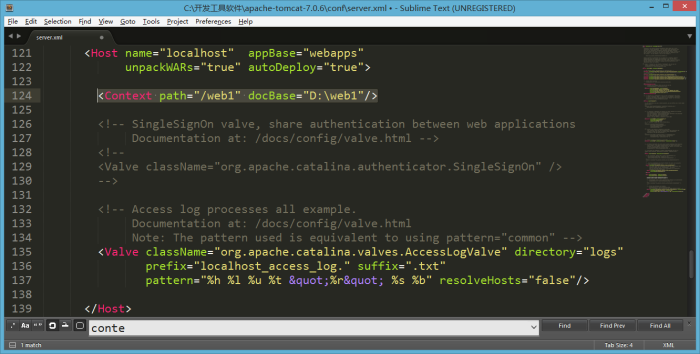

## 1.javaweb

javaweb 是指，所有通过 java 语言编写可以通过游览器访问的程序的总称叫 javaweb

javaweb 是基于请求和响应来开发的。

请求

请求是指客户端给服务器发送数据叫做 Request

响应

响应是指服务端回转数据叫做 Response

请求和响应

请求和和响应是成对出现的，有请求就有响应。


## 2.Web 资源的分类

Web 资源按实现的计数和呈现的效果的不同，又分为静态资源和动态资源

静态资源：html css js txt mp4 视频 jpg 图片

动态资源：jsp 页面 servlet 程序

## 3.常用 Web 服务器

Tomcat：由 Apache 阻止提供的一种 Web 服务器，提供对 jsp 和 Servlet 的支持。它是一种轻量级的 javaWeb 容器（服务器）
Jboss：一种遵从 javaEE 规范的、开放源代码的、纯 java 的 EJB 服务器，它支持所有的 javaEE 规范（免费）

GlassFish：由 Oracle 公司开发的一款 JavaWeb 服务器，是一款强健的商业服务器，达到产品级质量（应用很少）

Resin：是 CAUCHO 公司的产品，是一种非常流行的服务器，对 servlet 和 JSP 提供了良好的支持，性能比较优良。resin 自身采用 JAVA 语言开发

Weblogic：是 Oracle 公司的产品，是目前应用最广泛服务器，支持 javaEE 规范，而且不断的完善以适应新的开发要求，适合大型项目（收费 适合大公司）

Tomcat 服务器和 Servlet 版本对应的关系

| Tomcat 版本 | Servlet/JSP 版本 | JavaEE 版本 | 运行环境 |
| ----------- | ---------------- | ----------- | -------- |
| 4.1         | 2.3/1.2          | 1.3         | JDK1.3   |
| 5.0         | 2.4/2.0          | 1.4         | JDK1.4   |
| 5.5/6.0     | 2.5/2.1          | 5.0         | JDK5.0   |
| 7.0         | 3.0/2.2          | 6.0         | JDK6.0   |
| 8.0         | 3.1/2.3          | 7.0         | JDK7.0   |

Servlet 程序从 2.5 版本是现在世面使用最多的版本（xml 配置）

到了 Servlet3.0 之后。就是注解版本的 Servlet 是使用

## 4.Tomcat 介绍

### 1.什么是 Tomcat

Tomcat 简单的说就是一个运行 JAVA 的网络服务器，底层是 Socket 的一个程序，它也是 JSP 和 Serlvet 的一个容器。

### 2.为什么我们需要用到 Tomcat

如果你学过 html，css，你会知道你写的页面只能自己访问，别人不能远程访问你写的页面，**Tomcat 就是提供能够让别人访问自己写的页面的一个程序**


## 5.Tomcat 使用

常见错误： 可能与其他服务的端口号冲突
tomcat 端口号默认 8080 （此端口号较为常见，容易冲突），建议修改此端口 （8888）

修改端口号：

### 5.1 找到 Tomcat 配置文件


### 5.2 修改 Tomcat 配置文件


### 5.3 访问 tomcat

两种方式

1. 双击 bin/startup.bat 启动 Tomcat


2. windows 管理提示符

window 键+R 输入 cmd


http://localhost:8888/

### 5.4 访问 Tomcat 下的 web 工程

第一种部署方式

游览器中输入访问地址格式

http://ip:port/工程名/目录下/文件夹

第二种部署方式

找到 Tomcat 下的 conf 目录\catalina\localhost\ 创建如下的配置文件

```
<!-- Context表示一个工程上下文
path表示工程访问路径：/abc
docBase表示你的工程目录-->
<Context path="/abc" docBase="E:/book">
```

手托 html 页面和浏览器输入地址访问


ROOT 的工程访问，以及默认 index.html 页面的访问

| http://ip:port/        | 没有工程名的时候，默认访问 ROOT 工程     |
| ---------------------- | ---------------------------------------- |
| http://ip:port/工程名/ | **没有资源名，默认访问 index.html 页面** |

动态 Web 介绍：


常见状态码：
200：一切正常
300/301: 页面重定向 （跳转）
404:资源不存在
403：权限不足 （如果访问 a 目录，但是 a 目录设置 不可见）
500：服务器内部错误（代码有误）

## 6.配置虚拟目录

### 6.1 为什么需要配置虚拟目录？

如果把所有 web 站点的目录都放在 webapps 下，可能导致磁盘空间不够用，也不利于对 web 站点目录的管理【如果存在非常多的 web 站点目录】
把 web 站点的目录分散到其他磁盘管理就需要配置虚拟目录【默认情况下，只有 webapps 下的目录才能被 Tomcat 自动管理成一个 web 站点】
把 web 应用所在目录交给 web 服务器管理，这个过程称之为虚拟目录的映射

### 6.2 配置虚拟目录方法一

在其他盘符下创建一个 web 站点目录，并创建 WEB-INF 目录和一个 html 文件。


找到 Tomcat 目录下`/conf/server.xml`文件


在 server.xml 中的`<Host>`节点下添加如下代码。path 表示的是访问时输入的 web 项目名，docBase 表示的是站点目录的绝对路径

```xml
<Context path="/web1" docBase="D:\web1"/>
```

访问配置好的 web 站点



### 6.3 配置虚拟目录方法二

进入到`conf\Catalina\localhost`文件下，创建一个 xml 文件，该文件的名字就是站点的名字。

xml 文件的代码如下，docBase 是你 web 站点的绝对路径

```xml
<?xml version="1.0" encoding="UTF-8"?>
<Context
    docBase="D:\web1"
    reloadable="true">
</Context>
```

访问 web 站点下的 html 资源


## 7.配置临时域名

访问 Tomcat 服务器有好几种方式

- 使用 localhost 域名访问【localhost 代表本机】
- 使用 ip 地址 127.0.0.1 访问【该 ip 地址也是本机】
- 使用机器名称访问【只限用于本机上或者局域网】
- 使用本机 IP 地址访问【在 cmd 中输入 ipconfig 可以查询到本机 IP 地址】
- 还可以为机器配置临时域名

### 7.1 配置临时域名步骤

- 打开到 C:\Windows\System32\drivers\etc 下，找到 hosts 文件


- 在 hosts 文件下配置临时域名


## 8.设置虚拟主机

### 8.1 什么是虚拟主机？

多个不同域名的网站共存于一个 Tomcat 中

### 8.2 为什么需要用到虚拟主机？

例子：我现在开发了 4 个网站，有 4 个域名。如果我不配置虚拟主机，一个 Tomcat 服务器运行一个网站，我就需要 4 台电脑才能把 4 个网站运行起来。

### 8.3 配置虚拟主机的步骤

在 tomcat 的 server.xml 文件中添加主机名

```xml
<Host name="zhongfucheng" appBase="D:\web1">
  <Context path="/web1" docBase="D:\web1"/>
</Host>
```


访问虚拟主机下的 web 站点


## 9.Tomcat 体系结构


## 10.浏览器访问 WEB 资源的流程图


