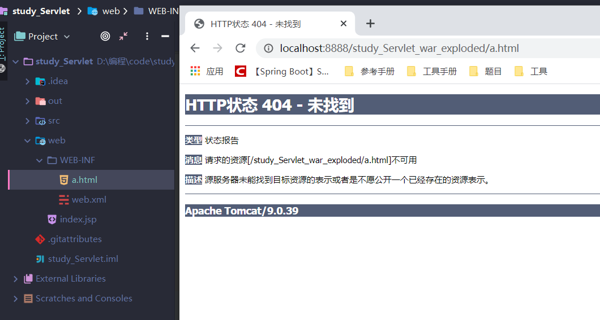
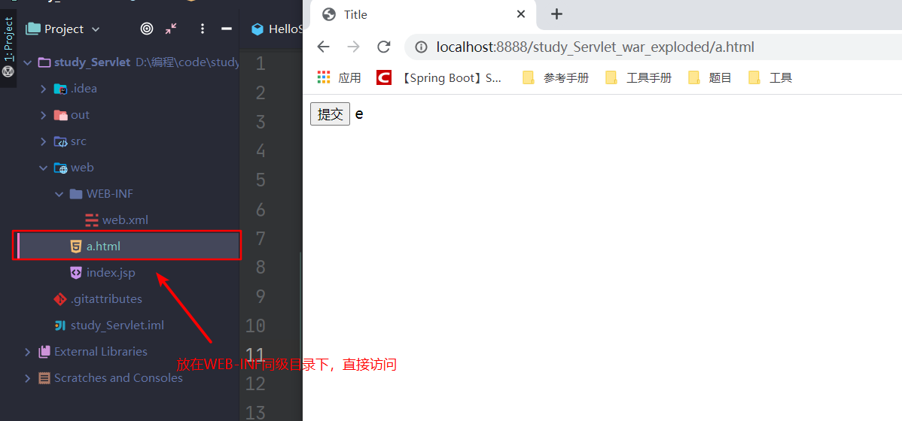
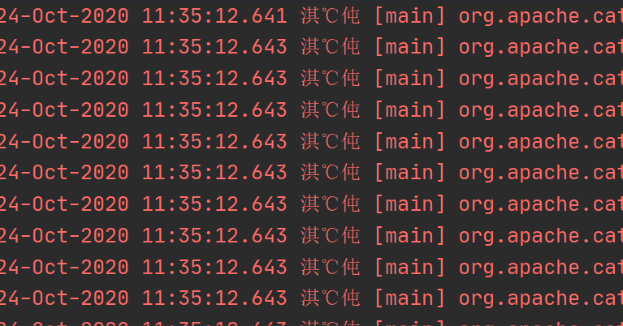
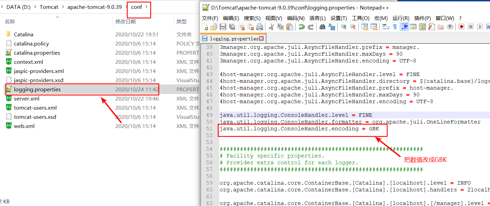
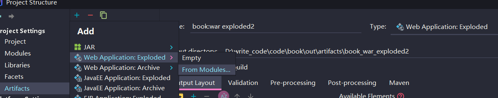
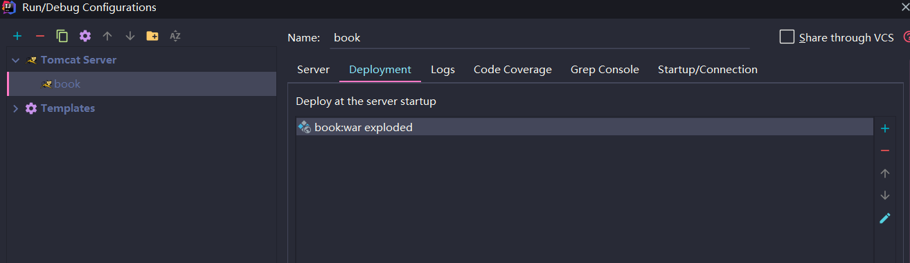
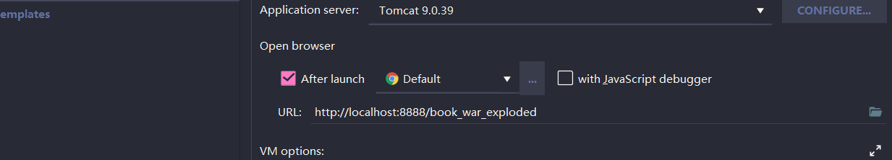

## Tomcat WEB-INF 目录下的文件无法直接访问



当浏览器访问 `Result.jsp` 时，无法正常显示，通过了解才得知，原来 Tomcat WEB-INF 目录下的文件，浏览器一般无法直接方法，只能通过重定向后才可以访问，如果需要直接访问，可以放在和 WEB-INF 同级目录下。

解决方案:

如果需要直接访问，可以放在和 WEB-INF 同级目录下。



## Tomcat 启动服务出现乱码



解决方法：

1. 找到 tomcat 目录，进入 conf 文件。
2. 修改 java.util.logging.ConsoleHandler.encoding 参数。 将 UTF-8 改为 GBK



## Tomcat 如何部署 web 项目

1. 引入 web 工程



2. tomcat 添加部署环境



3. 修改 url

```
ip:port/环境部署名
```



3、Artifacts:重要的一环，一个 module 有了 Artifacts 才可以部署到 web 应用服务器上；选择+添加 Artifacts，此时可以选择上述两种方式中的一种：  
3-1、Web Application:Exploded（文件夹方式）：
output layout：是 web 程序的根目录文件夹，比如我这个是 WebRoot;
output directory：这个根目录下的文件部署到哪里，比如我这里用 tomcat，就在 webapps 下创建一个文件夹存放（注意：在 idea 中启动 tomcat 时，访问路径不是创建的这个文件夹名称，具体看 4-3）
3-2、web application archive（打 war 包方式）

output directory：此时指的是 war 包存放路径，也就是打好的 war 包放到哪里；

output layout:很关键，需要添加 directory contents,选择的是 WebRoot,也就是把 WebRoot 下的文件打包；

4、最后，添加 tomcat，做相应配置，把之前配置好的 Artifacts 部署到 web 容器上；

4-1、添加 tomcat,自己随意命名（只是容器的名字，无关其他）

ya

4-2、做 tomcat 配置，选择 tomcat，配置 JRE，配置端口号等，不再详述；

4-3、把你之前配置好的 Artifacts 部署到 tomcat 中：

**注意：application coontext 的配置，这里才是决定访问路径的，可以为空（即平时大家说的 url 中不加项目名称）**
